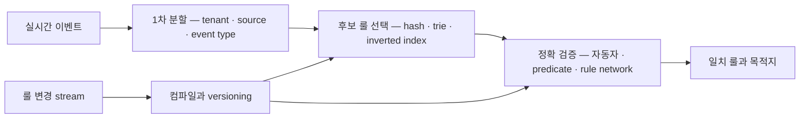
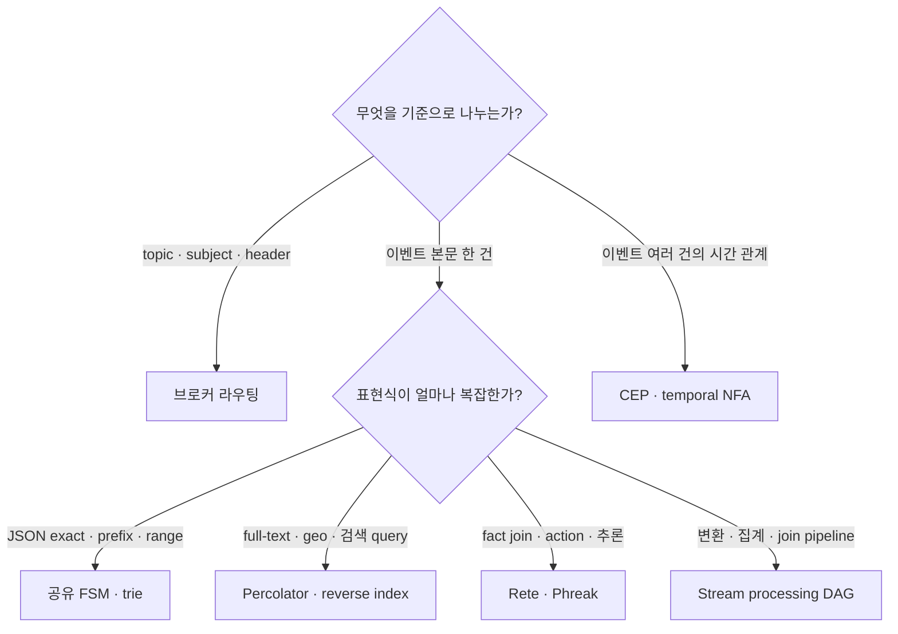
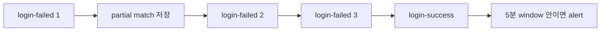
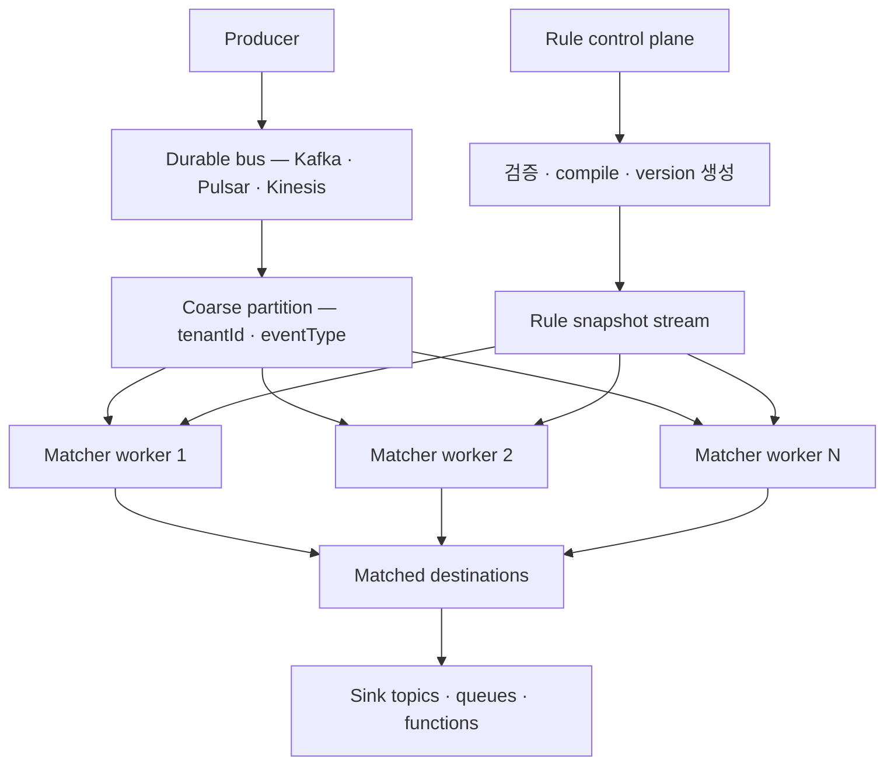

# 실시간 이벤트 룰 필터링·라우팅 기술 지도

> 조사 기준일: 2026-08-07<br>
> 범위: 대량 이벤트를 많은 동적 룰과 비교해 필터링하거나 하나 이상의 목적지로 라우팅하는 기술과 알고리즘

## 0. 먼저 답하면

**“이벤트마다 모든 룰을 독립적으로 순회하지 않고, 룰을 미리 컴파일·색인해 공유 경로로 평가한다”는 원리는 널리 사용된다.** 다만 Event Ruler의 `NameState + ByteMachine` 이중 자동자 구현이 모든 시스템의 표준은 아니다.

실무에서는 문제의 모양에 따라 다음 계열을 선택하거나 조합한다.

1. topic·subject·routing key처럼 envelope만 보는 **브로커 라우팅**
2. Event Ruler처럼 JSON 한 건을 많은 패턴과 비교하는 **공유 자동자**
3. Elasticsearch Percolator처럼 query를 저장하고 document를 넣는 **역검색·역색인**
4. Drools처럼 fact와 rule의 부분 일치를 기억하는 **Rete·Phreak 룰 엔진**
5. 여러 이벤트의 순서와 시간을 보는 **CEP NFA**
6. Kafka Streams·Flink처럼 filter, join, window를 연결하는 **분산 스트림 처리 DAG**

그리고 트래픽과 룰이 모두 매우 크면 한 기술만 쓰기보다 다음처럼 **싼 조건으로 먼저 줄이는 계층형 구조**가 가장 일반적인 설계다.



이 구조의 목표는 `모든 이벤트 × 모든 룰`을 `이벤트 × 작은 후보 집합`으로 바꾸는 것이다.

---

## 1. 필터링과 라우팅은 무엇이 다른가

### 필터링

```text
event + rule → true 또는 false
```

조건에 맞지 않는 이벤트를 버리거나 통과시킨다.

### 라우팅

```text
event + 여러 rule → destination 목록
```

일치한 rule이 가리키는 queue, topic, function, webhook으로 이벤트를 보낸다. 하나의 이벤트가 여러 rule과 일치하면 여러 목적지로 fan-out할 수도 있다.

Enterprise Integration Patterns에서는 이를 **Content-Based Router**라고 부른다. 메시지 본문이나 필드 존재 여부를 보고 목적지 channel을 고르는 오래된 표준 패턴이며, 복잡해지면 configurable rule engine 형태가 될 수 있다([Content-Based Router](https://www.enterpriseintegrationpatterns.com/patterns/messaging/ContentBasedRouter.html)).

Event Ruler 자체는 목적지로 전송하지 않는다. `event → matched rule names`까지만 담당한다. 재시도, 전달 보장, dead-letter queue, backpressure는 EventBridge나 애플리케이션의 routing layer가 처리한다.

---

## 2. 가장 흔한 큰 분류



### 선택의 첫 번째 기준은 stateless와 stateful이다

- **Stateless**: 이벤트 한 건만 보면 판정 가능하다. Event Ruler, subscription filter, topic router가 여기에 속한다.
- **Stateful**: 앞서 온 이벤트나 누적 fact가 있어야 판정 가능하다. Rete, CEP, window·join이 여기에 속한다.

이 둘을 구분하지 않으면 단순 라우터에 시간 window를 억지로 넣거나, 반대로 단건 필터에 무거운 CEP cluster를 도입하게 된다.

---

## 3. 기술군별 작동 방식

### 3.1 Topic · subject · routing-key 기반 라우팅

가장 싸고 흔한 1차 라우팅 방식이다.

```text
orders.kr.created
orders.us.cancelled
metrics.host-17.cpu
```

구현에 주로 쓰이는 자료구조는 다음과 같다.

- exact key: hash map
- `orders.*.created`: token trie
- `orders.>` 또는 `orders.#`: prefix trie와 wildcard traversal
- partition 선택: key hash 또는 consistent hashing

NATS는 subject와 `*`, `>` wildcard를 사용하고 실시간 subscription interest graph를 유지한다([NATS subject wildcards](https://docs.nats.io/reference/reference-protocols/nats-protocol), [NATS interest graph](https://docs.nats.io/reference/faq)). RabbitMQ direct exchange는 routing key의 exact match, topic exchange는 dot으로 나눈 key wildcard를 제공한다([RabbitMQ Exchanges](https://www.rabbitmq.com/docs/4.1/exchanges)).

#### 장점

- payload를 parse하지 않아도 되어 매우 빠르다.
- routing key가 자연스럽게 partition key 역할을 한다.
- broker가 subscriber interest를 이미 알고 있다.

#### 한계

- 깊은 JSON 조건, numeric range, 여러 필드 AND에는 약하다.
- routing에 필요한 의미를 producer가 topic이나 header에 미리 실어야 한다.
- subject 설계를 잘못하면 topic 수, ACL, consumer topology가 복잡해진다.

따라서 `tenantId`, `eventType`, `source`, `schemaVersion` 같은 값은 1차 routing key에 넣고, 세부 JSON 조건은 다음 단계에서 처리하는 구성이 좋다.

---

### 3.2 공유 trie · FSM · NFA

Event Ruler와 Quamina가 이 계열이다.

```text
R1: source=ec2 AND state=running
R2: source=ec2 AND state=stopped
R3: source=s3  AND object.key prefix images/
```

룰마다 함수를 만들지 않고 다음 구조로 합친다.

```text
source
├─ ec2
│  └─ state
│     ├─ running → R1
│     └─ stopped → R2
└─ s3
   └─ object.key
      └─ prefix images/ → R3
```

Event Ruler는 JSON key-value를 순서대로 보는 finite-state machine에 룰을 미리 컴파일하며 동적으로 add/delete할 수 있다([AWS Open Source Blog](https://aws.amazon.com/blogs/opensource/open-sourcing-event-ruler/)). 값 layer에서는 exact, prefix, suffix, wildcard, numeric range를 UTF-8 byte transition으로 낮춘다.

#### 잘 맞는 경우

- 룰이 수천~수백만 개다.
- 이벤트 한 건의 JSON 필드만 본다.
- 룰들이 field path와 value prefix를 많이 공유한다.
- 하나의 event가 여러 rule과 동시에 일치할 수 있다.
- 낮은 latency와 잦은 rule add/delete가 중요하다.

#### 비용이 커지는 경우

- 모든 룰이 서로 다른 필드와 값을 사용해 공유가 적다.
- wildcard가 많은 active NFA state를 만든다.
- 후보 rule ID 교집합이 매우 크다.
- 한 event가 엄청나게 많은 rule과 일치해 output 자체가 커진다.

Event Ruler에 대한 코드 수준 설명은 [Event Ruler 코드 분석](event-ruler-code-analysis.md)에 정리돼 있다.

---

### 3.3 역색인 · reverse search · Percolator

일반 검색은 다음 방향이다.

```text
query 1개 → 저장된 document 중 일치 항목 검색
```

Percolator는 방향을 뒤집는다.

```text
document 1개 → 저장된 query 중 일치 항목 검색
```

Elasticsearch의 `percolator` field는 JSON query를 native query로 parse해 저장하고, 새 document가 들어왔을 때 일치하는 query를 찾는다([Elasticsearch Percolator](https://www.elastic.co/docs/reference/elasticsearch/mapping-reference/percolator)).

쉬운 비유로는 “책에서 단어를 찾는 것”이 아니라 **새 문서가 들어왔을 때 색인표에서 이 문서를 기다리던 검색어들을 찾는 것**이다.

일반적인 실행은 두 단계다.

1. document의 term과 field를 사용해 candidate query를 고른다.
2. candidate만 실제 query evaluator로 정확히 검증한다.

Elastic 문서도 candidate가 많으면 query parse·text analysis·실제 검증 비용이 커진다고 설명한다. 비싼 text analysis를 query 등록 시점으로 옮기는 최적화도 권장한다.

#### 잘 맞는 경우

- full-text, analyzer, geo, 검색 query DSL이 필요하다.
- alert query 또는 saved search를 새 document에 적용한다.
- matcher를 shard로 분산하고 query persistence가 필요하다.

#### Event Ruler 대비

- 표현력과 검색 생태계는 넓다.
- document를 in-memory index로 만들고 candidate query를 검증하므로 단순 JSON exact routing에는 더 무겁다.
- mapping, shard, refresh, query reindex 같은 검색 시스템 운영 개념이 따라온다.

---

### 3.4 Rete · Phreak discrimination network

Rete는 **많은 rule과 많은 fact**가 지속적으로 존재하는 production rule system을 위한 알고리즘이다.

예를 들어 다음 rule을 생각해 보자.

```text
고객 등급이 VIP
AND 최근 주문이 3개 이상
AND 미납 fact가 없음
→ 혜택 지급 action
```

Rete network는 조건을 공유하고 중간 결과를 기억한다.

```text
alpha node: fact 하나의 조건 검사
beta node: 서로 다른 fact의 부분 일치 join
memory: 이미 성립한 partial match 보관
terminal: 모든 조건이 성립한 rule activation
agenda: 실행할 action의 순서 결정
```

새 fact 하나가 들어오면 전체 rule을 처음부터 계산하지 않고 **그 fact의 영향을 받는 network branch만 갱신**한다. 대신 partial match memory가 커질 수 있다.

Drools는 Rete에서 발전한 Phreak를 사용한다. Phreak는 eager한 전체 부분 평가를 늦추고, node·segment·rule memory, lazy evaluation, shared segment, priority goal을 사용한다([Drools Phreak](https://docs.drools.org/8.29.0.Final/drools-docs/docs-website/drools/rule-engine/index.html)).

#### 잘 맞는 경우

- fact가 들어오고 수정되고 철회된다.
- 서로 다른 객체 사이 join이 많다.
- rule priority, action, forward/backward chaining이 필요하다.
- 같은 partial match를 다음 변화에서도 재사용해야 한다.

#### Event Ruler 대비

Event Ruler는 event 한 건을 판정한 뒤 match state를 버린다. Rete는 working memory와 partial join을 지속한다. 단순 routing에는 Rete가 무겁지만 비즈니스 추론에는 Event Ruler가 부족하다.

---

### 3.5 CEP와 temporal NFA

CEP는 한 event 내부의 여러 필드가 아니라 **여러 event 사이의 순서와 시간**을 찾는다.

```text
5분 안에
login-failed 3회
→ login-success
→ fraud alert
```



CEP engine은 event가 들어올 때마다 NFA의 partial-match state들을 전진시킨다. 같은 시작점에서 여러 가능한 sequence가 생길 수 있어 active match 수와 buffer 관리가 중요하다.

FlinkCEP의 `Pattern`은 `NFACompiler`로 NFA가 되며, `next`, `followedBy`, 반복, 부정, time window를 표현한다([Flink Pattern API](https://nightlies.apache.org/flink/flink-docs-stable/api/java/org/apache/flink/cep/pattern/Pattern.html), [FlinkCEP](https://nightlies.apache.org/flink/flink-docs-stable/docs/libs/cep/)). Event time에서는 watermark 사이 이벤트를 timestamp 순으로 buffer하고 late event를 별도로 처리한다.

#### Event Ruler의 NFA와 혼동하면 안 되는 점

```text
Event Ruler NFA
  event A 내부 문자열과 값 평가 → 결과 → state 폐기

CEP NFA
  event A가 partial state 생성
  event B가 state 전진
  event C가 match 완성 또는 timeout
```

둘 다 자동자를 쓰지만 state의 수명과 의미가 완전히 다르다.

---

### 3.6 Stream processing DAG

Kafka Streams, Flink DataStream·SQL 같은 시스템은 operator를 그래프로 연결한다.

```text
source
→ deserialize
→ filter
→ keyBy
→ window / join / aggregate
→ branch
→ sink topics
```

Kafka Streams의 `filter`는 event마다 predicate를 호출하고, `branch`는 predicate를 순서대로 평가해 첫 번째 일치 branch로 보낸다([Kafka Streams DSL](https://kafka.apache.org/41/streams/developer-guide/dsl-api/)). 따라서 predicate가 10개인 고정 routing에는 충분하지만, 동적 rule이 10만 개라면 `branch` 자체가 자동으로 Event Ruler 같은 multi-pattern matcher로 바뀌는 것은 아니다.

그 경우 stream processor 안에 Event Ruler 같은 matcher를 embedding하거나, coarse key별 rule index를 직접 관리해야 한다.

Flink는 rule stream을 모든 parallel task에 전달하는 Broadcast State 패턴도 제공한다. 공식 예제 자체가 “변화하는 rule 집합을 incoming item에 적용”하는 경우이며, event stream은 key로 partition하고 rule stream은 각 task에 broadcast해 local state에 둔다([Flink Broadcast State](https://nightlies.apache.org/flink/flink-docs-stable/docs/dev/datastream/fault-tolerance/broadcast_state/)).

#### 잘 맞는 경우

- routing 외에 transform, aggregation, join, window가 있다.
- event-time, checkpoint, replay, state recovery가 필요하다.
- key 단위로 수평 확장해야 한다.

#### 주의점

- broadcast rule state는 parallel task마다 복제되므로 `rule 수 × parallelism` 메모리가 든다.
- rule을 sharding하면 event를 여러 shard에 보내야 할 수 있다.
- 단순한 DSL branch는 대규모 dynamic rule matching 최적화를 대신하지 않는다.

---

## 4. 자주 사용되는 핵심 알고리즘을 쉽게 보면

| 알고리즘·자료구조 | 쉬운 비유 | 잘 푸는 조건 | 주요 비용 |
|---|---|---|---|
| Hash index | 사번으로 직원 바로 찾기 | exact equality | key cardinality와 candidate list |
| Trie · radix tree | 주소를 시→구→동 순서로 좁히기 | topic, prefix, 공통 경로 | branch와 node memory |
| Inverted index | 책 뒤의 단어 색인 | term, full-text, saved query | candidate verification |
| Interval tree · B-tree | 숫자 구간이 겹치는 폴더 찾기 | numeric range, timestamp range | overlapping interval 수 |
| Bitset intersection | 여러 출입 명단의 공통 인원 찾기 | 많은 Boolean AND·OR | dense rule ID 공간과 집합 크기 |
| DFA | 현재 역 하나만 기억하는 지하철 | 결정적인 문자열·protocol | compile 시 state explosion 가능 |
| NFA | 여러 가능한 노선을 동시에 따라가기 | wildcard, regex, CEP sequence | active state·partial match 증가 |
| Aho–Corasick | 여러 금칙어를 한 번에 스캔 | 다수 exact substring | automaton memory와 output 수 |
| Rete · Phreak | 조건별 중간 계산을 화이트보드에 보관 | fact join과 action rule | partial-match memory |
| Hash partitioning | 같은 고객은 항상 같은 창구로 보내기 | keyed state, 순서 보존 | skew와 repartition 비용 |

### 이 알고리즘들은 보통 함께 사용된다

다음과 같은 hybrid가 자연스럽다.

```text
tenant hash partition
→ eventType hash index
→ field path trie
→ string prefix NFA
→ rule ID bitset intersection
→ exact predicate verification
```

하나의 “최고 알고리즘”이 아니라 조건마다 가장 싼 자료구조를 배치하는 식이다.

---

## 5. 실제 제품·프로젝트의 위치

| 기술 | 주 라우팅 기준 | 상태 | 대규모 동적 rule 관점 |
|---|---|---:|---|
| AWS EventBridge · Event Ruler | JSON event pattern | 단건 stateless | 공유 FSM에 적합 |
| Amazon SNS filter policy | attribute 또는 message body | 단건 stateless | managed subscription filter, 정책 제약 존재 |
| Azure Event Grid filtering | subject·event field·advanced operator | 단건 stateless | managed filter, 내부 matcher는 비공개 |
| NATS · RabbitMQ | subject·routing key | 대체로 stateless | 매우 빠른 coarse routing |
| Kafka Streams | application predicate와 processor topology | stateless·stateful | DSL branch는 순차 predicate, custom matcher embedding 가능 |
| Elasticsearch Percolator | 저장 query 대 incoming document | query index 유지 | rich query와 shard 분산에 적합 |
| Drools | fact와 production rule | stateful | join·action·추론에 적합 |
| Flink CEP | event sequence와 time window | stateful | temporal pattern과 분산 상태에 적합 |
| Quamina | JSON pattern | 단건 stateless | Go 생태계의 Event Ruler 유사 계열 |

SNS는 message attribute나 body property를 대상으로 AND, OR, numeric, prefix, suffix 등의 filter policy를 제공한다([SNS filter policy](https://docs.aws.amazon.com/sns/latest/dg/sns-subscription-filter-policies.html)). Azure Event Grid도 subject prefix·suffix와 payload field의 numeric·string advanced filter를 제공한다([Azure Event Grid filtering](https://learn.microsoft.com/en-us/azure/event-grid/event-filtering)). 다만 managed service의 내부 matcher가 공개되지 않았다면 Event Ruler와 같은 알고리즘이라고 가정해서는 안 된다.

---

## 6. 대규모 시스템에서는 어떻게 조립하는가

### 권장 기본 구조



#### 1. 먼저 coarse partition한다

`tenantId`, `source`, `eventType`처럼 싸고 선택도가 높은 필드를 사용한다. 모든 matcher worker가 모든 tenant의 모든 rule을 가지지 않게 한다.

#### 2. rule compile을 hot path 밖으로 뺀다

rule JSON parse, 정규화, complexity 검사, 자동자 생성은 control plane에서 수행한다. matcher worker는 검증된 version을 받아 atomic swap하거나 증분 적용한다.

#### 3. rule 복제와 event fan-out 사이에서 선택한다

- **rule 복제**: event는 한 worker만 가지만 각 worker memory가 커진다.
- **rule sharding**: memory는 줄지만 event를 여러 rule shard에 복제하고 결과를 합쳐야 한다.
- **hybrid**: tenant·event type으로 먼저 shard하고 그 안의 rule은 복제한다.

대부분 hybrid가 네트워크 fan-out과 메모리 사이의 균형이 좋다.

#### 4. cheap-to-expensive 순서로 평가한다

```text
exists / exact hash
→ prefix / numeric range
→ wildcard / regex
→ script / external lookup
```

비싼 조건을 후보가 충분히 줄어든 뒤 실행한다.

#### 5. output explosion을 용량 계산에 포함한다

매칭이 빨라도 event 하나가 rule 10만 개와 일치하면 결과 10만 개를 생성하고 전달해야 한다. 어떤 matcher도 `O(일치 결과 수)` 하한은 피할 수 없다.

---

## 7. 어떤 상황에 무엇을 선택할까

| 요구사항 | 우선 고려할 기술 |
|---|---|
| topic·event type 몇 개로 단순 라우팅 | NATS subject, RabbitMQ exchange, Kafka topic |
| managed cloud event filtering | EventBridge, SNS filter, Azure Event Grid |
| JSON 한 건 × 매우 많은 동적 rule | Event Ruler, Quamina, custom trie·inverted index |
| full-text·geo·rich search query를 alert로 저장 | Elasticsearch Percolator |
| fact join, business action, priority agenda | Drools Phreak |
| 여러 event의 순서·부정·시간 window | Flink CEP, Esper 계열 |
| transform·aggregation·join·replay가 중심 | Kafka Streams, Flink DataStream·SQL |
| dynamic rule과 distributed stream을 함께 처리 | Flink Broadcast State + local compiled matcher |

### Event Ruler를 선택하기 좋은 경계

다음 질문이 모두 yes에 가깝다면 적합하다.

- rule은 event 한 건만 보면 판정 가능한가?
- JSON field exact·prefix·suffix·range·exists가 중심인가?
- 한 event가 여러 rule과 일치해야 하는가?
- rule 수가 커서 순차 predicate가 부담인가?
- Java process 안에 가벼운 matcher를 embedding해도 되는가?
- routing transport와 delivery guarantee는 다른 계층에서 처리 가능한가?

반대로 “5분 안에 A 다음 B”, “사용자의 누적 상태”, “두 stream join”이 들어가면 Event Ruler 위에 임의 state를 덧붙이기보다 CEP나 stream processor로 올라가는 편이 낫다.

---

## 8. 운영 전 성능 모델에서 볼 값

테스트에서 단순히 rules/sec만 측정하면 실제 병목을 놓친다.

- event bytes와 relevant field 수
- partition별 rule 수와 skew
- event당 initial candidate 수
- exact 검증까지 남는 candidate 수
- field path·value prefix 공유도
- wildcard·regex active state 수
- rule update rate와 compile latency
- matcher snapshot memory
- event당 matched destination 수
- p50·p99·p99.9 match latency
- queue lag와 backpressure

가장 중요한 지표는 전체 rule 수 하나가 아니라 **이벤트 하나가 실제로 활성화하는 후보와 상태 수**다.

---

## 9. 종합 판단

실시간 rule filtering·routing은 오래되고 널리 쓰이는 문제이며, Content-Based Router라는 표준 아키텍처 패턴도 있다. 하지만 구현은 표현력에 따라 갈린다.

- 브로커는 topic·subject index로 가장 싸게 나눈다.
- Event Ruler는 한 JSON event에 대한 수많은 stateless rule을 공유 자동자로 처리한다.
- Percolator는 검색 query를 역색인해 rich query를 처리한다.
- Rete·Phreak는 fact와 부분 join을 기억한다.
- CEP NFA는 여러 event의 시간적 진행 상태를 기억한다.
- stream processor는 이들을 분산 dataflow와 상태 관리 안에 조립한다.

따라서 “Event Ruler 같은 기술을 많이 쓰는가?”에 대한 가장 정확한 답은 다음과 같다.

> **대량 rule을 미리 컴파일·색인하고 공유 평가하는 원리는 흔하다. Event Ruler는 그중 ‘단일 JSON 이벤트에 대한 매우 많은 stateless content rule’ 영역에 최적화된 구현이다.**

---

## 참고 자료

- [Enterprise Integration Patterns — Content-Based Router](https://www.enterpriseintegrationpatterns.com/patterns/messaging/ContentBasedRouter.html)
- [AWS — Open Sourcing Event Ruler](https://aws.amazon.com/blogs/opensource/open-sourcing-event-ruler/)
- [Amazon EventBridge event pattern syntax](https://docs.aws.amazon.com/eventbridge/latest/userguide/eb-create-pattern.html)
- [Amazon SNS subscription filter policies](https://docs.aws.amazon.com/sns/latest/dg/sns-subscription-filter-policies.html)
- [Azure Event Grid filtering](https://learn.microsoft.com/en-us/azure/event-grid/event-filtering)
- [NATS wildcard subjects](https://docs.nats.io/reference/reference-protocols/nats-protocol)
- [NATS subject mapping and partitioning](https://docs.nats.io/nats-concepts/subject_mapping)
- [RabbitMQ exchanges](https://www.rabbitmq.com/docs/4.1/exchanges)
- [Apache Kafka Streams DSL](https://kafka.apache.org/41/streams/developer-guide/dsl-api/)
- [Elasticsearch Percolator](https://www.elastic.co/docs/reference/elasticsearch/mapping-reference/percolator)
- [Drools Phreak rule algorithm](https://docs.drools.org/8.29.0.Final/drools-docs/docs-website/drools/rule-engine/index.html)
- [Apache Flink CEP](https://nightlies.apache.org/flink/flink-docs-stable/docs/libs/cep/)
- [Apache Flink Broadcast State](https://nightlies.apache.org/flink/flink-docs-stable/docs/dev/datastream/fault-tolerance/broadcast_state/)
- [Efficient Pattern Matching over Event Streams — SASE](https://www.cs.umass.edu/~yanlei/publications/sase-sigmod08-long.pdf)
- [Aho and Corasick — Efficient String Matching](https://doi.org/10.1145/360825.360855)
- [Forgy — Rete, a fast algorithm for the many pattern · many object problem](https://doi.org/10.1016/0004-3702(82)90020-0)
