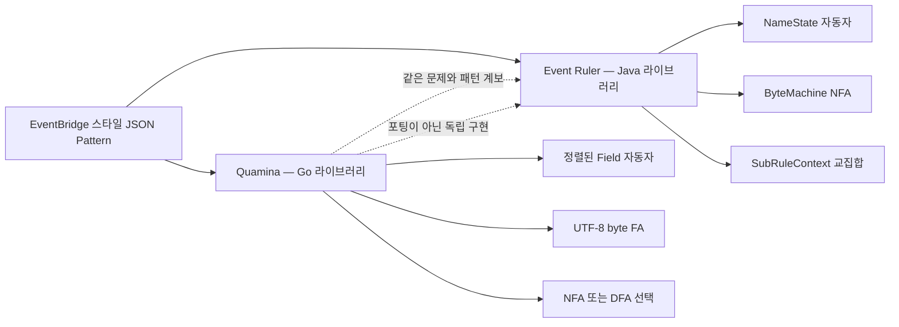
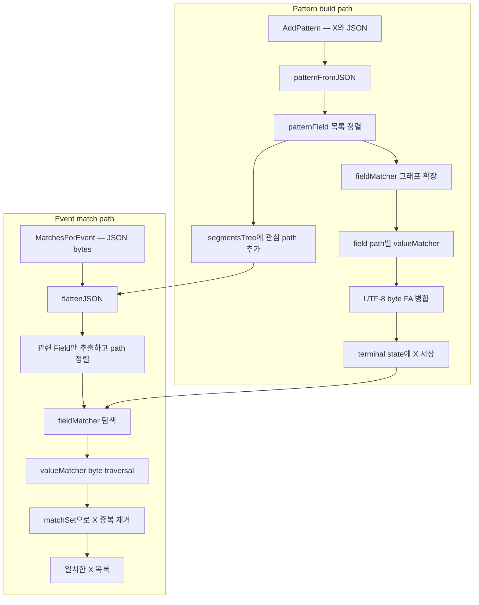
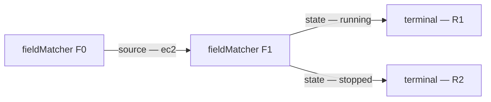
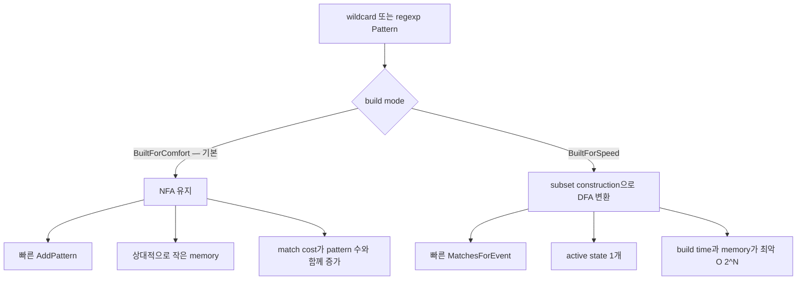
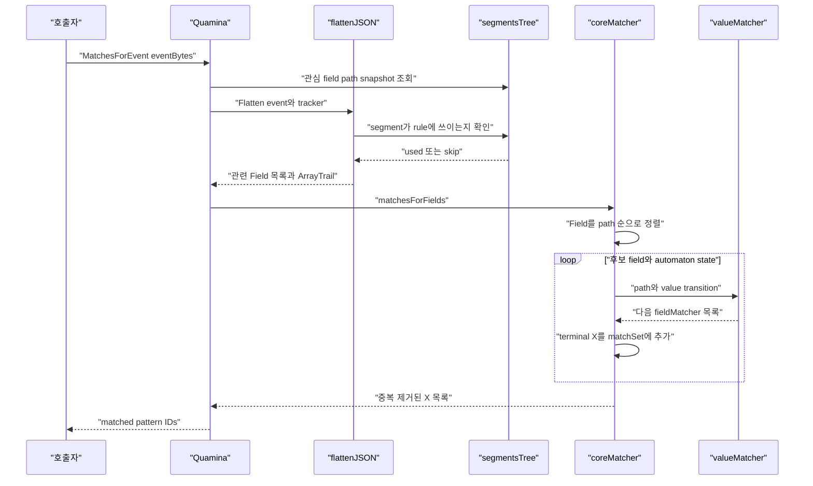
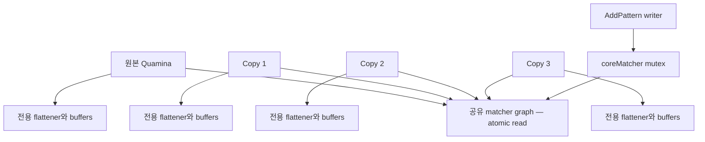
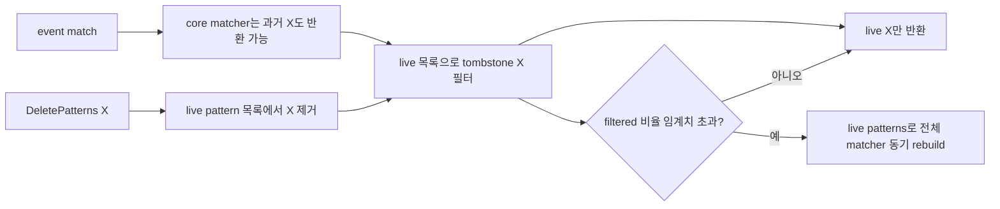
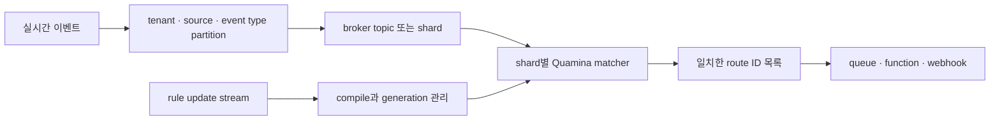

# Quamina 코드 레벨 분석

> 분석 기준일: 2026-08-07  
> 분석 저장소: [timbray/quamina](https://github.com/timbray/quamina)  
> 분석 커밋: [`81f5b730131552ccc677fb41c3abc29af249ad83`](https://github.com/timbray/quamina/tree/81f5b730131552ccc677fb41c3abc29af249ad83), 2026-06-26  
> 최신 정식 릴리스: [`v2.0.2`](https://github.com/timbray/quamina/releases/tag/v2.0.2), 2026-03-16  
> 언어·라이선스: Go 1.22 모듈, Apache-2.0

## 0. 결론부터: Event Ruler와 같은 계열인가

**그렇다. Quamina는 AWS Event Ruler와 사실상 가장 가까운 같은 계열의 오픈소스다.** 둘 다 다음 문제를 푼다.

```text
많은 JSON 룰을 미리 공유 자동자로 컴파일
                    +
이벤트 한 건을 자동자에 한 번 흘림
                    ↓
일치한 룰 ID 여러 개 반환
```

룰을 하나씩 순회하는 `O(이벤트 수 × 룰 수)` 해석기가 아니다. 룰들이 공유하는 필드 경로와 값 prefix를 하나의 상태 그래프에 합치므로, 이미 등장한 필드와 값 구조를 재사용하는 룰을 추가해도 match-time 비용이 거의 늘지 않을 수 있다.

다만 **Event Ruler의 Go 포팅판은 아니다.** 저자 Tim Bray는 AWS에서 Event Ruler의 선행 구현을 개발한 뒤 Quamina를 독립 설계했다. 저자 표현으로도 Quamina는 Event Ruler와 호환되는 일부 기능을 제공하지만 설계는 상당히 다르다([Q Numbers](https://www.tbray.org/ongoing/When/202x/2024/07/09/Q-Numbers), [Making Code Faster](https://www.tbray.org/ongoing/When/202x/2022/06/10/Quamina-Optimizing)).



### 한 문장 평가

Quamina는 **Go 프로세스 안에서 단건 JSON 이벤트를 매우 많은 stateless content rule과 낮은 지연으로 multi-match**해야 할 때 매력적이다. 특히 exact·prefix·숫자 equality 룰에는 강하다. 반면 동적 삭제가 핵심이거나, EventBridge의 `$or`·numeric range·CIDR 같은 전체 표현력이 필요하거나, wildcard·regexp가 수천 개씩 겹치는 경우에는 제약과 비용을 먼저 측정해야 한다.

---

## 1. 프로젝트 개요와 문제 정의

### 해결하려는 문제

일반적인 구현은 이벤트마다 룰을 하나씩 해석한다.

```go
for _, rule := range rules {
    if rule.Match(event) {
        routes = append(routes, rule.Route)
    }
}
```

룰 수를 `R`, 이벤트 수를 `E`라 하면 predicate 평가 횟수가 대략 `E × R`이다. JSON parse, field lookup, 문자열 비교도 룰마다 반복될 수 있다.

Quamina는 방향을 바꾼다.

1. `AddPattern` 때 룰을 field/value finite automaton으로 컴파일한다.
2. 공통 field path와 value byte prefix를 기존 상태와 합친다.
3. `MatchesForEvent` 때 이벤트를 관련 field만 추린 목록으로 만든다.
4. 그 목록으로 공유 상태 그래프를 탐색해 모든 match ID를 한 번에 얻는다.

즉 비싼 작업을 event hot path에서 rule update path로 옮긴 **compile once, match many** 구조다.

### 다루는 범위

- 한 이벤트 내부의 field path와 leaf value 조건
- field별 후보 값 OR, 여러 field 조건 AND
- exact string·number·boolean·null
- prefix, exists, anything-but, wildcard, Unicode case folding, regexp
- 한 이벤트가 여러 룰과 일치하는 multi-match
- 동적 pattern 추가, 선택적 삭제

### 다루지 않는 범위

- 여러 이벤트 사이의 시간·순서·window를 보는 CEP
- fact join과 forward chaining을 하는 Rete 룰 엔진
- action 실행, queue 전송, retry, DLQ 같은 routing runtime
- 분산 shard·replication·영속화
- built-in Avro·Protobuf·CBOR parser

Quamina가 반환하는 것은 destination 전송 결과가 아니라 `[]X`, 즉 **일치한 pattern 식별자 집합**이다. 실제 routing은 호출자가 담당한다.

---

## 2. 릴리스 상태를 먼저 구분해야 한다

분석 시점의 `main`은 최신 릴리스 `v2.0.2`보다 144개 commit 앞서 있다.

| 구분 | 상태 |
|---|---|
| `v2.0.2` | 2026-03-16 정식 tag, Go module path를 `/v2`로 변경 |
| 분석한 `main` | 2026-06-26, `v2.0.2-144-g81f5b73` |
| `main`의 큰 변화 | NFA·DFA build mode, matcher 통계, epsilon closure와 allocation 최적화 |
| 문서 불일치 | 현재 README의 Status는 아직 `2.0.1`이라고 적혀 있음 |

따라서 이 문서에서 설명하는 `BuiltForComfort`, `BuiltForSpeed`, `GetMatcherStats`는 **분석 커밋에는 있지만 v2.0.2 정식 tag에는 없는 main-branch API**다. 프로덕션에서 tag를 고정할 때는 이 차이를 특히 주의해야 한다.

---

## 3. 사용자에게 보이는 패턴 모델

예를 들어 다음 두 rule을 등록한다고 하자.

```json
{
  "source": ["aws.ec2"],
  "detail": {
    "state": ["running", "stopped"]
  }
}
```

```json
{
  "source": ["aws.ec2"],
  "detail": {
    "instance-id": [{"prefix": "i-prod-"}]
  }
}
```

의미는 다음과 같다.

- 한 field 배열 내부는 OR: `state == running OR stopped`
- 서로 다른 field는 AND: `source AND state`
- pattern에 없는 event field는 무시
- event field가 배열이면 후보 중 하나만 맞아도 해당 field는 match

이 의미는 [PATTERNS.md](https://github.com/timbray/quamina/blob/81f5b730131552ccc677fb41c3abc29af249ad83/PATTERNS.md)에 정의되어 있다.

### 지원 연산자

| 종류 | 예 | 구현 방향 |
|---|---|---|
| exact | `"state": ["running"]` | singleton 비교 또는 byte DFA |
| numeric equality | `"price": [20]` | binary64를 정렬 보존 Q number로 정규화 |
| prefix | `{"prefix":"i-prod-"}` | prefix FA |
| exists | `{"exists":true}` | `fieldMatcher`의 별도 transition map |
| anything-but | `{"anything-but":["dev","test"]}` | 금지 문자열 외의 byte를 success로 보내는 DFA |
| wildcard | `{"wildcard":"*.jpg"}` | spinner와 epsilon을 포함한 NFA |
| equals-ignore-case | `{"equals-ignore-case":"RUNNING"}` | Unicode case-folding FA |
| regexp | `{"regexp":"map-[0-9]+"}` | I-Regexp parser와 Thompson 계열 NFA |
| shellstyle | `{"shellstyle":"*.jpg"}` | 과거 wildcard 문법, escape 미지원 |

### 현재 표현력의 경계

- `anything-but`은 문자열 목록만 받는다.
- `exists`는 leaf node에만 적용된다.
- 숫자는 Go `float64`, 즉 IEEE 754 binary64 범위·정밀도다.
- numeric range, CIDR, suffix, EventBridge `$or`는 없다.
- regexp는 PCRE나 Go `regexp` 문법 전체가 아니라 RFC 9485 I-Regexp 기반 변형이며, JSON escape 충돌을 피하려고 `\` 대신 `~`를 쓴다.
- Unicode property를 넓게 사용하는 regexp는 automaton build time과 memory를 크게 만들 수 있다.

---

## 4. 전체 아키텍처

Quamina의 핵심은 **field 순서 자동자와 value byte 자동자를 중첩**한 구조다.



핵심 타입 관계는 다음과 같다.

```text
Quamina
├─ flattener  → JSON event를 []Field로 변환
├─ bufs       → goroutine별 재사용 scratch buffer
└─ matcher
   └─ coreMatcher
      ├─ start: fieldMatcher
      │  ├─ path → valueMatcher
      │  │          └─ faState + smallTable
      │  ├─ existsTrue / existsFalse
      │  └─ matches: []X
      └─ segmentsTree → pattern에 등장한 path index
```

### 주요 코드 지도

| 역할 | 핵심 코드 |
|---|---|
| 공개 API·인스턴스 수명 | [`quamina.go`](https://github.com/timbray/quamina/blob/81f5b730131552ccc677fb41c3abc29af249ad83/quamina.go#L8-L210) |
| pattern JSON compiler | [`pattern.go`](https://github.com/timbray/quamina/blob/81f5b730131552ccc677fb41c3abc29af249ad83/pattern.go#L45-L219) |
| field-level automaton | [`core_matcher.go`](https://github.com/timbray/quamina/blob/81f5b730131552ccc677fb41c3abc29af249ad83/core_matcher.go#L19-L297) |
| field state의 copy-on-write | [`field_matcher.go`](https://github.com/timbray/quamina/blob/81f5b730131552ccc677fb41c3abc29af249ad83/field_matcher.go#L7-L145) |
| value compiler·dispatch | [`value_matcher.go`](https://github.com/timbray/quamina/blob/81f5b730131552ccc677fb41c3abc29af249ad83/value_matcher.go#L11-L216) |
| NFA traversal·NFA→DFA | [`nfa.go`](https://github.com/timbray/quamina/blob/81f5b730131552ccc677fb41c3abc29af249ad83/nfa.go#L148-L340) |
| compact byte transition | [`small_table.go`](https://github.com/timbray/quamina/blob/81f5b730131552ccc677fb41c3abc29af249ad83/small_table.go#L3-L115) |
| JSON hot-path parser | [`flatten_json.go`](https://github.com/timbray/quamina/blob/81f5b730131552ccc677fb41c3abc29af249ad83/flatten_json.go#L9-L250) |
| 관련 path index | [`segments_tree.go`](https://github.com/timbray/quamina/blob/81f5b730131552ccc677fb41c3abc29af249ad83/segments_tree.go#L8-L150) |
| 삭제 wrapper | [`pruner.go`](https://github.com/timbray/quamina/blob/81f5b730131552ccc677fb41c3abc29af249ad83/pruner.go#L43-L347) |

---

## 5. 패턴 컴파일 경로

### 5.1 JSON rule을 정렬된 field sequence로 만든다

[`patternFromJSON`](https://github.com/timbray/quamina/blob/81f5b730131552ccc677fb41c3abc29af249ad83/pattern.go#L52-L84)은 `encoding/json.Decoder` token stream으로 pattern을 읽고 다음 중간 표현을 만든다.

```text
patternField {
    path: "detail\nstate"
    vals: [string("running"), string("stopped")]
}
```

배열은 path에서 빠지고 object key는 줄바꿈 문자로 이어진다. 예를 들어 `detail.state`는 내부에서 `detail\nstate`다.

`AddPattern`은 이 `patternField`들을 path 사전순으로 정렬한다. 이벤트에서 뽑은 `Field`도 같은 방식으로 정렬하므로, 원본 JSON member 순서가 달라도 동일한 automaton path를 사용할 수 있다.

개념적인 컴파일 의사코드는 다음과 같다.

```text
fields = parse(patternJSON)
sort(fields by path)
states = { rootFieldMatcher }

for field in fields:
    next = union(
        state.addTransition(field.path, each OR value)
        for state in states
    )
    states = next

for state in states:
    state.matches += patternID
```

### 5.2 rule의 OR은 branch, AND는 연속 state가 된다

다음 두 rule을 보자.

```text
R1: source=ec2 AND state=running
R2: source=ec2 AND state=stopped
```



두 rule은 `source=ec2`를 한 번만 표현한다. `state` 값의 byte automaton도 공통 prefix가 있으면 byte state를 공유한다.

Event Ruler가 `SubRuleContext` ID 집합으로 branch identity를 별도 추적하는 것과 달리, Quamina는 **각 OR 값이 반환하는 다음 `fieldMatcher`와 terminal의 `matches []X` 자체가 rule 경로를 보존**한다. 공유할 수 있는 부분은 graph node로 공유하고, 논리적으로 갈라져야 하는 지점에는 별도 next state를 만든다.

### 5.3 첫 exact 값은 automaton조차 만들지 않는다

한 `valueMatcher`에 exact string이나 literal이 하나뿐이면 [`singletonMatch`](https://github.com/timbray/quamina/blob/81f5b730131552ccc677fb41c3abc29af249ad83/value_matcher.go#L94-L113)에 raw bytes와 next field state를 바로 저장한다. 실행은 `bytes.Equal` 한 번이다.

두 번째 값이나 prefix·wildcard 같은 패턴이 추가될 때 비로소 singleton을 byte FA로 승격해 기존 FA와 합친다. Event Ruler의 `ShortcutTransition`과 목적은 비슷하지만, Quamina의 첫 값 최적화는 더 직접적인 singleton fast path다.

### 5.4 update는 node 단위 copy-on-write다

- `coreMatcher`의 update writer는 mutex 하나로 직렬화된다.
- `coreFields`, `fmFields`, `vmFields`는 `atomic.Pointer`로 읽는다.
- map과 slice를 in-place 수정하지 않고 새 container를 만들어 store한다.
- reader는 mutex 없이 기존 또는 새 node version을 읽는다.
- terminal에 `X`를 연결한 뒤 새 `segmentsTree` root를 publish한다.

따라서 rule 추가 중에도 match reader가 전체 graph lock을 기다리지 않는다. 다만 전체 matcher의 단일 immutable snapshot을 교체하는 구조는 아니므로, rule update와 정확히 같은 순간의 **linearizable snapshot semantics**까지 제공한다고 해석하면 안 된다.

---

## 6. value automaton의 구현 기술

### 6.1 UTF-8 code point가 아니라 byte를 입력 symbol로 쓴다

Quamina FA의 hot loop는 UTF-8 byte 하나를 읽고 다음 `faState`로 이동한다. 문자열을 rune 배열로 변환할 필요가 없고 JSON event의 `[]byte` slice를 그대로 사용할 수 있다.

exact string `"running"`은 개념적으로 다음처럼 컴파일된다.

```text
'"' → 'r' → 'u' → 'n' → 'n' → 'i' → 'n' → 'g' → '"' → 0xF5 → next field
```

`0xF5`는 정상 UTF-8에 나타날 수 없는 내부 `valueTerminator`다. 이를 가상 마지막 byte로 붙이면 exact match와 prefix match의 끝 처리 분기를 단순화할 수 있다.

### 6.2 `smallTable`: 246칸 array 대신 byte range를 압축한다

각 state마다 `next[256]`을 두면 exact 문자열 위주의 sparse automaton에서 메모리 낭비가 크다. Quamina의 [`smallTable`](https://github.com/timbray/quamina/blob/81f5b730131552ccc677fb41c3abc29af249ad83/small_table.go#L20-L99)은 다음처럼 byte 구간의 ceiling과 target state를 평행 slice로 저장한다.

```text
ceilings: [3, 5, 0x34, 0x35, 0xF6]
steps:    [nil, S1, nil,  S2,   nil]
```

한 byte transition lookup은 ceiling을 앞에서부터 선형 scan한다. 이론상 table entry 수 `k`에 `O(k)`지만 저자는 실제 fan-out이 보통 한 자리 수이고, contiguous slice scan이 hash lookup이나 큰 array의 cache miss보다 유리하다고 판단했다.

range와 default transition을 작게 표현할 수 있어 wildcard, character class, anything-but에도 잘 맞는다.

### 6.3 exact·prefix는 대부분 DFA처럼 걷는다

비결정성이 없는 `valueMatcher`는 [`traverseDFA`](https://github.com/timbray/quamina/blob/81f5b730131552ccc677fb41c3abc29af249ad83/nfa.go#L240-L263)로 간다.

```text
현재 state 1개
  → byte lookup 1회
  → 다음 state 1개
  → 반복
```

대략 value byte 길이에 선형이고, 활성 state 집합이나 epsilon closure를 만들지 않는다.

### 6.4 wildcard·regexp는 NFA가 된다

`*`, alternation, optional, repetition은 한 byte 위치에서 여러 상태가 동시에 활성화될 수 있다. Quamina는 다음 기술을 사용한다.

- Thompson-style NFA construction
- epsilon transition
- build 시 미리 계산한 epsilon closure
- 재사용 slice 두 개로 current·next active states 교대
- field transition dedup map 재사용
- per-`Quamina` scratch buffer로 steady-state allocation 최소화

[`traverseNFA`](https://github.com/timbray/quamina/blob/81f5b730131552ccc677fb41c3abc29af249ad83/nfa.go#L265-L340)는 각 input byte마다 모든 active state의 epsilon closure를 펼치고 다음 active set을 만든다. 그래서 겹치는 wildcard·regexp 수가 늘면 exact rule과 달리 active state 수가 커져 match cost도 증가한다.

### 6.5 `BuiltForComfort`와 `BuiltForSpeed`

분석 커밋의 가장 중요한 새 기능은 build mode다.



[`nfa2Dfa`](https://github.com/timbray/quamina/blob/81f5b730131552ccc677fb41c3abc29af249ad83/nfa.go#L148-L238)는 NFA state 집합을 하나의 DFA state로 보는 전형적인 powerset construction이다.

1. NFA state set을 pointer 순서로 sort·dedup한다.
2. 그 집합을 byte key로 intern한다.
3. 가능한 각 UTF-8 byte에 도달하는 NFA target set을 구한다.
4. target set을 다시 DFA state로 재귀 변환한다.

매칭은 빨라지지만 NFA state 부분집합의 수가 지수적으로 커질 수 있다. 최신 저자 실험에서도 300 wildcard pattern 기준 DFA가 NFA보다 약 두 배 빠르게 match했지만 memory는 약 52배, add time은 압도적으로 커졌다([Automata, Built For Comfort or Speed](https://www.tbray.org/ongoing/When/202x/2026/06/14/DFA-Costs)).

### 6.6 숫자를 같은 byte machine에서 처리한다

JSON 숫자 `20`, `20.0`, `2e1`은 문자로는 다르지만 값은 같다. Quamina는 [`numbits`](https://github.com/timbray/quamina/blob/81f5b730131552ccc677fb41c3abc29af249ad83/numbits.go)를 사용한다.

1. JSON number를 `float64`로 parse한다.
2. IEEE 754 sign·exponent·mantissa bit를 lexicographic order가 numeric order가 되도록 뒤집는다.
3. base-128 variable-width Q number byte sequence로 encode한다.
4. 그 byte sequence를 기존 FA로 match한다.

`valueMatcher`에 numeric pattern이 있을 때만 event number를 Q number로 변환한다. 불필요한 number conversion을 피하는 작은 최적화다.

현재 public pattern에는 numeric range operator가 없으므로 정렬 보존 성질을 주로 numeric equality 정규화에 사용한다. Event Ruler는 비슷한 표현을 range transition에도 사용한다.

### 6.7 `anything-but`은 성공 목록 대신 실패 경로를 만든다

가능한 모든 문자열을 열거할 수는 없다. Quamina는 금지 문자열의 각 byte prefix만 state로 만들고, 다른 byte는 즉시 success state로 보낸다. 금지 문자열을 정확히 끝까지 읽고 terminator를 만나면 failure다.

이는 보집합을 거대한 positive set으로 만들지 않고, 작은 negative trie와 default success transition으로 표현한 것이다.

---

## 7. 이벤트 실행 경로



### 7.1 범용 JSON DOM을 만들지 않는다

초기 구현은 `encoding/json`을 썼지만 profiler에서 event time 대부분이 parsing과 allocation으로 나타났다. 현재 [`flattenJSON`](https://github.com/timbray/quamina/blob/81f5b730131552ccc677fb41c3abc29af249ad83/flatten_json.go#L9-L92)은 Quamina 전용 byte-level parser다.

- event byte slice를 immutable로 보고 field value를 가능한 한 sub-slice로 참조
- JSON escape가 있는 string만 별도 decode buffer 필요
- object·array·number·string용 작은 FSM 사용
- `Field` slice와 array trail buffer 재사용
- 관심 없는 subtree는 validation까지 전부 하지 않고 block 단위 skip 가능
- 필요한 root field를 다 읽으면 event 끝까지 가지 않고 early stop 가능

저자의 측정에서는 이 전용 flattener로 전체 처리 속도가 약 5배 개선됐고, 그래도 flattening이 matching보다 더 비싼 구간으로 남았다([Making Code Faster](https://www.tbray.org/ongoing/When/202x/2022/06/10/Quamina-Optimizing)).

### 7.2 `segmentsTree`가 parse 대상 자체를 줄인다

pattern이 다음 path만 사용한다고 하자.

```text
source
detail.state
detail.instance-id
```

event에 수백 개 field가 있어도 `segmentsTree`는 이 세 path의 segment trie만 유지한다. flattener는 object member name을 읽는 즉시 `IsSegmentUsed`를 호출하고 무관한 subtree를 건너뛴다.

따라서 rule 수보다 **서로 다른 관련 field path 수**가 event parse 비용에 더 큰 영향을 준다. 같은 `source` field에 exact value rule을 1개에서 5만 개로 늘리는 것과 새로운 field path를 계속 추가하는 것은 성능 효과가 전혀 다르다.

### 7.3 정렬된 event field를 subsequence처럼 탐색한다

[`matchesForFields`](https://github.com/timbray/quamina/blob/81f5b730131552ccc677fb41c3abc29af249ad83/core_matcher.go#L184-L209)는 relevant field를 path 순으로 정렬하고 각 field를 automaton 시작점 후보로 시도한다.

`tryToMatch`는 한 field에서 다음 `fieldMatcher`로 전이하면 이후 field들을 재귀적으로 시도한다. 이를 통해 pattern에 없는 event field는 자연스럽게 건너뛰고, pattern의 정렬된 field sequence만 subsequence로 찾는다.

공식 설명은 regexp·wildcard가 없을 때 비용을 **relevant unique field 수 `N`에 대해 O(N)보다 조금 나쁜 정도**라고 표현한다. 코드 수준에서는 다음 항목 때문에 worst case가 더 커질 수 있다.

- 같은 path가 array 때문에 여러 번 나타남
- 하나의 value가 exact·prefix 등 여러 branch를 동시에 만족
- 여러 field 조합이 많은 recursive path를 생성
- `exists:false`마다 전체 field 목록을 선형 scan
- match 결과 자체가 매우 큼

즉 `O(rule count)` 전수 순회는 제거했지만, 모든 입력에서 무조건 상수 시간이라는 뜻은 아니다.

### 7.4 배열의 같은 원소끼리만 AND한다

다음 event를 보자.

```json
{
  "users": [
    {"name": "Alice", "role": "guest"},
    {"name": "Bob", "role": "admin"}
  ]
}
```

다음 pattern은 match하면 안 된다.

```json
{
  "users": {
    "name": ["Alice"],
    "role": ["admin"]
  }
}
```

단순 flatten만 하면 `users.name=Alice`와 `users.role=admin`이 모두 보여 false positive가 생긴다. Quamina의 각 `Field`는 `{Array ID, element position}` 목록인 `ArrayTrail`을 가진다.

[`noArrayTrailConflict`](https://github.com/timbray/quamina/blob/81f5b730131552ccc677fb41c3abc29af249ad83/core_matcher.go#L284-L293)는 두 field가 같은 array ID에서 다른 position이면 AND transition을 거부한다. Event Ruler의 array membership consistency와 같은 핵심 문제를 다른 자료구조로 해결한다.

### 7.5 match 결과는 set이다

terminal에 도달할 때 `X`를 reusable `matchSet`에 넣으므로 한 pattern ID가 여러 array element나 OR branch로 여러 번 match해도 한 번만 반환된다.

Go map iteration으로 결과를 materialize하므로 **반환 순서는 보장되지 않는다.** deterministic route order가 필요하면 호출자가 정렬해야 한다.

---

## 8. 왜 rule 수가 많아도 느려지지 않을 수 있는가

### exact rule 5만 개의 직관

다음처럼 같은 field에 값만 다른 rule 5만 개를 넣는다고 하자.

```text
R1:  word = "alpha"
R2:  word = "beta"
...
R50000: word = "omega-like-value"
```

naive 방식은 event의 `word`를 5만 번 비교한다. Quamina는 모든 값을 한 byte trie·DFA로 합친다.

```text
word value FA
├─ 'a' → ... → terminal R1
├─ 'b' → ... → terminal R2
└─ 'o' → ... → terminal R50000
```

event value 길이가 12 byte면 대략 12번의 state transition으로 후보 경로 하나를 걷는다. rule이 1개인지 5만 개인지는 주로 graph size와 cache locality에 영향을 주고, 5만 번 비교를 직접 만들지는 않는다.

### 성능을 좌우하는 실제 변수

```text
T(event) ≈
    JSON bytes scan과 relevant-field 추출
  + relevant fields 정렬
  + field automaton branch 수
  + 각 value byte 길이 × active FA states
  + array consistency 검사
  + 일치 결과 수
```

| 변수 | 영향 |
|---|---|
| rule 총수 | exact rule이 기존 path·prefix를 공유하면 약한 영향 |
| unique field path 수 | flattener와 field graph 실행량 증가 |
| event 크기 | skip 가능 여부를 포함해 parse 비용 증가 |
| value 길이 | byte traversal 길이 증가 |
| wildcard·regexp 중첩 | NFA active states와 epsilon closure fan-out 증가 |
| DFA 변환 | match는 빨라지지만 add time·memory 폭발 가능 |
| array 안의 반복 field | field 조합과 conflict 검사 증가 |
| match 결과 수 | 출력 하한 자체가 증가 |

### 로컬 재현 벤치마크

분석 커밋에서 Go 1.26.3, Apple M5, `BuiltForComfort` 기본값으로 repository의 workload benchmark를 3회 실행한 중앙값에 가까운 값이다. tiny in-memory JSON event에 대한 microbenchmark이며 network·routing·serialization 비용은 없다.

| workload | rule 수 | ns/op | 대략 events/s | allocs/op |
|---|---:|---:|---:|---:|
| exact string | 1 | 94.2 | 10.6M | 0 |
| single shellstyle | 1 | 198 | 5.05M | 0 |
| overlapping wildcard | 8 | 567 | 1.76M | 0 |
| overlapping wildcard | 16 | 1,167 | 0.86M | 0 |
| overlapping wildcard | 32 | 2,273 | 0.44M | 1 |
| overlapping wildcard | 64 | 4,629 | 0.22M | 2 |
| overlapping wildcard | 128 | 9,458 | 0.11M | 3 |

이 표가 보여주는 핵심은 두 가지다.

1. exact·단순 pattern hot path는 매우 작고 allocation-free가 가능하다.
2. 서로 겹치는 wildcard NFA는 pattern 수가 늘면서 거의 선형으로 느려지고 scratch capacity를 넘으면 allocation도 다시 나타난다.

숫자 자체를 제품 SLA로 가져가면 안 된다. event shape, relevant path 수, hit ratio, regexp 구조, CPU architecture가 바뀌면 크게 달라진다.

### 저자의 NFA·DFA stress 결과

2023 M2 MacBook Pro에서 random wildcard Wordle pattern으로 측정한 저자 자료는 다음 trade-off를 보여준다.

| mode | patterns | memory | add time | matches/s |
|---|---:|---:|---:|---:|
| NFA | 300 | 860KB | 0.1ms | 222K |
| DFA | 300 | 45MB | 7.7s | 404K |
| NFA | 10,000 | 27MB | 2.3ms | 21K |

이는 worst-case 성격의 특정 wildcard workload다. “DFA가 항상 낫다”가 아니라 **rule set이 작고 match QPS가 add latency·memory보다 중요할 때만 BuiltForSpeed를 검토**하라는 자료다.

---

## 9. 동시성 모델

### 한 `Quamina` 인스턴스는 여러 goroutine에서 동시에 쓰면 안 된다

공유 automaton read 자체는 가능하지만 `Quamina`는 mutable flattener와 NFA scratch buffer를 소유한다. 따라서 같은 인스턴스로 `MatchesForEvent`를 동시에 호출하면 안 된다.

대신 goroutine마다 `Copy()`를 만든다.



- copy들은 matcher graph를 공유한다.
- 각 copy는 별도 flattener와 buffers를 가진다.
- 어느 copy에서 pattern을 추가해도 모든 copy에 보인다.
- 여러 `AddPattern`은 하나의 mutex에서 직렬화된다.
- match reader는 add writer의 mutex를 기다리지 않는다.

### update 중 snapshot 의미

atomic copy-on-write 덕분에 data race 없이 기존 또는 새 node를 읽지만, `MatchesForEvent`는 tracker를 얻어 flatten한 뒤 matcher root를 다시 읽는다. 그 사이 rule update가 publish될 수 있다.

따라서 update와 동시에 진행되는 한 event match가 rule set의 정확한 한 version에 고정된다고 보장하지는 않는다. 강한 일관성이 필요하면 외부에서 다음 중 하나를 사용해야 한다.

- immutable matcher를 새로 build한 뒤 pointer swap
- rule-set generation과 event result versioning
- application-level read/write coordination

### 현재 main의 `Copy` build-mode 함정

분석 커밋의 [`Copy`](https://github.com/timbray/quamina/blob/81f5b730131552ccc677fb41c3abc29af249ad83/quamina.go#L115-L120)는 matcher, flattener, buffers만 복사하고 `buildMode`는 복사하지 않는다. enum zero value가 `BuiltForComfort`이므로 다음 상황이 생긴다.

```go
q.SetMatcherBuildMode(quamina.BuiltForSpeed)
copy := q.Copy()
// copy.GetMatcherBuildMode()는 BuiltForComfort
```

match만 하는 worker copy에는 영향이 없지만 copy에서도 `AddPattern`을 호출하면 의도와 다른 mode로 일부 pattern이 추가될 수 있다. main-branch API가 아직 정식 release 전임을 보여주는 실무상 주의점이다.

---

## 10. pattern 삭제는 core 기능이 아니라 tombstone + rebuild다

`coreMatcher`는 graph에서 pattern을 직접 제거하지 않는다. `WithPatternDeletion(true)`를 사용하면 `prunerMatcher`가 감싼다.



기본 trigger는 다음 조건에서 rebuild한다.

- rebuild 이후 emitted + filtered 결과가 최소 1,000개
- `filtered / emitted > 0.2`

rebuild는 호출 thread에서 동기 실행된다. 따라서 delete나 match가 드물게 큰 latency spike를 맞을 수 있다.

더 중요한 현재 구현 세부사항은 default `memState`가 map이 아니라 slice라는 점이다.

- `Delete(x)`: 전체 live entry scan
- `Contains(x)`: 전체 live entry scan
- match 결과의 각 `X`마다 `Contains` 호출

삭제 mode에서 pattern이 매우 많으면 tombstone filtering 자체가 hot path가 될 수 있다. 동적 add/delete가 빈번하고 tail latency가 중요한 workload라면 Event Ruler의 incremental delete나 외부 double-buffer rebuild가 더 적합할 수 있다.

`WithPatternStorage`는 API 방향만 문서화되어 있고 현재 구현은 항상 error를 반환한다.

---

## 11. 공개 API와 코드 수준 주의점

### 기본 사용

```go
q, err := quamina.New()
if err != nil {
    return err
}

if err := q.AddPattern("running-ec2", `{
  "source": ["aws.ec2"],
  "detail": {"state": ["running"]}
}`); err != nil {
    return err
}

matches, err := q.MatchesForEvent(eventBytes)
```

### 확장 포인트: `Flattener`

public `Flattener` interface는 두 method뿐이다.

```go
type Flattener interface {
    Flatten(event []byte, tracker SegmentsTreeTracker) ([]Field, error)
    Copy() Flattener
}
```

따라서 Avro, Protobuf, CBOR 같은 형식도 caller가 다음 규칙을 지켜 구현할 수 있다.

- leaf를 `Path`, `Val`, `IsNumber`로 변환
- `SegmentsTreeTracker`로 무관한 field skip
- array element identity를 `ArrayTrail`에 기록
- concurrent worker용 독립 copy 제공

이 interface가 Quamina의 가장 명확한 extension point다. 반면 새로운 pattern operator를 plugin처럼 등록하는 public SPI는 없다. operator 추가는 parser, FA builder, merge, printer 등 core code를 함께 수정해야 한다.

### `X any`지만 사실상 comparable이어야 한다

API는 pattern ID 타입 `X`를 `any`로 정의한다. 그러나 match dedup은 `map[X]bool`, 삭제 storage는 `entry.x == x`를 사용한다.

따라서 slice, map, function 같은 non-comparable 값을 `X`로 쓰면 runtime panic이 날 수 있다. 안전한 선택은 string, integer, pointer 또는 comparable struct다.

### 결과 순서는 nondeterministic하다

`matchSet` map 순회 순서대로 `[]X`를 만들므로 API 결과 순서를 business priority로 사용하면 안 된다. 우선순위가 필요하면 ID와 priority metadata를 따로 두고 결과를 정렬한다.

### `GetMatcherStats`는 전체 process memory가 아니다

분석 커밋의 stats는 FA state 수, 추정 byte 수, epsilon fan-out을 계산한다. field map, value matcher object, segments tree, Go allocator overhead를 모두 포함한 heap 측정은 아니다. 특히 `bytes`를 hard memory limit으로 해석하기보다 **같은 workload에서 build mode와 rule 변화 추세를 비교하는 지표**로 쓰는 편이 안전하다.

### skipped subtree의 JSON error를 못 볼 수 있다

flattener는 무관한 subtree를 빠르게 skip하기 때문에 그 내부의 일부 잘못된 JSON·UTF-8을 검증하지 않을 수 있다. Quamina를 strict schema validator로 사용하면 안 된다.

---

## 12. Event Ruler와 코드 구조 비교

| 관점 | Quamina | AWS Event Ruler |
|---|---|---|
| 관계 | Event Ruler 선행 경험에서 나온 독립 Go 설계 | AWS EventBridge용 Java 구현 계보 |
| 언어 | Go | Java |
| rule 실행 모델 | 정렬된 `fieldMatcher` graph + `valueMatcher` FA | `NameState` graph + `ByteMachine` NFA |
| rule identity | terminal `matches []X`와 graph branch | `SubRuleContext` 후보 교집합 |
| value input symbol | UTF-8 byte | UTF-8 byte |
| exact fast path | 첫 값 `singletonMatch` | `ShortcutTransition` path compression |
| transition table | byte range를 압축한 `smallTable` | byte transition map과 compound transition |
| wildcard·regexp | wildcard와 full I-Regexp NFA | wildcard, regexp 없음 |
| NFA→DFA | main branch에서 선택 가능 | public build-mode 없음 |
| event parsing | 전용 JSON flattener + relevant path skip | Jackson 기반 field index + `StructuredFinder` |
| array consistency | `ArrayTrail` pair conflict 검사 | array membership set consistency |
| numeric | binary64 equality 정규화 | equality와 range, CIDR |
| EventBridge 문법 | subset, `$or`·suffix·range·CIDR 없음 | 더 넓은 EventBridge operator 지원 |
| non-JSON | custom `Flattener` public interface | JSON 중심 |
| concurrent match | goroutine별 `Copy()` 필요 | shared machine에서 직접 concurrent read |
| add | writer mutex + atomic node COW | synchronized update + concurrent structures |
| delete | optional tombstone filter + full rebuild | reference 기반 incremental delete |
| dependencies | Go standard library만 사용 | Jackson 등 Java dependencies |

### 설계 철학의 차이

Quamina는 Go runtime에 맞춰 다음을 강하게 최적화한다.

- goroutine마다 mutable scratch를 소유하고 immutable-ish graph만 공유
- slice capacity를 누적 재사용해 allocation을 hot path에서 제거
- custom JSON parser로 DOM·interface allocation 회피
- NFA와 DFA의 시간·공간 trade-off를 caller에게 노출

Event Ruler는 다음 쪽이 더 성숙하다.

- EventBridge operator vocabulary
- incremental add·delete
- rule branch context를 명시적으로 관리
- 최신 `StructuredFinder`의 큰 nested array 탐색

Event Ruler 내부 구현은 [AWS Event Ruler 코드 분석](../event-ruler/event-ruler-code-analysis.md), 더 넓은 선택지는 [실시간 이벤트 룰 필터링·라우팅 기술 지도](../event-ruler/realtime-rule-filtering-routing-landscape.md)에 정리돼 있다.

---

## 13. 경쟁·생태계 맥락

| 기술 | 적합한 문제 | Quamina와의 차이 |
|---|---|---|
| AWS Event Ruler | 많은 EventBridge형 JSON pattern | 가장 가까운 Java 대안, operator·delete가 더 풍부 |
| Elasticsearch Percolator | document 한 건을 저장 query와 reverse search | full-text·geo·복합 query가 강하지만 훨씬 무거움 |
| Drools Rete·Phreak | fact join, rule activation, action | 부분 일치 memory와 추론을 제공, 단건 JSON filter에는 과함 |
| Flink CEP | 여러 이벤트의 순서·시간 pattern | stateful temporal NFA, 분산 runtime 필요 |
| Kafka Streams·Flink SQL | filter·join·window·aggregation pipeline | distributed state와 processing semantics 제공 |
| NATS·RabbitMQ topic routing | subject·routing key 기반 1차 routing | payload parse 없이 더 싸지만 깊은 JSON 조건은 약함 |
| OPA·Cedar | authorization policy decision | 정책 의미·감사·설명 중심, 대량 multi-match 자동자와 목적이 다름 |

실전에서는 Quamina 하나로 모든 routing을 해결하기보다 다음 계층이 자연스럽다.



1차 partition으로 candidate rule universe를 줄이고, shard 내부의 세부 content match에 Quamina를 쓰면 memory, update contention, blast radius를 함께 줄일 수 있다.

---

## 14. 장점과 약점

### 장점

- rule별 전수 순회를 shared automaton traversal로 바꾼다.
- exact rule cardinality보다 unique field path와 event shape에 더 민감한 좋은 성능 곡선을 가진다.
- custom JSON parser와 buffer reuse로 steady-state allocation을 매우 낮출 수 있다.
- Go standard library 외 runtime dependency가 없다.
- Unicode case folding과 비교적 풍부한 regexp를 byte FA로 통합한다.
- custom `Flattener`로 non-JSON 확장 경계를 제공한다.
- pattern add 중에도 match reader를 global lock으로 막지 않는다.
- main branch의 NFA·DFA 선택은 trade-off를 명시적으로 보여준다.

### 약점·리스크

- main branch와 latest tag 사이 API·성능 구조 차이가 크고 README version도 stale하다.
- pattern 삭제가 incremental graph delete가 아니라 tombstone filtering과 동기 rebuild다.
- default live state의 linear scan은 대규모 deletion workload에 불리하다.
- wildcard·regexp NFA는 수에 따라 match time이 증가하고 DFA 변환은 state explosion 위험이 있다.
- EventBridge operator 전체와 호환되지 않는다.
- 하나의 `Quamina`를 concurrent match에 바로 공유할 수 없고 `Copy` lifecycle을 관리해야 한다.
- field combination 탐색은 adversarial arrays·overlapping branch에서 선형을 넘을 수 있다.
- `X any`, unordered result, approximate memory stats처럼 API surface와 실제 제약 사이 간극이 있다.
- strong snapshot, durability, sharding, routing delivery는 애플리케이션이 별도로 설계해야 한다.

---

## 15. 적합·부적합 사례

### 잘 맞는 경우

- Go 서비스 안에서 수천~수십만 JSON subscription filter를 평가
- event 한 건만 보면 rule 결과가 결정되는 stateless routing
- rule들이 `tenant`, `source`, `type`, `detail.state` 같은 path를 많이 공유
- exact, prefix, numeric equality 비중이 큼
- 동일 event가 여러 route와 match할 수 있음
- low-latency in-process library가 필요하고 별도 search cluster를 두기 싫음

### 신중히 benchmark할 경우

- wildcard·regexp rule이 수백~수천 개이며 서로 많이 겹침
- event가 깊고 큰 array를 다수 포함
- 한 event가 매우 많은 rule에 match
- rule add latency와 match latency가 모두 엄격
- add와 match가 계속 동시에 일어나며 version consistency가 중요

### 다른 기술이 더 나은 경우

- numeric range·CIDR·`$or`·suffix와 잦은 delete가 핵심: Event Ruler
- full-text·geo·복합 검색 query: Elasticsearch Percolator
- 여러 이벤트의 시간 순서: Flink CEP 같은 CEP
- fact join과 action activation: Drools 같은 Rete engine
- window·join·aggregation·exactly-once pipeline: Kafka Streams·Flink
- topic·header만으로 충분: broker native routing

---

## 16. 도입 시 권장 아키텍처

### rule set을 shard한다

가능하면 모든 tenant rule을 한 matcher에 넣지 말고 `tenantId`, `eventType`, `source`처럼 값이 안정적인 envelope로 먼저 나눈다. shard마다 matcher와 update generation을 둔다.

### read path와 build path를 분리한다

rule update가 매우 잦지 않다면 mutable add를 worker matcher에 직접 노출하기보다 다음이 운영하기 쉽다.

1. 새 generation matcher를 background에서 build
2. representative rule·event로 memory와 latency 측정
3. atomic pointer swap
4. in-flight reader가 끝난 뒤 이전 generation 회수

이 방식은 strong snapshot, rollback, deletion, tail-latency 면에서 내장 pruner보다 예측 가능하다.

### goroutine별 copy를 오래 재사용한다

`Copy()`를 event마다 만들면 buffer reuse 이점이 사라진다. worker pool의 각 goroutine이 copy 하나를 오래 보유하도록 한다.

### mode는 rule cohort별로 나눈다

- exact·prefix 위주: 기본 구조로 충분
- 소수의 hot regexp: 별도 matcher에서 `BuiltForSpeed` 후보
- 대량 wildcard·regexp: `BuiltForComfort`로 시작하고 state·memory·latency 측정

한 matcher 안에서 workload 성격이 너무 다르면 exact cohort와 regexp cohort를 분리하고 결과를 union하는 편이 capacity planning에 유리하다.

### 반드시 측정할 지표

- match latency p50·p95·p99
- AddPattern latency와 batch build time
- unique field path 수
- event당 relevant field 수
- event당 match output 수
- NFA state 수·epsilon fan-out·matcher bytes 추세
- deletion mode의 filtered ratio와 rebuild duration
- process heap, GC pause, allocation rate

---

## 17. 추천 코드 읽기 순서

1. [`quamina.go`](https://github.com/timbray/quamina/blob/81f5b730131552ccc677fb41c3abc29af249ad83/quamina.go#L95-L195) — public API, Copy, build mode
2. [`pattern.go`](https://github.com/timbray/quamina/blob/81f5b730131552ccc677fb41c3abc29af249ad83/pattern.go#L52-L219) — JSON pattern을 typed value로 변환
3. [`core_matcher.go`](https://github.com/timbray/quamina/blob/81f5b730131552ccc677fb41c3abc29af249ad83/core_matcher.go#L58-L131) — pattern을 field graph에 삽입
4. [`field_matcher.go`](https://github.com/timbray/quamina/blob/81f5b730131552ccc677fb41c3abc29af249ad83/field_matcher.go#L96-L145) — path가 value matcher로 dispatch되는 방식
5. [`value_matcher.go`](https://github.com/timbray/quamina/blob/81f5b730131552ccc677fb41c3abc29af249ad83/value_matcher.go#L53-L195) — exact fast path와 연산자별 FA build
6. [`small_table.go`](https://github.com/timbray/quamina/blob/81f5b730131552ccc677fb41c3abc29af249ad83/small_table.go#L20-L115) — byte transition 압축
7. [`nfa.go`](https://github.com/timbray/quamina/blob/81f5b730131552ccc677fb41c3abc29af249ad83/nfa.go#L148-L340) — NFA traversal과 subset construction
8. [`flatten_json.go`](https://github.com/timbray/quamina/blob/81f5b730131552ccc677fb41c3abc29af249ad83/flatten_json.go#L9-L250) — event hot path
9. [`core_matcher.go`](https://github.com/timbray/quamina/blob/81f5b730131552ccc677fb41c3abc29af249ad83/core_matcher.go#L184-L293) — sorted field matching과 array conflict
10. [`pruner.go`](https://github.com/timbray/quamina/blob/81f5b730131552ccc677fb41c3abc29af249ad83/pruner.go#L180-L333) — deletion의 실제 비용

---

## 18. 종합 평가

Quamina의 가장 좋은 아이디어는 “rule 수를 줄이는 특별한 magic”이 아니다. 더 정확히는 다음 네 가지를 결합한다.

1. **중복 계산 공유**: rule들의 field path와 value prefix를 하나의 graph로 합친다.
2. **입력 축소**: pattern에 등장하지 않는 JSON subtree를 parse 단계에서 버린다.
3. **실행 모델 단순화**: exact, prefix, wildcard, regexp, anything-but, number를 byte transition으로 낮춘다.
4. **hot-path memory 통제**: flattener와 NFA buffer를 worker별로 오래 재사용한다.

그 결과 exact·prefix 중심의 많은 stateless rule에는 “rule을 더 넣어도 event당 일이 거의 늘지 않는” 성능 특성이 나온다. 반대로 regexp·wildcard는 NFA active-state 비용을 다시 가져오고, 이를 DFA로 없애려 하면 build-time state explosion이라는 고전적인 대가를 치른다.

Event Ruler와 비교하면 Quamina는 **Go, zero dependency, custom flattener, regexp, 명시적 NFA·DFA 선택**이 매력적이다. Event Ruler는 **더 넓은 EventBridge 문법, incremental delete, 성숙한 array traversal**이 강하다. 같은 계열이지만 workload와 runtime 언어에 따라 선택점이 분명하다.

프로덕션 도입 관점에서는 latest release와 main API를 구분하고, deletion mode를 기본 선택하지 않으며, representative rule corpus로 unique paths·wildcard overlap·output cardinality를 함께 benchmark하는 것이 핵심이다.

---

## 참고 자료

- [Quamina repository](https://github.com/timbray/quamina)
- [Quamina v2.0.2 release](https://github.com/timbray/quamina/releases/tag/v2.0.2)
- [Patterns in Quamina](https://github.com/timbray/quamina/blob/81f5b730131552ccc677fb41c3abc29af249ad83/PATTERNS.md)
- [Regular Expressions in Quamina](https://github.com/timbray/quamina/blob/81f5b730131552ccc677fb41c3abc29af249ad83/REGEXP.md)
- [Quamina Diary index](https://www.tbray.org/ongoing/What/Technology/Quamina%20Diary/)
- [Making Code Faster — custom flattener와 allocation](https://www.tbray.org/ongoing/When/202x/2022/06/10/Quamina-Optimizing)
- [Q Numbers](https://www.tbray.org/ongoing/When/202x/2024/07/09/Q-Numbers)
- [Union of Finite Automata](https://www.tbray.org/ongoing/When/202x/2024/07/28/Union-of-Finite-Automata)
- [Finite-state Struggles — wildcard NFA 확장](https://www.tbray.org/ongoing/When/202x/2025/07/21/Automaton-merge-war)
- [Quamina v2.0.0 — regexp 도입](https://www.tbray.org/ongoing/When/202x/2026/01/20/Quamina-2.0)
- [Automata, Built For Comfort or Speed](https://www.tbray.org/ongoing/When/202x/2026/06/14/DFA-Costs)
- [AWS Event Ruler](https://github.com/aws/event-ruler)
