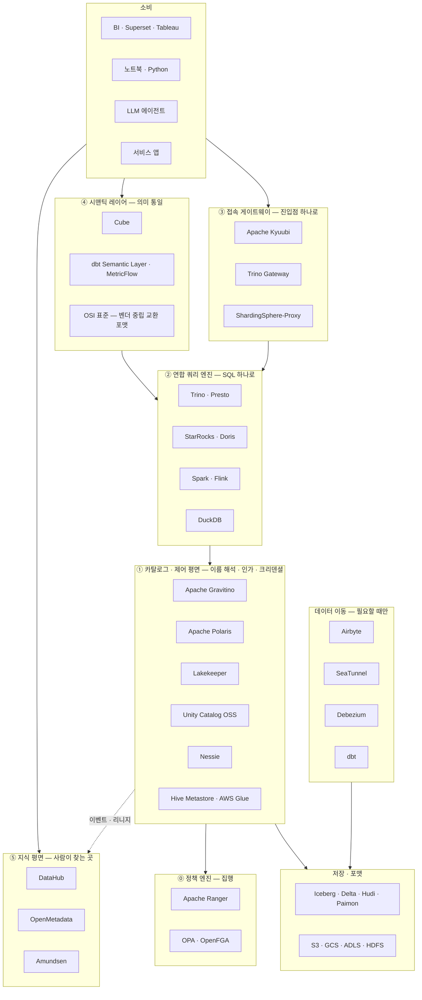
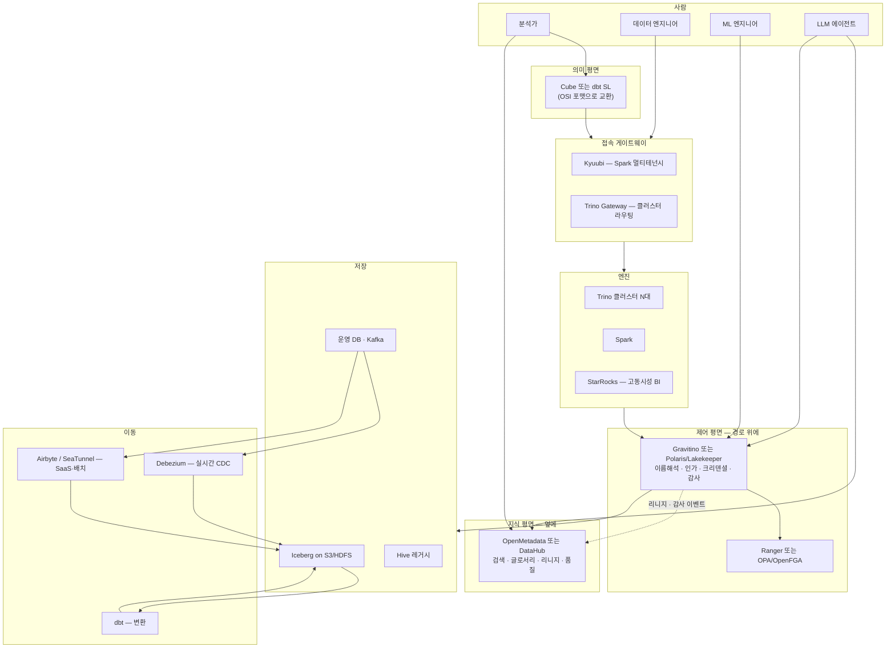

# 전사 데이터 통합 스택 지형도 — "접근 포인트를 하나로" 를 실제로 푸는 도구들

> 조사 시점: 2026-08
> 관련 문서: [Gravitino 심층 분석](../gravitino/gravitino-analysis.md) · [Gravitino vs DataHub vs OpenMetadata](../gravitino/gravitino-vs-datahub-openmetadata.md) · [OSI 적용 참고서](../osi/OSI_적용_참고서.md) · [SeaTunnel 심층 분석](../seatunnel/SeaTunnel_심층분석.md)

---

## 0. 시작하기 전에 — "데이터 접근 통합"은 한 문제가 아니다

이 영역에서 프로젝트가 실패하는 가장 흔한 이유는 도구 선택이 틀려서가 아니라, **"통합"이라는 한 단어에 다섯 개의 다른 요구가 뭉쳐 있는 걸 모른 채 하나의 도구로 다 풀려고 해서**다.

| # | "통합"의 의미 | 실제 요구 | 이걸 푸는 레이어 |
|---|---|---|---|
| ① | **메타데이터 진입점** | "이 테이블이 어느 시스템 어디 있고 내가 봐도 되나" | 카탈로그 / 제어 평면 |
| ② | **쿼리 진입점** | "하나의 SQL로 여러 소스를 조인하고 싶다" | 연합 쿼리 엔진 |
| ③ | **접속 진입점** | "JDBC URL 하나만 알려주고 싶다" | SQL 게이트웨이 / 프록시 |
| ④ | **의미 진입점** | "'월 매출'의 정의가 도구마다 다르다" | 시맨틱 레이어 |
| ⑤ | **지식 진입점** | "우리 회사에 무슨 데이터가 있는지 모르겠다" | 디스커버리 카탈로그 |

**Gravitino는 ①만 한다.** ②~⑤는 각각 다른 도구가 필요하다. 이 문서는 다섯 레이어를 다 훑는다.

---

## 1. 전체 지형도



**읽는 법**: 위로 갈수록 사람에 가깝고, 아래로 갈수록 기계에 가깝다. Gravitino는 아래에서 두 번째 층에 있다.

---

## 2. ① 카탈로그 / 제어 평면 — Gravitino의 자리

가장 경쟁이 치열한 층이다. 2026년 현재 선택지가 크게 늘었다.

### 2.0 먼저 — 이들은 "같은 제품군"이 아니다

아래 표를 읽기 전에 반드시 짚어야 할 것이 있다. **이 도구들이 겹치는 면은 `Iceberg REST Catalog` 구현 하나뿐**이다.

```
      Gravitino                                Polaris / Lakekeeper
 ┌─────────────────────────┐
 │ Hive·Paimon·Hudi·JDBC   │
 │ Kafka·Fileset·Model     │      ┌─────────────────────────┐
 │ Function·TMS·MCP        │      │                         │
 │ 원격 IRC 연합 프록시     │      │                         │
 │ Trino/Spark/Flink 플러그인│     │                         │
 │           ┌─────────────┼──────┼─────────────┐           │
 │           │  Iceberg REST Catalog 구현       │           │
 │           │   ← 여기서만 직접 경쟁 →          │           │
 │           └─────────────┼──────┼─────────────┘           │
 └─────────────────────────┘      │ 멀티테이블 커밋          │
                                  │ OpenFGA · OPA 브리지    │
                                  │ Rust 단일 바이너리       │
                                  └─────────────────────────┘
```

- **교집합 안**: 프로토콜이 같으므로 `uri`만 바꿔 **교체 가능**. 진짜 직접 경쟁이다.
- **교집합 밖**: Polaris/Lakekeeper는 Hive·Kafka·Fileset·Model을 **아예 다루지 못한다.** 후보에 오를 수 없다.

그리고 그 교집합 안에서는 **Gravitino가 오히려 뒤진다.**

| Iceberg REST 스펙 | Gravitino | Lakekeeper |
|---|---|---|
| 멀티테이블 트랜잭션 | **미구현** (공식 문서 명시) | **구현** |
| View registration | **미구현** (공식 문서 명시) | — |
| 서버사이드 디컨플릭팅 | — | 구현 |

각자의 자기 소개를 보면 의도가 분명하다.

| | 자기 정의 |
|---|---|
| Lakekeeper | *"An implementation of the **Apache Iceberg REST Catalog specification**"* |
| Polaris | *"Iceberg REST catalog"* |
| Gravitino | *"geo-distributed, **federated metadata lake**... for data **and AI assets**"* |

**셋은 다른 것이 되려 한다.** 같은 칸에 놓이는 이유는 Iceberg REST가 지금 가장 뜨거운 표면이라 모든 비교가 그 축으로만 줄을 세우기 때문이고, 그 결과 Gravitino는 실제보다 좁게 평가되곤 한다.

> **판단은 질문 하나로 끝난다 — "우리 워크로드가 Iceberg 100%인가?"**
> **YES** → Polaris/Lakekeeper와 직접 비교하라. 그 비교에서 Gravitino가 이길 이유는 별로 없다.
> **NO** → Polaris/Lakekeeper는 애초에 후보가 아니다. 비교 대상은 Unity Catalog이거나 "지금처럼 따로 관리"다.

### 2.1 비교표

| | **Gravitino** | **Polaris** | **Lakekeeper** | **Unity Catalog OSS** | **Nessie** | **HMS / Glue** |
|---|---|---|---|---|---|---|
| 주체 | Datastrato → ASF TLP | Snowflake+Dremio → **ASF TLP (2026-02)** | Vakamo | Databricks | Dremio → ASF | Apache / AWS |
| 언어·런타임 | Java 17 (JVM) | Java (JVM) | **Rust 단일 바이너리** | Java | Java | Java / 관리형 |
| 포맷 범위 | **Iceberg·Hive·Paimon·Hudi·Delta·JDBC·Kafka·파일·모델** | Iceberg 전용 | Iceberg 전용 | Delta·Iceberg·Hudi | Iceberg 전용 | Hive 계열 |
| 연합(federation) | **✓ 원격 IRC 프록시** | ✗ | ✗ | ✗ | ✗ | ✗ |
| 비테이블 자산 | **Fileset·Topic·Model·Function** | ✗ | ✗ | Volume·Model·Function | ✗ | ✗ |
| 인가 모델 | 자체 RBAC(34 privilege) | 세분화 RBAC | **OpenFGA (CNCF)** | 세분화 | 제한적 | 없음(Ranger 의존) |
| **엔진까지 집행 전파** | Ranger 푸시다운 | ✗ | **OPA 브리지 → Trino** | ✗ | ✗ | — |
| 크리덴셜 벤딩 | S3·GCS·ADLS·OSS·JDBC | ✓ | ✓ + remote signing | ✓ | 부분 | ✗ |
| 특수 기능 | TMS(자동 compaction)·스캔플래닝·MCP | — | 멀티테이블 커밋 | AI 자산 | **Git식 브랜치/머지** | 레거시 호환 |
| **IRC 스펙 완성도** | 멀티테이블 트랜잭션·view registration **미구현** | 원조 구현 | **멀티테이블 커밋 지원** | — | — | — |
| 필수 인프라 | 서버 + RDB | 서버 + RDB | **바이너리 + PostgreSQL** | 서버 + RDB | 서버 + 백엔드 | HMS + RDB |

> 표를 세로로만 읽지 말 것. **포맷 범위 행과 IRC 스펙 완성도 행이 역방향**이다 — Gravitino는 넓게 커버하는 대신 Iceberg 한 면의 깊이에서 뒤진다. §2.0의 벤 다이어그램이 이 표의 전제다.

### 2.2 각각 언제 고르나

**Apache Gravitino** — 포맷이 여럿이고 테이블 아닌 자산(파일·모델·토픽)까지 같은 축에서 다뤄야 할 때. 리전/클라우드 간 연합이 필요할 때. **범위가 넓은 대신 무겁다.**

**Apache Polaris** — Iceberg만 쓰고 벤더 중립성이 중요할 때. 2026년 2월 ASF Top-Level Project로 승격되어 거버넌스 리스크가 낮다. Snowflake Open Catalog / Dremio Open Catalog로 관리형도 가능.

**Lakekeeper** — **Iceberg 전용 워크로드에 한해서는 Gravitino의 가장 직접적인 대안**이고, 운영 철학은 정반대다. Rust 단일 바이너리 + PostgreSQL만 있으면 뜬다. JVM도 Python도 없다. K8s 친화적. 반대로 Iceberg 밖으로 나가면 **대안이 아니라 아예 다른 물건**이다 (§2.0).

> 주목할 점: Lakekeeper는 **OpenFGA**(CNCF, Google Zanzibar 계열)로 권한을 모델링하고, **OPA 브리지**로 그 권한을 Trino에 그대로 노출한다. Trino는 자체 OPA access control 플러그인으로 이를 집행한다.
> **이게 Gravitino의 "집행의 반쪽" 문제를 다른 방식으로 푼 것**이다 — Gravitino는 Ranger에 정책을 *복사*하는 데 반해, Lakekeeper는 엔진이 *같은 권한 소스를 직접 조회*하게 한다. 정책 드리프트가 구조적으로 없다.

**Unity Catalog OSS** — Databricks 생태계에 이미 있을 때. 컬럼 마스킹·행 필터가 필요하면 사실상 여기밖에 없다.

**Nessie** — 데이터에 Git식 브랜치/머지/롤백이 필요할 때. "프로덕션 테이블에 실험 브랜치를 따고 검증 후 머지" 라는 워크플로가 목표라면 대체재가 없다.

**HMS / AWS Glue** — 이미 있으면 **버리지 말고 뒤에 두라.** Gravitino·Polaris·Trino 전부 HMS를 백엔드로 쓸 수 있다.

### 2.2.1 그렇다면 Gravitino의 "전체 스코프" 경쟁자는 누구인가

솔직히 말하면 **거의 없다.**

| 후보 | 겹치는 범위 |
|---|---|
| **Unity Catalog OSS** | 유일하게 근접 — 다중 포맷 + 비테이블 자산(Volume·Model·Function) + 거버넌스. 단 Databricks 중력이 강하다 |
| AWS Glue Data Catalog | 다중 포맷이지만 AWS 경계 안에서만 |
| Polaris · Lakekeeper · Nessie | Iceberg 면에서만 (§2.0) |
| DataHub · OpenMetadata | 다른 평면 — 지식 vs 제어 |

이건 **해자이자 동시에 리스크**다. "Hive+Iceberg+Kafka+파일+모델을 한 축에서 관리한다"를 진지하게 하는 오픈소스가 사실상 Gravitino뿐이라는 건, 뒤집으면 **그 수요가 실재하는지 시장 검증이 덜 됐다**는 뜻이기도 하다. 도입 전에 "우리가 정말 이 범위를 필요로 하는가"를 먼저 답해야 하는 이유다.

### 2.3 상용

| 제품 | 성격 |
|---|---|
| Databricks Unity Catalog | Databricks 통합, 컬럼/행 수준 보안이 가장 성숙 |
| Snowflake Open Catalog | Polaris 관리형 |
| Dremio Open Catalog | Polaris 기반 + Dremio 엔진 통합 |
| AWS Glue Data Catalog | AWS 네이티브, 사실상 표준 |
| Google Dataplex Universal Catalog | GCP 네이티브 |

---

## 3. ⓪ 정책 엔진 — 실제로 "막는" 곳

카탈로그가 권한을 **정의**해도, 엔진이 **집행**하지 않으면 아무도 안 막힌다. 이 층을 빼먹는 게 가장 흔한 설계 실수다.

| 도구 | 성격 | 비고 |
|---|---|---|
| **Apache Ranger** | 하둡 생태계 표준. Hive·HDFS·Kafka·HBase 플러그인 | 온프렘 대기업의 사실상 기본값. Gravitino가 푸시다운하는 대상 |
| **Apache Kyuubi Spark Authz** | Spark 논리 플랜을 뜯어 Ranger 정책 집행 | **Gravitino가 Ranger에 쓴 정책을 Spark에서 집행하는 주체가 이것** |
| **OPA (Open Policy Agent)** | CNCF. Rego로 정책 작성. Trino에 공식 플러그인 존재 | 클라우드 네이티브 스택의 기본값으로 이동 중 |
| **OpenFGA** | CNCF. Zanzibar식 관계 기반 권한. 계층 상속에 강함 | Lakekeeper의 기본 권한 모델 |
| Privacera (상용) | **Ranger·Atlas 창시자들이 만든 회사.** 클라우드 확장판 | 온프렘 Ranger → 멀티클라우드 이행 시 |
| Immuta (상용) | Policy-as-Code, 자동 분류, 동적 마스킹·PET | Snowflake·Databricks·Starburst·BigQuery 커버 |

**핵심 판단**: 온프렘 하둡 자산이 크면 **Ranger**, 신규 클라우드 네이티브면 **OPA/OpenFGA**, 규제 산업이고 예산이 있으면 **Immuta/Privacera**.

---

## 4. ② 연합 쿼리 엔진 — "SQL 하나로 여러 소스"

| 엔진 | 성격 | 강점 | 주의 |
|---|---|---|---|
| **Trino** | 연합 쿼리의 대명사. 50+ 커넥터 | 이질적 소스 조인, ANSI SQL | 메모리 기반 → 대형 조인 시 OOM |
| **Presto** | Trino의 형제(포크 이전 원조) | Meta 계열 생태계 | 커뮤니티는 Trino 쪽이 활발 |
| **StarRocks** | MPP OLAP + external catalog | **고동시성 저지연**, MV, CBO | 연합보다 자체 저장 성능이 주력 |
| **Apache Doris** | StarRocks와 같은 뿌리 | 실시간 분석 | 〃 |
| **Apache Spark** | 배치 + 대형 조인 | 안정성, 생태계 | 인터랙티브에 부적합 |
| **DuckDB** | 단일 노드 임베디드 | 로컬·경량 분석, Iceberg 지원 | 스케일아웃 없음 |

### 상용 / 데이터 가상화

2026년의 "데이터 가상화"는 사실상 **연합 쿼리**와 같은 말이 되었다.

| 제품 | 기반 | 차별점 |
|---|---|---|
| **Starburst** | Trino 상용화 | 엔터프라이즈 거버넌스, 관리형(Galaxy) |
| **Dremio** | 자체 엔진 + Arrow | **Reflections** (자동 머티리얼라이즈드 뷰) |
| **Denodo** | 전통 데이터 가상화 | **가장 넓은 소스 커버리지**(SaaS·레거시 포함), 캐시 엔진, 성숙한 엔터프라이즈 기능 |

> Denodo는 오브젝트 스토리지 성능에서 Dremio/Starburst에 밀리지만, **"Salesforce·SAP·메인프레임까지 SQL로 붙여야 한다"** 는 요구에는 여전히 대안이 마땅치 않다. 대기업 레거시 통합에서 자주 등장하는 이유다.

---

## 5. ③ 접속 게이트웨이 — "JDBC URL 하나로"

의외로 많이 빠뜨리는 층이다. 엔진이 여러 클러스터로 늘어나면 필수가 된다.

| 도구 | 무엇을 통합하나 | 핵심 개념 |
|---|---|---|
| **Apache Kyuubi** | **컴퓨트 엔진 접속** — HiveServer2 호환 Thrift/REST 진입점 | `ShareLevel` (CONNECTION/USER/GROUP/SERVER)로 엔진 격리·재사용. Spark·Flink·Trino·Hive·JDBC 엔진 지원 |
| **Trino Gateway** | **Trino 클러스터 여러 대** — 라우팅·로드밸런싱 | 워크로드별 클러스터 라우팅, **무중단 블루/그린 업그레이드**. Lyft의 Presto Gateway가 기원 |
| **Apache ShardingSphere** | **RDB 샤딩·읽기분리** | Proxy(프로토콜) / JDBC(드라이버) 두 형태 |
| ProxySQL · PgCat · PgBouncer | MySQL/PG 커넥션 풀·라우팅 | OLTP 영역 |

**Kyuubi vs Trino Gateway 구분**: Kyuubi는 **"엔진 인스턴스 수명주기"**를 관리하고(유저별로 Spark를 띄웠다 내림), Trino Gateway는 **"이미 떠 있는 클러스터로 쿼리를 보낸다"**. 목적이 다르므로 둘 다 쓸 수 있다.

---

## 6. ④ 시맨틱 레이어 — "월 매출의 정의를 하나로"

| 도구 | 성격 | 비고 |
|---|---|---|
| **Cube** | 오픈소스 시맨틱 레이어 중 가장 널리 채택. API-first, 헤드리스 | **사전집계 캐시 내장** → 고동시성 BI·임베디드 분석에 강함 |
| **dbt Semantic Layer (MetricFlow)** | dbt 모델 옆 YAML에 메트릭 정의, SQL 자동 생성 | 엔진에 실행을 위임 — **자체 캐시 없음** |
| **Malloy** | 실험적 분석 언어 | 생태계 작음 |
| **OSI (Open Semantic Interchange)** | ⭐ **도구가 아니라 표준.** 벤더 중립 YAML 명세 | 2026-01 v1.0. Snowflake·dbt·Databricks·Cube·AtScale 등 50개사 참여. → [상세 문서](../osi/OSI_적용_참고서.md) |
| AtScale (상용) | 엔터프라이즈 시맨틱 레이어 | OLAP 큐브 계보 |
| Looker LookML (상용) | BI 결합형 | Google |

> **왜 중요해졌나**: LLM 에이전트가 데이터를 다루기 시작하면서, "매출"이 뭔지 기계가 알아야 하는 요구가 생겼다. OSI가 2026년에 급부상한 배경이다. Gravitino가 물리적 위치를 해석한다면, 시맨틱 레이어는 **비즈니스 의미를 해석**한다. 겹치지 않는다.

---

## 7. ⑤ 지식 평면 — 디스커버리·거버넌스

상세 비교는 [별도 문서](../gravitino/gravitino-vs-datahub-openmetadata.md) 참조. 요약만:

| 도구 | 성격 | 인프라 부담 |
|---|---|---|
| **DataHub** | Entity+Aspect(71/692) 모델, 최대 유연성, Kafka 중심 | **높음** (6~8 컴포넌트, Kafka+ES 필수) |
| **OpenMetadata** | Schema-first(904 JSON Schema), 통합 제품 경험(품질·프로파일·협업) | **중간** (3~4 컴포넌트, ES 필수) |
| **Amundsen** | Lyft 발. 검색 중심, 경량 | 낮음 |
| **Marquez** | OpenLineage 레퍼런스 구현. 리니지 특화 | 낮음 |
| Atlan · Collibra · Alation (상용) | 엔터프라이즈 거버넌스, 비즈니스 사용자 UX | — |

**핵심**: 이 층의 "거버넌스"는 **카탈로그 문서 편집 권한**이지 데이터 접근 통제가 아니다. ⓪·① 층과 혼동하면 안 된다.

---

## 8. 데이터 이동 — 통합의 반대편

"연합"으로 안 되는 것들이 있다. 지연이 중요하거나, 소스 시스템에 부하를 줄 수 없거나, SaaS API를 SQL로 못 붙일 때는 **옮겨야** 한다.

| 도구 | 성격 | 언제 |
|---|---|---|
| **Airbyte** | ELT 오케스트레이션, 커넥터 수 압도적 | SaaS·API 소스가 많을 때. CDC도 되지만 **폴링 기반 준실시간** |
| **Apache SeaTunnel** | 멀티엔진(Spark/Flink/자체) 통합 데이터 통합 | 플랫폼 팀이 통합 레이어를 직접 만들 때. → [상세 문서](../seatunnel/SeaTunnel_심층분석.md) |
| **Debezium** | 로그 기반 CDC 레퍼런스 구현 | **커밋 후 1초 이내** 필요할 때. Kafka+Kafka Connect 운영 전제 |
| **Flink CDC** | Flink 네이티브 CDC | 이미 Flink를 쓸 때 |
| **Apache NiFi** | 시각적 데이터플로우 | 규제·감사가 강한 환경, 파일 기반 흐름 |
| **dbt** | 창고 내 변환(T) | 사실상 표준 |
| Fivetran · Informatica (상용) | 관리형 ELT | 운영 인력이 없을 때 |

**판단 기준**: 실시간 CDC → **Debezium**, SaaS 커넥터 폭 → **Airbyte**, 자체 플랫폼 구축 → **SeaTunnel**.

### 오케스트레이션

**Airflow**(사실상 표준) · **Dagster**(자산 중심, 데이터 인지) · **Prefect**(파이썬 친화) · **Temporal**(범용 워크플로)

---

## 9. 대기업 레퍼런스 아키텍처



### 최소 구성 vs 완전 구성

| 단계 | 구성 | 해결되는 것 |
|---|---|---|
| **최소** | 카탈로그 + Trino + Ranger/OPA | 이름 해석 + 연합 쿼리 + 접근 통제 |
| **+ 디스커버리** | ↑ + OpenMetadata | "무슨 데이터가 있나" |
| **+ 멀티테넌시** | ↑ + Kyuubi / Trino Gateway | 리소스 격리, 진입점 통일 |
| **+ 의미 통일** | ↑ + Cube/dbt SL | 지표 정의 일원화 |
| **완전** | ↑ + Debezium/Airbyte + dbt + Airflow | 실시간 + 변환 + 스케줄 |

---

## 10. 도입 순서 — 실무에서 가장 중요한 부분

도구 목록보다 **순서**가 성패를 가른다. 아래는 실패 패턴을 뒤집은 권장 순서다.

**1단계 — 아픈 곳부터 (0~3개월)**
가장 흔한 첫 통증은 "엔진마다 커넥터 설정 복제"와 "S3 키 흩어짐"이다. **카탈로그 하나만** 세운다. Iceberg만 쓰면 Polaris/Lakekeeper, 이질적이면 Gravitino.

**2단계 — 집행 붙이기 (3~6개월)**
카탈로그가 권한을 정의해도 엔진이 집행 안 하면 의미가 없다. Ranger 푸시다운이든 OPA 브리지든 **엔진까지 전파되는 경로를 반드시 확인**한다. 여기서 멈추면 "예쁜 태그만 달린 카탈로그"가 된다.

**3단계 — 디스커버리 (6~12개월)**
사람이 데이터를 못 찾는 문제는 ①~② 로 안 풀린다. OpenMetadata를 옆에 세우고, 카탈로그의 리니지·감사 이벤트를 흘려보낸다.

**4단계 — 그 다음** — 시맨틱 레이어, 게이트웨이는 조직이 실제로 그 통증을 겪은 뒤에.

### 흔한 실패 패턴

| 실패 | 왜 실패하나 |
|---|---|
| **디스커버리부터 시작** | 크롤러 운영 부담만 늘고 데이터 접근 문제는 그대로. 카탈로그가 예쁜 위키가 된다 |
| **모든 걸 한 도구로** | 어떤 도구도 5개 층을 다 잘하지 못한다. 결국 각 층에서 2등짜리를 쓰게 된다 |
| **집행 층 생략** | "PII 태그" 달아놓고 아무도 안 막힘. 감사에서 터진다 |
| **레이크하우스 전면 이관 먼저** | 2년 걸리고 중간에 좌초. 메타데이터 통합이 훨씬 싸다 |
| **DataHub를 첫 도구로** | Kafka+ES 포함 6~8 컴포넌트 운영 부담. 소규모 팀이 감당 못 함 |

---

## 11. 선택 치트시트

**카탈로그 (①)**
- 포맷 여럿 + 파일/모델까지 → **Gravitino**
- Iceberg만 + 벤더 중립 → **Polaris**
- Iceberg만 + 경량 K8s + 정책 드리프트 싫음 → **Lakekeeper**
- 데이터 브랜치/머지 → **Nessie**
- Databricks + 컬럼 마스킹 → **Unity Catalog**
- 이미 있는 HMS/Glue → **버리지 말고 백엔드로**

**집행 (⓪)**
- 온프렘 하둡 → **Ranger** (+ Spark는 Kyuubi Authz)
- 클라우드 네이티브 → **OPA / OpenFGA**
- 규제 + 예산 → **Immuta / Privacera**

**엔진 (②)** — 연합 **Trino** / 고동시성 BI **StarRocks** / 배치 **Spark** / 레거시·SaaS까지 **Denodo(상용)**

**게이트웨이 (③)** — Spark 멀티테넌시 **Kyuubi** / Trino 클러스터 다수 **Trino Gateway**

**시맨틱 (④)** — 캐시 필요 **Cube** / dbt 중심 **dbt SL** / 교환 표준 **OSI**

**디스커버리 (⑤)** — 통합 제품 경험 **OpenMetadata** / 커스텀 모델링 **DataHub** / 리니지만 **Marquez**

**이동** — 실시간 **Debezium** / SaaS 폭 **Airbyte** / 자체 플랫폼 **SeaTunnel** / 변환 **dbt**

---

## 12. 엔지니어 관점 인사이트

**① 이 시장은 "카탈로그 전쟁" 국면이다.** Iceberg REST 스펙이 사실상 표준이 되면서, 카탈로그는 프로토콜 호환만 하면 교체 가능한 부품이 되어가고 있다. **스펙에 베팅하고 구현체는 나중에 바꿀 수 있게 설계하는 것**이 안전하다.

**② 권한 집행 방식이 진짜 차별점이다.** 기능표에 안 드러나지만 가장 중요하다.

- **Gravitino 방식** — 권한을 Ranger로 *복사*한다. 기존 Ranger 자산을 살리지만 **두 벌이 되어 드리프트 가능성**이 있다.
- **Lakekeeper 방식** — 엔진이 OPA를 통해 *같은 소스를 조회*한다. 드리프트가 구조적으로 없지만 **엔진이 OPA를 지원해야 한다**(현재 Trino).

온프렘 Ranger 자산이 크면 전자, 신규 클라우드 스택이면 후자가 유리하다.

**③ 무게(운영 부담)가 기능만큼 중요하다.** Lakekeeper의 "Rust 단일 바이너리 + PostgreSQL"은 기능 축소가 아니라 **명시적 포지셔닝**이다. JVM 튜닝·Kafka 운영·ES 클러스터를 감당할 인력이 없다면 기능이 많은 게 오히려 부채다.

**④ AI가 이 스택을 다시 흔들고 있다.** 세 갈래로 동시에 진행 중이다.
- 카탈로그에 **MCP 서버**가 붙는다 (Gravitino, OpenMetadata 모두)
- 시맨틱 레이어가 **LLM grounding 채널**로 재해석된다 (OSI의 AI Context)
- Kyuubi에 **LLM 에이전트 엔진**(`kyuubi-data-agent-engine`)이 SQL 엔진과 나란히 생겼다

**⑤ 마지막으로 — 도구를 늘리기 전에 물어야 할 질문.**
> "지금 아픈 게 ①~⑤ 중 무엇인가?"

이 질문에 한 문장으로 답할 수 없으면, 어떤 도구를 도입해도 나아지지 않는다.

---

## 참고 자료

- [The State of Apache Iceberg Catalogs in June 2026](https://dev.to/alexmercedcoder/the-state-of-apache-iceberg-catalogs-in-june-2026-265e)
- [Lakekeeper Docs — Authorization (OpenFGA)](https://docs.lakekeeper.io/docs/nightly/authorization-openfga/) · [OPA 브리지](https://docs.lakekeeper.io/docs/latest/opa/) · [GitHub](https://github.com/lakekeeper/lakekeeper)
- [Trino — Open Policy Agent access control](https://trino.io/docs/current/security/opa-access-control.html)
- [Trino Gateway 공식 문서](https://trinodb.github.io/trino-gateway/) · [라우팅 로직](https://trinodb.github.io/trino-gateway/routing-logic/)
- [Apache Kyuubi](https://kyuubi.apache.org/)
- [Cube — Best Semantic Layer for AI and BI in 2026](https://cube.dev/articles/best-semantic-layer-for-ai-and-bi-2026)
- [Open Semantic Interchange](https://open-semantic-interchange.org/)
- [Onehouse — Comprehensive Data Catalog Comparison](https://www.onehouse.ai/blog/comprehensive-data-catalog-comparison)
- [Debezium vs Airbyte — 기술 비교](https://www.automq.com/blog/debezium-vs-airbyte-open-source-data-integration)
- [Denodo Data Virtualization — 2026 엔터프라이즈 가이드](https://prism-analytics.org/denodo-data-virtualization-the-complete-enterprise-guide-for-2026/)
