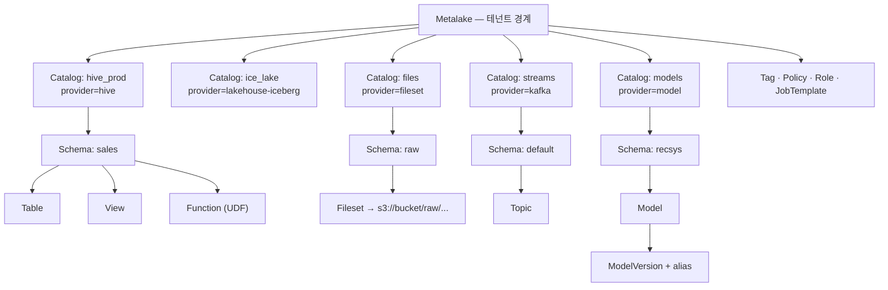
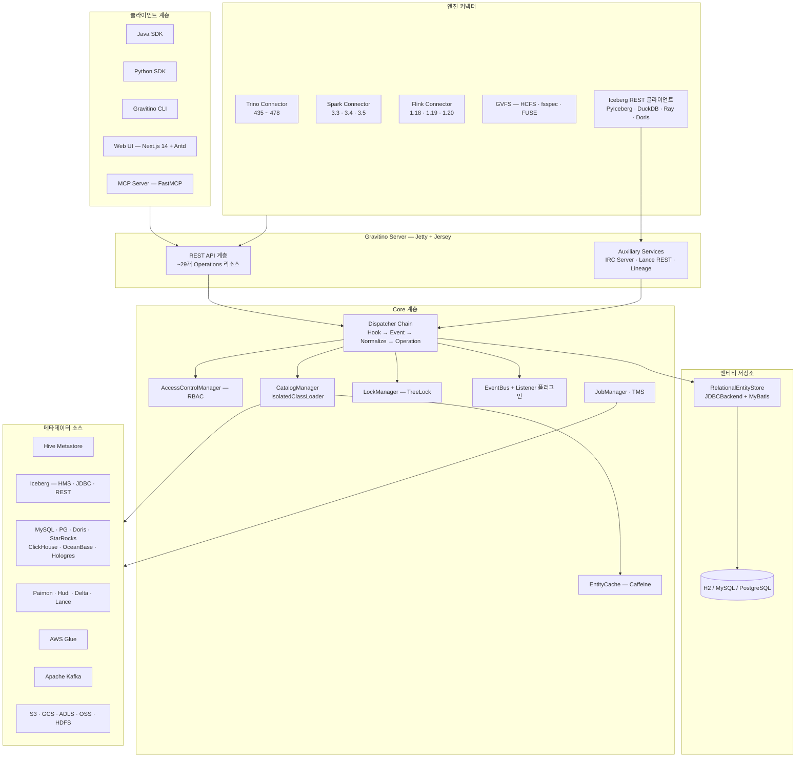
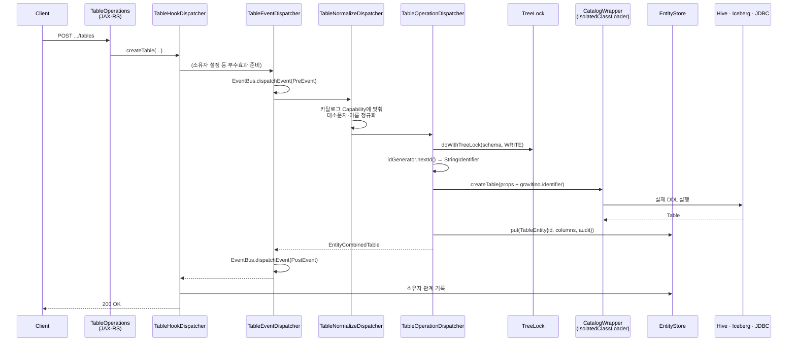
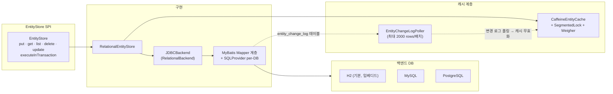
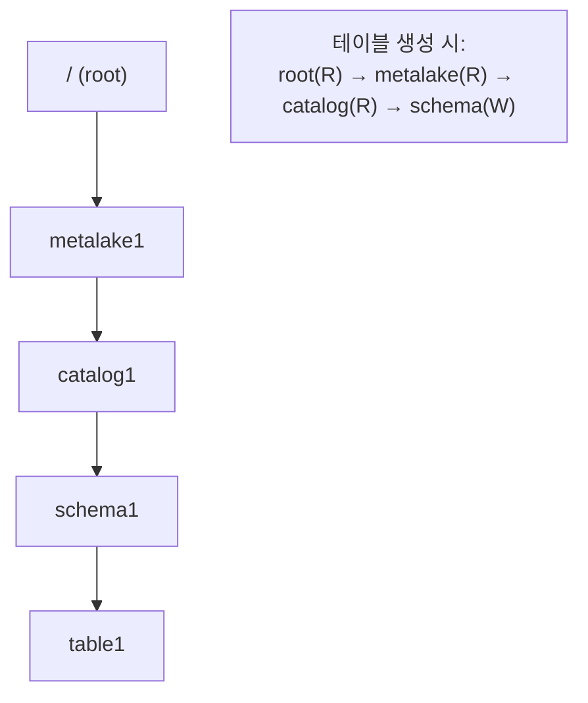
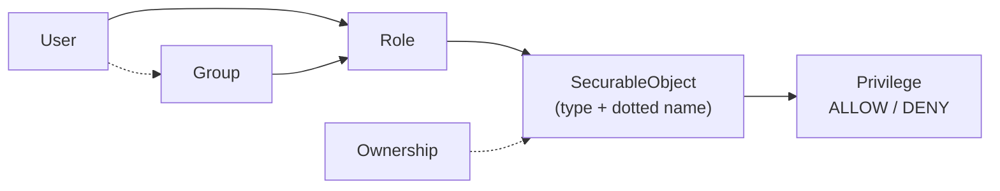
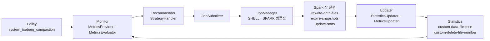
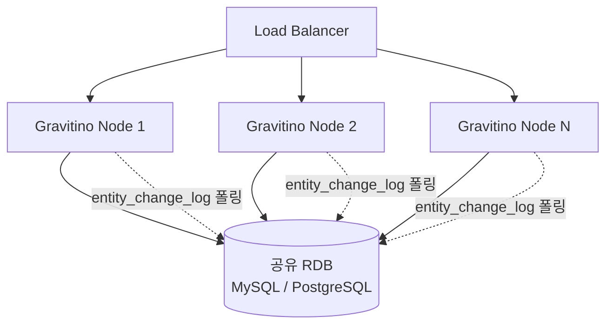
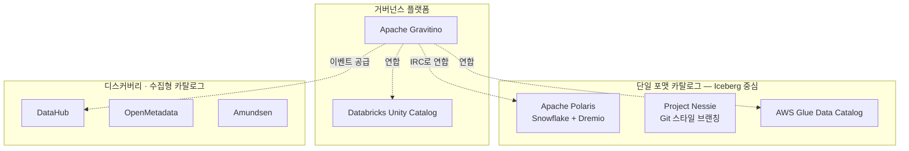
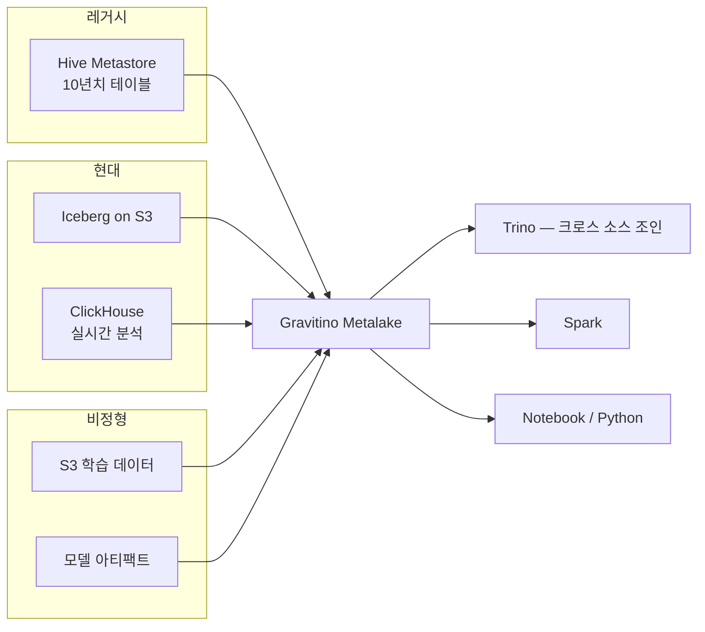

# Apache Gravitino 심층 분석

> 분석 기준: `apache/gravitino` main 브랜치 (2026-08-18 커밋 `7b6cf6b`, `version = 2.0.0-SNAPSHOT`)
> 최신 정식 릴리스: **v1.3.0** (v1.2.0은 2026-03-13, v1.1.0은 2025-12-16 릴리스)
> 라이선스: Apache-2.0 / ASF Top-Level Project (2025-06-03 졸업)

---

## 1. 프로젝트 개요

### 1.1 한 줄 정의

Apache Gravitino는 **"카탈로그들의 카탈로그(catalog of catalogs)"** 다. Hive Metastore, Iceberg REST Catalog, MySQL/PostgreSQL, Kafka, S3/HDFS, ML 모델 레지스트리 등 서로 다른 메타데이터 소스를 **하나의 객체 모델과 하나의 REST API**로 묶어서 노출하고, 그 위에 접근제어·감사·태그·정책·리니지를 얹는 **연합(federated) 메타데이터 레이크**다.

### 1.2 해결하려는 문제 (Problem Statement)

현대 데이터 플랫폼의 실제 상태는 다음과 같다.

- 테이블은 Hive Metastore + Iceberg REST Catalog + Glue에 나뉘어 있고
- 비정형 파일은 S3/HDFS 버킷 경로로 코드에 하드코딩되어 있으며
- 스트림은 Kafka에, 모델은 MLflow/S3 어딘가에 있고
- 엔진은 Spark / Trino / Flink / DuckDB / Python 이 제각각 다른 커넥터 설정으로 붙는다

여기서 발생하는 고통은 세 가지다.

| 문제 | 기존 접근 | Gravitino의 주장 |
|---|---|---|
| 메타데이터 파편화 | 데이터를 물리적으로 한 곳(레이크하우스)에 모은다 | **데이터는 그대로 두고 메타데이터만 통합**한다 |
| 카탈로그 수집 지연 | DataHub/OpenMetadata식 크롤러가 주기적으로 스캔 → stale | **직접 관리(Direct Metadata Management)**: Gravitino를 통한 DDL이 곧 원본 시스템의 DDL |
| 거버넌스 중복 | Ranger 정책 / Unity 권한 / IAM 정책을 시스템마다 따로 | 메타레이크 단위 RBAC + **Ranger로 권한 푸시다운** |

핵심 설계 철학은 **"페타바이트를 옮기지 않고 중앙 관리의 이점만 취한다"** 이다.

### 1.3 탄생 배경 및 연혁

| 시점 | 이벤트 |
|---|---|
| 2023 | Datastrato Inc.가 개발·오픈소스화 |
| 2024-06 | Apache Incubator 입성 |
| 2025-06-03 | **ASF Top-Level Project 졸업** |
| 2025-07 | 1.0.0 — "Metadata Management → Contextual Engineering" |
| 2025-12-16 | 1.1.0 — AI-native 레이크하우스 지향 |
| 2026-03-13 | 1.2.0 — Table Maintenance Service, ClickHouse, UDF, Scan Planning |
| 2026 상반기 | 1.3.0 — View 관리, Glue 카탈로그, 계층 네임스페이스, 내장 IdP |

프로덕션 채택 사례로 Xiaomi, Tencent, Uber, Pinterest, Zhihu 등이 언급되며, 커뮤니티에는 Apple, Intel, eBay, Cloudflare, AWS, Confluent, Cloudera 등이 참여한다. (커뮤니티 규모 자체는 본 분석의 관심사가 아니므로 참고만)

---

## 2. 핵심 특징 및 차별점

### 2.1 통합 객체 모델

Gravitino의 모든 것은 `Metalake → Catalog → Schema → {Table, View, Fileset, Topic, Model, Function}` 3~4 레벨 네임스페이스에 들어간다.



여기서 중요한 차별점은 **테이블뿐 아니라 Fileset(비정형 파일), Topic(스트림), Model(ML 모델), Function(UDF)까지 1급 객체**라는 점이다. Iceberg 전용 카탈로그(Polaris, Nessie)와 결정적으로 갈라지는 지점이다.

### 2.2 "Direct Metadata Management"

DataHub/OpenMetadata는 **수집형(ingestion-based)** 카탈로그다 — 크롤러가 주기적으로 소스를 스캔해서 사본을 만든다. 따라서 항상 stale 가능성이 있고, 카탈로그에서 DDL을 실행할 수 없다.

Gravitino는 **패스스루(pass-through)** 다. `POST /api/metalakes/m1/catalogs/hive/schemas/db/tables` 를 호출하면 Gravitino가 실제 Hive Metastore에 `createTable`을 날린다. 반대로 누가 Hive에 직접 테이블을 만들면 Gravitino의 `listTables`에도 즉시 보인다.

이 설계의 대가로 Gravitino는 **테이블 스키마의 사본을 소유하지 않는다**. 대신 자신의 엔티티(ID, 감사정보, 태그, 정책, 소유자)만 별도 RDB에 저장하고, 읽을 때 원본과 합쳐서 돌려준다 (§5.2 참조).

### 2.3 Iceberg REST Catalog (IRC) 서버 내장

Gravitino는 Iceberg REST Catalog 스펙(Iceberg 1.11)을 **직접 구현한 서버**를 내장한다. 즉 Gravitino는

- Iceberg REST 카탈로그의 **구현체**로도 쓸 수 있고 (Polaris/Nessie 자리)
- 다른 Iceberg REST 카탈로그를 **연합하는 프록시**로도 쓸 수 있다 (`FederatedCatalogWrapper`)

후자가 "geo-distributed" 주장의 실체다. 리전 A의 Gravitino가 리전 B의 IRC를 로컬 카탈로그처럼 프록시해서, 클라이언트는 하나의 엔드포인트로 전 지역 메타데이터를 본다.

### 2.4 Fileset + GVFS — 비정형 데이터의 간접화

Fileset은 **"이름 붙은 경로 포인터"** 다. 코드는 `s3://prod-bucket/team/raw/2026/` 대신 `gvfs://fileset/files/raw/events/` 를 읽는다.

- **Java GVFS**: Hadoop Compatible File System (HCFS) 구현 → Spark/Hive/Hadoop CLI가 그대로 사용
- **Python GVFS**: fsspec 구현 → pandas/PyArrow가 그대로 사용
- **FUSE**: Rust 구현 (`clients/filesystem-fuse`, Cargo 기반) → 로컬 디렉터리로 마운트

여기에 **크리덴셜 벤딩**이 결합되면 GVFS는 단순 편의가 아니라 **거버넌스 경계**가 된다. 클라이언트는 장기 클라우드 키를 갖지 않고, Gravitino가 STS 임시 토큰을 발급해준다.

### 2.5 AI/ML 자산의 1급 취급

| 자산 | Gravitino 표현 |
|---|---|
| 학습 데이터셋 (parquet 파일 더미) | Fileset |
| 학습된 모델 | Model + ModelVersion (+ alias `production`/`champion`) |
| 벡터/멀티모달 데이터 | Lance REST Service (`lance/lance-rest-server`) |
| 전처리 로직 | Function (Python/SQL/Java UDF) |
| LLM 에이전트 접근 | **MCP Server** (`mcp-server/`, Python FastMCP) |

`mcp-server` 모듈은 카탈로그 조회/DDL을 MCP 툴로 노출한다 (`get_list_of_tables`, `get_table_metadata_details`, `create_table`, `alter_table`, `drop_table`, 태그/정책/통계/잡 등). LLM 에이전트가 데이터 카탈로그를 직접 탐색하게 하는 "contextual engineering" 스토리의 구현체다.

### 2.6 Table Maintenance Service (1.2 신규)

카탈로그가 **관측만 하는 곳에서 행동하는 곳으로** 넘어간 지점이다.

```
통계 수집 → 정책 평가 → 잡 추천 → Spark 잡 제출 → 결과 통계 갱신
```

`system_iceberg_compaction` 정책을 카탈로그/스키마에 붙이면, 하위 테이블이 상속받고, Optimizer가 파일 단편화 지표(128MB 최적 크기 대비 평균제곱편차 `custom-data-file-mse`)와 delete file 누적(`custom-delete-file-number`)을 보고 파티션 단위로 compaction 잡을 제출한다.

---

## 3. 아키텍처 분석

### 3.1 전체 계층 구조



### 3.2 요청 처리 흐름 — Dispatcher 데코레이터 체인

Gravitino의 가장 특징적인 내부 설계는 **각 엔티티 타입마다 4겹의 데코레이터 체인**을 만든다는 것이다. `GravitinoEnv.initGravitinoServerComponents()` 에서 조립된다.



각 레이어의 책임은 명확히 분리되어 있다.

| 레이어 | 책임 | 소스 |
|---|---|---|
| `XxxHookDispatcher` | 최외곽. 소유권 설정, 권한 정리 등 **부수 효과** | `core/.../hook/` |
| `XxxEventDispatcher` | EventBus에 Pre/Post/Failure 이벤트 발행 (감사·리니지) | `core/.../listener/` |
| `XxxNormalizeDispatcher` | 카탈로그 `Capability`에 따른 이름 정규화 (Hive는 소문자 강제 등) | `core/.../catalog/` |
| `XxxOperationDispatcher` | 실제 작업. 락 획득, ID 생성, 커넥터 호출, 엔티티 저장 | `core/.../catalog/` |

12종 엔티티(Metalake, Catalog, Schema, Table, View, Fileset, Topic, Model, Function, Partition, Tag, Policy, Job)마다 이 체인이 반복된다. 코드 중복은 크지만 관심사 분리는 깨끗하다.

### 3.3 엔티티 저장소



**주목할 점 — 멀티노드 캐시 일관성**: Gravitino는 별도의 분산 캐시나 합의 프로토콜(Raft 등)을 쓰지 않는다. 대신 RDB에 `entity_change_log` 테이블을 두고, 각 서버 노드가 `EntityChangeLogPoller`로 주기적으로 폴링해서 자기 로컬 Caffeine 캐시를 무효화한다 (`EntityCacheChangeLogListener`). HA 구성은 "공유 RDB + stateless 노드 + 폴링 기반 캐시 무효화" 라는 단순한 모델이다.

트레이드오프가 명확하다 — 운영은 쉽지만 **폴링 간격만큼의 캐시 일관성 지연**이 존재한다.

### 3.4 계층적 락 (TreeLock)

네임스페이스 경로 자체가 락 트리다.



`TreeLockUtils.doWithTreeLock(ident, LockType.WRITE, fn)` 형태로 사용하며, 경로 상위 노드는 READ 락, 대상 노드는 WRITE 락을 잡는다. `TreeLockNode`는 참조 카운트(`AtomicLong referenceCount`)로 GC되고, 유휴 노드는 정리된다. 이는 **단일 노드 내부 동시성 제어**이며, 멀티노드 간 상호배제는 하위 소스 시스템(HMS, RDB)의 트랜잭션에 의존한다.

---

## 4. 기술 스택

| 영역 | 기술 |
|---|---|
| 언어 | **Java 17** (서버·코어), Python 3.10+ (클라이언트·MCP), **Rust** (FUSE), TypeScript (Web) |
| 빌드 | **Gradle (Kotlin DSL)** + Version Catalog, 멀티 모듈 (60+ 서브프로젝트) |
| HTTP | **Jetty 9.4** + **Jersey 2.41** (JAX-RS) |
| 직렬화 | Jackson 2.15 |
| 영속성 | **MyBatis 3.5** (DB별 SQLProvider 분기) + HikariCP, H2 / MySQL / PostgreSQL |
| 캐시 | **Caffeine 2.9** |
| 메트릭 | **Dropwizard Metrics** → JMX + `/metrics` (JSON) + `/prometheus/metrics` |
| 로깅 | Log4j2, SLF4J |
| 유틸 | Guava 32.1, commons-lang3, Lombok |
| 통합 대상 | Iceberg 1.11, Paimon 1.2, Hudi 0.15, Kafka 3.4, Lance 6.0, Trino 435~478, Spark 3.3~3.5, Flink 1.18~1.20 |
| 리니지 | **OpenLineage** |
| 권한 푸시다운 | **Apache Ranger** |
| Web UI | **Next.js 14 + React 18 + Ant Design 5 + TypeScript** (v1 / v2 두 버전 병존, `GRAVITINO_USE_WEB_V2`로 전환) |
| 배포 | Docker Hub 이미지, **Helm Chart** (OCI registry, K8s 1.29+) |

코드 규모는 `src/main/java` 기준 약 **2,865개 Java 파일**, 그중 `core` 모듈이 1,055개다.

---

## 5. 핵심 코드 분석

### 5.1 StringIdentifier — 사본 없이 원본을 추적하는 트릭

Gravitino가 "수집형 카탈로그가 아니다"라고 주장할 수 있는 이유가 이 한 클래스에 압축되어 있다.

```java
// core/src/main/java/org/apache/gravitino/StringIdentifier.java
public static final String ID_KEY = "gravitino.identifier";
static final String CURRENT_FORMAT = "gravitino.v%d.uid%d";
private static final String STRING_COMMENT = "From Gravitino, DO NOT EDIT: ";
```

테이블을 만들 때 Gravitino는 자기 snowflake ID를 `gravitino.v1.uid<ID>` 문자열로 만들어 **원본 시스템의 테이블 프로퍼티에 심는다**.

```java
// TableOperationDispatcher.internalCreateTable
long uid = idGenerator.nextId();
StringIdentifier stringId = StringIdentifier.fromId(uid);
Map<String, String> updatedProperties =
    StringIdentifier.newPropertiesWithId(stringId, properties);
// → 커넥터가 이 프로퍼티를 원본 시스템에 저장
```

프로퍼티 맵을 지원하지 않는 시스템(예: MySQL 테이블)에는 **주석(comment) 필드에** `From Gravitino, DO NOT EDIT: (gravitino.v1.uid12345)` 형태로 끼워 넣는다.

이렇게 하면 Gravitino 쪽 RDB의 `TableEntity`(태그·정책·소유자·감사정보)와 원본 시스템의 실제 테이블이 **동기화 프로세스 없이** 항상 짝지어진다. 원본에서 테이블이 사라지면 짝을 잃은 엔티티는 고아가 되고, `RelationalGarbageCollector` / `OrphanedSchemaCleanup` 이 정리한다.

### 5.2 EntityCombinedTable — 원본 + 엔티티 병합

읽기 경로에서는 두 소스를 합친다.

```java
return EntityCombinedTable.of(table)      // 원본 시스템에서 온 실제 스키마
    .withHiddenProperties(...);           // Gravitino 내부 프로퍼티는 마스킹
```

`EntityCombined{Table,Schema,Fileset,Topic,Model,View}` 는 모두 같은 패턴이다. 응답에서 `gravitino.identifier` 같은 내부 프로퍼티와 커넥터 자격증명은 `getHiddenPropertyNames()` 로 걸러진다.

> **엔지니어 관점 함의**: Gravitino를 거치지 않고 원본 시스템에 직접 DDL을 하면, 그 객체는 Gravitino ID를 갖지 못한다. 목록에는 보이지만 태그/정책/소유자를 붙이는 시점에 Gravitino가 엔티티를 lazily 생성해줘야 한다. 이 "ID 없는 객체" 처리가 실제 운영에서 미묘한 엣지케이스를 만든다.

### 5.3 IsolatedClassLoader + ClassLoaderPool — 의존성 지옥 회피

Hive 2.x와 Hive 3.x, Iceberg와 Paimon과 Hudi를 **한 JVM 안에서 동시에** 로드해야 한다. 서로 충돌하는 Hadoop/Thrift/Parquet 버전을 들고 오기 때문에 단일 클래스패스로는 불가능하다.

```java
// CatalogManager
CatalogWrapper wrapper = ...;
return classLoader.withClassLoader(cl -> fn.apply(catalog.ops()));
```

각 카탈로그는 자신의 `provider` 디렉터리(`catalogs/hive/libs/` 등)만 보는 `IsolatedClassLoader` 안에서 초기화·실행된다. 모든 커넥터 호출은 `withClassLoader()` 로 감싸져 TCCL을 스왑한다.

1.x에서 추가된 `ClassLoaderPool` (`gravitino.catalog.classloader.sharing.enabled`)은 **동일 provider+config 조합의 카탈로그가 클래스로더를 공유**하게 해서, 카탈로그 수백 개 환경에서의 메모리 폭증(Metaspace)을 완화한다.

`properties()` 와 `capability()` 는 클래스로더 안에서 **미리 로드(preload)** 해둔다 — 나중에 클래스로더 바깥에서 호출될 때 `ClassNotFoundException`이 나지 않게 하기 위한 조치다.

### 5.4 권한 모델 (RBAC)



- **34개 Privilege**: `USE_CATALOG`, `USE_SCHEMA`, `SELECT_TABLE`, `MODIFY_TABLE`, `CREATE_TABLE`, `CREATE_VIEW`, `SELECT_VIEW`, `READ_FILESET`, `WRITE_FILESET`, `PRODUCE_TOPIC`, `CONSUME_TOPIC`, `REGISTER_MODEL`, `USE_MODEL`, `CREATE_MODEL_VERSION`, `LINK_MODEL_VERSION`, `REGISTER_FUNCTION`, `EXECUTE_FUNCTION`, `MODIFY_FUNCTION`, `APPLY_TAG`, `APPLY_POLICY`, `MANAGE_GRANTS`, `MANAGE_USERS`, `MANAGE_GROUPS`, `REGISTER_JOB_TEMPLATE`, `USE_JOB_TEMPLATE`, `RUN_JOB` 등
- **DENY가 항상 이긴다** — 같은 롤이든 다른 롤이든, 계층 위든 아래든 무관
- **Ownership은 별도 축** — 객체 생성자가 소유자가 되며, ALTER/DROP/이양 권한은 privilege가 아니라 ownership에서 나온다
- **traversal 권한 필수** — `SELECT_TABLE`만 있고 `USE_CATALOG`/`USE_SCHEMA`가 없으면 아무것도 못 한다
- **컬럼 레벨 권한 없음** — 모델에 컬럼이 securable object로 존재하지 않는다 (Unity Catalog 대비 명확한 갭)
- 403 대신 **404를 반환**하는 읽기 경로가 있다 — 존재 여부 추론 방지

**Active Role 축소(narrowing)**: 요청 헤더로 이번 요청에 사용할 롤 부분집합을 지정해 최소권한 원칙을 적용할 수 있다.

### 5.5 Authorization Pushdown (Ranger)

Gravitino 내부 grant를 **Apache Ranger 정책으로 변환해서 써넣는다**.

```properties
authorization-provider=ranger            # 또는 chain (다중 대상)
authorization.ranger.admin.url=...
authorization.ranger.service.type=HadoopSQL   # 또는 HDFS
authorization.ranger.service.name=hiveRepo
```

`AuthorizationPlugin` SPI (`connector/authorization/`)로 추상화되어 있어 Ranger 외 시스템도 붙일 수 있다. `authorization-chain` 모듈은 하나의 카탈로그 grant를 여러 Ranger 서비스에 동시에 반영한다 (예: Iceberg 테이블 = HadoopSQL 정책 + 하위 HDFS 경로 정책).

이 덕분에 **Gravitino를 우회해서 Spark가 Hive에 직접 붙어도 권한이 걸린다**. 순수 메타 카탈로그(discovery-only)와 갈라지는 핵심 지점.

### 5.6 이벤트 시스템 & 리니지

```java
// EventBus + AsyncQueueListener + EventListenerPluginWrapper
eventBus.dispatchEvent(new CreateTablePreEvent(...));
```

- 모든 dispatcher 체인에서 Pre / Post / Failure 이벤트가 발행된다
- 리스너는 플러그인으로 등록하며 **동기/비동기(공유 큐/전용 큐)** 모드 선택 가능
- 내장 소비자: `AuditLogManager` (감사 로그, 1.3에서 JSON 포매터 추가)
- `lineage` 모듈: OpenLineage 이벤트 수신 REST 엔드포인트 → `processor` → `sink` SPI. Spark용 전용 JAR이 Gravitino 식별자를 실은 리니지를 보낸다. **컬럼 레벨 리니지**와 fileset/model 간 리니지를 지원

### 5.7 Iceberg REST 서버 내부

```
iceberg/iceberg-rest-server/
├── service/rest/          # IcebergTableOperations, NamespaceOperations, ViewOperations, ConfigOperations
├── service/dispatcher/    # Gravitino 본체와 동일한 Operation→Event→Hook 체인 재현
├── service/cache/         # LocalScanPlanCache, ScanPlanCacheKey  ← 1.2 신규
├── service/cleanup/       # IcebergCleanupJob/Manager (orphan 파일 정리)
├── service/metrics/       # JDBCMetricsStore (Iceberg 커밋 메트릭 영속화)
├── service/provider/      # Static / Dynamic IcebergConfigProvider
└── service/FederatedCatalogWrapper.java   # 원격 IRC 프록시
```

- **배포 모드 3종**: 독립 서버(전용 패키지) / 독립 서버(Gravitino 패키지) / **Auxiliary 서비스** — 접근제어는 auxiliary 모드에서만 동작
- **미구현**: 멀티 테이블 트랜잭션, view registration
- **Scan Planning Offload (1.2)**: `/scan` 엔드포인트가 서버에서 manifest를 읽어 파일 목록을 계산 → DuckDB/PyIceberg 같은 경량 클라이언트가 엔진 기동 없이 파티션 프루닝된 파일 목록을 받는다. 결과는 `LocalScanPlanCache`에 캐싱. (NYC Yellow Taxi 데이터셋 0.90초 사례 보고)

### 5.8 Job / Table Maintenance Service



모듈 구성: `maintenance/optimizer-api` (SPI) + `maintenance/optimizer` (구현 + CLI) + `maintenance/jobs` (내장 Spark 잡) + `maintenance/updaters`.

내장 잡: `IcebergRewriteDataFilesJob`, `IcebergExpireSnapshotsJob`, `IcebergUpdateStatsAndMetricsJob`.

**운영상 주의점** (공식 문서가 직접 언급): 잡 상태는 **푸시가 아니라 폴링**이며 `gravitino.job.statusPullIntervalInMs` 기본값이 **5분**이다. 로컬/개발 환경에서는 정상 동작 중인 잡이 멈춘 것처럼 보인다.

---

## 6. API 및 인터페이스

### 6.1 REST API

`server/src/main/java/org/apache/gravitino/server/web/rest/` 에 29개 리소스 클래스가 있다.

| 그룹 | 엔드포인트 |
|---|---|
| 메타데이터 | `/api/metalakes/{ml}/catalogs/{c}/schemas/{s}/tables\|views\|filesets\|topics\|models\|functions` |
| 파티션 | `.../tables/{t}/partitions` |
| 거버넌스 | `/tags`, `/policies`, `/statistics`, `/objects/{type}/{name}/tags\|policies\|roles` |
| 권한 | `/users`, `/groups`, `/roles`, `/permissions/...`, `/owners/...` |
| 잡 | `/jobs`, `/jobs/templates` |
| 크리덴셜 | `/objects/{type}/{name}/credentials` |
| 운영 | `/version`, `/health`(1.3), `/metrics`, `/prometheus/metrics` |
| Iceberg | `/iceberg/v1/...` (Iceberg REST 스펙) |
| Lance | Lance REST 스펙 |
| 리니지 | OpenLineage 수신 엔드포인트 |

### 6.2 SDK / CLI

| 인터페이스 | 비고 |
|---|---|
| Java SDK | `clients/client-java`, `client-java-runtime` (shaded) |
| Python SDK | `clients/client-python` — **Python 3.10+ 필수** (3.9는 1.2에서 EOL) |
| CLI | `clients/cli` — `gcli` |
| Web UI | Next.js, v1/v2 병존 |
| MCP | `mcp-server` — Python FastMCP, per-request 토큰·TLS·감사 지원 |
| GVFS | `filesystem-hadoop3` (Java HCFS), Python fsspec, `filesystem-fuse` (Rust) |

### 6.3 엔진 커넥터

| 엔진 | 방식 |
|---|---|
| **Trino** | `io.trino.spi.Plugin` 구현. Gravitino 카탈로그를 Trino 카탈로그로 동적 매핑. 435~478 다중 버전 |
| **Spark** | `SparkCatalog` 확장. 3.3/3.4/3.5 별 runtime shadow jar |
| **Flink** | `org.apache.flink.table.factories.Factory`. 1.18/1.19/1.20 |
| **Daft / Ray / DuckDB / PyIceberg / Doris / StarRocks** | Iceberg REST 프로토콜로 직접 연결 |

Trino/Spark/Flink 커넥터는 **크리덴셜 벤딩을 자동으로 소비**한다 — 사용자가 S3 키를 엔진 설정에 넣을 필요가 없다.

---

## 7. 확장성 및 플러그인

Gravitino는 **ServiceLoader 기반 SPI**를 일관되게 사용한다.

| SPI | 인터페이스 | 구현 예시 |
|---|---|---|
| 카탈로그 | `org.apache.gravitino.CatalogProvider` → `BaseCatalog` + `CatalogOperations` | 18개 (아래) |
| 권한 | `connector.authorization.AuthorizationProvider` | `ranger`, `chain` |
| 크리덴셜 | `credential.CredentialProvider` | `s3-token`, `gcs-token`, `oss-token`, `adls-token`, JDBC |
| 파일시스템 | `catalog.hadoop.fs.FileSystemProvider` | S3, GCS, ADLS, OSS, COS(Tencent), HDFS |
| 이벤트 | `listener.api.EventListenerPlugin` | 감사 로그, 커스텀 |
| 리니지 | lineage `processor` / `sink` | OpenLineage |
| 잡 실행 | `connector.job.JobExecutor` | local(Spark submit) |
| 저장소 매퍼 | `storage.relational.mapper.provider.MapperPackageProvider` | core, idp-basic 플러그인 |
| TMS | `StrategyHandler`, `StatisticsProvider`, `JobSubmitter`, `MetricsEvaluator` | Iceberg compaction |

### 지원 카탈로그 provider (`shortName`)

```
hive · lakehouse-iceberg · lakehouse-paimon · lakehouse-hudi · lakehouse-generic · glue
jdbc-mysql · jdbc-postgresql · jdbc-doris · jdbc-starrocks
jdbc-clickhouse · jdbc-oceanbase · jdbc-hologres   (catalogs-contrib)
kafka · fileset · model
```

`catalogs-contrib/`는 1.2에서 도입된 **커뮤니티 기여 카탈로그 존**으로, 코어보다 완만한 안정성 기준을 적용하는 계층 분리다.

`lakehouse-generic` 은 Delta Lake / Lance 같은 "테이블 포맷은 있지만 자체 카탈로그 서비스가 없는" 포맷을 external table로 얹는 범용 카탈로그다.

### 커스텀 카탈로그 작성 골격

```java
public class MyCatalog extends BaseCatalog<MyCatalog> implements CatalogProvider {
  @Override public String shortName() { return "my-source"; }
  @Override protected CatalogOperations newOps(Map<String,String> config) { ... }
  @Override public Capability newCapability() { ... }   // 이름 규칙·지원 기능 선언
}
```
+ `META-INF/services/org.apache.gravitino.CatalogProvider` 등록 + 전용 디렉터리에 jar 배치 (IsolatedClassLoader가 그 디렉터리만 본다)

---

## 8. 성능 특성

### 8.1 설계상의 성능 요소

| 요소 | 내용 |
|---|---|
| 메타데이터 캐시 | Caffeine, `SegmentedLock`으로 락 경합 분산, `EntityCacheWeigher`로 크기 기반 축출 |
| 권한 캐시 | 롤 캐시 10,000 / 소유자 캐시 100,000 / 메타데이터 ID 캐시 100,000, TTL 3600초 |
| 카탈로그 캐시 | `CATALOG_CACHE_EVICTION_INTERVAL_MS` — 유휴 카탈로그의 커넥션·클래스로더 해제 |
| Scan Plan 캐시 | IRC `/scan` 결과 캐싱 → manifest 재파싱 회피 |
| Iceberg 메타데이터 캐시 | 테이블 메타데이터 캐시 |
| 클래스로더 풀링 | 동일 provider 카탈로그 간 클래스로더 공유 (Metaspace 절감) |
| 배치 메타데이터 연산 | 1.2에서 다중 엔티티 타입 배치 연산 추가 |

### 8.2 알려진 제약

- **연합의 대가 — 네트워크 홉**: Gravitino는 원본 카탈로그 앞에 한 겹 더 놓이므로 메타데이터 연산에 **10~50ms 수준의 추가 지연**이 붙는다는 제3자 분석이 있다. 쿼리 실행 시간 대비 무시할 수준이지만, 고빈도 메타데이터 연산(스트리밍 인제스트의 커밋 루프 등)에서는 의미가 있다.
- **캐시 일관성 지연**: 멀티노드에서 `EntityChangeLogPoller` 폴링 간격만큼 노드 간 뷰가 어긋날 수 있다.
- **성능은 소스 시스템에 종속**: Gravitino가 아무리 빨라도 뒤에 있는 HMS가 느리면 그대로 느리다. 캐시가 그 완충 장치다.
- **공식 벤치마크 부재**: 프로젝트가 공개한 표준 벤치마크 수치는 사실상 없다. IRC 고동시성 로드 개선, 권한 지연 감소 같은 "개선했다"는 릴리스 노트 서술이 있을 뿐 절대치 근거는 빈약하다.

### 8.3 스케일링 전략



서버 노드는 **stateless**이며 수평 확장한다. 상태는 전부 공유 RDB에 있으므로, **실질적 스케일 상한은 백엔드 RDB**다. 기본값인 H2(임베디드)는 개발 전용이며 프로덕션에서는 MySQL/PostgreSQL이 필수다.

---

## 9. 배포 및 운영

### 9.1 실행 방식

```bash
# 바이너리
./bin/gravitino.sh start          # 기본 포트 8090, Web UI 동일 포트
export GRAVITINO_USE_WEB_V2=false # 레거시 v1 UI로 전환

# Docker
docker pull apache/gravitino:<version>

# Kubernetes (Helm, OCI registry)
helm upgrade --install gravitino \
  oci://registry-1.docker.io/apache/gravitino-helm \
  --version <VERSION> -n gravitino --create-namespace

# 체험용 풀스택 (Trino/Spark/Hive/MySQL/PG 포함 docker-compose)
git clone https://github.com/apache/gravitino-playground
```

요구사항: **Java 17** (x86_64 / ARM64), Kubernetes 1.29+ & Helm 3+ (차트 사용 시). **Windows 미지원**.

### 9.2 핵심 설정

```properties
# 엔티티 저장소
gravitino.entity.store = relational
gravitino.entity.store.relational = JDBCBackend
gravitino.entity.store.relational.jdbcUrl = jdbc:mysql://...     # 기본값 jdbc:h2

# 인증
gravitino.authenticators = simple | oauth | kerberos    # 1.3에서 내장 IdP 추가

# 인가
gravitino.authorization.enable = true
gravitino.authorization.serviceAdmins = admin1,admin2

# 보조 서비스
gravitino.auxService.names = iceberg-rest, lance-rest, lineage

# 잡
gravitino.job.executor = local
gravitino.job.statusPullIntervalInMs = 300000   # 개발 시 10000 권장
gravitino.job.stagingDir = /tmp/gravitino/jobs/staging
```

### 9.3 관측

- `/metrics` (JSON), `/prometheus/metrics` (Prometheus), JMX
- 오퍼레이션 단위 메트릭: `gravitino_server_http_request_duration_seconds{operation="create-table"}`, `gravitino_server_{1..5}xx_responses_total`
- 감사 로그: EventListener 기반, 1.3에서 JSON 포매터
- 헬스체크 엔드포인트: 1.3에서 Gravitino / IRC 양쪽 추가
- 잡 로그: `{stagingDir}/{metalake}/{template}/{jobId}/{error,output}.log`

---

## 10. 경쟁·비교 분석

### 10.1 포지셔닝 지도



### 10.2 기능 비교표

| 항목 | **Gravitino** | Unity Catalog (OSS) | Apache Polaris | Nessie | DataHub | OpenMetadata | Hive Metastore |
|---|---|---|---|---|---|---|---|
| 성격 | 연합 메타카탈로그 + 거버넌스 | 거버넌스 카탈로그 | Iceberg REST 카탈로그 | Iceberg 버전 카탈로그 | 수집형 디스커버리 (+ Iceberg 카탈로그) | 수집형 디스커버리 | 테이블 메타스토어 |
| 메타데이터 소유 | **소유 안 함(패스스루) + 자체 엔티티** | 소유 | 소유 | 소유 | 사본(크롤링) | 사본(크롤링) | 소유 |
| Iceberg REST | **서버 구현 + 원격 IRC 프록시** | 지원 | 원조 구현 | 지원 | **구현 있음**(자체 warehouse 소유, 연합 ✗) | ✗ | ✗ |
| 다중 포맷 | Iceberg·Hive·Paimon·Hudi·Delta·Lance·JDBC | Delta·Iceberg 중심 | **Iceberg 전용** | **Iceberg 전용** | 메타는 광범위, 제어는 Iceberg만 | 메타만 | Hive 계열 |
| 비테이블 자산 | **Fileset · Topic · Model · Function** | Volume·Model·Function | ✗ | ✗ | 메타만(BI·파이프라인 포함) | 메타만(BI·파이프라인 포함) | ✗ |
| RBAC 대상 | **데이터 접근** (34 privilege, DENY-wins, ownership) | 데이터 접근(컬럼·행 포함) | 데이터 접근 | 제한적 | **메타데이터 편집** | **메타데이터 편집** | ✗(Ranger 의존) |
| 컬럼 레벨 보안 | **✗** | ✓ (마스킹·행 필터) | 부분 | ✗ | ✗ | ✗ | ✗ |
| 외부 권한 푸시다운 | **Ranger (chain 지원)** | ✗ | ✗ | ✗ | ✗ | ✗ | — |
| 크리덴셜 벤딩 | S3·GCS·ADLS·OSS·JDBC | ✓ | ✓ | 부분 | S3 (Iceberg 한정) | ✗ | ✗ |
| 리니지 | OpenLineage 수신 → 외부 sink 전달(저장 ✗) | 일부 | ✗ | ✗ | **강점** (저장·탐색·임팩트) | **강점** | ✗ |
| 전문 검색 / 글로서리 | **✗ / ✗** | 일부 | ✗ | ✗ | **✓ / ✓** | **✓ / ✓** | ✗ |
| 테이블 유지보수 자동화 | **TMS (1.2)** | 일부(Databricks 상용) | ✗ | ✗ | ✗ | ✗ | ✗ |
| AI/LLM 인터페이스 | **MCP 서버 (DDL 툴 포함)** | ✗ | ✗ | ✗ | agent context · aiAgent 엔티티 | **MCP 서버 (임퍼소네이션)** | ✗ |
| 지리 분산 | IRC 프록시 연합 | ✗ | ✗ | ✗ | ✗ | ✗ | ✗ |
| 필수 인프라 컴포넌트 | **2** (서버+RDB) | — | 서버+RDB | 서버+RDB | **6~8** (Kafka·ES 필수) | **3~4** (ES 필수) | HMS+RDB |

> DataHub / OpenMetadata와의 상세 비교는 **[Gravitino vs DataHub vs OpenMetadata](gravitino-vs-datahub-openmetadata.md)** 참조.

### 10.3 실전 선택 기준

- **Iceberg만 쓰고 순수 카탈로그가 필요하다** → Polaris 또는 Nessie. Gravitino는 과하다.
- **Databricks에 이미 락인되어 있다** → Unity Catalog. Gravitino의 강점이 발휘될 이질성이 없다.
- **데이터 디스커버리·비즈니스 글로서리·임팩트 분석이 목적** → DataHub / OpenMetadata. Gravitino의 UI와 디스커버리 기능은 이들에 크게 못 미친다.
- **Hive + Iceberg + Kafka + S3 파일 + ML 모델이 섞여 있고, 하나의 권한/감사 축이 필요하다** → **Gravitino의 스윗스팟**.
- **멀티 리전/멀티 클라우드에서 하나의 메타데이터 뷰가 필요하다** → Gravitino가 사실상 유일한 오픈소스 선택지.

> **중요한 뉘앙스**: Gravitino의 접근제어는 두 층으로 나뉜다. Gravitino API를 통과하는 요청은 자체 RBAC로 **집행**되지만, 엔진이 원본 시스템에 직접 붙으면 **Ranger 푸시다운이 설정된 카탈로그에서만** 집행된다. Ranger를 쓰지 않는 카탈로그(예: JDBC MySQL)에서는 Gravitino를 우회한 접근을 막을 수 없다. "discoverability는 추가하지만 enforcement는 위임한다"는 제3자 평가는 이 절반의 진실을 가리킨다.

---

## 11. 유즈케이스

### 11.1 이질적 스택의 단일 메타데이터 평면



Trino에서 `SELECT ... FROM hive_prod.sales.orders JOIN ice_lake.mart.users` 처럼 카탈로그를 넘나드는 쿼리가 가능해진다. 커넥터 설정을 Trino 설정 파일마다 복제하는 대신 Gravitino가 동적으로 매핑한다.

### 11.2 ML 파이프라인의 경로 간접화

**Before**
```python
df = pd.read_parquet("s3://prod-ml-bucket/features/v3/2026-08/")   # 하드코딩
model = load("s3://prod-ml-bucket/models/recsys/v17.pt")           # 하드코딩
```

**After**
```python
df = pd.read_parquet("fileset/files/features/user_features")       # GVFS + fsspec
model_uri = client.load_model_version("models.recsys.ranker", alias="production").uri()
```

- 버킷 이전 시 fileset 정의만 바꾸면 되고, 잡 코드는 손대지 않는다
- `production` 별칭을 새 버전으로 옮기면 전체 서빙이 따라온다
- 자격증명은 Gravitino가 STS 임시 토큰으로 벤딩 → 코드에 장기 키 없음
- 데이터셋·모델에 태그/정책/소유자가 붙고, 접근이 감사 로그에 남는다

### 11.3 Iceberg 레이크하우스의 REST 카탈로그

```bash
spark-sql \
  --conf spark.sql.catalog.rest=org.apache.iceberg.spark.SparkCatalog \
  --conf spark.sql.catalog.rest.type=rest \
  --conf spark.sql.catalog.rest.uri=http://gravitino:9001/iceberg \
  --conf spark.sql.catalog.rest.header.X-Iceberg-Access-Delegation=vended-credentials
```

Polaris 대신 Gravitino를 IRC로 쓰면서, **동시에** 같은 서버에서 Hive/Kafka/Fileset도 관리한다. DuckDB/PyIceberg 같은 경량 클라이언트는 `/scan` 오프로딩으로 엔진 없이 파티션 프루닝된 파일 목록만 받아간다.

### 11.4 멀티 리전 메타데이터 SSOT

리전 A의 Gravitino가 리전 B/C의 IRC를 `FederatedCatalogWrapper`로 프록시 → 어느 리전의 사용자든 하나의 엔드포인트에서 전 지역 카탈로그를 본다. 데이터는 이동하지 않고 메타데이터 뷰만 통합된다.

### 11.5 LLM 에이전트를 위한 데이터 컨텍스트

```
Claude / LLM Agent
      │ MCP (stdio · HTTP+TLS, per-request token)
      ▼
Gravitino MCP Server (FastMCP)
      │ REST
      ▼
Gravitino  →  Hive · Iceberg · Fileset · Model
```

에이전트가 "매출 관련 테이블 찾아서 스키마 보여줘" 같은 요청을 수행할 때, MCP 툴을 통해 카탈로그를 탐색한다. 요청별 토큰 전파와 감사 기록이 지원되므로 **에이전트의 접근도 사람과 동일한 RBAC 축에서 통제**된다.

### 11.6 Iceberg 테이블 자동 유지보수

```
정책 부착 (catalog 레벨)
  → 상속으로 하위 테이블 전체 적용
  → 통계 기반 파티션 단위 단편화 평가
  → 필요한 파티션만 compaction 잡 제출
```

테이블 전체를 무차별 compaction하는 크론잡 대신, 통계 기반으로 필요한 파티션만 골라 처리한다.

---

## 12. 종합 평가

### 12.1 강점

1. **아키텍처 일관성** — Dispatcher 체인, SPI, IsolatedClassLoader, TreeLock 등 핵심 패턴이 12종 엔티티 전반에 균일하게 적용되어 있다. 코드를 읽을 때 한 엔티티를 이해하면 나머지가 자동으로 읽힌다.
2. **StringIdentifier 설계** — 동기화 프로세스 없이 외부 시스템 객체에 자기 ID를 심어 추적하는 방식은 영리하고, "수집형이 아니다"라는 주장을 코드로 뒷받침한다.
3. **비테이블 자산의 1급 취급** — Fileset/Model/Topic/Function이 테이블과 동등한 거버넌스 축에 들어간다. Iceberg 전용 카탈로그가 흉내낼 수 없는 영역.
4. **Ranger 푸시다운** — 카탈로그를 우회한 접근까지 커버하는 유일한 오픈소스 메타카탈로그.
5. **의존성 격리 실전성** — Hive2/Hive3/Iceberg/Paimon/Hudi를 한 JVM에서 돌리는 문제를 정면으로 풀었다. 실제로 이 문제를 안 풀면 다중 포맷 카탈로그는 성립하지 않는다.
6. **AI 방향의 구체성** — MCP 서버, Lance REST, 모델 카탈로그는 마케팅 수사가 아니라 실제 모듈로 존재한다.

### 12.2 약점 / 리스크

1. **컬럼 레벨 보안 부재** — 권한 모델에 컬럼이 securable object로 존재하지 않는다. 마스킹·행 필터가 필요한 규제 산업에서는 Unity Catalog나 Ranger 직접 사용이 불가피하다.
2. **집행의 반쪽** — Gravitino를 우회하는 접근은 Ranger 푸시다운이 설정된 카탈로그에서만 막힌다. JDBC 계열 카탈로그는 사실상 discovery-only에 가깝다.
3. **연합의 지연** — 추가 네트워크 홉이 붙고, 캐시 일관성은 폴링 간격에 종속된다. 초저지연 메타데이터 연산 경로에는 부적합.
4. **공개 벤치마크 부재** — 성능 주장이 릴리스 노트의 서술 수준에 머문다. 대규모 도입 전 자체 부하 테스트가 필수다.
5. **표면적이 매우 넓다** — 카탈로그 18종 + 엔진 커넥터 3종 × 다중 버전 + IRC + Lance + Job + TMS + Lineage + MCP. 각 조합의 성숙도가 균일하지 않다. `catalogs-contrib` 분리는 이 문제를 인정한 조치로 읽힌다.
6. **빠른 이동 속도** — 1.0(2025-07) → 1.3(2026)까지 반년 남짓에 메이저 기능이 대거 들어왔다. 크리덴셜 벤딩 동작·Docker 이미지 레이아웃·IRC 업그레이드 등 릴리스마다 동작 변경이 있다. 버전 고정과 업그레이드 문서 정독이 필요하다.
7. **디스커버리 UX 열세** — 비즈니스 글로서리, 임팩트 분석, 검색 경험은 DataHub/OpenMetadata에 크게 못 미친다. "데이터 담당자를 위한 카탈로그"가 아니라 **"플랫폼 엔지니어를 위한 메타데이터 인프라"** 로 이해해야 한다.
8. **벤더 중력** — ASF TLP지만 개발 주도력은 여전히 Datastrato에 상당히 집중되어 있다.

### 12.3 적합 / 부적합

| 적합 | 부적합 |
|---|---|
| Hive + Iceberg + Kafka + 오브젝트 스토리지가 공존하는 이질적 스택 | Iceberg만 쓰는 단순 레이크하우스 (Polaris로 충분) |
| 멀티 리전 / 멀티 클라우드 메타데이터 통합 | Databricks 단일 플랫폼 |
| ML 데이터셋·모델을 데이터 자산과 같은 축에서 거버넌스 | 컬럼 마스킹·행 필터가 규제 요구사항인 경우 |
| Trino/Spark/Flink 다중 엔진 환경의 커넥터 설정 폭발 | 비즈니스 사용자 대상 데이터 디스커버리 포털 |
| Ranger가 이미 깔려 있는 온프렘/하이브리드 하둡 자산 | 초저지연 메타데이터 연산이 병목인 경우 |
| LLM 에이전트에 데이터 컨텍스트를 안전하게 노출 | 소규모 단일 소스 환경 (오버엔지니어링) |

### 12.4 엔지니어 관점 인사이트

**Gravitino를 한 문장으로 요약하면: "메타데이터 계층의 서비스 메시"** 다.

서비스 메시가 서비스 간 통신에서 관측·보안·라우팅을 뽑아내 사이드카로 옮겼듯, Gravitino는 엔진과 스토리지 사이의 **메타데이터 접근 경로**에서 카탈로그·권한·감사·크리덴셜을 뽑아내 중앙 레이어로 옮긴다. 이 비유는 장단점을 동시에 설명한다 — **추가 홉의 비용**을 지불하고 **횡단 관심사의 일원화**를 얻는다.

세 가지 코드 레벨 관찰이 특히 인상적이다.

1. **StringIdentifier의 comment 폴백** — 프로퍼티 맵이 없는 시스템에는 주석에 ID를 심는다. "이상적이지 않지만 현실에서 동작한다"는 태도가 프로젝트 전반에 흐른다.
2. **`ClassLoaderPool`의 도입 시점** — 초기에는 카탈로그당 클래스로더였다가, 카탈로그 수백 개 환경에서 Metaspace가 터지고 나서 풀링이 들어왔다. 실사용 피드백이 설계를 바꾼 흔적.
3. **`EntityChangeLogPoller`** — 분산 합의 없이 RDB 폴링으로 캐시 일관성을 푼다. "충분히 좋은" 해법을 고르는 판단이 보인다. 동시에 이것이 강한 일관성이 필요한 시나리오에서의 한계이기도 하다.

반대로 경계해야 할 지점은 **"통합"이라는 단어가 감추는 것**이다. Gravitino는 메타데이터 뷰를 통합하지만, 각 소스 시스템의 세만틱 차이(타입 시스템, 트랜잭션 격리, 파티션 모델)를 없애주지는 않는다. `Capability` 인터페이스와 `Normalize` 디스패처가 존재한다는 사실 자체가, 통합 모델과 실제 소스 사이의 임피던스 미스매치를 코드가 계속 흡수하고 있다는 증거다. 새 소스를 붙일 때마다 이 미스매치를 직접 다뤄야 한다.

---

## 참고 자료

- [apache/gravitino (GitHub)](https://github.com/apache/gravitino)
- [Apache Gravitino 공식 문서](https://gravitino.apache.org/docs/latest/)
- [Apache Gravitino Top-Level Project 졸업](https://gravitino.apache.org/blog/gravitino-top-level-project/)
- [Gravitino 1.2.0 릴리스 노트](https://gravitino.apache.org/blog/gravitino-1-2-0-release-notes/)
- [Gravitino 1.3.0 릴리스 노트](https://gravitino.apache.org/blog/gravitino-1-3-0-release-notes/)
- [Gravitino 1.0.0 — From Metadata Management to Contextual Engineering](https://gravitino.apache.org/blog/gravitino-1-0-0-release-notes/)
- [Datastrato — Gravitino 1.2: From Metadata Catalog to Operational Platform](https://datastrato.ai/blog/gravitino-1-2-0-introduction/)
- [The New Stack — Meet Gravitino, a geo-distributed, federated metadata lake](https://thenewstack.io/meet-gravitino-a-geo-distributed-federated-metadata-lake/)
- [Onehouse — Comprehensive Data Catalog Comparison](https://www.onehouse.ai/blog/comprehensive-data-catalog-comparison)
- [Kyle Weller — Data Catalog Comparisons: Unity Catalog vs Apache Polaris vs DataHub](https://medium.com/@kywe665/data-catalog-comparisons-unity-catalog-vs-apache-polaris-vs-datahub-and-more-9eee382001bf)
- [The State of Apache Iceberg Catalogs in June 2026](https://amdatalakehouse.substack.com/p/the-state-of-apache-iceberg-catalogs)
- [Apache Gravitino Playground](https://github.com/apache/gravitino-playground)
