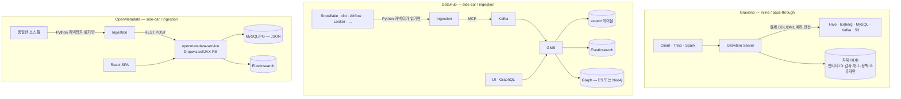
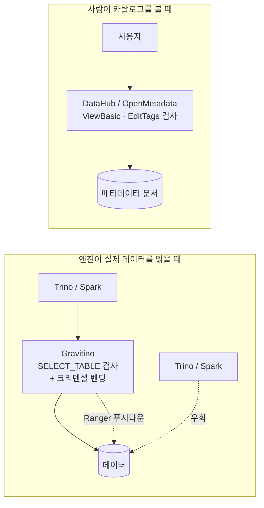
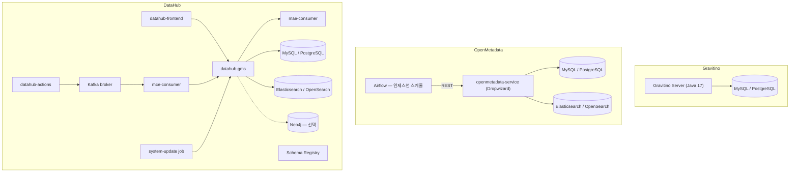
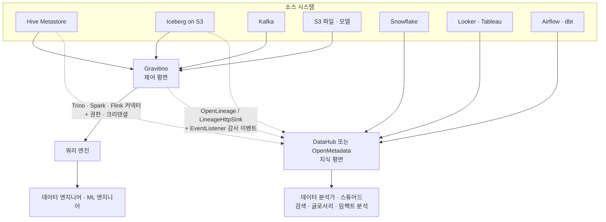

# Gravitino vs DataHub vs OpenMetadata — 코드 레벨 비교

> 분석 대상 (모두 2026-08-18 기준 main 브랜치 클론)
> - `apache/gravitino` — `7b6cf6b`
> - `datahub-project/datahub` — `c9144145`
> - `open-metadata/OpenMetadata` — `ed1d18a4`

---

## 0. 결론 먼저

**세 프로젝트는 "데이터 카탈로그"라는 같은 단어를 쓰지만 다른 평면(plane)에 산다.**

| | Gravitino | DataHub | OpenMetadata |
|---|---|---|---|
| 평면 | **Control Plane** (제어 평면) | **Knowledge Plane** (지식 평면) | **Knowledge Plane** |
| 대답하는 질문 | "이 테이블을 어떻게 **만들고 읽는가**" | "이 테이블은 **무엇이고 누가 왜 쓰는가**" | 〃 |
| 경로상 위치 | 엔진 ↔ 스토리지 **사이 (inline)** | 시스템 **옆 (side-car)** | 시스템 **옆** |
| 죽으면 | **쿼리가 안 된다** | 검색이 안 된다 | 검색이 안 된다 |

마지막 줄이 가장 실용적인 구분법이다. Gravitino를 끄면 Trino 쿼리가 실패한다. DataHub/OpenMetadata를 꺼도 데이터 파이프라인은 멀쩡히 돈다.

---

## 1. 가장 근본적인 차이 — 쓰기 경로

### 1.1 Gravitino: 원본에 직접 쓴다 (pass-through)

```java
// core/.../catalog/TableOperationDispatcher.java : internalCreateTable
Table table = doWithCatalog(catalogIdent,
    c -> c.doWithTableOps(t -> t.createTable(ident, columns, comment, updatedProperties, ...)),
    NoSuchSchemaException.class, TableAlreadyExistsException.class);
```

`t.createTable(...)` 은 **실제 Hive Metastore의 `create_table` Thrift 호출**이거나 **Iceberg 커밋**이거나 **MySQL의 `CREATE TABLE`** 이다. Gravitino는 자기 DB에 테이블 스키마 사본을 만들지 않는다. 자기 엔티티(ID·감사·컬럼 참조)만 저장한다.

### 1.2 DataHub: 크롤링 후 자기 저장소에 쓴다

```
Python 커넥터(102개 source 패키지) → 소스 시스템을 읽음
  → MetadataChangeProposal(MCP) 생성
  → Kafka 토픽
  → GMS(mce-consumer) → aspect 테이블(MySQL/PG) + Elasticsearch + Graph(ES/Neo4j)
  → MetadataChangeLog(MCL) → mae-consumer → 검색/그래프 인덱스 갱신
```

소스 시스템에는 **아무것도 쓰지 않는다.** `metadata-ingestion/src/datahub/ingestion/source/apply/datahub_apply.py` 라는 "apply" 소스가 있지만, 이건 **DataHub 엔티티에 태그·소유자·도메인·글로서리 term을 일괄 적용**하는 것이지 원본 시스템에 반영하는 게 아니다.

### 1.3 OpenMetadata: 크롤링 후 자기 REST API로 쓴다

`ARCHITECTURE.md`가 직접 서술하는 경로다.

```
ingestion/(Python, Airflow 또는 metadata CLI)
  → <Name>Source (service_spec.py로 동적 로드)
  → connection.py 로 소스 접속, 토폴로지가 엔티티를 yield
  → sink/metadata_rest.py 가 백엔드 REST API에 POST      ← Path B가 Path A로 합류
  → JAX-RS Resource → jdbi3 Repository → CollectionDAO → MySQL/PG
  → 비동기로 ES 인덱스 갱신 + change event 발행
```

DataHub와 마찬가지로 **소스에는 쓰지 않는다.** 다만 DataHub의 Kafka 중계 없이 REST 단일 경로라는 점이 구조적으로 단순하다.

### 1.4 그림으로



### 1.5 이 차이가 만드는 실무적 결과

| 항목 | Gravitino | DataHub / OpenMetadata |
|---|---|---|
| 신선도 | **항상 최신** (읽을 때마다 원본 조회 + 캐시) | 인제스천 주기만큼 stale (보통 시간~일 단위) |
| 카탈로그에서 DDL | **가능** — `CREATE TABLE`이 실제로 나감 | 불가 (메타데이터 문서만 편집) |
| 인제스천 파이프라인 운영 | **없음** | 커넥터 수십 개의 스케줄·실패·재시도 운영 필요 |
| 원본에 없는 자산 | 표현 불가 (Fileset/Model처럼 Gravitino가 직접 소유하는 것 제외) | 자유롭게 표현 (수동 등록, CSV enricher 등) |
| 소스 시스템 부하 | 조회마다 발생 (캐시로 완화) | 인제스천 시점에 집중 |
| BI 도구·파이프라인 자산 | **표현 못 함** | Tableau·Looker·Airflow·dbt 전부 1급 자산 |

---

## 2. 데이터 모델 철학

### 2.1 Gravitino — 고정된 타입 계층 (~14 엔티티)

```
Metalake → Catalog → Schema → { Table, View, Fileset, Topic, Model, Function }
                              + Partition, Column, ModelVersion
Metalake 직속: Tag, Policy, Role, User, Group, JobTemplate, Job, Statistic
```

엔티티 종류가 적고, 각각이 **원본 시스템의 실제 객체와 1:1 대응**한다. 새 개념을 추가하려면 Java 인터페이스·REST 리소스·디스패처 체인·저장소 매퍼를 전부 손대야 한다. 유연성보다 **세만틱의 강함**을 택한 설계다.

### 2.2 DataHub — Entity + Aspect (71 엔티티 / 692 aspect)

```yaml
# metadata-models/src/main/resources/entity-registry.yml
- name: dataset
  keyAspect: datasetKey
  aspects:
    - schemaMetadata          # 스키마
    - datasetProfile          # 프로파일링 통계
    - upstreamLineage         # 리니지
    - globalTags              # 태그
    - glossaryTerms           # 글로서리
    - ownership               # 소유자
    - domains / dataProduct   # 도메인·데이터 프로덕트
    - structuredProperties    # 커스텀 구조화 속성
    - icebergCatalogInfo      # ← Iceberg 카탈로그 정보
    - ... (50개 이상)
```

URN(`urn:li:dataset:(urn:li:dataPlatform:hive,db.tbl,PROD)`)으로 식별하고, **aspect를 추가하는 것만으로 새 메타데이터 종류를 붙일 수 있다**. `metadata-models-custom` 모듈로 사용자 정의 aspect도 가능하다.

엔티티 목록만 봐도 커버 범위가 드러난다:
`dataset, chart, dashboard, notebook, dataJob, dataFlow, mlModel, mlFeatureTable, glossaryTerm, domain, dataProduct, dataContract, assertion, incident, businessAttribute, structuredProperty, query, erModelRelationship, semanticModel, metric, application, aiAgent, agentSkill, api, repository, ...`

`aiAgent` / `agentSkill` / `semanticModel` 같은 엔티티가 존재한다는 게 이 모델의 확장성을 보여준다.

### 2.3 OpenMetadata — Schema-first (904 JSON Schema)

**JSON Schema가 단일 진리 원천**이고, 거기서 4개 생성기가 코드를 뽑는다.

```
openmetadata-spec/src/main/resources/json/schema/  (904개)
   ├─ jsonschema2pojo          → Java POJO
   ├─ datamodel-code-generator → Python Pydantic  (ingestion/src/metadata/generated/)
   ├─ quicktype                → TypeScript       (openmetadata-ui/.../src/generated/)
   └─ ANTLR                    → FQN 파서 (Python + JS)
```

`ARCHITECTURE.md`는 이걸 불변식 **I4**로 못박고, 생성 트리 편집을 훅으로 차단한다. Java/Python/TS 모델이 절대 어긋나지 않는다는 게 이 설계의 핵심 이점이다.

데이터 엔티티는 DataHub만큼 넓다:
`table, database, databaseSchema, dashboard, dashboardDataModel, pipeline, topic, mlmodel, searchIndex, container, apiEndpoint, apiCollection, storedProcedure, query, metric, glossary, glossaryTerm, dataContract, spreadsheet, worksheet, directory, file, article, page, ...`

`spreadsheet`/`worksheet`/`directory`/`file`(Google Drive 계열)까지 있다.

### 2.4 요약

| | Gravitino | DataHub | OpenMetadata |
|---|---|---|---|
| 모델 정의 | Java 인터페이스 (하드코딩) | **PDL(Pegasus) → 692 aspect** | **JSON Schema 904개** |
| 확장 방법 | 커넥터 SPI 구현 (자산 종류 추가는 코어 수정) | **aspect 추가** (커스텀 모델 지원) | **JSON Schema 추가** → 3개 언어 자동 생성 |
| 엔티티 수 | ~14 | **71** | ~60+ |
| 철학 | 소수 정예, 원본과 1:1 | 최대 유연성 | 스키마 우선 일관성 |

---

## 3. 접근제어 — "거버넌스"라는 단어의 함정

**여기가 가장 오해가 많은 지점이다.** 셋 다 "거버넌스"를 표방하지만 통제하는 대상이 다르다.

### 3.1 Gravitino — 데이터 접근을 통제한다

34개 privilege 중 데이터 오퍼레이션 관련:

```
USE_CATALOG · USE_SCHEMA · SELECT_TABLE · MODIFY_TABLE · CREATE_TABLE
SELECT_VIEW · CREATE_VIEW · READ_FILESET · WRITE_FILESET
PRODUCE_TOPIC · CONSUME_TOPIC · USE_MODEL · EXECUTE_FUNCTION · RUN_JOB
```

`SELECT_TABLE`이 없으면 **Trino 쿼리가 실패한다**. 여기에 두 가지가 더 붙는다.

- **Ranger 푸시다운** — Gravitino의 grant를 Ranger 정책으로 변환해 써넣어서, 엔진이 Gravitino를 우회해 Hive에 직접 붙어도 막힌다
- **크리덴셜 벤딩** — S3/GCS/ADLS/OSS 임시 토큰을 발급. 클라이언트가 장기 키를 갖지 않는다

### 3.2 OpenMetadata — 카탈로그 문서 편집을 통제한다

`entity/policies/accessControl/resourceDescriptor.json` 의 operation enum 실물:

```
All, Create, BulkCreate, Delete, ViewAll, ViewBasic, ViewUsage, ViewTests,
ViewQueries, ViewDataProfile, ViewSampleData, ViewCustomFields,
EditAll, EditDescription, EditDisplayName, EditLineage, EditTags,
EditGlossaryTerms, EditOwners, EditTier, EditCertification, EditTeams,
EditUsers, EditRole, EditPolicy, EditQueries, EditReviewers, EditTask, ...
```

전부 **"OpenMetadata 안에서 이 자산의 설명/태그/소유자를 편집할 수 있는가"** 다. `SELECT` 같은 건 없다. `ViewSampleData`가 데이터에 가장 가까운데, 이건 OpenMetadata가 인제스천 때 수집해둔 샘플을 UI에서 보여줄지 말지다.

### 3.3 DataHub — 마찬가지로 메타데이터 접근 통제

`metadata-auth` 모듈의 `Privilege`, `ConjunctivePrivilegeGroup`, `DisjunctivePrivilegeGroup`, `AuthorizedActors` 구조도 같은 성격이다. `dataHubPolicy` 엔티티로 정책을 관리하며, "누가 어떤 자산의 문서를 보고 편집하는가"를 다룬다.

### 3.4 정리



> **핵심**: DataHub/OpenMetadata에서 "이 테이블은 PII이므로 접근 제한"이라고 태그를 달아도, **그것만으로는 아무도 막히지 않는다.** 그 태그를 읽어서 Ranger나 Snowflake 정책으로 옮기는 별도 시스템이 필요하다. Gravitino는 그 옮기는 부분을 내장했다.
>
> 반대로, Gravitino의 통제도 완전하지 않다 — Ranger 푸시다운이 설정된 카탈로그가 아니면 우회 접근을 막지 못한다.

---

## 4. 정정할 통념 — "DataHub는 read-only 카탈로그다"

이건 이제 부정확하다. DataHub는 **네이티브 Iceberg REST 카탈로그를 내장하고 있다.**

```
metadata-service/iceberg-catalog/src/main/java/io/datahubproject/iceberg/catalog/
├── DataHubRestCatalog.java            # Iceberg Catalog 구현체
├── DataHubIcebergWarehouse.java       # warehouse 개념
├── DataHubTableOps.java / DataHubViewOps.java
├── credentials/S3CredentialProvider.java      # ← 크리덴셜 벤딩
├── credentials/CachingCredentialProvider.java
└── rest/
    ├── secure/IcebergApiController.java, IcebergTableApiController.java,
    │          IcebergNamespaceApiController.java, IcebergViewApiController.java
    └── open/PublicIcebergApiController.java   # 공개 읽기 전용 엔드포인트
```

```java
// DataHubIcebergWarehouse.java
public static final String DATASET_ICEBERG_METADATA_ASPECT_NAME = "icebergCatalogInfo";
public static final String DATAPLATFORM_INSTANCE_ICEBERG_WAREHOUSE_ASPECT_NAME = "icebergWarehouseInfo";
```

```yaml
# metadata-service/configuration/src/main/resources/application.yaml
icebergCatalog:
  enablePublicRead: ${ENABLE_PUBLIC_READ:false}
  publiclyReadableTag: ${PUBLICLY_READABLE_TAG:PUBLICLY_READABLE}
```

즉 DataHub도 **Iceberg 테이블에 한해서는** 제어 평면에 들어와 있다. 그러나 성격이 다르다.

| | Gravitino IRC | DataHub Iceberg Catalog |
|---|---|---|
| 소유 모델 | 자체 백엔드(HMS/JDBC/REST) **+ 원격 IRC 연합 프록시** (`FederatedCatalogWrapper`) | **DataHub가 warehouse를 소유** (aspect에 메타데이터 포인터 저장) |
| 기존 카탈로그 연합 | 가능 — 리전 간 IRC 프록시 | 해당 없음 |
| 다른 포맷 | Hive·Paimon·Hudi·Delta·JDBC·Kafka·Fileset 전부 | **Iceberg만** |
| 스캔 플래닝 오프로드 | 있음 (`/scan` + `LocalScanPlanCache`) | 없음 |
| 크리덴셜 벤딩 | S3·GCS·ADLS·OSS·JDBC | S3 |

OpenMetadata에는 이런 기능이 없다 — 순수 지식 평면이다.

---

## 5. 운영 풋프린트 — 실무에서 가장 체감되는 차이

### 5.1 최소 구성



`docker/quickstart` 기준 DataHub는 최소 구성에서도 `broker, kafka-broker, mysql, opensearch, gms, frontend, actions, system-update` 가 뜬다. `docker/profiles/` 에는 여기에 neo4j, elasticsearch-setup, kafka-setup, mae-consumer, mce-consumer, cassandra, postgres 프로필이 더 있다.

### 5.2 비교표

| | Gravitino | DataHub | OpenMetadata |
|---|---|---|---|
| 필수 컴포넌트 | **2** (서버 + RDB) | **6~8** | **3~4** |
| Kafka 필요 | ✗ | **✓ (필수)** | ✗ |
| Elasticsearch 필요 | ✗ | **✓ (필수)** | **✓ (필수)** |
| 그래프 DB | ✗ | 선택 (ES 그래프로 대체 가능) | ✗ |
| 스케줄러 | 내장 JobManager (TMS용) | 내장 ingestion-scheduler + Actions | **Airflow 권장** |
| 백엔드 언어 | Java 17 / Gradle | Java / Gradle + Python 인제스천 | Java (Dropwizard) / Maven + Python 인제스천 |
| 프론트엔드 | Next.js 14 + Antd | React (`datahub-web-react`) + GraphQL | React SPA + react-aria |
| 코드 규모 (main java) | ~2,865 파일 | 훨씬 큼 (18,598 파일 체크아웃) | `openmetadata-service`만 1,777 java 파일 |

Gravitino의 운영 단순함은 **기능을 덜 하기 때문**이다. 전문 검색을 안 하니 ES가 필요 없고, 이벤트 팬아웃을 자체 큐로 처리하니 Kafka가 필요 없다. 공짜가 아니다.

---

## 6. Gravitino가 갖지 못한 것 (코드로 확인)

DataHub/OpenMetadata를 쓰는 이유의 대부분이 여기 있다.

| 기능 | Gravitino | DataHub | OpenMetadata |
|---|---|---|---|
| **전문 검색 (full-text)** | **✗** — ES 없음, 검색 REST 리소스 자체가 없음 | ✓ ES 기반 랭킹·패싯 | ✓ ES/OS 기반, `service/search/` 294 파일 |
| **비즈니스 글로서리** | **✗** — `docs/glossary.md`는 프로젝트 약어 사전이지 기능이 아님 | ✓ `glossaryTerm`, `glossaryNode` 엔티티 | ✓ `glossary.json`, `glossaryTerm.json` |
| **도메인 / 데이터 프로덕트** | ✗ | ✓ `domain`, `dataProduct`, `application` | ✓ `entity/domains/` |
| **BI · 파이프라인 자산** | **✗** — 테이블/파일/토픽/모델만 | ✓ `chart, dashboard, dataFlow, dataJob, notebook` | ✓ `dashboard, pipeline, dashboardDataModel, report` |
| **데이터 프로파일링** | ✗ (통계 API는 있으나 수집기 없음) | ✓ `datasetProfile` aspect | ✓ 프로파일러 내장 |
| **데이터 품질 테스트** | ✗ | ✓ `assertion`, `dataContract`, `testResults` | ✓ `tests/` 스키마 트리 |
| **협업 (피드·태스크·승인)** | ✗ | ✓ `post`, `form`, incident | ✓ `entity/feed/`, `entity/tasks/` |
| **사용량·인기도** | ✗ | ✓ `datasetUsageStatistics`, `usageFeatures` | ✓ `ViewUsage`, `queryCostRecord` |
| **임팩트 분석 UI** | ✗ | ✓ 그래프 순회 | ✓ 계보 뷰 |
| **인시던트 관리** | ✗ | ✓ `incident`, `incidentsSummary` | ✓ incident manager |
| **소스 커넥터 수** | 18개 catalog provider (읽기·쓰기) | **102개 source 패키지** (읽기) | **71개 DB 커넥터** + 대시보드·파이프라인·ML·검색·스토리지·API·드라이브 (읽기) |

### 반대로 DataHub/OpenMetadata가 갖지 못한 것

| 기능 | Gravitino | DataHub | OpenMetadata |
|---|---|---|---|
| 엔진 커넥터 (Trino/Spark/Flink 플러그인) | **✓** | ✗ | ✗ |
| 다중 포맷 제어 평면 | **✓** | Iceberg만 | ✗ |
| 크리덴셜 벤딩 | **✓** (S3·GCS·ADLS·OSS·JDBC) | S3 (Iceberg 한정) | ✗ |
| Ranger 권한 푸시다운 | **✓** | ✗ | ✗ |
| Fileset + 가상 파일시스템(GVFS/FUSE) | **✓** | ✗ | ✗ |
| 테이블 유지보수 자동화 (compaction 등) | **✓** (TMS) | ✗ | ✗ |
| 지리 분산 카탈로그 연합 | **✓** | ✗ | ✗ |
| 카탈로그에서 DDL 실행 | **✓** | ✗ | ✗ |

### MCP는 셋 다 있다

AI 에이전트 노출은 이제 공통 기능이다.

- Gravitino: `mcp-server/` (Python FastMCP) — 카탈로그 조회 + **DDL 실행 툴**(`create_table`, `alter_table`, `drop_table`)
- OpenMetadata: `openmetadata-mcp/` (Java, `McpServer.java`) — 검색·글로서리·분류·컨텍스트 메모리 툴, **사용자 임퍼소네이션 지원**(`McpImpersonationTest`)
- DataHub: `datahub-agent-context/`, `aiAgent`/`agentSkill` 엔티티

성격은 갈린다. Gravitino의 MCP는 **에이전트가 데이터를 다루게** 하고, OpenMetadata/DataHub의 MCP는 **에이전트가 조직의 데이터 지식을 이해하게** 한다.

---

## 7. 리니지 — 같은 단어, 다른 깊이

| | Gravitino | DataHub | OpenMetadata |
|---|---|---|---|
| 수집 방식 | **OpenLineage 이벤트 수신만** (`lineage/source/rest`) | 쿼리 로그 파싱 + dbt + Airflow + OpenLineage + 커넥터별 추출 | 쿼리 파싱 (ANTLR) + dbt + 커넥터 + 수동 편집 |
| 컬럼 레벨 | ✓ | ✓ | ✓ |
| 저장·탐색 | **저장 안 함** — `LineageHttpSink` / `LineageLogSink`로 외부 전달 | aspect + 그래프 인덱스에 저장, UI 탐색 | DB에 저장, UI 탐색 |
| 임팩트 분석 | ✗ | ✓ | ✓ |

Gravitino의 리니지 모듈은 **수신 → 처리 → 외부 sink 전달**이 전부다.

```
lineage/src/main/java/org/apache/gravitino/lineage/
├── source/rest/          # OpenLineage 이벤트 수신 엔드포인트
├── processor/            # LineageProcessor, NoopProcessor
└── sink/                 # LineageSink, LineageHttpSink, LineageLogSink
```

즉 **Gravitino는 리니지의 생산자이지 소비자가 아니다.** 이게 다음 절의 근거가 된다.

---

## 8. 셋은 경쟁자가 아니다 — 조합이 정답인 경우가 많다



Gravitino의 `LineageHttpSink`와 EventListener 플러그인은 **정확히 이 조합을 위해 존재한다.** Gravitino가 메타데이터 연산 이벤트와 OpenLineage 이벤트를 내보내고, DataHub/OpenMetadata가 그걸 받아 검색 가능한 지식으로 만든다.

---

## 9. 의사결정 가이드

### 상황별 권고

| 상황 | 선택 |
|---|---|
| Trino/Spark로 Hive+Iceberg+Kafka를 쿼리하는데 커넥터 설정이 폭발한다 | **Gravitino** |
| S3 경로가 잡 코드에 하드코딩되어 버킷 이전이 지옥이다 | **Gravitino** (Fileset + GVFS) |
| 데이터 접근 권한을 한 곳에서 집행하고 싶다 (Ranger 보유) | **Gravitino** |
| Iceberg 테이블 compaction을 정책 기반으로 자동화하고 싶다 | **Gravitino** (TMS) |
| 멀티 리전/멀티 클라우드 메타데이터 단일 뷰 | **Gravitino** (사실상 유일한 OSS 선택지) |
| 분석가가 "매출 관련 테이블 어디 있지?"를 검색으로 찾게 하고 싶다 | **DataHub / OpenMetadata** |
| 비즈니스 글로서리·데이터 스튜어드십 프로그램을 돌린다 | **DataHub / OpenMetadata** |
| 이 컬럼을 바꾸면 어떤 Looker 대시보드가 깨지는지 알아야 한다 | **DataHub / OpenMetadata** |
| 데이터 품질 테스트·프로파일링·SLA를 카탈로그에서 관리 | **OpenMetadata** (통합 제품 경험이 가장 완성적) |
| 메타데이터 모델을 우리 조직 개념에 맞게 대폭 확장해야 한다 | **DataHub** (aspect 모델이 가장 유연) |
| 인프라 운영 인력이 적다 | **OpenMetadata** > Gravitino > DataHub (컴포넌트 수 기준은 Gravitino가 최소이나, 지식 평면 기능을 원하면 OM) |
| 대규모·고처리량 이벤트 기반 메타데이터 플랫폼을 만들 것이다 | **DataHub** (Kafka 중심 아키텍처가 이 목적에 설계됨) |

### 셋 중 둘을 쓴다면

**Gravitino + OpenMetadata** 조합이 운영 부담 대비 커버리지가 가장 좋다 (컴포넌트 5~6개). 
**Gravitino + DataHub** 는 커스텀 모델링과 이벤트 기반 통합이 필요할 때. 운영 부담은 커진다 (컴포넌트 8~10개).

---

## 10. 엔지니어 관점 인사이트

### 세 프로젝트의 아키텍처가 각자의 목적을 정직하게 반영한다

- **Gravitino의 `IsolatedClassLoader`** — Hive2/Hive3/Iceberg/Paimon을 한 JVM에서 실제로 실행해야만 생기는 문제다. 크롤링만 한다면 이 문제 자체가 없다. 이 클래스의 존재가 "제어 평면"이라는 정체성의 증거다.
- **DataHub의 Kafka 필수화** — 메타데이터 변경을 이벤트 스트림으로 다루겠다는 결정. 덕분에 `datahub-actions` 같은 반응형 자동화가 자연스럽고, 대신 운영 컴포넌트가 늘었다.
- **OpenMetadata의 schema-first** — 904개 JSON Schema에서 Java/Python/TS를 전부 생성한다. 커넥터를 Python으로, 백엔드를 Java로, UI를 TS로 쓰면서 모델 드리프트를 막는 유일하게 현실적인 방법이다. `ARCHITECTURE.md`가 이걸 불변식으로 명시하고 훅으로 강제한다.

### 다만 OpenMetadata의 `ARCHITECTURE.md`는 자기 문제도 정직하게 적어뒀다

같은 문서의 "Non-invariants" 절이 측정치와 함께 밝히는 내용:

- `resources ↔ jdbi3` 가 **상호 순환**이며, 21개 service 패키지쌍 중 **18개가 순환**
- "antd 대신 `ui-core-components`를 쓰라"는 규칙이 지켜지지 않음 — antd 864 파일 vs 래퍼 522 파일
- "생성 타입은 API 레이어를 거친다"는 규칙도 안 지켜짐 — 컴포넌트/페이지가 `generated/`를 직접 import 1,292건 vs `rest/` 93건

모듈 수준(12개, 순환 0)에서는 깨끗하지만 **패키지 수준에서는 상당히 얽혀 있다.** 이건 커스터마이징이나 포크를 고려한다면 알아둘 가치가 있다.

### 가장 중요한 한 가지

**"데이터 카탈로그가 필요하다"는 요구사항은 거의 항상 두 개의 다른 요구사항이 뭉쳐 있다.**

1. *"엔진들이 데이터에 일관되게 접근하게 해줘"* → 제어 평면 → **Gravitino**
2. *"사람들이 어떤 데이터가 있는지 알게 해줘"* → 지식 평면 → **DataHub / OpenMetadata**

하나로 둘 다 하려다 실패하는 게 이 영역의 전형적 실패 패턴이다. 어느 쪽이 진짜 급한지 먼저 정하는 게 도구 선택보다 앞선다.

---

## 참고 자료

- [apache/gravitino](https://github.com/apache/gravitino) — `7b6cf6b` (2026-08-18)
- [datahub-project/datahub](https://github.com/datahub-project/datahub) — `c9144145` (2026-08-18)
- [open-metadata/OpenMetadata](https://github.com/open-metadata/OpenMetadata) — `ed1d18a4` (2026-08-18), 특히 저장소 루트의 `ARCHITECTURE.md`
- [Gravitino 심층 분석](gravitino-analysis.md) — 본 문서의 Gravitino 측 상세
- [Onehouse — Comprehensive Data Catalog Comparison](https://www.onehouse.ai/blog/comprehensive-data-catalog-comparison)
- [Kyle Weller — Data Catalog Comparisons: Unity Catalog vs Apache Polaris vs DataHub and more](https://medium.com/@kywe665/data-catalog-comparisons-unity-catalog-vs-apache-polaris-vs-datahub-and-more-9eee382001bf)
