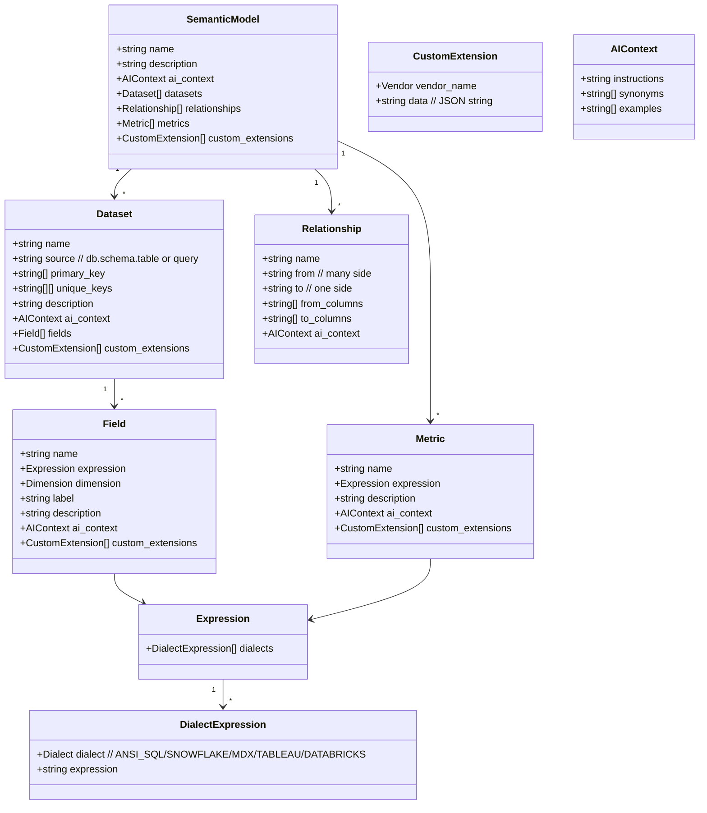
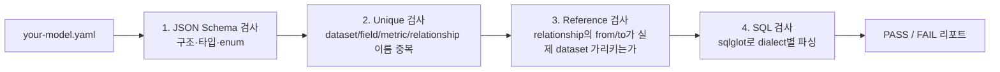
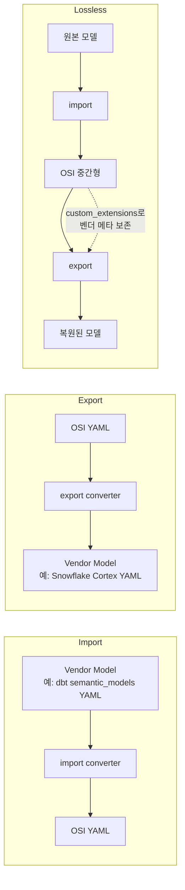
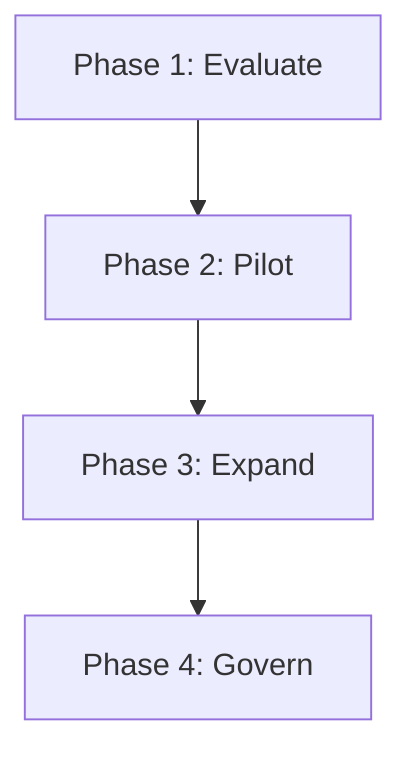
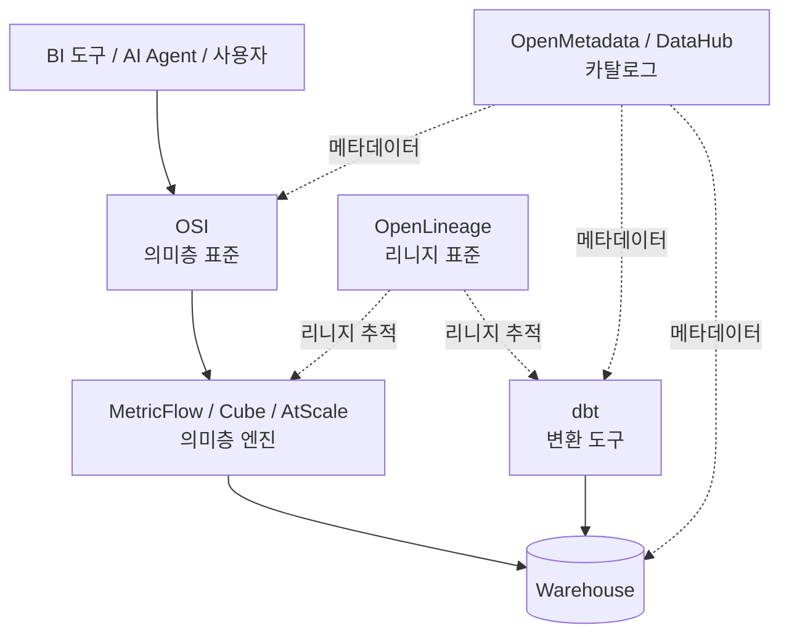

# OSI (Open Semantic Interchange) 실무 적용 참고서

> 분석 시점: 2026-04-23
> 대상 spec: **v0.1.1** (저장소 기준 latest, 2025-12-11) — v1.0은 2026-01-27 발표
> 저장소: https://github.com/open-semantic-interchange/OSI
> 공식 사이트: https://open-semantic-interchange.org/
> 라이선스: 코드 Apache 2.0 / 명세·문서 CC BY

---

## 0. 한 줄 요약 — 누구를 위한 무엇인가

**OSI는 "회사의 모든 BI 도구·AI 에이전트가 같은 의미층(metric, dimension, relationship)을 알아볼 수 있게 하는 YAML 표준"** 이다. 50개+ 회사(Snowflake·Salesforce·dbt Labs·Databricks·Cube·AtScale·ThoughtSpot·Mistral AI 등)가 합의한 **벤더 중립 명세**로, 한 곳에 메트릭을 정의해두면 어떤 도구든 import해 자신의 네이티브 포맷으로 변환할 수 있다. **dbt Labs의 MetricFlow, Cube, LookML, AtScale 같은 의미층 엔진들이 서로 모델을 주고받기 위한 공통 어댑터** 역할을 노린다.

---

## 1. OSI를 "왜" 도입하는가 — 4가지 통증

OSI 공식 문서가 정의한 도입 이유 (`docs/index.md`):

| 통증 | 설명 |
|---|---|
| **Metric Drift** | 같은 KPI(예: "월 매출")가 대시보드/플랫폼마다 다르게 정의됨 → 회의에서 숫자 충돌 |
| **Manual Translation** | 도구 간 의미 모델을 손으로 다시 옮기느라 시간·실수 발생 |
| **AI Hallucination** | LLM이 도구마다 다른 비즈니스 로직을 보고 부정확한 답을 함 |
| **Integration Debt** | N개 도구가 N×(N-1) 개의 점대점 커넥터를 만들어야 함 → 유지보수 지옥 |

OSI는 이 4개를 **Hub-and-Spoke 모델**로 한 번에 푼다.

---

## 2. 핵심 아키텍처 — Hub-and-Spoke

```mermaid
flowchart LR
    subgraph BI["BI/시각화"]
        Tab[Tableau]
        Sig[Sigma]
        Hex[Hex]
        Looker[Looker]
        Omni[Omni]
    end

    subgraph SL["Semantic Layer 엔진"]
        MF[MetricFlow<br/>(dbt Labs)]
        Cube[Cube]
        AtScale[AtScale]
        Honey[Honeydew]
    end

    subgraph DW["Warehouse"]
        SF[Snowflake]
        DB[Databricks]
        BQ[BigQuery]
    end

    subgraph AI["AI Agents"]
        Cortex[Snowflake Cortex]
        Mistral[Mistral AI]
        Custom[자체 LLM Agent]
    end

    Hub[("OSI YAML<br/>v0.1.1<br/>(Hub)")]

    BI <--> Hub
    SL <--> Hub
    AI <--> Hub
    DW -.via converter.-> Hub

    classDef hub fill:#FFD700,stroke:#FF8C00,stroke-width:3px;
    class Hub hub;
```

**왜 이 모델이 핵심인가**:

- N개 벤더 사이를 직접 잇는다면 **N×(N−1) 개 커넥터** 필요
- OSI를 hub로 두면 각 벤더가 **import 1개 + export 1개 = 2N개 커넥터**만 만들면 끝
- 새 벤더 추가 시 기존 벤더와의 호환성이 **자동으로** 따라옴

---

## 3. 명세 구조 — 6대 1급 객체

OSI v0.1.1의 모든 의미 모델은 **단 6개 객체** 만으로 표현된다.



### 3.1 6대 객체 — 한눈에

| 객체 | 역할 | 필수 필드 | 비유 |
|---|---|---|---|
| **SemanticModel** | 최상위 컨테이너 | `name`, `datasets` | 회사 회계 장부 표지 |
| **Dataset** | 비즈니스 엔티티 (fact/dim 테이블) | `name`, `source` | 장부 안의 한 페이지 |
| **Field** | 행 단위 속성 (column or computed) | `name`, `expression` | 페이지 안의 한 칸 |
| **Relationship** | 데이터셋 간 외래키 (many-to-one) | `name`, `from`, `to`, `from_columns`, `to_columns` | 페이지 사이의 연결선 |
| **Metric** | 집계 지표 (model 레벨 정의, 여러 dataset 가능) | `name`, `expression` | 모든 페이지를 합산한 결산 |
| **CustomExtension** | 벤더별 추가 메타 (JSON string) | `vendor_name`, `data` | 회계사가 붙이는 메모지 |

### 3.2 보조 객체

- **Expression**: 여러 dialect의 SQL을 동시 보유 (`ANSI_SQL`, `SNOWFLAKE`, `MDX`, `TABLEAU`, `DATABRICKS`)
- **AIContext**: 모든 객체에 옵션으로 붙는 LLM 보조 정보 (`instructions`, `synonyms`, `examples`)
- **Dimension**: Field의 옵션 메타. 현재는 `is_time: boolean` 하나뿐

### 3.3 enum 값 (현재 명세 전체)

```yaml
dialects: [ANSI_SQL, SNOWFLAKE, MDX, TABLEAU, DATABRICKS]
vendors:  [COMMON, SNOWFLAKE, SALESFORCE, DBT, DATABRICKS]
```

→ 추가 dialect/vendor는 **명세 변경 투표** 절차로 추가됨.

---

## 4. 최소 동작 예시 — 5분 안에 OSI YAML 작성

### 4.1 가장 작은 valid 모델

```yaml
# osi-minimal.yaml
version: "0.1.1"

semantic_model:
  - name: minimal_demo
    datasets:
      - name: orders
        source: app.public.orders
```

→ 이게 끝. `name`과 `datasets[0].name`/`source`만 있으면 schema validation 통과.

### 4.2 실용 최소 모델 (메트릭 1개 + 차원 1개 + 조인 1개)

```yaml
version: "0.1.1"

semantic_model:
  - name: demo_sales
    description: 작은 데모용 sales 모델
    ai_context:
      instructions: "이 모델은 매출 분석에 쓰세요."

    datasets:
      - name: orders
        source: app.public.orders
        primary_key: [order_id]
        fields:
          - name: order_id
            expression:
              dialects:
                - dialect: ANSI_SQL
                  expression: order_id
          - name: customer_id
            expression:
              dialects:
                - dialect: ANSI_SQL
                  expression: customer_id
          - name: order_date
            expression:
              dialects:
                - dialect: ANSI_SQL
                  expression: order_date
            dimension:
              is_time: true
          - name: amount
            expression:
              dialects:
                - dialect: ANSI_SQL
                  expression: amount

      - name: customers
        source: app.public.customers
        primary_key: [id]
        fields:
          - name: id
            expression:
              dialects:
                - dialect: ANSI_SQL
                  expression: id
          - name: region
            expression:
              dialects:
                - dialect: ANSI_SQL
                  expression: region

    relationships:
      - name: orders_to_customers
        from: orders
        to: customers
        from_columns: [customer_id]
        to_columns: [id]

    metrics:
      - name: total_revenue
        expression:
          dialects:
            - dialect: ANSI_SQL
              expression: SUM(orders.amount)
        description: 모든 주문의 총 매출
        ai_context:
          synonyms: ["총 매출", "total sales", "revenue"]
          examples:
            - "지난달 매출 알려줘"
            - "지역별 매출 보여줘"
```

→ 이 한 파일이 있으면 OSI 호환 도구 어디서든 같은 의미로 동작한다.

---

## 5. 명세의 5가지 디자인 디테일 (놓치기 쉬운 것)

### 5.1 Metric은 Dataset이 아니라 SemanticModel 레벨

```yaml
# ✅ 올바름
semantic_model:
  - name: ...
    metrics:
      - name: total_revenue
        expression: ... SUM(orders.amount) ...

# ❌ 틀림 — Dataset 안에 metrics를 넣을 수 없음
semantic_model:
  - name: ...
    datasets:
      - name: orders
        metrics:  # 스키마에 없는 속성
          - ...
```

→ Metric이 여러 Dataset을 가로지를 수 있어야 하기 때문. 표현식 안에서 `dataset_name.field_name`으로 참조한다.

### 5.2 Relationship은 항상 many-to-one

```yaml
relationships:
  - name: orders_to_customers
    from: orders     # many side (자식)
    to:   customers  # one side  (부모)
    from_columns: [customer_id]
    to_columns: [id]
```

- `from`은 외래키를 **가진** 쪽
- `to`는 외래키가 **가리키는** 쪽
- 컬럼 배열의 **순서가 매핑**된다 — `from_columns[0]` ↔ `to_columns[0]`
- 양쪽 길이가 반드시 같아야 함 (composite key는 같은 길이로)

### 5.3 Field의 expression은 "scalar SQL"만 허용

```yaml
# ✅ scalar (집계 없음)
expression:
  dialects:
    - dialect: ANSI_SQL
      expression: first_name || ' ' || last_name

# ❌ field에 집계 쓰면 안 됨
expression:
  dialects:
    - dialect: ANSI_SQL
      expression: SUM(amount)   # ← Metric으로 옮겨야 함
```

→ 집계는 무조건 `Metric`에. Field는 행 단위 식만.

### 5.4 다중 dialect — 폴백 규칙

```yaml
expression:
  dialects:
    - dialect: ANSI_SQL
      expression: LOWER(email)
    - dialect: SNOWFLAKE
      expression: LOWER(email)::VARCHAR
    - dialect: DATABRICKS
      expression: lower(email)
```

→ 컨버터는 **타깃 플랫폼 dialect를 우선**, 없으면 `ANSI_SQL`로 폴백. 모든 필드/메트릭에 모든 dialect를 다 적을 필요는 없음.

### 5.5 CustomExtension의 `data`는 **JSON 문자열**이지 dict가 아님

```yaml
custom_extensions:
  - vendor_name: SNOWFLAKE
    data: '{"warehouse": "ANALYTICS_WH", "database": "PROD"}'
    # ↑ YAML scalar (string), 안에 JSON
```

→ 이상하지만 의도적이다. **OSI core가 모르는 임의 schema를 그대로 통과**시키기 위해 string에 JSON을 박는다. 라운드트립 시 lossless 보존이 목적.

---

## 6. AI Context — LLM grounding 채널

OSI가 다른 의미층 표준과 가장 다른 점은 **`ai_context`가 1급 시민**이라는 것. 모든 객체(Model/Dataset/Field/Relationship/Metric)에 붙일 수 있다.

```yaml
ai_context:
  instructions: "이 모델은 분기/연도 시계열 분석에 최적화됨"
  synonyms:
    - "주문 금액"
    - "purchase amount"
  examples:
    - "지난 분기 한국 매출 알려줘"
    - "Top 10 고객 주문 합계"
```

| 필드 | 용도 |
|---|---|
| `instructions` | "이걸 어떻게 쓰라"는 자유 텍스트 (system prompt 보강) |
| `synonyms` | 자연어 → 메트릭 매칭용 (한국어/영어 혼용 OK) |
| `examples` | "이런 질문에는 이걸 써라" few-shot |

**왜 중요한가**: AI 코파일럿이 "지난달 매출"을 물었을 때 `total_revenue` 메트릭을 자신 있게 고르려면 synonym/instructions를 봐야 함. **OSI가 OpenAI/Anthropic/Snowflake Cortex/Mistral 등 모든 AI 도구에 동일 어휘를 주입할 수 있는 단일 통로**다.

---

## 7. 검증 — `validate.py`

저장소에 포함된 검증 스크립트(245줄)는 **4단계 검사**를 수행:



### 사용법

```bash
# 1) 의존성 설치
pip install pyyaml jsonschema sqlglot

# 2) 검증 실행
python validation/validate.py your-model.yaml

# 3) 동봉된 TPC-DS 예시로 동작 확인
python validation/validate.py examples/tpcds_semantic_model.yaml
```

### CI 통합 패턴 (GitHub Actions 예시)

```yaml
# .github/workflows/osi-validate.yml
name: OSI Validation
on: [pull_request]

jobs:
  validate:
    runs-on: ubuntu-latest
    steps:
      - uses: actions/checkout@v4
      - uses: actions/setup-python@v5
        with:
          python-version: "3.11"
      - run: pip install pyyaml jsonschema sqlglot
      - name: Clone OSI for validator + schema
        run: git clone --depth=1 https://github.com/open-semantic-interchange/OSI.git /tmp/osi
      - name: Validate all OSI models
        run: |
          for f in semantic-models/**/*.osi.yaml; do
            python /tmp/osi/validation/validate.py "$f"
          done
```

→ `*.osi.yaml` 컨벤션으로 OSI 모델 파일을 식별하고 PR마다 자동 검증.

---

## 8. 컨버터 — Hub와 벤더를 잇는 다리

저장소의 `converters/snowflake/`가 **첫 공식 컨버터 reference**다 (453줄, OSI YAML → Snowflake Cortex Analyst YAML).

### 8.1 컨버터 책임



### 8.2 핵심 패턴 (Snowflake 컨버터에서 배운 것)

`converters/snowflake/src/osi_to_snowflake_yaml_converter.py`의 핵심 함수들:

| 함수 | 역할 |
|---|---|
| `_convert_model` | 최상위 SemanticModel → Snowflake top-level |
| `_convert_dataset` | Dataset → Snowflake `tables[]` |
| `_classify_field` | Field가 dimension/time_dimension/measure 중 무엇인지 자동 분류 |
| `_extract_expression` | 다중 dialect 중 SNOWFLAKE 우선, 없으면 ANSI_SQL 폴백 |
| `_normalize_identifier` | 식별자 표준화 (대소문자 등) |
| `_parse_source` | `db.schema.table` 분해 |
| `_extract_synonyms` | `ai_context.synonyms` → Snowflake synonyms 필드 |
| `_warn_dropped_fields` | 변환 시 손실되는 필드 경고 출력 (예: relationship의 `ai_context`) |

→ **새 컨버터를 만들 때 그대로 쓸 수 있는 템플릿**.

### 8.3 컨버터 작성 체크리스트

```
[ ] 1. 입력 형식 정의: OSI YAML 또는 vendor format?
[ ] 2. 양방향(import + export) 둘 다 만드는가, 한 방향만인가?
[ ] 3. 다중 dialect → 타깃 dialect 선택 + 폴백 로직
[ ] 4. ai_context를 어디에 매핑하는가 (벤더에 동등 개념 있는가)
[ ] 5. custom_extensions 보존 (round-trip 시 무손실)
[ ] 6. 변환 손실 발생 시 명시적 warning
[ ] 7. Unit 테스트로 round-trip 검증
[ ] 8. README에 한계(limitations) 섹션
```

---

## 9. 거버넌스 — Apache Way

OSI는 The ASF(Apache Software Foundation) 거버넌스를 모델로 한다.

### 9.1 의사결정 구조

```mermaid
flowchart TD
    TSC[Technical Steering Committee<br/>4인:<br/>- Khushboo Bhatia · Snowflake<br/>- Lior Ebel · Salesforce<br/>- Quigley Malcom · dbt Labs<br/>- JB Onofré · The ASF]
    
    Comm[Committers<br/>(repo write access)]
    Reviewers[Specification Reviewers<br/>(도메인 전문가)]
    Contrib[Contributors<br/>(누구나)]

    TSC --> SpecChange[Spec Change Vote]
    Comm --> SpecChange
    SpecChange --> Pass{2개 이상 binding +1<br/>+ 거부권 0?}
    Pass -- 통과 --> Merge[merge]
    Pass -- 실패 --> Veto[veto 해소 또는<br/>2/3 supermajority 오버라이드]

    Contrib -. PR/Discussion .-> SpecChange
    Reviewers -. Review .-> SpecChange
```

### 9.2 5개 Working Group

| WG | 다루는 것 | Lead |
|---|---|---|
| 1. Metric Language and Relationships | 고급 메트릭 타입 (ratio, cumulative, derived), 조인 의미론 | Will Pugh |
| 2. Composability | 모델 합성·상속·재사용 블록 | Dianne Wood (AtScale) |
| 3. Catalog | 데이터 카탈로그·리니지 통합 | Shubham Bhargav (Atlan) |
| 4. Ontology | 비즈니스 엔티티 형식 온톨로지 | Kurt (Relational AI) |
| 5. Sync API | 도구 간 모델 동기화 API | Francois Lopitaux (ThoughtSpot) |

→ **현재 명세는 의도적으로 작다(6 객체)**. 위 5개 WG가 향후 1~2년에 걸쳐 명세를 채워나갈 영역들.

### 9.3 SemVer 버전 정책

- **Major (1.0 → 2.0)**: 호환 깨짐 — 마이그레이션 가이드 + deprecation 기간
- **Minor (0.1 → 0.2)**: 기능 추가, **기존 모델 그대로 valid**
- **Patch (0.1.0 → 0.1.1)**: 명세 문구 정정

---

## 10. 실전 적용 4단계 (공식 Adoption Guide + 보강)



### Phase 1: Evaluate (1~2주)

```
[ ] 사내 의미층 도구 인벤토리 작성:
    - BI: Tableau, Looker, Sigma, Superset, Hex, Mode...
    - Semantic Layer: dbt + MetricFlow, Cube, AtScale, LookML, Lightdash, Honeydew...
    - AI/ML: 자체 코파일럿, RAG 파이프라인, text-to-SQL 도구
    - Catalog: Atlan, Alation, Collibra, DataHub
[ ] 통증 매핑:
    - 매출/유저/전환률 등 핵심 KPI 정의가 도구마다 다른 사례 5개 수집
    - 새 도구 도입 시 메트릭 재정의 비용 추정
[ ] 컨버터 가용성 점검:
    - converters/index.md 확인 (현재 Snowflake만 공식)
    - 자사 주력 도구(예: dbt)의 OSI 지원 로드맵 점검
```

### Phase 2: Pilot (2~4주)

```
[ ] 하나의 잘 이해된 모델 선정 (예: 코어 sales/finance, 5~10 datasets)
[ ] OSI YAML로 직접 작성 또는 import converter 사용
[ ] validation/validate.py 통과시키기
[ ] 라운드트립 테스트:
    OSI → 벤더 export → 다시 import → 원본과 diff
[ ] 데이터팀과 결과 공유, 피드백 수집
```

### Phase 3: Expand (분기 단위)

```
[ ] 모델 추가 변환 — 여러 도구가 공유하는 모델 우선
[ ] CI/CD 파이프라인에 OSI validation 통합 (8.2의 GitHub Actions 예시)
[ ] OSI YAML을 Git으로 버전 관리 (data code 옆에)
[ ] (조건부) Sync API가 stable 되면 자동 동기화 도입
```

### Phase 4: Govern (지속)

```
[ ] 모델별 owner 정의 (DRI, Data Steward)
[ ] 변경 리뷰 프로세스 (PR 기반, OSI 자체의 voting 모델 참조)
[ ] 정합성 모니터링 — 각 도구가 보고 있는 모델이 OSI authoritative와 sync 되어있는지 정기 점검
[ ] AI agent grounding 평가 — synonyms/examples가 실제 Q&A 정확도에 미치는 영향 측정
```

---

## 11. 의사결정 매트릭스 — 우리 회사는 OSI를 지금 도입할까?

```mermaid
flowchart TD
    Q1{현재 의미층 도구가<br/>2개 이상인가?}
    Q1 -- 아니오 --> Wait1[지금 도입 ROI 낮음<br/>도구가 늘어날 때 다시 평가]
    Q1 -- 예 --> Q2{같은 KPI가<br/>도구마다 다른 값을<br/>보였던 적 있나?}
    Q2 -- 아니오 --> Wait2[훌륭함. 그래도<br/>핵심 메트릭만 OSI YAML로<br/>한 카피 보관 권장]
    Q2 -- 예 --> Q3{AI 코파일럿/text-to-SQL을<br/>도입했거나 도입 예정인가?}
    Q3 -- 예 --> Adopt[즉시 Pilot 권장<br/>AI grounding 가치가 큼]
    Q3 -- 아니오 --> Q4{사용 중인 의미층 도구가<br/>OSI 1st-class 지원<br/>(dbt/Cube/AtScale 등)인가?}
    Q4 -- 예 --> Adopt2[OSI 1.0 spec 안정화<br/>(2026-01 이미 완료)<br/>지금 Phase 1 시작 OK]
    Q4 -- 아니오 --> Wait3[해당 도구의 OSI 로드맵<br/>모니터링 + 자체 컨버터 평가]
```

### 도입을 미뤄도 되는 신호

- **단일 BI 도구만 사용** — Tableau만, 또는 Looker만
- **AI/text-to-SQL 계획 없음**
- **메트릭 수가 적고 분석가가 직접 SQL 짬**

### 도입을 서둘러야 하는 신호

- **2개 이상 BI 도구 + 의미층 엔진 사용 중**
- **"이 숫자 누가 정의했지?" 사고 빈발**
- **AI 코파일럿 PoC 진행 중** (가장 큰 가치)
- **신규 도구 도입을 자주 함** (point-to-point integration 부담)

---

## 12. 한계 및 주의사항 — v0.1.1 시점

### 12.1 명세 자체의 한계 (의도적·임시적)

| 한계 | 영향 | 향후 |
|---|---|---|
| **Metric 타입 1종**: 단순 SQL aggregate만. ratio/cumulative/derived/conversion 명시 없음 | 복잡한 메트릭은 vendor-specific으로 풀어야 함 | WG #1이 작업 중 |
| **Relationship many-to-one만**: many-to-many, one-to-one 명시 없음 | 다대다는 join table을 별도 dataset으로 표현 | 향후 minor 버전 |
| **Composability 없음**: 모델 합성/상속 미지원 | 큰 조직은 모놀리스 모델 위험 | WG #2가 작업 중 |
| **Sync API 없음**: 정적 YAML 교환만 | 자동 동기화는 별도 인프라 필요 | WG #5가 작업 중 |
| **Field의 dimension 메타가 `is_time` 하나뿐** | categorical/numeric 구분 등은 ai_context로 우회 | 확장 예정 |
| **Time grain 명시 없음** (day/week/month/quarter/year) | 시계열 메트릭은 컨버터별 해석 차이 | WG #1 검토 |
| **다국어 (i18n) 표준 없음** | 한국어/영어 혼용 시 ai_context.synonyms로 우회 | 미정 |

### 12.2 도구 생태계의 현실적 한계

| 문제 | 우회 |
|---|---|
| 공식 컨버터는 현재 Snowflake 1개뿐 | 직접 작성 (converters/snowflake가 좋은 reference, 453줄) |
| dbt MetricFlow의 1st-party OSI export는 아직 없음 (dbt Labs는 founding member라 곧 나올 가능성 높음) | 임시로 dbt YAML → OSI 컨버터 자체 작성 |
| Tableau/Looker는 의미층 export API가 제한적 | 메트릭 수동 정의 → OSI에 한 카피 + 벤더에 별도 카피 (중복 비용) |
| Sync API 미정으로 정적 파일 교환만 가능 | Git을 SoT로, CI에서 push |

### 12.3 도입 시 흔한 함정

1. **모델을 너무 크게 만든다**: 한 SemanticModel에 50+ datasets을 넣으면 변환·검증 모두 무거워짐. **도메인 단위(sales / finance / marketing)로 분리** 권장
2. **expression에 dialect 하나만 적고 모든 도구에 폴백 의존**: ANSI_SQL이 모든 warehouse에서 동일 의미가 아님 (예: `||` 연결자, NULL 처리). 적어도 핵심 metric은 SNOWFLAKE/DATABRICKS 둘 다 명시 권장
3. **custom_extensions에 비밀 정보 박기**: data가 평문 JSON이라 schema·warehouse 이름 외 credential은 절대 금지
4. **AI context 누락**: ai_context 없이 OSI를 도입하면 "BI 도구 통일"의 절반 가치만 얻음. AI 코파일럿 가치는 0
5. **버전 핀 누락**: `version: "0.1.1"`을 안 적으면 schema validator가 실패 — 항상 명시

---

## 13. 경쟁·관련 표준과의 관계

| | OSI | dbt MetricFlow | Cube | LookML | OpenLineage | OpenMetadata |
|---|---|---|---|---|---|---|
| 정체 | **표준 명세** | 엔진 (도구) | 엔진 (도구) | 엔진 (도구, Looker 종속) | 데이터 리니지 표준 | 메타데이터 카탈로그 |
| 거버넌스 | 50+ 회사 컨소시엄 (Apache Way) | dbt Labs 단일 | Cube Dev 단일 | Google (Looker) | Linux Foundation | Collate |
| 1st-party 도구 | (도구 아님) | dbt Cloud / CLI | Cube Cloud / OSS | Looker | (어느 도구든 import) | OpenMetadata 자체 |
| OSI와의 관계 | (= self) | dbt Labs는 founding member, 양방향 컨버터 작업 중 | founding member, 양방향 작업 중 | OSI export 가능성 (커뮤니티) | **상호보완** — 리니지와 의미는 다른 layer | **상호보완** — 카탈로그 메타 vs 의미 |

→ OSI는 위 도구들의 **경쟁자가 아니라 공통 어댑터**. dbt/Cube/AtScale은 자기 엔진을 유지하면서 OSI export/import만 추가하면 됨.

### 협력 표준 (OSI 위·아래 layer)



---

## 14. Cheat Sheet — 자주 쓸 패턴들

### 14.1 시간 차원

```yaml
- name: order_date
  expression:
    dialects:
      - dialect: ANSI_SQL
        expression: order_date
  dimension:
    is_time: true
  description: 주문 발생일
```

### 14.2 계산된 차원 (full_name 등)

```yaml
- name: full_name
  expression:
    dialects:
      - dialect: ANSI_SQL
        expression: first_name || ' ' || last_name
      - dialect: SNOWFLAKE
        expression: CONCAT(first_name, ' ', last_name)
```

### 14.3 비율 메트릭 (수동 표현)

```yaml
- name: avg_order_value
  expression:
    dialects:
      - dialect: ANSI_SQL
        expression: SUM(orders.amount) / NULLIF(COUNT(DISTINCT orders.order_id), 0)
  description: 평균 주문 금액 (AOV)
```

### 14.4 크로스 데이터셋 메트릭 (LTV)

```yaml
- name: customer_lifetime_value
  expression:
    dialects:
      - dialect: ANSI_SQL
        expression: SUM(orders.amount) / NULLIF(COUNT(DISTINCT customers.id), 0)
  description: 고객당 평균 매출 (LTV)
  ai_context:
    synonyms: ["LTV", "CLV", "고객 생애 가치"]
```

### 14.5 복합 키 관계

```yaml
- name: order_lines_to_products
  from: order_lines
  to: products
  from_columns: [product_id, variant_id]
  to_columns: [id, variant_id]
```

### 14.6 벤더별 확장 (dbt + Snowflake 동시)

```yaml
custom_extensions:
  - vendor_name: DBT
    data: '{"materialized": "table", "tags": ["daily", "core"]}'
  - vendor_name: SNOWFLAKE
    data: '{"warehouse": "ANALYTICS_WH", "schema": "PUBLIC"}'
```

### 14.7 AI 코파일럿용 풍부한 컨텍스트

```yaml
- name: monthly_active_users
  expression:
    dialects:
      - dialect: ANSI_SQL
        expression: COUNT(DISTINCT users.user_id)
  description: 월간 활성 유저 수 (MAU)
  ai_context:
    instructions: "이벤트가 있는 유저만 활성으로 간주. 7일 retention과 다름."
    synonyms: ["MAU", "월간 활성 사용자", "monthly actives"]
    examples:
      - "지난 3개월 MAU 추이 그려줘"
      - "MAU 가장 많은 지역 Top 5"
      - "MAU와 신규 가입자 비교"
```

---

## 15. 자주 묻는 질문 (FAQ)

**Q1. OSI와 MetricFlow 중 뭘 채택해야 하나?**
→ 잘못된 질문. **MetricFlow는 도구, OSI는 표준**. MetricFlow를 쓰면서 OSI YAML을 한 카피 두는 게 미래 안전판이다. dbt Labs가 OSI founding member이므로 MetricFlow ↔ OSI 컨버터는 곧 1st-party로 나올 가능성이 매우 높다.

**Q2. OSI YAML을 직접 손으로 쓰나, 도구가 export 해주나?**
→ **둘 다**. Pilot 단계에서는 손으로, Expand 단계에서는 1st-party 컨버터에 의존한다. 손으로 쓰는 것은 어렵지 않다 — 한 모델당 100~500줄 수준.

**Q3. JSON과 YAML 둘 다 되나?**
→ JSON Schema가 정의되어 있으니 JSON으로도 표현 가능. 단, 공식 권장은 YAML (사람이 읽기 쉬움). 컨버터·검증기는 둘 다 처리 가능해야 함.

**Q4. version 필드는 무엇 기준인가?**
→ OSI **명세 버전**. 모델 자체의 버전이 아니다. 모델 버전 관리는 Git/CI에서. 향후 0.2, 1.0이 나오면 호환성 정책에 따라 작성 필요.

**Q5. 한국 회사가 채택하는 데 장벽은?**
→ 명세는 영어지만 YAML은 아무 언어로 description/synonyms 작성 OK. 한국어 KPI 동의어를 ai_context.synonyms에 넣으면 한국어 LLM grounding이 즉시 됨. **인프라적 장벽 없음**.

**Q6. 기존 dbt 프로젝트에 어떻게 끼우나?**
```
your-dbt-project/
├── models/
├── macros/
├── semantic-models/        # ← OSI YAML들을 여기에
│   ├── sales.osi.yaml
│   ├── finance.osi.yaml
│   └── marketing.osi.yaml
└── .github/workflows/
    └── osi-validate.yml    # CI 검증
```

**Q7. 비밀 정보(자격증명)를 OSI YAML에 두면 안 되는 이유?**
→ OSI YAML은 **개발자가 보는 의미 정의**이다. Git에 커밋되고 BI/AI 도구로 배포된다. credential은 secret manager에, 연결 정보(database/schema/warehouse 이름)만 OSI에.

**Q8. spec이 너무 작다 — production에 쓸 수 있나?**
→ "core spec은 의도적으로 작다, custom_extensions로 vendor 디테일을 보존한다"가 OSI의 명시적 디자인. 핵심 KPI 30개를 통일하는 데는 v0.1.1로 충분. 복잡한 derived/cumulative metric은 WG #1이 1.x에 추가할 예정 (이미 v1.0 spec finalized됨).

---

## 16. 한 페이지 핵심 요약

| 항목 | 내용 |
|---|---|
| **무엇** | 의미 모델(메트릭/차원/관계)을 도구 간 교환하는 YAML 표준 |
| **누가** | 50+ 회사 컨소시엄 (Snowflake 주도, Apache Way 거버넌스) |
| **언제** | 2025-09-23 발표, v0.1.1(2025-12-11), v1.0(2026-01-27) |
| **라이선스** | 코드 Apache 2.0, 명세 CC BY |
| **6개 객체** | SemanticModel · Dataset · Field · Relationship · Metric · CustomExtension |
| **4가지 검증** | JSON Schema · Unique names · Reference · SQL (sqlglot) |
| **컨버터** | 현재 Snowflake 1개 공식, 자체 작성 가능 (453줄 reference) |
| **5개 WG 진행 중** | Metric Language · Composability · Catalog · Ontology · Sync API |
| **언제 도입** | 의미층 도구 ≥2 + AI 코파일럿 도입 시 즉시. 단일 BI는 보류 가능 |
| **벤치마크 1순위** | ai_context로 LLM grounding 가시화 |
| **시작점** | `git clone https://github.com/open-semantic-interchange/OSI && cat examples/tpcds_semantic_model.yaml` |

---

## 17. 학습·시작 가이드 (실무자용 7단계)

1. **30분 — 명세 정독**: `core-spec/spec.md` 563줄. 한 번 읽으면 6대 객체 모두 이해됨
2. **30분 — TPC-DS 예시 정독**: `examples/tpcds_semantic_model.yaml` 578줄. 실제 retail 모델이 어떻게 표현되는지
3. **1시간 — 자기 회사의 가장 핵심 메트릭 1개를 OSI YAML로 작성**
4. **30분 — `validate.py`로 검증**, 에러 수정
5. **1시간 — 자기 회사의 도메인 1개를 OSI YAML로 작성** (5~10 datasets)
6. **반나절 — `converters/snowflake/src/`를 읽고 자기 회사가 쓰는 1st-party 도구용 컨버터 reference 검토 (또는 공식 로드맵 확인)
7. **1주일 — Pilot 모델을 사내 BI 도구로 라운드트립, gap 식별**

---

## 18. 참고 자료

- 공식 사이트: https://open-semantic-interchange.org/
- GitHub: https://github.com/open-semantic-interchange/OSI
- Slack 커뮤니티: [참여 링크](https://join.slack.com/t/opensemanticx/shared_invite/zt-3pq1j0lid-tQBbEvAngAvz0I0vZm~HJw)
- Snowflake 발표 (2025-09-23): https://www.snowflake.com/en/news/press-releases/snowflake-salesforce-dbt-labs-and-more-revolutionize-data-readiness-for-ai-with-open-semantic-interchange-initiative/
- v1.0 finalized 블로그 (2026-01): https://www.snowflake.com/en/blog/open-semantic-interchanges-specs-finalized/
- dbt Labs 관점 분석: https://www.getdbt.com/blog/the-osi-spec-updates
- 첫 working group 회의 보고: https://www.snowflake.com/en/blog/osi-initiative-expands-partners/

### 저장소 핵심 파일 (직접 읽을 가치 있는 것)

| 파일 | 줄 수 | 무엇 |
|---|---|---|
| `core-spec/spec.md` | 563 | 인간이 읽는 명세 (필독) |
| `core-spec/osi-schema.json` | 344 | JSON Schema (검증 자동화 기준) |
| `core-spec/spec.yaml` | 217 | YAML 형식 명세 (참조용) |
| `examples/tpcds_semantic_model.yaml` | 578 | 완전한 retail 예시 (필독) |
| `validation/validate.py` | 245 | 검증 스크립트 (CI에 그대로 사용) |
| `docs/index.md` | 427 | 거버넌스·아키텍처·FAQ·Adoption Guide |
| `converters/index.md` | — | 컨버터 작성 가이드 |
| `converters/snowflake/src/osi_to_snowflake_yaml_converter.py` | 453 | 컨버터 reference 구현 |
