# Apache Ossie (incubating) 코드 레벨 분석

> **분석 시점**: 2026-08-19
> **대상 커밋**: `88e0011` (main, 2026-08-18 push 기준)
> **대상 spec**: `0.2.0.dev0` (DRAFT — 릴리스된 최신 버전은 `0.1.1`, 2025-12-11)
> **저장소**: https://github.com/apache/ossie · **사이트**: https://ossie.apache.org/
> **라이선스**: Apache-2.0 (초기엔 문서에 CC BY 4.0 적용 → ASF 이관 후 전부 Apache-2.0으로 통일)
>
> 실무 도입 절차·치트시트는 별도 문서 [OSI 적용 참고서](OSI_적용_참고서.md)(v0.1.1 기준) 참조.
> 이 문서는 **ASF 인큐베이션 이후 저장소를 소스코드 단위로 다시 뜯어본 결과**다.

---

## 0. 세 줄 요약

1. **Apache Ossie는 "제품"이 아니라 "스펙 + 참조 컨버터 모음"이다.** 저장소 249개 파일 중 실행 가능한 코드의 대부분(파이썬 ~14.3K LOC, 자바 ~5.9K LOC)은 **11개 벤더 컨버터**이고, 스펙 본체는 JSON Schema 352줄 + 마크다운 3편이다.
2. **v0.2.0.dev0에서 스펙이 2계층으로 쪼개졌다.** 기존 논리층(`core-spec/`: dataset·field·metric·relationship)에 더해, **ORM/NIAM 계열의 온톨로지층(`ontology/`: concept·role·verbalizes·derived_by)** 이 별도 문서 타입으로 추가됐다. 이건 단순한 필드 추가가 아니라 "구조적 상호운용 → 개념적 상호운용"으로의 스코프 확장이다.
3. **하지만 실행 가능한 표준으로 보기엔 아직 이르다.** 메트릭은 여전히 raw SQL 문자열이라 조합 불가능하고, `ossie` CLI의 `convert`/`validate`는 전부 `"not yet implemented"`이며, `compliance/` 디렉터리는 README 한 줄("This is for compliance tests")만 있는 빈 껍데기다. **적합성 테스트가 없으므로 "Ossie 호환"이라는 주장을 검증할 수단이 현재 존재하지 않는다.**

---

## 1. 프로젝트 개요

### 1.1 정체성

Apache Ossie는 **분석·AI·BI 도구들이 시맨틱 메타데이터(메트릭·차원·엔티티·관계)를 주고받기 위한 벤더 중립 교환 포맷**이다. "USB-C for semantics" — 새로운 시맨틱 레이어 제품이 아니라, 기존 시맨틱 레이어(dbt MetricFlow, Cube, LookML, AtScale, Snowflake Semantic Views, Databricks Metric Views …)들이 서로 모델을 교환하는 **중립 허브 포맷**을 노린다.

### 1.2 연혁

| 시점 | 사건 |
|---|---|
| 2025-09-23 | Snowflake 주도로 **Open Semantic Interchange (OSI)** 발족. 창립 파트너 17~20개사 (Alation, Atlan, BlackRock, Cube, dbt Labs, Hex, Honeydew, Mistral AI, Omni, RelationalAI, Salesforce, Select Star, Sigma, ThoughtSpot 등) |
| 2025-10-07 | GitHub 저장소 첫 커밋 (README 수준) |
| 2025-10-28 | dbt Labs, **MetricFlow를 Apache-2.0으로 오픈소스화** — OSI 참조 구현 성격 |
| 2025-11-19 | 문서 라이선스 CC BY 4.0으로 변경 |
| 2025-12-10~12 | **스펙 초안 대량 커밋** — dataset/field/metric/relationship 골격, TPC-DS 예제 |
| 2025-12-11 | **v0.1.1 릴리스** (저장소 태그: `osi-0.1.1-rc1`) |
| 2026-01-27 | OSI v0.1 스펙 공식 공개, 워킹 그룹 확대 |
| 2026-03~04 | Denodo·AtScale·Qlik·DataHub·Collate 등 합류, 참여사 50+ |
| 2026-05-29 | **온톨로지 스펙 0.2.0.dev0 초안** 추가 |
| 2026-06-04 | 금융서비스(FSI) 시맨틱 워킹그룹 발족 |
| **2026-07-10** | **ASF 인큐베이터 입성 — 프로젝트명 `Apache Ossie`로 변경** |
| 2026-07-15 | Expression Language 제안서 (`Proposed Final`) 초안 |
| 2026-08-12 | Kyvos 합류 |

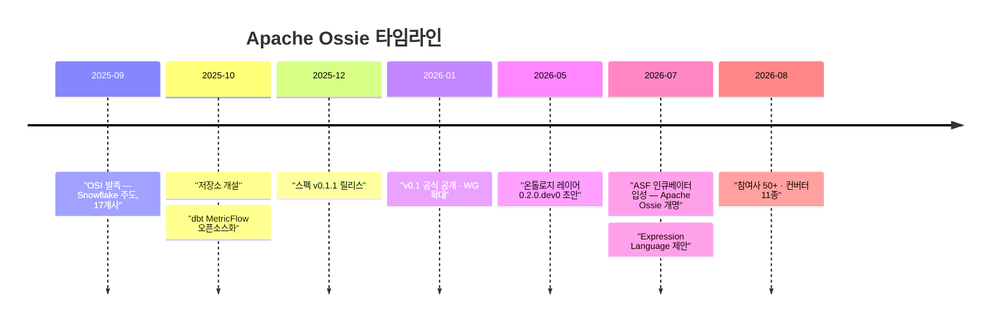

### 1.3 해결하려는 문제 (Problem Statement)

공식 문서(`docs/index.md`)가 정의한 4대 통증:

| 통증 | 설명 |
|---|---|
| **Metric Drift** | 같은 KPI가 도구마다 다르게 정의 → 숫자 충돌 → 데이터 신뢰 붕괴 |
| **Manual Translation** | 도구 간 시맨틱 정의를 손으로 재작성 → 비용·오류 |
| **AI Hallucination** | LLM 에이전트가 도구마다 다른 비즈니스 로직을 보고 부정확한 답 생성 |
| **Integration Debt** | N개 도구 간 N×(N−1) 점대점 커넥터 유지보수 지옥 |

**AI가 진짜 트리거다.** 2025년 이전에도 시맨틱 레이어 표준화 시도는 있었지만(2022년 dbt Metrics, Transform, Supergrain…), 전부 실패했다. 이번에 50개사가 모인 이유는 **텍스트→SQL 에이전트가 신뢰할 수 없는 이유가 "스키마를 모르는 것"이 아니라 "비즈니스 정의를 모르는 것"** 이라는 게 명확해졌기 때문이다.

---

## 2. 저장소 구조 — 실제로 무엇이 들어있나

```
apache/ossie/
├── core-spec/           ← 논리층 스펙 (spec.md 653줄, osi-schema.json 352줄,
│                          spec.yaml 269줄, expression_language.md 780줄)
├── ontology/            ← 온톨로지층 스펙 (ontology.md 598줄, ontology.json 298줄)
├── examples/            ← tpcds_semantic_model.yaml (631줄), flights.yaml (1111줄, 온톨로지)
├── validation/          ← validate.py (290줄) — 유일하게 동작하는 검증기
├── python/              ← `ossie` 파이썬 패키지 (pydantic 모델 223줄)
├── cli/                 ← Go + Cobra CLI (~1.4K LOC) — 대부분 미구현
├── converters/          ← 11개 벤더 컨버터 (Python 14.3K LOC + Java 5.9K LOC)
├── compliance/          ← README 한 줄. 비어 있음.
└── docs/                ← index.md (377줄), working_groups.md
```

### 2.1 3계층 구조

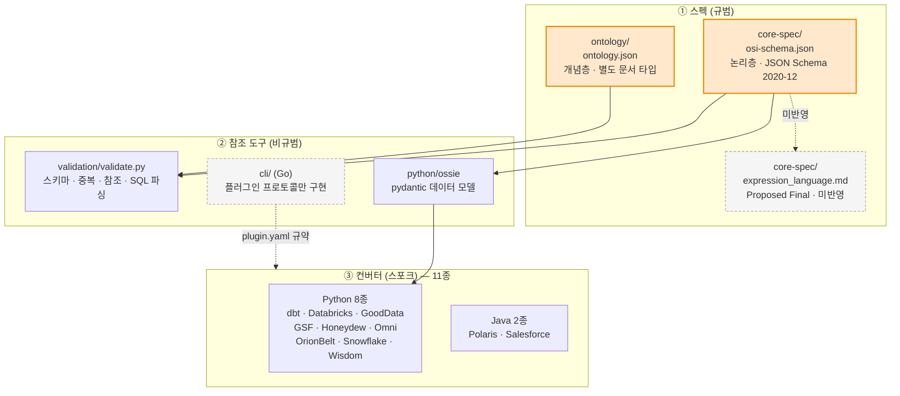

**중요한 관찰**: 회색 점선으로 표시한 두 박스(`expression_language.md`, `cli/`)는 **문서/골격만 있고 스키마·구현에 반영되지 않았다.** 자세한 근거는 §6, §7.3.

---

## 3. 아키텍처

### 3.1 Hub-and-Spoke — 수학은 단순하다

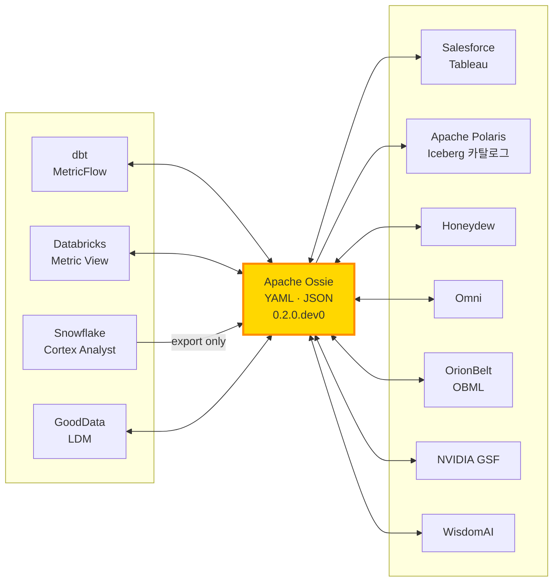

- 점대점: **N×(N−1)** 커넥터 → 11개 벤더면 110개
- 허브 경유: **2×N** 커넥터 → 22개
- 실제 저장소엔 **11개 벤더 × 평균 1.7방향 ≈ 19개 방향**이 구현되어 있다 (Snowflake·Polaris는 단방향).

> **함정**: 이 계산은 "변환이 무손실"일 때만 성립한다. 실제로는 각 스포크가 서로 다른 정보를 잃으므로, A→Ossie→B 왕복이 A→B 직접 변환보다 정보가 적을 수 있다. §8.4에서 상세히 다룬다.

### 3.2 3-레이어 시맨틱 스택

`core-spec/img/ossie_layers.png`와 `expression_language.md`가 명시하는 계층:

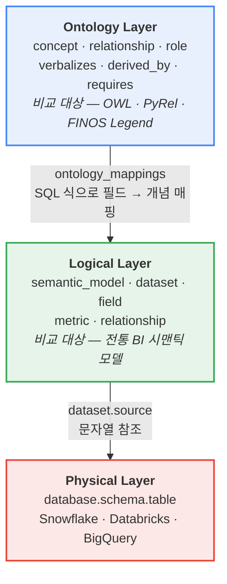

**핵심 설계 판단**: 온톨로지층과 논리층은 **같은 파일에 못 들어간다.** `osi-schema.json`의 루트는 `additionalProperties: false` + `required: [version, semantic_model]`, `ontology.json`의 루트는 `required: [version, name, ontology]`다. 즉 **서로 배타적인 두 문서 타입**이고, 연결은 온톨로지 문서 쪽의 `ontology_mappings`가 논리 문서의 `dataset.field`를 SQL 식으로 참조하는 **단방향 이름 기반 참조**로만 이뤄진다. 여기엔 파일 참조·URI·버전 고정 메커니즘이 전혀 없다 — 후속 과제로 남아 있는 지점.

---

## 4. 코어 스펙 v0.2.0.dev0 — 코드 레벨 분석

### 4.1 객체 모델

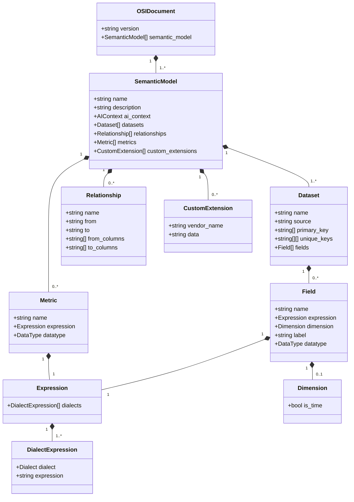

**주목할 구조적 결정 3가지**

1. **`metrics`는 `SemanticModel` 레벨에만 존재한다.** `Dataset` 안에는 메트릭을 못 넣는다. 크로스 데이터셋 메트릭(`SUM(orders.amount) / COUNT(DISTINCT customers.id)`)을 자연스럽게 표현하기 위한 선택이지만, 반대로 **"이 메트릭이 어느 데이터셋에 속하는가"(grain)를 표현할 수단이 없다**. 로드맵 최상위 이슈(#29, #18, #12)가 전부 이 문제다.
2. **`Relationship`은 항상 many-to-one 단방향이다.** `from`=many측, `to`=one측으로 고정. 카디널리티 enum도, 조인 타입(inner/left)도, many-to-many도 없다. 이슈 #50·#11·#4가 이걸 다룬다.
3. **모든 오브젝트에서 `additionalProperties: false`.** 스키마 외 필드를 쓰면 검증 실패한다 → 벤더 확장은 반드시 `custom_extensions`를 거쳐야 한다. 엄격성은 좋지만 **미래 버전 필드가 구버전 검증기에서 전부 에러**가 되는 부작용이 있다(전진 호환성 없음).

### 4.2 v0.1.1 → v0.2.0.dev0 변경점

| 항목 | 0.1.1 | 0.2.0.dev0 |
|---|---|---|
| `datatype` (Field·Metric) | 없음 | **신규** — 10종 논리 타입 enum |
| `dimension.is_time` 의미 | 시간 차원 플래그 | **역할(role) 마커로 재정의** — 타입과 분리 |
| Dialect enum | ANSI_SQL, SNOWFLAKE, MDX, TABLEAU, DATABRICKS | **+ MAQL, BIGQUERY** |
| `Vendor` | 고정 enum | **자유 문자열**(`examples`만 제시) |
| 온톨로지 | 없음 | **별도 스펙 문서 신설** |
| Expression Language | 없음 | 제안서 존재(스키마 미반영) |

### 4.3 `datatype` vs `is_time` — 타입과 역할의 분리

0.2.0의 가장 잘 설계된 부분. **데이터 타입**(`Date`, `Integer`, `String`…)과 **시간 차원 역할**(`is_time`)을 독립 축으로 분리했다.

```python
# python/src/ossie/models.py:136
def is_time_dimension(self) -> bool:
    if self.dimension is None:
        return False
    if self.dimension.is_time is not None:
        return self.dimension.is_time      # 명시값 우선
    return self.datatype in _TEMPORAL_DATA_TYPES   # 아니면 타입에서 기본값 유도
```

| 컬럼 예 | `datatype` | `is_time` | 실효 역할 | 이유 |
|---|---|---|---|---|
| `d_date` | `Date` | 생략 | 시간 차원 | 시간형 타입 → 기본 `true` |
| `created_at` (감사 로그) | `DateTime` | `false` | 일반 차원 | 명시적 opt-out |
| `d_year` (정수 연도) | `Integer` | `true` | 시간 차원 | 비시간형 타입 + 명시적 역할 |
| `d_quarter_name` (`"Q1"`) | `String` | `true` | 시간 차원 | 문자열 시간 그레인 |

> 스펙 문서가 **Snowflake Semantic Views**(`time_dimensions:` 컬렉션이 임의 `data_type` 허용)와 **LookML `dimension_group`**(`epoch`, `yyyymmdd` 지원)을 선례로 명시적으로 인용한다. 표준 문서로서 좋은 태도.

**주의**: `is_time_dimension()`은 `dimension` 블록이 아예 없으면 무조건 `False`를 반환한다. 즉 `datatype: Date`만 있고 `dimension: {}`가 없으면 시간 차원으로 인정되지 않는다 — 스펙 산문의 "unset이면 타입에서 기본값" 서술과 파이썬 참조 구현 사이에 **미묘한 해석 차이**가 있다. 컨버터를 쓸 때 실질적으로 걸리는 함정.

### 4.4 `custom_extensions` — JSON 문자열이라는 설계 부채

```yaml
custom_extensions:
  - vendor_name: SNOWFLAKE
    data: '{"warehouse": "ANALYTICS_WH", "database": "PROD"}'   # ← dict가 아니라 문자열!
```

스키마상 `data`는 `"type": "string"`이다. dict가 아니다.

**장점**: 코어 스키마가 벤더 내용물을 전혀 몰라도 되고, 검증기가 통과시키며, 왕복 시 바이트 단위 보존이 쉽다.

**비용**:
- YAML 안에 JSON을 문자열로 이스케이프 → 사람이 편집하기 최악
- 벤더 확장에 **어떤 검증도 불가능** — 오타·타입 오류가 런타임까지 감
- diff·머지 도구가 내용 변화를 못 읽음 (한 줄 통째로 바뀐 것으로 보임)
- 확장 스키마 버전 관리 수단 없음

로드맵의 [discussion #30](https://github.com/apache/ossie/discussions/30)("custom_extensions를 애플리케이션 메타데이터에 더 적합하게 확장")이 정확히 이 부채를 겨냥한다. 실제로 대부분의 컨버터가 `json.dumps`/`json.loads`를 반복 호출하고 있다.

### 4.5 `ai_context` — LLM 그라운딩 채널

모든 레벨(model·dataset·field·relationship·metric)에 붙일 수 있고, **문자열 또는 객체** 둘 다 허용(`oneOf`). 객체일 때 권장 키는 `instructions`/`synonyms`/`examples`이며 `additionalProperties: true`다.

```yaml
ai_context:
  instructions: "매출 추이·고객 행동 분석에 사용"
  synonyms: ["구매", "판매", "주문"]
  examples: ["지난달 총 매출은?", "지역별 매출 알려줘"]
```

**설계 관점 평가**: 유연하지만 규범성이 없다. `oneOf(string, object)` + `additionalProperties: true`는 사실상 "아무거나 넣어라"에 가깝고, 소비자(LLM 도구)가 무엇을 기대해야 하는지 스펙이 보장하지 않는다. 커뮤니티도 이걸 알고 있어서 [discussion #32](https://github.com/apache/ossie/discussions/32)("`ai_context`라는 키 이름을 규정하지 말자")가 열려 있다.

---

## 5. 온톨로지 레이어 — 0.2.0의 진짜 큰 변화

`ontology/ontology.md`(598줄)는 논리층과 **완전히 다른 계보**의 모델링 언어다. 명세 자체가 OWL, RelationalAI의 **(Py)Rel**, Goldman Sachs의 **FINOS Legend**를 참조로 든다. 실제로는 **ORM/NIAM(Object-Role Modeling)** 의 어휘를 거의 그대로 가져왔다 — `role`, `verbalizes`, `multiplicity`, `identify_by`가 ORM 교과서 용어다.

### 5.1 개념 모델

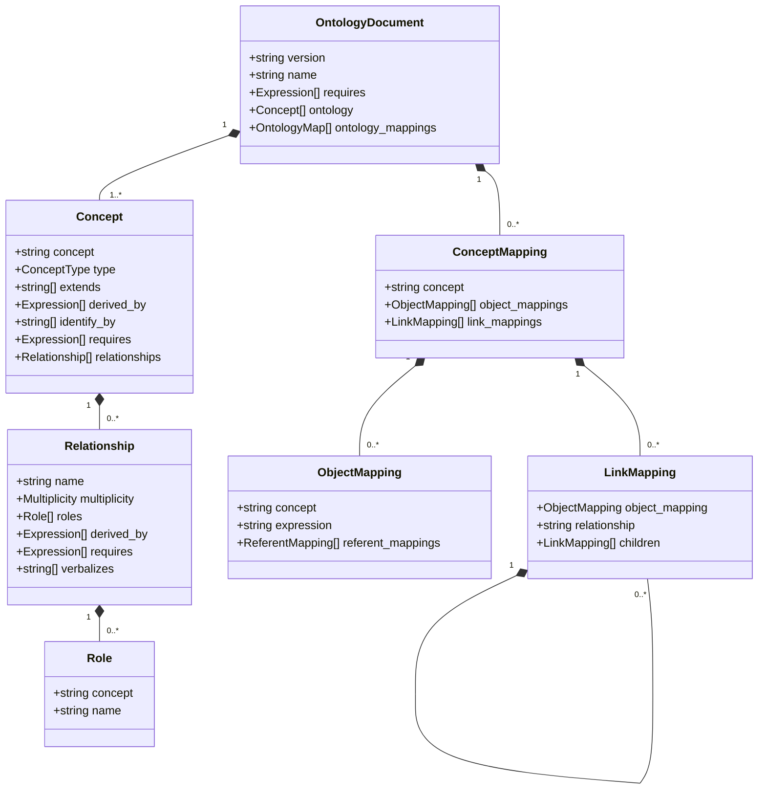

### 5.2 핵심 아이디어 4가지

**① Concept = EntityType | ValueType**
`ValueType`은 "의미가 붙은 데이터 타입"이다. 예: 사회보장번호는 9자리 정수.

```yaml
- concept: SocialSecurityNr
  type: ValueType
  extends: [Integer]
  requires: [ "0 < SocialSecurityNr", "SocialSecurityNr <= 999999999" ]
```

**② Relationship은 n-항(n-ary)이며, 첫 role은 선언한 concept이 맡는다**
논리층의 relationship이 2항 FK로 제한되는 것과 대조적이다.

```yaml
- concept: Store
  relationships:
    - name: ships_to_in_days
      roles:
        - concept: Store
          name: destination      # 같은 concept이 두 role → 이름으로 구분
        - concept: NrDays
      multiplicity: ManyToOne
      verbalizes: [ "{Store} ships to {Store:destination} in {NrDays}" ]
```

식별자는 `Store.ships_to_in_days` — **"dot-join" 네비게이션**을 지원한다.

**③ `verbalizes` — 자연어 템플릿이 1급 필드다 (필수!)**
이게 이 스펙에서 가장 AI-네이티브한 결정이다. 모든 관계는 자연어 서술 패턴을 **반드시** 가져야 한다. LLM이 스키마를 문장으로 읽을 수 있게 하는 명시적 채널이고, 논리층의 자유 서술형 `ai_context`보다 훨씬 규범적이다.

**④ `derived_by` — 재귀 규칙 지원 (Datalog 계보)**

```yaml
- name: ancestor_of
  roles: [{ concept: Person, name: "descendant" }]
  derived_by:
    - "Person.parent_of(descendant)"                # base case
    - "Person.ancestor_of.parent_of(descendant)"    # recursive case
```

이건 SQL이 아니다. **Datalog 스타일 재귀 규칙**이며, RelationalAI가 커밋 31개로 이 부분을 주도한 흔적이 뚜렷하다.

### 5.3 `ontology_mappings` — 개념층과 논리층의 접착제

`link_mappings`는 **트리 구조**로 조직된다. 하나의 논리 필드가 여러 관계에서 role을 맡을 때 중복 선언을 피하기 위해서다.

```yaml
concept_mappings:
  - concept: Item
    link_mappings:
      - object_mapping:
          referent_mappings: { relationship: Item.nr, expression: METRICS.SKU }
        relationship: active                  # 레벨 1 → 1항 관계
        children:
          - object_mapping: { concept: Store, expression: METRICS.STORE }
            relationship: active_in           # 레벨 2 → 2항 관계
            children:
              - object_mapping: { concept: Amount, expression: METRICS.SALES }
                relationship: sold_in_for     # 레벨 3 → 3항 관계
              - object_mapping: { concept: Amount, expression: METRICS.RETURNS }
                relationship: returned_in_for
```

**규칙: 트리 레벨 = 관계의 arity.** `Item`은 한 번만 선언되고 4개 관계에 재사용된다. 압축적이고 우아하지만, **손으로 쓰기엔 상당히 어렵다** — 도구 지원이 필수인 형태다.

### 5.4 평가

**강점**: 논리 모델은 물리 스키마가 바뀌면 같이 깨지지만, 개념 모델은 안 깨진다. 조직이 "Customer란 무엇인가"를 한 번 정의하고 여러 물리 모델을 거기에 매핑하는 그림은 실제로 대기업(특히 금융권)이 원하는 것이고, FSI 워킹그룹이 생긴 이유이기도 하다.

**리스크**:
- 논리층과 **완전히 다른 표현식 언어**를 쓴다 (`Person.parent_of(descendant)` vs `SUM(orders.amount)`). `expression_language.md`가 "온톨로지층도 같은 언어를 쓰면 좋겠지만 별도 제안으로 다룬다"고 명시적으로 미뤄뒀다 — 즉 **현재 두 개의 미정의 표현식 언어가 한 스펙 안에 공존한다.**
- `ontology.json` 스키마에서 `Expression`은 그냥 `string`이다. 문법 검증이 전혀 없다.
- 컨버터 11개 중 온톨로지를 다루는 건 **OrionBelt 하나뿐**이고, 그마저 "measures/metrics와 컬럼 레벨 value concept은 온톨로지 export에 미포함"이라고 명시한다.
- 채택 장벽이 높다. ORM/NIAM은 학술적으로는 탄탄하지만 산업계 데이터 엔지니어에게 익숙한 어휘가 아니다.

---

## 6. Expression Language 제안 — 스펙과 스키마의 괴리

`core-spec/expression_language.md`(780줄, 상태: `Proposed Final`)는 Snowflake의 Will Pugh가 리드하고 Malloy·AtScale·Salesforce·dbt Labs·RelationalAI·Databricks·Cube·ThoughtSpot·Lightdash·Starburst·Denodo가 참여한 워킹그룹 산출물이다.

### 6.1 내용

- **기반**: ANSI SQL:2003 Core (ISO/IEC 9075-2:2003)
- **신규 dialect 제안**: `Ossie_SQL_2026`, 미지정 시 기본 dialect로
- **컴플라이언스 3단계**: `MUST`(REQUIRED) / `SHOULD`(RECOMMENDED) / `MAY`(dialect extension)
- **허용 구문**: 산술·비교·논리 연산자, `BETWEEN`/`IN`/`LIKE`/`CASE`, 집계·윈도우·스칼라 함수
- **금지 구문**: `SELECT`/`FROM`/`JOIN`(시맨틱 레이어 담당), `GROUP BY`(grain이 결정), `WHERE`(filter 속성 사용), 서브쿼리, CTE, `UNION`, DDL/DML
- **식별자 규칙**: ANSI 표준, 128자 제한, 무인용 식별자는 대소문자 무시, 정규화 시 대문자화

### 6.2 가장 흥미로운 부분 — 분해가능성(Decomposability) 분류

| 분류 | 함수 | 의미 |
|---|---|---|
| **Distributive** | SUM, COUNT, MIN, MAX | 부분집합 결과를 그대로 합칠 수 있음 |
| **Algebraic** | AVG, STDDEV, VARIANCE | 중간 상태(합·개수)를 유지하면 합칠 수 있음 |
| **Holistic** | MEDIAN, PERCENTILE, COUNT DISTINCT | 전체 데이터를 봐야 함 |
| **Sketch-based** | APPROX_COUNT_DISTINCT, APPROX_PERCENTILE | 확률적 스케치로 병합 가능 |

이건 단순 함수 목록이 아니라 **다단계 집계(pre-aggregation, roll-up, 캐시 재사용) 최적화의 기반**이다. 큐브 엔진·머티리얼라이즈드 뷰를 만들려면 반드시 필요한 분류이고, 이게 스펙에 명시적으로 들어간 건 좋은 신호다.

### 6.3 ⚠️ 하지만 — 스키마에 없다

```
core-spec/expression_language.md : "Ossie_SQL_2026 dialect를 만들고 기본값으로"
core-spec/osi-schema.json        : enum = [ANSI_SQL, SNOWFLAKE, MDX, TABLEAU,
                                            DATABRICKS, MAQL, BIGQUERY]  ← 없음
python/src/ossie/models.py       : OSIDialect에 없음
core-spec/spec.md                : dialect 표에 없음
```

`Proposed Final`이지만 아직 어떤 실행 코드에도 반영되지 않았다. 이건 **"함수 목록 문서"와 "검증 가능한 스펙" 사이의 간극**이다. 현재로선 어떤 구현이 REQUIRED 함수를 다 지원하는지 확인할 방법이 없다 — §9.9의 compliance 부재 문제와 직결된다.

문서 드리프트도 있다: `docs/index.md`는 지원 dialect를 "ANSI_SQL, SNOWFLAKE, DATABRICKS, MDX, TABLEAU"라고 서술해 **MAQL·BIGQUERY를 빠뜨린다.**

---

## 7. 참조 도구 코드 분석

### 7.1 `validation/validate.py` — 유일하게 동작하는 검증기 (290줄)

4단계 검증을 순차 수행한다.

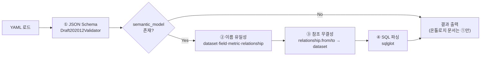

핵심 구현 디테일:

```python
# validate.py:63 — Ossie dialect → sqlglot dialect 매핑
DIALECT_MAP = {"ANSI_SQL": None, "SNOWFLAKE": "snowflake",
               "DATABRICKS": "databricks", "BIGQUERY": "bigquery",
               "MDX": None, "TABLEAU": None, "MAQL": None}
SKIP_SQL_VALIDATION = {"MDX", "TABLEAU", "MAQL"}   # sqlglot이 못 파싱 → 검증 스킵
```

```python
# validate.py:162 — 2단계 파싱 폴백
try:
    sqlglot.parse_one(expr, dialect=...)          # 표현식으로 시도
except (ParseError, TokenError):
    sqlglot.parse_one(f"SELECT {expr}", ...)      # 실패하면 SELECT로 감싸서 재시도
```

**한계 (코드로 확인된 것)**:
- `sqlglot`이 없으면 SQL 검증을 **경고만 하고 통과**시킨다 → CI에서 조용히 무력화될 수 있음
- MDX/TABLEAU/MAQL 표현식은 **아예 검증하지 않는다** → 이 3개 dialect는 사실상 자유 문자열
- 문법만 본다. 표현식이 참조하는 `dataset.field`가 실제로 존재하는지 **의미 검증은 하지 않는다**
- `field.expression`에 집계를 쓰면 안 된다는 스펙 규칙(스칼라 SQL만)을 **강제하지 않는다**
- 온톨로지 문서는 JSON Schema만 통과하면 끝. `derived_by`·`requires` 표현식은 **어떤 검증도 없다**

### 7.2 `python/ossie` — pydantic 데이터 모델 (223줄)

전 모델이 `ConfigDict(frozen=True)` — 불변 값 객체다. 예약어 회피를 위해 `from` → `from_dataset` alias 처리:

```python
class OSIRelationship(BaseModel):
    model_config = ConfigDict(frozen=True, populate_by_name=True)
    from_dataset: str = Field(..., alias="from")
```

`to_osi_yaml()`은 `exclude_none=True` + `by_alias=True`로 직렬화 — 왕복 시 `None` 필드가 사라지므로 정규화 효과가 있다.

**설계 평가**: 얇고 깔끔하다. 단, `OSIDocument`에 `dialects`·`vendors` 필드가 있는데 **`osi-schema.json`에는 없다**(루트 `additionalProperties: false`). 즉 파이썬 모델이 생성한 YAML에 이 필드가 들어가면 **공식 검증기가 거부한다.** 실제로 dbt 컨버터가 `dialects=[self._dialect]`를 채워 넣고 있어(`msi_to_osi.py:305`), 이 경로 출력물은 `validate.py`를 통과하지 못한다. 명백한 참조 구현 ↔ 스키마 불일치.

### 7.3 `cli/` — Go CLI: 플러그인 프로토콜만 살아있다

```
ossie
├── convert  --from/--to  --input  --output  → "not yet implemented"
├── validate [--strict] [--output json]      → "not yet implemented"
└── plugin
    ├── list     ✅ 구현됨
    ├── install                              → "not yet implemented"
    └── remove                               → "not yet implemented"
```

**하지만 플러그인 규약 자체는 잘 설계되어 있다.**

플러그인 디스커버리: `$OSSIE_PLUGIN_DIR` 또는 `~/.ossie/plugins/<name>/plugin.yaml`

```yaml
ossie_plugin_spec: "1"
ossie_spec_version: "0.2.0.dev0"
name: snowflake
platform: snowflake
setup: ...
convert:
  to_ossie:
    invoke: ["python", "-m", "ossie_snowflake", "import"]
    accepts: [".yaml"]
  from_ossie:
    invoke: ["python", "-m", "ossie_snowflake", "export"]
```

호출 규약 (`internal/plugin/invoke.go`): **JSON over stdin/stdout 서브프로세스**

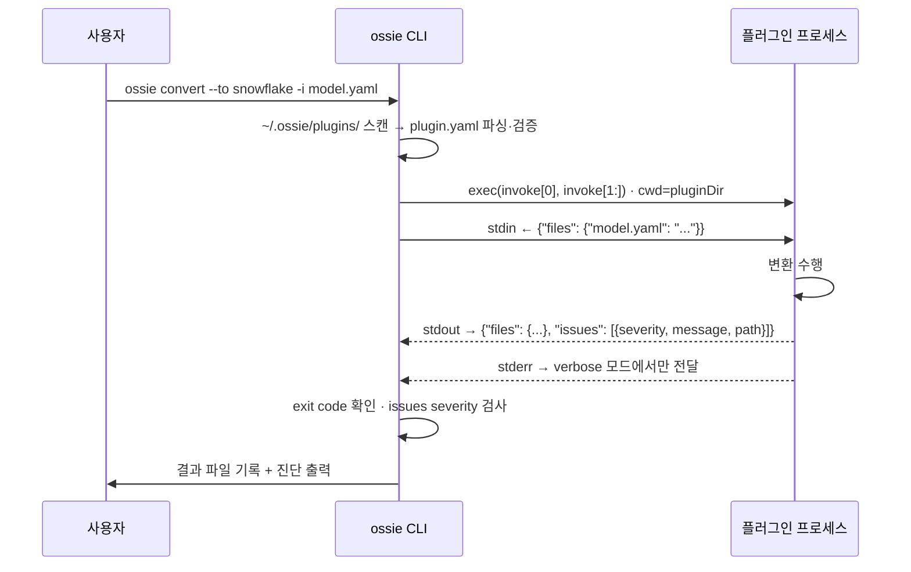

**잘 만든 부분들** (코드에서 확인):
- `yaml.Unmarshal`이 미지 필드를 무시하는 걸 **의도적으로 남겨뒀다** — "미래 스펙 버전이 필드를 추가해도 구버전 CLI가 거부하지 않도록" (`discover.go` 주석). 코어 스키마의 `additionalProperties: false`와 정반대 철학인데, 플러그인 메타데이터에는 이게 맞다.
- 잘못된 플러그인은 **에러가 아니라 stderr 경고 후 스킵** — 하나가 깨져도 전체가 죽지 않음
- `ctx.Err()`를 명시적으로 검사해 타임아웃과 일반 실패를 구분 (`exec.CommandContext`는 `"signal: killed"`를 반환하지 `DeadlineExceeded`를 반환하지 않기 때문)
- `Issues` 배열이 있어도 **Go 에러가 아니다** — severity 판단은 호출자 책임. 부분 성공 변환을 표현할 수 있는 설계
- `req.Files`가 nil이면 빈 맵으로 정규화 → 플러그인이 항상 `{"files":{}}`를 받음

**핵심 관찰**: 이 프로토콜은 **§8에서 확인되는 컨버터 파편화를 해결하려는 시도**다. 현재 컨버터들은 각자 다른 CLI 인터페이스·다른 언어·다른 에러 표현을 쓴다. 플러그인 규약은 이걸 하나의 계약(JSON 봉투 + severity 있는 issues)으로 통일한다. **다만 아직 `convert`가 미구현이라 아무 컨버터도 이 규약을 실제로 쓰지 않는다.**

---

## 8. 컨버터 생태계 — 11개, 실제로 가장 많은 코드

### 8.1 전체 현황

| 벤더 | 방향 | 언어 | 핵심 LOC | 대상 포맷 |
|---|---|---|---|---|
| **dbt (MetricFlow)** | 양방향 | Python | 1,085 | MSI SemanticManifest |
| **Databricks** | 양방향 | Python | 1,314 | Unity Catalog Metric View v1.1 |
| **GoodData** | 양방향 | Python | 1,193 | GoodData LDM |
| **NVIDIA GSF** | 양방향 | Python | 2,168 | GsfModelDocument |
| **Honeydew** | 양방향 | Python | 1,067 | Honeydew entity/attribute |
| **Omni** | 양방향 | Python | 1,892 | Omni views/topics/relationships |
| **OrionBelt** | 양방향 | Python | 3,238 | OBML (+ 온톨로지층) |
| **Snowflake** | **단방향** (Ossie→SF) | Python | 546 | Cortex Analyst semantic model |
| **WisdomAI** | 양방향 | Python | 872 | Wisdom domain |
| **Apache Polaris** | **단방향** (Ossie→Polaris) | Java | ~1,100 | Iceberg 카탈로그 |
| **Salesforce** | 양방향 | Java | ~4,800 | Salesforce/Tableau |

각 컨버터마다 별도 GitHub Actions 워크플로(`converter-*-ci.yml` 11개)가 있고, Python 쪽은 `uv` + `pyproject.toml` 개별 패키지, Java 쪽은 Maven이다. **모노레포 안의 독립 패키지 11개** 구조.

### 8.2 케이스 스터디 ① — dbt MetricFlow: 구조 → 문자열 → 구조

가장 중요한 컨버터다. dbt MetricFlow(MSI)는 Ossie와 **정면 충돌하는 메트릭 모델**을 가진다.

| | MetricFlow (MSI) | Ossie |
|---|---|---|
| 메트릭 타입 | SIMPLE / RATIO / DERIVED / CUMULATIVE / CONVERSION | **없음** |
| 집계 | `agg: sum` 구조화 필드 | **SQL 문자열 안에 인라인** |
| 필터 | 구조화된 필터 객체 | **없음** (CASE WHEN으로 인라인) |
| 시간 그레인 | `TimeGranularity` enum | **없음** |
| 엔티티 | primary/unique/foreign/natural | primary_key / unique_keys만 |

**MSI → Ossie 방향**: 구조화된 메트릭 트리를 **재귀적으로 SQL 문자열로 평탄화**한다.

```python
# msi_to_osi.py:325 — RATIO 메트릭
num_expr = self._resolve_metric_expression(...)   # 재귀
den_expr = self._resolve_metric_expression(...)
return f"({num_expr}) / ({den_expr})"

# msi_to_osi.py:334 — DERIVED 메트릭: 정규식 치환으로 하위 메트릭 인라인
expr = re.sub(rf"\b{re.escape(ref)}\b", resolved, expr)

# msi_to_osi.py:436 — 필터를 집계 안쪽 CASE WHEN으로 밀어넣음
fc = f"CASE WHEN {filter_sql} THEN {col} END" if filter_sql else col
```

즉 `revenue_per_customer = revenue / customer_count`라는 **조합 가능한 정의**가
`(SUM(orders.amount)) / (COUNT(DISTINCT customers.id))`라는 **불투명한 문자열**이 된다.
`revenue`가 나중에 바뀌어도 이 문자열은 따라오지 않는다. **조합성(composability)의 완전한 소실이다.**

손실은 최소한 정직하게 기록한다:

```python
class ConverterIssueType(Enum):
    CONVERSION_METRIC_DROPPED   = ...   # Ossie에 전환 퍼널 메트릭 타입 없음
    PRIVATE_METRIC_DROPPED      = ...   # Ossie에 가시성 수식어 없음
    NATURAL_ENTITY_DROPPED      = ...   # Ossie에 자연키 엔티티 타입 없음
    CUMULATIVE_SEMANTICS_LOSS   = ...   # 윈도우/그레인 의미 표현 불가
```

**Ossie → MSI 역방향**: 잃어버린 구조를 **sqlglot으로 SQL 문자열을 재파싱해 복원 시도**한다.

```python
# expression_utils.py:_extract_agg_info
if isinstance(tree, exp.Count) and isinstance(tree.this, exp.Distinct): → COUNT_DISTINCT
if isinstance(tree, exp.Sum) and isinstance(tree.this, exp.Case):       → SUM_BOOLEAN
# 매칭 안 되면 raw expression 그대로 SIMPLE 메트릭에 박아넣음
```

그리고 문서가 인정한다: *"Time dimensions always receive `TimeGranularity.DAY` — Ossie has no granularity field."* 모든 시간 차원의 그레인이 **강제로 DAY가 된다.**

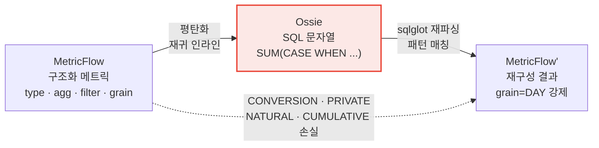

> **이것이 Ossie 스펙의 가장 큰 구조적 한계를 드러내는 증거다.** 로드맵 최상위 워킹그룹("Metric Semantics & Core Semantic Model")이 정확히 이 문제를 다루고, [discussion #19](https://github.com/apache/ossie/discussions/19)("구조화된 aggregation_method")이 열려 있다.

### 8.3 케이스 스터디 ② — Databricks Metric View: 그래프 → 트리 재조립

Ossie는 **관계 그래프**(datasets + relationships)이고, Databricks Metric View는 **하나의 fact source + 중첩 joins 트리**다. 그래프를 트리로 바꿔야 한다.

```
Ossie:  datasets: [store_sales, customer, date_dim, item, store]
        relationships: [ss→c, ss→d, ss→i, ss→st]        (그래프)
          ↓ export
MV:     source: store_sales
        joins:
          - name: customer  on: ...
            joins: [{ name: region, ... }]              (트리)
        dimensions: [customer.c_name, customer.region.r_name, ...]   (조인 경로로 정규화)
```

구현 디테일:
- `--source`로 fact/grain을 선택. 기본값은 **FK 싱크 데이터셋**(들어오는 FK가 가장 많은 노드)
- **다이아몬드 처리**: 두 경로로 도달 가능한 데이터셋은 **경로마다 별칭 조인으로 팬아웃**
- `primary_key`/`unique_keys`가 조인 컬럼을 커버하면 `rely.at_most_one_match: true` 생성 → 옵티마이저 힌트로 활용
- `from_columns`/`to_columns` 이름이 같으면 `using`, 다르면 `on`

**손실 처리가 방향별로 비대칭**이다:
- **import** (MV → Ossie): MV 고유 기능(filter, window, format, rely…)을 `custom_extensions[DATABRICKS]`에 보존 → `MV → Ossie → MV` 무손실
- **export** (Ossie → MV): relationship `ai_context`, `dimension.is_time`, 타 dialect, 타 벤더 확장을 **경고와 함께 드롭**

즉 **자기 포맷으로 돌아오는 왕복은 무손실이지만, 허브를 경유한 벤더 간 이동은 아니다.** 이게 hub-and-spoke의 실제 모습이다.

### 8.4 케이스 스터디 ③ — GoodData: 메트릭을 아예 포기

```
Limitations:
- Metrics are not converted. GoodData metrics use MAQL, a context-aware metric
  language where dimensionality and filters are applied at report time. The current
  Ossie metric model is SQL-expression-based and cannot represent this paradigm.
```

**메트릭 교환 표준인데 메트릭을 변환하지 못한다.** MAQL은 리포트 시점에 차원성과 필터가 결정되는 **문맥 의존 언어**이고, Ossie의 SQL 표현식 모델은 이걸 담을 수 없다. Dialect enum에 `MAQL`이 추가됐지만 그건 "문자열을 그대로 담는 상자"일 뿐이다.

같은 문제가 `MDX`, `TABLEAU` dialect에도 있다 — `validate.py`가 이 3개를 아예 검증에서 제외한다.

### 8.5 손실 처리 전략 3가지 — 컨버터별로 다르다

| 전략 | 채택 컨버터 | 방식 | 평가 |
|---|---|---|---|
| **드롭 + 경고** | Snowflake, Databricks(export) | `warnings.warn()` | 가장 흔하지만 소비자가 경고를 무시하기 쉬움 |
| **확장에 보존** | Databricks(import), Honeydew, OrionBelt | `custom_extensions[VENDOR]` | 자기 왕복은 무손실. 타 벤더는 못 읽음 |
| **타입화된 Issue** | dbt | `ConverterIssue(issue_type, element_name)` | 가장 견고. 프로그래밍적으로 처리 가능 |
| **예외 발생** | Databricks(요구사항 위반 시) | `ConversionError` | "조용히 잘못된 결과" 방지 |

OrionBelt의 접근이 특히 영리하다: 변환 불가능한 Ossie 메트릭을 드롭하지 않고 **모델 레벨 `OSI` 벤더 확장(`obml_unconverted_metrics`)에 원문 그대로 보존**한 뒤 역방향에서 재발행한다. `Ossie → OBML → Ossie` 왕복이 무손실이고, 대신 `LOSSY:` 경고로 "OBML에서 쿼리는 불가능함"을 알린다.

**하지만 이 전략 다양성 자체가 문제다.** 스펙이 손실 보고 방식을 규정하지 않아 각자 다르게 한다. CLI 플러그인 프로토콜의 `Issue{severity, message, path}`가 이걸 통일하려는 시도지만, 아직 아무도 쓰지 않는다.

---

## 9. 스펙의 구조적 한계 — 엔지니어 관점

코드에서 직접 확인된 것들만 정리한다.

| # | 한계 | 근거 | 로드맵 대응 |
|---|---|---|---|
| **9.1** | **메트릭이 raw SQL 문자열 → 조합 불가능** | `Metric.expression.dialects[].expression: string` | WG1 (#19, #29, #40) |
| **9.2** | **grain/entity 개념 부재** | 메트릭이 어느 데이터셋 소속인지 표현 불가 | WG1 (#12, #18) |
| **9.3** | **관계는 항상 many-to-one 단방향** | 카디널리티 enum·조인 타입·M:N 없음 | 미래 (#50, #11, #4) |
| **9.4** | **시간 그레인·계층 없음** | dbt 컨버터가 모든 시간차원을 DAY로 강제 | 미래 (#21, #20, #44) |
| **9.5** | **재사용 가능한 필터 없음** | 필터는 CASE WHEN으로 표현식에 인라인 | WG1 (#5) |
| **9.6** | **거버넌스·리니지·신뢰 메타데이터 전무** | 스펙에 lineage/freshness/certified/verified 단어 자체가 없음 | 미래 (#53, #13) |
| **9.7** | **안정 식별자 없음 — `name`이 곧 ID** | 이름 변경 = 파괴적 변경 | 미래 (#31) |
| **9.8** | **dialect 폴백이 규범이 아님** | "vendor → ANSI_SQL 폴백"은 컨버터 가이드의 *권고* | 미래 (#16, #28, #52) |
| **9.9** | **적합성 테스트 부재** | `compliance/` = README 한 줄 | 미래 |
| **9.10** | **CLI 미구현** | `convert`/`validate`/`plugin install|remove` 전부 스텁 | 진행 중 |
| **9.11** | **표현식 언어 스펙↔스키마 괴리** | `Ossie_SQL_2026`이 어떤 enum에도 없음 | §6.3 |
| **9.12** | **참조 구현↔스키마 불일치** | `OSIDocument.dialects/vendors`가 스키마에 없음 | — |
| **9.13** | **전진 호환성 없음** | 전 오브젝트 `additionalProperties: false` | — |
| **9.14** | **온톨로지 표현식 미정의** | `ontology.json`에서 `Expression = string` | WG3 |

### 9.6에 대한 보충 — "정의는 이동하지만 신뢰는 이동하지 않는다"

이게 외부 비평에서 가장 자주 지적되는 지점이다. Ossie 문서는 **정의**를 나른다. 하지만 나르지 못하는 것:

- 누가 이 정의를 승인했는지, 언제 마지막으로 검증됐는지
- 소스 테이블이 지금 신선한지, 마이그레이션 중인지
- 재무팀이 이 메트릭을 신뢰하지 않는다는 조직 지식
- 중복 컬럼 중 어느 게 정본인지

AI 에이전트가 정의만 받고 신뢰 문맥 없이 답하면, **"유창하게, 출처까지 달아서 틀린 답"** 이 나온다. 이건 Ossie의 결함이라기보다 **스코프 경계**이고, 로드맵의 "Catalog Integration & Semantic Services", "Governance, Identity, and Validation" 워킹그룹이 겨냥하는 영역이다. 다만 현재는 **논리층 스펙만 있고 신뢰층은 공백**이라는 사실을 도입 시 인지해야 한다.

---

## 10. 로드맵과 워킹 그룹

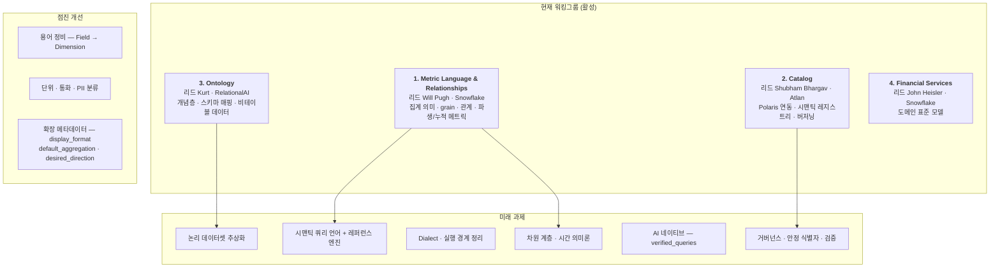

**가장 주목할 미래 과제 2가지**

1. **시맨틱 쿼리 언어 + 레퍼런스 엔진** — 현재 Ossie는 "어떻게 정의하는가"만 있고 "어떻게 질의하는가"가 없다. 레퍼런스 컴파일러(Ossie → SQL)와 적합성 테스트 스위트가 나오면 성격이 근본적으로 바뀐다. **"교환 포맷"에서 "실행 가능한 표준"으로.**
2. **용어 정비 — `Field` → `Dimension`** ([#33](https://github.com/apache/ossie/discussions/33)) — 이런 이름 변경 논의가 아직 열려 있다는 건 **스펙이 아직 안정화되지 않았다**는 강한 신호다.

---

## 11. 경쟁·비교 분석

### 11.1 포지셔닝 — 경쟁자가 아니라 계층이 다르다

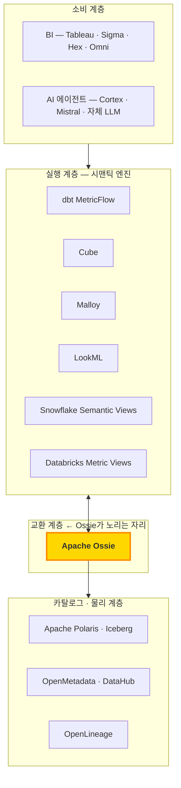

### 11.2 기능 비교표

| | **Apache Ossie** | **dbt MetricFlow** | **Cube** | **Malloy** | **LookML** | **Snowflake Semantic Views** |
|---|---|---|---|---|---|---|
| 성격 | 교환 스펙 | 시맨틱 엔진 + 스펙 | 시맨틱 엔진(API) | 언어 + 엔진 | 벤더 언어 | 벤더 네이티브 |
| 실행 엔진 | **없음** (로드맵) | 있음 (SQL 컴파일) | 있음 (+캐시) | 있음 | 있음 | 있음 (DB 내장) |
| 메트릭 모델 | **SQL 문자열** | 타입화 (SIMPLE/RATIO/DERIVED/CUMULATIVE) | 타입화 + 롤업 | 타입화 + 중첩 쿼리 | 타입화 | 타입화 |
| 조합 가능성 | ❌ | ✅ | ✅ | ✅ | ✅ | ✅ |
| grain / entity | ❌ | ✅ | ✅ | ✅ | ✅ | ✅ |
| 시간 그레인 | ❌ | ✅ | ✅ | ✅ | ✅ (`dimension_group`) | ✅ |
| 차원 계층 | ❌ | 부분 | ✅ | ✅ | ✅ | ✅ |
| 온톨로지 / 개념층 | **✅ (유일)** | ❌ | ❌ | ❌ | ❌ | ❌ |
| 다중 dialect | **✅ (유일)** | 단일 (어댑터) | 단일 | 단일 | 단일 | 단일 |
| 벤더 중립 | **✅** | ✅ (Apache-2.0) | ✅ | ✅ | ❌ | ❌ |
| 거버넌스 | ASF 인큐베이터 | dbt Labs | Cube Dev | Meta/커뮤니티 | Google | Snowflake |
| 캐싱 · 사전집계 | ❌ | 부분 | ✅ | ❌ | ✅ (PDT) | ✅ |
| 접근 제어 | ❌ | ❌ | ✅ | ❌ | ✅ | ✅ (DB 상속) |

**요약**: Ossie는 **기능이 가장 적은 대신 가장 중립적**이다. 이건 결함이 아니라 교환 포맷의 본질 — 모든 참여자의 **교집합**을 담아야 하기 때문이다. 문제는 교집합이 너무 작아서(§8.4의 GoodData 사례) 실용성이 의심받는다는 점이다.

### 11.3 인접 표준과의 관계

| 표준 | 계층 | Ossie와의 관계 |
|---|---|---|
| **Apache Iceberg / Polaris** | 물리·카탈로그 | **보완** — Polaris 컨버터가 이미 존재. Ossie 모델을 카탈로그에 등록 |
| **OpenLineage** | 리니지 | **보완** — Ossie가 못 담는 lineage를 담당 |
| **OpenMetadata / DataHub** | 카탈로그 메타데이터 | **보완** (일부 중첩) — DataHub이 참여사 |
| **LinkML** | 스키마 모델링 메타언어 | **잠재적 채택 대상** — [#67](https://github.com/apache/ossie/discussions/67)에서 "LinkML로 스펙에 엄밀성 추가" 논의 중 |
| **OWL / RDF** | 온톨로지 | **경쟁이자 영감** — Ossie 온톨로지층이 OWL을 참조하되 더 가벼운 ORM 계열 선택 |
| **FINOS Legend** | 금융 도메인 온톨로지 | **경쟁이자 영감** — 온톨로지층 설계 참조로 명시 |
| **MCP (Model Context Protocol)** | AI 도구 연결 | **직교** — MCP는 "어떻게 연결하나", Ossie는 "무엇을 아는가" |

---

## 12. 생태계·거버넌스

### 12.1 ASF 인큐베이션 상태

- **PPMC**(Podling PMC) + **Mentors** + **IPMC** 감독 구조
- 스펙 변경 프로세스: `dev@ossie.apache.org` 제안 → **최소 7일 토론** → `[VOTE]` 스레드 → **binding +1 3표 이상, veto 없음**
- veto(-1)는 **기술적 근거 필수**, 근거를 해소해야만 해제
- 저장소 규칙(`.asf.yaml`): squash 머지만 허용, 선형 히스토리 강제, PR 승인 1명, GitHub Copilot 코드 리뷰 활성화
- 릴리스 태그는 `osi-0.1.1-rc1` **하나뿐** — 아직 정식 ASF 릴리스가 없다

### 12.2 실제 커밋 분포 (241 커밋, 2025-10 ~ 2026-08)

| 조직 도메인 | 커밋 |
|---|---|
| gmail.com / noreply (개인) | 105 |
| **snowflake.com** | 31 |
| **relational.ai** | 31 |
| **honeydew.ai** | 15 |
| apache.org | 14 |
| dbtlabs.com | 9 |
| gooddata.com | 6 |
| 기타(NVIDIA·Databricks·Solid·WisdomAI·FanRuan 각 1~4) | ~30 |

**관찰**:
- Snowflake가 여전히 사실상의 주도자이지만, **RelationalAI가 동률**이다 — 온톨로지층이 사실상 RelationalAI 기여물임을 보여준다
- Honeydew(15커밋)는 회사 규모 대비 기여도가 매우 높다
- Databricks는 커밋 1개 — 참여 선언 대비 실제 코드 기여는 미미
- **50+ 참여사 중 실제로 코드를 넣은 곳은 10곳 내외.** "50개사 연합"은 마케팅 숫자에 가깝다

### 12.3 실제 채택 현황 (2026-08 기준)

| 도구 | 상태 |
|---|---|
| **dbt Core 1.12+** | 유일한 **네이티브 파싱** 지원. 단 **spec 0.1.0/0.1.1만 수용** (현 스펙은 0.2.0.dev0) |
| Apache Superset | SIP-182로 Ossie 시맨틱 레이어 논의 중 |
| 그 외 전부 | **저장소 내 참조 컨버터 경유만 가능.** 네이티브 지원 제품 없음 |

**버전 분기가 실질적 위험이다.** dbt는 0.1.1까지만 읽는데 스펙은 0.2.0.dev0으로 진행 중이고, 미지원 구문은 **경고와 함께 조용히 드롭**된다. 두 시스템이 "같은 정의를 공유한다"고 믿으면서 실제로는 서로 다른 절반을 들고 있는 상태가 만들어진다.

활발한 오픈 PR을 보면 방향은 확장 중이다: Microsoft 벤더 토큰 등록(#328), Alibaba Cloud Hologres 컨버터(#320), SAP Business Partner 온톨로지 예제(#310).

---

## 13. 종합 평가

### 13.1 강점

1. **문제 정의가 정확하고 타이밍이 맞다.** 텍스트→SQL 에이전트의 실패 원인이 "비즈니스 정의 부재"라는 진단은 옳고, 2025~2026년이 이 문제를 풀 유일한 창이다.
2. **Hub-and-spoke 산술이 설득력 있다.** N²→2N은 반박하기 어렵고, 11개 컨버터가 실제로 존재한다는 게 그 자체로 증거다.
3. **ASF 거버넌스는 진짜 중립성을 준다.** 이전 시맨틱 표준 시도들이 실패한 이유 중 하나가 단일 벤더 주도였다. binding +1 3표 + veto 제도는 Snowflake 독주를 구조적으로 막는다.
4. **온톨로지층은 경쟁자 누구도 안 하는 시도다.** 개념 상호운용은 어렵지만, 금융·제조 같은 규제 산업에서 실제 수요가 있고 여기서 차별화가 생길 수 있다.
5. **손실을 숨기지 않는 문화가 자리잡았다.** dbt의 `ConverterIssueType`, OrionBelt의 `obml_unconverted_metrics`, Databricks의 `ConversionError`, 각 README의 "Limitations" 섹션 — 스펙 프로젝트로서 매우 건강한 신호다.
6. **`datatype` vs `is_time` 분리, decomposability 분류** 같은 세부 설계가 성숙하다. 아마추어 스펙이 아니다.

### 13.2 약점·리스크

1. **메트릭이 SQL 문자열이라는 원죄.** 조합 불가능하고, grain이 없고, 필터가 인라인된다. §8.2의 dbt 왕복이 보여주듯 이건 컨버터 버그가 아니라 **스펙의 표현력 부족**이다. 로드맵 1순위지만 아직 해결 안 됐다.
2. **적합성 테스트 부재 = 표준의 근본 결함.** `compliance/`가 비어 있는 한 "Ossie 호환"은 검증 불가능한 마케팅 문구다. 표준 프로젝트에서 이건 P0급 공백이다.
3. **스펙 내부 불일치.** 표현식 언어가 스키마에 없고(`Ossie_SQL_2026`), 파이썬 참조 구현이 스키마가 거부할 필드를 생성하며(`dialects`/`vendors`), 문서가 dialect 목록을 틀리게 적는다. 0.2.0 릴리스 전에 정리돼야 한다.
4. **교집합이 너무 작다.** GoodData는 메트릭을 아예 못 옮기고, MDX/TABLEAU/MAQL은 검증조차 안 된다. "모든 도구가 읽을 수 있다"와 "모든 도구가 의미 손실 없이 읽을 수 있다"는 매우 다르다.
5. **버전 분기 위험이 이미 현실화됐다.** 유일한 네이티브 지원 도구(dbt)가 0.1.1에 묶여 있는데 스펙은 0.2.0.dev0을 달린다.
6. **참여사 수와 기여도의 괴리.** 50+ 참여사, 실질 기여 10곳 내외. 표준의 성공은 서명이 아니라 구현이 결정한다.
7. **신뢰·거버넌스 메타데이터 공백.** 정의는 이동하지만 lineage·freshness·승인 이력은 이동하지 않는다.

### 13.3 적합 / 부적합

**지금 도입할 만한 경우**
- 이미 **여러 시맨틱 레이어를 병행 운영**하고, 정의 드리프트로 실제 비용이 발생 중인 조직
- **컨버터가 이미 있는 조합**을 쓰는 경우 (Ossie ↔ dbt / Databricks / Snowflake / GoodData / Omni / Honeydew)
- 시맨틱 레이어 **제품을 만드는 벤더** — 지금 컨버터를 넣으면 스펙 방향에 영향력을 행사할 수 있다
- 메트릭 정의를 **Git에 두고 문서·리뷰 용도로 정규화**하려는 경우 (실행은 각 도구 네이티브로)

**아직 기다려야 하는 경우**
- 시맨틱 레이어가 **하나뿐**인 조직 — 교환할 대상이 없으면 순수 오버헤드
- **누적·파생·비율 메트릭**이 핵심인 조직 — §8.2의 손실이 그대로 발생
- **시간 그레인·차원 계층**에 의존하는 모델 — 스펙에 개념 자체가 없다
- Ossie를 **실행 레이어로 기대**하는 경우 — 쿼리 엔진이 없다. 교환 포맷이다
- **거버넌스·감사 추적**이 요구사항인 규제 환경 — 신뢰 메타데이터 공백

### 13.4 엔지니어 관점 인사이트

**① "표준"과 "스펙 문서"는 다르다.**
Ossie는 좋은 스펙 문서를 갖고 있지만 표준이 되려면 세 가지가 더 필요하다 — 적합성 테스트, 레퍼런스 구현, 그리고 그 둘을 통과한 독립 구현 최소 2개. 현재 0/3이다. Iceberg가 성공한 이유도 스펙이 좋아서가 아니라 **여러 엔진이 같은 테이블을 실제로 읽었기** 때문이다.

**② 교환 포맷의 표현력은 참여자 교집합으로 수렴한다 — 이걸 이기려면 "확장 + 신뢰성 있는 손실 보고"가 필요하다.**
Ossie는 `custom_extensions`(확장)는 갖췄지만 손실 보고는 컨버터마다 제각각이다(§8.5). CLI 플러그인 프로토콜의 `Issue{severity, message, path}`가 정답에 가장 가까운데, `convert`가 구현되지 않아 쓰이지 않는다. **이 갭을 메우는 게 다음 6개월의 실질적 우선순위여야 한다.**

**③ 온톨로지층은 도박이지만 유일한 진짜 차별화다.**
dbt·Cube·Malloy·LookML 어느 쪽도 개념층을 안 한다. Ossie가 논리층에서만 경쟁하면 "기능이 제일 적은 시맨틱 레이어"로 끝난다. 개념층까지 가면 **FINOS Legend·Palantir Ontology의 오픈 대안**이라는 다른 포지션이 열린다. 다만 ORM/NIAM 어휘의 학습 곡선과 도구 부재가 실질 장벽이다.

**④ 지금 Ossie를 쓰는 가장 현실적인 방법: "정규화된 문서 포맷"으로 쓰기.**
실행은 각 도구 네이티브로 하고, Ossie YAML은 **Git에 두는 정의의 정본(canonical documentation)** 으로 쓴다. `validate.py`를 CI에 걸어 스키마·중복·참조 무결성을 강제하고, 컨버터는 "새 도구 온보딩 시 초기 스캐폴딩" 용도로만 쓴다. 양방향 실시간 동기화를 기대하면 §8의 손실에 부딪힌다.

**⑤ 벤더라면 지금이 개입 타이밍이다.**
스펙이 0.2.0.dev0이고 `Field → Dimension` 같은 이름 논의가 아직 열려 있다. 커밋 241개, 실질 기여 조직 10곳 규모의 프로젝트에서 컨버터 하나 + 워킹그룹 참여는 실제 영향력으로 환산된다. 1.0 이후엔 이 창이 닫힌다.

---

## 부록 A. 빠른 시작

```bash
git clone https://github.com/apache/ossie.git && cd ossie

# 1) 검증기 의존성
pip install pyyaml jsonschema sqlglot

# 2) 논리 모델 검증
python validation/validate.py examples/tpcds_semantic_model.yaml

# 3) 온톨로지 문서 검증
python validation/validate.py examples/flights.yaml --schema ontology/ontology.json

# 4) 컨버터 실행 (예: Databricks Metric View)
cd converters/databricks && uv sync
uv run ossie-databricks export -i ../../examples/tpcds_semantic_model.yaml -o mv.yaml

# 5) CLI 빌드 (plugin list만 동작)
cd cli && make build && ./dist/ossie plugin list
```

## 부록 B. 최소 유효 문서

```yaml
version: "0.2.0.dev0"
semantic_model:
  - name: minimal
    datasets:
      - name: orders
        source: sales.public.orders
```

`version`과 `semantic_model`은 필수, `SemanticModel`은 `name` + `datasets`(최소 1개) 필수, `Dataset`은 `name` + `source` 필수. 이게 전부다.

## 부록 C. 주요 참고 자료

- 저장소: https://github.com/apache/ossie
- 공식 사이트: https://ossie.apache.org/ · [업데이트 타임라인](https://ossie.apache.org/updates/)
- 인큐베이터 상태: https://incubator.apache.org/projects/ossie.html
- 로드맵: `ROADMAP.md` · 워킹그룹: `docs/working_groups.md`
- GitHub Discussions (스펙 논쟁의 실제 장소): https://github.com/apache/ossie/discussions
