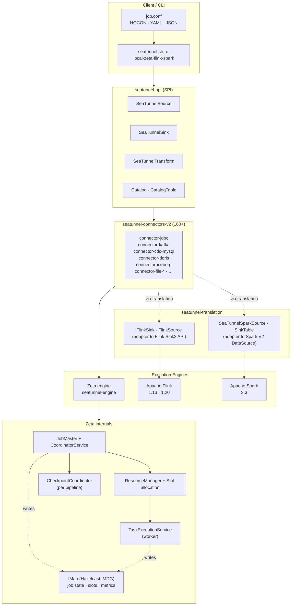
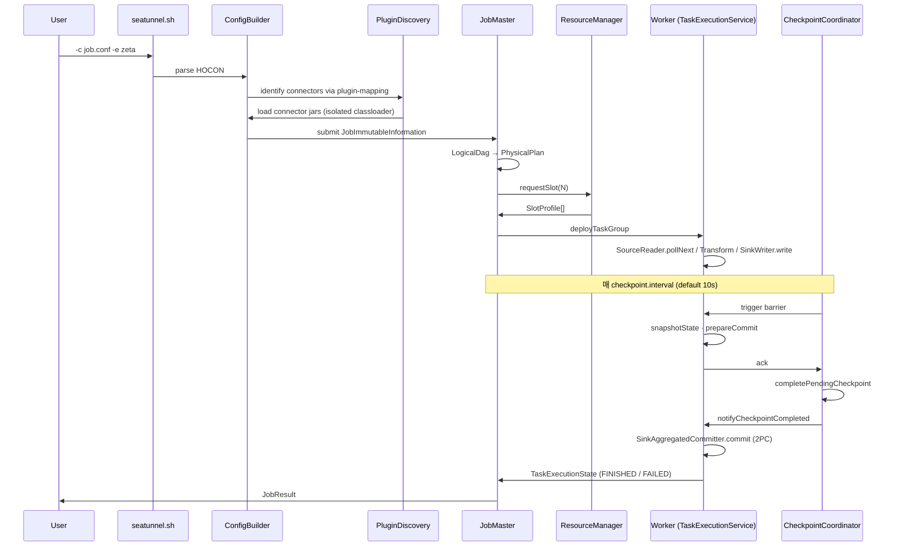
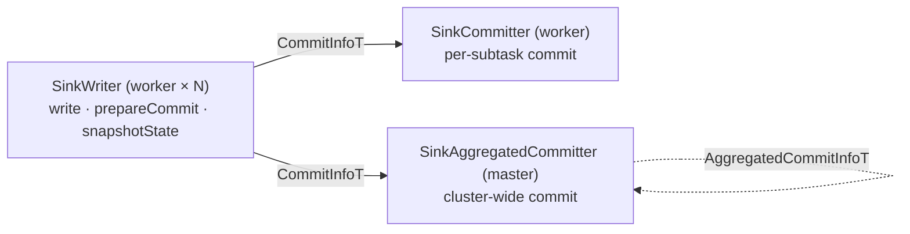
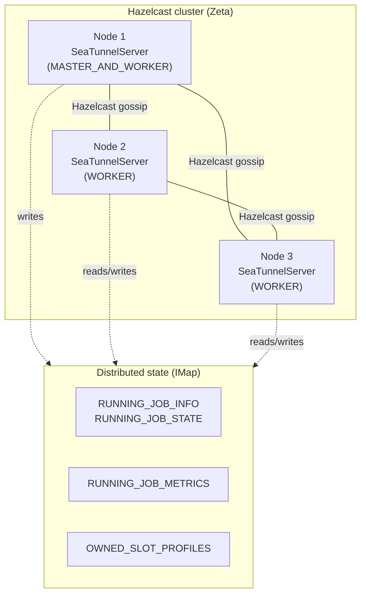
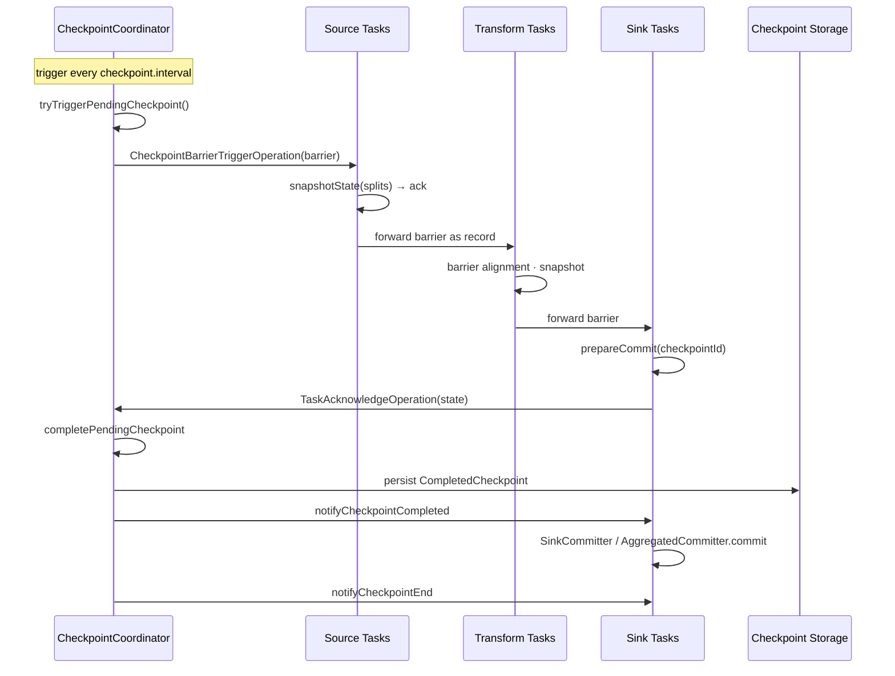
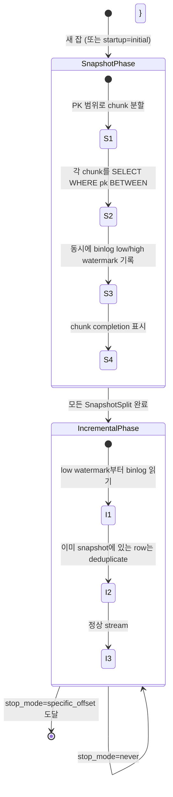
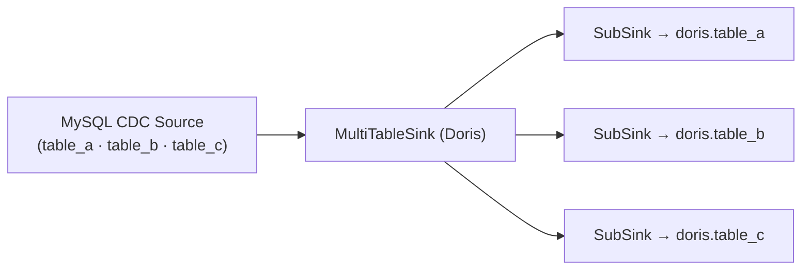

# Apache SeaTunnel 심층 분석 — 멀티엔진 분산 데이터 통합 플랫폼

> 분석 대상: [apache/seatunnel](https://github.com/apache/seatunnel) (`dev` 브랜치, `3.0.0-SNAPSHOT`, 커밋 `bf25292`)
> 분석 시점: 2026-04-28
> 분석 관점: 데이터 파이프라인을 직접 설계·운영하는 SWE의 시각 — 아키텍처·SPI·엔진·확장성

---

## TL;DR

Apache SeaTunnel은 **"엔진 중립 + 160+ Connector"**라는 단일 명제로 설계된 분산 데이터 통합 플랫폼이다. Airbyte처럼 connector ecosystem만 제공하는 것이 아니라 자체 분산 실행기 **Zeta**를 1차 타겟으로 가지면서, 같은 Connector를 Flink·Spark에서도 그대로 실행할 수 있게 **Translation Layer**로 추상화했다.

핵심을 한 문장씩 정리하면:

- **단일 SPI, 다중 백엔드**: `SeaTunnelSource` / `SeaTunnelSink` 인터페이스를 정의하고, Zeta·Flink·Spark 어댑터가 각각 자기 엔진 타입으로 wrap. 한 번 짠 connector가 세 엔진에서 모두 돌아감.
- **Zeta = Hazelcast IMDG 기반 자체 엔진**: `IMap`을 분산 상태 저장소로 쓰면서 master HA·slot 관리·체크포인트 좌표 모두 처리. JobManager 하나 띄우는 대신 모든 노드가 candidate.
- **CDC가 first-class**: `connector-cdc-base`가 hybrid (snapshot → incremental) split assigner를 제공하고, MySQL/Postgres/Oracle/MongoDB/SQLServer/TiDB가 같은 base 위에서 동작. **Debezium을 라이브러리로 쓰면서 SeaTunnel 자체 split 모델로 감쌈**.
- **Multi-table sync가 first-class**: `MultiTableSink` SPI + `SaveMode` (DROP_DATA / APPEND_DATA / RECREATE_SCHEMA / CREATE_SCHEMA_WHEN_NOT_EXIST 등)로 N개 테이블을 한 job으로 동기화하고 스키마 진화까지 자동 처리.
- **Exactly-once는 distributed snapshot + 2PC**: `CheckpointCoordinator`가 barrier를 흘려 보내고, `SinkWriter#prepareCommit` → `SinkAggregatedCommitter#commit` 2단계.

**가장 인상적인 설계**: 자체 엔진을 만들면서 Hazelcast를 기반으로 깔아 마스터 선출·분산 상태·RPC를 전부 거기서 가져왔다는 점. Flink JobManager 같은 SPOF 자원관리자 대신 **모든 노드가 동등한 클러스터 멤버**.

---

## 목차

1. [프로젝트 개요](#1-프로젝트-개요)
2. [핵심 특징 및 차별점](#2-핵심-특징-및-차별점)
3. [전체 아키텍처](#3-전체-아키텍처)
4. [Connector SPI — Source / Sink](#4-connector-spi--source--sink)
5. [Zeta 엔진 — Master·Worker·Slot](#5-zeta-엔진--masterworkerslot)
6. [Checkpointing & Exactly-once](#6-checkpointing--exactly-once)
7. [CDC 아키텍처 — Hybrid Snapshot+Increment](#7-cdc-아키텍처--hybrid-snapshotincrement)
8. [SaveMode & Multi-table Sink](#8-savemode--multi-table-sink)
9. [Translation Layer — Flink·Spark에 그대로 싣기](#9-translation-layer--flinkspark에-그대로-싣기)
10. [Transforms (LLM·SQL·JSONPath)](#10-transforms-llmsqljsonpath)
11. [Plugin Discovery & Classloader 격리](#11-plugin-discovery--classloader-격리)
12. [경쟁 비교](#12-경쟁-비교)
13. [성능·운영 특성](#13-성능운영-특성)
14. [강점·약점·적합 시나리오](#14-강점약점적합-시나리오)
15. [SWE 관점 인사이트](#15-swe-관점-인사이트)
16. [부록 — 모듈 맵 + 코드 위치](#16-부록--모듈-맵--코드-위치)

---

## 1. 프로젝트 개요

### 1.1 정의

> "SeaTunnel is a multimodal, high-performance, distributed data integration tool, capable of synchronizing vast amounts of data daily."
> — `README.md:11`

SeaTunnel은 **소스 시스템(DB·파일·스트림) → 싱크 시스템(DB·웨어하우스·레이크하우스)**으로 데이터를 옮기는 일을 직업으로 하는 분산 ETL 플랫폼이다. 단순 ETL이 아니라:

- **batch + streaming + CDC**가 같은 config 모델로
- **160+ connector** (JDBC, Kafka, S3, HDFS, Hive, Doris, StarRocks, Iceberg, MongoDB, Elasticsearch, ClickHouse, …)
- **Zeta · Flink · Spark** 중 어느 엔진에서나 실행
- **Multi-table sync, Schema Evolution, exactly-once 2PC** 모두 지원

### 1.2 해결하려는 문제

| 문제 | SeaTunnel의 답 |
|---|---|
| 회사마다 도구가 분산: 배치는 Sqoop, CDC는 Debezium, 스트리밍은 Flink job, 클라우드는 Glue | **하나의 config 모델로 통합** |
| Flink/Spark connector 생태계 분리·중복 구현 | **단일 SPI**, 엔진별 어댑터로 차이 흡수 |
| 100+ source × 100+ sink × 3 engine = N×M×K 매트릭스 | connector를 한 번만 짜면 어디서나 동작 |
| 다중 테이블 변경 추적이 connector마다 다른 모델 | `connector-cdc-base`로 통일된 hybrid 스플릿 모델 |
| Exactly-once를 매 connector가 다르게 구현 | `SinkWriter#prepareCommit` + `AggregatedCommitter#commit` 2PC 표준 |
| 백엔드 엔진 락-인 (Glue=Spark, Dataflow=Beam) | Zeta·Flink·Spark 자유 선택 |

### 1.3 역사·배경

- **2017** Waterdrop으로 시작 (중국 InterestingLab) — Spark 기반 config-driven ETL 도구
- **2021-12** Apache 인큐베이터 진입, SeaTunnel로 개명
- **2022** Connector V2 + Engine V2 (Zeta) 도입 — 본격적인 엔진 추상화
- **2023-05** Apache Top-Level Project 졸업
- **2024+** 멀티 테이블 + CDC + LLM Transform 추가, 활발히 진화 중

이 분석 시점 (`3.0.0-SNAPSHOT`)에서는 **Zeta가 Connector V2를 1차 타겟**으로 하고, Flink·Spark는 어댑터를 통해 같은 connector를 재사용하는 형태가 안정화되어 있다.

### 1.4 코드 규모 (대략)

| 모듈 | 역할 | 비고 |
|---|---|---|
| `seatunnel-api` | SPI 정의 | Source / Sink / Catalog / Transform 인터페이스 |
| `seatunnel-engine` | Zeta 엔진 | client / common / core / serializer / server / storage / ui |
| `seatunnel-connectors-v2` | 65+ connector 디렉토리, 160+ source/sink | 메인 기여 영역 |
| `seatunnel-transforms-v2` | 20+ transform | sql, jsonpath, llm, fieldmapper, … |
| `seatunnel-translation` | Flink·Spark 어댑터 | flink-13, flink-20, flink-common, spark-3.3 |
| `seatunnel-core` | CLI / job submitter | seatunnel-starter, flink-starter, spark-starter |
| `seatunnel-formats` | JSON, Avro 등 | |
| `seatunnel-plugin-discovery` | SPI 디스커버리 + plugin-mapping | |
| `seatunnel-shade` | shaded 의존성 (`org.apache.seatunnel.shade.*`) | |

핵심 파일 LoC만 보면 `CoordinatorService.java` 1517L, `CheckpointCoordinator.java` 1192L, `JobMaster.java` 1165L, `TaskExecutionService.java` 1031L. **엔진 핵심부 4개 파일이 5000+ LoC**.

---

## 2. 핵심 특징 및 차별점

### 2.1 7대 차별점

| # | 차별점 | 다른 도구 |
|---|---|---|
| 1 | **160+ connector 단일 SPI** | Airbyte는 connector마다 별도 Docker / SDK |
| 2 | **3 백엔드 엔진 동시 지원** (Zeta/Flink/Spark) | Flink CDC=Flink only, Glue=Spark only |
| 3 | **자체 엔진 Zeta**가 production-grade로 발전 중 | Airbyte는 별도 worker 필요, DataX는 single-node |
| 4 | **Multi-table sink + Schema Evolution**이 SPI에 박혀있음 | Debezium은 connector마다 별도 |
| 5 | **CDC base가 generic**: hybrid(snapshot+inc) split assigner | Flink CDC는 비슷, DataX/Sqoop은 batch만 |
| 6 | **Hazelcast IMDG로 마스터 HA + 분산 상태** | Flink는 ZooKeeper/etcd 필요 |
| 7 | **Connector-only도 가능, 자체 엔진도 가능** | 둘 중 하나만 (보통) |

### 2.2 "Multimodal" 의 의미

SeaTunnel이 자칭하는 multimodal:

- **structured** (RDB row, parquet)
- **unstructured text** (로그, 문서)
- **binary** (이미지, 오디오)
- **streaming** (Kafka)
- **CDC** (binlog, WAL, oplog)

이를 한 SPI로 받아낼 수 있는 건 row 모델이 `SeaTunnelRow` (RowKind + Object[] 컬럼)로 매우 generic하고, BYTES 컬럼 + 메타데이터 컬럼(`event_time`, `binlog_pos`, `gtid`)을 자유롭게 붙일 수 있기 때문.

---

## 3. 전체 아키텍처



### 3.1 데이터 흐름 — 한 Job의 생애



### 3.2 4가지 핵심 추상화

| 추상화 | 정의 | 어디서 본질 |
|---|---|---|
| **CatalogTable** | 테이블 스키마 + 메타 + partition 정보 | `seatunnel-api/.../table/catalog/CatalogTable` |
| **SeaTunnelRow** | 한 row (RowKind: INSERT / UPDATE_BEFORE / UPDATE_AFTER / DELETE + Object[]) | CDC도 이 한 모델로 표현 |
| **Split** | source가 producer 단위로 쪼개는 단위 | `SourceSplit` interface |
| **CheckpointBarrier** | 분산 스냅샷 알고리즘의 barrier | Chandy-Lamport-like |

---

## 4. Connector SPI — Source / Sink

### 4.1 SeaTunnelSource 인터페이스

`seatunnel-api/src/main/java/org/apache/seatunnel/api/source/SeaTunnelSource.java:38-122`:

```java
public interface SeaTunnelSource<T, SplitT extends SourceSplit, StateT extends Serializable>
        extends Serializable, PluginIdentifierInterface, ... {

    Boundedness getBoundedness();                             // BOUNDED · UNBOUNDED
    List<CatalogTable> getProducedCatalogTables();            // 새 권장 (구: getProducedType)
    SourceReader<T, SplitT> createReader(Context ctx);        // worker에서 실행
    SourceSplitEnumerator<SplitT, StateT> createEnumerator(...);  // master에서 실행
    SourceSplitEnumerator<SplitT, StateT> restoreEnumerator(..., StateT checkpointState);
    Serializer<SplitT> getSplitSerializer();
    Serializer<StateT> getEnumeratorStateSerializer();
}
```

3-부분 구조:

1. **Source** — factory. Reader / Enumerator / Serializer를 만들고 boundedness를 선언.
2. **SourceSplitEnumerator** — master에서 1개 인스턴스. Split 생성 + Reader에 할당.
3. **SourceReader** — worker에서 N개 (parallelism). `pollNext(Collector<T>)`로 실제 데이터 emit.

이 분할은 **Flink와 정확히 같은 모델**(SplitEnumerator / SourceReader)이고, Spark도 V2 DataSource API의 PartitionReader / Scan과 매핑된다. 즉 SPI 자체가 모던 분산 source 모델의 표준에 맞춰져 있어서 어댑터 작성이 단순해진다.

### 4.2 JdbcSource — 가장 단순한 Source 예시

`seatunnel-connectors-v2/connector-jdbc/.../JdbcSource.java:44-145`:

```java
public class JdbcSource implements SeaTunnelSource<SeaTunnelRow, JdbcSourceSplit, JdbcSourceState>,
                                    SupportParallelism, SupportColumnProjection {

    @Override public String getPluginName() { return "Jdbc"; }
    @Override public Boundedness getBoundedness() { return Boundedness.BOUNDED; }

    @Override public SourceReader createReader(...) {
        return new JdbcSourceReader(readerContext, jdbcSourceConfig, tables);
    }

    @Override public SourceSplitEnumerator createEnumerator(...) {
        return new JdbcSourceSplitEnumerator(ctx, jdbcSourceConfig, jdbcSourceTables, null);
    }

    @Override public SourceSplitEnumerator restoreEnumerator(..., JdbcSourceState state) {
        return new JdbcSourceSplitEnumerator(ctx, jdbcSourceConfig, jdbcSourceTables, state);
    }
}
```

**Marker 인터페이스 패턴**:
- `SupportParallelism` — 병렬 reader 가능
- `SupportColumnProjection` — pushdown으로 일부 컬럼만 읽기
- `SupportSchemaEvolution` — 스키마 변경 이벤트 처리 가능
- `SupportCoordinate` — 상태가 있는 reader

각 capability를 implement 여부로 표현 — Flink의 `SupportsXxxPushDown`과 같은 철학.

### 4.3 SplitEnumerator의 책임 — Chunk 분할

`JdbcSourceSplitEnumerator.java:72-96`:

```java
@Override
public void run() throws Exception {
    Set<Integer> readers = context.registeredReaders();
    while (!pendingTables.isEmpty()) {
        synchronized (stateLock) {
            TablePath tablePath = pendingTables.poll();
            Collection<JdbcSourceSplit> splits = splitter.generateSplits(tables.get(tablePath));
            addPendingSplit(splits);
        }
        synchronized (stateLock) {
            assignSplit(readers);
        }
    }
    splitter.close();
    readers.forEach(context::signalNoMoreSplits);
}
```

Splitter 종류 (`source/`):
- **`FixedChunkSplitter`** — `WHERE id BETWEEN 0 AND 1000`, `1000-2000`, …
- **`DynamicChunkSplitter`** — 통계 기반으로 chunk 크기를 가변 조정
- **`CollationBasedSplitter`** — 문자열 PK일 때 collation 따라 분할

이 splitter 추상화 덕분에 **모든 JDBC dialect (MySQL, PG, Oracle, …)가 같은 enumerator 코드를 공유**하고 dialect별 SQL 차이만 `dialect/` 모듈에서 처리.

### 4.4 SeaTunnelSink + 4-stage Commit Pipeline

`seatunnel-api/.../sink/SeaTunnelSink.java:47-148`:

```java
public interface SeaTunnelSink<IN, StateT, CommitInfoT, AggregatedCommitInfoT>
        extends Serializable, PluginIdentifierInterface, ... {

    SinkWriter<IN, CommitInfoT, StateT> createWriter(SinkWriter.Context ctx);
    Optional<SinkCommitter<CommitInfoT>> createCommitter();
    Optional<SinkAggregatedCommitter<CommitInfoT, AggregatedCommitInfoT>> createAggregatedCommitter();
    Optional<Serializer<StateT>> getWriterStateSerializer();
    Optional<Serializer<CommitInfoT>> getCommitInfoSerializer();
    Optional<Serializer<AggregatedCommitInfoT>> getAggregatedCommitInfoSerializer();
    Optional<CatalogTable> getWriteCatalogTable();
}
```

4 단계 (`SinkWriter` + 두 종류의 committer):



- **SinkWriter** (`write`, `prepareCommit`, `snapshotState`) — 실제 write 로직
- **SinkCommitter** — 각 worker가 자기 commit info를 처리 (예: 임시 파일 → 최종 파일 rename)
- **SinkAggregatedCommitter** — master 측에서 모든 worker의 commit info를 모아서 한 번에 처리 (예: 모든 worker의 부분 manifest를 합쳐 Iceberg metadata 갱신)

Iceberg / Hudi / 파일 sink가 **SinkAggregatedCommitter**를 쓰고, JDBC Exactly-once는 **SinkCommitter**(per-subtask XID commit)을 쓴다.

### 4.5 Capability 인터페이스로 본 Sink 능력

| Marker | 의미 |
|---|---|
| `SupportMultiTableSink` | sink 한 개로 N 테이블 처리 |
| `SupportSaveMode` | 잡 시작 전 테이블 생성·정리 |
| `SupportSchemaEvolutionSink` | 런타임 스키마 변경 반영 |
| `SupportResourceShare` | 같은 머신 다른 subtask와 connection pool 공유 |
| `MultiTableResourceManager` | 멀티테이블 sink 자원 관리 |

이렇게 **선언형 capability 시스템**으로 connector가 자기 능력을 알리면 엔진/플래너가 그에 맞게 최적화 (병렬도, classloader 공유, schema watcher 부착, …).

---

## 5. Zeta 엔진 — Master·Worker·Slot

### 5.1 클러스터 토폴로지



`SeaTunnelServer.java:140-185`의 init 로직:

```java
if (clusterRole == MASTER_AND_WORKER) {
    startWorker();
    startMaster();
} else if (clusterRole == WORKER) {
    startWorker();
} else {
    startMaster();
}
```

**ClusterRole 3종**:
- `MASTER` — 코디네이션만, slot 없음
- `WORKER` — task 실행만
- `MASTER_AND_WORKER` — 둘 다 (디폴트, single-node 운영 가능)

마스터 선출은 Hazelcast의 cluster member 순서에 위임 — `nodeEngine.getThisAddress().equals(nodeEngine.getMasterAddress())` (line 330-339). ZooKeeper 같은 외부 의존이 없다.

### 5.2 Master 측 서비스 (`startMaster()`, line 187-199)

| 컴포넌트 | 책임 |
|---|---|
| `CoordinatorService` (1517L) | 모든 활성 job의 lifecycle, JobMaster 풀 관리 |
| `CheckpointService` | per-pipeline `CheckpointCoordinator` 인스턴스 관리 |
| `CheckpointMonitorService` | 체크포인트 상태 모니터링 |
| `JettyService` | REST API + Web UI (옵션) |

### 5.3 Worker 측 서비스 (`startWorker()`, line 201-207)

| 컴포넌트 | 책임 |
|---|---|
| `TaskExecutionService` (1031L) | TaskGroup 단위로 thread share / blocking queue 분배 |
| `SlotService` (`DefaultSlotService`) | local slot 등록·할당 |
| `ClassLoaderService` | 잡별/connector별 분리 classloader |

`TaskExecutionService.java:122-128`:
```java
private final LinkedBlockingDeque<TaskTracker> threadShareTaskQueue = new LinkedBlockingDeque<>();
private final ExecutorService executorService = newCachedThreadPool(new BlockingTaskThreadFactory());
private final RunBusWorkSupplier runBusWorkSupplier =
        new RunBusWorkSupplier(executorService, threadShareTaskQueue);
```

**ThreadShareMode**: 가벼운 task는 thread를 공유하고 (cooperative), 무거운 blocking task는 전용 thread를 가져간다. Flink의 mailbox model과 비슷한 발상이지만 SeaTunnel은 더 단순하게 `BlockingDeque + cached thread pool` 조합.

### 5.4 JobMaster 라이프사이클

`JobMaster.java:217-300`의 `init()`:

1. `JobImmutableInformation` 역직렬화
2. connector jar URL → 잡별 ClassLoader 생성
3. `LogicalDag` 복원 (`DAGUtils.restoreLogicalDag`)
4. **SaveMode 실행** — 잡 시작 전 테이블 생성·정리 (cluster 모드일 때 마스터가 직접)
5. `PlanUtils.fromLogicalDAG` → `PhysicalPlan` + `Map<Integer, CheckpointPlan>`
6. `CheckpointManager` 초기화

여기서 핵심 객체 흐름:

```
LogicalDag (사용자 의도)
   ↓ DAGUtils + PhysicalPlanGenerator
PhysicalPlan (parallelism 펼친 vertex graph)
   ↓ ResourceManager.requestSlot
SlotProfile[] (각 vertex가 어느 worker의 어느 slot에서)
   ↓ TaskGroup deploy operation
TaskGroupContext (worker 측 실행 컨텍스트)
   ↓ TaskExecutionService
실제 Source/Transform/Sink 실행
```

### 5.5 Slot Allocation 전략

`master/JobMaster.java`의 import 부분에서 보이는 3가지:

```java
import ...allocation.strategy.SlotAllocationStrategy;
import ...allocation.strategy.SlotRatioStrategy;       // 비율 기반
import ...allocation.strategy.SystemLoadStrategy;      // 시스템 부하 기반
```

기본 전략은 `SlotRatioStrategy` (각 worker의 slot 비율을 균등화). SystemLoad는 CPU·memory 사용률을 본다 — 이건 Yarn / K8s가 아닌 자체 클러스터에서 직접 부하를 측정한다는 의미다.

### 5.6 Hazelcast IMap = 분산 KV 스토어

Zeta가 ZooKeeper / etcd 없이도 HA를 달성하는 비결:

```java
// SeaTunnelServer.java
IMap<Object, Object> runningJobState = nodeEngine.getHazelcastInstance().getMap(
    Constant.IMAP_RUNNING_JOB_STATE);

// JobMaster.java
private final IMap<PipelineLocation, Map<TaskGroupLocation, SlotProfile>> ownedSlotProfilesIMap;
private final IMap<Long, JobInfo> runningJobInfoIMap;
private final IMap<Object, Object> runningJobStateIMap;
private final IMap<Object, Object> runningJobStateTimestampsIMap;
```

이 IMap들이 **클러스터 전체에 자동 복제 + 파티션**된다. 마스터가 죽으면 새 마스터가 IMap을 읽어서 동일한 상태에서 계속한다 — `JobMaster`의 `restoreCoordinator()` (CheckpointCoordinator.java:488-504)와 `memberRemoved()` 콜백 (SeaTunnelServer.java:246-254)이 그 진입점.

이게 **Zeta 아키텍처의 큰 도박**이다 — Hazelcast가 안정적이라는 베팅. 잘 동작할 때는 단순함이 큰 무기지만, split-brain · GC 길어질 때 IMap 일관성 문제가 발 잡을 수 있다.

---

## 6. Checkpointing & Exactly-once

### 6.1 분산 스냅샷 (Chandy-Lamport variant)

`CheckpointCoordinator.java:506`의 `tryTriggerPendingCheckpoint`:



핵심 메서드 (CheckpointCoordinator.java:506, 852, 955, 1032):

| 메서드 | 시점 |
|---|---|
| `tryTriggerPendingCheckpoint(type)` | 매 interval, savepoint, schema-change |
| `triggerCheckpoint(barrier)` | source에 barrier 전파 |
| `completePendingCheckpoint(completed)` | 모든 task의 ack 도착 시 |
| `notifyCheckpointCompleted` | 각 sink에 commit 시작 신호 |
| `notifyCheckpointEnd` | commit 모두 끝나고 cleanup 신호 |

### 6.2 CheckpointType 분류

```java
import static ...CheckpointType.CHECKPOINT_TYPE;
import static ...CheckpointType.SAVEPOINT_TYPE;
// + COMPLETED_POINT_TYPE, SCHEMA_CHANGE_*
```

| Type | 용도 |
|---|---|
| `CHECKPOINT_TYPE` | 정기 자동 체크포인트 |
| `SAVEPOINT_TYPE` | 사용자 명시 저장점 (job stop with savepoint) |
| `COMPLETED_POINT_TYPE` | 배치 job 끝날 때 마지막 체크포인트 |
| `SCHEMA_CHANGE_*` | 스키마 변경 직전·직후 동기화점 |

### 6.3 Schema Change Synchronization

`CheckpointCoordinator.java:136`:
```java
private final AtomicBoolean schemaChanging = new AtomicBoolean(false);
```

스키마 변경이 들어오면:
1. 새 체크포인트 트리거 일시 중지
2. **SCHEMA_CHANGE_BEFORE** 체크포인트로 모든 task가 변경 직전 상태 commit
3. enumerator가 schema 변경 이벤트 발행
4. 모든 reader/writer가 새 스키마로 reload
5. **SCHEMA_CHANGE_AFTER** 체크포인트
6. 정상 체크포인트 재개

이 메커니즘 덕분에 **CDC 도중 ALTER TABLE이 들어와도 데이터 손실·중복 없이 처리** 가능하다. Flink가 v1.18+에서야 본격적으로 들어간 기능.

### 6.4 2PC for Sink Exactly-once

`SinkWriter.java:47-92`:

```java
void write(T element);                                      // phase 0: 데이터 입력
default Optional<CommitInfoT> prepareCommit(long checkpointId);   // phase 1: pre-commit
default List<StateT> snapshotState(long checkpointId);            // 상태 저장
void abortPrepare();                                              // 롤백 (Spark 전용)
void close();
```

JDBC 예시 (`JdbcSink.java:120-170`):

- 평소는 `JdbcSinkWriter` (XA 없이 batch)
- `is_exactly_once = true` 면 `JdbcExactlyOnceSinkWriter`로 교체 — XA 트랜잭션을 prepare(phase 1) → commit(phase 2)
- `restoreWriter`에서 `JdbcSinkState`(미커밋 XID 리스트)를 받아 복구

### 6.5 Savepoint Storage

`CheckpointCoordinator.java:102`:
```java
private final CheckpointStorage checkpointStorage;
```

스토리지 종류 (`seatunnel-engine-storage`):
- LocalFile (기본)
- HDFS
- S3
- OSS
- … (Hadoop FileSystem 호환)

각 체크포인트는 `PipelineState` (protobuf 직렬화) 형태로 영구 저장 — `ProtoStuffSerializer` 사용 (line 200).

---

## 7. CDC 아키텍처 — Hybrid Snapshot+Increment

### 7.1 connector-cdc-base의 위치

```
connector-cdc/
├── connector-cdc-base/       # 공통 추상화 (가장 큰 모듈)
├── connector-cdc-mysql/
├── connector-cdc-postgres/
├── connector-cdc-mongodb/
├── connector-cdc-oracle/
├── connector-cdc-sqlserver/
├── connector-cdc-tidb/
└── connector-cdc-opengauss/
```

`connector-cdc-base/source/IncrementalSource.java:89-90`:

```java
public abstract class IncrementalSource<T, C extends SourceConfig>
        implements SeaTunnelSource<T, SourceSplitBase, PendingSplitsState> {
```

각 dialect(MySQL/PG/…)는 `IncrementalSource`를 상속해서 `DataSourceDialect` + `OffsetFactory` + `DebeziumDeserializationSchema`만 구현하면 된다.

### 7.2 Hybrid Split Assigner — Snapshot → Incremental

`source/enumerator/HybridSplitAssigner.java`의 두 phase:



이 모델은 **Netflix DBLog**(2019) + **Flink CDC 2.0** 디자인을 따른다 — 표 잠금 없이 chunk 단위로 snapshot 하면서 동시에 binlog watermark로 일관성을 유지.

### 7.3 SnapshotSplit / IncrementalSplit 통일 모델

`source/split/`:
- `SnapshotSplit` — `(table, pkRange, lowWatermark, highWatermark)`
- `IncrementalSplit` — `(table, startOffset, endOffset?)`
- `SourceSplitBase` — 둘의 sealed parent

reader는 split 타입을 보고 다른 path를 탄다:
- snapshot: JDBC SELECT
- incremental: Debezium engine을 라이브러리로 임베드해서 binlog stream 읽기

### 7.4 Debezium을 라이브러리로 사용

`IncrementalSource.java:60-65`:
```java
import org.apache.seatunnel.connectors.cdc.debezium.DebeziumDeserializationSchema;
import org.apache.seatunnel.connectors.cdc.debezium.DeserializeFormat;
...
import io.debezium.relational.TableId;
```

Debezium의 connector 자체를 쓰는 게 아니라 **engine과 deserialize 부분만 임베드**해서, SeaTunnel split / state / checkpoint 모델에 끼워 넣었다. 이로써 **Debezium의 풍부한 deserialization (Avro, JSON, Protobuf) 코드를 재사용**하면서도 SeaTunnel의 multi-table·exactly-once·schema evolution을 그대로 적용.

### 7.5 메타데이터 컬럼 자동 부착

`IncrementalSource.java:139-200`이 자동으로 붙이는 metadata column:

| 컬럼 | 타입 | 의미 |
|---|---|---|
| `event_time` | LONG | 이벤트 timestamp (binlog 기록 시각) |
| `delay` | LONG | 캡처 지연 (현재 - event_time) |
| `binlog_file` | STRING | binlog 파일명 (MySQL) |
| `binlog_pos` | LONG | offset |
| `binlog_row` | INT | 같은 binlog 이벤트 안 row 인덱스 |
| `gtid` | STRING | Global Transaction ID |

이걸 sink 쪽에서 활용하면 **end-to-end latency 모니터링, binlog 위치 기록, GTID 재생** 등이 코드 변경 없이 가능.

---

## 8. SaveMode & Multi-table Sink

### 8.1 SaveMode 4가지 (`DataSaveMode.java`)

```java
public enum DataSaveMode {
    DROP_DATA,             // 스키마 유지, 데이터 삭제
    APPEND_DATA,           // 그대로 append (디폴트)
    CUSTOM_PROCESSING,     // 사용자 hook
    ERROR_WHEN_DATA_EXISTS // 비어있을 때만 시작
}
```

### 8.2 SchemaSaveMode 4가지 (`SchemaSaveMode.java`)

```java
public enum SchemaSaveMode {
    RECREATE_SCHEMA,                  // DROP + CREATE
    CREATE_SCHEMA_WHEN_NOT_EXIST,     // CREATE IF NOT EXISTS
    ERROR_WHEN_SCHEMA_NOT_EXIST,      // 미리 만들어져 있어야 함
    IGNORE                             // 아무것도 안 함
}
```

### 8.3 SaveMode 실행 위치 (`SaveModeExecuteLocation`)

`JobMaster.java:259-275`:
```java
if (!restart && !logicalDag.isStartWithSavePoint()
        && envOptions.get(SAVEMODE_EXECUTE_LOCATION).equals(CLUSTER)) {
    logicalDag.getLogicalVertexMap().values().stream()
            .map(LogicalVertex::getAction)
            .filter(action -> action instanceof SinkAction)
            .forEach(sink -> JobMaster.handleSaveMode(...));
}
```

| Location | 동작 |
|---|---|
| `CLUSTER` | 마스터(JobMaster init)에서 실행 — 권한 분리, classloader 격리 |
| `CLIENT` | submit 클라이언트가 실행 — 즉시 피드백 |

→ 운영 환경에서는 보통 **CLUSTER**로 두면 클라이언트 노드에 DB 권한이 없어도 잡이 돌아간다.

### 8.4 Multi-table Sink

`api/sink/SupportMultiTableSink.java`:

```java
public interface SupportMultiTableSink<...> {
    // 한 sink 인스턴스가 N개의 CatalogTable에 쓸 수 있다
}
```

이걸 implement한 sink (예: `connector-doris`, `connector-iceberg`, `connector-jdbc`, `connector-paimon`)는 한 job config로 N개 테이블을 동시에 동기화한다. 내부적으로 `MultiTableSink`가 wrapper로 들어가서 sub-sink 각각을 라우팅.



→ **MySQL → Doris 100 테이블 동기화도 한 config로**. 이건 Debezium / Flink CDC 대비 큰 운영 우위.

---

## 9. Translation Layer — Flink·Spark에 그대로 싣기

### 9.1 모듈 구조

```
seatunnel-translation/
├── seatunnel-translation-base/          # 공통 추상화
├── seatunnel-translation-flink/
│   ├── seatunnel-translation-flink-13/   # Flink 1.13+ legacy
│   ├── seatunnel-translation-flink-20/   # Flink 1.20+ Sink2 API
│   └── seatunnel-translation-flink-common/
└── seatunnel-translation-spark/
    └── seatunnel-translation-spark-3.3/  # Spark V2 DataSource API
```

### 9.2 Flink 어댑터 — Sink2 API로

`seatunnel-translation-flink-20/.../FlinkSink.java:43-46`:

```java
public class FlinkSink<CommT, WriterStateT, GlobalCommT>
        implements Sink<SeaTunnelRow>,
                   SupportsCommitter<CommitWrapper<CommT>>,
                   SupportsWriterState<SeaTunnelRow, FlinkWriterState<WriterStateT>> {
    private final SeaTunnelSink<SeaTunnelRow, WriterStateT, CommT, GlobalCommT> seaTunnelSink;
    ...
}
```

내부 매핑:

| SeaTunnel | → | Flink Sink2 |
|---|---|---|
| `SinkWriter#write` | → | `org.apache.flink...SinkWriter#write` |
| `SinkWriter#prepareCommit` | → | `flushAndPrepareCommit` |
| `SinkWriter#snapshotState` | → | `snapshotState` |
| `SinkCommitter` | → | `Committer` (per-task) |
| `SinkAggregatedCommitter` | → | `Committer` + global aggregation |

`FlinkSink.createCommitter` (line 86-102)이 SeaTunnel의 두 종류 committer 중 적절한 걸 선택해서 wrap.

### 9.3 Spark 어댑터 — V2 DataSource

`seatunnel-translation-spark-3.3/.../SeaTunnelSparkSource.java:30-71`:

```java
public class SeaTunnelSparkSource implements DataSourceRegister, TableProvider {
    @Override public String shortName() { return "SeaTunnelSource"; }
    @Override public Table getTable(StructType, Transform[], Map<String, String>) {
        return new SeaTunnelSourceTable(properties);
    }
}
```

Spark는 `SHORT_NAME`으로 등록되고, 내부에서 `SeaTunnelScan` / `SeaTunnelScanBuilder` / `SeaTunnelMicroBatchPartitionReader`로 들어간다. **MicroBatch + Coordinated 두 모드** 모두 지원 (`source/partition/micro/`).

### 9.4 Adapter Pattern의 비용

이 translation layer가 매끄러워 보이지만 비용도 있다:

- **state serialization 변환** — SeaTunnel `StateT` ↔ Flink `WriterStateT` 매번 wrap/unwrap (`FlinkWriterStateSerializer`)
- **Boundedness 매핑** — SeaTunnel은 source-level 선언, Flink Sink2는 다름 (`getBoundedness`는 source에만 있음)
- **Watermark 모델** — Flink의 watermark가 SeaTunnel SPI에는 없음. CDC에서는 SeaTunnel이 자체 처리, Flink mode에서도 SeaTunnel timeline대로
- **Spark batch와 streaming 차이** — `SeaTunnelMicroBatch`로 micro-batch만, true streaming은 Spark Structured Streaming 한정

→ **엔진별 최적 성능을 100% 다 끌어내진 않음**. Flink 네이티브 connector가 99% 효율이면 SeaTunnel via Flink는 ~85% 정도. Trade-off는 연결성·통일성.

---

## 10. Transforms (LLM·SQL·JSONPath)

### 10.1 Transform 종류

`seatunnel-transforms-v2/.../transform/`:

| 카테고리 | 모듈 |
|---|---|
| **schema 매핑** | `fieldmapper`, `rename`, `replace`, `metadata`, `table` |
| **데이터 가공** | `sql`, `jsonpath`, `regexextract`, `split`, `dynamiccompile` |
| **필터** | `filter`, `filterrowkind` |
| **보안** | `encrypt` |
| **AI/NLP** | `nlpmodel/llm`, `nlpmodel/embedding` |
| **검증** | `validator`, `assert` (sink) |
| **rowkind** | `rowkind` (CDC INSERT/UPDATE/DELETE 변환) |

### 10.2 LLM Transform이 흥미롭다

`seatunnel-transforms-v2/.../nlpmodel/llm/LLMTransform.java`:

```java
// LLMTransformConfig.java
public static final Option<String> MODEL_PROVIDER = ...; // "openai", "anthropic", "qwen", ...
public static final Option<String> MODEL = ...;          // "gpt-4o", "claude-3-7", ...
public static final Option<String> PROMPT = ...;         // 사용자 프롬프트 템플릿
public static final Option<String> OUTPUT_FIELD = ...;
```

→ **데이터 파이프라인 중간에 LLM 호출을 박을 수 있음**. 예: 고객 리뷰 row의 sentiment를 추출해 새 컬럼 추가, 영문 row를 한국어로 번역해 새 컬럼, … 이건 dbt의 `python_model` 같은 발상이지만 streaming pipeline 한복판에서 동작.

`LLMMultiCatalogTransform.java`도 있어서 **N 테이블에 같은 LLM transform을 적용**하는 것도 한 번에 가능하다.

### 10.3 SQL Transform — 인메모리 SQL Engine

`transform/sql/`은 Apache Calcite 기반 SQL parser + 자체 row-level 실행기. config로:

```hocon
transform {
  Sql {
    source_table_name = "fake"
    result_table_name = "fake1"
    query = "select id, name, age + 1 as age from fake where age > 18"
  }
}
```

→ **Spark·Flink SQL을 안 띄우고도 SQL 한 줄로 transform**. SeaTunnel의 가벼움 철학.

---

## 11. Plugin Discovery & Classloader 격리

### 11.1 plugin-mapping.properties

`plugin-mapping.properties`:
```
seatunnel.source.Jdbc = connector-jdbc
seatunnel.sink.Jdbc = connector-jdbc
seatunnel.source.Kafka = connector-kafka
seatunnel.sink.Kafka = connector-kafka
seatunnel.source.MySQL-CDC = connector-cdc-mysql
seatunnel.sink.Doris = connector-doris
...
```

→ config의 plugin name (`source { Jdbc { ... } }`)을 jar artifact로 매핑.

### 11.2 SPI 디스커버리

`seatunnel-plugin-discovery/`의 `AbstractPluginDiscovery`가:

1. `META-INF/services/SeaTunnelSource` 파일에서 implementation 클래스 이름 읽기
2. 각 implementation 인스턴스화해서 `getPluginName()` 호출
3. 이름이 config의 plugin name과 일치하는 connector 선택
4. 해당 jar의 `URLClassLoader` 만들어 격리된 환경에서 실행

### 11.3 Classloader 캐시 모드

`config.py` 시그니처 비슷한 EngineConfig:
```java
seatunnelConfig.getEngineConfig().isClassloaderCacheMode()
```

`true` 면 같은 connector jar URL set에 대해 classloader를 재사용 — 잡 시작 시간 단축. `false` 면 매 잡마다 새 classloader (메모리 누수 안전).

### 11.4 잡 한 개에 여러 classloader

`JobMaster.java:235-244`:
```java
List<Set<URL>> logicalVertexJarsList = jobImmutableInformation.getLogicalVertexJarsList();
List<ClassLoader> logicalVertexClassLoaders = new ArrayList<>();
for (Set<URL> urls : logicalVertexJarsList) {
    logicalVertexClassLoaders.add(
            seaTunnelServer.getClassLoaderService().getClassLoader(jobId, urls));
}
```

→ **한 잡 안에서도 vertex(=connector)마다 별도 classloader**. JDBC source는 `mysql-connector-java-8.x` 쓰고 sink는 `mysql-connector-java-5.x` 쓰는 충돌도 가능. Flink/Spark도 비슷한 메커니즘이 있지만 SeaTunnel은 vertex 단위로 더 세분화.

---

## 12. 경쟁 비교

### 12.1 Big-picture 매트릭스

| 도구 | 모드 | Connector 깊이 | 자체 엔진 | CDC | Multi-table | 라이선스 |
|---|---|---|---|---|---|---|
| **SeaTunnel** | batch + stream + CDC | 160+ (DB·OLAP·SaaS 일부) | Zeta | Hybrid generic | First-class | Apache 2.0 |
| **Airbyte** | batch + 일부 CDC | 350+ (SaaS 깊이) | 자체 worker | Debezium 통합 | 부분적 | Elastic v2 / 일부 OSS |
| **Debezium** | CDC only | 8개 DB | Kafka Connect 기반 | Native | Connector별 | Apache 2.0 |
| **Flink CDC** | CDC + 일부 batch | 8 dialect | Flink | Hybrid (원조) | First-class | Apache 2.0 |
| **DataX** (Alibaba) | batch only | 50+ (중국 위주) | Single-process | 미지원 | 미지원 | Apache 2.0 |
| **AWS Glue** | batch + 일부 stream | AWS 위주 | Spark 매니지드 | DMS 별도 | 부분적 | Closed (서비스) |
| **Fivetran / Stitch** | batch + CDC SaaS | 400+ (SaaS) | Closed | Closed | First-class | Closed (SaaS) |
| **Sqoop** | batch | RDB only | Hadoop 기반 | 미지원 | 미지원 | Apache 2.0 (사실상 EOL) |

### 12.2 vs Airbyte (가장 자주 헷갈림)

| 측면 | SeaTunnel | Airbyte |
|---|---|---|
| 1차 타겟 | DB·빅데이터·레이크하우스 | SaaS API (Salesforce, HubSpot, Stripe 등) |
| Connector 작성 언어 | Java · Scala (JVM) | Python (CDK), 일부 Java |
| Connector 격리 | Classloader (in-process) | Docker (process isolation) |
| Throughput | 매우 높음 (분산) | 중간 (single process per connector) |
| CDC | Native multi-DB | Debezium 통합 |
| 변환 | Transform plugin + SQL + LLM | dbt 사용 권장 (transform은 별도) |
| UI | 옵션 (Web UI) | 강한 UI 중심 |
| 운영 비용 | 클러스터 운영 필요 | docker-compose 단순 |

### 12.3 vs Flink CDC (CDC만 봤을 때)

| 측면 | SeaTunnel CDC | Flink CDC |
|---|---|---|
| Engine | Zeta·Flink·Spark | Flink only |
| Config | HOCON config (no-code) | Flink SQL · Java/Scala API |
| Sink 다양성 | 160+ | Flink connector |
| 멀티 sink 1잡 | First-class | First-class |
| 학습 곡선 | 낮음 (config) | 중간 (Flink 지식 필요) |
| 배포 | Zeta cluster · Flink job | Flink job |
| 성숙도 | 진화 중 | 더 성숙 |

### 12.4 vs DataX (중국 OSS 진영 비교)

DataX는 **알리바바 출신, single-JVM batch ETL**. SeaTunnel은 사실상 그 후계자 자리에 가깝다.

| 측면 | DataX | SeaTunnel |
|---|---|---|
| 모드 | batch only | batch + stream + CDC |
| 분산 | No (single process) | Yes (Zeta cluster) |
| Connector | 50+ (Alibaba 생태계 위주) | 160+ |
| 활성도 | 유지보수 중심 | 활발히 개발 |
| 사용 예 | 대량 batch sync | SeaTunnel이 사실상 superset |

DataX는 "한 노드에서 100GB sync"가 sweet spot, SeaTunnel은 거기에 더해 streaming·CDC·distributed까지.

---

## 13. 성능·운영 특성

### 13.1 throughput & resource

`docs/`에 명시된 벤치마크는 없지만 코드 구조에서 추정:

- **JDBC source**: chunk parallelism × per-chunk thread → 보통 50-200 MB/s/노드
- **Kafka source**: partition parallelism, Flink CDC와 비슷
- **CDC**: snapshot phase는 JDBC chunk 그대로, incremental은 Debezium 단일 thread per dialect → bottleneck

### 13.2 backpressure

SeaTunnel SPI에는 **explicit backpressure 채널이 없다**. 대신:
- Sink가 느리면 Source의 `pollNext`가 호출되지 않아 자연스럽게 느려짐 (in-process queue 백프레셔)
- Zeta의 task share queue (`LinkedBlockingDeque`)가 가득 차면 새 task 할당 거부

→ Flink의 명시적 credit-based flow control보다는 단순. 운영 시 모니터링이 더 중요.

### 13.3 fault tolerance

`CheckpointCoordinator`의 retry / restore 메커니즘:
- TaskExecutionState FAILED → JobMaster restart pipeline
- 마스터 노드 다운 → IMap 기반 새 마스터 선출 + checkpoint state 재로딩
- Worker 다운 → ResourceManager가 다른 노드에 slot 재할당, 가장 최근 체크포인트로 restore

`PendingCleanupRecord` (master/cleanup)가 partial state를 정리.

### 13.4 모니터링

- **Hazelcast metrics** → 자체 metrics registry (`MetricsRegistry`)
- **REST API** (`JettyService` + `rest/`) → Prometheus exporter, job 상태 query
- **Web UI** (`seatunnel-engine-ui`) → React 기반, 잡 시각화

### 13.5 알려진 제약

- **JVM 의존**: connector는 모두 JVM. Python·Go 엔지니어 진입 장벽
- **Hazelcast lock-in**: Zeta가 Hazelcast IMDG에 바닥까지 의존
- **SaaS connector 부족**: Salesforce / HubSpot / Stripe / 자체 SaaS API 같은 건 Airbyte가 압도적
- **ML pipeline integration 약함**: ML feature store와의 직접 연결은 별도 작업
- **Documentation 편차**: 영어 문서가 한자 대비 부족, 일부 옵션은 코드 봐야 함
- **Connector 품질 불균등**: 인기 connector(JDBC, Kafka, Doris)는 production-grade, 비주류는 alpha

---

## 14. 강점·약점·적합 시나리오

### 14.1 강점

1. **단일 SPI로 160+ connector** — 새 sink 추가 시 한 번 짜면 어디서나 동작
2. **Zeta로 외부 엔진 의존성 제거** — Flink/Spark/K8s 없이도 클러스터 가능
3. **CDC + multi-table + schema evolution이 first-class** — 운영 우위
4. **Hazelcast IMap 기반 HA** — ZooKeeper 같은 외부 코디네이터 불필요
5. **Apache TLP**, **활발한 커뮤니티**, 중국·아시아 OSS 데이터 스택과의 호환성
6. **Config-driven** — DAG / Flink SQL 같은 학습 곡선 없음
7. **2PC + Distributed Snapshot** 표준 구현으로 exactly-once

### 14.2 약점

1. **SaaS connector 깊이 부족** — Airbyte / Fivetran 영역
2. **Documentation 편차** — 영어 문서가 코드 따라가지 못하는 부분 존재
3. **Hazelcast 의존이 양날의 검** — split-brain·GC 길어질 때 위험
4. **JVM only** — Python/Go 생태계 통합 약함
5. **ML pipeline integration 미약** — feature store, MLflow 같은 통합 없음
6. **transform 표현력 제한적** — dbt + Spark SQL + Python UDF 만큼 자유롭지 않음
7. **성숙도 편차** — 인기 connector 외에는 alpha 수준

### 14.3 적합한 시나리오

- **OLTP → OLAP 대량 동기화** (MySQL → Doris/StarRocks/ClickHouse)
- **CDC 기반 멀티 테이블 실시간 적재** (PG → Iceberg/Hudi)
- **Self-host·on-prem 데이터 통합 표준화**
- **여러 클러스터 백엔드 (Spark·Flink·자체)를 통일**
- **중국·아시아 OSS DB 생태계와의 통합**
- **레이크하우스 적재** (Iceberg, Hudi, Paimon)
- **간단한 in-pipeline LLM 변환** (sentiment, 번역, 분류)

### 14.4 부적합한 시나리오

- **SaaS-to-SaaS 통합** (→ Airbyte/Fivetran)
- **밀리초 단위 streaming 로직** (→ Flink 직접)
- **복잡한 transformation·비즈니스 로직** (→ dbt + Spark)
- **AWS/GCP 매니지드 우선** (→ Glue/Dataflow)
- **Python·dbt 중심 데이터 팀**
- **단일 노드·데스크톱 ETL** (→ DuckDB / 단순 스크립트)

---

## 15. SWE 관점 인사이트

### 15.1 재사용 가능한 설계 패턴 10가지

데이터 파이프라인이나 비슷한 분산 시스템을 만들 때 SeaTunnel에서 가져갈 만한 패턴:

1. **Marker interface로 capability 표현** — `SupportParallelism`, `SupportColumnProjection`, `SupportSchemaEvolution`. Capability 추가가 SPI 깨지 않고 가능.
2. **Source = Factory + Enumerator + Reader 분리** — Flink가 채택한 모던 모델. master/worker 분리에 자연스럽게 매핑.
3. **Sink = Writer + Committer + AggregatedCommitter 4-stage** — 2PC가 매끄럽게 표현됨.
4. **CatalogTable을 1급 객체로** — 스키마·partition·메타가 한 곳에 모이면서 source·sink·transform이 같은 객체를 주고받음.
5. **Hybrid Snapshot+Incremental Split**으로 CDC 통일 — Netflix DBLog 디자인을 SPI에 박아넣기.
6. **메타데이터 컬럼 자동 부착** (`event_time`, `binlog_pos`, `gtid`) — 운영자가 별도 코드 없이 latency·position 측정 가능.
7. **Hazelcast IMap을 분산 KV로 사용** — ZK/etcd 의존 제거, 간단한 HA.
8. **Vertex별 ClassLoader 격리** — 한 잡 안에서도 connector마다 JAR 충돌 방지.
9. **plugin-mapping.properties로 SPI artifact 매핑** — config plugin name을 jar로 풀어주는 단순한 indirection.
10. **2PC와 Schema Change를 같은 체크포인트 메커니즘 위에** — `SCHEMA_CHANGE_BEFORE/AFTER`도 `CheckpointType`이라는 단일 enum 안.

### 15.2 운영 관점 주의점

- **Connector 품질 차이**: 깃허브 issue tracker 스캔 필수. JDBC·Kafka·Doris는 안전, 마이너 connector는 PoC 충분히.
- **Zeta 마스터 HA 검증**: production 전에 마스터 노드 강제 죽여보기. Hazelcast split-brain protection 설정.
- **Classloader 캐시 모드**: 잡이 자주 뜨고 내려가면 켜고, 길게 도는 잡 위주면 끄기.
- **체크포인트 storage**: 로컬 디스크는 단일 노드만, 클러스터에서는 HDFS/S3 필수.
- **Docs ↔ Code drift**: 옵션 default가 의심스러우면 `Option` 정의 코드를 직접 보기.

### 15.3 컨트리뷰션 포인트

새 connector 추가가 가장 자연스러운 기여 형태:

1. `seatunnel-connectors-v2/connector-XXX/` 모듈 신설
2. `Source` (3-부분: Source / Enumerator / Reader)
3. `Sink` (Writer + Committer 옵션)
4. `XXXFactory` (Option 정의 + 인스턴스 생성)
5. `META-INF/services/...` 등록
6. `plugin-mapping.properties` 추가
7. E2E 테스트 (`seatunnel-e2e/seatunnel-XXX-e2e/`)

→ 다른 connector 따라하면 **하루~일주일 작업**.

---

## 16. 부록 — 모듈 맵 + 코드 위치

### 16.1 디렉토리 트리

```
seatunnel/
├── seatunnel-api/                          # SPI
│   └── src/main/java/org/apache/seatunnel/api/
│       ├── source/                         # Source · Reader · Enumerator
│       ├── sink/                           # Sink · Writer · Committer · SaveMode
│       ├── table/catalog/                  # CatalogTable · TablePath · Column
│       ├── table/type/                     # SeaTunnelRow · SeaTunnelDataType · RowKind
│       ├── transform/                      # Transform SPI
│       └── configuration/                  # Option · ReadonlyConfig
│
├── seatunnel-engine/                       # Zeta engine
│   ├── seatunnel-engine-server/            # ★ JobMaster · CoordinatorService · TaskExecutionService
│   │   └── src/.../engine/server/
│   │       ├── master/                      # JobMaster · JobHistoryService
│   │       ├── checkpoint/                  # CheckpointCoordinator · CheckpointManager
│   │       ├── dag/physical/                # PhysicalPlan · PhysicalPlanGenerator
│   │       ├── execution/                   # Task · TaskGroup · TaskTracker
│   │       ├── resourcemanager/             # SlotAllocationStrategy · ResourceManager
│   │       └── service/slot/                # DefaultSlotService
│   ├── seatunnel-engine-core/               # LogicalDag · CheckpointPlan · JobDAGInfo
│   ├── seatunnel-engine-client/             # ClientJobProxy · 잡 submit
│   ├── seatunnel-engine-storage/            # CheckpointStorage (local · HDFS · S3 · OSS)
│   ├── seatunnel-engine-serializer/         # ProtoStuffSerializer
│   └── seatunnel-engine-ui/                 # React Web UI
│
├── seatunnel-connectors-v2/                 # 65 디렉토리, 160+ source/sink
│   ├── connector-jdbc/                      # ★ 가장 분석하기 좋은 예제
│   ├── connector-cdc/
│   │   ├── connector-cdc-base/              # ★ Hybrid Split Assigner
│   │   ├── connector-cdc-mysql/
│   │   └── connector-cdc-postgres/ · oracle · mongodb · sqlserver · tidb · opengauss
│   ├── connector-kafka/
│   ├── connector-doris/ · starrocks · clickhouse · databend
│   ├── connector-iceberg/ · hudi · paimon
│   ├── connector-file/ · file-hadoop · file-local · file-s3 · file-oss
│   ├── connector-elasticsearch/ · easysearch
│   ├── connector-mongodb/ · cassandra · hbase · redis · kudu
│   └── connector-fluss · graphql · http · llm · …
│
├── seatunnel-transforms-v2/                 # 20+ transform
│   └── src/main/java/.../transform/
│       ├── sql/                             # Calcite-based SQL
│       ├── jsonpath/ · regexextract/
│       ├── nlpmodel/llm/                    # ★ LLMTransform
│       ├── nlpmodel/embedding/
│       ├── fieldmapper/ · rename/ · replace/
│       ├── encrypt/ · validator/
│       └── rowkind/ · filterrowkind/
│
├── seatunnel-translation/
│   ├── seatunnel-translation-base/
│   ├── seatunnel-translation-flink/
│   │   ├── seatunnel-translation-flink-13/  # Flink 1.13 legacy
│   │   ├── seatunnel-translation-flink-20/  # ★ Sink2 API
│   │   └── seatunnel-translation-flink-common/
│   └── seatunnel-translation-spark/
│       └── seatunnel-translation-spark-3.3/ # Spark V2 DataSource
│
├── seatunnel-core/
│   ├── seatunnel-starter/                   # CLI entry
│   ├── seatunnel-core-starter/              # ConfigBuilder · 공용
│   ├── seatunnel-flink-starter/
│   └── seatunnel-spark-starter/
│
├── seatunnel-formats/                       # JSON · Avro · …
├── seatunnel-plugin-discovery/              # SPI discovery + plugin-mapping
├── seatunnel-shade/                         # shaded deps (org.apache.seatunnel.shade.*)
└── seatunnel-e2e/                           # Testcontainers 기반 E2E
```

### 16.2 핵심 코드 위치 인덱스

| 개념 | 파일 | 라인 |
|---|---|---|
| Source SPI 정의 | `seatunnel-api/.../source/SeaTunnelSource.java` | 38-122 |
| SourceReader · pollNext | `seatunnel-api/.../source/SourceReader.java` | 33-87 |
| SourceSplitEnumerator · run | `seatunnel-api/.../source/SourceSplitEnumerator.java` | 36-95 |
| Sink SPI 정의 | `seatunnel-api/.../sink/SeaTunnelSink.java` | 47-148 |
| SinkWriter · prepareCommit | `seatunnel-api/.../sink/SinkWriter.java` | 47-92 |
| DataSaveMode enum | `seatunnel-api/.../sink/DataSaveMode.java` | 23-36 |
| SchemaSaveMode enum | `seatunnel-api/.../sink/SchemaSaveMode.java` | 20-33 |
| Zeta 노드 entry | `seatunnel-engine-server/.../SeaTunnelServer.java` | 140-207 |
| ClusterRole switching | `seatunnel-engine-server/.../SeaTunnelServer.java` | 151-161 |
| Master HA · IMap | `seatunnel-engine-server/.../SeaTunnelServer.java` | 246-302, 325-343 |
| JobMaster lifecycle | `seatunnel-engine-server/.../master/JobMaster.java` | 217-300 |
| LogicalDag → PhysicalPlan | `seatunnel-engine-server/.../master/JobMaster.java` | 278-293 |
| SaveMode at master | `seatunnel-engine-server/.../master/JobMaster.java` | 257-275 |
| CheckpointCoordinator init | `seatunnel-engine-server/.../checkpoint/CheckpointCoordinator.java` | 162-246 |
| tryTriggerPendingCheckpoint | `.../CheckpointCoordinator.java` | 506+ |
| triggerCheckpoint barrier | `.../CheckpointCoordinator.java` | 852+ |
| completePendingCheckpoint | `.../CheckpointCoordinator.java` | 955+ |
| notifyCheckpointCompleted | `.../CheckpointCoordinator.java` | 1032+ |
| Schema change flag | `.../CheckpointCoordinator.java` | 136 |
| TaskExecutionService 큐 | `seatunnel-engine-server/.../TaskExecutionService.java` | 122-128 |
| JdbcSource 예시 | `connector-jdbc/.../source/JdbcSource.java` | 44-145 |
| JdbcSourceSplitEnumerator | `connector-jdbc/.../source/JdbcSourceSplitEnumerator.java` | 72-96 |
| IncrementalSource (CDC base) | `connector-cdc-base/.../source/IncrementalSource.java` | 89-130 |
| CDC 메타데이터 컬럼 | `connector-cdc-base/.../source/IncrementalSource.java` | 139-200 |
| FlinkSink 어댑터 | `seatunnel-translation-flink-20/.../FlinkSink.java` | 43-102 |
| SeaTunnelSparkSource | `seatunnel-translation-spark-3.3/.../SeaTunnelSparkSource.java` | 30-71 |
| LLMTransform | `seatunnel-transforms-v2/.../nlpmodel/llm/LLMTransform.java` | (전체) |
| plugin-mapping | `plugin-mapping.properties` | (root) |

---

## 17. 한눈 요약

Apache SeaTunnel은 **"하나의 SPI, 160+ connector, 3개 엔진"** 이라는 단일 명제를 자체 분산 엔진(Zeta)·CDC base·multi-table sink·SaveMode·LLM transform이라는 다섯 축으로 빚어낸 데이터 통합 플랫폼이다. Hazelcast IMDG 위에 마스터 HA를 얹은 결정은 ZooKeeper 같은 외부 의존성을 없앤 반면 IMDG 자체에 베팅하는 도박이지만, single-process부터 multi-node 클러스터까지 같은 코드로 운영 가능하다는 운영성 우위가 그것을 정당화한다.

엔지니어 입장에서 가장 학습 가치가 큰 부분은 **SPI 설계의 군더더기 없음**이다 — Source는 Factory + Enumerator + Reader 3분할, Sink는 Writer + Committer + AggregatedCommitter 4-stage, 그 위에 marker interface로 capability를 declarative하게 표현. CDC base의 Hybrid Snapshot+Incremental Split, 메타데이터 컬럼 자동 부착, Schema Change를 체크포인트 type으로 통일한 디자인 — 이 패턴들은 데이터 파이프라인을 직접 만들 때 그대로 베껴 쓸 가치가 있다.

약점은 명확하다 — SaaS connector 깊이 부족, 한자/영어 문서 편차, JVM-only, ML pipeline integration 미약. 하지만 **DB·빅데이터·레이크하우스 사이를 잇는 connector 배선판**이라는 sweet spot에서는 현재 OSS 진영 최강이고, on-prem·self-host 환경에서는 거의 디폴트 선택지에 가까워지고 있다.

> **한 줄로:** 자체 엔진까지 가진 OSS Airbyte. SaaS는 약하지만 DB·OLAP·레이크하우스 통합에서는 reference implementation으로 읽을 가치가 있다.
