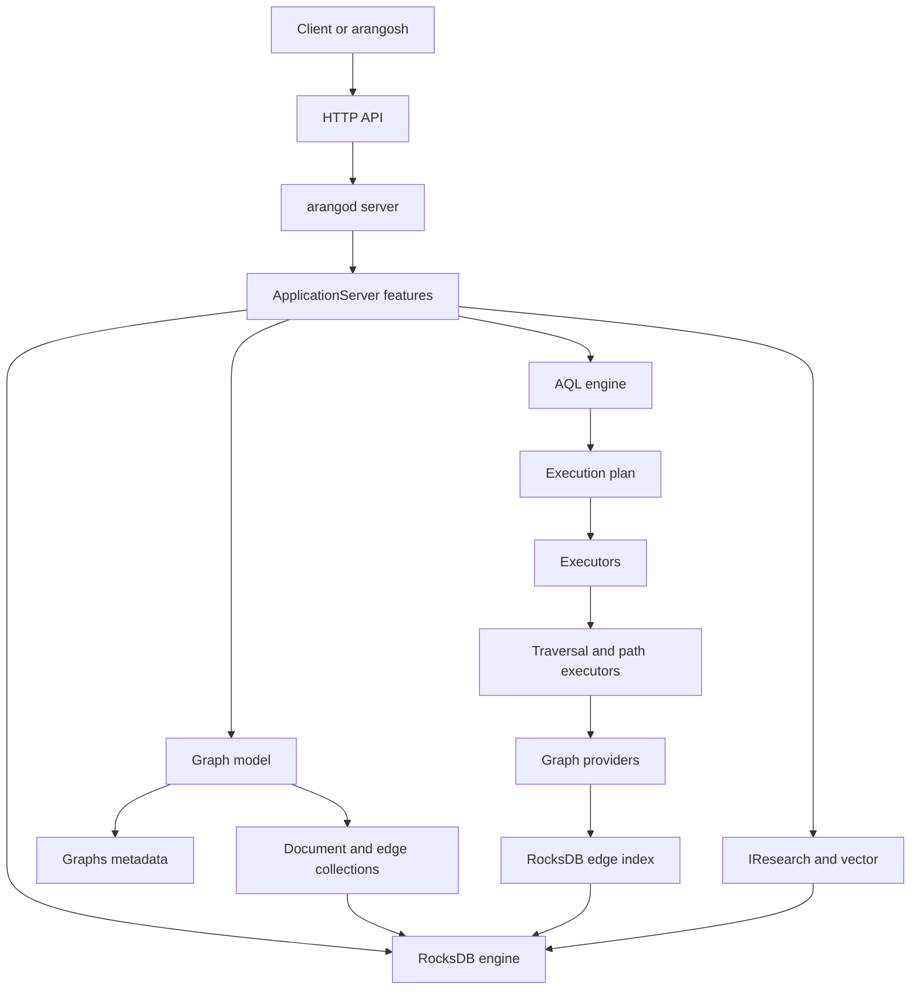
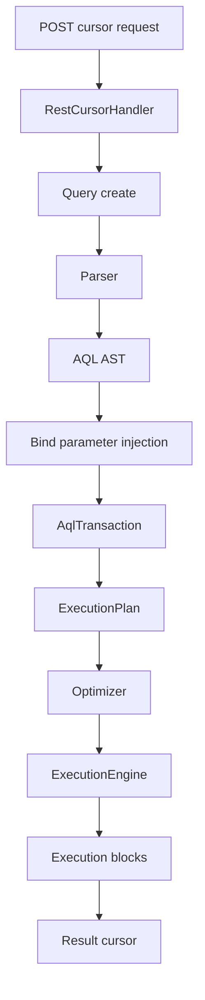
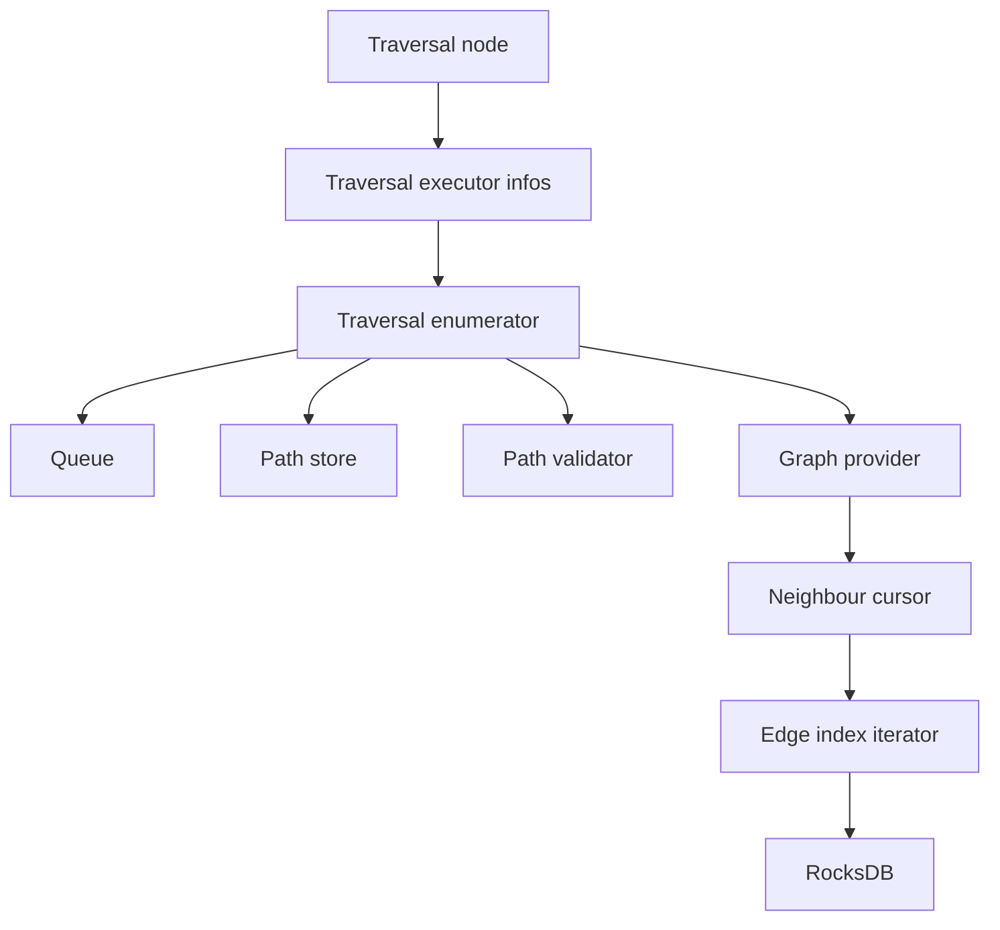
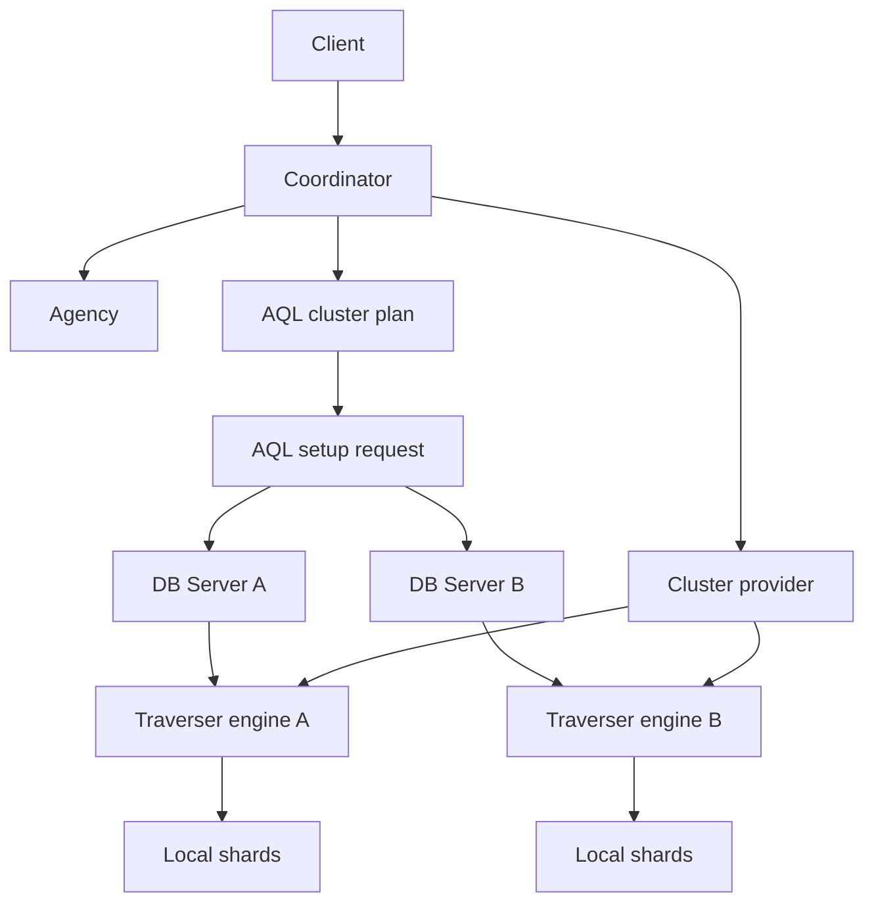

# ArangoDB 코드 레벨 분석

## 분석 기준

- 대상 저장소: [arangodb/arangodb](https://github.com/arangodb/arangodb)
- 로컬 클론: `.repos/arangodb`
- 분석 커밋: `90f0f238a` (`devel`, 2026-06-08)
- 버전 파일: `ARANGO-VERSION` = `3.12.10-devel`
- 분석일: 2026-06-09

ArangoDB는 “그래프 전용 엔진”이라기보다 C++ 기반 multi-model DBMS 위에 graph 모델, AQL graph 연산, edge index, 분산 query 실행을 통합한 시스템이다. vertex는 일반 document collection에 저장되고, edge는 `_from`, `_to` 시스템 속성을 가진 edge collection에 저장된다. named graph는 `_graphs` 시스템 컬렉션에 저장되는 메타데이터이며, 실제 graph traversal 성능은 RocksDB edge index와 AQL graph executor가 좌우한다.

라이선스 관점에서는 현재 `devel` 소스가 Business Source License 1.1이다. `LICENSE` 파일은 “not an Open Source license”라고 명시하며, release date 이후 4년 anniversary에 Apache License 2.0으로 전환되는 구조다. 따라서 3.12 이후 ArangoDB는 “소스 공개 source-available DB”로 보는 것이 정확하다.

## 프로젝트 개요

ArangoDB가 해결하려는 문제는 graph, document, key-value, search, vector를 별도 시스템으로 조합하지 않고 하나의 storage engine과 하나의 query language로 다루는 것이다. GraphDB 관점에서는 다음 문제를 직접 겨냥한다.

- JSON 문서와 관계 데이터를 같은 transaction 및 query 안에서 함께 다루기
- variable-length traversal, shortest path, k-shortest paths, weighted traversal을 AQL 내부 연산으로 제공하기
- edge가 많은 graph에서 `_from` 또는 `_to` 기준 이웃 탐색을 빠르게 수행하기
- cluster에서 graph traversal을 Coordinator와 DB-Server로 분산 실행하기
- graph, search, vector를 함께 쓰는 GraphRAG 또는 contextual data platform 형태의 워크로드를 수용하기

공식 문서는 ArangoDB를 graph, document, key-value, search, vector needs를 하나의 core로 처리하는 database로 설명하고, AQL을 composable query language로 둔다. 현재 3.12 문서 기준으로 vector index도 포함되어 있지만, graphDB 핵심은 여전히 edge collection, AQL graph query, RocksDB edge index, cluster traversal이다.

## 핵심 특징 및 차별점

| 축 | ArangoDB 구현 방식 | 엔지니어링 의미 |
|---|---|---|
| Graph 저장 | vertex는 document collection, edge는 `_from`, `_to`를 가진 edge collection | 별도 graph store가 아니라 document store 위에 graph 모델을 얹는다 |
| Query language | AQL 하나로 CRUD, join, traversal, shortest path, search, vector query를 조합 | Cypher 중심 GraphDB보다 multi-model query 조합이 강하다 |
| Edge lookup | edge collection 생성 시 `_from`, `_to` RocksDB edge index 자동 생성 | traversal의 이웃 확장은 index point 또는 range lookup 중심 |
| Execution engine | `ExecutionNode`와 `Executor`가 분리된 pull 기반 pipeline | traversal도 AQL physical plan의 일부로 실행된다 |
| Cluster | Coordinator가 query plan fragment와 traverser engine을 DB-Server에 배치 | graph traversal이 네트워크 왕복과 shard locality에 민감하다 |
| Enterprise 확장 | SmartGraph, EnterpriseGraph, SatelliteGraph hook이 `USE_ENTERPRISE`로 분기 | 공개 tree에는 hook은 있으나 Enterprise 구현 파일은 포함되지 않는다 |
| Search/vector | IResearch, vector index feature가 같은 server feature graph에 등록 | graph-only DB보다 GraphRAG 결합에 유리하다 |

## 전체 아키텍처

핵심 모듈은 다음과 같이 나뉜다.

| 영역 | 주요 경로 | 역할 |
|---|---|---|
| 서버 부트스트랩 | `arangod/RestServer/arangod.cpp` | `ApplicationServer` feature 등록, `RocksDBEngine`, `AqlFeature`, `ClusterFeature`, `IResearchFeature`, `VectorIndexFeature` 조립 |
| AQL parser | `arangod/Aql/Parser/grammar.y`, `tokens.ll`, `Parser.cpp` | AQL 문자열을 AST로 변환 |
| AQL query lifecycle | `arangod/Aql/Query.cpp` | parse, bind parameter injection, transaction 생성, optimizer, execution engine instantiate, execute |
| AQL physical plan | `arangod/Aql/ExecutionNode/*`, `arangod/Aql/Executor/*` | logical node와 runtime executor 분리 |
| Graph metadata | `arangod/Graph/Graph.cpp`, `GraphManager.cpp`, `GraphOperations.cpp` | named graph 정의, `_graphs` persistence, edge definition 검증 |
| Traversal runtime | `arangod/Graph/Providers/*`, `Enumerators/*`, `PathManagement/*`, `Cursors/*` | single-server 및 cluster graph expansion |
| Edge index | `arangod/RocksDBEngine/RocksDBEdgeIndex.cpp` | `_from`, `_to` 기반 RocksDB index, cache, iterator |
| Cluster | `arangod/Cluster/*`, `ClusterEngine/*`, `Agency/*` | Coordinator, DB-Server, Agency, shard metadata, maintenance |
| JS surface | `js/server/modules/@arangodb/general-graph.js`, `graph-classes.js` | arangosh/server-side JS graph API wrapper |
| Client tools | `client-tools/Shell/arangosh.cpp`, dump/import/export/backup | shell 및 운영 CLI |

## 서버 부트스트랩과 feature graph

`arangod/RestServer/arangod.cpp`의 `main()`은 `runServer()`를 호출하고, 실제 server composition은 `ArangodServer::addFeatures()`가 담당한다. 이 함수는 ArangoDB 내부 아키텍처를 읽는 가장 좋은 시작점이다.

주요 등록 순서:

- phase feature: `AgencyFeaturePhase`, `CommunicationFeaturePhase`, `AqlFeaturePhase`, `ClusterFeaturePhase`, `DatabaseFeaturePhase`, `ServerFeaturePhase`
- core feature: `metrics::MetricsFeature`, `ActionFeature`, `AgencyFeature`, `AqlFeature`, `AuthenticationFeature`, `ClusterFeature`, `DatabaseFeature`
- query/runtime: `QueryRegistryFeature`, `transaction::ManagerFeature`, `aql::AqlFunctionFeature`, `aql::OptimizerRulesFeature`
- storage/search/vector: `StorageEngineFeature`, `RocksDBOptionFeature`, `RocksDBRecoveryManager`, `iresearch::IResearchAnalyzerFeature`, `iresearch::IResearchFeature`, `VectorIndexFeature`, `ClusterEngine`, `RocksDBEngine`
- enterprise conditional: `AuditFeature`, `LicenseFeature`, `RCloneFeature`, `HotBackupFeature`, `EncryptionFeature`, `SslServerFeatureEE`

중요한 설계 포인트는 각 subsystem이 전역 singleton처럼 직접 엮이는 대신 feature dependency graph로 조립된다는 점이다. 예를 들어 `RocksDBEngine`은 `RocksDBOptionFeature`, metrics, database path, vector index feature, flush feature, scheduler, replicated log feature, recovery manager, database feature, cache manager, agency를 인자로 받아 생성된다. 이는 storage engine이 standalone component가 아니라 cluster, replication, vector index, cache, dump limit과 강하게 통합되어 있음을 보여준다.

## 데이터 모델과 저장 구조

### Document, Edge, Named Graph

ArangoDB의 graph는 세 계층으로 나뉜다.

1. document collection: vertex 저장
2. edge collection: `_from`, `_to` 속성으로 vertex document ID를 참조
3. named graph metadata: `_graphs` 시스템 컬렉션에 edge definitions, orphan collections, shard 설정 등을 저장

`arangod/Graph/Graph.cpp`는 graph 객체를 persistence slice 또는 user input에서 생성한다. persistence에서 읽을 때는 `_key`, `_rev`, `edgeDefinitions`, `orphanCollections`, satellite 설정을 파싱한다. user input에서 만들 때는 graph name, edge definitions, numberOfShards, replicationFactor 등을 검증한다.

`arangod/Graph/GraphManager.cpp`는 named graph 생성 시 필요한 collection을 찾거나 만든다. `findOrCreateCollectionsByEdgeDefinition()`은 edge collection이 실제 edge collection인지 확인하고, from/to vertex collection의 존재 여부와 sharding compatibility를 검증한 뒤 필요한 collection을 생성한다.

`arangod/Graph/GraphOperations.cpp`는 이미 생성된 graph의 edge definition 변경, 삭제, vertex collection 추가/삭제 같은 mutating API를 담당한다. 이때 graph definition 업데이트와 collection drop 여부가 같은 transaction 경계에서 다뤄진다.

### RocksDB key layout

ArangoDB는 RocksDB column family를 데이터 종류별로 나눈다. `arangod/RocksDBEngine/RocksDBKeyBounds.cpp`를 보면 `RocksDBEntryType::EdgeIndexValue`는 `RocksDBColumnFamilyManager::Family::EdgeIndex`에 매핑된다. `RocksDBKey.cpp`는 document, primary index, edge index, vector index 등의 key construction 함수를 제공한다.

edge index는 단순히 `_from -> edge document`만 저장하는 것이 아니라 방향별로 두 개의 index를 둔다.

- from index: `_from` 기준으로 outgoing edge 조회
- to index: `_to` 기준으로 incoming edge 조회

`RocksDBIndexFactory::fillSystemIndexes()`는 모든 collection에 primary index를 만들고, collection type이 edge이면 `IndexId::edgeFrom()`과 `IndexId::edgeTo()`를 가진 `RocksDBEdgeIndex` 두 개를 자동 생성한다. `EdgeIndexFactory::normalize()`는 사용자가 edge index를 직접 만들려고 하면 forbidden을 반환한다. 즉 edge index는 user-defined secondary index가 아니라 edge collection의 system index다.

`RocksDBEdgeIndex::insert()`의 동작은 다음과 같다.

- document에서 `_from` 또는 `_to` 방향 속성을 읽는다.
- `constructEdgeIndexValue(objectId, fromToRef, documentId)`로 RocksDB key를 만든다.
- value에는 반대쪽 vertex id를 `RocksDBValue::EdgeIndexValue()`로 저장한다.
- transaction state에 index insert hash를 기록한다.
- edge cache가 켜져 있으면 해당 vertex id의 cache entry를 invalidate한다.

이 설계의 장점은 traversal에서 현재 vertex id로 edge index 범위를 바로 seek할 수 있다는 점이다. 단점은 edge 자체가 document이므로 graph-native adjacency store보다 indirection이 많고, path output에서 edge/vertex document를 materialize할 때 document lookup 비용이 추가될 수 있다는 점이다.

## AQL 실행 파이프라인

외부 query는 보통 `POST /_api/cursor`로 들어온다. `arangod/RestHandler/RestCursorHandler.cpp`의 `registerQueryOrCursor()`는 request body에서 `query`, `bindVars`, `options`를 읽고 `aql::Query::create()`를 호출한다. streaming cursor면 `CursorRepository::createQueryStream()`으로 넘기고, 일반 cursor면 query를 등록한 뒤 `processQuery()`로 실행한다.

`arangod/Aql/Query.cpp`의 lifecycle:

1. `prepareQuery()`
   - query plan cache hit 여부를 확인한다.
   - cache miss면 `init()`, `preparePlan()` 실행.
   - plan을 serialized VPack으로 보관하고 profile에 기록한다.
   - `ExecutionEngine::instantiateFromPlan()`으로 physical blocks 생성.
2. `preparePlan()`
   - `Parser parser(...); parser.parse();`
   - bind parameter를 AST에 두 단계로 주입한다.
   - graph node에 implicit vertex collections를 추가한다.
   - `AqlTransaction::create()`로 query collection set에 맞는 transaction을 만든다.
   - AST validation 및 optimization을 수행한다.
   - transaction begin.
   - `ExecutionPlan::instantiateFromAst()`로 logical plan 생성.
   - `Optimizer::createPlans()` 후 best plan 선택.
   - var usage, plan cache eligibility, register plan 등을 확정한다.
3. `execute()`
   - result builder를 열고 root `ExecutionEngine`을 가져온다.
   - `engine->execute(defaultStack)`를 반복 호출한다.
   - `WAITING`은 coroutine 또는 sync wrapper가 처리하고, block이 끝나면 result cursor로 반환한다.

이 구조에서 graph traversal은 특별한 외부 subsystem 호출이 아니라 AQL physical plan 안의 `TraversalNode -> TraversalExecutor`로 실행된다.

## Graph query internals

### TraversalNode

`arangod/Aql/ExecutionNode/TraversalNode.cpp`는 AQL traversal 구문을 physical executor로 바꾸는 핵심 파일이다.

주요 책임:

- start vertex가 `_id` 문자열인지 input variable인지 해석
- traversal direction별 `_from`, `_to` condition 생성
- edge collection 및 vertex collection validation
- `PRUNE`, post-filter, depth-specific filter를 `PathValidatorOptions`에 연결
- output variable 사용 여부에 따라 vertex, edge, path register mapping 생성
- single-server와 Coordinator 실행 경로를 분기
- `ExecutionBlockImpl<TraversalExecutor>` 생성

`TraversalNode::createBlock()`은 서버 역할을 기준으로 두 종류 provider option을 만든다.

- Coordinator: `getClusterBaseProviderOptions()` 후 `TraversalExecutorInfos(... ClusterBaseProviderOptions ...)`
- SingleServer 또는 DB-Server: `getSingleServerBaseProviderOptions()` 후 `TraversalExecutorInfos(... SingleServerBaseProviderOptions ...)`

Enterprise build에서는 `isSmart()`이고 disjoint가 아니면 SmartGraph provider로 분기하는 hook이 있다. 공개 tree에서는 `USE_ENTERPRISE` guard와 include 경로만 보이고 실제 `Enterprise/Graph/*` 파일은 포함되어 있지 않다.

### TraversalExecutor

`arangod/Aql/Executor/TraversalExecutor.cpp`는 runtime traversal loop다.

`TraversalExecutorInfos::parseTraversalEnumeratorSingleServer()`와 `parseTraversalEnumeratorCluster()`는 traversal option을 실제 enumerator로 바꾼다.

- `order: dfs` -> DFS enumerator
- `order: bfs` -> BFS enumerator
- `order: weighted` -> weighted enumerator
- `uniqueVertices`, `uniqueEdges` -> template instantiation 선택
- `weightAttribute`, `defaultWeight` -> edge weight callback 설정
- negative weight -> `TRI_ERROR_GRAPH_NEGATIVE_EDGE_WEIGHT`

`TraversalExecutor::produceRows()`는 result output row가 찰 때까지 다음 path를 꺼낸다. enumerator가 끝났으면 `initTraverser()`가 input row에서 새 start vertex를 읽고, `_id` 형식이 아니면 warning을 기록한다. 정상 start vertex면 index expression을 준비하고 enumerator를 reset한다.

### Enumerator와 provider

`arangod/Graph/algorithm-aliases.h`는 traversal algorithm을 template alias로 조립한다.

- `BFSEnumerator`: `OneSidedEnumerator` + FIFO queue
- `DFSEnumerator`: `OneSidedEnumerator` + LIFO queue
- `WeightedEnumerator`: `OneSidedEnumerator` + weighted priority queue
- `ShortestPathEnumerator`: two-sided enumerator + global vertex uniqueness
- `WeightedShortestPathEnumerator`: weighted shortest path용 bidirectional search
- `YenEnumerator`: k-shortest paths 계열

`OneSidedEnumerator.cpp`는 traversal의 공통 loop를 갖는다. 핵심은 다음 순서다.

1. queue에서 다음 step pop
2. cluster이고 vertex가 fetch되지 않았으면 provider가 vertex fetch
3. path store에 step append
4. path validator로 filter/prune/uniqueness 검사
5. min depth 이상이면 result list에 추가
6. max depth 미만이고 prune되지 않았으면 neighbour cursor 또는 provider expansion으로 다음 step enqueue

이 구조는 graph algorithm을 provider-agnostic하게 유지한다. single-server provider와 cluster provider가 동일 enumerator interface를 만족하기 때문에 algorithm layer는 저장 위치를 상대적으로 덜 의식한다.

## Single-server traversal

`arangod/Graph/Providers/SingleServerProvider.cpp`는 local transaction을 갖고 edge/vertex lookup을 직접 수행한다.

주요 객체:

- `_trx`: `queryContext.newTrxContext()`로 만든 transaction methods
- `_vertexLookup`: vertex document materialization 및 projection
- `_edgeLookup`: edge document materialization
- `_neighbours`: `SingleServerNeighbourProvider`
- `_cache`: traversal 중 vertex string lifetime 및 lookup cache

`SingleServerProvider::expand()`는 현재 step의 vertex를 기준으로 neighbour cursor를 rearm하고, batch별 neighbour edge를 읽어 반대쪽 vertex id를 계산한다. edge slice가 string이면 이미 opposite vertex id만 가진 fast path이고, object이면 `_from`, `_to`에서 현재 vertex와 다른 쪽을 추출한다.

`arangod/Graph/Cursors/SingleServerEdgeCursor.cpp`의 `LookupInfo::rearmVertex()`가 중요한 성능 포인트다.

- 기존 index iterator가 `canRearm()`이면 조건의 vertex literal만 바꾸고 재사용한다.
- rearm이 불가능하면 `trx->indexScanForCondition()`으로 새 iterator를 만든다.
- `_from`, `_to` projection을 edge index가 cover할 수 있으면 full edge document를 읽지 않고 opposite endpoint를 얻는다.
- traversal option의 `useCache`를 index iterator options로 넘긴다.

즉 single-server traversal은 매 step마다 새 query를 만드는 방식이 아니라, `_from` 또는 `_to` 조건 AST를 mutable하게 갱신하고 index cursor를 가능한 재사용한다.

## Cluster traversal

공식 cluster 문서는 ArangoDB cluster가 Agents, Coordinators, DB-Servers로 구성된다고 설명한다. Agency는 Raft 기반 configuration store이고, Coordinators는 stateless query coordinator, DB-Servers는 shard leader/follower를 호스팅한다.

코드에서 이 구조는 다음 경로에 드러난다.

- `arangod/Agency/*`: Agency state, supervision, jobs
- `arangod/Cluster/ClusterFeature.cpp`, `ClusterInfo.cpp`: cluster metadata, server/shard 정보
- `arangod/ClusterEngine/*`: Coordinator 관점의 collection/index/transaction abstraction
- `arangod/Aql/RestAqlHandler.cpp`: internal AQL setup, snippets, traverser engines
- `arangod/Cluster/TraverserEngine.cpp`: DB-Server side traverser engine
- `arangod/Graph/Providers/ClusterProvider.cpp`: Coordinator side graph provider

`RestAqlHandler::setupClusterQuery()`는 DB-Server 전용 internal route다. request body에는 lock info, query options, plan snippets, traverser engines, variables, bind parameters가 들어온다. Coordinator는 query plan을 fragment로 쪼개 DB-Server에 setup하고, 이후 `RemoteExecutor` 및 cluster provider를 통해 데이터를 가져온다.

`ClusterProvider::fetchVerticesFromEngines()`는 loose-end vertex를 DB-Server별 traverser engine에 `PUT` 요청으로 전달하고, 응답 payload를 cache/datalake에 보존한다. `destroyEngines()`는 Coordinator가 query 종료 시 internal traverser engine을 삭제한다. 이 때문에 cluster traversal은 다음 특성을 갖는다.

- shard locality가 좋으면 DB-Server 내부 edge index lookup으로 빠르게 확장된다.
- shard가 흩어지면 Coordinator와 DB-Server 사이의 HTTP round-trip 및 payload retention 비용이 커진다.
- SmartGraph, OneShard 같은 Enterprise 또는 deployment-level 기능은 이 network hop을 줄이는 방향의 최적화다.

## Graph API와 인터페이스

| 인터페이스 | 코드 경로 | 설명 |
|---|---|---|
| AQL traversal | `Aql/Parser/grammar.y`, `TraversalNode.cpp` | `FOR v,e,p IN ... GRAPH ...` 구문 |
| AQL shortest path | `ShortestPathNode`, `ShortestPathExecutor`, graph enumerators | `SHORTEST_PATH`, k-shortest paths 계열 |
| REST cursor | `RestCursorHandler.cpp` | 외부 AQL query endpoint |
| Internal AQL | `RestAqlHandler.cpp` | cluster fragment setup 및 execution |
| JS graph module | `js/server/modules/@arangodb/general-graph.js` | `_create`, `_drop`, `_graph`, `_list` wrapper |
| JS graph classes | `js/server/modules/@arangodb/graph-classes.js` | `GeneralGraph` API, Enterprise class fallback |
| arangosh | `client-tools/Shell/arangosh.cpp` | V8 shell feature로 server JS API 사용 |
| Foxx | `js/server/modules/@arangodb/foxx/*` | DB 내장 JS microservice framework |

JS graph layer는 legacy traversal engine을 들고 있지 않다. 3.12 incompatible changes 문서는 오래된 JavaScript traversal module 제거를 언급한다. 현재 코드에서도 graph API는 metadata and collection management wrapper에 가깝고, traversal의 핵심 실행은 C++ AQL executor에 있다.

## Search, vector, GraphRAG 관점

ArangoDB 3.12는 graph-only DB가 아니라 graph plus search plus vector 방향으로 진화 중이다.

코드에서 확인되는 요소:

- `arangod/IResearch/*`: ArangoSearch view, inverted index, analyzers, filter factory, RocksDB link
- `arangod/VectorIndex/*`: vector index feature, build manager, training sampler
- `arangod/RocksDBEngine/RocksDBVectorIndex*`: RocksDB-backed vector index implementation
- `3rdParty/faiss`: vector index의 기반 라이브러리
- `Aql/ExecutionNode/EnumerateNearVectorNode.*`, `Executor/EnumerateNearVectorExecutor.*`: AQL vector search physical node

공식 문서 기준 vector index는 v3.12.4에서 도입되었고 Faiss를 사용한다. 코드 기준으로도 vector index는 `RocksDBIndexFactory`에 `"vector"` type으로 등록되며, `RocksDBEngine` 생성 시 `VectorIndexFeature`가 주입된다.

GraphRAG 시스템에서 ArangoDB의 실용적 포지션은 “그래프 DB + 검색엔진 + 벡터 DB를 한 제품 안에서 조합”하는 것이다. 다만 개별 기능의 최고 성능만 놓고 보면 dedicated vector DB, dedicated search engine, native graph engine 각각보다 전문성이 낮을 수 있다.

## Pregel 및 graph analytics

공식 문서에는 Pregel 기반 distributed iterative graph processing이 설명되어 있고 PageRank, centrality, connected components 같은 알고리즘 사용을 언급한다. 그러나 2026-06-09에 클론한 `arangodb/arangodb` `devel` tree에서는 `arangod/Pregel` 같은 C++ 구현 모듈이 보이지 않았다. 검색 결과는 `CHANGELOG`, `OpenAPI`, web UI API docs, upgrade task residue 정도다.

따라서 이 문서에서는 Pregel을 두 층으로 분리해 해석한다.

- 제품 기능 문맥: 공식 문서와 API 문서에는 graph analytics 기능으로 존재한다.
- 현재 공개 소스 분석 문맥: 분석한 tree에서는 구현 코드를 따라갈 수 없으므로 traversal/path query internals와 같은 깊이로 코드 레벨 분석하지 않았다.

## 기술 스택

| 영역 | 기술 |
|---|---|
| Core language | C++ |
| Server runtime | `ApplicationServer` feature framework, custom async/futures, scheduler |
| Query | AQL parser with flex/bison style grammar, AST, optimizer, execution blocks |
| Storage | RocksDB, multiple column families, VelocyPack binary format |
| Serialization | VelocyPack |
| Search | IResearch and ArangoSearch |
| Vector | Faiss, RocksDB vector index column family |
| Scripting | V8, server-side JS, arangosh, Foxx |
| Cluster | Agency, Raft-based coordination, Coordinator, DB-Server, synchronous replication |
| Build | CMake, bundled third-party dependencies |
| Client and tooling | arangosh, arangodump, arangorestore, arangoimport, arangoexport, arangobench |

## 확장성 및 플러그인 구조

ArangoDB의 확장 포인트는 plugin marketplace 같은 구조가 아니라 내부 feature, index factory, JS runtime, analyzers 중심이다.

- `ApplicationFeature`: 서버 subsystem을 등록하고 startup/shutdown lifecycle을 제어한다.
- `IndexFactory`: storage engine별 index type registration을 담당한다. RocksDB factory는 edge, fulltext, geo, persistent, primary, ttl, mdi, vector, inverted index를 등록한다.
- `AqlFunctionFeature`: AQL built-in 또는 user function registration의 중심이다.
- `OptimizerRulesFeature`: optimizer rule registration과 rule option 관리를 담당한다.
- `IResearchAnalyzerFeature`: analyzer 등록과 persistence를 담당한다.
- `V8` 및 `Foxx`: server-side JS 확장과 HTTP service 작성 surface를 제공한다.

코드 수정 관점에서 새로운 storage-backed index를 추가하려면 `Index` subclass, RocksDB key/value layout, iterator, factory normalize/instantiate, optimizer support, AQL node 또는 function integration까지 여러 계층을 건드려야 한다. 반면 application-level 확장은 Foxx나 JS module이 상대적으로 낮은 진입 비용을 제공한다.

## 성능 특성

### 강점

- `_from`, `_to` edge index가 system index로 자동 생성되어 기본 traversal lookup path가 명확하다.
- `SingleServerEdgeCursor`가 index iterator rearm을 지원해 반복 traversal에서 cursor allocation을 줄인다.
- edge index covering으로 opposite endpoint만 필요할 때 full edge document materialization을 피할 수 있다.
- `PRUNE` 및 일부 filter condition은 `TraversalNode`와 `PathValidator` 단계에서 조기 pruning으로 내려간다.
- AQL optimizer와 query plan cache가 일반 query와 graph query를 같은 pipeline에서 다룬다.
- cluster에서는 query fragment, traverser engine, remote executor로 실행을 분산할 수 있다.

### 제약

- graph-native adjacency store가 아니라 RocksDB document/index model 위에서 graph를 실행하므로 deep traversal은 index lookup, document materialization, path store memory pressure에 민감하다.
- cluster graph traversal은 shard locality가 나쁘면 Coordinator와 DB-Server 간 네트워크 비용이 커진다.
- global uniqueness, weighted traversal, path output은 queue와 path store 메모리 사용량을 키운다.
- Enterprise SmartGraph/Disjoint/Satellite 관련 최적화 hook은 공개 tree에서 구현 세부를 볼 수 없다.
- 공식 cluster limitation 문서는 shard 수가 매우 커질 경우 maintenance 비용이 커지고, 총 shard 수가 약 50,000을 넘지 않는 것이 좋다고 설명한다.

## 배포 및 운영 관점

`arangod`는 single server와 cluster role을 모두 수행하는 central server binary다. cluster에서는 역할이 나뉜다.

- Agent: Agency 구성원, Raft 기반 cluster configuration store
- Coordinator: client-facing stateless node, query planning and coordination
- DB-Server: shard leader/follower 보유, local storage와 query fragment 실행

운영 구성은 ArangoDB Starter, Docker, Kubernetes Operator, managed platform으로 갈 수 있다. 코드 관점에서는 역할별 binary가 완전히 분리된 것이 아니라 `ServerState`, startup options, feature activation에 따라 같은 `arangod`가 다른 role로 동작한다.

## 경쟁 및 비교

| 시스템                 | 핵심 모델                           | Query            | Storage                            | ArangoDB 대비                                                        |
| ------------------- | ------------------------------- | ---------------- | ---------------------------------- | ------------------------------------------------------------------ |
| Neo4j               | native property graph           | Cypher           | native graph store                 | graph query ecosystem은 강하지만 document/search/vector 통합은 별도 조합 필요    |
| Memgraph            | in-memory first property graph  | Cypher           | memory plus durability             | low-latency graph analytics에 강하나 multi-model document DB는 아님       |
| Dgraph              | distributed graph               | GraphQL-like DQL | LSM 기반 분산 저장                       | scale-out graph에 집중, ArangoDB보다 document/search/vector 조합 폭은 좁음    |
| JanusGraph          | graph layer                     | Gremlin          | Cassandra/HBase/Bigtable 등 backend | backend 선택 유연, 단일 제품 통합성은 ArangoDB가 높음                             |
| Kuzu                | embedded analytical graph       | Cypher           | columnar graph                     | local analytics와 embedding에 강함, server DBMS와 multi-model은 약함       |
| SurrealDB           | multi-model                     | SurrealQL        | Rust storage layer                 | multi-model 경쟁자이나 ArangoDB가 graph traversal와 cluster history가 더 길다 |
| PostgreSQL plus AGE | relational plus graph extension | SQL and Cypher   | relational heap/index              | 기존 RDBMS 통합은 좋지만 variable-depth graph 실행은 전용 DB보다 제한적              |

ArangoDB의 차별점은 native graph claim 자체보다 “AQL 안에서 graph traversal, JSON document query, full-text search, vector search를 같은 execution pipeline에 놓는다”는 점이다. 반대로 graph-only query ergonomics와 graph algorithm specialization만 보면 Neo4j, Memgraph, Kuzu 같은 시스템이 더 단순하고 집중적일 수 있다.

## 종합 평가

### 적합한 경우

- graph와 document가 둘 다 first-class인 서비스
- traversal 결과를 JSON aggregation, search, geo, vector 조건과 함께 조합해야 하는 워크로드
- 운영상 DB 제품 수를 줄이고 싶은 팀
- AQL을 중심으로 API, shell, internal service를 통일하고 싶은 팀
- moderate-to-large graph를 cluster에서 운영하되 SmartGraph/OneShard 같은 locality 전략을 설계할 수 있는 경우

### 부적합한 경우

- Cypher ecosystem과 graph data science tooling이 최우선인 경우
- ultra-deep traversal이나 graph algorithm만을 위한 native graph store가 필요한 경우
- source-available BSL 라이선스를 사용할 수 없는 조직
- shard locality를 보장하기 어려운 고분산 graph에서 low-latency traversal이 필요한 경우
- embedded graph analytics DB가 필요한 경우

### 엔지니어 관점 인사이트

ArangoDB graph engine의 본질은 “edge index driven traversal executor”다. named graph는 metadata abstraction이고, graph query의 실제 성능은 다음 세 가지에 걸린다.

1. edge collection의 `_from` 또는 `_to` index lookup이 얼마나 selective한가
2. traversal filter와 prune이 얼마나 일찍 provider 또는 validator 단계로 내려가는가
3. cluster에서 start vertex와 edge shards가 얼마나 같은 DB-Server에 머무르는가

코드 구조는 비교적 성숙하지만 단순하지 않다. `Query.cpp`, `TraversalNode.cpp`, `TraversalExecutor.cpp`, provider/enumerator template, RocksDB index가 모두 맞물려야 하나의 traversal이 실행된다. ArangoDB를 채택하거나 튜닝하는 엔지니어는 AQL 문법보다 execution plan과 edge index access pattern을 먼저 봐야 한다.

## 코드 읽기 가이드

처음 코드를 따라간다면 아래 순서가 효율적이다.

1. `arangod/RestServer/arangod.cpp`
   - server feature가 어떻게 조립되는지 확인한다.
2. `arangod/Aql/Query.cpp`
   - AQL query lifecycle을 확인한다.
3. `arangod/Aql/ExecutionPlan.cpp`
   - AST가 physical plan node로 바뀌는 방식을 확인한다.
4. `arangod/Aql/ExecutionNode/TraversalNode.cpp`
   - graph traversal plan node 생성과 register mapping을 확인한다.
5. `arangod/Aql/Executor/TraversalExecutor.cpp`
   - runtime traversal loop를 확인한다.
6. `arangod/Graph/algorithm-aliases.h`
   - BFS, DFS, weighted, shortest path 조립 방식을 확인한다.
7. `arangod/Graph/Providers/SingleServerProvider.cpp`
   - local traversal provider를 확인한다.
8. `arangod/Graph/Cursors/SingleServerEdgeCursor.cpp`
   - edge index cursor rearm과 covering lookup을 확인한다.
9. `arangod/RocksDBEngine/RocksDBEdgeIndex.cpp`
   - edge index key/value, cache, iterator를 확인한다.
10. `arangod/Graph/Providers/ClusterProvider.cpp`
    - cluster traversal의 network fetch와 engine cleanup을 확인한다.
11. `arangod/Aql/RestAqlHandler.cpp`
    - DB-Server query snippet setup을 확인한다.
12. `arangod/Graph/GraphManager.cpp`
    - named graph metadata와 collection lifecycle을 확인한다.

## 참고 자료

- [arangodb/arangodb GitHub repository](https://github.com/arangodb/arangodb)
- [ArangoDB database system overview](https://docs.arango.ai/arangodb/)
- [ArangoDB features and capabilities](https://docs.arango.ai/arangodb/3.12/features/)
- [Graphs in ArangoDB](https://docs.arango.ai/arangodb/3.12/graphs/)
- [Graph traversals in AQL](https://docs.arango.ai/arangodb/3.12/aql/graph-queries/traversals/)
- [Shortest Path in AQL](https://docs.arango.ai/arangodb/stable/aql/graph-queries/shortest-path/)
- [ArangoDB cluster deployments](https://docs.arango.ai/arangodb/stable/deploy/cluster/)
- [ArangoDB cluster limitations](https://docs.arango.ai/arangodb/stable/deploy/cluster/limitations/)
- [OneShard cluster deployments](https://docs.arango.ai/arangodb/3.11/deploy/oneshard/)
- [Vector indexes](https://docs.arango.ai/arangodb/stable/indexes-and-search/indexing/working-with-indexes/vector-indexes/)
- [ArangoDB 3.12 incompatible changes](https://docs.arango.ai/arangodb/3.12/release-notes/version-3.12/incompatible-changes-in-3-12/)
- [ArangoDB licensing model change announcement](https://arangodb.com/2023/10/evolving-arangodbs-licensing-model-for-a-sustainable-future/)
