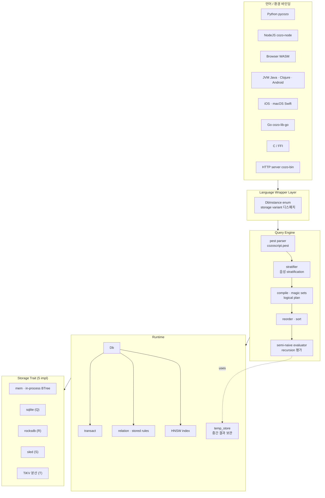
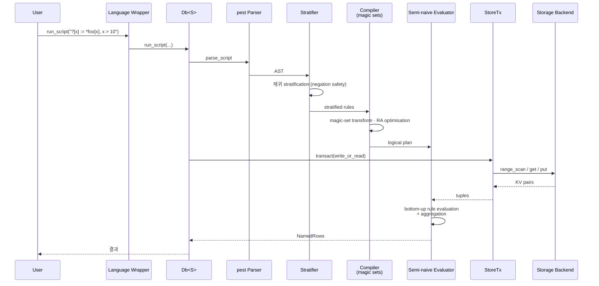

# CozoDB 심층 분석 — Datalog 기반 임베드 가능 그래프-관계 하이브리드 DB

> 분석 대상: [cozodb/cozo](https://github.com/cozodb/cozo) (`v0.7.6`, `main` 기준)
> 분석 시점: 2026-04-28
> 분석 관점: 그래프 DB·임베드 DB·메모리 시스템을 직접 다루는 SWE의 시각

---

## TL;DR

CozoDB는 "Datalog로 쿼리하는 임베드 가능한 관계형+그래프+벡터 하이브리드 DB"라는 한 줄 명제를 끝까지 밀어붙인 Rust 프로젝트다. 비교 대상이 흔히 SQLite·Neo4j·Pinecone으로 갈라지는 영역을 **단일 엔진 + 단일 쿼리 언어**로 통합한다.

핵심 정체성 4가지:

1. **Datalog (CozoScript)가 1차 쿼리 언어** — Cypher도 SQL도 아님. 재귀·그래프 알고리즘이 자연스럽게 표현되고, 규칙(rule)이 함수처럼 컴포저블.
2. **Storage trait으로 backend 자유 선택** — In-memory · SQLite · RocksDB · Sled · TiKV(분산). 같은 쿼리 엔진이 5가지 storage 위에서 동작.
3. **Time travel + HNSW + MinHash-LSH + FTS** — 최근 버전(v0.6, v0.7)에서 벡터 인덱스·근사중복검색·전문검색을 모두 Datalog 안에서 사용 가능하게 통합.
4. **WASM 포함 13개 환경** — Python/NodeJS/JVM/Android/iOS/Go/C/Rust/HTTP server/브라우저(WASM)/Lisp/Smalltalk/Clojure.

엔지니어 관점 핵심 인사이트: **"property-graph 모델을 일부러 거부하고 관계형(R)을 1차 데이터 모델로 둔 뒤, 그래프는 그 위에 얹은 view"**라는 디자인 결정. 이 한 결정이 OLTP/OLAP/그래프/벡터를 한 엔진에 욱여넣을 수 있게 만든다.

---

## 목차

1. [프로젝트 개요](#1-프로젝트-개요)
2. [핵심 특징과 차별점](#2-핵심-특징과-차별점)
3. [아키텍처 — 3계층 모델](#3-아키텍처--3계층-모델)
4. [기술 스택](#4-기술-스택)
5. [핵심 코드 분석 — 5개 모듈](#5-핵심-코드-분석--5개-모듈)
6. [CozoScript와 Datalog 의미론](#6-cozoscript와-datalog-의미론)
7. [Storage Trait — 5가지 백엔드](#7-storage-trait--5가지-백엔드)
8. [HNSW · MinHash-LSH · FTS · Time Travel](#8-hnsw--minhash-lsh--fts--time-travel)
9. [API · 임베딩 인터페이스](#9-api--임베딩-인터페이스)
10. [성능 특성](#10-성능-특성)
11. [강점·약점·적합 시나리오](#11-강점약점적합-시나리오)
12. [부록 — 디렉토리 맵 + 핵심 코드 위치](#12-부록--디렉토리-맵--핵심-코드-위치)

---

## 1. 프로젝트 개요

### 1.1 정의

> "CozoDB is a general-purpose, transactional, relational database that uses **Datalog** for query, is **embeddable** but can also handle huge amounts of data and concurrency, and focuses on **graph** data and algorithms."
> — `README.md:70-73`

핵심 키워드 5개를 풀면:

| 키워드 | 의미 |
|---|---|
| **general-purpose** | OLTP·OLAP·그래프·벡터를 한 엔진으로 |
| **transactional** | MVCC, multi-statement transaction |
| **relational** | 1차 데이터 모델은 관계형(R-model). Property graph 거부 |
| **Datalog** | 쿼리 언어 = CozoScript = Datalog 방언 |
| **embeddable** | 메인 프로그램과 같은 프로세스에서 동작. 단, server 모드도 지원 |

### 1.2 해결하려는 문제

| 문제 | CozoDB의 답 |
|---|---|
| "그래프 DB는 별도 인프라가 필요" | 임베드 → SQLite처럼 `pip install` 한 줄 |
| "Cypher는 재귀 표현이 어색" | Datalog의 native 재귀 |
| "벡터 검색은 별도 DB(Pinecone, Weaviate)" | HNSW 인덱스를 Datalog rule로 사용 |
| "그래프 알고리즘마다 별도 라이브러리(NetworkX, Spark GraphX)" | 캐닝된 fixed_rule (PageRank, Dijkstra, …) |
| "OLTP와 OLAP 분리" | 같은 storage에서 두 워크로드 처리 |
| "다양한 언어에서 같은 DB 쓰고 싶다" | 13개 환경 (Python/JVM/iOS/Android/WASM 등) 공식 바인딩 |

### 1.3 작가의 디자인 신념 (README에서 명시)

CozoDB README는 디자인 결정에 대해 **이례적으로 강한 의견**을 명시한다.

> "Most existing graph databases start by requiring you to shoehorn your data into the labelled-property graph model. We don't go this route because we think the **traditional relational model is much easier to work with for storing data, much more versatile**, and can deal with graph data just fine."
> — `README.md:95-100`

→ Property graph는 데이터 적재 모델로는 강제력이 너무 강하고 algebra(관계대수)만큼 컴포저블하지 않다는 진단. **모든 그래프는 관계 위의 view**라고 본다.

> "Datalog is also extremely composable: you can build your queries piece by piece … the monolithic approach taken by the SQL select-from-where in nested forms can sometimes read like golfing."
> — `README.md:104-117`

→ SQL의 `SELECT … FROM … WHERE … GROUP BY` 단일 블록의 가독성 한계를 지적. Datalog rule이 함수처럼 합성된다는 점이 우위라는 주장.

### 1.4 라이선스·커뮤니티

- **MPL-2.0**: copyleft (파일 단위), 상용 통합 가능
- 작가: Ziyang Hu(@ziyang-hu) 위주의 single-maintainer 프로젝트에 가까움
- v0.7.6 (분석 시점). v1.0 미만은 **API/storage 호환성 보장 안 함** (README.md:392)
- GitHub stars 4k+, niche but growing

---

## 2. 핵심 특징과 차별점

### 2.1 7대 특징

| # | 특징 | 비교 대상 |
|---|---|---|
| 1 | Datalog as primary query language | Neo4j Cypher, JanusGraph Gremlin, SQL DBs |
| 2 | Relational model (rows/tuples)이 1차 | Neo4j (property graph 1차) |
| 3 | Storage trait 추상화로 5가지 backend | Most embedded DBs lock storage |
| 4 | Time travel (per-relation opt-in) | TerminusDB, XTDB만 비슷 |
| 5 | HNSW 벡터 인덱스를 Datalog로 통합 | Pinecone/Weaviate는 별도 |
| 6 | Multi-platform (WASM 포함 13종) | DuckDB·SQLite 정도가 비슷 |
| 7 | TiKV로 분산 모드 가능 | 임베드 DB 중에는 거의 유일 |

### 2.2 "Compose-by-rule" Datalog의 위력

3-단계 그래프 도달성 쿼리를 SQL과 비교:

**Datalog (CozoScript)**:
```datalog
reachable[to] := *route{fr: 'FRA', to}
reachable[to] := reachable[stop], *route{fr: stop, to}
?[count_unique(to)] := reachable[to]
```

**SQL (recursive CTE)**:
```sql
WITH RECURSIVE reachable(to_) AS (
    SELECT to_ FROM route WHERE fr = 'FRA'
    UNION
    SELECT route.to_ FROM route JOIN reachable ON route.fr = reachable.to_
)
SELECT COUNT(DISTINCT to_) FROM reachable;
```

CozoScript는 두 rule을 분리할 수 있어서 **"reachable"이 그 자체로 재사용 가능한 view** — 다른 쿼리에서 그대로 호출 가능. SQL은 CTE 안에 갇혀서 항상 한 쿼리에 reinline.

### 2.3 R-model + 그래프 view라는 결정

CozoDB는 노드/엣지를 별도 1급 객체로 두지 않는다. 대신:

- 일반 관계 `*route{fr, to, distance}`이 곧 **edge list**
- 일반 관계 `*airport{code, name, country}`이 곧 **node properties**
- 그래프 알고리즘은 이 두 관계를 input으로 받는 fixed_rule

→ "데이터 모델을 단순화해서 모든 도구가 한 universe에서 작동"하는 SQLite-like 미니멀리즘. 단, property graph 도구(Bloom, Neo4j Browser, Gephi 직접 import 등)와의 호환성은 포기.

---

## 3. 아키텍처 — 3계층 모델

### 3.1 전체 그림



### 3.2 3계층의 책임

`README.md:316-385`:

> "CozoDB consists of three layers stuck on top of each other, with each layer only calling into the layer below"

| 계층 | 역할 |
|---|---|
| **Language/environment wrapper** | Rust API → 13개 언어 매핑. HTTP, WASM, FFI 포함. |
| **Query engine** | function/aggregation/algorithm 정의, 스키마, 트랜잭션, 컴파일, 실행. 코드의 70%+가 여기. |
| **Storage engine** | KV + range scan trait. 5개 구현체 + 사용자 정의 가능. |

각 layer가 **위 layer만 호출**하는 단방향 의존성을 강제 — `cozo-core/src/storage/mod.rs:31-52`의 trait 정의를 보면 storage에는 query 개념이 전혀 안 보인다. 매우 깨끗한 hexagonal 디자인.

### 3.3 데이터 흐름 — 한 쿼리의 생애



### 3.4 "관계형(R-model) 위의 그래프"라는 단일 universe

CozoDB는 다음 모든 데이터를 **하나의 관계 모델**로 표현한다:

- **노드** → `*airport{code, name}` 같은 관계
- **엣지** → `*route{fr, to, distance}` 같은 관계
- **벡터** → `*embeddings{id, vec: <F32; 768>}` 컬럼
- **HNSW 인덱스** → 내부적으로 또 다른 관계(proximity graph)
- **Time-travel relation** → `validity` 컬럼이 추가된 관계

→ 한 쿼리 안에서 그래프 traversal, 벡터 유사도, 시간 슬라이싱이 같은 unification으로 결합 가능.

---

## 4. 기술 스택

### 4.1 코어 의존성

`Cargo.toml`의 워크스페이스 멤버 10개:

| 멤버 | 역할 |
|---|---|
| `cozo-core` | 쿼리 엔진 + storage trait + runtime |
| `cozorocks` | RocksDB FFI 래퍼 (C++) |
| `cozo-bin` | HTTP server CLI |
| `cozo-lib-c` | C FFI |
| `cozo-lib-java` | JNI |
| `cozo-lib-wasm` | WebAssembly |
| `cozo-lib-swift` | Swift bridging |
| `cozo-lib-python` | PyO3 |
| `cozo-lib-nodejs` | N-API |
| `cozo-core-examples` | 사용 예제 |

### 4.2 핵심 외부 크레이트

`cozo-core/src/lib.rs`의 use 부분에서 추론:
- **pest** — 파서 (`cozoscript.pest` 275줄 PEG 문법)
- **miette** — 에러 리포트 (예쁜 출력)
- **crossbeam** — 동시성 채널
- **serde / serde_json** — 직렬화
- **rocksdb / sled / rusqlite / tikv-client** — 백엔드 옵션

### 4.3 빌드 시스템

- Rust workspace
- `cozorocks`만 C++ 빌드 (`opt-level=3`로 dev 모드에서도 강제 — `Cargo.toml:21`)
- WASM은 `wasm-pack` 기반
- 모바일은 각각 cross-compile

---

## 5. 핵심 코드 분석 — 5개 모듈

### 5.1 cozo-core/src 구조

| 모듈 | LoC | 역할 |
|---|---|---|
| `lib.rs` | 664 | `DbInstance` enum + 외부 API |
| `runtime/relation.rs` | 1473 | 관계 정의·CRUD·인덱스 |
| `runtime/db.rs` | (대) | `Db<S>` 본체, run_script 진입 |
| `runtime/transact.rs` | 136 | 트랜잭션 wrapper |
| `runtime/hnsw.rs` | (대) | HNSW 벡터 인덱스 |
| `runtime/temp_store.rs` | 419 | 중간 결과 임시 저장 |
| `query/ra.rs` | **2398** | 관계대수 표현 (가장 큰 파일) |
| `query/eval.rs` | 670 | semi-naive evaluator |
| `query/compile.rs` | 665 | logical → physical 컴파일 |
| `query/stratify.rs` | 336 | 음성 stratification |
| `query/magic.rs` | 659 | magic-set 변환 |
| `query/stored.rs` | 1229 | persistent rule 처리 |
| `parse/` | (다수) | pest 파서 + AST |
| `data/` | (다수) | DataValue · DataType · expr |
| `fixed_rule/` | (다수) | PageRank 등 캐닝 알고리즘 |
| `fts/` | (다수) | 전문 검색 |
| `storage/*.rs` | 142~560 | 5개 백엔드 |

### 5.2 DbInstance enum — 정적 디스패치

`lib.rs:106-122`:
```rust
pub enum DbInstance {
    Mem(Db<MemStorage>),
    #[cfg(feature = "storage-sqlite")]
    Sqlite(Db<SqliteStorage>),
    #[cfg(feature = "storage-rocksdb")]
    RocksDb(Db<RocksDbStorage>),
    Sled(Db<SledStorage>),
    TiKv(Db<TiKvStorage>),
    NewRocksDb(Db<NewRocksDbStorage>),
}
```

이 enum이 **storage backend별 정적 디스패치**를 제공한다. `Db<S: Storage>`는 generic이지만 외부에는 enum으로 노출 — generic을 외부 API에 새지 않게 가두는 패턴.

### 5.3 Storage Trait — KV+range_scan으로 단순화

`storage/mod.rs:31-52`:
```rust
pub trait Storage<'s>: Send + Sync + Clone {
    type Tx: StoreTx<'s>;
    fn storage_kind(&self) -> &'static str;
    fn transact(&'s self, write: bool) -> Result<Self::Tx>;
    fn range_compact(&'s self, lower: &[u8], upper: &[u8]) -> Result<()>;
    fn batch_put<'a>(&'a self, data: Box<dyn Iterator<Item = Result<(Vec<u8>, Vec<u8>)>> + 'a>) -> Result<()>;
}

pub trait StoreTx<'s>: Sync {
    fn get(&self, key: &[u8], for_update: bool) -> Result<Option<Vec<u8>>>;
    fn put(&mut self, key: &[u8], val: &[u8]) -> Result<()>;
    fn supports_par_put(&self) -> bool;
    fn par_put(&self, key: &[u8], val: &[u8]) -> Result<()> { ... }
    // del, range_scan, commit...
}
```

→ **bytes in / bytes out + range scan**이 전부. SQL 같은 고수준 개념이 storage에 새지 않음. 새 backend 추가 시 ~500 LoC 안에서 구현 가능.

### 5.4 query/ra.rs — 2398줄의 관계대수

가장 큰 파일이자 핵심. RA(Relational Algebra) 노드 종류:

- `Project`, `Filter`, `Join` (inner/outer/anti/semi)
- `Reorder`, `Sort`, `Group`
- `Magic` (magic-set 변환 결과)
- `Stored` / `Inline` / `View`
- `HnswSearch` (벡터 검색을 RA 노드로!)
- `MinHashSearch`, `FtsSearch`

→ Datalog rule이 결국 **이 RA 노드의 트리**로 컴파일되어 평가된다. 벡터 검색이 RA 1급 노드라는 건 인상적 — 일반 join처럼 다뤄짐.

### 5.5 Semi-naive evaluator (`query/eval.rs`)

**Naïve evaluation**은 매 iteration마다 모든 rule을 다시 평가 → 중복. **Semi-naive**는 "이전 iteration에 새로 derived된 tuple"만 가지고 다음 iteration을 돌린다 → 멱등 fixed-point 도달까지 cost 감소.

CozoDB는 stratified Datalog을 semi-naive로 평가:
1. `stratify.rs`: 부정(negation) 의존성 그래프로 stratum 분할
2. 각 stratum 안에서 fixed-point 수렴까지 반복
3. 다음 stratum으로 진행

이 알고리즘이 CozoDB의 재귀 쿼리가 SQL recursive CTE보다 보통 빠른 이유.

---

## 6. CozoScript와 Datalog 의미론

### 6.1 기본 syntax

```datalog
?[count_unique(to)] := *route{fr: 'FRA', to}
```

| 토큰 | 의미 |
|---|---|
| `?[…]` | 결과 집합 (head) |
| `:=` | rule 정의 |
| `*route{…}` | persistent relation 접근 |
| `count_unique(to)` | aggregation |

### 6.2 재귀 rule

```datalog
reachable[to] := *route{fr: 'FRA', to}
reachable[to] := reachable[stop], *route{fr: stop, to}
?[count_unique(to)] := reachable[to]
```

같은 head `reachable[to]`에 대한 두 rule이 **자동으로 union + recursion**. SQL과 달리 rule 자체가 reusable view.

### 6.3 Aggregation as rule

```datalog
shortest_paths[to, shortest(path)] := *route{fr: 'FRA', to}, path = ['FRA', to]
```

`shortest()`는 aggregation function. **재귀 안에서도 aggregation 가능** — 이게 CozoDB의 unique sell point. Datalog 학계의 `aggregate stratification`을 구현.

### 6.4 Imperative 확장

`query/imperative.rs` — Datalog만으로는 어려운 작업(루프, 조건 분기, 변수 갱신)을 위한 imperative DSL:
```
%loop
  ...
%end
```
순수 Datalog가 아니라 **declarative+imperative 하이브리드**. 그래프 알고리즘 구현에 필요.

### 6.5 Fixed rule (캐닝 알고리즘)

`fixed_rule/algos/`:
- `PageRank` (`?[p, score] <~ PageRank(*route[a, b])`)
- `ShortestPathDijkstra`
- `BFS`, `DFS`
- `CommunityDetection` (Label propagation 등)
- `Centrality` 계열
- `MinimumSpanningForest`

→ NetworkX/igraph가 라이브러리로 제공하는 걸 **DB 안에서 직접**. RDB 외부로 데이터를 export해서 처리할 필요 없음.

### 6.6 cozoscript.pest (PEG 문법, 275줄)

`cozo-core/src/cozoscript.pest`가 전체 문법. PEG(Parsing Expression Grammar)로 작성되어 left-recursion이 없고 tooling이 단순.

---

## 7. Storage Trait — 5가지 백엔드

### 7.1 백엔드별 특성

| 백엔드 | 파일 | 영속 | 동시성 | 적합 시나리오 |
|---|---|---|---|---|
| **mem** | `storage/mem.rs` (542L) | × | mutex | 테스트, 데모, 임시 분석 |
| **sqlite** | `storage/sqlite.rs` (426L) | ✓ | DB-level lock | 모바일, 단일 프로세스 |
| **rocksdb** | `storage/rocks.rs` (527L) | ✓ | LSM | 가장 많이 쓰임. 서버 |
| **newrocks** | `storage/newrocks.rs` (560L) | ✓ | LSM | 차세대 RocksDB 통합 |
| **sled** | `storage/sled.rs` (425L) | ✓ | Pure Rust | RocksDB 없는 환경 |
| **tikv** | `storage/tikv.rs` (320L) | ✓ | 분산 | 대용량·HA 필요 |

### 7.2 백엔드 선택 가이드 (README + 코드 종합)

- **임베드 in mobile**: SQLite (Android, iOS)
- **서버 운영**: RocksDB (가장 많이 검증됨)
- **분산**: TiKV (Raft 기반 분산 KV, PingCAP)
- **WASM**: mem만 (브라우저는 영속 storage 제한)
- **Rust-only 의존성**: Sled (실험적)

### 7.3 SQLite를 backup format으로 사용

`README.md:341-345`:
> "The SQLite backend is special in that it is also used as the backup file format, which allows the exchange of data between databases with different backends."

→ 백업·복원이 곧 SQLite 파일 export/import. RocksDB 인스턴스 데이터를 SQLite 파일로 dump 후 다른 머신의 mem 또는 RocksDB 인스턴스로 import 가능. **storage-agnostic data interchange**.

### 7.4 TiKV로 분산 운영 가능

이건 임베드 DB로서는 **이례적**. SQLite·DuckDB는 분산 모드가 없다. CozoDB는 `Db<TiKvStorage>`로 같은 코드를 분산 클러스터에 그대로 띄울 수 있다.

→ "노트북에서 mem로 prototype → 서버에서 RocksDB → production에서 TiKV"의 단계별 scaling이 코드 변경 없이 가능.

---

## 8. HNSW · MinHash-LSH · FTS · Time Travel

### 8.1 HNSW 벡터 인덱스 (v0.6+)

`runtime/hnsw.rs`이 구현. 핵심 디자인:

- HNSW 인덱스 자체가 **proximity graph**라는 그래프 구조
- 이 그래프를 **CozoDB의 일반 관계로 노출** → 사용자가 직접 쿼리 가능
- "벡터 유사도 검색 결과"를 RA 노드로 만들어 join 가능
- 디스크에 일반 관계로 저장 (RocksDB 위에 생성됨)
- MVCC로 동시 쓰기 안전

`README.md:43-65`에서 작가가 강조하는 이유:
> "The HNSW index is no more than a hierarchy of proximity graphs. As an open, competent graph database, CozoDB exposes these graphs to the end user to be used as regular graphs in your query."

→ "벡터 인덱스는 black box가 아니라 사용자가 직접 들여다보고 graph 알고리즘을 적용할 수 있는 1급 데이터"라는 디자인.

### 8.2 MinHash-LSH (v0.7)

`runtime/minhash_lsh.rs` — **near-duplicate detection**용 인덱스. 주로 텍스트나 이미지 hash의 Jaccard 유사도 검색.

### 8.3 FTS (Full-Text Search, v0.7)

`fts/` 모듈. tokenizer + inverted index. CJK tokenizer 지원 여부는 코드를 봐야 정확하지만 README는 "Json value support and more!"와 함께 묶어 발표.

### 8.4 Time Travel (per-relation opt-in)

`README.md:119-135`:
> "Cozo … let you decide if you want the capability for each of your relation. Every extra functionality comes with its cost, and you don't want to pay the price if you don't use it."

→ XTDB·TerminusDB는 모든 relation이 자동 time-travel. CozoDB는 명시적으로 opt-in한 relation에만 `validity` 컬럼이 추가된다.

```datalog
:create user_history {uid: Int => name: String, validity: Validity}
```

이후 모든 쓰기는 새 row를 추가(append-only), 읽기는 timestamp 지정 가능 → bitemporal-style.

### 8.5 통합의 의미

이 4가지 기능은 **각각 별도 시스템(Pinecone + Elasticsearch + XTDB + Postgres)으로 운영하던 걸 하나의 임베드 DB**로 가져온다. LLM 에이전트의 메모리·검색·그래프 추론을 한 process에서 처리 가능.

---

## 9. API · 임베딩 인터페이스

### 9.1 Rust API (가장 직접적)

```rust
use cozo::*;
let db = DbInstance::new("mem", "", Default::default()).unwrap();
let result = db.run_script(
    "?[a] := a in [1, 2, 3]",
    Default::default(),
    ScriptMutability::Immutable,
).unwrap();
```

세 가지 인자:
- script (CozoScript 텍스트)
- params (named bindings, JSON)
- mutability (Immutable / Mutable / Replace)

### 9.2 Python (pycozo)

```python
from pycozo import Client
db = Client('rocksdb', '/path/to/db', dataframe=True)
df = db.run("?[name] := *user{name}")
```

- 결과를 pandas DataFrame으로 직접 반환 가능 (옵션)
- async 인터페이스 별도

### 9.3 NodeJS (cozo-node)

```javascript
const { CozoDb } = require('cozo-node');
const db = new CozoDb('rocksdb', '/path/to/db');
const result = await db.run("?[name] := *user{name}");
```

Rust의 동기 API → JS의 async로 자동 변환.

### 9.4 Browser WASM

가장 인상적인 환경. **DB 전체가 브라우저에서 동작** — 서버 없이 페이지 로드 시 IndexedDB 위에서 mem-storage 모드로 동작 (실제로 IndexedDB 영속 백엔드는 v0.7 시점에는 부분 지원).

`https://www.cozodb.org/wasm-demo/` (README 링크)에서 실제 동작 확인 가능.

### 9.5 HTTP server (cozo-bin)

```bash
cozo server --bind 127.0.0.1:9070 --storage rocksdb --path /var/cozo/data
```

REST API로 노출. `/run` 엔드포인트에 JSON으로 script 보내면 결과 JSON 반환. 인증·multi-tenant는 v1 미만이라 약함.

### 9.6 13개 환경 매트릭스 (README:264-278)

| 환경 | 지원 platform | Storage |
|---|---|---|
| Python | Linux, Mac, Windows | M·Q·R |
| NodeJS | Linux, Mac, Windows | M·Q·R |
| Web browser | WASM 지원 모던 브라우저 | M |
| Java JVM | Linux, Mac, Windows | M·Q·R |
| Clojure JVM | Linux, Mac, Windows | M·Q·R |
| Android | ARM64, ARMv7, x86_64 | M·Q |
| iOS / macOS Swift | iOS, Mac | M·Q |
| Rust | std 있는 모든 platform | M·Q·R·S·T |
| Go | Linux, Mac, Windows | M·Q·R |
| C / FFI | Linux, Mac, Windows | M·Q·R |
| HTTP server | Linux, Mac, Windows | M·Q·R·S·T |
| Lisp · Smalltalk | 일부 | M·R |

(M=Mem, Q=SQLite, R=RocksDB, S=Sled, T=TiKV)

---

## 10. 성능 특성

### 10.1 README에 명시된 벤치마크 (v0.3, 2020 Mac Mini, RocksDB)

`README.md:139-151`:

| 워크로드 | 결과 |
|---|---|
| Mixed read/write OLTP (1.6M rows) | ~100K QPS, peak mem ~50MB |
| Read-only OLTP (1.6M rows) | >250K QPS |
| Backup | ~1M rows/sec |
| Restore | ~400K rows/sec |
| OLAP scan (1.6M rows) | ~1초 |
| 2-hop traversal (1.6M v / 31M e) | <1ms |
| PageRank (10K v / 120K e) | ~50ms |
| PageRank (100K v / 1.7M e) | ~1초 |
| PageRank (1.6M v / 32M e) | ~30초 |

→ **2-hop <1ms on 1.6M vertices**는 매우 빠르다. Neo4j 임베드 모드와 경쟁할 만한 수치.

### 10.2 메모리 모델

- **Iterator 기반 streaming**: tuple을 stream으로 처리, 메모리에 적재 X
- **HNSW**: 검색 시 close to absolute minimum (Rust RAII 덕분에 자동 free)
- **OLAP 메모리**: return set 크기에 비례

### 10.3 알려진 제약

- **v1 미만**: API/storage 호환성 보장 없음. 업그레이드 시 export/import 필요할 수 있음
- **단일 maintainer 색채**: 버그 수정 속도가 commercial 진영보다 느림
- **WASM 영속 storage**: IndexedDB integration이 production-grade는 아님
- **TiKV 분산 모드 검증**: 작은 커뮤니티, 대규모 production 사례 적음
- **Cypher 호환 없음**: Neo4j tooling 직접 못 씀

---

## 11. 강점·약점·적합 시나리오

### 11.1 강점

1. **Datalog로 재귀·그래프 자연 표현** — SQL CTE보다 가독성·성능 우위
2. **R-model 1차로 OLTP/OLAP/그래프/벡터 통합** — 별도 시스템 불필요
3. **5가지 storage backend + 13개 환경** — 임베드 DB 중 최광범위
4. **HNSW를 1급 RA 노드로** — 벡터 검색이 join처럼 자연스럽게 결합
5. **Time-travel opt-in** — 비용을 명시적으로 지불
6. **WASM 데모** — 설치 없이 즉시 평가 가능
7. **MPL-2.0** — 상용 통합 가능
8. **Magic-set + semi-naive evaluator** — 학계 검증된 알고리즘으로 빠른 재귀

### 11.2 약점

1. **Datalog의 학습 곡선** — Cypher·SQL보다 mind-share 작음
2. **단일 maintainer 색채** — 버스 팩터 1
3. **v1 미달** — production 적용 시 storage 호환 리스크
4. **Cypher tooling 미호환** — Neo4j Desktop, Bloom 등 사용 불가
5. **분산 모드 production 사례 부족** — TiKV backend 검증 적음
6. **문서가 영어 위주** — 한국어 자료 거의 없음
7. **HNSW가 다른 전용 vector DB(Qdrant, Weaviate) 대비 기능 단순**
8. **GIS·시계열 등 특수 도메인 지원 약함**

### 11.3 적합 시나리오

- **LLM 에이전트의 임베드 메모리 + RAG** (그래프 + 벡터 + FTS 통합)
- **데스크톱·모바일 앱의 personal knowledge graph**
- **Brain-trust style note system** (위키링크 + 양방향 그래프)
- **Code knowledge graph** (함수·모듈·의존성 분석)
- **Bioinformatics·소셜 그래프 prototyping**
- **Edge / IoT** (Android·iOS 임베드)
- **WASM 기반 in-browser analytics 앱**

### 11.4 부적합 시나리오

- **수백 노드 분산 OLTP** (TiKV로 가능하지만 Citus·CockroachDB가 더 검증)
- **Cypher tooling이 필요한 팀** (Neo4j·Memgraph)
- **>1B 노드 그래프** (DGraph·JanusGraph)
- **순수 vector search**만 필요 (Qdrant·Pinecone이 더 풍부한 기능)
- **strict ACID + 복잡 트랜잭션** (Postgres + Apache AGE 추천)

---

## 12. 부록 — 디렉토리 맵 + 핵심 코드 위치

### 12.1 디렉토리

```
cozo/
├── cozo-core/                            # ★ 핵심 엔진
│   └── src/
│       ├── lib.rs                        # DbInstance enum + public API
│       ├── cozoscript.pest               # PEG 문법 (275L)
│       ├── data/                         # DataValue · DataType · Expr
│       ├── parse/                        # pest 파서 + AST
│       ├── query/                        # ★ 쿼리 컴파일·실행
│       │   ├── ra.rs                     # 관계대수 (2398L, 가장 큼)
│       │   ├── compile.rs                # logical → physical
│       │   ├── eval.rs                   # semi-naive evaluator
│       │   ├── stratify.rs               # 음성 stratification
│       │   ├── magic.rs                  # magic-set 변환
│       │   └── stored.rs                 # persistent rules
│       ├── runtime/                      # ★ 실행 컨텍스트
│       │   ├── db.rs                     # Db<S> 본체
│       │   ├── relation.rs               # 관계 CRUD (1473L)
│       │   ├── transact.rs               # MVCC 트랜잭션
│       │   ├── hnsw.rs                   # HNSW 벡터 인덱스
│       │   ├── minhash_lsh.rs            # MinHash-LSH
│       │   ├── temp_store.rs             # 중간 결과 store
│       │   └── imperative.rs             # imperative DSL
│       ├── storage/                      # ★ 5가지 백엔드
│       │   ├── mod.rs                    # Storage trait (165L)
│       │   ├── mem.rs                    # In-memory BTree
│       │   ├── sqlite.rs                 # SQLite
│       │   ├── rocks.rs / newrocks.rs    # RocksDB
│       │   ├── sled.rs                   # Sled
│       │   └── tikv.rs                   # 분산 TiKV
│       ├── fixed_rule/                   # 캐닝 알고리즘
│       │   └── algos/                    # PageRank, Dijkstra, BFS, …
│       └── fts/                          # Full-text search
├── cozorocks/                            # RocksDB FFI (C++)
├── cozo-bin/                             # HTTP 서버
├── cozo-lib-c/                           # C API
├── cozo-lib-java/                        # JNI
├── cozo-lib-wasm/                        # WebAssembly
├── cozo-lib-swift/                       # Swift
├── cozo-lib-python/                      # PyO3
├── cozo-lib-nodejs/                      # N-API
└── cozo-core-examples/                   # Rust 예제
```

### 12.2 핵심 코드 위치

| 개념 | 파일 | 라인 |
|---|---|---|
| DbInstance 정적 디스패치 enum | `cozo-core/src/lib.rs` | 106-122 |
| Storage trait | `cozo-core/src/storage/mod.rs` | 31-52 |
| StoreTx (MVCC) | `cozo-core/src/storage/mod.rs` | 56-100 |
| 관계대수 RA 노드 | `cozo-core/src/query/ra.rs` | (전체 2398L) |
| Semi-naive evaluator | `cozo-core/src/query/eval.rs` | (670L) |
| Stratifier | `cozo-core/src/query/stratify.rs` | 336L |
| Magic-set transform | `cozo-core/src/query/magic.rs` | 659L |
| HNSW 인덱스 | `cozo-core/src/runtime/hnsw.rs` | (대) |
| Time-travel `Validity` | `cozo-core/src/data/value.rs` (`ValidityTs`) | (검색) |
| Pest 문법 | `cozo-core/src/cozoscript.pest` | 275L |
| Fixed rule (PageRank 등) | `cozo-core/src/fixed_rule/algos/` | 다수 |

---

## 13. 한눈 요약

CozoDB는 "임베드 가능한 Datalog 그래프-관계 하이브리드"라는 한 문장으로 요약된다. property-graph를 거부하고 R-model을 1차 데이터 모델로 둔 결정 + 5개 storage backend + HNSW/FTS/MinHash-LSH 통합 + 13개 환경 지원이 결합되어, **LLM 시대의 personal knowledge graph 임베드 DB**라는 sweet spot을 차지한다.

엔지니어 입장 가장 큰 가치는 **storage trait 디자인** — 165줄짜리 trait으로 5개 backend를 동등하게 추상화한 hexagonal 구조와, **RA 노드로서의 HNSW** — 벡터 검색이 join과 동등한 1급 시민이라는 발상.

약점은 v1 미만이라는 안정성 리스크와 단일 maintainer 색채. Cypher tooling 미호환은 design choice라 trade-off로 봐야 한다. 임베드 + 그래프 + 벡터 + 시간 = **단일 프로세스로 처리하는 미래의 메모리 시스템**이 필요하다면 CozoDB가 현재 OSS 진영에서 가장 야심찬 답이다.

> **한 줄로:** SQLite의 임베드성 + Datalog의 표현력 + 그래프 + 벡터 + 시간 = 하나의 Rust 라이브러리.
