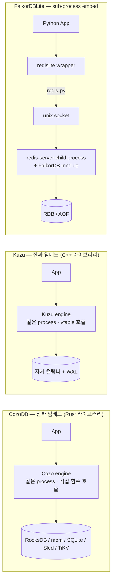
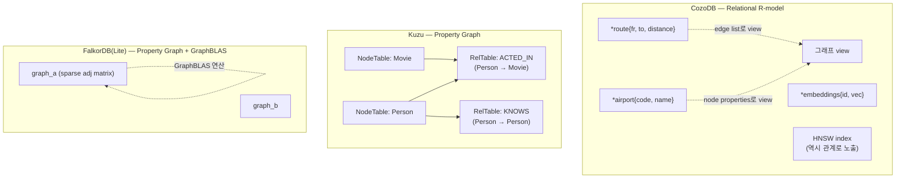
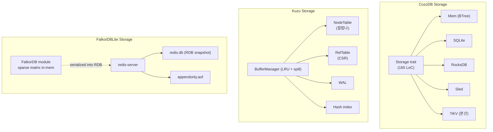
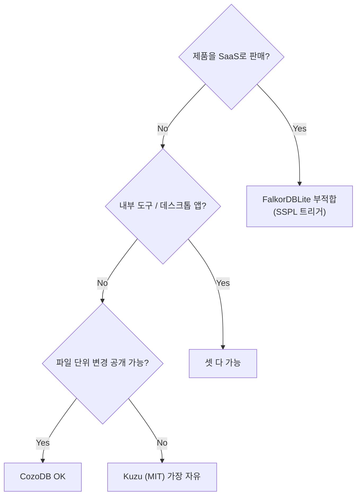
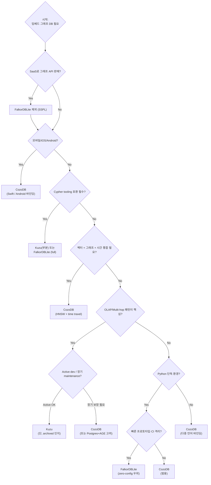

# CozoDB vs Kuzu vs FalkorDBLite — 임베드형 그래프 DB 3종 비교

> 비교 대상:
> - [CozoDB](https://github.com/cozodb/cozo) v0.7.6 — 자세한 분석은 [CozoDB_Analysis.md](CozoDB_Analysis.md)
> - [Kuzu](https://github.com/kuzudb/kuzu) v0.11.3 (마지막) — 자세한 분석은 [Kuzu_Analysis.md](Kuzu_Analysis.md)
> - [FalkorDBLite](https://github.com/FalkorDB/falkordblite) — 자세한 분석은 [FalkorDBLite_Analysis.md](FalkorDBLite_Analysis.md)
>
> 분석 시점: 2026-04-28
> 비교 관점: 임베드 환경에서 그래프 DB를 선택해야 하는 SWE의 시각

---

## TL;DR

세 프로젝트는 모두 "임베드"라는 키워드를 공유하지만 **카테고리가 다르다**.

| 카테고리 | 의미 | 해당 |
|---|---|---|
| **진짜 임베드 + 관계형 R-model** | 같은 process, Datalog, 그래프는 view | **CozoDB** |
| **진짜 임베드 + property graph** | 같은 process, Cypher, 컬럼나+factorized | **Kuzu** |
| **Sub-process 임베드 + Redis 모듈** | 자식 process spawn, Cypher, GraphBLAS | **FalkorDBLite** |

한 줄 권장:
- **LLM 메모리·KG·벡터·시간 통합이 필요한 personal/edge 앱** → **CozoDB**
- **OLAP 그래프 분석·multi-hop 패턴 + Cypher 호환이 필요** → **Kuzu** (단, archived 리스크 검토)
- **빠른 GraphRAG 프로토타입·CI 격리 + FalkorDB 엔진 그대로** → **FalkorDBLite** (단, SSPL 라이선스 검토)

**현재(2026-04) 가장 능동적인 development**: CozoDB > FalkorDBLite > Kuzu(archived).

---

## 목차

1. [한 페이지 요약 매트릭스](#1-한-페이지-요약-매트릭스)
2. [카테고리 차이 — "임베드"의 3가지 의미](#2-카테고리-차이--임베드의-3가지-의미)
3. [데이터 모델·쿼리 언어](#3-데이터-모델쿼리-언어)
4. [스토리지 아키텍처 비교](#4-스토리지-아키텍처-비교)
5. [트랜잭션·동시성 모델](#5-트랜잭션동시성-모델)
6. [확장성 (Vector·FTS·Time)](#6-확장성-vectorftstime)
7. [언어 바인딩·플랫폼](#7-언어-바인딩플랫폼)
8. [라이선스·거버넌스·커뮤니티](#8-라이선스거버넌스커뮤니티)
9. [성능 특성](#9-성능-특성)
10. [코드 규모·아키텍처 복잡도](#10-코드-규모아키텍처-복잡도)
11. [시나리오별 의사결정 가이드](#11-시나리오별-의사결정-가이드)
12. [SWE 관점 종합 평가](#12-swe-관점-종합-평가)

---

## 1. 한 페이지 요약 매트릭스

| 항목 | **CozoDB** | **Kuzu** | **FalkorDBLite** |
|---|---|---|---|
| **버전 (분석 시점)** | v0.7.6 | v0.11.3 | (Redis 8.2.3 + FalkorDB 4.16.2 번들) |
| **언어** | Rust | C++17 | Python wrapper + C (redis) + C/C++ (FalkorDB) |
| **개발 상태** | 🟢 active | ⚠️ archived (2026-04) | 🟢 active |
| **라이선스** | MPL-2.0 | MIT | New BSD wrapper / **SSPL** module |
| **임베드 형태** | 진짜 in-process | 진짜 in-process | sub-process spawn |
| **데이터 모델** | 관계형 (R-model) | Property graph | Property graph |
| **쿼리 언어** | Datalog (CozoScript) | Cypher (openCypher) | Cypher |
| **저장 모델** | KV (storage trait) | 컬럼나 + CSR | Redis RDB / AOF |
| **스토리지 백엔드** | Mem · SQLite · RocksDB · Sled · TiKV | 자체 (단일) | Redis 자체 |
| **분산 모드** | TiKV로 가능 | 없음 | 없음 |
| **트랜잭션** | MVCC, multi-statement | Serializable ACID + WAL | Redis 트랜잭션 (MULTI/EXEC) |
| **벡터 검색** | HNSW (1급 RA 노드) | HNSW (vector extension) | (FalkorDB 자체 미지원) |
| **FTS** | 자체 (v0.7+) | fts extension | (Redis Search 모듈 별도) |
| **Time travel** | per-relation opt-in | 없음 | 없음 |
| **그래프 알고리즘** | 캐닝 fixed_rule + Datalog | algo extension (PageRank 등) | 일부 (Cypher procedure) |
| **언어 바인딩** | 13종 (Py/JS/JVM/iOS/Android/WASM/...) | 6종 (Py/JS/Java/Rust/WASM/C#) | Python only (자매: TS) |
| **WASM 지원** | ✅ (in-browser DB) | ✅ | ❌ |
| **모바일 지원** | iOS·Android | ❌ | ❌ |
| **Windows 지원** | ✅ | ✅ | ❌ (WSL only) |
| **Python 최소 버전** | 3.7+ | 3.7+ | **3.12+** |
| **마지막 commit (~)** | 활발 | 2026 archive | 활발 |
| **GitHub stars (~)** | 4k+ | 2k+ | 신규 (수십~수백) |
| **메인 사용 사례** | LLM memory, PKM, edge app | OLAP graph analytics | GraphRAG 프로토타이핑 |
| **첫 쿼리 cold-start** | <1ms | <1ms | ~50-200ms (fork) |
| **Cypher tooling 호환** | ❌ | 부분 (openCypher) | ✅ (FalkorDB 그대로) |

---

## 2. 카테고리 차이 — "임베드"의 3가지 의미

세 프로젝트가 모두 "임베드"라고 자칭하지만 **운영 모델은 본질적으로 다르다**.



### 2.1 함의 — 5가지 측면

| 측면 | CozoDB / Kuzu | FalkorDBLite |
|---|---|---|
| Cold-start | <1ms | 50-200ms (fork + Redis init) |
| Crash 격리 | App과 같이 죽음 | 자식만 죽음 |
| Memory 모델 | 공유 | 분리 (IPC) |
| 동시성 | 단일 process 내 thread | 여러 client process 가능 |
| 복잡성 | DB 하나로 끝 | redis-server lifecycle 관리 |

### 2.2 카테고리가 결정하는 use case

- **Cold-start이 critical (serverless, FaaS)**: CozoDB / Kuzu
- **Crash 격리가 critical (production embed in 큰 앱)**: FalkorDBLite
- **여러 process가 같은 DB 공유 (multi-worker Python)**: FalkorDBLite (단, Cluster는 X)
- **mobile (iOS/Android)**: CozoDB만 가능
- **Browser (WASM)**: CozoDB / Kuzu

---

## 3. 데이터 모델·쿼리 언어

### 3.1 모델 차이



### 3.2 같은 쿼리: "FRA에서 도달 가능한 모든 공항 수"

**CozoDB (Datalog)**:
```datalog
reachable[to] := *route{fr: 'FRA', to}
reachable[to] := reachable[stop], *route{fr: stop, to}
?[count_unique(to)] := reachable[to]
```

**Kuzu (Cypher)**:
```cypher
MATCH (origin:Airport {code: 'FRA'})-[*]->(dest:Airport)
RETURN count(DISTINCT dest)
```

**FalkorDBLite (Cypher)**:
```python
g.query("""
  MATCH (origin:Airport {code: 'FRA'})-[*]->(dest:Airport)
  RETURN count(DISTINCT dest)
""")
```

### 3.3 표현력·가독성·복잡도

| 측면 | Datalog | Cypher |
|---|---|---|
| **재귀 표현** | native (rule이 함수처럼 합성) | `*` (variable-length path), `<recursion not first-class>` |
| **그래프 패턴 시각성** | rule 분리 | ASCII art 형태 |
| **aggregation in recursion** | ✅ (stratified) | 제한적 |
| **학습 곡선** | 낮지 않음 (Prolog 친척) | 매우 직관적 |
| **mind share** | 작음 | 매우 큼 |
| **tooling 호환** | CozoDB 한정 | Neo4j Bloom, Browser, drivers, BI 도구 등 풍부 |

→ **Cypher의 ecosystem 우위 vs Datalog의 표현력 우위**. 팀 학습 비용이 결정 요소.

---

## 4. 스토리지 아키텍처 비교



### 4.1 차이 요약

| 측면 | CozoDB | Kuzu | FalkorDBLite |
|---|---|---|---|
| **저장 단위** | KV pair (binary) | 8KB page (컬럼나) | Redis 메모리 + RDB binary dump |
| **그래프 표현** | edge list relation | CSR adjacency | Sparse adj matrix (CSC) |
| **인덱스** | B-tree on KV | hash, primary key | Redis hash + label index |
| **압축** | RocksDB SST 압축 (옵션) | RLE/Delta/Bitpack/Dict | Redis RDB 압축 |
| **OLAP friendly?** | RocksDB scan은 row-oriented이지만 빠름 | ✅✅ (컬럼나 + factorized) | △ (in-memory, sparse matrix는 graph algo에 강함) |
| **OLTP friendly?** | ✅ (KV는 point lookup 빠름) | ✅ (page cache LRU) | ✅✅ (in-memory) |
| **백엔드 교체 가능** | ✅ (5개 중 선택) | ❌ | ❌ (Redis 고정) |
| **분산** | ✅ (TiKV) | ❌ | ❌ |

### 4.2 누가 누구를 이기는가

- **컬럼나 OLAP 스캔**: Kuzu가 압도. SUM/AVG/aggregate가 page sequential read
- **포인트 lookup OLTP**: 셋 다 비슷. CozoDB는 RocksDB 위에서, Kuzu는 BufferManager, FalkorDBLite는 메모리
- **Multi-hop pattern**: Kuzu가 factorized로 우위
- **벡터 + 그래프 결합 join**: CozoDB가 RA 노드 통합으로 우위
- **Redis 명령 호환**: FalkorDBLite만 가능

---

## 5. 트랜잭션·동시성 모델

| 측면 | CozoDB | Kuzu | FalkorDBLite |
|---|---|---|---|
| Isolation | MVCC, snapshot | **Serializable** | Redis 모델 (atomic 명령) |
| Multi-statement TX | ✅ | ✅ | MULTI/EXEC (제한적) |
| Concurrent writers | TiKV에서는 분산, 단일 backend는 단일 writer | 단일 writer | 단일 writer (Redis single-thread) |
| Concurrent readers | ✅ (MVCC) | ✅ (MVCC + page cache) | ✅ (다중 client) |
| Crash recovery | RocksDB WAL / SQLite WAL / TiKV Raft | 자체 WAL + checkpoint + shadow file | Redis RDB + AOF replay |
| 분산 트랜잭션 | TiKV에서 가능 | ❌ | ❌ |

### 5.1 Serializable의 의미 (Kuzu)

Kuzu는 임베드 DB로는 이례적으로 **Serializable** 격리를 보장. 이는 모든 동시 트랜잭션이 어떤 직렬 순서와 동등한 결과를 낸다는 가장 강한 보장. SQLite의 SERIALIZABLE과 비슷하지만 그래프 모델 위에서 가능하다는 게 차이.

### 5.2 MVCC vs Snapshot

CozoDB는 storage backend에 위임 — RocksDB transactional, SQLite txn, TiKV는 percolator 모델. Kuzu는 자체 undo_buffer + version_info로 in-process MVCC. FalkorDBLite는 Redis의 single-threaded atomicity에 의존 (전통적 의미의 MVCC 아님).

---

## 6. 확장성 (Vector·FTS·Time)

| 기능 | CozoDB | Kuzu | FalkorDBLite |
|---|---|---|---|
| **HNSW 벡터 인덱스** | ✅ 1급 RA 노드 (`runtime/hnsw.rs`) | ✅ vector extension (v0.11.3 사전 통합) | ❌ (외부 vector store 필요) |
| **MinHash-LSH** | ✅ (v0.7) | ❌ | ❌ |
| **Full-text search** | ✅ (v0.7) | ✅ fts extension | ⚠️ (Redis Search 모듈 별도) |
| **JSON value** | ✅ (v0.7) | ✅ json extension | ✅ (Redis JSON 기본) |
| **Time travel** | ✅ per-relation opt-in | ❌ | ❌ |
| **그래프 알고리즘 (PageRank, BFS, Dijkstra…)** | ✅ fixed_rule (캐닝) | ✅ algo extension | ⚠️ (Cypher procedure 일부) |
| **GIS** | ❌ | ❌ | ❌ |
| **GeoSpatial** | ❌ | ❌ | (RedisGeo와 결합 가능) |

### 6.1 통합 깊이의 차이

- **CozoDB**: HNSW가 **RA 노드로 native 통합** → 일반 join처럼 자연스럽게 합성. 벡터 + 그래프 + 시간 + FTS가 한 쿼리 안에 가능
- **Kuzu**: extension 형태로 분리되어 있지만 plan tree 깊이까지 통합. 4개가 v0.11.3에 사전 번들
- **FalkorDBLite**: 본체 FalkorDB는 그래프+GraphBLAS에 집중. 벡터·FTS는 외부 Redis 모듈로 결합 필요

→ **"한 쿼리에서 그래프+벡터+FTS+시간"이 필요하면 CozoDB가 가장 자연스러움**.

---

## 7. 언어 바인딩·플랫폼

| 환경 | CozoDB | Kuzu | FalkorDBLite |
|---|---|---|---|
| Python | ✅ | ✅ | ✅ (메인) |
| Node.js | ✅ | ✅ | (자매 패키지 falkordblite-ts) |
| Java JVM | ✅ | ✅ | ❌ |
| Clojure | ✅ | ❌ | ❌ |
| Rust | ✅ (네이티브) | ✅ | ❌ |
| Go | ✅ | (community) | ❌ |
| C# | ❌ | ✅ (community) | ❌ |
| C / FFI | ✅ | ✅ | ❌ |
| Swift (iOS/macOS) | ✅ | ❌ | ❌ |
| Android | ✅ | ❌ | ❌ |
| Browser WASM | ✅ | ✅ | ❌ |
| Lisp | ✅ (community) | ❌ | ❌ |
| Smalltalk | ✅ (community) | ❌ | ❌ |
| HTTP server | ✅ (`cozo-bin`) | (community) | (Redis 자체) |
| Windows native | ✅ | ✅ | ❌ (WSL only) |

### 7.1 환경 폭

CozoDB가 압도적 — **WASM + 모바일까지** 커버하는 임베드 그래프 DB는 거의 유일. Kuzu는 데스크톱 중심. FalkorDBLite는 Python 단일.

### 7.2 zero-copy 결과

- **Kuzu**: Apache Arrow 결과 zero-copy → pandas/Polars 친화
- **CozoDB**: pandas DataFrame 옵션 (PyO3 변환 cost), zero-copy까지는 아님
- **FalkorDBLite**: Python list of lists (가장 단순)

데이터 과학 워크플로우 통합은 Kuzu가 가장 정교.

---

## 8. 라이선스·거버넌스·커뮤니티

| 측면 | CozoDB | Kuzu | FalkorDBLite |
|---|---|---|---|
| 라이선스 | **MPL-2.0** | **MIT** | New BSD wrapper / **SSPL** module |
| 상업적 사용 | ✅ (file-level copyleft) | ✅ (가장 자유) | ❌ SaaS 제약, ⚠️ redistribution 시 SSPL 우산 |
| 프로젝트 형태 | Open source, 1인 maintainer 색채 | Kùzu Inc. 회사 + 학계 (Waterloo) | FalkorDB Inc. (회사) |
| 거버넌스 | Apache-style 아님, BDFL | corporate-led | corporate-led |
| 활성도 (~2026-04) | 활발 (v0.7.6 진행 중) | **archived** (v0.11.3 마지막) | 활발 (Redis 8.x 트랙) |
| 한국어 자료 | 거의 없음 | 거의 없음 | 거의 없음 |
| GitHub stars (~) | 4,000+ | 2,000+ | 신규 (수백) |

### 8.1 라이선스 의사결정 가이드



### 8.2 archived (Kuzu) 영향

Kuzu가 2026-04에 archived 상태로 들어간 것은:
- 새 기능·버그 수정 무한 대기
- 의존성 보안 패치도 커뮤니티 fork에 의존
- production 신규 채택 시 fork 운영 책임
- 다만 코드 자체는 잘 만들어져 있어 **reference implementation으로의 가치는 유지**

### 8.3 corporate vs community

- **Kùzu Inc.** (Kuzu): 학계 origin, commercial entity, "something new" 전환
- **FalkorDB Inc.**: VC funded startup, GraphRAG·AI 마케팅 강함
- **CozoDB**: solo developer (Ziyang Hu) 색채. 버스 팩터 1

---

## 9. 성능 특성

각 프로젝트가 publishing한 또는 코드에서 추정 가능한 수치 종합. **직접 비교 가능한 통일된 벤치마크는 없음.**

| 워크로드 | CozoDB | Kuzu | FalkorDBLite (FalkorDB 본체) |
|---|---|---|---|
| Cold start | <1ms | <1ms | ~50-200ms (sub-process fork) |
| 1.6M row OLTP read QPS | 250K+ | (no public) | (Redis-level) |
| 1.6M row OLTP mixed QPS | 100K | (no public) | (Redis-level) |
| 2-hop traversal (1.6M v / 31M e) | <1ms | (no public) | (sparse matrix mult — 빠름) |
| PageRank (10K v / 120K e) | ~50ms | algo extension | GraphBLAS algorithms |
| LDBC SNB | (no public) | Neo4j 대비 5-10x read | (no public) |
| Multi-hop OLAP | RocksDB 기반 한계 | **factorized 우위** | sparse matrix 우위 (다른 알고리즘) |
| Backup throughput | 1M rows/sec | (no public) | RDB save 속도 |

### 9.1 강점이 갈리는 지점

- **Single-record lookup**: FalkorDBLite (in-memory) > CozoDB (RocksDB) ≈ Kuzu
- **OLAP scan**: Kuzu (컬럼나) > CozoDB (RocksDB scan) > FalkorDBLite (전체 메모리이지만 그래프 알고리즘에 더 적합)
- **Multi-hop pattern**: Kuzu (factorized) > CozoDB (Datalog stratified) > FalkorDBLite (matrix multiplication)
- **벡터+그래프 결합**: CozoDB > Kuzu > FalkorDBLite
- **SUM(centrality), PageRank**: GraphBLAS (FalkorDB) ≈ Kuzu (algo) > CozoDB

### 9.2 메모리 footprint

| 비교 | 메모리 |
|---|---|
| CozoDB peak (1.6M rows OLTP) | ~50MB |
| Kuzu buffer pool 기본 | 시스템 80% (조절 가능) |
| FalkorDBLite (redis 빈) | ~10MB + 데이터 (전부 메모리) |

→ **FalkorDBLite는 데이터 전체가 메모리 거주**. 데이터셋이 RAM 초과하면 사용 불가. CozoDB·Kuzu는 disk-backed.

---

## 10. 코드 규모·아키텍처 복잡도

| 측면 | CozoDB | Kuzu | FalkorDBLite |
|---|---|---|---|
| 1차 언어 | Rust | C++17 | Python (+ 번들 C/C++ 바이너리) |
| 핵심 코드 LoC (대략) | 17K (cozo-core) | 200K+ | 1.9K (wrapper만) |
| 가장 큰 파일 | `query/ra.rs` (2398L) | (다수 1K+) | `client.py` (785L) |
| 핵심 모듈 수 | ~10 (storage / query / runtime / fixed_rule / ...) | ~15 (binder/optimizer/planner/processor/storage/...) | 8 .py 파일 |
| 외부 의존 | crossbeam, miette, pest, rocksdb, … | ANTLR4, Arrow, mbedtls, … | redis-py, psutil |
| 빌드 시간 (clean) | 5-10분 (Rust + cozorocks C++) | 10-30분 (C++ + ANTLR4) | <1분 (pip install, pre-built binary) |

### 10.1 학습 곡선 (코드 기여 관점)

- **CozoDB**: Rust + Datalog 이론(stratification, magic-set, semi-naive) 학습 필요
- **Kuzu**: C++17 + factorized join 학계 이론 필요
- **FalkorDBLite**: Python wrapper 수준은 쉬움. 그러나 **본체 FalkorDB는 C + Lemon parser + GraphBLAS** — 진입 장벽 매우 높음

### 10.2 디자인 우아함

- **CozoDB**: **storage trait** 추상화가 가장 깔끔. 165줄 trait으로 5개 backend 동등 처리
- **Kuzu**: DuckDB와 유사한 **layered 구조**가 정석적이지만 변경 비용 높음
- **FalkorDBLite**: 본체 미수정, **wrapper만 제공**하는 단순한 디자인

---

## 11. 시나리오별 의사결정 가이드



### 11.1 5가지 페르소나별 권장

| 페르소나 | 추천 | 근거 |
|---|---|---|
| **LLM 에이전트 메모리 (PKM, GraphRAG embed)** | CozoDB | HNSW + 그래프 + 시간 + FTS 한 엔진. WASM도 가능 |
| **데이터 과학자 — 거대 그래프 분석** | Kuzu | 컬럼나 + factorized + Arrow zero-copy. 단, archived 검토 |
| **빠른 그래프 DB 프로토타입 (Python)** | FalkorDBLite | `pip install` + 한 줄. Cypher 그대로. SSPL 검토 |
| **모바일 앱 (iOS·Android) 임베드 그래프** | CozoDB | 유일한 모바일 임베드 옵션 |
| **장기 production·active maintenance 필요** | CozoDB or Postgres+Apache AGE | Kuzu archived, FalkorDBLite는 SSPL |

### 11.2 안티 페르소나 (어디에도 안 맞는 경우)

- **Cypher 100% 호환 + 분산 + active dev** → 셋 다 부족. Memgraph(SaaS) 또는 Neo4j Aura
- **전통적 OLTP + 그래프** → Postgres + Apache AGE / Oracle Property Graph
- **TB+ 그래프** → JanusGraph / TigerGraph / DGraph

---

## 12. SWE 관점 종합 평가

### 12.1 가장 큰 디자인 결정의 차이

| 결정 | CozoDB | Kuzu | FalkorDBLite |
|---|---|---|---|
| 데이터 모델 | "관계형이 1차, 그래프는 view" | "Property graph가 1차" | "Property graph + Redis 모델" |
| 임베드 형태 | "in-process 라이브러리" | "in-process 라이브러리" | "sub-process spawn wrapper" |
| 쿼리 언어 | "Datalog (composable)" | "Cypher (mind-share)" | "Cypher (FalkorDB 그대로)" |
| 스토리지 | "trait으로 5개 backend" | "자체 컬럼나 + CSR 단일" | "Redis RDB/AOF 단일" |
| 기능 통합 | "벡터·FTS·시간 모두 native" | "extension으로 분리 통합" | "본체에 한정, 외부 모듈 결합" |

### 12.2 각 프로젝트의 학습 가치

#### CozoDB에서 배울 점

1. **Storage trait 추상화** (165 LoC)로 5개 backend 동등 처리
2. **HNSW를 RA 노드 1급으로** — 벡터 검색을 join처럼
3. **Datalog stratification + magic-set + semi-naive** 학계 알고리즘 production 구현
4. **per-relation opt-in time-travel** — 비용을 명시적으로 지불하는 디자인
5. **multi-platform** (WASM·iOS·Android·HTTP) wrapping 패턴

#### Kuzu에서 배울 점

1. **factorized representation** — m×n 폭발을 implicit으로 압축
2. **CSR + chunked update info**로 그래프 갱신 비용 분산
3. **WCOJ (worst-case optimal join)** 학계 origin production 적용
4. **DuckDB-style 컬럼나** 패턴을 그래프 모델로 매핑
5. **Extension SPI 4-hook** — Transformer/Binder/Planner/Mapper

#### FalkorDBLite에서 배울 점

1. **sub-process embed pattern** — server-only DB를 라이브러리화
2. **`atexit` + `_connection_count` cooperative shutdown**
3. **monkey-patch redis** — 기존 Redis 라이브러리 자동 wrap
4. **redis-py protocol over Unix socket** — 네트워크 없이 IPC
5. **multi-graph in single Redis** — namespace 패턴

### 12.3 종합 추천

**현재 시점 (2026-04) 가장 안전한 선택**:
- 신규 + 능동적 maintenance + 라이선스 자유 → **CozoDB**
- 그러나 **Datalog 학습 비용 + v1 미만의 안정성 리스크** 인지 필요

**Kuzu**는 archived 상태가 해소되거나 후속이 발표되기 전까지는 신규 production 채택을 보수적으로. v0.11.3을 frozen으로 잡고 쓰는 시나리오에는 여전히 매력적.

**FalkorDBLite**는 **프로토타입·CI·내부 도구**에 매우 빠르게 가동되지만 SaaS 제품화에는 SSPL이 막는다. 또한 진짜 임베드가 아니라는 점이 cold-start·crash 모델에 영향.

### 12.4 1년 후 시나리오 예측

- **CozoDB**: v1.0 진입 가능성. WASM 영속성·TiKV 분산 안정화가 관건. LLM 메모리 시장에서 입지 강화 가능
- **Kuzu**: 후속 프로젝트 발표가 결정적. archived 상태로 1년 더 가면 fork/community resurrection 가능성
- **FalkorDBLite**: 안정적 utility 패키지로 굳어질 것. Redis 라이선스 변경 영향이 추가 변수

---

## 13. 한눈 비교 결론

| 질문 | 답 |
|---|---|
| 어느 게 가장 임베드답나? | CozoDB · Kuzu (sub-process가 아닌 진짜 in-process) |
| 어느 게 가장 그래프DB답나? | Kuzu (Cypher + 컬럼나 + factorized) |
| 어느 게 가장 LLM 메모리에 적합한가? | CozoDB (그래프+벡터+시간+FTS 통합) |
| 어느 게 가장 빨리 시작되나? | FalkorDBLite (`pip install` + 한 줄) |
| 어느 게 가장 라이선스가 자유로운가? | Kuzu (MIT) |
| 어느 게 가장 활발한가? | CozoDB > FalkorDBLite >> Kuzu (archived) |
| 어느 게 가장 다양한 환경 지원? | CozoDB (13개 환경, 모바일·WASM 포함) |
| 어느 게 OLAP/Multi-hop 분석에 강한가? | Kuzu (factorized + 컬럼나) |
| 어느 게 한 쿼리에서 그래프+벡터 가능? | CozoDB (RA 노드 통합) |
| 어느 게 SaaS에 적합한가? | CozoDB or Kuzu (FalkorDBLite는 SSPL 함정) |

> **세 줄 요약**:
> - **CozoDB** — Datalog로 모든 걸 하나로 묶는 "임베드 그래프-관계-벡터 하이브리드"
> - **Kuzu** — Cypher OLAP에 가장 적합한 "임베드 컬럼나 그래프 DB", 단 archived
> - **FalkorDBLite** — pip 한 줄 zero-config, sub-process로 격리하는 "FalkorDB 운영 wrapper"
