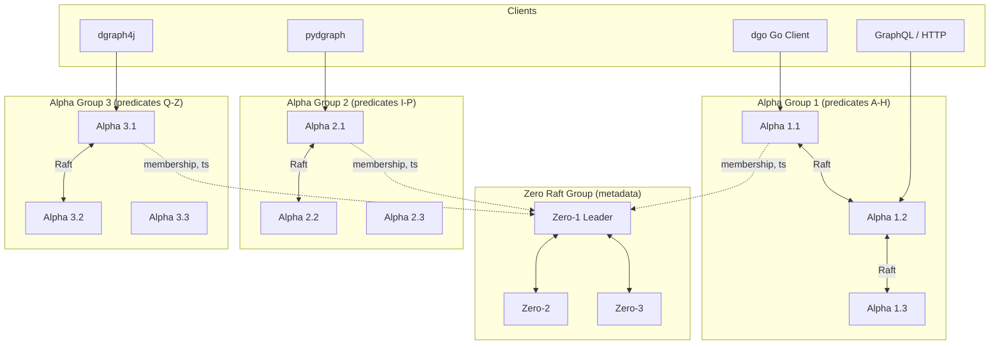
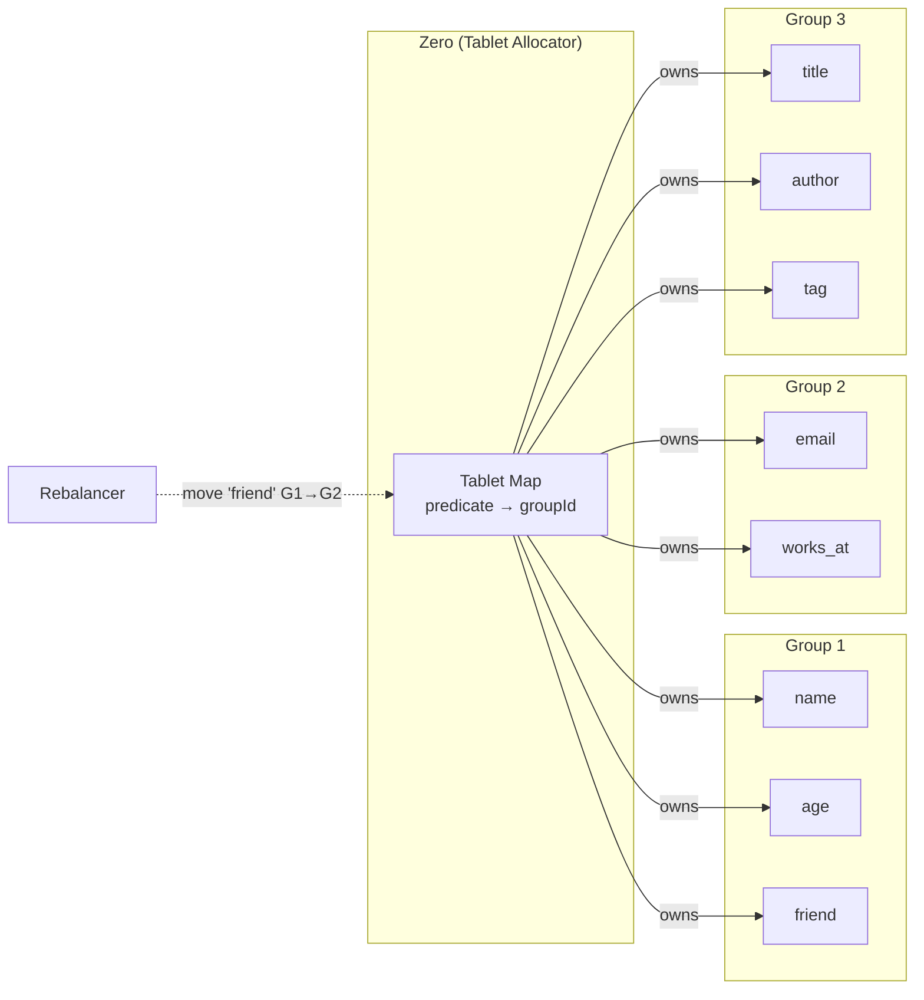
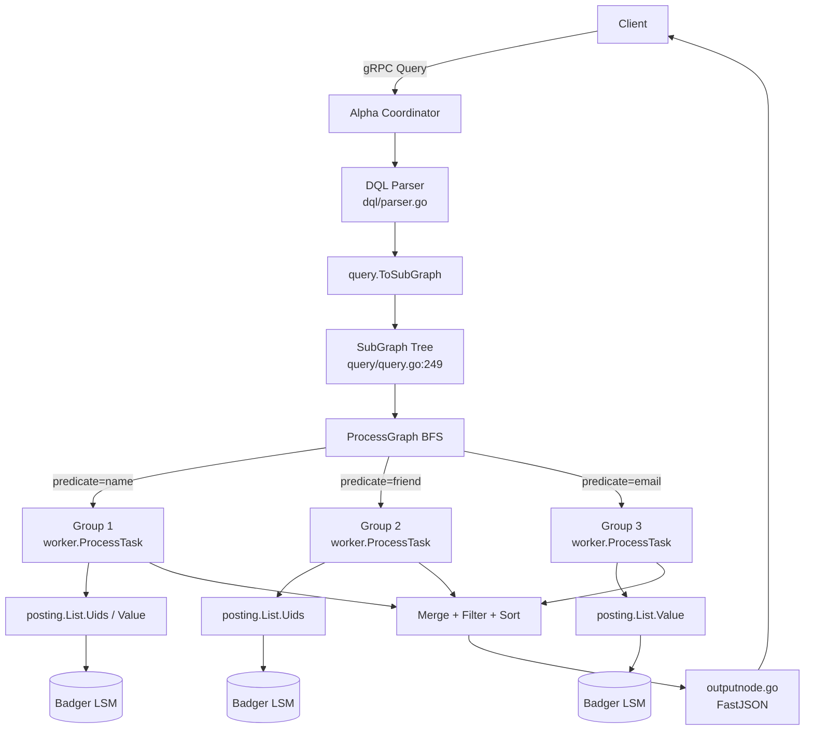

# Dgraph 프로젝트 분석

## 1. 프로젝트 개요

| 항목 | 내용 |
|------|------|
| **프로젝트명** | Dgraph |
| **GitHub URL** | https://github.com/dgraph-io/dgraph |
| **공식 웹사이트** | https://dgraph.io / https://docs.dgraph.io |
| **라이선스** | Apache License 2.0 (v23.x 이후 재전환, 이전에는 Dgraph Community License) |
| **주요 언어** | Go |
| **Go 버전** | Go 1.26.1 (`go.mod`) — README 기준 빌드 시 Go 1.24+ 필요 |
| **최신 버전** | v25.0.0 (README 상 "v25" 라인, `module github.com/dgraph-io/dgraph/v25`) |
| **스토리지 엔진** | Badger (LSM 기반, dgraph-io 자체 개발) |
| **합의 프로토콜** | etcd/raft v3 |
| **쿼리 언어** | DQL (구 GraphQL±, Dgraph Query Language) + 네이티브 GraphQL |

### 1.1 프로젝트 소개

Dgraph는 **수평 확장 가능한 분산 그래프 데이터베이스**로, GraphQL을 1급(first-class) 인터페이스로 제공하는 드문 그래프 DB 중 하나다. "Google 프로덕션 수준의 스케일과 처리량, 그리고 테라바이트 단위의 구조화된 데이터 위에서 실시간 사용자 쿼리를 서빙할 수 있을 정도로 낮은 지연"을 목표로 설계되었다.

Dgraph가 해결하려는 핵심 문제는 다음과 같다.

- **분산 환경에서의 그래프 조인 비용 폭발**: Neo4j 같은 싱글-노드 또는 마스터-복제 구조는 데이터셋이 메모리/노드 경계를 넘는 순간 쿼리 성능이 급락한다. Dgraph는 **Predicate 단위 샤딩**을 통해 조인을 네트워크가 아닌 샤드 내부에서 수행할 수 있도록 설계되었다.
- **GraphQL 위 별도 계층의 오버헤드**: 일반적인 스택은 PostgreSQL/Mongo 위에 Hasura/Apollo를 얹고 GraphQL을 번역한다. Dgraph는 GraphQL 스키마를 곧 데이터 모델로 승격시켜, 이 중간 변환 계층 자체를 없앤다.
- **분산 트랜잭션의 ACID 보장**: Zero 노드가 관리하는 하이브리드 논리 시계(HLC) 기반 MVCC + 그룹별 Raft를 조합해 읽기 일관성(linearizable reads)과 쓰기 ACID를 동시에 지원한다.

### 1.2 탄생 배경

Dgraph는 **Manish Rai Jain**(전 Google 검색 엔지니어)이 2015년에 시작했다. Google Knowledge Graph 팀에서 일하며 경험한 "그래프 질의를 위한 분산 시스템의 부재"가 직접적인 동기였다. 프로젝트는 Go로 작성되었고, 같은 팀이 함께 만든 **Badger**(순수 Go LSM 스토리지)와 **Ristretto**(캐시)가 기반이 된다.

> 참고: Dgraph Labs는 2023년에 Hypermode로 인수·리브랜딩 과정을 거쳤고, 이후 오픈소스 프로젝트는 Apache 2.0으로 되돌아왔다. 소스 헤더에 보이는 `SPDX-FileCopyrightText: © 2017-2025 Istari Digital, Inc.`는 그 소유 이력을 반영한다. 거버넌스 변동은 "종합 평가" 섹션에서 다시 다룬다.

---

## 2. 핵심 특징 및 차별점

### 2.1 Native GraphQL + DQL 이중 인터페이스

Dgraph는 두 개의 서로 다른 질의 인터페이스를 **같은 스토리지** 위에서 제공한다.

- **GraphQL**: 표준 GraphQL SDL로 스키마를 정의하면 Dgraph가 CRUD 리졸버, 필터, 페이지네이션, 인증 지시어(`@auth`), Lambda 훅(`@lambda`)까지 자동 생성한다. `graphql/schema/`, `graphql/resolve/` 패키지가 이를 담당한다.
- **DQL (Dgraph Query Language)**: GraphQL 문법에 그래프 전용 기능(재귀, 최단 경로, `@facets`, `@filter`, `@groupby`)을 추가한 Dgraph 고유 언어. 파서는 `dql/` 패키지, 실행기는 `query/query.go`의 `SubGraph` 트리.

### 2.2 Predicate 기반 샤딩

전통적 그래프 DB가 "정점(vertex) 해시 샤딩"을 쓰는 반면, Dgraph는 **Predicate(에지의 라벨/속성) 단위로 샤딩**한다. 즉 `friend` 술어의 모든 에지는 하나의 Raft 그룹에 모여 있다. 이로 인해 `friend`를 따라가는 조인은 네트워크 왕복 없이 해당 그룹 내에서 완결된다.

### 2.3 Badger LSM + Posting List 스토리지

모든 그래프 데이터는 `<predicate, uid>` 키 아래의 **posting list**로 직렬화되어 Badger에 저장된다. Posting list는 immutable layer + mutation layer 구조로, MVCC 타임스탬프로 버전을 관리한다(`posting/list.go`, `posting/mvcc.go`).

### 2.4 Zero / Alpha 이원 아키텍처

- **Zero**: 클러스터 메타데이터 관리. 그룹 멤버십, tablet(predicate 단위) 할당, 트랜잭션 타임스탬프(HLC) 발급, 샤드 리밸런싱.
- **Alpha**: 데이터 서빙. Badger 인스턴스 보유, Raft 그룹 참여, 쿼리/뮤테이션 실행.

Zero 자체도 Raft로 복제되어 SPOF가 아니다.

### 2.5 분산 ACID 트랜잭션

Zero가 발급하는 단조 증가 `startTs`와 `commitTs`, Alpha Oracle의 충돌 탐지(`posting/oracle.go`), Badger의 MVCC를 결합해 **Serializable Snapshot Isolation**에 가까운 수준의 트랜잭션을 제공한다. 커밋은 Percolator 스타일의 conflict-key 검사로 결정된다.

### 2.6 벡터 검색 내장 (v24+)

`tok/` 패키지에 HNSW 인덱스가 추가되었고, `query/vector/`, `worker/similar_to_options_test.go`에서 `similar_to` 함수를 제공한다. `go.mod`의 `github.com/viterin/vek` 의존성이 SIMD 벡터 연산을 담당한다.

### 2.7 엔터프라이즈 기능 오픈소스화

ACL, 암호화, 백업/복원, CDC(`worker/cdc.go`), 멀티테넌시(`edgraph/multi_tenancy.go`), 감사 로그(`audit/`) 등이 모두 저장소 내에 포함되어 있다.

---

## 3. 아키텍처 분석

### 3.1 전체 시스템 구조

Dgraph 클러스터는 **Zero**와 **Alpha**라는 두 종류의 노드로 구성된다. 클라이언트는 Alpha와만 직접 통신하며, Alpha는 내부적으로 Zero와 통신하여 메타데이터(타임스탬프, 그룹 정보)를 주고받는다.



핵심 포인트:

- **Zero 그룹**: 클러스터에 1개만 존재하며, 3~5 노드의 Raft 앙상블로 HA를 구성.
- **Alpha 그룹**: 여러 개 존재 가능. 각 그룹은 독립적인 Raft 그룹이며, 해당 그룹에 할당된 predicate 집합(`tablet`)의 데이터를 서빙.
- **Cross-group 쿼리**: 어떤 Alpha도 쿼리 진입점이 될 수 있고, 해당 노드가 "쿼리 코디네이터" 역할을 수행하며 타 그룹에 subquery를 위임.

### 3.2 Predicate 샤딩과 Tablet 이동

Dgraph에서 샤딩 단위는 **predicate**이다. Zero는 각 predicate가 어느 그룹에 속하는지를 `pb.Tablet` 구조로 관리하며, 부하가 특정 그룹에 몰리면 tablet을 다른 그룹으로 이동(`worker/predicate_move.go`)시킨다.

`worker/groups.go:391` 의 `BelongsTo` 는 해당 predicate가 현재 노드가 속한 그룹에서 서빙되는지를 판단한다.

```go
// worker/groups.go:391
func (g *groupi) BelongsTo(key string) (uint32, error) {
    // key는 predicate 이름
    ...
}
// worker/groups.go:445
func (g *groupi) ServesTablet(key string) (bool, error) { ... }
// worker/groups.go:528
func (g *groupi) Tablet(key string) (*pb.Tablet, error) { ... }
```



Predicate 단위 샤딩의 장점은 **동일 predicate를 따라가는 traversal**(`me → friends → friends.name`)이 네트워크 한 번에 끝난다는 점이다. 반대로 단점은 특정 predicate가 hotspot이 되면 해당 그룹 전체가 병목이 된다(→ 리밸런서가 tablet을 분리/이동).

### 3.3 쿼리 실행 흐름

DQL 쿼리가 들어오면 다음 단계를 거친다.

1. gRPC/HTTP로 Alpha 진입 (`edgraph/server.go:1182 Query`)
2. DQL 파싱 (`dql/parser.go` → `dql.Result`)
3. `query.ToSubGraph()`가 파싱 결과를 `SubGraph` 트리로 변환
4. `query.ProcessGraph()`가 BFS로 subgraph를 순회하며, 각 노드마다 해당 predicate를 서빙하는 그룹에 `worker.ProcessTaskOverNetwork` 호출
5. 결과 UID/값 매트릭스 취합 → 필터/정렬/페이지네이션 적용
6. `query/outputnode.go` 가 FastJSON 형태로 직렬화해 반환



각 Alpha는 자기 그룹의 데이터를 서빙할 때 `posting.GetNoStore(key)` → `List.Uids(opts)` / `List.Value(readTs)` 경로로 Badger에서 posting list를 읽는다.

### 3.4 쓰기(뮤테이션) 흐름

뮤테이션은 Raft 로그에 **Proposal**로 올라간다.

1. 클라이언트가 `Mutate` 또는 Upsert 블록 전송 → `edgraph/server.go:520 doMutate`
2. Zero에서 `startTs` 획득
3. 뮤테이션을 `pb.DirectedEdge` 리스트로 변환 (`edgraph/server.go:664 validateMutation`)
4. 각 에지가 속한 predicate의 그룹에 proposal 전송 (`worker/mutation.go`)
5. 해당 그룹 리더가 Raft append → commit → `node.applyCh` → `worker/draft.go`의 `applyCommitted`가 posting list에 반영
6. 커밋 단계: Zero에 `commitTs` 요청 → Oracle이 충돌 키 검사 → 성공 시 커밋, 실패 시 abort

---

## 4. 기술 스택

### 4.1 언어 / 런타임

- **Go 1.26.1** (`go.mod` line 3) — 전체 바이너리가 단일 언어로 작성됨.
- 빌드: `Makefile` + `go build`. 주 바이너리는 `dgraph/cmd/` 하위의 Cobra 서브커맨드로 단일 바이너리 `dgraph`에 통합된다.

### 4.2 주요 의존성 (`go.mod` 발췌)

| 카테고리 | 패키지 | 역할 |
|----------|--------|------|
| 스토리지 | `github.com/dgraph-io/badger/v4 v4.9.1` | LSM 기반 Key/Value 엔진 |
| 캐시 | `github.com/dgraph-io/ristretto/v2 v2.4.0` | Posting list / block cache |
| 합의 | `go.etcd.io/etcd/raft/v3 v3.5.28` | Zero/Alpha 그룹 복제 |
| RPC | `google.golang.org/grpc v1.79.3` | Alpha↔Alpha, Alpha↔Zero, Client↔Alpha |
| 직렬화 | `google.golang.org/protobuf v1.36.11`, `github.com/gogo/protobuf` | `protos/pb` 생성 |
| GraphQL | `github.com/dgraph-io/gqlparser/v2`, `github.com/dgraph-io/gqlgen`, `github.com/graph-gophers/graphql-go` | Native GraphQL 레이어 |
| 전문검색 | `github.com/blevesearch/bleve/v2 v2.5.7` | `@index(term, fulltext)` 지시어 |
| 지리공간 | `github.com/golang/geo`, `github.com/twpayne/go-geom`, `github.com/paulmach/go.geojson` | `geo` 타입 / S2 인덱스 |
| 벡터 | `github.com/viterin/vek v0.4.3` | SIMD 기반 float32 연산(HNSW) |
| CLI | `github.com/spf13/cobra`, `viper`, `pflag` | 서브커맨드, 설정 |
| 관측성 | `go.opentelemetry.io/otel/*`, `go.opencensus.io`, Prometheus | 메트릭/트레이스 |
| CDC / 메시징 | `github.com/IBM/sarama v1.47.0` | Kafka 싱크 |
| 객체스토리지 | `github.com/minio/minio-go/v7` | S3 호환 백업 |
| 시크릿 | `github.com/hashicorp/vault/api` | 암호화 키 관리 |

### 4.3 빌드 시스템

```
Makefile
├── install        # go install ./dgraph → $GOBIN/dgraph
├── docker-image   # multi-stage Dockerfile 빌드
├── protos         # protoc + gogo 플러그인으로 protos/pb 재생성
└── test / oss     # 빌드 태그 oss/enterprise 구분
```

전체 저장소는 `oss` 와 `enterprise` 의 두 빌드 태그를 사용하는 관행이 남아 있으나 v23.x 이후 대부분의 기능이 오픈되었다.

### 4.4 디렉토리 트리 (Top-level 요약)

```
dgraph/
├── dgraph/cmd/           # Cobra 기반 CLI 엔트리
│   ├── alpha/run.go      # `dgraph alpha` — 데이터 서버
│   ├── zero/run.go       # `dgraph zero`  — 메타데이터/오케스트레이터
│   ├── bulk/             # `dgraph bulk`  — 초기 대량 로딩
│   ├── live/             # `dgraph live`  — 온라인 라이브 로더
│   ├── debug/, debuginfo/, cert/, migrate/, increment/, mcp/
├── edgraph/              # Alpha의 gRPC 서버 구현 (외부 계약)
│   ├── server.go         # Query/Mutate/Alter/Health RPC
│   ├── access.go         # ACL / JWT
│   ├── multi_tenancy.go  # 네임스페이스
│   └── graphql.go        # GraphQL 엔드포인트 브릿지
├── graphql/              # Native GraphQL 레이어
│   ├── schema/           # SDL 파싱, 타입 생성, 지시어(@auth, @lambda, @custom)
│   ├── resolve/          # 질의/뮤테이션 리졸버
│   ├── admin/            # /admin GraphQL
│   ├── authorization/    # @auth 평가
│   └── subscription/     # GraphQL 구독
├── query/                # DQL 실행기
│   ├── query.go          # SubGraph 트리 / ProcessGraph
│   ├── outputnode.go     # FastJSON 직렬화
│   ├── shortest.go       # 최단 경로
│   ├── recurse.go        # 재귀 쿼리
│   ├── groupby.go        # 집계
│   └── vector/           # HNSW 벡터 검색
├── dql/                  # DQL 파서 (구 `gql`)
├── worker/               # Alpha의 내부 Raft/실행 레이어
│   ├── draft.go          # Raft 노드 (applyCommitted, snapshot)
│   ├── groups.go         # Tablet 할당, 그룹 멤버십
│   ├── mutation.go       # 뮤테이션 proposal
│   ├── task.go           # ProcessTask — 쿼리 실행
│   ├── sort.go, match.go # 정렬, 필터링
│   ├── predicate_move.go # 리밸런싱
│   ├── backup.go, online_restore.go, export.go
│   └── cdc.go            # Change Data Capture
├── posting/              # Posting list 레이어
│   ├── list.go           # List 타입 (65+), Uids/Value/Iterate
│   ├── mvcc.go           # MVCC, rollup, oracle 연동
│   ├── index.go          # 인덱스 토큰 생성, reverse edge
│   ├── oracle.go         # 트랜잭션 충돌 탐지
│   └── lists.go          # LRU 캐시 관리
├── schema/               # 스키마 parse/state
├── types/                # 스칼라 타입, 변환, facets
├── tok/                  # Tokenizer + 인덱스 (term, fulltext, trigram, geo, hash, hnsw)
├── raftwal/              # Raft WAL (Badger 기반)
├── conn/                 # gRPC 풀 / 그룹 내 통신
├── protos/               # .proto + 생성된 pb 패키지
├── x/                    # 공통 유틸 (SafeMutex, keys, config)
├── algo/                 # 집합 연산(UidPack 교집합/합집합)
├── codec/                # Roaring/UidPack 인코딩
├── chunker/              # RDF/JSON 벌크 청크 파서
├── backup/, enc/, audit/ # 백업, 암호화, 감사
└── contrib/, compose/, t/ # 운영 스크립트
```

---

## 5. 핵심 코드 분석

### 5.1 엔트리 포인트: Alpha와 Zero

`dgraph/cmd/alpha/run.go:71` 과 `dgraph/cmd/zero/run.go:59` 는 Cobra 커맨드로 바이너리의 두 주요 모드를 정의한다.

```go
// dgraph/cmd/alpha/run.go:71
Alpha.Cmd = &cobra.Command{
    Use:   "alpha",
    Short: "Run Dgraph Alpha database server",
    Run: func(cmd *cobra.Command, args []string) { run() },
}

// dgraph/cmd/zero/run.go:59
Zero.Cmd = &cobra.Command{
    Use:   "zero",
    Short: "Run Dgraph Zero management server ",
    Run: func(cmd *cobra.Command, args []string) { run() },
}
```

Alpha의 `run()`은 대략 다음 순서로 기동한다.

1. Badger 디렉토리 오픈 (`pstore`: posting store, `wstore`: write-ahead log)
2. `worker.Init(pstore)` — posting 캐시, oracle 초기화
3. `schema.Init`, `posting.Init`
4. cmux로 HTTP(8080) / gRPC(9080) 동시 청취
5. `worker.StartRaftNodes(wstore, bindall)` — Raft 노드 부트스트랩
6. `edgraph.InitServerState()` — `Server`(gRPC 엔드포인트) 인스턴스 생성
7. Zero에 연결해 멤버십 등록 → `groups().BelongsTo` 맵 초기화

### 5.2 gRPC 엔드포인트: `edgraph.Server`

외부로 노출되는 `api.Dgraph` gRPC 서비스의 구현체는 `edgraph/server.go` 에 있다.

```go
// edgraph/server.go:337
func (s *Server) Alter(ctx context.Context, op *api.Operation) (*api.Payload, error)

// edgraph/server.go:1182
func (s *Server) Query(ctx context.Context, req *api.Request) (*api.Response, error)

// edgraph/server.go:520
func (s *Server) doMutate(ctx context.Context, qc *queryContext, resp *api.Response) error
```

`Query` 내부에서는 `queryContext`를 만들어 DQL 파싱, 업서트(Upsert) 블록 평가, `query.Request.ProcessQuery()` 호출까지 일관된 트랜잭션 컨텍스트에서 처리한다. `doMutate`는 파싱된 `dql.Mutation`을 `pb.DirectedEdge` 슬라이스로 평탄화한 뒤 `edges`를 각 predicate가 속한 그룹에 맞게 버킷팅해 전송한다.

### 5.3 `query.SubGraph`: DQL 실행 트리

DQL 쿼리는 각 셀렉션 필드마다 하나의 `SubGraph` 노드로 변환된다(`query/query.go:249`).

```go
// query/query.go:249
type SubGraph struct {
    ReadTs      uint64
    Attr        string       // predicate 이름
    Params      params
    SrcUIDs     *pb.List     // 부모 레벨에서 넘어온 UID 집합
    SrcFunc     *Function    // 루트에서만 non-nil (eq, has, anyof...)
    Filters     []*SubGraph
    Children    []*SubGraph  // 중첩 필드
    DestUIDs    *pb.List     // 이 노드를 지난 뒤의 UID
    uidMatrix   []*pb.List   // 부모 UID → 자식 UID 리스트
    valueMatrix []*pb.ValueList
    ...
}
```

실행은 BFS 형태로 수행되며, 각 레벨마다 `worker.ProcessTaskOverNetwork(ctx, query)` 를 호출해 해당 predicate를 관리하는 원격 그룹에 RPC를 날린다. 로컬 그룹이면 `worker.ProcessTask`가 직접 posting list를 읽는다.

재귀(`@recurse`)와 최단 경로(`shortest`)는 별도 파일(`query/recurse.go`, `query/shortest.go`)에서 구현되며, BFS에 추가적인 레벨 카운터와 사이클 탐지를 얹는 형태다.

### 5.4 Posting List: `posting.List`

Dgraph에서 그래프 원자 단위는 "어떤 predicate에 대한 UID/값 리스트"이며, 이를 `posting/list.go`의 `List` 타입이 표현한다.

```go
// posting/list.go:66
type List struct {
    x.SafeMutex
    key         []byte
    plist       *pb.PostingList    // immutable layer
    mutationMap *MutableLayer      // commitTs → delta PostingList
    minTs       uint64
    maxTs       uint64
    cache       []byte
}
```

**Two-layer 설계**의 목적은 핫 키에 대한 write amplification 절감이다. 쓰기는 항상 mutation layer에 delta로 쌓이고, 백그라운드 rollup 프로세스(`posting/mvcc.go`의 `incrRollupi`)가 주기적으로 delta를 immutable layer에 머지해 Badger에 새 버전을 기록한다.

Key 구조는 `x/keys.go`에서 정의된다:

```
<namespace:8B> <byteType:1B> <predicate> <uidOrTerm>
```

- `byteType = d` → 일반 데이터 posting (`<pred, uid>`)
- `byteType = i` → 인덱스 posting (`<pred, token>`)
- `byteType = r` → reverse edge
- `byteType = c` → count index
- `byteType = s` → schema / type

이 덕분에 Badger의 **prefix iteration** 한 번으로 특정 predicate 전체, 특정 token 전체 등을 스트리밍 스캔할 수 있다.

`List.Uids`는 다음과 같은 시그니처로 특정 `readTs` 시점의 UID 리스트를 뽑아낸다.

```go
// posting/list.go (개념 요약)
func (l *List) Uids(opt ListOptions) (*pb.List, error)
```

내부적으로는 immutable layer의 압축된 `codec.UidPack`을 디코딩하면서, `mutationMap`에서 `opt.ReadTs` 이하의 커밋된 delta들을 "layered read"로 적용한다. `Set/Del/Ovr` 비트가 `list.go:49-53`에 정의되어 있고, iterate 도중 마지막 상태를 결정한다.

### 5.5 `MutableLayer`: 트랜잭션-로컬 변경 버퍼

`posting/list.go:87`에 정의된 `MutableLayer`는 "Posting list의 버전별 delta 맵"을 효율적으로 클론할 수 있도록 설계되어 있다.

```go
// posting/list.go:87
type MutableLayer struct {
    committedEntries map[uint64]*pb.PostingList // commitTs → delta
    currentEntries   *pb.PostingList            // 진행 중인 txn의 delta
    readTs           uint64

    deleteAllMarker   uint64
    committedUids     map[uint64]*pb.Posting
    committedUidsTime uint64
    length            int
    currentUids       map[uint64]int
    isUidsCalculated  bool
    calculatedUids    []uint64
}
```

주석에서 밝히듯, 과거에는 단순 `map[uint64]*pb.PostingList` 였지만 "트랜잭션마다 posting list를 copy 해야 하는데 map deep-clone 비용이 과도했다"는 문제로 이 구조로 리팩토링되었다. 캐시된 `committedUids`, `calculatedUids` 필드 덕분에 반복 조회에서 O(1)에 접근한다.

### 5.6 MVCC / Rollup: `posting/mvcc.go`

`incrRollupi`는 rollup 대상 키를 우선순위 큐에 넣고, 백그라운드 워커가 `List.Rollup()`을 호출해 delta들을 새로운 immutable layer로 승격시킨다.

```go
// posting/mvcc.go:41
type incrRollupi struct {
    priorityKeys []*pooledKeys // idx0: high, idx1: low
    count        uint64
    // Rollup ts 발급용 콜백. 진행 중 txn을 덮어쓰지 않도록 보장
}
```

Rollup은 **반드시 모든 txn의 readTs보다 큰 ts**로 기록되어야 한다. 그래서 Rollup 시점의 ts는 Zero/Oracle에서 새로 발급받는 `MaxAssigned()` 이상의 값이 된다.

### 5.7 Raft 적용 루프: `worker/draft.go`

각 Alpha 그룹은 하나의 Raft 노드(`worker/draft.go:50 node`)를 가진다.

```go
// worker/draft.go:50
type node struct {
    pendingSize int64
    *conn.Node                         // etcd/raft wrapper
    applyCh chan []raftpb.Entry        // committed entries
    ctx     context.Context
    gid     uint32                     // group id
    closer  *z.Closer
    checkpointTs uint64
    streaming    int32
    ops          map[op]operation      // rollup/snapshot/backup 등의 진행중 작업
    cdcTracker   *CDC
    canCampaign  bool
}
```

동작 순서:

1. etcd Raft가 entries를 commit하면 `applyCh`로 보냄.
2. 별도 고루틴이 이를 받아 `applyCommitted`를 호출, `pb.Proposal`을 디코드.
3. Proposal 종류에 따라 `applyMutations`, `applySchemaMutation`, `applyCommitMarks` 등을 디스패치.
4. Mutation 적용은 `posting.List.AddMutationWithIndex` 로 posting list에 반영.
5. 일정 주기로 `snapshot()` 이 Badger stream을 떠서 새로운 Raft 스냅샷을 생성.

`op`(`worker/draft.go:94`) 상수는 backgroun 작업 종류(`opRollup`, `opSnapshot`, `opIndexing`, `opRestore`, `opBackup`, `opPredMove`)를 구분하며, 서로 배타적이어야 하는 작업은 `ops` 맵에 등록해 충돌을 막는다.

### 5.8 Tablet 할당: `worker/groups.go`

```go
// worker/groups.go:391
func (g *groupi) BelongsTo(key string) (uint32, error)

// worker/groups.go:445
func (g *groupi) ServesTablet(key string) (bool, error)

// worker/groups.go:528
func (g *groupi) Tablet(key string) (*pb.Tablet, error)
```

`BelongsTo`는 predicate가 어느 그룹에 속하는지를 로컬 캐시에서 조회하고, 미지의 predicate이면 Zero에 물어본다(`Inform`). Zero는 tablet을 **처음 쓰기가 도달한 그룹**에 기본 할당하고, 이후 리밸런서(`worker/predicate_move.go`)가 부하 균등화 목적으로 이동시킨다.

### 5.9 Oracle: 트랜잭션 충돌 탐지

`posting/oracle.go`의 Oracle은 각 열려있는 txn의 `startTs`, `commitTs`, 변경한 conflict key 집합을 보관한다. 커밋 요청이 Zero 리더로 들어오면 Oracle은 "내 startTs ~ 지금 사이에 같은 conflict key를 커밋한 txn이 있는가?"를 검사한다. 있다면 **abort**, 없다면 `commitTs`를 발급하고 Raft에 커밋 기록을 적는다.

### 5.10 GraphQL 스키마 → DQL 바인딩

`graphql/schema/` 는 사용자가 올린 SDL(`type User { id: ID! name: String @search(by:[term]) }`)을 파싱해 다음을 수행한다.

- 각 GraphQL 타입에 대응하는 내부 `dgraph.type`, predicate, `@index` 지시어를 자동 생성.
- `graphql/resolve/` 의 리졸버가 GraphQL 쿼리를 DQL로 재작성해 `edgraph.Server.Query`에 넘김.
- 뮤테이션은 upsert 블록으로 변환되어 `doMutate` 경로를 탄다.
- `@auth` 지시어는 `graphql/authorization/` 에서 JWT claims와 결합해 쿼리 시점의 filter로 삽입된다.

이 "GraphQL → DQL 재작성" 전략 덕분에 Dgraph는 별도 GraphQL 전용 엔진을 유지할 필요 없이 기존 분산 실행기를 그대로 재사용한다.

---

## 6. API 및 인터페이스

### 6.1 gRPC API

표준 `api.Dgraph` 서비스(`dgo` 클라이언트의 proto에서 제공)는 다음 RPC를 노출한다.

| RPC | 설명 |
|-----|------|
| `Alter` | 스키마 DDL (`edgraph/server.go:337`) |
| `Query` | 읽기 전용 DQL (`edgraph/server.go:1182`) |
| `Mutate` / `CommitOrAbort` | 쓰기, 커밋 |
| `CheckVersion` | 핸드쉐이크 |

포트는 기본 **9080** (Alpha). 내부 Alpha ↔ Alpha, Alpha ↔ Zero 통신은 `conn/` 패키지의 커넥션 풀 위에서 별도의 내부 gRPC 서비스(`pb.Worker`, `pb.Zero`)로 이뤄진다.

### 6.2 HTTP API (포트 8080)

- `POST /query` — DQL 쿼리 (`Content-Type: application/dql`)
- `POST /mutate` — DQL 뮤테이션 (RDF 또는 JSON)
- `POST /commit` / `/abort`
- `POST /alter` — 스키마 / drop 작업
- `GET  /health`, `/state` — 상태 조회
- `/admin` — GraphQL Admin API (백업, 스키마 업로드, drop data)
- `/graphql` — 사용자 정의 GraphQL 엔드포인트 (스키마 업로드 후 활성화)

### 6.3 DQL 예시

```graphql
# 1) 루트 함수 + 필터 + 중첩
{
  people(func: has(name), first: 10) @filter(ge(age, 18)) {
    uid
    name
    age
    friend @filter(eq(city, "Seoul")) {
      name
      friend { name }
    }
  }
}

# 2) 변수 바인딩 + 역집합
{
  var(func: eq(name, "Alice")) { A as uid }
  res(func: uid(A)) {
    name
    ~friend { name }   # reverse edge
  }
}

# 3) 집계
{
  q(func: has(salary)) @groupby(department) {
    avgSalary: avg(val(salary))
  }
}

# 4) 최단 경로
{
  path as shortest(from: 0x1, to: 0x20, numpaths: 3) {
    friend
  }
  result(func: uid(path)) { name }
}
```

### 6.4 GraphQL 예시

```graphql
type Post {
  id: ID!
  title: String! @search(by: [fulltext])
  author: User! @hasInverse(field: posts)
}

type User {
  id: ID!
  name: String! @search(by: [exact])
  posts: [Post!]
}
```

업로드 후 자동 생성되는 쿼리:

```graphql
query {
  queryPost(filter: { title: { alloftext: "graph database" } }) {
    id
    title
    author { name }
  }
}
```

### 6.5 클라이언트 드라이버

- **Go**: `github.com/dgraph-io/dgo/v250` (`go.mod`)
- **Java**: `dgraph4j`
- **Python**: `pydgraph`
- **JS/TS**: `dgraph-js`, `dgraph-js-http`
- **C#**: `dgraph.net`

모두 동일한 `api.proto`를 기반으로 한다.

### 6.6 `dgraph` CLI

`dgraph/cmd/root.go`에서 Cobra 서브커맨드로 구성:

```
dgraph alpha           # 데이터 노드
dgraph zero            # 메타데이터 노드
dgraph bulk            # 오프라인 대량 로딩 (최초 부트스트랩)
dgraph live            # 온라인 라이브 로더
dgraph backup/restore  # 백업/복원
dgraph debug           # Badger 오프라인 분석
dgraph increment       # 디버깅/헬스체크용 카운터
dgraph migrate         # SQL → DQL 마이그레이션
dgraph mcp             # Model Context Protocol 서버 (LLM 통합)
dgraph cert            # TLS 인증서 발급
```

---

## 7. 확장성 및 플러그인

### 7.1 GraphQL 커스텀 로직

- `@custom` 지시어: 리졸버를 외부 HTTP/GraphQL 엔드포인트에 위임.
- `@lambda` 지시어: Dgraph Lambda 서버(Node.js 기반 별도 프로세스)에서 JS/TS 함수를 실행해 필드 값을 계산. 스키마 컴파일 단계에서 `graphql/resolve/custom.go` 가 해당 필드 리졸버를 HTTP 호출로 바꾼다.
- `@auth`: 타입/쿼리/뮤테이션에 JWT claim 기반 조건을 선언적으로 부여.

### 7.2 Change Data Capture (CDC)

`worker/cdc.go`는 Raft 커밋 로그를 Kafka(`IBM/sarama`)로 스트리밍한다. 다운스트림 검색엔진(Elasticsearch), 웨어하우스, 분석 파이프라인과 연계 가능.

### 7.3 백업 / 복원 / Export

- `worker/backup.go`: full / incremental 바이너리 백업 → S3, GCS, Azure, NFS
- `worker/online_restore.go`: 운영 중 백업에서 복원
- `worker/export.go`: RDF / JSON export (`dgraph export` HTTP 관리 API)

### 7.4 인덱스 확장 (`tok/`)

`tok` 패키지는 토크나이저 인터페이스(`tok.Tokenizer`)를 정의한다. 문자열 term/fulltext/trigram, 숫자/날짜/bool, geo(S2), hash, `hnsw`(벡터)가 모두 같은 인터페이스를 구현하며, 사용자는 `@index()` 지시어로 predicate당 복수 인덱스를 붙일 수 있다.

### 7.5 MCP (Model Context Protocol)

`dgraph/cmd/mcp/` 와 `go.mod`의 `github.com/mark3labs/mcp-go v0.46.0` 의존성으로 LLM 에이전트가 DQL/GraphQL을 도구로 호출할 수 있는 MCP 서버를 내장한다. 이는 Hypermode 인수 이후의 방향성(LLM ↔ 그래프 통합)을 반영한다.

### 7.6 Multi-tenancy

`edgraph/multi_tenancy.go` 와 `namespace.go` 는 물리적으로 같은 클러스터 안에서 네임스페이스 단위로 데이터/스키마/ACL을 분리하는 기능을 구현한다. 모든 키 앞에 8바이트 namespace prefix가 붙어 Badger 레벨에서 격리된다.

---

## 8. 성능 특성

### 8.1 Badger LSM 스토리지

- **WiscKey 논문 기반**: 키와 값이 분리 저장되어 write amplification이 낮다.
- **SSD 최적화**: 순수 Go 구현, mmap 기반 table reader, concurrent compactor.
- Dgraph는 `pstore`(posting)와 `wstore`(raft WAL)를 독립된 Badger 인스턴스로 운용한다. WAL은 잦은 sync가 필요하고, posting은 대용량 처리량 중심이므로 분리한 것이 IO 간섭을 최소화한다.

### 8.2 Posting List 포맷과 `codec.UidPack`

UID 리스트는 `codec/codec.go`의 `UidPack`으로 인코딩된다. 블록 단위 delta + Snappy, 또는 roaring-like compressed bitmap을 사용해 정렬된 단조 증가 UID에 대해 매우 공간-효율적이다. 교집합/합집합 연산은 `algo/` 패키지에서 블록 단위로 수행되어 디코딩 전체를 피한다.

이 설계 덕분에 `intersect(friend-of-A, friend-of-B)` 같은 그래프 필터링이 **정수 배열 교집합**으로 환원되며, 인메모리 그래프 DB에 근접한 속도를 낸다.

### 8.3 인덱싱

Predicate마다 `@index(term, fulltext, trigram, exact, hash, int, float, datetime, geo, hnsw)` 지시어로 여러 인덱스를 붙일 수 있다. 각 인덱스는 자체적인 posting list로 저장되며(`<pred, token>` key), 동일한 prefix-scan 경로로 조회된다.

### 8.4 트랜잭션 모델

- **격리 수준**: 스냅샷 isolation에 가깝고, conflict key 기반 검증으로 일부 직렬화성까지 보장.
- **읽기**: `MaxAssigned` 타임스탬프를 기준으로 즉시 읽기 가능(lock-free).
- **쓰기**: Zero가 `startTs` 발급 → local posting list에 delta 버퍼 → commit 단계에서 Oracle 충돌 검사 → Raft append.
- **Cross-group 커밋**: 2PC 없이 Zero Oracle이 단일 순서로 커밋 타임스탬프를 발급하기 때문에, 전통적인 분산 커밋 프로토콜보다 단순하다.

### 8.5 알려진 제약과 주의점

- **Hotspot predicate**: 특정 predicate 쓰기가 한 그룹에 집중되면 해당 그룹의 Raft leader가 병목. 리밸런서가 이동시키지만 실시간은 아님.
- **Dynamic sharding 부재**: predicate 내부 데이터가 너무 커져도 자동으로 잘라 샤딩하진 않는다(수동 `move predicate` 또는 tablet 분할에 의존).
- **매우 많은 predicate**: 수십만 개 이상의 predicate는 Zero의 tablet 맵과 Raft commit 빈도를 압박할 수 있다.
- **리소스 소모**: Alpha 1개당 보통 8~16 GiB RAM 권장. Ristretto 캐시 + Badger block cache + mutation layer 메모리.
- **Mac/Windows 공식 지원 중단**: 프로덕션 타겟은 Linux/amd64, Linux/arm64.

---

## 9. 배포 및 운영

### 9.1 Docker / Compose

가장 간단한 단일 컨테이너 실행:

```bash
docker run -it -p 8080:8080 -p 9080:9080 \
  -v ~/dgraph:/dgraph dgraph/standalone:latest
```

`compose/` 디렉토리에는 다중 Zero/Alpha 클러스터 예제와 ACL, TLS, Vault 연동 예제가 들어있다.

### 9.2 수동 클러스터 기동 (3-Zero + 3-Alpha, 단일 그룹 예)

```bash
# Zero quorum
dgraph zero --my=zero1:5080 --replicas=3 --raft="idx=1"
dgraph zero --my=zero2:5080 --replicas=3 --raft="idx=2" --peer=zero1:5080
dgraph zero --my=zero3:5080 --replicas=3 --raft="idx=3" --peer=zero1:5080

# Alpha 그룹 1 (복제본 3)
dgraph alpha --my=alpha1:7080 --zero=zero1:5080,zero2:5080,zero3:5080
dgraph alpha --my=alpha2:7080 --zero=zero1:5080,zero2:5080,zero3:5080
dgraph alpha --my=alpha3:7080 --zero=zero1:5080,zero2:5080,zero3:5080
```

Alpha를 추가로 더 넣을 때 Zero는 `--replicas` 값에 따라 그룹을 자동 결정한다. 예를 들어 `--replicas=3`에 Alpha가 6개면 2개의 그룹이 생성된다.

### 9.3 주요 Alpha 플래그 (`dgraph/cmd/alpha/run.go`)

| 플래그 | 의미 |
|--------|------|
| `--my` | 이 Alpha가 외부에 알릴 주소 |
| `--zero` | Zero 주소 목록 |
| `--postings` / `--wal` | `pstore` / `wstore` 경로 |
| `--security` | IP whitelist, admin token |
| `--tls` | TLS 설정 (mTLS 포함) |
| `--cache` | block/index/posting 캐시 사이즈 |
| `--badger` | Badger 옵션 튜닝 |
| `--limit` | 쿼리/뮤테이션 크기 / 재시도 한도 |
| `--graphql` | GraphQL 기능 플래그 (introspection 등) |
| `--acl` | ACL/JWT 비밀 |
| `--audit` | 감사 로그 경로 |
| `--telemetry` | Prometheus / OTEL export |

### 9.4 Kubernetes / Helm

공식 Helm 차트(`dgraph/charts` 외부 저장소)는 StatefulSet으로 Zero와 Alpha를 배포하고, headless Service로 `--my` 주소를 만든다. `compose/` 디렉토리의 YAML도 동일 패턴을 공유한다.

### 9.5 초기 로딩: `bulk` vs `live`

- **`dgraph bulk`**: 클러스터가 **중단된 상태**에서 RDF/JSON을 읽어 Badger 파일을 직접 생성. 수 TB 데이터셋에 대해 수시간~수일 단위로 가장 빠른 초기 로딩 방법.
- **`dgraph live`**: 운영 중 클러스터에 트랜잭션으로 데이터를 업로드. 작은 데이터셋/증분 적재에 적합.

### 9.6 관측성

- **Prometheus**: `/metrics`에서 그룹별 raft apply 지연, posting list 크기, Badger LSM 통계 노출.
- **OpenTelemetry**: `go.opentelemetry.io/otel/*` 의존성으로 분산 트레이스 전파.
- **zpages**: `/z/` 엔드포인트로 live trace / rpc stats.

---

## 10. 경쟁·비교 분석

| 항목 | Dgraph | Neo4j | JanusGraph | Memgraph | FalkorDB |
|------|--------|-------|------------|----------|----------|
| **쿼리 언어** | DQL + GraphQL | Cypher | Gremlin | Cypher | Cypher |
| **스토리지** | Badger LSM (내장) | 자체 네이티브 | Cassandra/HBase/BigTable + ES | 인메모리 + snapshot | Redis module + GraphBLAS |
| **분산 모델** | Predicate 샤딩 + Raft 그룹 | Causal cluster (read replicas) | 백엔드 스토리지가 샤딩 | 고가용성 복제 | Redis Cluster 샤딩 |
| **트랜잭션** | ACID, MVCC, Cross-shard | ACID (단일 리더) | 백엔드 의존 | ACID | 단일 노드 ACID |
| **GraphQL Native** | O (1급) | 플러그인 | X | X | X |
| **벡터 검색** | O (HNSW) | O (v5.11+) | X | O | O |
| **언어** | Go | Java/Scala | Java | C++ | C |
| **오픈소스 라이선스** | Apache 2.0 | GPLv3 + commercial | Apache 2.0 | BSL + commercial | SSPLv1 |

### 10.1 적합한 사례

- **GraphQL 네이티브 API가 필요한 서비스**: Hasura+Postgres 스택의 대안. 스키마 하나로 CRUD + 권한 + 검색까지 자동화.
- **수평 확장되는 지식 그래프**: 데이터가 단일 노드 메모리를 넘는 규모의 RDF-like 워크로드.
- **Raft 기반 강한 일관성이 필요한 그래프 워크로드**: 금융, 규정 준수.
- **벡터+그래프 하이브리드**: RAG 파이프라인에서 entity graph + embedding 검색을 한 저장소로.

### 10.2 부적합한 사례

- **복잡한 Gremlin 기반 OLAP 트래버설**: Gremlin 생태계(GraphX, Spark) 연계는 JanusGraph가 우세.
- **초저지연 싱글-노드 인메모리**: 인메모리 전제의 Memgraph/FalkorDB가 낮은 tail latency에서 강점.
- **Cypher 마이그레이션 비용 민감**: 기존 Neo4j 자산이 많은 조직은 Cypher 호환 엔진이 편하다.
- **매우 동적인 스키마/초고밀도 predicate 폭증**: Predicate 샤딩의 구조적 제약.

---

## 11. 종합 평가

### 11.1 강점

1. **GraphQL 네이티브**: 스키마 선언만으로 분산 백엔드를 얻는다. 앱 레이어 GraphQL 게이트웨이의 "N+1 + 권한 + 캐시"를 DB가 흡수한다.
2. **Predicate 샤딩의 정합성**: 그래프 조인이 네트워크가 아닌 샤드 로컬에서 끝나는 경우가 많다. 다른 분산 그래프 DB의 고질적 약점을 우회하는 독창적 설계.
3. **풀스택 단일 바이너리**: ACL, 백업, 암호화, CDC, GraphQL, DQL, 벡터, 멀티테넌시, Raft, LSM이 모두 하나의 Go 바이너리 안에 있다. 운영 의존성이 극단적으로 적다.
4. **Go 생태계**: 빌드/크로스컴파일/관측성/컨테이너 친화적. Badger·Ristretto·Sarama 등 동일 조직/생태계 라이브러리로 정합성이 높다.
5. **코드 품질**: `posting/list.go`, `worker/draft.go` 등 핵심 경로가 상세한 주석과 함께 분리되어 있어 가독성이 비교적 좋다. Two-layer posting list, conflict-key oracle 등 설계 결정이 코드에 명시적으로 드러난다.

### 11.2 약점 / 리스크

1. **거버넌스 변동성**: Dgraph Labs → Hypermode/Istari Digital 인수, 라이선스 변화(Apache → DCL → Apache 회귀) 이력이 있다. 소스 헤더의 `Istari Digital, Inc.` 저작권이 그 흔적. 커뮤니티 모멘텀과 로드맵이 상용 회사 방향과 강하게 결합되어 있다.
2. **DQL의 진입 장벽**: Cypher/Gremlin 경험자에게는 DQL 문법과 `@facets`, `val()`, `uid()` 같은 관용구가 학습 부담이다.
3. **Hotspot / Rebalancing**: predicate 단위 샤딩의 대가로 핫 predicate 이슈가 존재하며, 자동 분할이 제한적이다.
4. **생태계 크기**: Neo4j 대비 커뮤니티/플러그인/서드파티 툴이 얇다. BI, ETL, 시각화 툴 연동은 주로 수동.
5. **Windows/Mac 미지원**: 개발 환경이 Linux 컨테이너로 제한된다.

### 11.3 엔지니어 관점 인사이트

- **"스토리지 엔진을 직접 소유한다"는 철학이 설계 전반을 지배한다.** Badger, Ristretto, `codec.UidPack`, Raft WAL을 별도 Badger에 분리 등, 디스크/메모리/네트워크 경계마다 Dgraph가 직접 제어한다. 이는 외부 KV 백엔드에 의존하는 JanusGraph와 정반대 철학이며, 성능 튜닝의 여지를 크게 준다.
- **`SubGraph` 트리 ↔ `worker.Task` RPC ↔ posting list 읽기**로 이어지는 3단 구조가 매우 일관되다. 한 번 이 흐름을 이해하면 새 기능(@recurse, @groupby, vector similar_to)이 어떻게 추가되는지 패턴 매칭이 쉽다.
- **GraphQL → DQL 재작성**은 인상적인 아키텍처 결정이다. 새로운 실행기를 만드는 대신 기존 분산 실행기를 그대로 재사용해, 두 인터페이스의 행동 일관성이 자연스럽게 확보된다.
- **트랜잭션 Oracle이 Zero에 집중**되어 있다는 점은 단순성과 동시에 병목 가능성을 내포한다. 극한 쓰기 QPS에서는 Oracle 자체가 병목이 될 수 있으며, 이 부분이 대규모 프로덕션에서 주의 깊게 모니터링해야 할 지점이다.
- **LLM 시대의 방향성**: `dgraph mcp` 서브커맨드와 HNSW 벡터 인덱스의 도입은 Dgraph가 "지식 그래프 + 벡터"의 하이브리드 기반을 LLM 에이전트에게 제공하려는 전략을 보여준다. `@lambda`와 결합하면 "검색 → 그래프 확장 → LLM 추론"을 한 바이너리 안에서 구성할 수 있다.

결론적으로 Dgraph는 **"분산 GraphQL 네이티브 + 그래프 트래버설을 샤드 로컬에 가두는 샤딩 전략"**이라는 두 가지 비차별적으로 희귀한 결정을 깊이 있게 밀어붙인 프로젝트다. 거버넌스 리스크만 감내할 수 있다면, GraphQL 기반 제품을 수평 확장 가능한 그래프 DB 위에서 운영하려는 팀에게 가장 매력적인 선택지 중 하나로 남아 있다.
