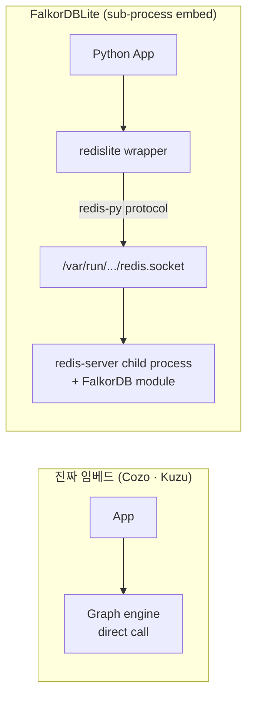
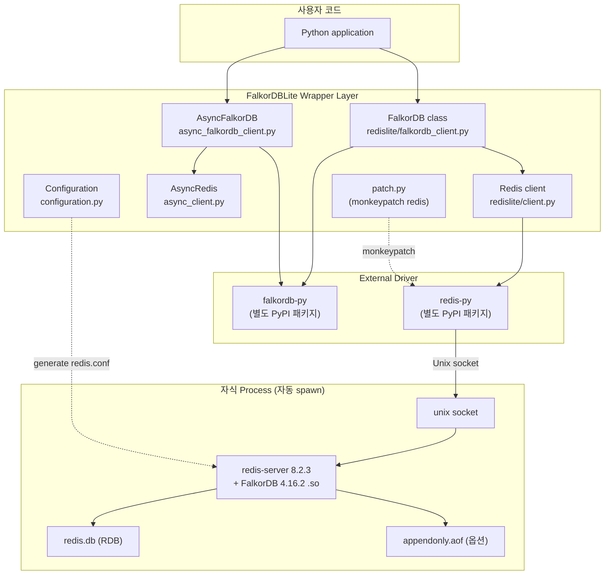
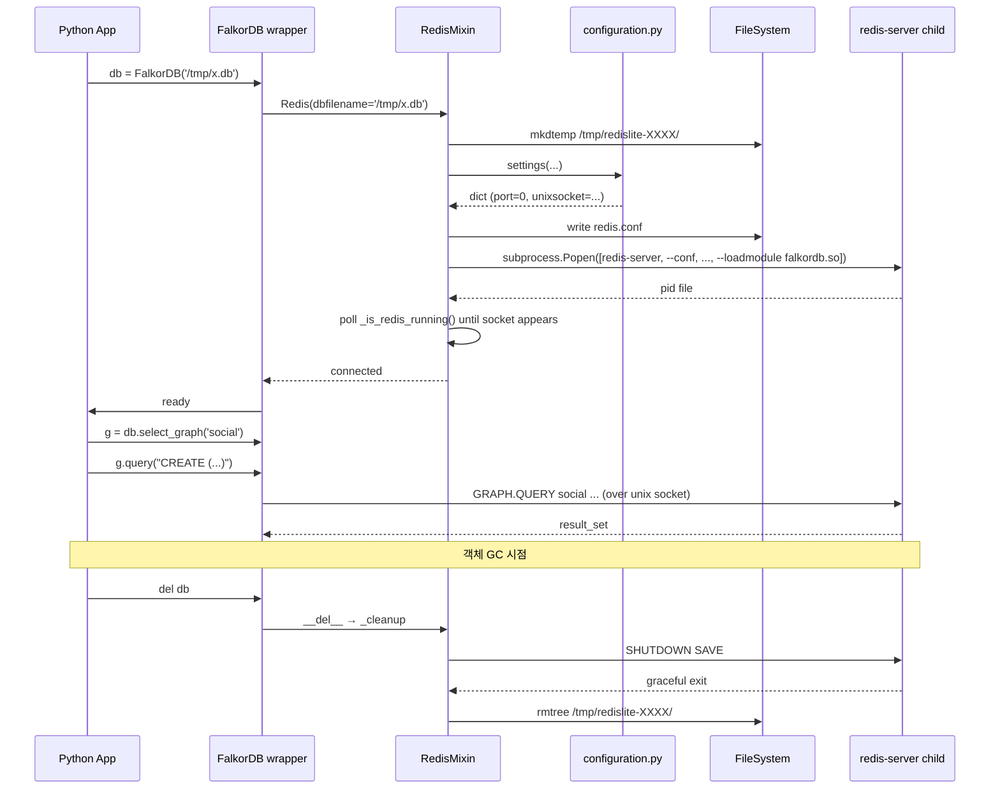

# FalkorDBLite 심층 분석 — 임베드형 zero-config FalkorDB 패키지

> 분석 대상: [FalkorDB/falkordblite](https://github.com/FalkorDB/falkordblite) (Python, BSD)
> 자매 프로젝트: [FalkorDB/falkordblite-ts](https://github.com/FalkorDB/falkordblite-ts) (Node.js/TypeScript)
> 기반 엔진: [FalkorDB/FalkorDB](https://github.com/FalkorDB/FalkorDB) (이 폴더의 [FalkorDB_Analysis.md](FalkorDB_Analysis.md) 참고)
> 분석 시점: 2026-04-28
> 분석 관점: 임베드 DB·sub-process 아키텍처를 다루는 SWE의 시각

---

## TL;DR

FalkorDBLite는 **새 그래프 엔진이 아니다**. 기존 FalkorDB(Redis Module + GraphBLAS)를 **`pip install falkordblite` 한 줄로 임베드처럼 사용**할 수 있게 만든 wrapper 패키지다.

핵심 4가지:

1. **redislite + FalkorDB 모듈** — Yahoo의 redislite(Redis-as-library) 위에 FalkorDB module을 번들. 즉 진짜 in-process embed가 아니라 **자동 fork된 redis-server sub-process**.
2. **Unix socket 통신** — TCP 포트 안 씀, `/var/run/redislite/redis.socket`로 IPC
3. **Zero-config 자동 lifecycle** — Python 객체 생성 = sub-process spawn, 객체 GC = process kill
4. **Cypher API 그대로** — `db.select_graph('name').query('CYPHER...')`. 풀 FalkorDB API surface

엔지니어 관점 핵심 포인트: **"진짜 임베드 vs sub-process embed"라는 디자인 결정**의 차이를 보여주는 사례. CozoDB·Kuzu는 같은 process 안에서 코드가 직접 호출되지만, FalkorDBLite는 자식 process로 redis-server를 띄워 IPC. 트레이드오프가 명확 — process 격리는 얻지만 GC 책임·socket overhead·cold start 비용 발생.

라이선스: Python 패키지 자체는 **New BSD**, 단 **번들된 FalkorDB 모듈은 SSPL v1**이라는 점이 중요한 commercial 함정.

---

## 목차

1. [프로젝트 개요](#1-프로젝트-개요)
2. ["sub-process 임베드"라는 디자인](#2-sub-process-임베드라는-디자인)
3. [아키텍처](#3-아키텍처)
4. [기술 스택](#4-기술-스택)
5. [핵심 코드 분석](#5-핵심-코드-분석)
6. [라이프사이클 — Process Spawn / Cleanup](#6-라이프사이클--process-spawn--cleanup)
7. [API · Sync vs Async](#7-api--sync-vs-async)
8. [라이선스 함정](#8-라이선스-함정)
9. [성능·운영 특성](#9-성능운영-특성)
10. [강점·약점·적합 시나리오](#10-강점약점적합-시나리오)
11. [부록 — 디렉토리 + 핵심 코드 위치](#11-부록--디렉토리--핵심-코드-위치)

---

## 1. 프로젝트 개요

### 1.1 정의

> "FalkorDBLite is a self-contained Python interface to the FalkorDB graph database. It provides enhanced versions of the Redis-Py Python bindings with FalkorDB graph database functionality."
> — `README.md:8-12`

쪼개면:

| 구성 | 출처 | 역할 |
|---|---|---|
| **Redis 8.2.3** (`setup.py:42`) | Redis 공식 소스 | 컴파일된 redis-server 바이너리 |
| **FalkorDB 모듈 v4.16.2** (`setup.py:44`) | FalkorDB 공식 소스 | Cypher · GraphBLAS 그래프 엔진 |
| **redislite** (Yahoo, BSD) | 패키지 root의 `redislite/` | sub-process 라이프사이클 관리 |
| **falkordblite wrapper** | `redislite/falkordb_client.py` | falkordb-py 드라이버를 redislite에 결합 |

→ **신규 graph engine 코드는 거의 없음.** wrapper 1890 LoC가 핵심 작업의 전부 (`redislite/*.py` 8개 파일).

### 1.2 해결하려는 문제

| 문제 | FalkorDBLite의 답 |
|---|---|
| FalkorDB는 Redis 모듈 → 운영자가 redis-server 직접 띄워야 함 | 자동 spawn |
| 개발 PC에 redis-server 설치 부담 | pre-built binary 번들 |
| 테스트 환경에서 격리된 redis 인스턴스 필요 | 객체마다 별도 sub-process |
| Python 앱에서 그래프 DB 즉시 사용 | `db = FalkorDB('/path.db')` 한 줄 |

### 1.3 형제 프로젝트

- **falkordblite** (Python, 분석 대상)
- **falkordblite-ts** (Node.js/TypeScript, 별도 GitHub repo)
- 둘 다 동일 패턴: redis-server + FalkorDB module 번들 + 언어별 wrapper

### 1.4 라이선스

- **falkordblite Python 패키지**: New BSD (3-clause)
- **번들된 redis-server**: 8.2.3은 RSALv2 / SSPL dual (Redis 라이선스 변경 영향)
- **번들된 FalkorDB 모듈**: SSPL v1
- **redislite**: BSD (Yahoo)

→ 통합 패키지를 production에서 쓰려면 **가장 제약 강한 SSPL 우산** 아래 들어간다. 자세한 건 §8 참고.

---

## 2. "sub-process 임베드"라는 디자인

### 2.1 진짜 임베드 vs sub-process embed

| 측면 | 진짜 임베드 (CozoDB·Kuzu·SQLite) | Sub-process embed (FalkorDBLite) |
|---|---|---|
| 실행 위치 | 동일 process | 자식 process |
| 통신 | direct function call | Unix socket / TCP |
| Crash 격리 | 없음 (process 같이 죽음) | 있음 (자식만 죽음) |
| Cold start | ~ms | ~수십 ms (fork + Redis init) |
| 메모리 모델 | 공유 | 분리 |
| GC 책임 | 자동 | wrapper가 cleanup |

### 2.2 왜 sub-process를 선택했나

FalkorDBLite의 README가 명시:
> "FalkorDBLite forks a lightweight sub-process instead of sharing memory space, providing **process isolation** that prevents crashes from cascading between your app and database."

세 가지 이유:

1. **FalkorDB는 redis 모듈 형태로만 존재** → 진짜 임베드를 위해 C 라이브러리화하려면 대공사
2. **GraphBLAS native lib (libomp)** crash가 main process를 죽이지 않게
3. **Redis ecosystem 그대로 사용** — 멀티 그래프, AOF persistence, RDB snapshot, EXPIRE, 모든 Redis 명령

### 2.3 Trade-off



→ FalkorDBLite는 cleanup 책임, socket overhead, fork 비용을 받아들이는 대신 **격리 + Redis 생태계 + 코드 재사용**을 얻는다.

---

## 3. 아키텍처

### 3.1 컴포넌트 다이어그램



### 3.2 디렉토리

```
falkordblite/
├── README.md
├── setup.py                   # ★ Redis + FalkorDB 빌드 + 다운로드
├── pyproject.toml
├── requirements.txt           # redis>=4.5, psutil, setuptools
├── redislite/                 # ★ 메인 패키지 (sub-process wrapper)
│   ├── __init__.py            # 165L
│   ├── client.py              # 785L — RedisMixin, 라이프사이클
│   ├── async_client.py        # 152L — AsyncRedis
│   ├── falkordb_client.py     # 149L — FalkorDB 통합 (분석 대상의 핵심)
│   ├── async_falkordb_client.py  # 187L
│   ├── configuration.py       # 146L — redis.conf 생성
│   ├── debug.py               # 104L
│   └── patch.py               # 202L — monkey-patch
├── build_scripts/
│   ├── deploy_package
│   └── update_redis_server.py # CI에서 redis 소스 download
├── docs/                      # ASYNC_API.md 등
├── examples/
├── tests/                     # pytest
├── verify_install.py          # 설치 후 검증
└── src/dummy.c                # setuptools 트릭용 dummy
```

### 3.3 사용 시퀀스



---

## 4. 기술 스택

### 4.1 빌드 설정 (`setup.py`)

```python
REDIS_VERSION = os.environ.get('REDIS_VERSION', '8.2.3')
REDIS_URL = f'https://github.com/redis/redis/archive/refs/tags/{REDIS_VERSION}.tar.gz'
FALKORDB_VERSION = os.environ.get('FALKORDB_VERSION', 'v4.16.2')
INSTALL_BIN_EXECUTABLES = ['redis-server', 'redis-cli']
```

빌드 시 동작:
1. `update_redis_server.py`가 Redis 8.2.3 소스 다운로드 → `redis.submodule/`
2. Make로 redis-server 컴파일
3. FalkorDB v4.16.2 module 다운로드 (pre-built `.so`)
4. 둘 다 `redislite/bin/`에 복사
5. wheel build 시 `force-include`로 패키지에 번들

### 4.2 런타임 의존성

`requirements.txt`:
```
redis>=4.5
psutil
setuptools>38.0
```

추가로 `falkordb-py` (PyPI에서 별도 설치, falkordb_client.py가 import).

### 4.3 OS 요구

| OS | 비고 |
|---|---|
| Linux | x86_64, ARM64 (시스템 redis 컴파일 의존성: `python3-dev`, `build-essential`) |
| macOS | Xcode CLT + Homebrew **`libomp`** 필수 (FalkorDB GraphBLAS의 OpenMP 의존) |
| Windows | WSL 안에서만 (`win32`, `win64`는 unsupported) |

→ Windows 네이티브 미지원이 큰 함정. README:457에서 `UNSUPPORTED_PLATFORMS = ['win32', 'win64']` 명시.

### 4.4 Python 버전

- **3.12+** 필수 (`README.md:43`). 다른 임베드 DB(SQLite, DuckDB)와 비교해 매우 보수적.

---

## 5. 핵심 코드 분석

### 5.1 redislite/falkordb_client.py — 통합 진입점 (149L)

**핵심 아이디어**: `falkordb-py`(공식 Python 드라이버)의 `FalkorDB`/`Graph` 클래스를 상속받되, 내부 connection을 redislite의 sub-process Redis로 교체.

```python
# falkordb_client.py:87-91
class Graph(_EmbeddedGraphMixin, BaseGraph):
    """Graph implementation that reuses falkordb-py's full API surface."""
    def __init__(self, client, name: str):
        BaseGraph.__init__(self, client, name)


class _EmbeddedFalkorDBMixin:
    def __init__(self, dbfilename=None, serverconfig=None, **kwargs):
        self.client = Redis(            # ← redislite.client.Redis
            dbfilename=dbfilename,
            serverconfig=serverconfig or {},
            decode_responses=True,
            **kwargs
        )
        self.connection = self.client
        self.execute_command = self.client.execute_command
```

→ falkordb-py의 모든 query/Cypher 기능을 그대로 받으면서 transport만 sub-process로.

### 5.2 redislite/client.py — RedisMixin (785L)

이 파일이 80% of the magic. `RedisMixin`이 `redis.Redis`에 다음을 추가:
- `_start_redis()`: subprocess.Popen으로 redis-server 띄움
- `_is_redis_running()`: pid + socket 체크
- `_cleanup()`: process 정상/강제 종료
- `_connection_count()`: 다른 client가 같은 socket 쓰고 있으면 죽이지 않음
- `_wait_for_pid_exit()`: 1초 단위 polling

```python
# client.py:108-145 (요약)
def _cleanup(self, sys_modules=None):
    pid = self.pid
    if pid:
        if self._connection_count() <= 1:
            try:
                self.shutdown(save=True, now=True, force=True)
                ...
            except redis.RedisError:
                # Redis 응답 없으면 SIGTERM → 12초 대기 → SIGKILL
                os.kill(pid, signal.SIGTERM)
                ...
                os.kill(pid, signal.SIGKILL)
            ...
        else:
            # 다른 클라이언트가 쓰면 그냥 disconnect
            self.connection_pool.disconnect()
```

→ **graceful shutdown 우선, 실패 시 단계적 강제 종료**. `atexit` hook으로 Python 종료 시 자동 호출.

### 5.3 redislite/configuration.py — redis.conf 생성

`DEFAULT_REDIS_SETTINGS` (146L 중 60+L):
```python
{
    'daemonize': 'yes',
    'port': '0',                                    # ← TCP 비활성
    'unixsocket': '/var/run/redislite/redis.socket',
    'unixsocketperm': '700',                        # ← 같은 user만
    'bind': None,
    'dbfilename': 'redis.db',
    'save': ['900 1', '300 100', '60 200', '15 1000'],  # ← RDB
    'appendonly': 'no',
    ...
}
```

핵심 보안 정책:
- `port: '0'` → TCP 안 띄움
- `unixsocket` + `unixsocketperm: 700` → 시스템 같은 user만 접근

### 5.4 async_falkordb_client.py — Async 변형 (187L)

`AsyncFalkorDB` + `AsyncGraph`. asyncio 기반으로 같은 sub-process를 공유 — fork된 redis-server가 동시 다중 client 처리. README:268-415에 상세 예제 (asyncio.gather로 동시 query, async context manager 등).

### 5.5 patch.py — Monkey-patch redis (202L)

`redislite.patch.patch_redis()`를 호출하면 `redis.Redis` 글로벌 클래스 자체를 redislite 변형으로 바꾼다. 효과: `redis_collections`, `rq` 같은 third-party 라이브러리가 자동으로 redislite를 쓰게 됨.

```python
import redislite.patch
redislite.patch.patch_redis()
import redis_collections    # 이제 redislite 위에서 동작
td = redis_collections.Dict()
td['foo'] = 'bar'           # → 자동 spawn된 redis-server에 저장
```

---

## 6. 라이프사이클 — Process Spawn / Cleanup

### 6.1 Spawn

객체 생성 시 일어나는 일 (`client.py`):
1. `mkdtemp` → `/tmp/redislite-XXXXXX/`
2. `configuration.settings(**user_overrides)` → 최종 redis.conf
3. `bin/redis-server <conf> --loadmodule .../falkordb.so` 실행
4. socket 파일 등장까지 polling (default 10초)
5. `redis-py` connection_pool 초기화

cold-start 비용: 보통 50-200ms. 첫 객체 생성 시 binary copy도 포함되면 1초 가까이.

### 6.2 다중 클라이언트 모드

같은 path를 여러 Python 프로그램이 열면:
- 첫 프로세스가 redis-server spawn
- 두 번째 프로세스는 socket이 이미 있으니 spawn 건너뛰고 attach
- `_connection_count`가 모든 client 추적
- 마지막 client가 GC될 때만 redis-server SHUTDOWN

→ **cooperative shutdown protocol**. 프로세스가 동시에 죽으면 이상 상태 가능 (`psutil`로 PID 검증).

### 6.3 Cleanup

3-단계:
1. `shutdown(save=True, now=True, force=True)` — Redis에 SHUTDOWN command
2. 5초 대기 (`_wait_for_pid_exit`) → 안 죽으면 `SIGTERM`
3. 추가 12초 대기 → 그래도 살아있으면 `SIGKILL`

마지막에 mkdtemp 디렉토리 rmtree, settingregistry 파일 정리.

### 6.4 Crash 시나리오

| 상황 | 결과 |
|---|---|
| Python 앱 정상 종료 | `atexit` → `_cleanup` → SHUTDOWN SAVE → 디렉토리 삭제 |
| Python 앱 crash (SIGSEGV) | `atexit` 실행 안 됨 → redis-server 좀비. 다음 실행 시 PID 충돌 → `pidfile` 검증으로 stale 검출 후 정리 |
| Redis 모듈 crash | redis-server만 죽음, Python 앱 살아있음. 다음 query에서 ConnectionError → 재시도 책임은 사용자 |
| OOM | redis-server 자체에 maxmemory-policy 설정 필요 |

→ **격리는 얻지만 stale process 청소가 종종 발생**. tests나 CI에서 흔히 `/tmp/redislite-*` 잔재.

---

## 7. API · Sync vs Async

### 7.1 동기 API

```python
from redislite.falkordb_client import FalkorDB

db = FalkorDB('/tmp/falkordb.db')          # spawn
g = db.select_graph('social')              # 그래프 선택

g.query('CREATE (p:Person {name: "Alice"})')
result = g.query('MATCH (p:Person) RETURN p.name')
for row in result.result_set:
    print(row)

g.delete()    # 그래프 삭제 (sub-process는 살아있음)
```

`g.query()` / `g.ro_query()` 모두 falkordb-py 그대로의 풀 API. 결과는 `QueryResult.result_set` 리스트.

### 7.2 비동기 API

```python
import asyncio
from redislite.async_falkordb_client import AsyncFalkorDB

async def main():
    db = AsyncFalkorDB('/tmp/falkordb_async.db')
    g = db.select_graph('social')
    await g.query(
        'CREATE (p:Person {name: $name, age: $age}) RETURN p',
        params={'name': 'Alice', 'age': 30}
    )
    await g.delete()
    await db.close()

asyncio.run(main())
```

같은 sub-process를 공유하면서 asyncio loop에서 non-blocking I/O. **단, redis-server 자체는 single-thread**라 IO 동시성이지 진짜 parallel은 아님.

### 7.3 Async context manager

```python
async with AsyncFalkorDB('/tmp/falkordb.db') as db:
    g = db.select_graph('social')
    ...
# 자동 close
```

### 7.4 Multi-server 패턴

```python
master = redislite.Redis(serverconfig={'port': '8002'})
slave = redislite.Redis(serverconfig={'slaveof': '127.0.0.1 8002'})
```

여러 sub-process를 띄워 **master-slave replication**까지 같은 Python 코드 안에서 가능. 테스트 환경에서 replication 시나리오 검증할 때 유용.

### 7.5 Multiple graphs

```python
db = FalkorDB('/tmp/multi.db')
users = db.select_graph('users')
products = db.select_graph('products')
```

같은 redis-server 안 다른 graph key. Redis의 multi-key namespacing을 그대로 활용.

---

## 8. 라이선스 함정

### 8.1 컴포넌트별 라이선스

| 컴포넌트 | 라이선스 | 영향 |
|---|---|---|
| falkordblite (Python wrapper) | New BSD 3-clause | 자유 |
| redislite (Yahoo) | BSD | 자유 |
| Redis 8.2.3 | RSALv2 / SSPLv1 dual | 클라우드 재판매 제한 |
| **FalkorDB module** | **SSPLv1** | **strong copyleft + 클라우드 재판매 제한** |
| GraphBLAS (FalkorDB 의존) | Apache 2.0 | 자유 |
| libomp | Apache 2.0 with LLVM Exceptions | 자유 |

### 8.2 SSPL의 의미

SSPL (Server Side Public License) v1는 MongoDB가 만든 라이선스로 다음을 강제한다:

> "If you offer the functionality of the Program … to third parties as a service, you must release the Service Source Code"

→ **SaaS로 FalkorDB 기능을 제공하면 service stack 전체를 SSPL로 공개해야 함.** AGPL보다 강함. OSI 미공인.

### 8.3 실용적 가이드

| 사용 케이스 | 가능 여부 |
|---|---|
| 개인·연구 프로젝트 | ✅ |
| 기업 내부 도구 (직원만) | ✅ |
| 데스크톱 앱 임베드 | ✅ (앱 자체를 SaaS로 안 팔면) |
| SaaS 백엔드로 FalkorDB API 제공 | ❌ (FalkorDB 상용 라이선스 필요) |
| GraphRAG SaaS의 internal 컴포넌트 | ⚠️ 변호사 필수 |
| Redistribution (재배포) | ⚠️ 의존 라이선스 모두 동봉 필요 |

→ 라이선스가 가장 큰 sub-text. CozoDB(MPL-2.0), Kuzu(MIT)와 비교해 선택지 좁음.

### 8.4 원본 FalkorDB 분석 참고

이 폴더의 [`FalkorDB_Analysis.md`](FalkorDB_Analysis.md)에 GraphBLAS 기반 엔진의 더 자세한 분석. FalkorDBLite는 그 엔진을 임베드 형태로 포장한 것에 불과.

---

## 9. 성능·운영 특성

### 9.1 latency

| 작업 | 대략 |
|---|---|
| Sub-process spawn (cold) | 50-200ms (binary copy 포함 시 ~1s) |
| 첫 connection | 추가 5-20ms |
| simple query (warm) | <1ms (Unix socket overhead) |
| Cypher query | FalkorDB 본체 성능 그대로 |

→ **첫 객체 생성이 가장 비싸다.** 자주 생성/소멸하면 안 되고 long-lived 객체로 사용해야 한다.

### 9.2 메모리

- redis-server 기본 ~10MB resident
- FalkorDB 모듈 로드 후 ~50MB
- 데이터 크기에 비례 (in-memory)
- AOF/RDB persistence 옵션

### 9.3 동시성

- redis-server 본체는 single-thread (Redis 6+ I/O thread는 옵션)
- 다중 client(동기·async) 모두 같은 사이클로 직렬화
- multi-process로 spawn 분리 가능하지만 분산은 X

### 9.4 영속성

- **RDB**: `save 900 1` 등 기본 정책. 디스크 dump
- **AOF**: 옵션 (`appendonly: yes`)
- **graph data**: FalkorDB가 RDB 안에 자체 binary로 직렬화

### 9.5 알려진 제약

- Windows 네이티브 미지원
- macOS는 `brew install libomp` 의존
- Python 3.12+
- sub-process 좀비 가능성 (tests/CI에서 자주)
- single-node only (Redis Cluster 모드 미지원)
- TCP 미사용 → Docker 컨테이너 간 접근 불가 (의도적)

---

## 10. 강점·약점·적합 시나리오

### 10.1 강점

1. **Zero-config**: pip install + 한 줄 → 그래프 DB 가동
2. **Process 격리**: 자식 프로세스 crash가 main 앱을 안 죽임
3. **Full FalkorDB API**: Cypher, GraphBLAS 가속 그대로
4. **Multiple graphs / multiple servers**: 같은 코드로 multi-tenant 흉내
5. **Async 지원**: asyncio 친화적 wrapper
6. **Redis 생태계**: AOF, RDB, EXPIRE, 모든 Redis 명령
7. **테스트 격리**: pytest fixture로 인스턴스 분리 쉬움

### 10.2 약점

1. **진짜 임베드 아님**: socket overhead, fork 비용
2. **SSPL 라이선스**: SaaS 제약
3. **Python 3.12+**: 보수적 환경엔 부담
4. **Windows 미지원**: WSL 우회 필요
5. **macOS libomp 별도 설치**: pip 한 줄에 안 끝남
6. **Stale process 가능성**: crash 후 청소 책임
7. **Single-node**: 분산·Cluster 모드 없음
8. **Cold start 50-200ms**: serverless에 부적합
9. **번들 크기 ~수십 MB**: docker image 크기 영향
10. **두 컴포넌트 별도 발전**: redis-server 8.2.3 / FalkorDB v4.16.2 핀

### 10.3 적합 시나리오

- **GraphRAG·Knowledge Graph 프로토타입**: 빠른 시작 + Cypher
- **CI/CD 통합 테스트**: 격리된 그래프 DB 인스턴스
- **로컬 개발 환경**: Docker 없이 즉시 가동
- **Jupyter notebook 교육·데모**
- **개인용 PKM (Personal Knowledge Management)**
- **Long-lived Python 서버 안 임베드 KG 백엔드** (단, SSPL 검토)

### 10.4 부적합 시나리오

- **SaaS 그래프 DB API 판매** (SSPL 위반)
- **Serverless / FaaS** (cold start 비용)
- **Windows native** (WSL 강제)
- **Python ≤ 3.11 환경**
- **수백 MB 이상 그래프** (메모리 인스턴스)
- **분산 / HA 요구**
- **타 프로세스에서 접근 필요한 그래프 DB** (Unix socket, port=0)

---

## 11. 부록 — 디렉토리 + 핵심 코드 위치

### 11.1 디렉토리 트리

```
falkordblite/
├── README.md                          # 사용 예제 다수
├── TROUBLESHOOTING.md
├── setup.py                           # ★ Redis + FalkorDB 빌드
├── pyproject.toml
├── requirements.txt                   # redis>=4.5, psutil
├── verify_install.py                  # 설치 후 검증
├── pytest.ini · tox.ini
├── changelog.d/                       # towncrier news fragments
├── build_scripts/
│   ├── deploy_package
│   └── update_redis_server.py         # CI에서 redis 소스 download
├── docs/                              # ASYNC_API.md 등
├── examples/
├── redislite/                         # ★ 패키지 본체 (1890 LoC)
│   ├── __init__.py                    # 패키지 메타 (165L)
│   ├── client.py                      # ★ RedisMixin (785L)
│   ├── async_client.py                # AsyncRedis (152L)
│   ├── falkordb_client.py             # ★ FalkorDB 통합 (149L)
│   ├── async_falkordb_client.py       # ★ AsyncFalkorDB (187L)
│   ├── configuration.py               # redis.conf 생성 (146L)
│   ├── debug.py                       # (104L)
│   └── patch.py                       # monkey-patch redis (202L)
├── src/
│   └── dummy.c                        # setuptools 트릭
└── tests/
```

### 11.2 핵심 코드 위치

| 개념 | 파일 | 라인 |
|---|---|---|
| FalkorDB 클래스 (sync) | `redislite/falkordb_client.py` | 87-149 |
| AsyncFalkorDB | `redislite/async_falkordb_client.py` | (전체) |
| RedisMixin 라이프사이클 | `redislite/client.py` | 47-180 |
| `_cleanup` 3단계 종료 | `redislite/client.py` | 85-180 |
| `_connection_count` | `redislite/client.py` | 183-220 |
| `_wait_for_pid_exit` | `redislite/client.py` | 66-83 |
| 기본 redis.conf 설정 | `redislite/configuration.py` | 18-60 |
| Unix socket 강제 | `redislite/configuration.py` | 56-58 |
| Monkey-patch | `redislite/patch.py` | (전체 202L) |
| Redis/FalkorDB 버전 핀 | `setup.py` | 42-44 |
| Windows 차단 | `setup.py` | (UNSUPPORTED_PLATFORMS) |
| Python 3.12+ 요구 | `README.md` | 43 |

---

## 12. 한눈 요약

FalkorDBLite는 **새 그래프 엔진이 아니라 운영 wrapper**다. Yahoo의 redislite 패턴(Redis-as-library) 위에 FalkorDB 모듈을 번들해 `pip install`로 즉시 그래프 DB를 띄울 수 있게 만든 패키지. 1890 LoC의 wrapper가 redis-server sub-process의 spawn·socket·cleanup을 자동화한다.

엔지니어 입장 가장 큰 가치는 **"진짜 임베드 vs sub-process 임베드"의 trade-off를 깔끔히 보여주는 reference**다. 격리·재사용·Redis 생태계를 얻는 대신 fork 비용·cleanup 책임·socket overhead를 받아들인다. 같은 패턴은 다른 server-only DB(Postgres, ElasticSearch 등)에도 응용 가능 — `pg_lite`, `es_lite` 같은 프로젝트의 청사진.

약점은 명확하다 — **SSPL 라이선스**(SaaS 제약), Windows 미지원, Python 3.12+ 강제, cold start 비용, 분산 없음. 라이선스 한 줄 때문에 가능한 사용 케이스가 좁아진다는 점이 가장 큰 함정이다.

CozoDB·Kuzu와 비교하면 **"진짜 임베드 그래프 DB가 아니라 운영 자동화된 client-server"**라는 결정적 카테고리 차이가 있다. 이 차이가 §2-3에서 본 socket·process 다이어그램의 핵심이고, 다음 비교 문서에서 더 자세히 다룬다.

> **한 줄로:** FalkorDB 엔진을 sub-process로 자동 spawn하는 Python wrapper. 진짜 임베드는 아니지만 zero-config 우위. SSPL 라이선스 주의.
