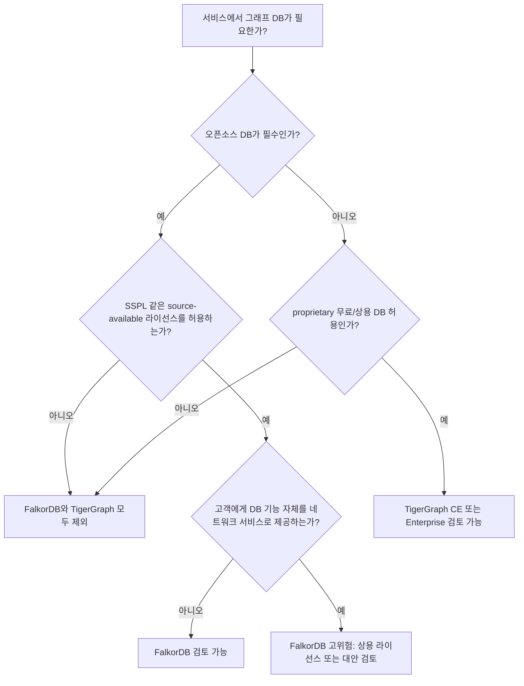
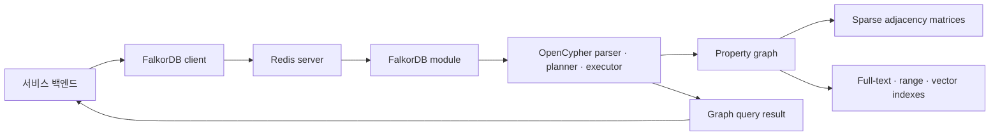
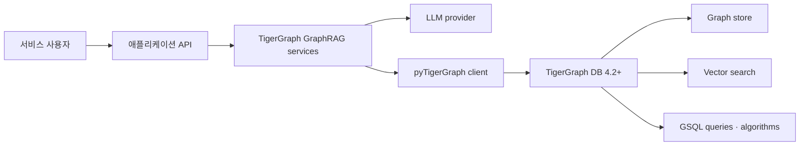

# FalkorDB vs TigerGraph 서비스 그래프 DB 채택 검토

작성일: 2026-06-07

## 결론 요약

특정 서비스에서 "오픈소스로 그래프 DB를 사용한다"는 요구가 엄격하다면, FalkorDB와 TigerGraph 모두 깔끔한 선택지는 아니다. FalkorDB는 DB 서버 소스가 공개되어 있고 직접 빌드 및 self-host가 가능하지만 라이선스가 SSPLv1이다. TigerGraph는 Community Edition을 무료로 제공하지만 DB 서버는 오픈소스가 아니며, GitHub의 Apache-2.0 저장소들은 GraphRAG, 에코시스템 도구, 예제, 클라이언트 주변부에 가깝다.

서비스 내부에서만 그래프 저장소로 쓰고 고객에게 DB 기능 자체를 제공하지 않는다면 FalkorDB는 기술적으로 검토할 수 있다. 다만 SSPLv1은 네트워크 서비스 제공 시 의무가 커질 수 있어 법무 검토가 필요하다. TigerGraph는 무료 Community Edition 또는 상용 라이선스 조건을 받아들일 수 있을 때만 검토 대상이며, "오픈소스 DB" 요건을 만족시키지는 못한다.

## 판단 매트릭스

| 항목 | FalkorDB | TigerGraph |
|---|---|---|
| DB 서버 소스 공개 | 공개. `src/` 아래 C 기반 서버 모듈 코드 확인 | 공개된 DB 서버 소스 확인 불가 |
| 주요 공개 repo | `FalkorDB/FalkorDB` | `tigergraph/ecosys`, `tigergraph/graphrag` 등 주변 도구 |
| 라이선스 | SSPLv1 | DB는 TigerGraph 약관. 주변 repo는 Apache-2.0 |
| 오픈소스 정책 적합성 | 엄격한 OSI 오픈소스 기준에는 부적합으로 보는 것이 안전 | DB 서버 기준 부적합 |
| 서비스 내부 저장소 사용 | 가능성 있음. SSPL 해석과 사용 형태 검토 필요 | Community Edition 또는 상용 약관 범위에서만 가능 |
| 고객에게 DB 기능 제공 | 고위험. SSPL Section 13의 Service Source Code 공개 의무 가능 | 약관상 제3자 제공, hosted service, sublicensing 제한 검토 필요 |
| GraphRAG 적합성 | Cypher, vector procedure, low-latency knowledge graph 지향 | GraphRAG repo 존재. TigerGraph DB 4.2+와 vector 기능 전제 |
| 최종 판단 | "source-available self-host graph DB"로는 검토 가능 | "무료 proprietary graph DB" 또는 "상용 graph DB"로 분류 |

## 서비스 시나리오별 채택 가능성

### 1. 내부 그래프 저장소로만 사용하는 서비스

예: 추천, 권한 관계, 사기 탐지, 지식 그래프, GraphRAG 검색을 위해 백엔드 내부에서만 graph traversal을 수행하고, 고객에게는 일반 애플리케이션 API만 제공하는 경우.

- FalkorDB: 기술적으로 가장 현실적인 후보이다. Redis module로 로드되고 OpenCypher, full-text, vector similarity search를 지원한다. 다만 SSPLv1이므로 "서비스의 주된 가치가 FalkorDB 기능 제공인지", "고객이 원격으로 DB 기능과 상호작용하는지"를 법무와 확인해야 한다.
- TigerGraph: Community Edition은 무료로 설치할 수 있지만 DB 서버는 object code 사용권이다. TigerGraph 약관에 따른 내부 사용 범위, 데이터 크기 제한, support 부재, benchmark 공개 제한을 수용해야 한다.

### 2. 고객에게 graph query, graph API, tenant별 graph workspace를 제공하는 서비스

예: 사용자가 직접 Cypher/GSQL류 쿼리를 실행하거나, 노드/엣지 스키마를 관리하거나, GraphRAG graph backend 자체가 제품 가치의 핵심인 경우.

- FalkorDB: SSPLv1 Section 13 리스크가 커진다. FalkorDB의 기능을 제3자에게 서비스로 제공하면 Service Source Code 공개 의무가 발생할 수 있다. 이 범주라면 상용 라이선스 협의 또는 Apache-2.0 계열 대안을 우선 검토하는 편이 안전하다.
- TigerGraph: 오픈소스가 아니므로 "오픈소스 graph DB로 서비스 제공" 요건에는 맞지 않는다. Community Edition/Enterprise 약관상 제3자 제공, hosted service, sublicensing 제한을 확인해야 한다.

### 3. Managed Graph DB 또는 GraphRAG-as-a-Service

예: 고객이 그래프 DB 인스턴스, 그래프 쿼리 엔드포인트, graph/vector hybrid search를 서비스의 주 기능으로 사용하는 경우.

- FalkorDB: SSPL의 가장 민감한 영역이다. SSPL 문구는 프로그램 기능을 제3자에게 서비스로 제공할 때 관리, UI, API, automation, monitoring, backup, storage, hosting software까지 포함한 Service Source Code를 공개해야 한다고 규정한다.
- TigerGraph: 상용 계약 대상에 가깝다. Community Edition만으로 고객 대상 managed service를 구성하는 것은 약관 검토 없이는 부적절하다.

## FalkorDB 분석

### 프로젝트 개요

FalkorDB는 Redis module 형태로 동작하는 property graph database이다. 공식 문서와 README는 FalkorDB를 GraphRAG, knowledge graph, fraud detection, agent memory 등에 적합한 저지연 그래프 DB로 설명한다. 내부 구현은 sparse adjacency matrix와 GraphBLAS 기반 선형대수 연산을 전면에 둔다.

로컬 분석 기준:

- Clone: `.repos/FalkorDB`
- Commit: `5ffe89a`
- License: `LICENSE.txt`의 SSPLv1
- 주요 서버 코드: `.repos/FalkorDB/src`
- 실행 방식: Docker image 또는 Redis에 `falkordb.so` module load

### 핵심 특징

- Property graph model과 OpenCypher 기반 질의
- Redis protocol 기반 접근과 Redis module 배포 모델
- sparse matrix와 GraphBLAS 기반 traversal/query execution
- full-text, range index, vector similarity search procedure
- GraphRAG와 knowledge graph use case를 명시적으로 지향

### 아키텍처와 데이터 흐름

### 서비스 적용 평가

FalkorDB는 소스코드 단위 분석이 가능한 공개 DB이고, 서비스 내부 그래프 저장소로는 기능 구성이 좋다. 특히 GraphRAG나 추천처럼 "관계 탐색 + 텍스트/벡터 검색"이 필요한 서비스에서는 단일 graph DB 안에서 일부 hybrid retrieval을 구현할 수 있다.

리스크는 라이선스다. SSPLv1은 GPL류 copyleft보다 SaaS 제공 조건을 더 직접적으로 다룬다. FalkorDB를 단순 내부 persistence로 쓰는 것과, 고객이 FalkorDB 기능을 원격으로 사용하는 graph service를 제공하는 것은 라이선스 리스크가 다르다.

## TigerGraph 분석

### 프로젝트 개요

TigerGraph는 massively parallel processing 기반의 상용 graph database이다. 2026년 현재 Community Edition은 무료 graph/vector DB로 홍보되며, GraphRAG용 Apache-2.0 repository도 제공한다. 하지만 공개 GitHub repo에서 TigerGraph DB 서버 소스는 확인되지 않는다.

로컬 분석 기준:

- Clone: `.repos/tigergraph-ecosys`
- Commit: `248e6fa`
- License: Apache-2.0, 단 ecosystem repo의 software에 한정
- Clone: `.repos/tigergraph-graphrag`
- Commit: `f282932`
- License: Apache-2.0, 단 GraphRAG application/tooling에 한정
- DB 전제: TigerGraph DB 4.2+

### 핵심 특징

- GSQL 기반 graph query 및 graph algorithm ecosystem
- Community Edition에서 graph + vector 기능 제공
- GraphRAG repo는 TigerGraph DB를 graph/vector backend로 사용
- Docker Compose, Kubernetes 기반 GraphRAG 배포 예제 제공

### 아키텍처와 데이터 흐름

### 서비스 적용 평가

TigerGraph는 기술적으로는 대규모 graph analytics, graph algorithm, graph/vector 결합이 강점이다. 그러나 오픈소스 graph DB로 채택할 수 있는지는 별개의 문제다. TigerGraph Community Edition은 무료일 수 있지만 약관상 "Licensed Software"이며 object code 사용권으로 제공된다. GitHub의 Apache-2.0 코드는 GraphRAG, tutorial, connector, ecosystem 코드이지 DB 서버 자체가 아니다.

따라서 서비스의 의존성 정책이 "DB 서버가 오픈소스여야 한다"라면 TigerGraph는 제외해야 한다. 반대로 proprietary dependency를 허용하고, Community Edition의 제한 또는 Enterprise 계약을 받아들일 수 있다면 후보가 될 수 있다.

## 경쟁 및 대안

| 대안 | 라이선스 관점 | 적합한 경우 | 주의점 |
|---|---|---|---|
| JanusGraph | Apache-2.0 | 분산 graph DB, Cassandra/HBase backend 활용 | 운영 복잡도와 TinkerPop/Gremlin 생태계 학습 필요 |
| Apache HugeGraph | Apache-2.0 | Apache 재단 계열 graph DB 선호 | 성숙도와 운영 사례 확인 필요 |
| NebulaGraph | Apache-2.0 | 분산 graph DB와 C++ 기반 성능 요구 | nGQL 생태계와 운영 모델 학습 필요 |
| CozoDB | MPL-2.0 | embedded, Datalog, 로컬 graph query | 범용 graph DB 서버라기보다 embedded relational/graph engine에 가까움 |
| Neo4j Community | GPL 계열 | Cypher 생태계와 개발 생산성 우선 | 상용 기능과 라이선스 경계 검토 필요 |

## 최종 권고

1. "서비스 내부에서만 쓰는 graph DB"이고 source-available 라이선스까지 허용한다면 FalkorDB를 PoC 후보로 둔다. 단, SSPLv1 해석을 법무와 확인한다.
2. "고객에게 graph DB 기능을 제공하는 서비스"라면 FalkorDB는 상용 라이선스 또는 대안 DB 검토가 필요하다.
3. "오픈소스 DB 서버"가 필수 조건이면 TigerGraph는 제외한다. TigerGraph는 무료 Community Edition과 Apache-2.0 주변 repo가 있을 뿐, DB 서버 자체는 proprietary로 보는 것이 맞다.
4. GraphRAG 기능만 빠르게 실험하려면 TigerGraph GraphRAG repo는 참고 가치가 있다. 하지만 이 repo의 Apache-2.0 라이선스가 TigerGraph DB까지 오픈소스로 만드는 것은 아니다.
5. 엄격한 오픈소스 정책과 상용 서비스 배포를 동시에 만족해야 한다면 JanusGraph, Apache HugeGraph, NebulaGraph를 우선 비교하는 것이 더 안전하다.

## 참고 자료

- [FalkorDB GitHub](https://github.com/FalkorDB/FalkorDB)
- [FalkorDB Docs](https://docs.falkordb.com/)
- [FalkorDB SSPLv1 license](https://github.com/FalkorDB/FalkorDB/blob/master/LICENSE.txt)
- [TigerGraph Software Subscription Agreement](https://www.tigergraph.com/license-agreement/)
- [TigerGraph Community Edition](https://www.tigergraph.com/community-edition/)
- [TigerGraph GraphRAG GitHub](https://github.com/tigergraph/graphrag)
- [TigerGraph Ecosystem GitHub](https://github.com/tigergraph/ecosys)
