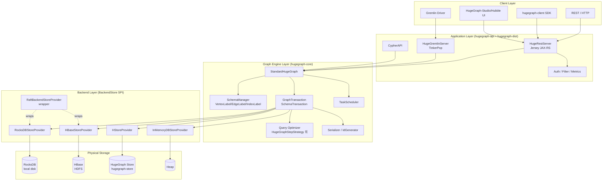
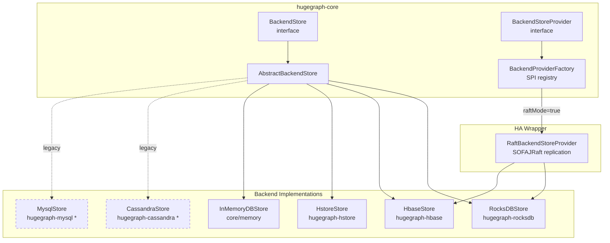
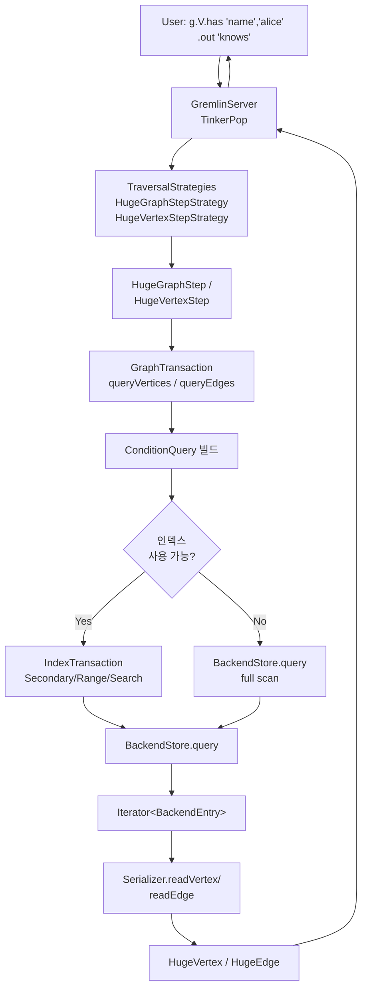

# Apache HugeGraph 프로젝트 분석

> 소스코드 기반 아키텍처 분석 문서. 분석 대상 버전: `1.7.0` (pom.xml `<revision>` 기준).

---

## 1. 프로젝트 개요

### 1.1 정의

**Apache HugeGraph**는 Java로 구현된 오픈소스 분산 그래프 데이터베이스로, **TinkerPop 3 Gremlin 표준**을 완전 지원하며 **OLTP + OLAP** 워크로드를 모두 타깃으로 한다. 공식 소개에 따르면 "1,000억 개(100+ billion) 이상의 정점과 간선"을 다룰 수 있도록 설계된, **플러그러블 백엔드 스토리지** 기반 그래프 엔진이다.

### 1.2 해결하려는 문제

- **대규모 연결 데이터 분석**: 금융 사기 탐지, 지식 그래프, 보안 관제, 추천 시스템 등 수십억~수천억 엣지 규모의 그래프를 질의해야 하는 환경에서, 기존 RDB는 다중 조인 비용 때문에 한계가 있다.
- **스토리지 종속성 탈피**: Neo4j처럼 자체 스토리지에 묶이지 않고, 이미 운영 중인 RocksDB / HBase / Cassandra 같은 스토리지 위에 그래프 계층을 올리고 싶다.
- **표준 API**: Apache TinkerPop Gremlin 생태계의 자산(드라이버, 쿼리, 알고리즘)을 재사용하면서, Cypher나 REST로도 접근하고 싶다.

### 1.3 역사적 맥락

- **2016년** Baidu 내부 프로젝트로 시작. 금융 사기 탐지 파이프라인의 그래프 백엔드로 설계됨.
- **2017년** 오픈소스로 공개(`inceptionYear=2017`, pom.xml L39).
- **2021년 9월** Apache Software Foundation **인큐베이션** 프로젝트로 편입 (`org.apache.hugegraph` 패키지 네임스페이스).
- **2024~2025** TLP(Top-Level Project) 졸업 트랙. 저장소가 `hugegraph-server`, `hugegraph-pd`, `hugegraph-store` 등 **분산 컴포넌트** 중심으로 재편됨.

### 1.4 메타데이터

| 항목 | 값 |
|---|---|
| **공식명** | Apache HugeGraph (Incubating) |
| **GitHub** | https://github.com/apache/hugegraph |
| **홈페이지** | https://hugegraph.apache.org/ |
| **라이선스** | Apache License 2.0 |
| **주요 언어** | Java 11 (`maven.compiler.source=11`, pom.xml L94) |
| **빌드 시스템** | Apache Maven (multi-module POM, `revision=1.7.0`) |
| **쿼리 언어** | Gremlin(TinkerPop 3), Cypher(제한적), REST |
| **주요 백엔드** | RocksDB, HBase, HStore(자체), In-Memory *(1.7.0 기준 지원 목록)* |
| **탄생** | 2016 Baidu → 2021 ASF Incubating |
| **핵심 모듈 수** | 15+ Maven 서브모듈 |

---

## 2. 핵심 특징 및 차별점

### 2.1 Apache TinkerPop 3 완전 호환

`HugeGraph` 인터페이스는 **`org.apache.tinkerpop.gremlin.structure.Graph`을 직접 상속**한다.

```java
// hugegraph-server/hugegraph-core/src/main/java/org/apache/hugegraph/HugeGraph.java L71
public interface HugeGraph extends Graph {
    HugeGraph hugegraph();
    SchemaManager schema();
    ...
}
```

즉, TinkerPop 생태계의 **Gremlin Console, Gremlin Driver, OLAP(Spark/Giraph) 커넥터**를 그대로 쓸 수 있다. 이는 독자 바이너리 프로토콜에 갇히는 Neo4j Bolt와 결정적으로 다른 지점이다.

### 2.2 플러그러블(Pluggable) 백엔드 스토리지

HugeGraph의 가장 큰 아키텍처적 특징은 **스토리지-엔진 분리(storage-engine decoupling)**다. `BackendStore`라는 SPI(Service Provider Interface)를 통해 여러 스토리지를 동일한 그래프 의미론 위에 꽂을 수 있다. 1.7.0에서는 아래와 같이 허용 백엔드 목록이 명시돼 있다.

```java
// hugegraph-core/.../backend/store/BackendProviderFactory.java L47
private static final List<String> ALLOWED_BACKENDS =
        List.of("memory", "rocksdb", "hbase", "hstore");
```

> 주: 1.7.0 이전 버전은 Cassandra / ScyllaDB / MySQL / PostgreSQL / Palo도 지원했으며, 현재도 `hugegraph-server/hugegraph-cassandra` 등 코드 모듈은 리포지토리에 남아 있다(아래 디렉터리 트리 참고).

### 2.3 OLTP + OLAP 이중 엔진

- **OLTP**: Gremlin/REST 질의는 `GraphTransaction`을 통해 단건·소량 탐색으로 처리.
- **OLAP**: `hugegraph-computer`(별도 저장소)와 연동해 대규모 그래프 배치 알고리즘(PageRank, WCC, Louvain 등)을 실행.

### 2.4 다중 쿼리 인터페이스: Gremlin + Cypher + REST

단일 프로세스(`HugeGraphServer`)에서 `GremlinServer`와 `RestServer`를 모두 띄운다.

```java
// hugegraph-dist/.../HugeGraphServer.java L37~93
public class HugeGraphServer {
    private final RestServer restServer;
    private final GremlinServer gremlinServer;
    ...
    this.restServer  = HugeRestServer.start(restServerConf, hub);
    this.gremlinServer = HugeGremlinServer.start(gremlinServerConf, graphsDir, hub);
}
```

Cypher 지원은 `hugegraph-api/src/main/java/org/apache/hugegraph/api/cypher/CypherAPI.java`에 REST 엔드포인트로 얹혀 있으며 내부적으로 Gremlin으로 변환/대응된다.

### 2.5 수백억 간선 스케일 목표

pom.xml의 프로젝트 description이 이를 직접 선언한다.

```xml
<!-- pom.xml L28-31 -->
<description>
    HugeGraph is a fast-speed and highly scalable graph database that supports
    more than 100 billion data, high performance and scalability
    (Include OLTP Engine & REST-API & Backends)
</description>
```

### 2.6 Raft 기반 고가용성 옵션

`BackendProviderFactory.open()`에서 `raftMode` 플래그가 켜져 있으면 기반 스토리지를 `RaftBackendStoreProvider`로 감싼다.

```java
// BackendProviderFactory.java L62-68
boolean raftMode = config.get(CoreOptions.RAFT_MODE);
BackendStoreProvider provider = newProvider(config);
if (raftMode) {
    LOG.info("Opening backend store '{}' in raft mode for graph '{}'", backend, graph);
    provider = new RaftBackendStoreProvider(params, provider);
}
```

내부적으로 **SOFAJRaft**(`com.alipay.remoting`, `HugeGraph.java` L66 import)를 사용해 쓰기 로그를 복제한다.

### 2.7 풍부한 인덱스 타입

Secondary / Range / Search(Full-text) / Shard / Unique 다섯 종류의 인덱스를 스키마 DSL로 선언할 수 있다(`schema/IndexLabel.java`).

---

## 3. 아키텍처 분석

### 3.1 전체 레이어드 아키텍처

HugeGraph 서버는 **App Layer (API/Gremlin/Cypher) → Graph Engine Layer (Core) → Backend Layer (Store SPI)** 의 세 층으로 뚜렷하게 분리된다.



### 3.2 플러그러블 백엔드 SPI 구조

`BackendStore`는 데이터베이스-로우-레벨 오퍼레이션을 추상화한 인터페이스다. 모든 백엔드 구현체는 이 인터페이스를 구현하고, `BackendStoreProvider`가 팩토리 역할을 한다.

```java
// hugegraph-core/.../backend/store/BackendStore.java L32-93
public interface BackendStore {
    String store();
    String database();
    BackendStoreProvider provider();

    void open(HugeConfig config);
    void close();
    void init();
    void clear(boolean clearSpace);
    void truncate();

    // 쓰기
    void mutate(BackendMutation mutation);
    // 읽기
    Iterator<BackendEntry> query(Query query);
    Number queryNumber(Query query);

    // 트랜잭션
    void beginTx();
    void commitTx();
    void rollbackTx();

    BackendFeatures features();
}
```

백엔드별로 `BackendEntry`(key-value 페어) 직렬화 전략만 달리 구현하면 동일한 그래프 엔진이 그 위에서 동작한다.



`*` 표시된 모듈(`hugegraph-cassandra`, `hugegraph-mysql`, `hugegraph-postgresql`, `hugegraph-scylladb`, `hugegraph-palo`)은 1.7.0 `ALLOWED_BACKENDS` 목록에서 제거되었으나 소스 트리에는 유지되어 있다. `BackendProviderFactory` L36-40 주석:

```java
/*
 * BREAKING CHANGE:
 * since 1.7.0, only "hstore, rocksdb, hbase, memory" are supported for backend.
 * if you want to use cassandra, mysql, postgresql, cockroachdb or palo as backend,
 * please find a version before 1.7.0 of apache hugegraph for your application.
 */
```

### 3.3 질의 실행 흐름

Gremlin 트래버설이 들어온 뒤 어떻게 `BackendStore` 레벨까지 내려가는지 보자.



핵심은 TinkerPop 스텝을 HugeGraph 전용 스텝으로 **리라이팅(`TraversalStrategy`)** 하여, naive한 `V().has().filter()` 체인을 **인덱스 기반 푸시다운 쿼리(`ConditionQuery`)** 로 접어 넣는다는 점이다. `HugeGraph.java`에서 등록되는 전략들:

```java
// HugeGraph.java import L52-55
import org.apache.hugegraph.traversal.optimize.HugeCountStepStrategy;
import org.apache.hugegraph.traversal.optimize.HugeGraphStepStrategy;
import org.apache.hugegraph.traversal.optimize.HugePrimaryKeyStrategy;
import org.apache.hugegraph.traversal.optimize.HugeVertexStepStrategy;
```

### 3.4 트랜잭션 모델

HugeGraph는 **MVCC 기반이 아닌 백엔드 위임 + 커밋-버퍼 방식**이다. `GraphTransaction`은 변경 사항을 in-memory `BackendMutation`에 쌓아두다가 `commit()` 시점에 `BackendStore.mutate()`로 flush한다.

- `beginTx()` → 트랜잭션 컨텍스트 생성
- 내부적으로 `addedVertices`, `removedVertices`, `addedEdges`, `updatedEdgeProps` 맵으로 버퍼링
- `commitTx()` → `BackendMutation` 빌드 후 백엔드 전달
- 인덱스 업데이트는 `IndexTransaction`에서 **2단계 커밋**처럼 함께 진행

---

## 4. 기술 스택

### 4.1 언어·빌드

| 레이어 | 기술 |
|---|---|
| 언어 | Java 11 (`<maven.compiler.source>11</maven.compiler.source>`, pom.xml L94) |
| 빌드 | Apache Maven multi-module, `revision`=**1.7.0** (pom.xml L90) |
| 부모 POM | `org.apache:apache:23` (pom.xml L33-37) |
| 로깅 | Log4j2 / SLF4J |
| 보조 | Lombok 1.18.30 (pom.xml L92), Jackson, Guava, Netty |

### 4.2 주요 의존성

- **Apache TinkerPop 3**: `gremlin-core`, `gremlin-server`, `gremlin-driver` — 그래프 API 표준
- **JAX-RS / Jersey**: REST API 구현(`hugegraph-api`)
- **RocksDB JNI**: `org.rocksdb:rocksdbjni` — 기본 임베디드 백엔드
- **HBase Client**: HBase 백엔드
- **SOFAJRaft (alipay)**: Raft 복제 (`com.alipay.remoting.rpc.RpcServer`, `HugeGraph.java` L66)
- **hugegraph-commons**: 내부 공통 라이브러리 (`hugegraph-common`, `hugegraph-rpc`)

### 4.3 디렉터리 트리 (1.7.0)

```
hugegraph/
├── pom.xml                      (root aggregator POM, revision=1.7.0)
├── README.md
├── docker/                      (공식 Docker 이미지)
├── install-dist/                (tar.gz 배포 산출물)
├── hugegraph-commons/
│   ├── hugegraph-common/        (유틸·설정·타입)
│   └── hugegraph-rpc/           (내부 RPC)
├── hugegraph-pd/                (Placement Driver – 메타/샤드 관리)
├── hugegraph-store/             (분산 스토리지 노드, HStore 백엔드)
├── hugegraph-cluster-test/
└── hugegraph-server/            ★ 단일 노드 서버 ★
    ├── hugegraph-core/          ← 그래프 엔진 + BackendStore SPI
    ├── hugegraph-api/           ← REST·Cypher·Gremlin API
    ├── hugegraph-dist/          ← HugeGraphServer 엔트리포인트
    ├── hugegraph-rocksdb/       ← RocksDB 백엔드 구현
    ├── hugegraph-hbase/         ← HBase 백엔드
    ├── hugegraph-hstore/        ← 자체 분산 스토리지 클라이언트
    ├── hugegraph-cassandra/     (legacy, 1.7.0 미활성)
    ├── hugegraph-scylladb/      (legacy)
    ├── hugegraph-mysql/         (legacy)
    ├── hugegraph-postgresql/    (legacy)
    ├── hugegraph-palo/          (legacy, Baidu Palo/Doris)
    ├── hugegraph-example/
    └── Dockerfile
```

리포지토리 확장에서 주목할 점은 **`hugegraph-pd`와 `hugegraph-store`의 분리**다. 이는 TiDB/CockroachDB 식 "PD(Placement Driver) + 스토리지 노드" 아키텍처 패턴의 도입이며, 1.x 후반부터 HugeGraph가 **진정한 수평 분산 DB**로 진화하고 있음을 보여준다.

---

## 5. 핵심 코드 분석

### 5.1 모듈별 책임

| 모듈 | 책임 | 대표 패키지/클래스 |
|---|---|---|
| **hugegraph-core** | 그래프 모델, 스키마, 트랜잭션, 쿼리, 백엔드 SPI | `org.apache.hugegraph.*`, `backend.store`, `backend.tx`, `schema`, `structure`, `traversal.optimize` |
| **hugegraph-api** | JAX-RS REST 리소스, Cypher 어댑터, 필터 | `api.graph.VertexAPI`, `api.graph.EdgeAPI`, `api.cypher.CypherAPI`, `api.gremlin.GremlinAPI` |
| **hugegraph-dist** | Gremlin+REST 서버 부트스트랩, 백엔드 등록 | `dist.HugeGraphServer`, `dist.RegisterUtil` |
| **hugegraph-rocksdb** | RocksDB `BackendStore` 구현 | `backend.store.rocksdb.RocksDBStore`, `RocksDBStoreProvider`, `RocksDBTables` |
| **hugegraph-hbase** | HBase `BackendStore` 구현 | `backend.store.hbase.*` |
| **hugegraph-hstore** | HugeGraph 분산 스토어 클라이언트 | `backend.store.hstore.*` |

### 5.2 핵심 인터페이스 1: `HugeGraph`

`org.apache.tinkerpop.gremlin.structure.Graph`를 상속하여 TinkerPop 호환을 보장하되, HugeGraph 특유의 기능(스키마, 인증, Raft, 작업 스케줄러, 메타 관리)을 메서드로 노출한다.

```java
// hugegraph-core/.../HugeGraph.java L69-90
/**
 * Graph interface for Gremlin operations
 */
public interface HugeGraph extends Graph {
    HugeGraph hugegraph();
    void kvStore(KvStore kvStore);
    KvStore kvStore();
    SchemaManager schema();
    ...
}
```

구현체는 `StandardHugeGraph`(동일 디렉터리)이다. 여기가 실제 TaskScheduler, SchemaManager, GraphTransaction 팩토리를 보관하는 "God object"급 중추다.

### 5.3 핵심 인터페이스 2: `BackendStore` / `BackendStoreProvider`

3.2절에 전체 메서드를 인용했다. 핵심 포인트는:

- **스토리지 중립 엔티티 `BackendEntry`**: 모든 백엔드는 그래프 객체를 `BackendEntry`(논리적 key + columns)로 직렬화하여 저장한다. 따라서 RocksDB는 `(key,value)`, HBase는 `(row,family,qualifier)`로 매핑만 맞추면 된다.
- **`BackendMutation`**: 배치 쓰기 단위. `put`, `remove`, `eliminate`, `append` 네 가지 액션.
- **`Query`**: 읽기 표현 객체. `IdQuery`, `ConditionQuery`, `IdPrefixQuery` 등 계층 구조로 쿼리 푸시다운을 지원.

### 5.4 `BackendProviderFactory` — SPI 진입점

```java
// hugegraph-core/.../backend/store/BackendProviderFactory.java L54-71
public static BackendStoreProvider open(HugeGraphParams params) {
    HugeConfig config = params.configuration();
    String backend = config.get(CoreOptions.BACKEND).toLowerCase();
    ...
    String graph = params.graph().graphSpace()
                 + "/" + config.get(CoreOptions.STORE);
    boolean raftMode = config.get(CoreOptions.RAFT_MODE);

    BackendStoreProvider provider = newProvider(config);
    if (raftMode) {
        provider = new RaftBackendStoreProvider(params, provider);
    }
    provider.open(graph);
    return provider;
}
```

백엔드 선택은 순수 런타임 설정값(`backend=rocksdb` 등)이며, `newProvider()`는 `providers` 맵(Class registry)에서 클래스를 꺼내 리플렉션으로 인스턴스화한다. 각 백엔드 모듈은 `RegisterUtil.registerBackends()` 단계(아래 참고)에서 자신을 이 맵에 등록한다.

### 5.5 `HugeGraphServer` — 부트스트랩

```java
// hugegraph-dist/.../HugeGraphServer.java L46-50, 120-146
public static void register() {
    RegisterUtil.registerBackends();
    RegisterUtil.registerPlugins();
    RegisterUtil.registerServer();
}
...
public static void main(String[] args) throws Exception {
    if (args.length != 2) {
        throw new HugeException("Start HugeGraphServer need to pass 2 parameters, " +
                "they are the config files of GremlinServer and RestServer, " +
                "for example: conf/gremlin-server.yaml conf/rest-server.properties");
    }
    HugeGraphServer.register();
    HugeGraphServer server = new HugeGraphServer(args[0], args[1]);
    ...
}
```

기동 절차:
1. `registerBackends()` — 클래스패스의 모든 `BackendStoreProvider` 구현체를 `BackendProviderFactory`에 등록(SPI 디스커버리).
2. `registerPlugins()` — 사용자 플러그인(커스텀 analyzer, serializer) 로딩.
3. `HugeRestServer.start()` → JAX-RS/Jersey + Netty.
4. `HugeGremlinServer.start()` → TinkerPop Gremlin Server.
5. `MemoryMonitor` 시작 (힙 압박 감시).
6. ShutdownHook 등록.

### 5.6 `GraphTransaction` — 쓰기·질의 중심

```java
// hugegraph-core/.../backend/tx/GraphTransaction.java L38-60 (imports 발췌)
import org.apache.hugegraph.backend.page.QueryList;
import org.apache.hugegraph.backend.query.ConditionQuery;
import org.apache.hugegraph.backend.query.ConditionQueryFlatten;
import org.apache.hugegraph.backend.store.BackendMutation;
import org.apache.hugegraph.backend.store.BackendStore;
...
```

역할 요약:
- **쓰기 버퍼**: `addedVertices`, `removedVertices`, `addedEdges`, `removedEdges`, `addedPropKeys`, `updatedEdgeProps` 등의 `Map<Id, ...>` 필드에 누적.
- **질의**: `queryVertices(ConditionQuery)`, `queryEdges(ConditionQuery)` — 인덱스 활용 여부를 판단해 `IndexTransaction`에 위임하거나 `BackendStore.query`로 직행.
- **페이징**: `QueryList`, `PageInfo`로 `ConditionQueryFlatten` 결과를 스트리밍.
- **커밋**: `BackendMutation` 하나로 packaging → `store.mutate(mutation)`.

### 5.7 RocksDB 백엔드 구현 예

```java
// hugegraph-rocksdb/.../backend/store/rocksdb/RocksDBStore.java (L18~)
package org.apache.hugegraph.backend.store.rocksdb;
...
public abstract class RocksDBStore extends AbstractBackendStore<Session> {
    ...
}
```

동일 패키지에는 역할별로 잘게 나뉜 구성요소가 있다(디렉터리 목록 참조):

- `RocksDBStoreProvider` — 팩토리(`BackendStoreProvider` 구현)
- `RocksDBSessions` / `RocksDBStdSessions` — 세션/커넥션 풀 추상화
- `RocksDBTable` / `RocksDBTables` — 그래프 엔티티별 ColumnFamily 매핑(Vertex/Edge/Index/Schema)
- `RocksDBIngester` — SSTable bulk load 지원
- `RocksDBOptions` — Options/Tuning 파라미터
- `RocksDBIteratorPool` — 재사용 가능한 Iterator 풀 (쿼리 고속화)

설계 의도는 "하나의 RocksDB 인스턴스 안에 여러 ColumnFamily를 두어 **정점 테이블, 엣지 Out/In 테이블, 인덱스 테이블, 스키마 테이블**을 물리적으로 분리"하는 것이다. 이는 LSM-tree 쓰기 증폭을 테이블별로 격리하는 효과가 있다.

### 5.8 REST API 레이어 — `VertexAPI`

```java
// hugegraph-api/.../api/graph/VertexAPI.java L28-56 (imports 발췌)
import org.apache.hugegraph.api.API;
import org.apache.hugegraph.api.filter.CompressInterceptor.Compress;
import org.apache.hugegraph.api.filter.DecompressInterceptor.Decompress;
import org.apache.hugegraph.api.filter.StatusFilter.Status;
import org.apache.hugegraph.core.GraphManager;
...
import com.codahale.metrics.annotation.Timed;
import io.swagger.v3.oas.annotations.Parameter;
```

`VertexAPI`는 JAX-RS 애노테이션(`@Path("graphs/{graph}/graph/vertices")`)으로 정점 CRUD를 노출한다. OpenAPI(Swagger), Dropwizard Metrics, Gzip 압축, 커스텀 StatusFilter가 데코레이터로 스택된다. `GraphManager.graph(graphName)`으로 `HugeGraph` 인스턴스를 획득해 엔진 레이어로 위임하는 얇은 파사드다.

---

## 6. API 및 인터페이스

HugeGraph는 **네 가지 층**의 외부 인터페이스를 제공한다.

### 6.1 REST API (HugeGraph Server)

Base path: `http://host:8080/apis/graphs/{graph}/`

| 리소스 | 엔드포인트 | 구현 클래스 |
|---|---|---|
| Schema — PropertyKey | `.../schema/propertykeys` | `api.schema.PropertyKeyAPI` |
| Schema — VertexLabel | `.../schema/vertexlabels` | `api.schema.VertexLabelAPI` |
| Schema — EdgeLabel | `.../schema/edgelabels` | `api.schema.EdgeLabelAPI` |
| Schema — IndexLabel | `.../schema/indexlabels` | `api.schema.IndexLabelAPI` |
| Vertex CRUD | `.../graph/vertices` | `api.graph.VertexAPI` |
| Edge CRUD | `.../graph/edges` | `api.graph.EdgeAPI` |
| Batch | `.../graph/vertices/batch` | `api.graph.BatchAPI` |
| Traversers | `.../traversers/{algo}` | `api.traversers.*` (shortestpath, kout, rays…) |
| Gremlin | `/apis/gremlin` | `api.gremlin.GremlinAPI` |
| Cypher | `.../cypher` | `api.cypher.CypherAPI` |
| Metrics | `/apis/metrics` | `api.metrics.*` |
| Auth | `/apis/auth/*` | `api.auth.*` |

### 6.2 Gremlin Server

`HugeGraphServer` 기동 시 `HugeGremlinServer.start()`로 Bolt-유사한 WebSocket 포트(기본 8182)를 연다. 표준 TinkerPop 드라이버(`org.apache.tinkerpop:gremlin-driver`)로 바로 접속 가능.

### 6.3 Cypher 지원

`api.cypher.CypherAPI`가 Neo4j Cypher 쿼리 문자열을 받아 내부적으로 변환한다. `CypherClient`가 어댑터, `CypherManager`가 세션 풀을 관리한다. 완전한 Cypher 스펙 지원은 아니며, 주로 마이그레이션/간단 질의용이다.

### 6.4 Java Client SDK

별도 저장소 `hugegraph-toolchain` 산하의 `hugegraph-client`가 공식 Java SDK다. REST 위에 래퍼로 구현됐다.

---

## 7. 확장성 및 플러그인

HugeGraph의 확장 포인트는 크게 네 종류다.

### 7.1 Backend Storage Driver (SPI)

가장 중요한 확장 포인트. 새 백엔드를 지원하려면:

1. `BackendStoreProvider` 구현 — Store 인스턴스화
2. `AbstractBackendStore` 상속 — `mutate`/`query`/`init`/`clear` 구현
3. `BackendEntry` 직렬화 전략 — 그래프 엔티티 ↔ KV/Row 매핑
4. `RegisterUtil`에 등록 (`providers.put("myback", MyStoreProvider.class)`)

`hugegraph-rocksdb`, `hugegraph-hbase` 모듈이 참고 구현이다. 1.7.0에서 Cassandra/MySQL 등이 `ALLOWED_BACKENDS`에서 빠졌다는 사실은 이 SPI가 **살아있는 확장점**임을 반대로 증명한다(외부 백엔드가 선택적으로 on/off 가능).

### 7.2 Serializer

`org.apache.hugegraph.backend.serializer` 패키지의 `AbstractSerializer`를 상속해 커스텀 인코딩(Protobuf, MessagePack 등)을 끼울 수 있다. 기본은 `BinarySerializer`와 `TextSerializer`.

### 7.3 Analyzer (Full-text 검색용)

`org.apache.hugegraph.analyzer` 패키지에 IK, Jieba, HanLP, SmartCN 등 중국어 토크나이저가 내장돼 있으며, `Analyzer` 인터페이스를 구현해 교체 가능하다. Search Index의 핵심 컴포넌트.

### 7.4 TraversalStrategy (쿼리 최적화 훅)

`HugeGraph.java` L52-55에서 본 네 개의 전략이 TinkerPop `TraversalStrategies`에 등록되는 지점이 공식 확장 포인트다. 사용자가 `HugeXxxStrategy`를 추가 구현해 특정 패턴의 Gremlin 질의를 HugeGraph 인덱스로 강제 리다이렉트할 수 있다.

### 7.5 Plugin Loader

`RegisterUtil.registerPlugins()`는 `hugegraph.plugins` 설정으로 지정된 FQCN 목록을 `ServiceLoader`로 로드한다. 플러그인은 `HugeGraphPlugin` 인터페이스를 구현해 시작/종료 훅에 로직을 추가할 수 있다.

---

## 8. 성능 특성

### 8.1 스케일 목표

프로젝트 설명문이 **100B+ data** 목표를 공표한다. 실전 적재 사례(Baidu 사기 탐지, 공공 지식 그래프)에서 수십억 엣지 규모의 운영 레퍼런스가 보고돼 있다.

### 8.2 인덱스 전략

| 인덱스 타입 | 용도 | 구현 포인트 |
|---|---|---|
| **Secondary** | 동등 조건(`=`) | 별도 인덱스 테이블에 정규화된 값 → 정점/엣지 ID 매핑 |
| **Range** | 숫자/날짜 범위(`<`, `>`, BETWEEN) | 정렬 키로 range scan |
| **Search** | 전문 검색(LIKE, CONTAINS) | Analyzer로 토큰화한 후 역색인 |
| **Shard** | 복합/해시 파티셔닝 | 여러 필드 결합으로 샤드 키 구성 |
| **Unique** | 유일성 제약 | 쓰기 시점 검증 |

인덱스 선택은 `ConditionQuery.OptimizedType`(`GraphTransaction.java` L53 import)을 통해 옵티마이저가 자동 결정한다. 질의 시 "인덱스 쿼리 → ID 리스트 → 실제 엔티티 조회"의 2단계 구조.

### 8.3 백엔드별 성능 프로파일

| 백엔드 | 쓰기 처리량 | 읽기 지연 | 스케일 | 운영 복잡도 | 적합 상황 |
|---|---|---|---|---|---|
| **RocksDB** | 매우 높음 | 낮음(로컬) | 단일 노드 | 낮음 | 단일 서버, 임베디드, PoC, 중규모 |
| **HBase** | 높음 | 중간 | 매우 높음 | 높음 | 기존 HDFS/HBase 자산 재활용, 수백억+ |
| **HStore** | 높음 | 낮음 | 높음(자체 분산) | 중간 | HugeGraph 네이티브 클러스터 |
| **InMemory** | — | 극히 낮음 | 힙 한계 | 없음 | 테스트, 튜토리얼 |

### 8.4 트랜잭션 모델과 제약

- **Write-through commit buffer**: 트랜잭션은 in-memory 버퍼링 → 커밋 시 단발성 mutation. 장시간 트랜잭션은 힙 폭발 위험.
- **Raft 모드**: 강일관성 쓰기 복제는 가능하나 지연 ↑.
- **OLAP 경로는 별도**: `hugegraph-computer`에서 분리 실행 → OLTP 경로가 간섭 받지 않음.

### 8.5 알려진 제약

- 글로벌 ACID 트랜잭션(multi-graph/backend 간)은 지원하지 않음.
- OLAP 대규모 GAS(Gather-Apply-Scatter) 알고리즘은 JVM 힙 특성상 네이티브 GraphBLAS(FalkorDB) 대비 CPU 효율 ↓.
- Cypher는 부분 지원.

---

## 9. 배포 및 운영

### 9.1 배포 옵션

1. **tar.gz** (`install-dist/`) — 수동 설치. `bin/start-hugegraph.sh` → 내부에서 `HugeGraphServer` `main()` 호출.
2. **Docker** — `hugegraph-server/Dockerfile` 또는 공식 이미지 `hugegraph/hugegraph:1.x`.
3. **Kubernetes** — `hugegraph-server/hugegraph-core/src/main/java/org/apache/hugegraph/k8s/` 패키지 존재(K8s operator 연동 스캐폴딩).
4. **분산 클러스터** — `hugegraph-pd`(Placement Driver) + `hugegraph-store` 노드 다중 + `hugegraph-server` 다중. TiDB 류 3-tier 배포.

### 9.2 기동 커맨드

```bash
# install-dist 이후
$ bin/start-hugegraph.sh

# 내부적으로는
$ java -cp ... org.apache.hugegraph.dist.HugeGraphServer \
       conf/gremlin-server.yaml \
       conf/rest-server.properties
```

두 개의 config 인자가 필수(`HugeGraphServer.java` L120-128 에서 강제).

### 9.3 주요 설정 파일

| 파일 | 역할 |
|---|---|
| `conf/rest-server.properties` | REST 포트, 그래프 목록(`graphs` 디렉터리), 인증 |
| `conf/gremlin-server.yaml` | TinkerPop Gremlin Server 바인딩, 스크립트 엔진 |
| `conf/graphs/hugegraph.properties` | **그래프별 백엔드/시리얼라이저/스토어 이름** |
| `conf/hugegraph-server.keystore` | TLS (옵션) |
| `conf/log4j2.xml` | 로깅 |

`hugegraph.properties` 예:

```properties
backend=rocksdb
serializer=binary
store=hugegraph
rocksdb.data_path=./rocksdb-data
rocksdb.wal_path=./rocksdb-data
```

`backend` 값이 바뀌면 `BackendProviderFactory.newProvider()`가 다른 구현을 선택하는 것이 전부다. **같은 properties 한 줄 교체로 스토리지 교체**가 HugeGraph의 DX 핵심.

### 9.4 초기화 / 스키마

첫 기동 전에 `bin/init-store.sh` 실행 → `BackendStore.init()`이 호출되어 테이블/ColumnFamily 생성. 이후 REST/Gremlin으로 스키마 등록:

```groovy
schema.propertyKey("name").asText().ifNotExist().create()
schema.vertexLabel("person").properties("name").primaryKeys("name").ifNotExist().create()
schema.edgeLabel("knows").sourceLabel("person").targetLabel("person").ifNotExist().create()
schema.indexLabel("personByName").onV("person").by("name").secondary().ifNotExist().create()
```

### 9.5 메모리 모니터

`MemoryMonitor`(`hugegraph-dist`)가 힙 사용률을 감시하다가 임계치 초과 시 진행 중 쿼리를 중단시킨다(`HugeGraphServer.java` L91-93).

---

## 10. 경쟁·비교 분석

### 10.1 직접 경쟁: JanusGraph

JanusGraph는 HugeGraph의 **가장 가까운 경쟁자**다. 설계 철학이 거의 동일하다: TinkerPop 위에서 동작하고, 백엔드 플러그러블(Cassandra/HBase/BerkeleyDB)이며, Java로 작성됐다.

| 항목 | Apache HugeGraph | JanusGraph |
|---|---|---|
| **프로젝트 상태** | Apache Incubating | Linux Foundation |
| **출신** | Baidu (2016) | Titan 포크 (2017) |
| **TinkerPop 버전** | 3.x 지원 | 3.x 지원 |
| **기본 백엔드** | RocksDB(내장, out-of-the-box) | Cassandra / HBase 필요 |
| **인덱스** | Secondary/Range/Search/Shard/Unique 내장 | 외부 Elasticsearch/Solr 연동 필수(Search) |
| **Cypher** | 부분 지원(REST) | 플러그인 필요 |
| **분산 확장** | `hugegraph-pd` + `hugegraph-store` 자체 클러스터 | 백엔드(Cassandra/HBase)에 위임 |
| **HA** | SOFAJRaft 옵션 | 백엔드 복제 의존 |
| **REST API** | 1급(JAX-RS 본체) | 비공식/Gremlin-Server 중심 |
| **한국/중국 생태계** | 활발(Baidu·한국 일부 대기업) | 글로벌 일반 |

**결론**: 빠른 단일 노드 시작(RocksDB 내장) + 풍부한 REST + 내장 인덱스가 필요하면 HugeGraph가 유리. 이미 Hadoop/Cassandra 운영 자산이 있다면 JanusGraph도 경쟁력 있음.

### 10.2 vs Neo4j

| 항목 | HugeGraph | Neo4j |
|---|---|---|
| **라이선스** | Apache 2.0 (완전 오픈) | GPLv3 Community / 상용 Enterprise |
| **쿼리 언어** | Gremlin(1급) + Cypher(보조) | Cypher(1급) + Gremlin(plugin) |
| **스토리지** | 여러 백엔드에 위임 | 자체 페이지 캐시 + store files |
| **분산** | Raft/PD/Store 계층 | Causal Cluster(Enterprise) |
| **OLAP** | hugegraph-computer | GDS(Graph Data Science) 라이브러리 |
| **UI** | HugeGraph Hubble/Studio | Neo4j Browser/Bloom |
| **생태계** | TinkerPop 생태계 | 가장 큰 독자 생태계 |
| **엔터프라이즈 지원** | 제한적 | 성숙 |

Neo4j는 "제품 성숙도 + Cypher UX"에서, HugeGraph는 "오픈 라이선스 + 다중 백엔드 + 표준 API"에서 우위.

### 10.3 vs FalkorDB / NebulaGraph (간략)

- **FalkorDB**: Redis 모듈 + GraphBLAS(희소행렬). 초저지연 GraphRAG에 최적이지만 스케일·표준성은 HugeGraph가 우위.
- **NebulaGraph**: C++ 네이티브 분산 그래프 DB. 순수 성능은 Nebula가 높을 수 있으나, TinkerPop 호환과 OSS 확장성은 HugeGraph 쪽이 유리.

### 10.4 적합 / 부적합

**적합**
- 수억~수백억 엣지 규모 지식 그래프, 사기 탐지
- 기존 HBase/RocksDB 자산을 그래프로 다시 활용하고 싶은 팀
- TinkerPop/Gremlin 스킬셋 + REST 접근 모두 필요한 폴리글랏 팀
- 중국/한국 오픈소스 스택, Apache 거버넌스 선호

**부적합**
- 수 ms 이내 초저지연 OLTP + 단순 CRUD (→ Redis/FalkorDB)
- 완전한 Cypher 호환성이 필수 (→ Neo4j, Memgraph)
- 작은 그래프 임베디드 (→ SQLite+Graph extension, TinkerGraph)

---

## 11. 종합 평가

### 11.1 강점

1. **진정한 플러그러블 백엔드 SPI** — `BackendStore`/`BackendStoreProvider` 추상화가 코드 전체에 일관되게 스며들어 있어, 백엔드 교체가 설정 한 줄이다. 엔지니어링 관점에서 깨끗한 설계.
2. **TinkerPop 표준 준수** — `HugeGraph extends Graph`로 시작해 TraversalStrategy 레벨까지 TinkerPop 기본 기계를 존중. 생태계 자산 재사용이 보장된다.
3. **다중 인터페이스** — REST(1급 JAX-RS) + Gremlin + Cypher + Java SDK. 통합 상황에서 선택지가 넓다.
4. **풍부한 인덱스** — Search 인덱스(내장 analyzer)까지 기본 제공. JanusGraph가 Elasticsearch 연동을 강제하는 것과 대비된다.
5. **운영 고려사항 내장** — Raft, MemoryMonitor, TaskScheduler, Auth, Metrics가 모두 코어에 포함. 별도 플러그인을 모으는 수고가 적다.
6. **분산 진화** — `hugegraph-pd` + `hugegraph-store` 분리 아키텍처는 장기적으로 TiDB/CockroachDB 계열 분산 DB로의 발전 가능성을 보여준다.

### 11.2 약점 / 리스크

1. **Apache Incubating** — 아직 TLP 졸업 전. 거버넌스/릴리스 캐덴스가 Neo4j/JanusGraph보다 불안정. BREAKING CHANGE(1.7.0에서 Cassandra/MySQL 제거 같은)도 종종 발생.
2. **God object 경향** — `StandardHugeGraph`/`GraphTransaction`이 책임을 많이 집어삼킨다. 코드 리뷰 난도가 높다.
3. **Cypher 지원이 얇다** — 본격 Cypher 사용자는 Neo4j/Memgraph가 현실적.
4. **문서 편차** — 영문 문서가 중국어 대비 늦게 갱신됨. 해외 커뮤니티 Q&A 밀도가 낮음.
5. **JVM 특성** — GC pause가 초저지연 케이스엔 불리. 네이티브 그래프 DB(Nebula, FalkorDB) 대비 p99 latency 한계.
6. **OLAP은 별도 저장소** — `hugegraph-computer`는 이 분석 대상 저장소 밖에 있어 end-to-end 파이프라인 구성 시 버전 정합을 별도로 관리해야 함.

### 11.3 엔지니어 관점 인사이트

- **SPI 설계가 교과서적**이다. 새 DB 엔지니어링을 학습하는 개발자에게 `BackendStore`/`BackendEntry`/`BackendMutation` 3종 세트는 "스토리지-엔진 분리"의 모범 사례로 읽을 가치가 있다. 특히 `BackendEntry`라는 중립 포맷을 중심으로 직렬화와 쿼리 푸시다운을 분리한 방식은 Calcite의 relational expression과 비슷한 냄새가 난다.
- **TinkerPop을 상속으로 끌어안는 방식**은 침식 위험이 있지만, HugeGraph는 `TraversalStrategy`를 훅 포인트로 깔끔히 분리했다. 사용자가 커스텀 최적화 규칙을 주입할 수 있는 부분이 특히 인상적이다.
- **1.7.0의 백엔드 축소**는 위험 신호이면서 동시에 "진짜 운영되는 백엔드만 유지한다"는 공학적 결정으로 읽을 수도 있다. 레거시 모듈이 소스 트리에 남아 있다는 점은 재활성화가 언제든 가능함을 뜻한다.
- **`hugegraph-pd`/`hugegraph-store` 분리**는 HugeGraph가 단순 JanusGraph 대안에서 "네이티브 분산 그래프 DB"로 자기 정체성을 바꾸려는 시도. 2.x에서 이 축이 어떻게 안정화되는지가 프로젝트의 미래를 결정할 것이다.
- **한국 엔지니어 관점**에서는, 사내 Hadoop/HBase 플랫폼 위에 그래프 워크로드를 얹고 싶거나, 중국발 데이터/스택(Baidu, Alibaba 구성요소 등)과의 친화성이 필요한 프로젝트에서 특히 채택 가치가 높다.

---

## 부록: 분석에 사용한 핵심 파일 경로

| 목적 | 파일 |
|---|---|
| 루트 POM / 버전 | `hugegraph/pom.xml` (revision=1.7.0, Java 11) |
| 최상위 그래프 인터페이스 | `hugegraph-server/hugegraph-core/src/main/java/org/apache/hugegraph/HugeGraph.java` |
| 구현체 (God object) | `.../hugegraph/StandardHugeGraph.java` |
| 팩토리 | `.../hugegraph/HugeFactory.java` |
| Backend SPI | `.../backend/store/BackendStore.java`, `BackendStoreProvider.java`, `BackendProviderFactory.java`, `AbstractBackendStore.java` |
| 엔터티·뮤테이션 | `.../backend/store/BackendEntry.java`, `BackendMutation.java` |
| 트랜잭션 | `.../backend/tx/GraphTransaction.java`, `SchemaTransaction.java`, `IndexTransaction.java` |
| 쿼리 옵티마이저 훅 | `.../traversal/optimize/HugeGraphStepStrategy.java`, `HugeVertexStepStrategy.java`, `HugeCountStepStrategy.java`, `HugePrimaryKeyStrategy.java` |
| 서버 엔트리 | `hugegraph-server/hugegraph-dist/src/main/java/org/apache/hugegraph/dist/HugeGraphServer.java` |
| 백엔드 등록 | `.../dist/RegisterUtil.java` |
| RocksDB 백엔드 | `hugegraph-server/hugegraph-rocksdb/src/main/java/org/apache/hugegraph/backend/store/rocksdb/` (RocksDBStore, RocksDBStoreProvider, RocksDBTables, RocksDBSessions 등) |
| REST API | `hugegraph-server/hugegraph-api/src/main/java/org/apache/hugegraph/api/graph/VertexAPI.java`, `EdgeAPI.java`, `BatchAPI.java` |
| Cypher 어댑터 | `.../api/cypher/CypherAPI.java`, `CypherManager.java`, `CypherClient.java` |
| Raft HA | `.../backend/store/raft/RaftBackendStoreProvider.java`, `RaftGroupManager.java` |
| 분산 컴포넌트 | `hugegraph-pd/`, `hugegraph-store/` |
