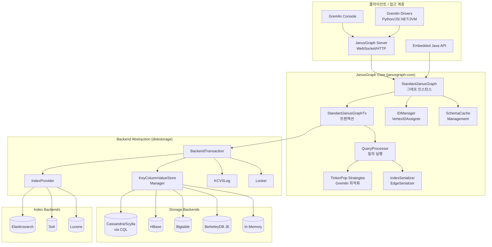

# JanusGraph 프로젝트 분석

## 1. 프로젝트 개요

| 항목 | 내용 |
|------|------|
| **프로젝트명** | JanusGraph |
| **GitHub URL** | https://github.com/JanusGraph/janusgraph |
| **공식 웹사이트** | https://janusgraph.org |
| **라이선스** | Apache License 2.0 |
| **주요 언어** | Java (JDK 8/11/17 지원) |
| **최신 버전(소스 기준)** | 1.2.0-SNAPSHOT (pom.xml) |
| **거버넌스** | Linux Foundation / LF AI & Data Foundation 산하 |
| **탄생 시점** | 2017년 (Titan 1.0의 fork) |
| **쿼리 언어** | Gremlin (Apache TinkerPop 3.7.3) |

### 프로젝트 소개

JanusGraph는 **수십억 개의 정점(vertex)과 간선(edge)을 다중 머신 클러스터에 분산 저장·질의**하기 위해 설계된 분산 그래프 데이터베이스이다. 2012년부터 이어진 Titan 프로젝트의 직계 후계자로, 2017년 Titan이 중단된 이후 Linux Foundation으로 이관되어 현재까지 개발이 이어지고 있다.

pom.xml 설명에 명시된 철학은 명확하다.

> "JanusGraph separates the concerns of graph processing and manipulation from storing the graph on disk, delegating that concern to an extensible set of persistence solutions."

즉, JanusGraph는 **자체 스토리지 엔진을 내장하지 않는다.** 대신 Apache Cassandra, ScyllaDB, HBase, BerkeleyDB JE, Google Bigtable 등 BigTable 계열 스토리지를 **플러그인** 형태로 연결하고, Elasticsearch, Solr, Lucene 같은 외부 검색 엔진을 **혼합 인덱스(Mixed Index)**로 활용하는 **"그래프 처리 레이어"**를 표방한다.

### 해결하고자 하는 문제

- **초대형 그래프의 수평 확장**: 단일 노드에 담기 어려운 수십억~수천억 규모 그래프를 분산 NoSQL 위에 얹기 위한 통합 레이어 필요
- **ACID와 대규모 확장성의 절충**: 페타바이트급 저장소를 사용하면서도 트랜잭션·일관성 보장
- **풀 텍스트/공간 검색 통합**: 그래프 인접성 탐색과 복잡한 조건 검색(range, fulltext, geo)을 함께 수행
- **Apache TinkerPop 생태계 호환**: Gremlin 쿼리 언어 및 TinkerPop 서버/드라이버 생태계 재사용

---

## 2. 핵심 특징 및 차별점

### 2.1 Pluggable Storage Backend

JanusGraph의 가장 큰 설계 결정은 **스토리지 백엔드 추상화**이다. `janusgraph-core/src/main/java/org/janusgraph/diskstorage/StandardStoreManager.java`에 등록된 공식 백엔드는 다음과 같다.

```java
public enum StandardStoreManager {
    BDB_JE("org.janusgraph.diskstorage.berkeleyje.BerkeleyJEStoreManager", "berkeleyje"),
    CQL("org.janusgraph.diskstorage.cql.CQLStoreManager", "cql"),
    HBASE("org.janusgraph.diskstorage.hbase.HBaseStoreManager", "hbase"),
    IN_MEMORY("org.janusgraph.diskstorage.inmemory.InMemoryStoreManager", "inmemory"),
    SCYLLA("org.janusgraph.diskstorage.cql.ScyllaStoreManager", "scylla");
```

즉 CQL(Cassandra/Scylla), HBase, Bigtable, BerkeleyJE, in-memory를 하나의 `KeyColumnValueStoreManager` 인터페이스로 추상화한다.

### 2.2 Pluggable Mixed Index Backend

`janusgraph-core/src/main/java/org/janusgraph/diskstorage/StandardIndexProvider.java:29`에 정의된 혼합 인덱스 백엔드:

```java
public enum StandardIndexProvider {
    LUCENE("org.janusgraph.diskstorage.lucene.LuceneIndex", "lucene"),
    ELASTICSEARCH("org.janusgraph.diskstorage.es.ElasticSearchIndex", Arrays.asList("elasticsearch", "es")),
    SOLR("org.janusgraph.diskstorage.solr.SolrIndex", "solr");
```

Composite Index는 스토리지 백엔드 자체에 저장되지만, **범위·풀텍스트·지리공간 질의**가 필요한 Mixed Index는 Elasticsearch/Solr/Lucene이 담당한다.

### 2.3 BigTable 데이터 모델 기반 인접 리스트

JanusGraph는 정점을 row key로, 간선·프로퍼티를 해당 row의 column으로 저장하는 **BigTable-style wide column model**을 채택한다. `KeyColumnValueStore` 인터페이스의 주석(`janusgraph-core/.../keycolumnvalue/KeyColumnValueStore.java:28`):

> "Interface to a data store that has a BigTable like representation of its data. In other words, the data store is comprised of a set of rows each of which is uniquely identified by a key. Each row is composed of column-value pairs."

### 2.4 Apache TinkerPop 네이티브

Gremlin 3.7.3(pom.xml 기준)을 쿼리 언어로 채택하며, `JanusGraph` 인터페이스는 `org.apache.tinkerpop.gremlin.structure.Graph`를 구현하는 `Transaction`을 상속한다 (`janusgraph-core/src/main/java/org/janusgraph/core/JanusGraph.java:94`).

### 2.5 스키마 및 타입 시스템

`JanusGraphManagement`가 제공하는 **명시적 스키마**: PropertyKey(+Cardinality), EdgeLabel(+Multiplicity), VertexLabel, Composite/Mixed Index 등을 런타임에 관리. 스키마 변경은 별도 management 트랜잭션에서 이뤄지고 `ManagementLogger`를 통해 다른 인스턴스에 전파된다.

### 2.6 분산 ID 할당

`janusgraph-core/.../graphdb/idmanagement/IDManager.java:34`의 `IDManager`는 64비트 vertex ID를 `[count | partition | padding]` 형태로 비트 패킹한다.

```java
private long constructId(long count, long partition, VertexIDType type) { ... }
//  [ 0 | count | partition | ID padding (if any) ]
```

파티션 비트를 앞쪽에 배치해 **동일 파티션의 정점이 같은 물리 노드에 집중**되도록 유도하며, 이는 슈퍼노드(super-node) 분산과 엣지-컷 최소화에 활용된다.

### 2.7 외부화된 트랜잭션 로그와 증분 인덱싱

`StandardJanusGraph`는 `KCVSLog`를 이용해 트랜잭션 로그·관리 로그·userlog를 **동일한 Key-Column-Value 저장소**에 기록한다. 이는 별도 로그 시스템 없이 인덱스 재구축·실패 복구를 가능하게 한다.

---

## 3. 아키텍처 분석

### 3.1 전체 시스템 구조

JanusGraph는 크게 **접근(Access) 레이어 — 그래프 데이터베이스(GDB) 코어 — 백엔드 추상화(Backend) — 외부 저장/인덱스**의 4개 층으로 구성된다.



- **janusgraph-server**: Apache TinkerPop Gremlin Server를 래핑하여 WebSocket/HTTP 엔드포인트 제공
- **janusgraph-core**: 타입 시스템, 트랜잭션, 직렬화, 질의 실행, 백엔드 추상화 전부
- **janusgraph-cql / -hbase / -bigtable / -berkeleyje / -inmemory**: 스토리지 어댑터
- **janusgraph-es / -solr / -lucene**: 인덱스 어댑터
- **janusgraph-hadoop**: OLAP(Graph analytics) 통합, Spark 기반 일괄 처리

### 3.2 질의 실행 흐름

Gremlin 쿼리 한 줄이 실행되는 파이프라인은 다음과 같다.

```mermaid
graph TB
    A[Gremlin Query<br/>g.V&#40;&#41;.has&#40;'name','marko'&#41;.out&#40;'knows'&#41;] --> B[TinkerPop Traversal]
    B --> C[JanusGraph Strategies<br/>JanusGraphStepStrategy<br/>HasStepStrategy<br/>LocalQueryOptimizer]
    C --> D[QueryProcessor]
    D --> E{Index 사용<br/>가능?}
    E -->|Composite| F[IndexSerializer<br/>→ KCVS Slice]
    E -->|Mixed| G[IndexProvider.query<br/>→ ES/Solr/Lucene]
    E -->|없음| H[Full scan<br/>discouraged]
    F --> I[BackendTransaction]
    G --> I
    I --> J[KeyColumnValueStore<br/>getSlice / getKeys]
    J --> K[EdgeSerializer<br/>parseRelation]
    K --> L[InternalVertex<br/>RelationCache]
    L --> M[Gremlin Traversal Result]
```



핵심 포인트는 다음과 같다.

1. **JanusGraphStepStrategy**가 `g.V().has(...)` 패턴을 감지하여 JanusGraph 전용 `JanusGraphStep`으로 교체
2. `QueryProcessor`는 조건을 분석해 Composite Index / Mixed Index / Adjacency scan 중 가장 선택성이 높은 경로 선택
3. Composite Index는 스토리지 백엔드의 별도 store에서 `SliceQuery`로 조회
4. Mixed Index는 `IndexProvider.query()`로 ES/Solr에 위임 후 반환된 ID 집합을 다시 vertex store에서 로드
5. `EdgeSerializer.parseRelation`(`EdgeSerializer.java:102`)이 Entry의 바이트 버퍼를 역직렬화하여 간선/프로퍼티로 복원

### 3.3 스토리지 레이어 — 인접 리스트 인코딩

JanusGraph는 하나의 정점을 하나의 row로 표현하고, 해당 row 안에 **정렬된 column들**로 모든 간선·프로퍼티를 늘어놓는다.

```mermaid
graph TB
    subgraph Row["Vertex Row &#40;key = vertexId&#41;"]
        direction LR
        H[Row Key<br/>encoded vertexId]
        C1["col: &#91;typeId|dirId|sortKey&#93;<br/>val: otherVertexId + props"]
        C2["col: edgeLabel:out:timestamp<br/>val: neighbor + signature"]
        C3["col: propKey:propId<br/>val: serialized value"]
        C4[...]
    end

    subgraph KCVS["KeyColumnValueStore &#40;BigTable row&#41;"]
        Row
    end

    subgraph Backend["Physical Backend"]
        CQL["Cassandra partition<br/>clustering by column"]
        HB["HBase row<br/>lexicographic cf qualifier"]
        BDB["BDB JE<br/>duplicate key BTree"]
    end

    KCVS --> CQL
    KCVS --> HB
    KCVS --> BDB
```



- **Column key = [RelationType ID | Direction ID | Sort key | RelationID]**. `IDHandler.writeRelationType/readRelationType`가 variable-length 인코딩으로 압축
- **Column value = [other vertex ID | signature properties | other properties]**
- `SliceQuery`는 동일 RelationType의 column 범위를 slice로 조회하여 **"해당 정점의 특정 간선 라벨만 빠르게 스캔"**할 수 있도록 한다. 이것이 JanusGraph가 고차 연결 정점(super node) 아래에서도 특정 라벨의 간선을 국지적으로 탐색할 수 있는 이유다.
- **Edge cut**: 간선은 양방향으로 두 정점 row에 각각 저장되어(out/in direction id) 양방향 순회가 모두 O(1) + slice size

---

## 4. 기술 스택

### 4.1 언어 및 빌드

- **Java**: JDK 8/11/17 지원 (source/target 설정)
- **빌드 시스템**: Apache Maven 3.2.5+, 다중 모듈 `<packaging>pom</packaging>`
- **코드 사이즈**: `janusgraph-core`만 수십만 라인 규모의 Java 소스

### 4.2 주요 의존성 (pom.xml `<properties>` 발췌)

| 의존성 | 버전 | 역할 |
|------|------|------|
| Apache TinkerPop | 3.7.3 | Gremlin 언어·Graph 추상·서버 |
| Elasticsearch | 9.0.3 | 혼합 인덱스 (기본 권장) |
| Lucene / Solr | 8.11.3 | 내장/원격 인덱스 |
| Apache HBase | 2.6.0-hadoop3 | KCVS 백엔드 |
| Google Bigtable | 1.24.0 | KCVS 백엔드 |
| Apache Hadoop | 3.4.1 | OLAP, 벌크 로드 |
| Netty | 4.1.118 | 서버 I/O, CQL 드라이버 |
| Jackson | 2.17.2 | JSON 직렬화 |
| Dropwizard Metrics | 4.2.27 | 운영 지표 |
| SLF4J / Logback | 1.7.36 / 1.2.13 | 로깅 |
| ZooKeeper | 3.9.2 | 선택적 ID 할당·락 |
| HPPC (carrotsearch) | - | primitive 컬렉션 (hot path) |

### 4.3 디렉토리 구조

```
janusgraph/
├── janusgraph-core/         # 핵심: 타입/트랜잭션/질의/직렬화/백엔드 SPI
├── janusgraph-server/       # Gremlin Server 기반 서버
├── janusgraph-driver/       # 경량 클라이언트 드라이버
├── janusgraph-cql/          # Cassandra/Scylla 백엔드
├── janusgraph-hbase/        # HBase 백엔드
├── janusgraph-bigtable/     # Google Bigtable 백엔드
├── janusgraph-berkeleyje/   # BerkeleyDB JE 백엔드 (단일 노드)
├── janusgraph-inmemory/     # 테스트/임시 백엔드
├── janusgraph-scylla/       # Scylla 특화 최적화
├── janusgraph-es/           # Elasticsearch 인덱스
├── janusgraph-solr/         # Solr 인덱스
├── janusgraph-lucene/       # Lucene 내장 인덱스
├── janusgraph-hadoop/       # Hadoop/Spark OLAP 통합
├── janusgraph-grpc/         # gRPC 관리 API
├── janusgraph-all/          # uber 모듈
├── janusgraph-dist/         # 배포 번들 (zip/docker)
├── janusgraph-examples/     # 예제 코드
├── janusgraph-benchmark/    # JMH 벤치마크
└── docs/                    # 문서(mkdocs)
```

`janusgraph-core`의 내부 구조:

```
org.janusgraph/
├── core/              # 공개 API: JanusGraph, JanusGraphVertex, schema/*
├── diskstorage/       # 백엔드 SPI
│   ├── keycolumnvalue/   # KCVS / KCVSManager 핵심 인터페이스
│   ├── indexing/         # IndexProvider SPI
│   ├── locking/          # 분산 락
│   ├── log/              # KCVSLog
│   └── configuration/    # 설정
├── graphdb/
│   ├── database/         # StandardJanusGraph, EdgeSerializer, IndexSerializer
│   │   ├── idassigner/   # ID 블록 관리
│   │   ├── idhandling/   # Variable-length ID 인코딩
│   │   └── serialize/    # Kryo/기본 직렬화
│   ├── transaction/      # StandardJanusGraphTx
│   ├── query/            # QueryProcessor, condition, index, vertex
│   ├── types/            # PropertyKey/EdgeLabel 내부 모델
│   ├── tinkerpop/        # TinkerPop 통합·Strategy
│   ├── idmanagement/     # IDManager (비트 패킹)
│   └── olap/             # Vertex program 통합
└── util/
```

---

## 5. 핵심 코드 분석

### 5.1 `JanusGraph` 공개 인터페이스

`janusgraph-core/src/main/java/org/janusgraph/core/JanusGraph.java:94`

```java
public interface JanusGraph extends Transaction {
    Object eval(String gremlinScript, boolean commit);
    JanusGraphTransaction newTransaction();
    TransactionBuilder buildTransaction();
    JanusGraphManagement openManagement();
    boolean isOpen();
    void close() throws JanusGraphException;
    CacheInvalidationService getDBCacheInvalidationService();
    static String version() { return JanusGraphConstants.VERSION; }
}
```

`Transaction`이 TinkerPop `Graph`를 상속하므로 `g = traversal().withEmbedded(graph)` 형태로 바로 Gremlin 사용이 가능하다. 또한 `eval(String, boolean)`으로 **임베디드 Gremlin 스크립트 실행**을 제공한다.

### 5.2 `StandardJanusGraph` — 그래프 인스턴스 오케스트레이터

`janusgraph-core/src/main/java/org/janusgraph/graphdb/database/StandardJanusGraph.java:141`

```java
public class StandardJanusGraph extends JanusGraphBlueprintsGraph {
    public final SliceQuery vertexExistenceQuery;
    ...
    public StandardJanusGraph(GraphDatabaseConfiguration configuration) { ... }
    public Backend getBackend() { ... }
    public IDManager getIDManager() { ... }
    public EdgeSerializer getEdgeSerializer() { ... }
    public Serializer getDataSerializer() { ... }
    public SchemaCache getSchemaCache() { ... }
    public JanusGraphManagement openManagement() { ... }
    public JanusGraphTransaction newTransaction() { ... }
    public StandardJanusGraphTx newTransaction(final TransactionConfiguration configuration) { ... }
```

이 클래스는 약 1100라인으로, 다음을 책임진다.

- **설정 → Backend 인스턴스화**: `GraphDatabaseConfiguration`에서 storage/index 백엔드를 리플렉션으로 로드
- **직렬화기 주입**: `EdgeSerializer`, `IndexSerializer`, `Serializer`(Kryo 기반)
- **ID 관리**: `VertexIDAssigner`와 `IDManager` 싱글톤 보관
- **트랜잭션 팩토리**: `newTransaction()` → `StandardJanusGraphTx`
- **TinkerPop Strategy 등록**: 생성자 하단에서 `JanusGraphStepStrategy`, `JanusGraphHasStepStrategy`, `JanusGraphLocalQueryOptimizerStrategy`, `AdjacentVertex*OptimizerStrategy` 등을 `TraversalStrategies.GlobalCache`에 등록
- **스키마 캐시 일관성**: `CacheInvalidationService`를 통해 다중 인스턴스 간 스키마 변경 전파

### 5.3 `KeyColumnValueStore` — 스토리지 SPI의 핵심

`janusgraph-core/src/main/java/org/janusgraph/diskstorage/keycolumnvalue/KeyColumnValueStore.java:40`

```java
public interface KeyColumnValueStore {
    EntryList getSlice(KeySliceQuery query, StoreTransaction txh) throws BackendException;
    Map<StaticBuffer,EntryList> getSlice(List<StaticBuffer> keys, SliceQuery query,
                                         StoreTransaction txh) throws BackendException;

    default Map<SliceQuery, Map<StaticBuffer, EntryList>> getMultiSlices(
            MultiKeysQueryGroups<StaticBuffer, SliceQuery> multiKeysQueryGroups,
            StoreTransaction txh) throws BackendException { ... }

    void mutate(StaticBuffer key, List<Entry> additions, List<StaticBuffer> deletions,
                StoreTransaction txh) throws BackendException;

    void acquireLock(StaticBuffer key, StaticBuffer column, StaticBuffer expectedValue,
                     StoreTransaction txh) throws BackendException;

    KeyIterator getKeys(KeyRangeQuery query, StoreTransaction txh) throws BackendException;
    KeyIterator getKeys(SliceQuery query, StoreTransaction txh) throws BackendException;
    String getName();
    void close() throws BackendException;
}
```

이 인터페이스는 JanusGraph 전체 스토리지 계약이다. 모든 백엔드(`CQLKeyColumnValueStore`, `HBaseKeyColumnValueStore`, `BerkeleyJEKeyValueStore` 래퍼 등)는 이 세 가지 기본 동작으로 환원된다.

1. **Slice read**: 한 row(key)의 정렬된 column 범위(`SliceQuery`)를 조회 — 그래프 순회의 기본 연산
2. **Multi-key / Multi-slice read**: 여러 정점 row에서 동일/상이한 slice를 병렬 조회 — Multi-query 최적화의 토대
3. **Mutation**: 추가와 삭제를 원자적으로 적용 (삭제 먼저, 추가 나중)
4. **Lock**: 낙관적 `expectedValue`를 이용한 스키마/일관성 락

### 5.4 `KeyColumnValueStoreManager` — 트랜잭션·스토어 컨텍스트

`janusgraph-core/.../keycolumnvalue/KeyColumnValueStoreManager.java:31`

```java
public interface KeyColumnValueStoreManager extends StoreManager {
    default KeyColumnValueStore openDatabase(String name) throws BackendException {
        return openDatabase(name, StoreMetaData.EMPTY);
    }
    KeyColumnValueStore openDatabase(String name, StoreMetaData.Container metaData) throws BackendException;

    void mutateMany(Map<String, Map<StaticBuffer, KCVMutation>> mutations,
                    StoreTransaction txh) throws BackendException;
}
```

JanusGraph는 일반적으로 하나의 물리 DB 안에 여러 논리 store(`edgestore`, `graphindex`, `system_properties`, `system_log`, `txlog` 등)를 동시에 연다. `mutateMany`는 트랜잭션 커밋 시 이 모든 store에 대한 뮤테이션을 **단일 원자 호출**로 내려보내는 경로이며, 백엔드별 배치 API(예: CQL `BatchStatement`, HBase `Put`/`Delete` list)로 매핑된다.

### 5.5 `IndexProvider` — 외부 검색 엔진 SPI

`janusgraph-core/.../diskstorage/indexing/IndexProvider.java:36`

```java
public interface IndexProvider extends IndexInformation {
    void register(String store, String key, KeyInformation information, BaseTransaction tx)
        throws BackendException;

    void mutate(Map<String,Map<String, IndexMutation>> mutations,
                KeyInformation.IndexRetriever information, BaseTransaction tx)
        throws BackendException;

    void restore(Map<String,Map<String, List<IndexEntry>>> documents,
                 KeyInformation.IndexRetriever information, BaseTransaction tx)
        throws BackendException;

    Number queryAggregation(IndexQuery query, KeyInformation.IndexRetriever information,
                            BaseTransaction tx, Aggregation aggregation) throws BackendException;

    Stream<String> query(IndexQuery query, KeyInformation.IndexRetriever information,
                         BaseTransaction tx) throws BackendException;

    Stream<RawQuery.Result<String>> query(RawQuery query, ..., BaseTransaction tx)
        throws BackendException;

    BaseTransactionConfigurable beginTransaction(BaseTransactionConfig config) throws BackendException;
    void close() throws BackendException;
    void clearStorage() throws BackendException;
    boolean exists() throws BackendException;
}
```

이 인터페이스는 **"색인 문서 = 그래프 원소 ID → 필드 집합"** 모델을 따른다. `janusgraph-es`, `janusgraph-solr`, `janusgraph-lucene`은 이 인터페이스를 구현하고, 각 엔진의 네이티브 질의 DSL로 `IndexQuery`/`RawQuery`를 번역한다. 집계 질의(`queryAggregation`)는 count/min/max/sum/avg 등을 푸시다운한다.

### 5.6 `EdgeSerializer` — 인접 리스트 직렬화

`janusgraph-core/.../graphdb/database/EdgeSerializer.java:66`

```java
public class EdgeSerializer implements RelationReader {
    private static final int DEFAULT_COLUMN_CAPACITY = 60;
    private static final int DEFAULT_CAPACITY = 128;

    public RelationCache readRelation(Entry data, boolean parseHeaderOnly, TypeInspector tx) {
        RelationCache map = data.getCache();
        if (map == null || !(parseHeaderOnly || map.hasProperties())) {
            map = parseRelation(data, parseHeaderOnly, tx);
            data.setCache(map);
        }
        return map;
    }

    @Override
    public RelationCache parseRelation(Entry data, boolean excludeProperties, TypeInspector tx) {
        ReadBuffer in = data.asReadBuffer();
        RelationTypeParse typeAndDir = IDHandler.readRelationType(in);
        long typeId = typeAndDir.typeId;
        Direction dir = typeAndDir.dirID.getDirection();
        ...
    }
}
```

핵심 설계:

- **Column은 (header | body) 레이아웃**. Header에 relation type ID + direction ID가 variable-length로 인코딩됨
- **Sort key**: 스키마에서 정의된 `signature`/`sortKey`에 따라 column이 정렬되어, `SliceQuery`로 `timestamp > X` 같은 범위 슬라이스가 O(log n)로 처리됨
- **Lazy property parsing**: `parseHeaderOnly=true`면 방향·타입만 파싱하고 value는 건너뜀 — "이 정점의 friend 엣지 몇 개?" 같은 질의에서 full deserialization을 피함
- **RelationCache**: `Entry` 객체 안에 역직렬화 결과를 캐싱해 같은 엔트리를 두 번 파싱하지 않음

### 5.7 `IDManager` — 비트 패킹 ID

`janusgraph-core/.../graphdb/idmanagement/IDManager.java:34`

```java
public class IDManager {
    // Bit layout:  [ 0 | count | partition | ID padding (if any) ]
    private final long partitionBits;
    private final long partitionOffset;
    private final long partitionIDBound;

    public IDManager(long partitionBits) {
        Preconditions.checkArgument(partitionBits >= 0);
        Preconditions.checkArgument(partitionBits <= MAX_PARTITION_BITS, ...);
        this.partitionBits = partitionBits;
        partitionIDBound = (1L << partitionBits);
        vertexCountBound = (1L << (TOTAL_BITS - partitionBits - USERVERTEX_PADDING_BITWIDTH));
        ...
    }

    private long constructId(long count, long partition, VertexIDType type) { ... }
}
```

- **partitionBits**: 클러스터 전체 논리 파티션 수(예: 32 → 2^5 = 32 파티션)
- **VertexIDType padding**: 정점 종류(일반/슈퍼/스키마/파티셔닝)에 따라 최하위 비트에 태그 추가 → ID 만 보고도 종류 구분 가능
- **효과**: 같은 파티션 비트를 가진 정점은 Cassandra/HBase에서 같은 파티션/region에 저장되어 지역성 확보. 관리자는 `placement-strategy`로 연관 정점을 같은 파티션에 배치 가능.

### 5.8 `BackendTransaction` — 트랜잭션 게이트웨이

`janusgraph-core/.../diskstorage/BackendTransaction.java` (약 530라인)는 `StandardJanusGraphTx`가 백엔드와 대화하는 유일한 통로다. edgestore slice 조회, indexstore lookup, IndexProvider 위임, flush 등을 모두 이 객체가 책임진다. 캐시·메트릭 기록·재시도 로직이 여기에 집중되어 있다.

### 5.9 질의 최적화 — TinkerPop Strategy

`StandardJanusGraph` 생성자에서 다음 strategy가 글로벌 등록된다.

```java
TraversalStrategies graphStrategies =
        TraversalStrategies.GlobalCache.getStrategies(Graph.class)
            .clone().addStrategies(
                AdjacentVertexFilterOptimizerStrategy.instance(),
                AdjacentVertexHasIdOptimizerStrategy.instance(),
                AdjacentVertexHasUniquePropertyOptimizerStrategy.instance(),
                AdjacentVertexIsOptimizerStrategy.instance(),
                JanusGraphIoRegistrationStrategy.instance(),
                JanusGraphLocalQueryOptimizerStrategy.instance(),
                JanusGraphHasStepStrategy.instance(),
                JanusGraphMultiQueryStrategy.instance(),
                JanusGraphStepStrategy.instance(),
                JanusGraphUnusedMultiQueryRemovalStrategy.instance(),
                JanusGraphMixedIndexAggStrategy.instance(),
                JanusGraphMixedIndexCountStrategy.instance());
```

- **JanusGraphStepStrategy**: `g.V().has(k,v)...` → index-backed `JanusGraphStep`
- **JanusGraphMultiQueryStrategy**: 여러 정점의 이웃을 **하나의 multi-slice 호출**로 묶어 N+1 제거
- **JanusGraphMixedIndexAggStrategy/CountStrategy**: `count()`/`sum()` 등을 Elasticsearch 집계 쿼리로 푸시다운
- **AdjacentVertex\* OptimizerStrategy**: `out().has(...)` 패턴에서 종점 정점을 미리 필터링

---

## 6. API 및 인터페이스

### 6.1 임베디드 Java API

```java
JanusGraph graph = JanusGraphFactory.open("conf/janusgraph-cql-es.properties");

// 스키마 관리
JanusGraphManagement mgmt = graph.openManagement();
PropertyKey name = mgmt.makePropertyKey("name").dataType(String.class)
                       .cardinality(Cardinality.SINGLE).make();
EdgeLabel knows = mgmt.makeEdgeLabel("knows").multiplicity(Multiplicity.MULTI).make();
mgmt.buildIndex("byName", Vertex.class).addKey(name).buildCompositeIndex();
mgmt.commit();

// 트랜잭션 + Gremlin
GraphTraversalSource g = graph.traversal();
g.addV("person").property("name","marko").next();
g.addV("person").property("name","josh").next();
g.V().has("name","marko").as("a")
 .V().has("name","josh").as("b")
 .addE("knows").from("a").to("b").iterate();
graph.tx().commit();

// 질의
List<Object> friends = g.V().has("name","marko").out("knows").values("name").toList();
```

### 6.2 Gremlin 쿼리 언어

JanusGraph는 **Gremlin이 유일한 공식 쿼리 언어**다 (Cypher는 gremlin-groovy의 3rd-party translator로만 가능). Gremlin은 명령형 순회 DSL이자 함수형 파이프라인으로, TinkerPop 3.7.3을 따른다.

```groovy
// 1-hop
g.V().has('person','name','marko').out('knows').values('name')

// 2-hop with filter
g.V().has('name','marko').out('knows').has('age', gt(30)).out('created').dedup().values('name')

// 경로 찾기
g.V().has('name','marko').repeat(out()).times(3).path()

// 혼합 인덱스 (Elasticsearch 푸시다운)
g.V().has('description', textContains('graph database')).limit(10)

// 집계 (MixedIndexCountStrategy → ES count)
g.V().hasLabel('person').has('age', gte(18)).count()
```

### 6.3 JanusGraph Server (원격 접근)

`janusgraph-server` 모듈은 Apache Gremlin Server를 래핑한다. 클라이언트는 WebSocket 또는 HTTP로 Gremlin 바이트코드/스크립트를 전송한다.

```python
# gremlinpython
from gremlin_python.driver.driver_remote_connection import DriverRemoteConnection
from gremlin_python.process.anonymous_traversal import traversal

g = traversal().withRemote(DriverRemoteConnection('ws://localhost:8182/gremlin','g'))
print(g.V().has('name','marko').out('knows').values('name').toList())
```

- **지원 드라이버**: Java, Python(gremlinpython), Node.js(gremlin), .NET, Go, PHP 등 TinkerPop 공식 클라이언트
- **janusgraph-driver** 모듈은 JVM 클라이언트를 위한 경량 래퍼
- **janusgraph-grpc**: 스키마 관리를 위한 gRPC API (관리 콘솔 연동)

### 6.4 `ConfiguredGraphFactory`

멀티 그래프 호스팅 시 사용. 그래프 설정을 별도 템플릿 그래프에 저장하고 `ConfiguredGraphFactory.open("myGraph")`로 이름만으로 오픈 가능.

---

## 7. 확장성 및 플러그인

### 7.1 SPI(Service Provider Interface) 지점

JanusGraph는 확장 지점을 **하나의 인터페이스 + registry enum** 패턴으로 일관되게 노출한다.

| 확장 포인트 | 인터페이스 | Registry |
|-----------|-----------|---------|
| 스토리지 백엔드 | `KeyColumnValueStoreManager` | `StandardStoreManager` |
| KV 스토리지 백엔드 | `KeyValueStoreManager` (BDB용) | `StandardStoreManager` |
| 인덱스 백엔드 | `IndexProvider` | `StandardIndexProvider` |
| 분산 락 | `Locker` | `ConsistentKeyLockerProvider` 외 |
| ID 블록 할당 | `IDAuthority` | 백엔드별 구현 |
| 직렬화 | `AttributeSerializer<V>` | 관리 API에서 등록 |
| 트랜잭션 로그 | `Log` / `LogManager` | `KCVSLog` 외 |
| TinkerPop Strategy | `TraversalStrategy` | 코드에서 등록 |

### 7.2 새로운 스토리지 백엔드 추가 흐름

1. `KeyColumnValueStoreManager`와 `KeyColumnValueStore`를 구현
2. `StoreFeatures`를 통해 지원 기능(순서 유지 key, locking, batch mutation, TTL 등) 선언
3. 설정 프로퍼티 `storage.backend=com.example.MyStoreManager`로 지정 가능
4. 선택적으로 `StandardStoreManager` enum에 shorthand 추가하여 단축명 지원

### 7.3 커스텀 속성 직렬화

```java
mgmt.makePropertyKey("location")
    .dataType(GeoShape.class)
    .cardinality(Cardinality.SINGLE)
    .make();
```

`AttributeSerializer`를 구현해 설정 `attributes.custom.attribute1.class`에 등록하면 임의 POJO를 vertex property로 저장 가능.

### 7.4 OLAP 확장

`janusgraph-hadoop`은 TinkerPop `GraphComputer` 구현으로 Apache Spark 기반 분산 그래프 알고리즘(PageRank, ConnectedComponent, ShortestPath 등)을 지원한다. 내부적으로 `CqlInputFormat`/`HBaseInputFormat`로 row를 병렬 스캔해 `VertexProgram`에 주입한다.

---

## 8. 성능 특성

### 8.1 스토리지 엔진 내부: 인접 리스트 & 슬라이스

JanusGraph의 성능은 **"주어진 정점의 특정 라벨 간선을 얼마나 빠르게 slice할 수 있는가"**로 귀결된다.

- **Column 정렬**: 모든 간선/프로퍼티가 `[typeId|dirId|sortKey|...]` 순으로 row 내부에 정렬되어 있어, 특정 라벨의 간선만 원하는 경우 **연속적인 바이트 구간**을 읽는다.
- **Sort key 푸시다운**: 스키마에 `sortKey=timestamp`를 지정하면 `outE('posts').order().by('timestamp',desc).limit(10)` 같은 질의가 **스토리지 slice 단계에서 limit 10**으로 중단된다.
- **Signature**: 자주 함께 읽히는 속성을 `signature`로 선언하면 edge value 앞부분에 인라인되어 추가 deref 없이 읽힌다.

### 8.2 Super node 문제

특정 정점이 수백만 간선을 가지는 경우:

- **Vertex-cut**: `mgmt.makeVertexLabel("user").partition().make()`로 정점을 여러 파티션으로 쪼개 분산
- **Label partitioning**: 간선을 여러 label로 나누어 독립적으로 slice
- **Composite column key**: sortKey를 활용해 슈퍼노드에서도 부분 범위만 읽기

그럼에도 불구하고 슈퍼노드 질의는 여전히 JanusGraph의 대표적 약점 중 하나로 알려져 있다.

### 8.3 인덱싱 전략

| 인덱스 종류 | 저장 위치 | 용도 | 제약 |
|-----------|---------|------|------|
| **Composite** | 스토리지 백엔드 (별도 store) | 동등 검색(equality), 복합키 유니크 | 범위/풀텍스트 불가 |
| **Mixed** | Elasticsearch/Solr/Lucene | range, fulltext, geo | 외부 의존, eventual consistency |
| **Vertex-centric** | edgestore 내 sort key | 슈퍼노드 간선 필터·정렬 | 스키마 선언 필요 |

Composite Index는 트랜잭션 내 강한 일관성을 제공하지만, Mixed Index는 **스토리지 백엔드와 검색 엔진 간 2-phase commit이 없다** — 실패 시 복구는 `IndexRepairJob`으로 수행.

### 8.4 Multi-query 최적화

`JanusGraphMultiQueryStrategy`는 `g.V(v1,v2,v3).out('knows')` 같은 패턴을 감지해 `KeyColumnValueStore.getSlice(List<StaticBuffer>, SliceQuery, ...)`로 **단일 백엔드 호출**로 변환한다. 이로써 BFS 탐색의 N+1 문제를 회피한다.

### 8.5 캐시 계층

1. **Database-level cache (KCVSCache)**: 핫한 Slice 결과를 in-memory로 캐싱. `cache.db-cache=true` 활성화
2. **Transaction-level cache**: `StandardJanusGraphTx`가 트랜잭션 수명 동안 읽은 vertex/edge/index 결과 캐싱
3. **Schema cache**: `SchemaCache`가 타입 정의를 전역 캐시 (변경 시 `ManagementLogger`로 전파)

### 8.6 동시성 모델

- **MVCC 없음**: JanusGraph는 백엔드가 제공하는 일관성 모델을 그대로 상속. Cassandra는 최종 일관성, HBase는 행 단위 원자성.
- **Optimistic locking**: `mgmt.setConsistency(index, ConsistencyModifier.LOCK)` 시 `KeyColumnValueStore.acquireLock`으로 분산 락 획득 (기본 구현은 `ConsistentKeyLocker`)
- **Thread-independent transaction**: `graph.newTransaction()`은 스레드 독립적. TinkerPop 기본 트랜잭션은 thread-bound.

### 8.7 알려진 제약

- **단일 트랜잭션 크기**: CQL 백엔드 batch 크기·HBase RPC 한계로 수만~수십만 뮤테이션 권장
- **Cross-datacenter 지연**: 스토리지 백엔드의 복제 설정에 전적으로 의존
- **OLAP는 Spark 의존**: 네이티브 그래프 알고리즘 엔진 부재
- **스키마 변경 전파 지연**: 다중 인스턴스에서 `ManagementLogger` 기반 전파는 즉시성이 약함

---

## 9. 배포 및 운영

### 9.1 설치 방법

**Docker (권장 단일 노드 체험)**

```bash
docker run --name janusgraph -p 8182:8182 janusgraph/janusgraph:latest
```

기본 이미지는 BerkeleyJE + Lucene 내장 설정으로 즉시 사용 가능하다. `JANUS_PROPS_TEMPLATE=cql-es`와 환경변수로 CQL/Elasticsearch 연결 구성 가능.

**Native (janusgraph-dist 빌드 산출물)**

```bash
unzip janusgraph-1.x.x.zip
cd janusgraph-1.x.x
./bin/janusgraph-server.sh start
./bin/gremlin.sh
```

`janusgraph-dist/src/assembly` 디렉토리가 배포 번들을 빌드한다. 번들은 Gremlin Server, Cassandra, Elasticsearch를 함께 포함한 "full" 버전과 바이너리만 있는 "server" 버전이 있다.

### 9.2 클러스터 배포

```mermaid
graph TB
    subgraph Clients["Clients"]
        CL[Gremlin Clients<br/>Python/JS/Java]
    end

    subgraph JGTier["JanusGraph Server Tier &#40;stateless&#41;"]
        JG1[janusgraph-server #1]
        JG2[janusgraph-server #2]
        JG3[janusgraph-server #3]
    end

    subgraph StorageTier["Storage Tier"]
        direction LR
        C1[(Cassandra #1)]
        C2[(Cassandra #2)]
        C3[(Cassandra #3)]
    end

    subgraph IndexTier["Index Tier"]
        E1[(Elasticsearch #1)]
        E2[(Elasticsearch #2)]
        E3[(Elasticsearch #3)]
    end

    CL --> JG1
    CL --> JG2
    CL --> JG3
    JG1 --> C1
    JG1 --> C2
    JG1 --> C3
    JG2 --> C1
    JG2 --> C2
    JG2 --> C3
    JG3 --> C1
    JG3 --> C2
    JG3 --> C3
    JG1 --> E1
    JG2 --> E2
    JG3 --> E3
```



- **JanusGraph Server는 무상태(stateless)**: 수평 확장 용이. 로드밸런서 뒤에 놓고 확장.
- **스토리지/인덱스 계층은 각자의 운영 규칙을 따름**: Cassandra ring 토폴로지, Elasticsearch shard/replica 등
- **Unique instance ID**: 각 JanusGraph 인스턴스는 `graph.unique-instance-id`로 구분되어야 함 — `UniqueInstanceIdRetriever`가 자동 생성

### 9.3 주요 설정 파라미터

| 카테고리 | 키 | 설명 |
|--------|---|------|
| storage | `storage.backend` | `cql`, `hbase`, `berkeleyje`, `inmemory`, FQCN |
| storage | `storage.hostname` | 백엔드 호스트 목록 |
| storage | `storage.cql.keyspace` | Cassandra keyspace |
| index | `index.search.backend` | `elasticsearch`, `solr`, `lucene` |
| index | `index.search.hostname` | ES/Solr 호스트 |
| cache | `cache.db-cache` | DB 레벨 캐시 활성화 |
| cache | `cache.db-cache-size` | 캐시 크기(상대/절대) |
| ids | `ids.block-size` | ID 블록 크기 (쓰기 처리량에 영향) |
| ids | `ids.num-partitions` | 파티션 비트 수 |
| schema | `schema.default` | `none` 권장 (자동 스키마 비활성화) |
| tx | `tx.log-tx` | 트랜잭션 로그 기록 |

### 9.4 운영 모니터링

`metrics.enabled=true` 설정 시 Dropwizard Metrics로 다음 지표 노출:

- Backend latency (slice/mutate/acquireLock)
- Transaction counts (commit/rollback)
- Cache hit ratio (db-cache, schema cache)
- Query execution time
- Index provider latency

Prometheus, Graphite, JMX, SLF4J reporter를 선택해 송출 가능.

---

## 10. 경쟁·비교 분석

| 항목 | JanusGraph | Neo4j | Dgraph | FalkorDB | Memgraph | HugeGraph |
|------|----------|-------|--------|----------|----------|-----------|
| **라이선스** | Apache 2.0 | GPLv3 / Commercial | Apache 2.0 | SSPLv1 | BSL | Apache 2.0 |
| **저장 모델** | Pluggable BigTable | Native graph store | Native distributed | Sparse matrix (GraphBLAS) | In-memory + disk | Pluggable (HBase/Cassandra/RocksDB) |
| **쿼리 언어** | Gremlin | Cypher (+Gremlin) | GraphQL+/DQL | Cypher | Cypher | Gremlin |
| **분산** | 백엔드에 위임 | Causal Cluster (상용) | 네이티브 분산 | Redis Cluster | 제한적 | 백엔드에 위임 |
| **ACID** | 단일 인스턴스 | 완전 ACID | 분산 ACID | ACID | ACID | 단일 파티션 |
| **풀텍스트/지리** | ES/Solr/Lucene 필수 | 내장 | 내장 | 제한적 | 제한적 | ES 통합 |
| **언어** | Java | Java | Go | C | C++ | Java |
| **포지셔닝** | 초대형 분산 그래프 | 범용 그래프 DB 표준 | 실시간 분산 GraphQL | LLM/GraphRAG | 실시간 인메모리 | 중국 커뮤니티 분산 |

### 10.1 JanusGraph가 적합한 경우

- **수십억 이상의 정점·간선**을 단일 논리 그래프로 다뤄야 할 때
- 이미 **Cassandra/HBase/Bigtable을 운영**하고 있어 스토리지 재활용이 가능할 때
- **풀텍스트·범위·지리 검색**을 그래프 순회와 결합해야 하고 Elasticsearch를 쓸 수 있을 때
- **Apache TinkerPop 생태계**(Gremlin, Spark OLAP) 호환성이 중요할 때
- **벤더 락인 회피**와 Apache 2.0 라이선스가 필수일 때

### 10.2 JanusGraph가 부적합한 경우

- **단일 노드 중간 규모** + 낮은 운영 부담이 우선순위라면 Neo4j Community가 단순
- **밀리초 이하 실시간** + 소~중규모면 Memgraph나 FalkorDB가 우위
- **GraphQL 네이티브**를 원하면 Dgraph
- **운영 인력이 제한적**이면 JanusGraph + Cassandra/ES 3-tier 운영 부담이 큼
- **복잡한 OLAP**를 네이티브로 원하면 Spark 설정이 추가로 필요

---

## 11. 종합 평가

### 11.1 강점

1. **진정한 스토리지 불가지론**: `StandardStoreManager`/`StandardIndexProvider`를 축으로 한 플러그인 구조는 다른 그래프 DB 대비 가장 깔끔한 SPI. 기존 NoSQL 인프라를 그대로 활용 가능.
2. **BigTable 모델에 최적화된 인접 리스트 인코딩**: `EdgeSerializer`의 sort-key 기반 slice는 특정 라벨의 간선 탐색에 매우 효율적이며, 슈퍼노드 상황에서도 부분 slice를 가능케 한다.
3. **TinkerPop 표준 준수**: Gremlin, Gremlin Server, 다국어 드라이버를 모두 무상으로 얻음. Gremlin step strategy로 질의 최적화 확장이 용이.
4. **Apache 2.0 + Linux Foundation 거버넌스**: 엔터프라이즈 도입 시 라이선스/지속성 리스크가 낮음.
5. **혼합 인덱스의 현실성**: Elasticsearch push-down 집계(`JanusGraphMixedIndexAggStrategy`)는 대규모 데이터에서 매우 실용적.

### 11.2 약점·리스크

1. **운영 복잡도**: 최소 3-tier(JG Server + Cassandra + Elasticsearch) 구성. 각 계층의 모니터링·튜닝·장애 대응이 전부 필요하다.
2. **Storage–Index 일관성 갭**: Mixed Index는 eventual consistency. 데이터 불일치 시 `IndexRepairJob` 수동 실행이 필요.
3. **슈퍼노드**: Vertex partitioning을 쓰지 않으면 여전히 큰 성능 위협 요소.
4. **OLTP 레이턴시**: 네이티브 포인터 기반 Neo4j 대비 간단 1-hop 질의도 직렬화/slice 오버헤드가 있어 마이크로초 단위 응답에는 불리.
5. **Cypher 미지원**: Gremlin 학습 곡선이 Cypher보다 가파름. 일부 팀에 진입 장벽.
6. **개발 속도**: Titan 이후 안정화 중심 커뮤니티. 혁신적 기능보다 기존 API 유지에 무게.

### 11.3 엔지니어 관점 인사이트

- **JanusGraph는 "그래프 DB"라기보다 "그래프 계층(layer)"으로 이해해야 한다.** 스토리지 엔진을 설계하는 게 아니라, BigTable 위에 그래프 의미론·Gremlin·인덱싱·트랜잭션을 입히는 미들웨어다. 이 관점에서 코드베이스를 읽으면 `KeyColumnValueStore` 인터페이스의 단순성과 `EdgeSerializer`의 복잡도가 대비되는 이유를 쉽게 이해할 수 있다.
- **`janusgraph-core/src/main/java/org/janusgraph/graphdb/database/StandardJanusGraph.java`와 `EdgeSerializer.java` 두 파일만 읽어도 전체 아키텍처의 70%가 보인다.** 전자는 오케스트레이션, 후자는 데이터 인코딩의 핵심이다.
- **플러그인 SPI의 힘**: 새 스토리지 백엔드를 붙이는 것이 실제로 현실적이다. `janusgraph-inmemory`는 약 수백 라인의 구현체로, SPI 학습용으로 가장 읽기 좋은 모듈이다.
- **성능 튜닝의 첫 번째 버튼은 "스키마"다**: PropertyKey의 cardinality, EdgeLabel의 multiplicity, 그리고 **sortKey/signature**가 질의 성능을 결정한다. 스키마를 대충 두고 `schema.default=logging`로 자동 생성하면 JanusGraph의 장점이 거의 사라진다.
- **트랜잭션 로그와 Management Logger의 설계**는 별도 시스템 없이 **동일 KCVS 위에 메타 로그를 쌓는** 미니멀리즘의 좋은 예다. 엔지니어링 관점에서 학습 가치가 높다.
- **경쟁 트렌드 속의 위치**: FalkorDB(GraphBLAS), Memgraph(in-memory), Neo4j(네이티브 + Aura)가 서로 다른 축으로 움직이는 반면, JanusGraph는 **"Cassandra/HBase가 이미 있는 조직의 그래프 계층"**이라는 틈새를 견고하게 지키고 있다. 이 틈새가 유효한 한 JanusGraph의 수요는 사라지지 않는다.

---

## 참고 파일 경로

- `janusgraph-core/src/main/java/org/janusgraph/core/JanusGraph.java:94` — 공개 인터페이스
- `janusgraph-core/src/main/java/org/janusgraph/graphdb/database/StandardJanusGraph.java:141` — 그래프 인스턴스 구현
- `janusgraph-core/src/main/java/org/janusgraph/graphdb/database/EdgeSerializer.java:66` — 인접 리스트 직렬화
- `janusgraph-core/src/main/java/org/janusgraph/diskstorage/keycolumnvalue/KeyColumnValueStore.java:40` — 스토리지 SPI
- `janusgraph-core/src/main/java/org/janusgraph/diskstorage/keycolumnvalue/KeyColumnValueStoreManager.java:31` — 스토리지 매니저 SPI
- `janusgraph-core/src/main/java/org/janusgraph/diskstorage/indexing/IndexProvider.java:36` — 인덱스 SPI
- `janusgraph-core/src/main/java/org/janusgraph/diskstorage/StandardStoreManager.java:28` — 스토리지 백엔드 레지스트리
- `janusgraph-core/src/main/java/org/janusgraph/diskstorage/StandardIndexProvider.java:29` — 인덱스 백엔드 레지스트리
- `janusgraph-core/src/main/java/org/janusgraph/diskstorage/BackendTransaction.java` — 백엔드 트랜잭션 게이트웨이
- `janusgraph-core/src/main/java/org/janusgraph/graphdb/idmanagement/IDManager.java:34` — 비트 패킹 ID
- `janusgraph-core/src/main/java/org/janusgraph/graphdb/transaction/StandardJanusGraphTx.java` — 트랜잭션 구현
- `pom.xml` — 버전 `1.2.0-SNAPSHOT`, TinkerPop 3.7.3, Elasticsearch 9.0.3
