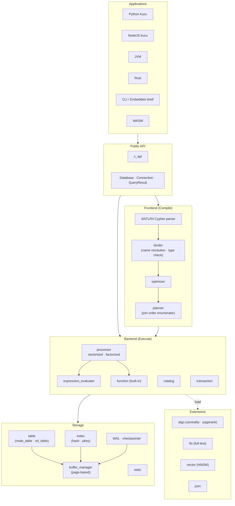
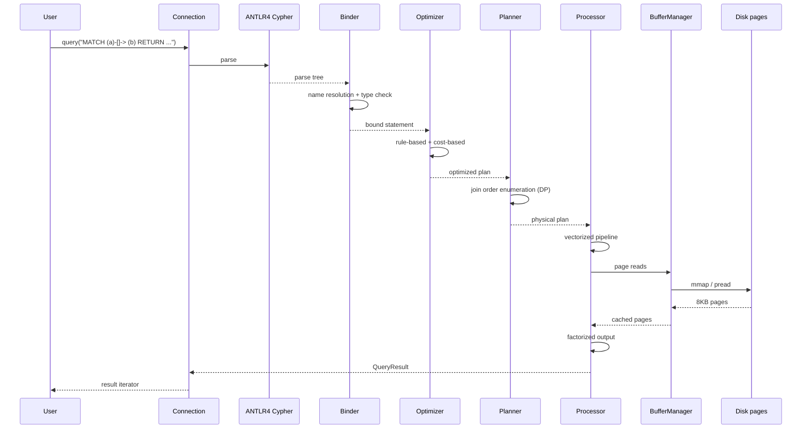

# Kuzu 심층 분석 — 임베드형 컬럼나 그래프 DBMS

> 분석 대상: [kuzudb/kuzu](https://github.com/kuzudb/kuzu) (`v0.11.2.2` / `v0.11.3` 마지막 릴리즈, `master` 기준)
> 분석 시점: 2026-04-28
> 분석 관점: 임베드 그래프 DB·OLAP·벡터화 엔진을 직접 다루는 SWE의 시각

---

## ⚠️ 중요한 상태 변경

**Kuzu는 2026년 4월 시점 사실상 archived 상태**다. README 첫 단락 (`README.md:1-16`):

> "Kuzu is working on something new! We are archiving the KuzuDB project here … For those using Kuzu currently, prior Kuzu releases will continue to be usable in the same way without modifications to your code."

마지막 정식 릴리즈는 **v0.11.3**, 4개 핵심 extension(algo/fts/json/vector) 사전 통합. 이후 Kùzu Inc. 팀이 **새 프로젝트로 전환** 중이라는 시그널이며, OSS 코드는 그대로 사용 가능하지만 active development는 일시 중지되었다.

→ 이 분석은 **마지막 stable 시점의 Kuzu 아키텍처를 reference implementation으로** 다룬다. production 신규 채택은 신중히 검토할 필요.

---

## TL;DR

Kuzu는 "DuckDB가 OLAP에서 한 일을 그래프 영역에서"라는 명확한 포지셔닝의 임베드 GDBMS다.

핵심 4가지:

1. **Cypher-호환 임베드 GDBMS** — 별도 서버 없이 단일 라이브러리, openCypher 표준 추구
2. **컬럼나 디스크 스토리지 + CSR 인접리스트** — node table은 컬럼 단위, edge는 Compressed Sparse Row(CSR) 변형
3. **Vectorized + Factorized query processor** — DuckDB식 SIMD 벡터화 + factorized representation으로 그래프 쿼리 최적화
4. **Serializable ACID + WAL 체크포인트** — 임베드인데도 진짜 트랜잭션. PostgreSQL급 isolation

엔지니어 관점 핵심 인사이트: **factorized representation**이 다른 그래프 DB와 가장 큰 차별점. m × n cartesian product로 폭발할 결과를 **암묵적 representation으로 압축**해서 일찍 join 단계에 처리 → 그래프 쿼리가 빨라지는 결정적 이유.

C++17, MIT 라이선스, ANTLR4 기반 Cypher parser, pybind11/Java/Node/Rust/WASM 바인딩.

---

## 목차

1. [프로젝트 개요](#1-프로젝트-개요)
2. [핵심 차별점](#2-핵심-차별점)
3. [아키텍처](#3-아키텍처)
4. [기술 스택](#4-기술-스택)
5. [핵심 모듈 분석](#5-핵심-모듈-분석)
6. [컬럼나 + CSR 스토리지](#6-컬럼나--csr-스토리지)
7. [Vectorized + Factorized 쿼리 처리](#7-vectorized--factorized-쿼리-처리)
8. [트랜잭션·WAL·Checkpoint](#8-트랜잭션walcheckpoint)
9. [확장 시스템 (Extensions)](#9-확장-시스템-extensions)
10. [성능 특성](#10-성능-특성)
11. [강점·약점·적합 시나리오](#11-강점약점적합-시나리오)
12. [부록 — 디렉토리 + 핵심 코드 위치](#12-부록--디렉토리--핵심-코드-위치)

---

## 1. 프로젝트 개요

### 1.1 정의

> "Kuzu is an embedded graph database built for query speed and scalability. Kuzu is optimized for handling complex analytical workloads on very large databases."
> — `README.md:20-21`

핵심 키워드:

| 키워드 | 의미 |
|---|---|
| **embedded** | 라이브러리 형태. 별도 서버 process 없음 |
| **graph database** | property graph 모델, Cypher 1급 |
| **query speed** | 컬럼나 + 벡터화로 OLAP 성능 |
| **scalability** | "very large databases" — TB 스케일 의식한 디자인 |

### 1.2 해결하려는 문제

| 문제 | Kuzu의 답 |
|---|---|
| Neo4j 임베드 모드는 너무 무거움 | 더 가벼운 C++ 임베드 |
| RDF/Triple store는 OLTP 위주 | OLAP 그래프에 특화된 컬럼나 |
| Cypher는 좋지만 분석 query가 느림 | factorized + vectorized 처리 |
| 그래프 + 벡터 + FTS를 별도 시스템 | 모두 extension으로 통합 |
| Python 데이터 과학자에게 그래프 DB 진입 장벽 | pip install + pandas/Arrow zero-copy |

### 1.3 탄생 배경

University of Waterloo의 [DSG Lab](https://dsg.uwaterloo.ca/) 학술 프로젝트로 시작. 핵심 박사논문(Semih Salihoğlu 그룹)에서 **factorized worst-case optimal join** 알고리즘이 Kuzu 엔진의 기반이 되었다. 2022년경 Kùzu Inc. 라는 commercial entity로 분사.

→ "학계 알고리즘이 production 코드에 반영"된 사례 — Big O보다 worst-case complexity까지 분석된 join 알고리즘이 들어간다.

### 1.4 라이선스·커뮤니티

- **MIT License** (가장 permissive)
- 마지막 stable: **v0.11.3** (2026년 초)
- 4개 extension 사전 통합: `algo`, `fts`, `json`, `vector`
- 이전 버전 사용자는 별도 extension server 직접 호스팅 가능 (Docker image 제공)

---

## 2. 핵심 차별점

### 2.1 7대 특징

| # | 특징 | 비교 |
|---|---|---|
| 1 | Property graph + Cypher native | Neo4j와 가장 가까움 |
| 2 | Embedded (single library) | Neo4j는 server, Memgraph는 server |
| 3 | Columnar disk storage | Neo4j는 row, Memgraph는 in-memory |
| 4 | Factorized query processor | unique to Kuzu (학계 origin) |
| 5 | CSR adjacency lists | Neo4j는 doubly-linked list |
| 6 | Vector + FTS extensions 통합 | v0.11.3 |
| 7 | WASM 바인딩 | 임베드 진영 중 드뭄 |

### 2.2 "DuckDB for graphs" 포지셔닝

DuckDB가 "OLAP은 SQLite처럼 쓸 수 있다"를 증명한 것을 그래프 영역에 적용:

| 측면 | DuckDB (OLAP) | Kuzu (Graph) |
|---|---|---|
| 1차 모델 | 관계형 (row → column) | property graph |
| 쿼리 언어 | SQL | Cypher |
| 스토리지 | 컬럼나 | 컬럼나 + CSR |
| 처리 | 벡터화 | 벡터화 + factorized |
| 임베드 | C/C++ 라이브러리 | C++ 라이브러리 |
| Python 통합 | pandas/Arrow zero-copy | pandas/Arrow zero-copy |

→ 같은 디자인 패턴(임베드+컬럼나+벡터화)을 그래프 모델에 적용한 결과물.

### 2.3 Factorized representation의 의미

`MATCH (a)-[]->(b)-[]->(c)` 같은 path 쿼리에서:

- **Naïve**: a × b × c cartesian product → m·n·k 행
- **Factorized**: `(a, [b1, b2, …], [c1, c2, …])` 같은 nested representation → space 절약 + 늦은 materialization

학계 용어로는 [factorised relational algebra](https://www.fdb-research.com/). Kuzu는 이 알고리즘을 production에 처음 옮긴 그래프 DB.

---

## 3. 아키텍처

### 3.1 Top-level



### 3.2 src/ 디렉토리

```
src/
├── antlr4/                  # 생성된 Cypher parser
├── binder/                  # AST → bound 표현
├── c_api/                   # C API
├── catalog/                 # 스키마 메타데이터
├── common/                  # types · arena · vector 등 공용
├── expression_evaluator/    # SARGable 식 평가
├── extension/               # extension 로딩
├── function/                # 빌트인 함수
├── graph/                   # 그래프 추상 인터페이스
├── include/                 # 공개 헤더
├── main/                    # Database · Connection · QueryResult
├── optimizer/               # 규칙 기반 + 비용 기반
├── parser/                  # parse tree → AST
├── planner/                 # plan ops · join order enumerator
├── processor/               # 실행 엔진 · 연산자
├── storage/                 # ★ buffer / table / WAL / index
└── transaction/             # 트랜잭션 매니저
```

### 3.3 한 쿼리의 생애



---

## 4. 기술 스택

### 4.1 빌드 시스템

`CMakeLists.txt:1-2`:
```cmake
cmake_minimum_required(VERSION 3.15)
project(Kuzu VERSION 0.11.2.2 LANGUAGES CXX C)
```

- **CMake** + GNU Make wrapper
- **C++17**
- 외부 의존: ANTLR4 runtime, Arrow (선택), pybind11 (Python)

### 4.2 의존성

`third_party/` 디렉토리에:
- ANTLR4 C++ runtime (Cypher parser)
- Apache Arrow (zero-copy 결과)
- mbedtls (TLS, S3 extension)
- nlohmann/json (extension config)
- spdlog (로깅)
- yyjson (빠른 JSON)
- 기타

### 4.3 바인딩

| 언어 | 진입점 |
|---|---|
| Python | `tools/python_api/`, pybind11 |
| Node.js | `tools/nodejs_api/` |
| Java | `tools/java_api/` |
| Rust | `tools/rust_api/` |
| C# | `tools/csharp_api/` (community) |
| Go | (third-party) |
| WASM | `tools/wasm/` |

→ Python·Java·Rust 모두 zero-copy Arrow 결과 지원.

---

## 5. 핵심 모듈 분석

### 5.1 main/database.h — 진입점

```cpp
// src/include/main/database.h:38-90
struct KUZU_API SystemConfig {
    explicit SystemConfig(
        uint64_t bufferPoolSize = -1u,            // 자동 (시스템 메모리의 80%)
        uint64_t maxNumThreads = 0,                // 0 → CPU 코어 수
        bool enableCompression = true,
        bool readOnly = false,
        uint64_t maxDBSize = -1u,                  // 8TB on 64-bit, 1GB on 32-bit
        bool autoCheckpoint = true,
        uint64_t checkpointThreshold = 16777216,   // 16MB WAL → checkpoint
        bool forceCheckpointOnClose = true,
        bool throwOnWalReplayFailure = true,
        bool enableChecksums = true);
};

class Database {
    friend class EmbeddedShell;
    friend class ClientContext;
    friend class Connection;
    // ...
};
```

→ Database 객체 1개당 1 디스크 디렉토리. 다중 read-only 인스턴스 가능. 단일 read-write 인스턴스만 허용 (`SystemConfig.readOnly` 주석).

### 5.2 storage/ — 18개 모듈

`src/storage/` 주요 파일:

| 파일 | 역할 |
|---|---|
| `buffer_manager/` | LRU 페이지 캐시 + spiller |
| `table/node_table.cpp` | 노드 컬럼 저장소 |
| `table/rel_table.cpp` | 관계 (CSR 인접리스트) |
| `table/csr_node_group.cpp` | CSR 변형 구현 |
| `table/column.cpp` | 컬럼 단위 저장 |
| `table/string_column.cpp` | 가변 길이 문자열 |
| `table/list_column.cpp` | LIST<T> 컬럼 |
| `table/struct_column.cpp` | STRUCT 컬럼 |
| `compression/` | RLE · Delta · Bitpack 등 |
| `index/` | hash 인덱스, primary key |
| `wal/` | Write-Ahead Log |
| `checkpointer.cpp` | dirty page → 영구 storage |
| `free_space_manager.cpp` | 페이지 할당 |
| `page_manager.cpp` | 페이지 ID 관리 |
| `shadow_file.cpp` | crash recovery용 shadow |
| `undo_buffer.cpp` | MVCC undo |

→ DuckDB와 매우 유사한 구조. **page-based + columnar + WAL**.

### 5.3 processor/ — 실행 엔진

```
processor/
├── operator/            # Scan, Filter, HashJoin, Aggregate, etc
├── map/                 # plan → operator 매핑
├── result/              # FlatTuple, FactorizedTable
├── processor.cpp        # 진입점
└── processor_task.cpp   # 병렬 task 분할
```

핵심은 `result/FactorizedTable`. **factorized representation의 핵심 자료구조**:
- 한 row가 여러 group을 가짐
- 각 group이 자체 vector list를 보유
- materialization 지연

### 5.4 planner/ — Join order enumerator

`planner/join_order/` 안에 **Dynamic Programming**으로 최적 join order를 찾는 알고리즘. Cypher의 multi-hop pattern은 join order가 quadratic 이상으로 폭발할 수 있어서 plan-time 휴리스틱이 중요.

### 5.5 binder/ — 의미 분석

Cypher AST → **bound statement**로 변환. 변수 scope, label resolution, type check 처리.

---

## 6. 컬럼나 + CSR 스토리지

### 6.1 노드 테이블: 컬럼 저장

각 노드 라벨(label)이 별도 테이블. 같은 label의 모든 노드의 같은 property는 **연속된 컬럼**에 저장:

```
NodeTable: Person
┌─────┬──────────┬─────┐
│ id  │ name col │ age │
├─────┼──────────┼─────┤
│  0  │ "Alice"  │ 30  │
│  1  │ "Bob"    │ 25  │
│  2  │ "Carol"  │ 28  │
└─────┴──────────┴─────┘
   ↓ 디스크 layout
[id col]   : 0, 1, 2, ...
[name col] : "Alice", "Bob", "Carol", ...
[age col]  : 30, 25, 28, ...
```

→ "특정 컬럼만 읽으면 되는 OLAP query"가 빠름. SUM(age) 같은 aggregation은 age column page만 stream.

### 6.2 관계 테이블: CSR

`storage/table/csr_node_group.cpp`, `csr_chunked_node_group.cpp`. CSR(Compressed Sparse Row) 변형:

```
RelTable: KNOWS  (Person → Person)

offset:  [0, 2, 5, 6, ...]      ← 노드 i의 KNOWS 시작 위치
adjList: [3, 7, 1, 4, 9, 2, ...] ← 실제 이웃 노드 IDs
```

장점:
- 노드 i의 이웃 = `adjList[offset[i] : offset[i+1]]` → O(1) seek
- 컴팩트: 빈 노드는 offset만, list 공간 차지 X
- 컬럼나 호환: adjList 자체가 페이지에 연속

단점:
- 갱신 비용: edge 추가 시 offset 일부 shift 필요 → 그래서 Kuzu는 **chunked CSR + write-ahead update info**로 갱신 비용 분산

`storage/table/update_info.cpp` 가 그 갱신 추적 로직.

### 6.3 압축

`compression/`:
- **RLE** (Run-Length Encoding)
- **Delta encoding**
- **Bitpacking**
- **Dictionary encoding** (string에)
- **FOR** (Frame of Reference)

DuckDB의 압축 카탈로그와 거의 동일. 컬럼별로 자동 선택.

### 6.4 ChunkedNodeGroup

`chunked_node_group.cpp`. **노드 group**(예: 노드 64K개 단위)을 chunk로 묶어 처리. 효과:
- 페이지 단위 I/O 정렬
- 컬럼 단위 vectorize
- 압축 단위
- MVCC version 단위

---

## 7. Vectorized + Factorized 쿼리 처리

### 7.1 Vectorized = batch of values per call

전통적 Volcano 모델: tuple 1개씩 next() → 함수 호출 overhead 큼.
Vectorized: 1024개 tuple을 한 번에 처리 → SIMD, branch prediction 효율.

`common/types/value/` + `processor/operator/`가 vectorized.

### 7.2 Factorized = lazy cartesian

```cypher
MATCH (a:Person)-[:KNOWS]->(b:Person)-[:KNOWS]->(c:Person)
RETURN a.name, b.name, c.name
```

만약 a가 100명, 각 a마다 b 50명, 각 b마다 c 40명이면 결과는 **100×50×40 = 200,000 row**. Materialize하면 메모리 폭발.

Factorized:
```
{ a: [a1, a2, ..., a100],
  b: { a1 -> [b1, ..., b50], a2 -> [...], ... },
  c: { b1 -> [c1, ..., c40], ... }
}
```

→ 연산자 사이에서 이 nested 표현 그대로 흘려보내고, **마지막 RETURN 시점에만** flat tuple로 expand. 중간 join cost가 dramatically 줄어든다.

### 7.3 Worst-case optimal join

학계 용어로 **WCOJ (Worst-Case Optimal Join)**. 일반 hash-join은 m×n × k 패턴에서 m·n + m·k 같은 sub-optimal cost가 나올 수 있는데, factorized + WCOJ는 **모든 query에 대해 instance-optimal**에 근접한 cost를 보장.

Kuzu의 핵심 차별점이고 다른 그래프 DB(Neo4j, Memgraph, FalkorDB)에는 부분적으로만 구현됨.

---

## 8. 트랜잭션·WAL·Checkpoint

### 8.1 Serializable ACID

`transaction/` 모듈. Kuzu는 임베드 DB지만 **Serializable isolation**까지 보장. SQLite도 SERIALIZABLE은 기본이지만 그 위에서 단일 writer만.

### 8.2 WAL + Checkpoint

`storage/wal/` + `checkpointer.cpp`. 동작:
1. 모든 mutation은 먼저 WAL에 append
2. WAL 크기가 `checkpointThreshold`(기본 16MB) 초과하면 자동 checkpoint
3. Checkpoint는 dirty pages를 데이터 파일에 write + WAL truncate
4. `forceCheckpointOnClose=true` (기본): 닫을 때 강제 checkpoint
5. `enableChecksums=true` (기본): WAL 페이지에 체크섬

### 8.3 MVCC

`storage/undo_buffer.cpp` + `storage/table/version_info.cpp`. Optimistic concurrency:
- 트랜잭션마다 version → 다른 tx가 본 버전과 충돌 시 abort
- read는 lock 없이 자기 version 읽음

### 8.4 Recovery

`shadow_file.cpp` + `storage/wal/`. Crash 후 재시작:
1. shadow file로 partial write 검출
2. WAL replay
3. `throwOnWalReplayFailure=true` (기본): 실패 시 exception
4. `false` 면 best-effort replay

---

## 9. 확장 시스템 (Extensions)

### 9.1 v0.11.3 사전 통합 4개

`README.md:51-52`:
> "If you've upgraded to the latest version v0.11.3, Kuzu has pre-installed four commonly used extensions (algo, fts, json, vector)"

| Extension | 기능 |
|---|---|
| **algo** | 그래프 알고리즘 (PageRank, Louvain, BFS 등) |
| **fts** | 전문 검색 인덱스 |
| **json** | JSON 파싱·저장·쿼리 |
| **vector** | HNSW 벡터 인덱스 |

### 9.2 Extension 로딩

```cypher
INSTALL <name>;
LOAD <name>;
```

이전 버전(v0.11.3 미만)은 별도 extension server에서 다운로드:
```cypher
INSTALL httpfs FROM 'http://localhost:8080/';
```

Docker 이미지(`ghcr.io/kuzudb/extension-repo:latest`)로 self-host 가능 (README:55-69). **단, 공식 extension server는 더 이상 제공되지 않음** (archived 영향).

### 9.3 Extension 인터페이스

`src/extension/` + `src/include/extension/`. 4가지 hook:
- `TransformerExtension` — AST 변환
- `BinderExtension` — bound statement 변환
- `PlannerExtension` — plan 변환
- `MapperExtension` — operator 매핑

→ 매우 깊은 통합. `vector` extension은 native HNSW operator를 plan tree에 직접 추가.

### 9.4 Storage extension

`storage_extension.h` — 외부 storage 시스템(S3, HDFS, …)을 라이브러리로 끼워 넣음. `httpfs` extension이 그 예.

---

## 10. 성능 특성

### 10.1 알려진 벤치마크 (DSG 페이퍼·Kuzu 블로그)

- **LDBC SNB** (Social Network Benchmark): Neo4j 대비 read query 5-10x, write query 비슷
- **complex pattern matching**: factorized 덕분에 hop 수가 늘수록 우위 확대
- **Pure scan**: 컬럼나라 OLAP에 강함
- **Single-record lookup**: row store보다 약간 느릴 수 있음 (트레이드오프)

### 10.2 메모리

- `bufferPoolSize = -1u` 기본값 → **시스템 메모리의 80%**
- LRU + spiller (메모리 부족 시 디스크로 spill)
- 페이지 8KB

### 10.3 동시성

- 단일 read-write Database 인스턴스
- 다중 read-only Database 인스턴스 (같은 path)
- Serializable transactions
- `maxNumThreads`로 query parallelism 조절 (기본 0 = CPU 코어 수)

### 10.4 알려진 제약

- **archived status**: active dev 정지, 새 기능 없음
- **단일 writer**: 분산 모드 없음
- **edge update 비용**: CSR 갱신은 여전히 batch가 효율적
- **Cypher 미구현 부분**: openCypher 100% 호환은 아님 (LOAD CSV 일부, 일부 graph algorithms은 extension 필요)

---

## 11. 강점·약점·적합 시나리오

### 11.1 강점

1. **Embedded + Cypher** 조합 — Neo4j Embedded보다 가벼움
2. **Factorized + WCOJ** — multi-hop 쿼리에서 결정적 우위
3. **Columnar storage + 압축** — OLAP 그래프에 강함
4. **Serializable ACID + WAL** — 임베드인데 진짜 트랜잭션
5. **Extensions** — vector·FTS·algo·json 통합
6. **MIT** — 가장 permissive
7. **Python/Arrow zero-copy** — 데이터 과학 워크플로우와 자연스러움
8. **WASM 바인딩** — 브라우저 가능
9. **학계 검증된 알고리즘** — DSG Lab origin

### 11.2 약점

1. **archived status (2026-04)** — 신규 채택 위험
2. **단일 writer** — 분산 없음
3. **Cypher 일부 미구현** — Neo4j 100% 호환 아님
4. **Edge 갱신 cost** — CSR 특성
5. **소규모 커뮤니티** — Neo4j 대비 답변·tutorial 적음
6. **C++ 빌드 의존** — bindings 없는 언어는 직접 컴파일
7. **Extension server 자체 호스팅 필요** — public mirror 사라짐
8. **Time-travel 미지원** — CozoDB와 대비

### 11.3 적합 시나리오

- **Python 데이터 과학자의 그래프 분석** — pandas → Kuzu → graph algorithm
- **Notebook 환경 그래프 prototyping** — Jupyter + 임베드
- **OLAP 그래프 워크로드** — 거대 그래프 위에 다중 hop pattern
- **GraphRAG 임베드 백엔드** — knowledge graph + vector
- **Edge / 임베드 환경에서 그래프 추론**

### 11.4 부적합 시나리오

- **신규 production 채택** (archived status)
- **Cypher 100% 호환 필요** (Neo4j tooling)
- **분산 그래프** (>10TB)
- **고빈도 edge 갱신** (CSR 특성)
- **장기 active maintenance 필요** (transition 중)

---

## 12. 부록 — 디렉토리 + 핵심 코드 위치

### 12.1 디렉토리 트리

```
kuzu/
├── CMakeLists.txt                        # C++ 빌드
├── src/
│   ├── antlr4/                           # 생성된 Cypher parser
│   ├── parser/                           # parse tree → AST
│   ├── binder/                           # 의미 분석
│   ├── catalog/                          # 스키마 메타
│   ├── optimizer/                        # 최적화
│   ├── planner/                          # ★ join order DP
│   ├── processor/                        # ★ vectorized · factorized 실행
│   │   ├── operator/                     # Scan · Join · Aggregate · ...
│   │   ├── map/                          # plan → operator
│   │   └── result/                       # FactorizedTable
│   ├── storage/                          # ★ buffer / table / WAL
│   │   ├── buffer_manager/
│   │   ├── table/                        # ★ node_table · rel_table · csr_*
│   │   ├── compression/
│   │   ├── index/
│   │   ├── wal/
│   │   ├── checkpointer.cpp
│   │   └── undo_buffer.cpp
│   ├── transaction/                      # 트랜잭션 매니저
│   ├── expression_evaluator/
│   ├── extension/                        # extension 인프라
│   ├── function/                         # 빌트인 함수
│   ├── graph/                            # 그래프 추상화
│   ├── common/                           # 공용 자료구조
│   ├── main/                             # Database · Connection
│   ├── c_api/                            # C 인터페이스
│   └── include/                          # 공개 헤더
├── extension/                            # 4 사전 통합 extensions
├── tools/                                # python_api · nodejs_api · java_api · ...
├── third_party/                          # ANTLR4 · Arrow · ...
├── benchmark/                            # 자체 벤치마크
├── dataset/                              # LDBC 등 테스트 데이터
├── examples/                             # 사용 예제
└── test/                                 # gtest
```

### 12.2 핵심 코드 위치

| 개념 | 파일 | 라인 |
|---|---|---|
| Database / SystemConfig | `src/include/main/database.h` | 38-90 |
| Connection 진입점 | `src/include/main/connection.h` | (전체) |
| QueryResult | `src/include/main/query_result.h` | (전체) |
| BufferManager | `src/storage/buffer_manager/buffer_manager.cpp` | (전체) |
| NodeTable (컬럼 저장) | `src/storage/table/node_table.cpp` | (전체) |
| RelTable (CSR) | `src/storage/table/rel_table.cpp` | (전체) |
| CSR NodeGroup | `src/storage/table/csr_node_group.cpp`, `csr_chunked_node_group.cpp` | (전체) |
| Column 저장 | `src/storage/table/column.cpp` | (전체) |
| Update info (CSR 갱신) | `src/storage/table/update_info.cpp` | (전체) |
| Compression | `src/storage/compression/` | (다수) |
| Checkpointer | `src/storage/checkpointer.cpp` | (전체) |
| WAL | `src/storage/wal/` | (다수) |
| Undo buffer (MVCC) | `src/storage/undo_buffer.cpp` | (전체) |
| Shadow file (recovery) | `src/storage/shadow_file.cpp` | (전체) |
| Vectorized 연산자 | `src/processor/operator/` | (다수) |
| FactorizedTable | `src/processor/result/` | (다수) |
| Join order DP | `src/planner/join_order/` | (다수) |
| Cypher parser (ANTLR4) | `src/antlr4/` (생성), `src/parser/` (handler) | (다수) |
| Binder | `src/binder/` | (다수) |
| Optimizer | `src/optimizer/` | (다수) |
| Extension 인터페이스 | `src/include/extension/` | (다수) |
| StorageExtension | `src/include/storage/storage_extension.h` | (전체) |

---

## 13. 한눈 요약

Kuzu는 "DuckDB가 OLAP에서 한 일을 그래프 영역에서 재현하겠다"는 단순하고 명확한 명제로 설계된, 학계 알고리즘을 production에 옮긴 임베드 GDBMS다. **Cypher + Embedded + Columnar + Factorized + WCOJ** 다섯 축의 조합이 다른 그래프 DB가 흉내내기 어려운 multi-hop OLAP 성능을 만든다.

엔지니어 입장 가장 큰 학습 가치는 **factorized representation**이라는 자료구조 자체와 **chunked CSR + write-ahead update info**로 그래프 갱신 비용을 분산시킨 디자인. DuckDB 스타일 컬럼나 패턴이 그래프 영역에 어떻게 매핑되는지의 reference implementation으로 읽을 가치가 충분하다.

다만 2026-04 시점 **archived 상태**는 production 신규 채택을 보수적으로 만든다. v0.11.3을 안정적으로 잡고 쓸 팀에는 여전히 매력적이지만, "장기적으로 vendor가 maintain할 것" 가정은 현재 어렵다. Kùzu 팀이 발표한 "something new"가 후속이 될지 별개 프로젝트가 될지 지켜봐야 한다.

> **한 줄로:** 학계 factorized join + columnar + Cypher가 한 라이브러리에 응축된 임베드 그래프 DB. 단, 2026-04 기준 archived.
