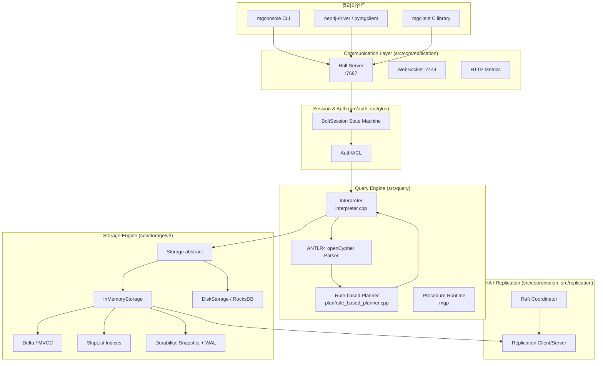
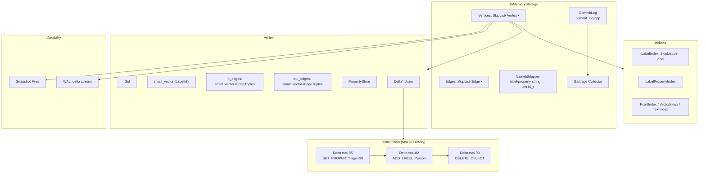
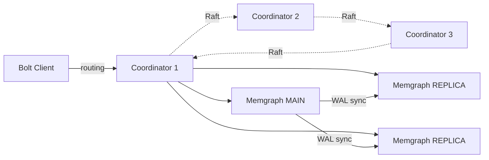

# Memgraph 프로젝트 분석

> 소스코드 레벨에서 본 인메모리 C++ 그래프 데이터베이스 아키텍처 분석

---

## 1. 프로젝트 개요

| 항목 | 내용 |
|------|------|
| **프로젝트명** | Memgraph |
| **GitHub URL** | https://github.com/memgraph/memgraph |
| **공식 웹사이트** | https://memgraph.com |
| **라이선스** | Business Source License 1.1 (BSL) + Apache 2.0 (APL) + Memgraph Enterprise License (MEL) 이중/삼중 구조 |
| **주요 언어** | C++ (약 95%), Python (도구/모듈), C (mgp API) |
| **C++ 표준** | C++23 (`set(CMAKE_CXX_STANDARD 23)`, `CMakeLists.txt:242`) |
| **CMake 최소 버전** | 3.23 |
| **쿼리 언어** | openCypher (Neo4j Cypher 호환) |
| **와이어 프로토콜** | Bolt v1/v4/v5 (Neo4j 호환) |
| **주요 버전** | 3.x 계열 (2025~2026년 활발히 개발 중, 저작권 헤더 `Copyright 2026 Memgraph Ltd.`) |

### 1.1 프로젝트 정의

Memgraph는 **인메모리 우선(in-memory first) 아키텍처**로 설계된 오픈소스 그래프 데이터베이스로, **Neo4j와 Bolt 프로토콜 및 openCypher 레벨에서 호환**되는 드롭인(drop-in) 대체제로 포지셔닝된다. C++로 작성된 트랜잭셔널 ACID 그래프 엔진이며, 실시간 스트리밍 데이터(Kafka/Pulsar 등) 처리, 딥 패스 순회(deep path traversals), 그래프 분석 등의 워크로드에 최적화되어 있다.

### 1.2 해결하려는 문제

- **디스크 기반 그래프 DB의 지연시간 한계**: Neo4j와 같은 전통적 그래프 DB는 디스크 지향 스토리지로 인해 수백 μs~수 ms 단위의 탐색 지연이 발생한다. Memgraph는 모든 데이터를 메모리에 상주시키고 포인터 기반 인접 리스트로 직접 접근한다.
- **스트리밍 워크로드 대응**: Kafka/Pulsar 커넥터를 엔진에 내장하여 실시간 그래프 업데이트 + 쿼리를 통합한다.
- **Neo4j 락인 탈피**: Cypher/Bolt 호환으로 기존 Neo4j 드라이버(`neo4j-python-driver`, `neo4j-java-driver`) 및 애플리케이션을 코드 변경 없이 그대로 사용할 수 있게 한다.
- **복잡한 그래프 알고리즘 확장성**: Query Module(C/C++/Python/Rust) 및 MAGE 라이브러리를 통해 사용자 정의 알고리즘을 네이티브 속도로 수행.

### 1.3 탄생 배경

Memgraph Ltd.는 2016년 크로아티아에서 설립되었으며, 초기에는 클로즈드 소스 상용 제품이었다. 2022년 BSL 1.1 라이선스로 소스를 공개하면서 "source-available" 전략으로 전환했다. BSL의 특성상 소스는 공개되지만 **"Memgraph를 상업용 DBaaS로 재판매"하는 등의 Production 사용에는 제약**이 있으며, 4년 경과 후 Apache 2.0으로 전환되는 구조다. 이는 MongoDB, CockroachDB, Sentry 등이 채택한 라이선스 모델과 동일한 패턴이다.

---

## 2. 핵심 특징 및 차별점

### 2.1 In-Memory First C++ 스토리지 엔진

Memgraph의 모든 정점(Vertex)과 엣지(Edge)는 기본적으로 RAM에 상주한다. `src/storage/v2/vertex.hpp`의 `Vertex` 구조체는 다음과 같이 정의되어 있다.

```cpp
// src/storage/v2/vertex.hpp
struct Vertex {
  const Gid gid;
  utils::small_vector<LabelId> labels;
  using EdgeTriple = std::tuple<EdgeTypeId, Vertex *, EdgeRef>;
  utils::small_vector<EdgeTriple> in_edges;
  utils::small_vector<EdgeTriple> out_edges;
  PropertyStore properties;
  mutable utils::RWSpinLock lock;
  Delta *delta() const { return delta_.GetPtr(); }
  ...
};
```

핵심은 `in_edges` / `out_edges`가 **타 Vertex에 대한 raw pointer**(`Vertex *`)를 직접 보유한다는 점이다. 전통적 디스크 기반 DB가 edge traversal 시 인덱스 lookup → 페이지 I/O를 반복하는 것과 달리, Memgraph의 그래프 탐색은 단순 포인터 디레퍼런스로 수행된다.

### 2.2 Delta 기반 Lock-free MVCC

Memgraph는 PostgreSQL과 유사한 **delta-based MVCC**를 채택하여 스냅샷 격리(Snapshot Isolation)를 제공한다. 모든 변경은 원본 객체가 아닌 `Delta` 체인으로 기록된다(`src/storage/v2/delta_action.hpp`).

```cpp
enum class DeltaAction : std::uint8_t {
  DELETE_DESERIALIZED_OBJECT,
  DELETE_OBJECT,
  RECREATE_OBJECT,
  SET_PROPERTY,
  ADD_LABEL, REMOVE_LABEL,
  ADD_IN_EDGE, ADD_OUT_EDGE,
  REMOVE_IN_EDGE, REMOVE_OUT_EDGE,
};
```

각 `Delta` 노드는 "과거 상태로 되돌리는 역방향 연산"을 기록하며, 여러 트랜잭션이 동시에 같은 객체에 접근해도 각자의 타임스탬프에 해당하는 버전을 스캔으로 재구성한다. 읽기와 쓰기가 서로 블로킹되지 않는 구조다.

### 2.3 openCypher + Bolt 프로토콜 네이티브 호환

- **ANTLR4 기반 Cypher 파서**: `libs/`를 통해 공식 openCypher 문법 파일을 가져와 `src/query/frontend/opencypher/grammar`에서 확장된 ANTLR 문법을 유지한다.
- **Bolt v1/v4/v5 모두 지원**: `src/communication/bolt/v1/` 하위에 상태 머신(`states/`), 인코더/디코더, BoltValue 직렬화가 구현되어 있다. 기본 포트는 7687(`src/flags/bolt.cpp:25: DEFINE_VALIDATED_int32(bolt_port, 7687, ...)`).
- 결과적으로 `neo4j-driver` 계열 라이브러리가 수정 없이 접속 가능하다.

### 2.4 MAGE: 확장 가능한 그래프 알고리즘 라이브러리

`mage/` 디렉토리 및 `query_modules/` 에 PageRank, Community Detection, Katz Centrality, Node2Vec, WCC 등의 알고리즘이 구현되어 있고, C/C++/Python/Rust로 사용자 확장이 가능하다. `mg_procedure.h` 헤더는 Query Module이 엔진 내부에 직접 접근할 수 있는 C ABI를 제공한다.

### 2.5 Larger-than-memory 모드 (RocksDB 백엔드)

`src/storage/v2/disk/rocksdb_storage.hpp`를 통해 인메모리 용량을 초과하는 데이터셋을 RocksDB 위에 저장할 수 있는 **온디스크 스토리지 모드**를 선택적으로 제공한다. 즉 Memgraph는 `InMemoryStorage`와 `DiskStorage` 두 종류의 백엔드를 `Storage` 추상 기반 위에 구현한 폴리모픽 구조다.

### 2.6 고가용성 (Raft 기반 Coordinator)

`src/coordination/` 디렉토리에는 독자적 `raft_state.cpp`, `coordinator_state_machine.cpp`, `coordinator_log_store.cpp` 등이 존재하며 (NuRaft 기반으로 추정) 메인/레플리카 자동 장애조치 기능을 제공한다. 이는 Enterprise 기능이지만 소스는 공개되어 있다.

### 2.7 트리거, 스트림, TTL 내장

- `src/query/trigger.cpp`: BEFORE/AFTER COMMIT 트리거
- `src/query/stream/`: Kafka/Pulsar 통합 스트리밍 쿼리
- `src/storage/v2/ttl.hpp`: 레코드 단위 TTL (시간 기반 자동 삭제)

---

## 3. 아키텍처 분석

### 3.1 전체 시스템 구조

Memgraph는 레이어링이 명확한 모노리식 서버 바이너리다. 진입점은 `src/memgraph.cpp`이며, 내부는 크게 **통신 계층 → 세션/인증 → 쿼리 엔진 → 스토리지 엔진** 4계층으로 분리된다.



### 3.2 스토리지 엔진 내부

`Storage`는 추상 클래스이며, `InMemoryStorage`(`src/storage/v2/inmemory/storage.hpp:103`)가 기본 구현이다. 트랜잭션은 `Accessor` 객체를 통해 시작된다.

```cpp
// src/storage/v2/inmemory/storage.hpp
class InMemoryStorage final : public Storage {
  ...
  std::unique_ptr<Accessor> Access(StorageAccessType rw_type,
                                   std::optional<IsolationLevel> override_isolation_level, ...);
  std::unique_ptr<Accessor> UniqueAccess(...);
  Transaction CreateTransaction(IsolationLevel isolation_level, StorageMode storage_mode) override;
};
```

핵심 자료구조는 다음과 같다.



### 3.3 쿼리 실행 파이프라인

Cypher 쿼리는 `Interpreter::Prepare()` / `Pull()` 두 단계로 실행된다. `Interpreter` 클래스는 `src/query/interpreter.hpp:274`에 정의되어 있다.

```mermaid
graph LR
    Q[Cypher Query String] --> Strip[Stripper<br/>frontend/stripped.cpp<br/>리터럴 추출 & 캐시 키]
    Strip --> Cache{AST Cache}
    Cache -- miss --> Lex[ANTLR4 Lexer/Parser]
    Lex --> AST[AST<br/>frontend/ast]
    AST --> Sem[Semantic<br/>SymbolGenerator]
    Sem --> LP[LogicalPlan<br/>rule_based_planner]
    LP --> VSP[VariableStartPlanner]
    VSP --> Cost[CostEstimator]
    Cost --> BestPlan[Best Plan]
    Cache -- hit --> BestPlan
    BestPlan --> Exec[Pull-based Executor<br/>plan/operator.cpp]
    Exec --> Acc[DbAccessor → Storage::Accessor]
    Acc --> Results[Result Stream → Bolt]
```



- **Stripper**: 리터럴(숫자/문자열)을 추출하여 "질의 템플릿"을 계산하고, 파라미터화된 AST 캐시 키로 사용한다. `src/query/frontend/stripped.cpp`.
- **Rule-based Planner**: `src/query/plan/rule_based_planner.cpp`가 기본. Cypher의 MATCH/WHERE/RETURN 패턴을 `ScanAll`, `Expand`, `Filter`, `Produce` 등의 논리 연산자로 변환한다.
- **VariableStartPlanner**: 어떤 정점을 탐색 시작점으로 삼을지를 결정하고, `CostEstimator`가 인덱스 통계 기반으로 비용을 계산해 최적 플랜을 선택한다.
- **Pull 모델 실행**: Volcano-style iterator. `LogicalOperator::MakeCursor()`가 커서를 만들고 `Pull(Frame &, ExecutionContext &)`로 상위 연산자가 하위에서 한 행씩 가져오는 구조다.

---

## 4. 기술 스택

### 4.1 언어 및 빌드 시스템

| 구분 | 내용 |
|------|------|
| **컴파일러** | Clang (Memgraph Toolchain 기반, `MG_TOOLCHAIN_ROOT` 필수) |
| **언어 표준** | C++23 (일부 C++20 유지), C (mgp ABI) |
| **빌드** | CMake 3.23+, Conan (의존성) |
| **패키지** | Debian/RPM/Arch/Docker (`release/` 디렉토리) |

### 4.2 주요 의존성 (`CMakeLists.txt`)

```cmake
find_package(spdlog REQUIRED)      # 로깅
find_package(fmt REQUIRED)          # 포맷팅
find_package(Boost REQUIRED)
find_package(antlr4-runtime REQUIRED)  # Cypher 파서 백엔드
find_package(absl REQUIRED)         # Abseil
find_package(range-v3 REQUIRED)     # 범위 라이브러리
find_package(asio REQUIRED)         # 비동기 네트워크
find_package(Arrow REQUIRED)        # Parquet/Arrow I/O
find_package(AWSSDK REQUIRED CONFIG COMPONENTS s3)
find_package(OpenSSL REQUIRED)
find_package(mgclient REQUIRED)     # C 클라이언트 라이브러리
find_package(croncpp REQUIRED)      # 스케줄러
find_package(ctre REQUIRED)         # 컴파일타임 정규식
```

이 밖에 `libs/` 하위에는 **NuRaft**(Raft 구현, 고가용성용), **RocksDB**(DiskStorage 백엔드), **jemalloc**(메모리 할당자), **librdkafka**(스트리밍), **Bolt 클라이언트용 mgclient**, **ANTLR4 C++ runtime** 등이 포함된다.

### 4.3 최상위 디렉토리 트리

```
memgraph/
├── CMakeLists.txt
├── build.sh              # 편의 빌드 스크립트
├── conanfile.py          # 의존성 명세
├── init.sh               # libs/ 서브모듈 fetch
├── licenses/             # BSL / APL / MEL 라이선스 텍스트
├── config/               # flags.yaml (런타임 플래그 메타)
├── src/                  # 모든 서버 소스 (아래 5장 참조)
├── include/              # mg_procedure.h 공개 헤더
├── libs/                 # 3rd-party (antlr, rocksdb, nuraft, ...)
├── query_modules/        # C++/Python 내장 프로시저 예제
├── mage/                 # MAGE 그래프 알고리즘 라이브러리 (별도 리포 동기화)
├── tests/                # (분석 범위 외)
├── tools/                # mgconsole 등 운영 도구
└── release/              # 패키징 (deb/rpm/docker)
```

---

## 5. 핵심 코드 분석

### 5.1 `src/` 트리 주요 모듈

| 디렉토리 | 책임 |
|----------|------|
| `storage/v2/` | 스토리지 엔진 (MVCC, 인덱스, 내구성) |
| `storage/v2/inmemory/` | 인메모리 스토리지 구현체 |
| `storage/v2/disk/` | RocksDB 기반 larger-than-memory 스토리지 |
| `storage/v2/durability/` | 스냅샷 + WAL |
| `storage/v2/indices/` | 공통 인덱스 인터페이스 (label, label+property, point, text, vector) |
| `query/` | 쿼리 엔진 전체 (파서~인터프리터) |
| `query/frontend/opencypher/` | ANTLR 기반 Cypher 문법 |
| `query/frontend/ast/` | AST 노드 |
| `query/frontend/semantic/` | 심볼 생성, 타입 체크 |
| `query/plan/` | 논리 플래너, 비용 모델, 연산자 |
| `query/procedure/` | Query Module 런타임 (mgp C API) |
| `query/stream/` | Kafka/Pulsar 스트림 쿼리 |
| `communication/bolt/v1/` | Bolt 프로토콜 스택 |
| `coordination/` | Raft 기반 고가용성 Coordinator |
| `replication/` | 마스터/레플리카 복제 |
| `auth/` | 사용자/롤/권한 |
| `dbms/` | 멀티 테넌트(멀티 데이터베이스) 관리 |
| `flags/` | gflags 런타임 플래그 정의 |
| `memory/` | 커스텀 할당자, 메모리 트래킹 |
| `slk/`, `rpc/` | 내부 RPC 직렬화 |
| `memgraph.cpp` | `main()` 진입점 |

### 5.2 MVCC 구현: `Delta` + `CommitInfo`

`src/storage/v2/delta.hpp`의 `PreviousPtr` 클래스는 "직전 버전 포인터"를 3가지 타입(Delta/Vertex/Edge) 중 하나로 태깅하여 저장한다. 64비트 포인터의 하위 3비트가 정렬 때문에 항상 0임을 이용한 **태그 포인터 기법**이다.

```cpp
// src/storage/v2/delta.hpp
class PreviousPtr {
  static constexpr uintptr_t kDelta  = 0b01UL;
  static constexpr uintptr_t kVertex = 0b10UL;
  static constexpr uintptr_t kEdge   = 0b11UL;
  static constexpr uintptr_t kMask   = 0b11UL;
  ...
};

struct CommitInfo {
  std::atomic<uint64_t> timestamp;
  utils::SpinLock lock;
  NonSeqPropagationState non_seq_propagation{NonSeqPropagationState::NONE};
};
```

트랜잭션이 시작되면 고유한 단조 증가 타임스탬프(command id)를 받고, 읽기 시 각 Vertex의 delta 체인을 따라가면서 "내가 시작한 시점보다 뒤에 커밋된 변경"을 역방향으로 적용해 **본인의 스냅샷 뷰**를 재구성한다. 이 방식은 PostgreSQL과 달리 **원본 객체는 in-place 갱신**하고, delta는 **undo 로그 역할**을 한다는 점이 특징이다.

### 5.3 Skip List: 정점/엣지 저장과 인덱스의 공통 기반

Memgraph의 가장 중요한 자료구조는 `src/utils/skip_list.hpp`에 구현된 **lock-free concurrent skip list**다. 정점 컬렉션, 엣지 컬렉션, 레이블 인덱스, 레이블+프로퍼티 인덱스가 모두 이 `SkipList<T>` 위에 올라간다.

```cpp
// src/utils/skip_list.hpp
constexpr uint64_t kSkipListMaxHeight       = 32;
constexpr uint64_t kSkipListGcHeightTrigger = 16;
constexpr int kSkipListCountEstimateDefaultLayer = 10;
constexpr uint64_t kSkipListGcBlockSize = 8189;
```

특징:

- **최대 높이 32층**: 확률적 분포상 수십억 개 노드까지 커버.
- **Per-thread GC**: 각 스레드가 스킵 리스트에 접근할 때 확률적으로(kSkipListGcHeightTrigger=16 이상 층에 닿을 때) GC 스캔을 트리거한다. 별도 전용 GC 스레드 없이 amortized 비용으로 메모리 회수가 분산된다.
- **Count Estimate**: 10층 헤더 카운트를 사용한 근사 카디널리티 추정 (인덱스 통계로 사용, 최대 20% 오차 타겟).

### 5.4 InMemoryStorage Accessor와 격리 수준

```cpp
// src/storage/v2/inmemory/storage.hpp:103
class InMemoryStorage final : public Storage {
 public:
  std::unique_ptr<Accessor> Access(StorageAccessType rw_type,
                                   std::optional<IsolationLevel> override_isolation_level, ...);
  std::unique_ptr<Accessor> UniqueAccess(...);
  std::unique_ptr<Accessor> ReadOnlyAccess(...);
 protected:
  Transaction CreateTransaction(IsolationLevel isolation_level, StorageMode storage_mode) override;
};
```

세 가지 접근 권한이 명시적이다:

- `Access` (shared): 일반 OLTP 쿼리. 동시 다수 허용.
- `UniqueAccess`: DDL (인덱스 생성/삭제 등)처럼 전역 lock이 필요한 연산.
- `ReadOnlyAccess`: 스냅샷 생성, 백업, 레플리카 따라잡기.

격리 수준은 `src/storage/v2/isolation_level.hpp`에서 `SNAPSHOT_ISOLATION`(기본), `READ_COMMITTED`, `READ_UNCOMMITTED`를 지원한다.

### 5.5 Interpreter 및 Prepare/Pull 라이프사이클

```cpp
// src/query/interpreter.hpp:274
class Interpreter final {
 public:
  explicit Interpreter(InterpreterContext *interpreter_context);
  struct PrepareResult {
    std::vector<std::string> headers;
    std::vector<query::AuthQuery::Privilege> privileges;
    std::optional<int> qid;
    std::optional<std::string> db;
  };
  // Prepare → (internal plan) → Pull(stream, n)
  ...
 private:
  std::optional<memgraph::dbms::DatabaseAccess> db_acc_;
  std::unique_ptr<storage::Storage::Accessor> db_transactional_accessor_;
  std::optional<DbAccessor> execution_db_accessor_;
  std::optional<TriggerContextCollector> trigger_context_collector_;
  bool in_explicit_db_{false};
};
```

- `Prepare(query, params)`: 파싱 → 계획 → 권한 체크 → 헤더 리턴.
- `Pull(stream, n)`: Bolt의 `PULL n` 메시지에 대응하여 최대 n개의 행을 stream으로 밀어낸다. Volcano 모델이므로 중간에 중단/재개가 가능하다.
- `Abort()`, `Commit()`: 명시적 트랜잭션 경계.

### 5.6 Bolt 상태 머신

`src/communication/bolt/v1/states/`에는 Bolt 프로토콜 상태 전이가 구현되어 있다. 전형적인 상태 그래프는 `CONNECTING → AUTH → IDLE → IN_TRANSACTION → RESULT → IDLE`이다. `session.hpp:53`의 `Session` 템플릿 클래스는 trans port(TSession)와 인터프리터 어댑터를 타입 파라미터로 받아 재사용성을 확보한다.

### 5.7 내구성: Snapshot + WAL

`src/storage/v2/durability/` 하위에는 두 가지 메커니즘이 있다.

- **Snapshot**: 전체 데이터베이스 상태를 바이너리 파일로 주기적으로 덤프. `durability.cpp`의 `CreateSnapshot()`이 담당.
- **WAL (Write-Ahead Log)**: 커밋된 delta를 순차 append. 복구 시 최근 스냅샷 + 스냅샷 이후 WAL 재생으로 복원.

두 포맷 모두 `marker.hpp`에 정의된 태그 기반 자체 바이너리 포맷을 사용한다 (RocksDB 모드에서는 RocksDB의 WAL을 그대로 활용).

---

## 6. API 및 인터페이스

### 6.1 Bolt 프로토콜

Memgraph는 Bolt v1, v4, v4.1, v5까지 지원한다. 기본 리슨 포트는 7687.

```cpp
// src/flags/bolt.cpp:25
DEFINE_VALIDATED_int32(bolt_port, 7687,
                       "Port on which the Bolt server should listen.", ...);
```

클라이언트 관점에서는 Neo4j 드라이버를 그대로 사용할 수 있다.

```python
from neo4j import GraphDatabase
driver = GraphDatabase.driver("bolt://localhost:7687", auth=("", ""))
with driver.session() as s:
    s.run("CREATE (:Person {name: 'Alice'})-[:KNOWS]->(:Person {name: 'Bob'})")
    for r in s.run("MATCH (a:Person)-[:KNOWS]->(b) RETURN a.name, b.name"):
        print(r)
```

### 6.2 openCypher 예시

```cypher
// 데이터 입력
CREATE (a:Person {name: 'Alice', age: 30})
CREATE (b:Person {name: 'Bob', age: 27})
CREATE (a)-[:KNOWS {since: 2020}]->(b);

// 변수 길이 경로 (deep path traversal)
MATCH p = (a:Person {name: 'Alice'})-[:KNOWS *1..5]->(friend)
WHERE friend.age < 40
RETURN friend.name, length(p) AS hops
ORDER BY hops;

// 인덱스 생성
CREATE INDEX ON :Person(name);

// 트랜잭션 격리 수준 변경
SET SESSION TRANSACTION ISOLATION LEVEL READ COMMITTED;

// MAGE 알고리즘 호출
CALL pagerank.get() YIELD node, rank
RETURN node.name, rank ORDER BY rank DESC LIMIT 10;
```

### 6.3 클라이언트 드라이버

| 드라이버 | 비고 |
|----------|------|
| **mgclient** | C 라이브러리. Memgraph 공식. `find_package(mgclient)`로 빌드 시에도 사용. |
| **pymgclient** | mgclient 기반 Python 바인딩 |
| **GQLAlchemy** | ORM 수준 Python 클라이언트 |
| **neo4j-driver** (Python/Java/JS/Go) | Bolt 호환 덕분에 그대로 작동 |
| **mgconsole** | 공식 CLI (tools/) |

### 6.4 HTTP/WebSocket

`src/communication/websocket/` 및 `src/communication/http/`를 통해 로그 스트리밍, 메트릭스(Prometheus), 그리고 Memgraph Lab 연동을 지원한다.

---

## 7. 확장성 및 플러그인

### 7.1 Query Modules (mgp API)

`include/mg_procedure.h`는 C ABI로 쿼리 모듈을 작성할 수 있는 공개 헤더다. `query_modules/example.cpp`, `example.c`, `example.py`가 템플릿 역할을 한다.

```cpp
// query_modules 예시 골격 (C++)
#include <mg_procedure.h>

void MyProc(mgp_list *args, mgp_graph *graph, mgp_result *result, mgp_memory *memory) {
    auto *record = mgp_result_new_record(result);
    mgp_value *val = mgp_value_make_int(42, memory);
    mgp_result_record_insert(record, "answer", val);
}

extern "C" int mgp_init_module(mgp_module *module, mgp_memory *memory) {
    mgp_proc *proc = mgp_module_add_read_procedure(module, "my_proc", MyProc);
    mgp_proc_add_result(proc, "answer", mgp_type_int());
    return 0;
}
```

런타임은 `src/query/procedure/`에서 이 공유 라이브러리를 `dlopen`하여 로드하고, Cypher `CALL my_module.my_proc()` 호출 시 `Procedure` 연산자가 함수 포인터를 호출한다. Python 모듈은 `src/query/procedure/py_module.cpp`의 임베디드 CPython 인터프리터로 실행된다.

### 7.2 MAGE 알고리즘 라이브러리

`mage/` 디렉토리에는 다음 알고리즘이 포함된다 (일부):

- PageRank, Personalized PageRank
- Community Detection (Louvain, Label Propagation)
- Katz Centrality, Betweenness Centrality
- Node2Vec (배치 + online)
- Weakly Connected Components
- Graph Analyzer / Graph Coloring

일부는 C++, 일부는 Python/NetworkX로 작성되어 있으며, 동일한 `mgp` API로 노출된다.

### 7.3 트리거와 스트림

```cypher
CREATE TRIGGER my_trigger ON () CREATE AFTER COMMIT
EXECUTE
  UNWIND createdVertices AS v
  CREATE (:AuditLog {vertexId: id(v), ts: timestamp()});

CREATE KAFKA STREAM my_stream
TOPICS topic1
TRANSFORM transform_module.my_transform
BOOTSTRAP_SERVERS 'broker:9092';

START STREAM my_stream;
```

스트림은 Kafka 메시지를 Python 변환 함수에 넣고, 그 결과를 Cypher 쿼리로 엔진에 적용한다. `src/query/stream/`가 컨슈머 스레드를 관리한다.

---

## 8. 성능 특성

### 8.1 인메모리 + 포인터 그래프

엣지 탐색이 포인터 디레퍼런스(수 ns)이므로, 깊은 경로 질의에서 디스크 기반 그래프 DB 대비 10~100배 지연 감소가 가능하다. 공식 벤치마크(benchgraph.com)에서 Neo4j 대비 동일 쿼리 처리량이 수 배 이상 향상된다고 주장한다.

### 8.2 MVCC delta overhead

쓰기 트랜잭션은 Delta 체인을 생성하므로 추가 메모리/할당 오버헤드가 있다. 이를 완화하기 위해:

- **PageSlabMemoryResource**: `src/utils/allocator/page_slab_memory_resource.hpp` — Delta 객체를 페이지 단위 슬랩에서 할당해 fragmentation을 줄임.
- **GC 스레드**: 오래된 delta를 `CommitLog`(`src/storage/v2/commit_log.cpp`)의 oldest-active-transaction 경계 이전으로 확정되면 해제.

### 8.3 인덱싱 전략

- **Label Index**: 레이블별 `SkipList<Vertex*>`. O(log n) lookup, O(1) insert amortized.
- **Label+Property Index**: 프로퍼티 값으로 정렬된 스킵 리스트. 범위 질의 지원.
- **Point Index**: 지리/좌표 쿼리용 (`src/storage/v2/point.hpp`).
- **Text Index**: `src/storage/v2/indices/text_index.hpp` — 전문 검색 (Tantivy 기반 mgcxx 사용).
- **Vector Index**: 임베딩 벡터 유사도 검색 (HNSW 등).

### 8.4 내구성 vs 성능 트레이드오프

- `--storage-snapshot-interval-sec`: 스냅샷 주기.
- `--storage-wal-enabled`: WAL 활성화 여부. 비활성화 시 성능 극대화, 장애 시 데이터 손실 가능.
- `--storage-wal-file-flush-every-n-tx`: fsync 주기.

### 8.5 Larger-than-memory (RocksDB)

`DiskStorage`(`src/storage/v2/disk/storage.hpp`)는 메모리에 전체 그래프를 담을 수 없을 때 사용한다. 트레이드오프로 p99 지연이 크게 증가하지만 TB 규모 그래프를 단일 노드에서 다룰 수 있게 해준다.

---

## 9. 배포 및 운영

### 9.1 배포 방식

| 방식 | 설명 |
|------|------|
| **Docker** | `docker run -p 7687:7687 -p 7444:7444 memgraph/memgraph-platform` |
| **Debian/RPM** | `release/debian`, `release/rpm`에서 패키징. systemd 서비스 (`release/memgraph.service`) |
| **Helm Chart** | 공식 Kubernetes 차트 (별도 리포 `memgraph/helm-charts`) |
| **Memgraph Platform** | Memgraph + Lab(웹 UI) + mgconsole 통합 Docker |

### 9.2 주요 런타임 플래그 (`src/flags/`)

| 플래그 | 기본값 | 용도 |
|--------|--------|------|
| `--bolt-port` | 7687 | Bolt 리슨 포트 |
| `--monitoring-port` | 7444 | WebSocket 로그 |
| `--data-directory` | `/var/lib/memgraph` | 스냅샷/WAL 저장 경로 |
| `--log-file` | `/var/log/memgraph/memgraph.log` | 로그 파일 |
| `--memory-limit` | 0 | 인메모리 상한 (MiB). 0=무제한 |
| `--storage-mode` | IN_MEMORY_TRANSACTIONAL | IN_MEMORY_ANALYTICAL / ON_DISK_TRANSACTIONAL 선택 |
| `--storage-snapshot-interval-sec` | 300 | 스냅샷 주기 |
| `--storage-wal-enabled` | true | WAL 활성화 |
| `--isolation-level` | SNAPSHOT_ISOLATION | 기본 격리 수준 |
| `--also-log-to-stderr` | false | stderr 로깅 여부 |
| `--query-execution-timeout-sec` | 600 | 쿼리 타임아웃 |

### 9.3 복제 설정

```cypher
-- 메인에서
SET REPLICATION ROLE TO MAIN;
REGISTER REPLICA replica1 SYNC TO "10.0.0.2:10000";
REGISTER REPLICA replica2 ASYNC TO "10.0.0.3:10000";

-- 레플리카에서
SET REPLICATION ROLE TO REPLICA WITH PORT 10000;
```

SYNC 모드는 커밋 지연을 늘리지만 강한 내구성을 제공한다. ASYNC 모드는 최종 일관성.

### 9.4 HA (Coordinator 기반 자동 페일오버)

`src/coordination/coordinator_instance.cpp`, `raft_state.cpp` 기반으로 다수의 Coordinator가 Raft 합의를 통해 MAIN/REPLICA 토폴로지를 관리한다. MAIN 노드 장애 시 적절한 REPLICA가 승격된다. Enterprise 전용 기능.



---

## 10. 경쟁·비교 분석

### 10.1 주요 그래프 DB 비교표

| 항목 | Memgraph | Neo4j | FalkorDB | TigerGraph |
|------|----------|-------|----------|------------|
| **언어** | C++23 | Java (Scala) | C/C++ | C++ |
| **스토리지** | In-memory (+ RocksDB 선택) | Disk (page cache) | In-memory (Sparse Matrix) | Disk + Mem |
| **그래프 모델** | LPG (포인터 인접리스트) | LPG (페이지 레코드) | Sparse Adjacency Matrix | LPG |
| **쿼리 언어** | openCypher | Cypher + GQL | openCypher | GSQL |
| **와이어 프로토콜** | Bolt v1/v4/v5 | Bolt | Redis RESP | 독자 HTTP/gRPC |
| **동시성** | Delta MVCC (lock-free) | MVCC (디스크) | 단일 writer + 멀티 reader | MVCC |
| **인덱스** | SkipList + Text/Vector/Point | B-tree + Lucene | Matrix + FTS | B-tree |
| **라이선스** | BSL 1.1 + APL + MEL | GPLv3 + 상용 | SSPLv1 | 상용 |
| **HA** | Raft Coordinator | Causal Cluster | Redis Sentinel/Cluster | 내장 |
| **알고리즘 라이브러리** | MAGE (C++/Py/Rust) | GDS | 내장 (GraphBLAS) | 내장 |
| **스트림 통합** | Kafka/Pulsar 내장 | APOC | - | Kafka Loader |

### 10.2 vs Neo4j

**Memgraph 우위**: 인메모리 아키텍처 덕분에 동일 데이터셋에서 지연/처리량 우위. Bolt 호환으로 Neo4j 드라이버를 그대로 사용. Kafka/Pulsar 네이티브 연동. C++로 구성되어 GC stall이 없다 (Neo4j는 JVM GC 이슈가 운영 과제).

**Neo4j 우위**: 훨씬 성숙한 생태계(APOC, GDS, Bloom 시각화), GQL 표준 선도, 커뮤니티 규모, 공식 인증/교육 프로그램. 진정한 수평 샤딩(Fabric)을 제공. 라이선스도 GPLv3로 BSL보다 덜 제한적.

### 10.3 vs FalkorDB

- **철학 차이**: FalkorDB는 "Sparse Matrix + GraphBLAS"로 벡터/행렬 연산을 통해 순회하는 반면, Memgraph는 "전통적 포인터 탐색 + MVCC"로 OLTP 트랜잭션 스타일에 더 가깝다.
- **운영 모델**: FalkorDB는 Redis 모듈이라 Redis 생태계 안에서 동작. Memgraph는 독립 서버.
- **트랜잭션**: Memgraph가 본격적인 ACID + Snapshot Isolation. FalkorDB는 단일 writer 모델이라 충돌이 없는 대신 동시 쓰기 스케일링이 제한적.
- **쿼리 언어**: 둘 다 openCypher이지만 Memgraph가 deep path / 변수 길이 경로 / 사용자 정의 프로시저에서 더 풍부.

### 10.4 적합/부적합 시나리오

**적합한 경우**:
- 실시간 사기 탐지, 네트워크 모니터링, 추천 시스템 등 **저지연 그래프 쿼리**가 필수인 OLTP 워크로드
- Kafka/Pulsar 이벤트 스트림을 그래프로 변환해 실시간 분석
- Neo4j 애플리케이션의 **성능 이슈로 마이그레이션**이 필요한 경우 (드라이버 교체 불필요)
- 깊은 경로 탐색(5~10 홉 이상)이 빈번한 시나리오

**부적합한 경우**:
- **TB급 이상 그래프**: 단일 노드 RAM 한계. DiskStorage 모드는 존재하지만 인메모리 대비 성능이 크게 떨어짐.
- **수평 샤딩이 필수인 초대형 그래프**: Memgraph는 분산 파티셔닝이 약함.
- **BSL 제약이 걸림돌이 되는 경우**: Memgraph를 "상업용 managed DBaaS로 재판매"하려면 상용 라이선스 필요.
- **GC 없는 수평 분석(OLAP) 중심** 워크로드: TigerGraph/Neo4j GDS가 더 성숙.

---

## 11. 종합 평가

### 11.1 강점

1. **엔진 품질**: C++23 현대 코드, `small_vector`, 태그 포인터, lock-free skip list, page-slab 할당자 등 성능 엔지니어링의 정석을 실천. 코드 품질이 높고 모듈 분리가 명확하다.
2. **Neo4j 호환성**: Bolt + openCypher 완전 호환으로 마이그레이션 비용이 낮다. 이는 그래프 DB 시장에서 가장 큰 장벽을 우회하는 전략적 선택이다.
3. **인메모리 + 옵션적 DiskStorage 이중 구조**: 같은 `Storage` 추상 위에 두 백엔드를 두는 설계는 확장성과 유연성을 동시에 확보한다.
4. **실시간 스트리밍 통합**: Kafka/Pulsar를 엔진 레벨에서 지원하는 그래프 DB는 흔치 않다.
5. **확장성**: C/C++/Python/Rust Query Module + MAGE 라이브러리로 알고리즘 확장이 쉽다.
6. **고가용성**: Raft 기반 Coordinator가 기본 탑재. (Enterprise이긴 하나 소스 공개)
7. **현대적 빌드**: Conan + CMake 23, 명확한 의존성 트리.

### 11.2 약점 및 리스크

1. **BSL 1.1 라이선스의 제약**: 가장 큰 비즈니스/법적 리스크. "Production use"의 정의가 해석에 따라 달라질 수 있고, 특히 SaaS/DBaaS 제공자는 상용 라이선스가 필수다. 4년 후 APL로 전환되긴 하지만 최신 버전은 항상 BSL이다.
2. **단일 노드 메모리 한계**: RAM이 곧 용량이다. DiskStorage 모드는 존재하지만 본연의 강점을 희석시킨다.
3. **생태계 격차**: Neo4j의 APOC/GDS/Bloom/Browser와 비교하면 도구/커뮤니티가 작다. MAGE는 훌륭하지만 규모 차이는 있다.
4. **수평 확장 부재**: Neo4j Fabric이나 TigerGraph 수준의 진짜 샤딩은 없음.
5. **Enterprise 기능 의존성**: HA/멀티 테넌시/세분화된 권한 등 운영에 필요한 상당 기능이 `MG_ENTERPRISE` 매크로 뒤에 숨겨져 있어 커뮤니티 빌드는 제한적이다.
6. **JVM 드라이버 Bolt 호환성 테스트 커버리지**: Bolt v5의 모든 엣지 케이스에서 Neo4j 공식 드라이버와 100% 일치하지 않을 수 있다(과거 이슈 트래커에서 종종 발견).

### 11.3 엔지니어 관점 인사이트

- **"인메모리가 디폴트, 디스크는 옵션"**이라는 설계 선택은 사용 가능한 RAM이 계속 커지는 하드웨어 트렌드(수 TB DRAM 서버가 보편화)와 잘 맞물린다. Memgraph는 이 베팅이 맞다면 장기적으로 매력이 커진다.
- **Delta 기반 MVCC + Skip List**의 조합은 읽기-다수/쓰기-다수 환경에서 락 경쟁을 최소화하는 표준 레시피이며, PostgreSQL/CockroachDB가 증명한 방식이다. 그래프 DB에 이 패턴을 성공적으로 적용한 드문 사례다.
- **`mg_procedure.h` C ABI 설계**는 중요한 결정이다. C ABI는 언어 경계를 넘는 안정적 확장을 가능하게 하며, 이는 Postgres의 extension 시스템처럼 생태계를 키우는 핵심 지렛대가 될 수 있다.
- **Storage 추상화의 이중 구현** (`InMemoryStorage` vs `DiskStorage`)은 엔진 내부를 들여다보면 매우 흥미로운 교육 자료다. 동일한 `Accessor` 인터페이스 뒤에 완전히 다른 저장소 철학(포인터 그래프 vs LSM-Tree)을 숨기는 것은 설계의 모범 사례다.
- **코드베이스 학습 가치**: `src/utils/skip_list.hpp`, `src/storage/v2/delta.hpp`, `src/query/plan/rule_based_planner.cpp`는 각각 동시성 자료구조, MVCC 구현, 쿼리 최적화를 공부하기에 훌륭한 실전 레퍼런스다.
- **운영 관점 주의**: 인메모리 DB 특성상 "메모리 폭주 = OOM 킬"이 가장 큰 실패 모드. `--memory-limit` 플래그와 `memory/` 모듈의 트래킹 메커니즘에 의존하므로, 프로덕션에서는 이 한계값 설정과 모니터링을 반드시 튜닝해야 한다.
- **마이그레이션 전략**: "Neo4j에서 성능이 부족한 특정 서브시스템만 Memgraph로 오프로드"하는 부분 마이그레이션이 현실적이다. Bolt 호환 덕에 라우팅 레이어만 조정하면 된다.

---

## 참고: 주요 파일 인덱스

| 관심 주제 | 파일 |
|-----------|------|
| 진입점 | `src/memgraph.cpp` |
| Storage 추상 | `src/storage/v2/storage.hpp` |
| 인메모리 구현 | `src/storage/v2/inmemory/storage.hpp`, `inmemory/storage.cpp` |
| MVCC Delta | `src/storage/v2/delta.hpp`, `delta_action.hpp` |
| Vertex/Edge | `src/storage/v2/vertex.hpp`, `edge.hpp` |
| Skip List | `src/utils/skip_list.hpp` |
| Durability | `src/storage/v2/durability/durability.cpp` |
| 인터프리터 | `src/query/interpreter.hpp`, `interpreter.cpp` |
| 파서 | `src/query/frontend/opencypher/parser.hpp`, `frontend/stripped.cpp` |
| 플래너 | `src/query/plan/rule_based_planner.cpp`, `variable_start_planner.cpp`, `cost_estimator.hpp` |
| 연산자 | `src/query/plan/operator.cpp` |
| Bolt 상태 | `src/communication/bolt/v1/session.hpp`, `v1/states/` |
| 플래그 | `src/flags/bolt.cpp`, `config/flags.yaml` |
| Coordinator (HA) | `src/coordination/raft_state.cpp`, `coordinator_instance.cpp` |
| Query Module ABI | `include/mg_procedure.h`, `src/query/procedure/` |
| 확장 예제 | `query_modules/example.cpp`, `query_modules/schema.cpp` |

> 본 분석은 `_repos/memgraph/` 의 소스코드 스냅샷(저작권 헤더 2025~2026년)을 기반으로 작성되었다. 버전에 따라 일부 파일 경로나 플래그 기본값은 달라질 수 있다.
