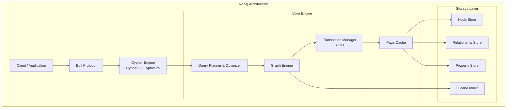
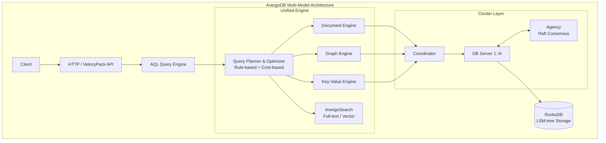
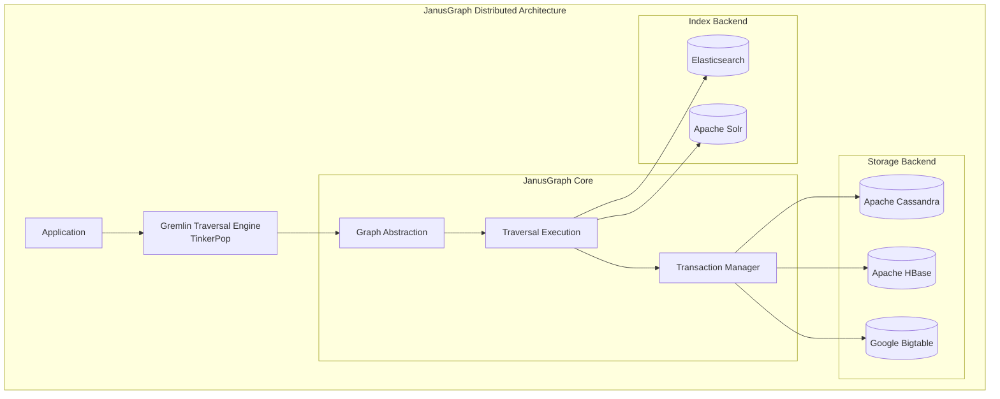
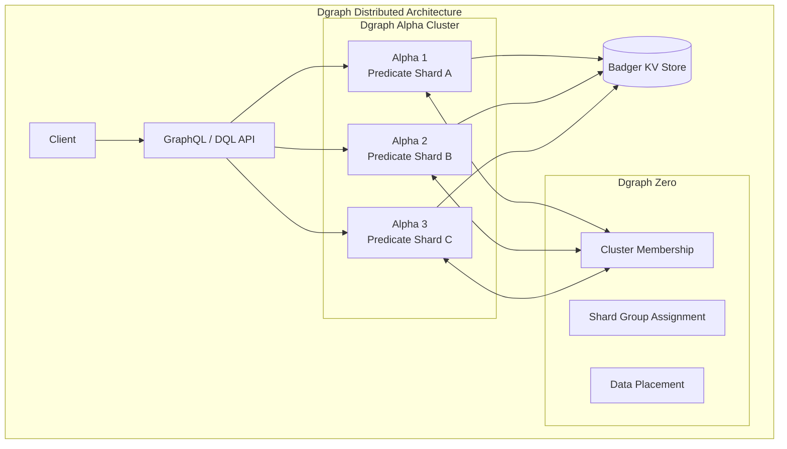
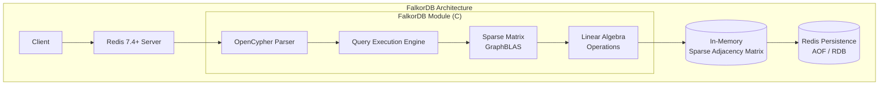
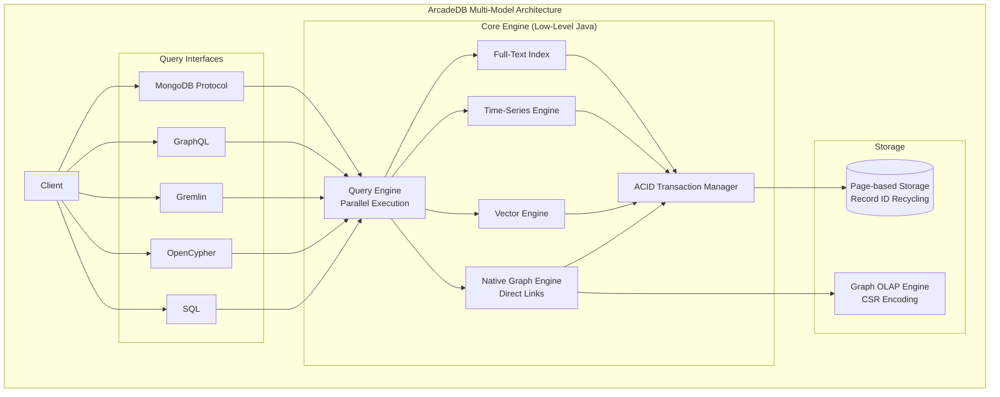
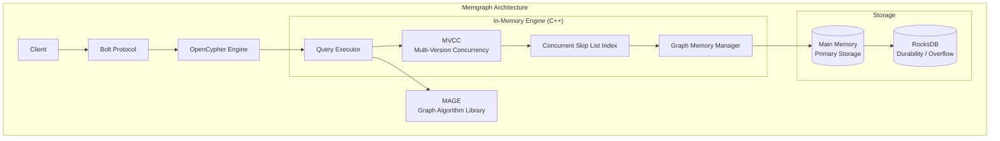
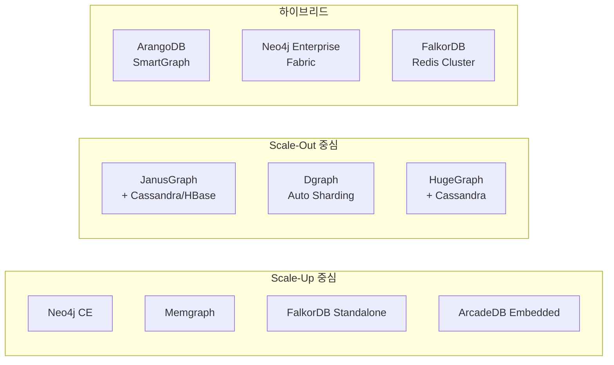

# 오픈소스 그래프 데이터베이스 비교 분석

> 작성일: 2026-04-07

## 1. 프로젝트 개요

그래프 데이터베이스(Graph Database)는 노드(Node), 엣지(Edge), 속성(Property)으로 구성된 그래프 모델을 사용하여 데이터 간의 관계를 저장하고 질의하는 데이터베이스다. 관계형 DB에서 다수의 JOIN이 필요한 복잡한 관계 탐색을 O(1) 시간에 수행할 수 있어, 소셜 네트워크, 추천 시스템, 사기 탐지, 지식 그래프, GraphRAG 등의 영역에서 핵심 인프라로 자리잡고 있다.

2024년 4월 ISO가 **GQL(Graph Query Language, ISO/IEC 39075:2024)** 표준을 공식 발표하면서, 1987년 SQL 이후 최초의 새로운 데이터베이스 질의 언어 표준이 탄생했다. 이를 기점으로 그래프DB 생태계는 더욱 활발한 표준화와 경쟁이 진행 중이다.

### 해결하려는 문제

| 문제 | 관계형 DB 한계 | 그래프 DB 해결 방식 |
|------|---------------|-------------------|
| 다중 홉 관계 탐색 | N-way JOIN으로 성능 급락 | 인접 리스트 기반 O(1) 탐색 |
| 스키마 유연성 | 고정 스키마, ALTER TABLE 비용 | 스키마리스 또는 유연한 속성 그래프 |
| 관계 중심 질의 | 관계가 암묵적 (FK) | 관계가 일급 시민 (Edge) |
| 재귀적 패턴 | WITH RECURSIVE 복잡도 | 패턴 매칭으로 직관적 표현 |

---

## 2. 분석 대상 그래프DB 요약

| DB | 언어 | 모델 | 쿼리 언어 | 라이선스 | 스토리지 |
|----|------|------|----------|---------|---------|
| **Neo4j** | Java | Property Graph | Cypher / GQL | GPLv3 (CE) | 네이티브 (Block Format) |
| **ArangoDB** | C++ | Multi-model (Graph+Doc+KV) | AQL | Apache 2.0 (CE) / BSL 1.1 (EE) | RocksDB |
| **JanusGraph** | Java | Property Graph | Gremlin | Apache 2.0 | Cassandra/HBase/BerkeleyDB |
| **Dgraph** | Go | Graph (RDF 기반) | DQL / GraphQL | Apache 2.0 | Badger (자체 KV) |
| **FalkorDB** | C | Property Graph | OpenCypher | Server Side PL | Redis 기반 + GraphBLAS |
| **ArcadeDB** | Java | Multi-model (Graph+Doc+KV+Vector+TS) | SQL/Cypher/Gremlin/GraphQL | Apache 2.0 |  네이티브 (페이지 기반) |
| **Memgraph** | C++ | Property Graph | OpenCypher | BSL 1.1 | In-memory + RocksDB |
| **Apache HugeGraph** | Java | Property Graph | Gremlin / Cypher | Apache 2.0 | Cassandra/RocksDB/ScyllaDB |

---

## 3. 아키텍처 분석

### 3.1 Neo4j



**핵심 설계 결정:**
- **네이티브 그래프 스토리지**: 노드와 관계를 디스크에 직접 저장하며, 각 노드가 관계에 대한 포인터를 보유 → 대규모 데이터셋에서도 상수 시간 탐색
- **Block Format (Enterprise)**: 데이터 지역성을 높이는 고급 자료구조와 인라이닝 기법 → 리소스 활용률 향상
- **Cypher 25**: 2025년 도입, Walk Semantics(`REPEATABLE ELEMENTS`) 지원, Trail Semantics(기본값) 유지
- **InfiniGraph**: 2025년 발표한 신규 아키텍처로 트랜잭셔널/분석 워크로드 통합

### 3.2 ArangoDB



**핵심 설계 결정:**
- **단일 엔진 멀티모델**: 하나의 스토리지 엔진 + 하나의 쿼리 플래너/옵티마이저로 모든 데이터 모델 처리
- **에지 = JSON 문서**: 정점과 에지 모두 완전한 JSON 문서 → `_from`/`_to` 속성으로 방향성 연결
- **RocksDB 기반**: LSM-tree로 높은 쓰기 처리량 보장
- **수평 확장**: 샤딩 + 에지 인덱스로 분산 그래프 처리 가능

### 3.3 JanusGraph



**핵심 설계 결정:**
- **컴퓨팅/스토리지/인덱싱 분리**: 각 레이어 독립 확장 가능
- **인접 리스트 포맷**: 정점과 인접 에지/속성을 하나의 레코드로 저장
- **플러거블 백엔드**: Cassandra(고가용성), HBase(Hadoop 연동), Bigtable(GCP 네이티브) 선택
- **TinkerPop 완전 호환**: Gremlin 생태계 전체 활용

### 3.4 Dgraph



**핵심 설계 결정:**
- **GraphQL 네이티브**: GraphQL 스키마를 직접 해석하여 그래프 연산 실행 (변환 레이어 없음)
- **Predicate 기반 샤딩**: 속성(predicate) 단위 자동 샤딩으로 수평 확장
- **Badger**: Go로 작성된 자체 KV 스토어, LSM-tree + value log 분리
- **Zero/Alpha 분리**: Zero가 클러스터 조율, Alpha가 데이터 처리 담당

### 3.5 FalkorDB



**핵심 설계 결정:**
- **GraphBLAS 기반**: 희소 행렬(Sparse Matrix)로 인접 행렬 표현 + 선형대수 연산으로 질의 실행 → 전통적인 포인터 기반 접근과 근본적으로 다른 방식
- **C 구현 + Redis 모듈**: JVM 오버헤드 제거, 10ms 미만 쿼리 지연
- **RedisGraph 후계**: RedisGraph EOL 이후 커뮤니티가 포크하여 발전
- **GraphRAG 특화**: LLM 기반 지식 그래프용도에 최적화 방향

### 3.6 ArcadeDB



**핵심 설계 결정:**
- **Low-Level Java (LLJ)**: Java 21+이지만 고수준 API 미사용, 힙 객체 할당 최소화 → GC 거의 발생하지 않음
- **네이티브 그래프 엔진**: JOIN 대신 레코드 간 직접 링크 사용
- **Graph OLAP Engine**: Compressed Sparse Row(CSR) 인코딩으로 분석 워크로드 최대 462배 속도 향상
- **70+ 내장 그래프 알고리즘**: 경로 탐색, 중심성, 커뮤니티 탐지, 링크 예측 등
- **OrientDB 후계**: OrientDB의 개념적 포크로 시작

### 3.7 Memgraph



**핵심 설계 결정:**
- **C++ 인메모리**: GC 없음, JIT 워밍업 없음 → 일관된 저지연
- **Lock-free 자료구조 + MVCC**: 읽기/쓰기가 서로 차단하지 않음
- **Concurrent Skip List**: 인덱싱에 특화된 고동시성 자료구조
- **Larger-than-Memory**: RocksDB 배경 저장소로 메모리 초과 데이터 처리
- **MAGE**: 오픈소스 그래프 알고리즘 라이브러리 (NetworkX, igraph 호환)

---

## 4. 기술 스택 상세

| 구분 | Neo4j | ArangoDB | JanusGraph | Dgraph | FalkorDB | ArcadeDB | Memgraph | HugeGraph |
|------|-------|----------|------------|--------|----------|----------|----------|-----------|
| **언어** | Java | C++ | Java | Go | C | Java (LLJ) | C++ | Java |
| **스토리지** | 네이티브 | RocksDB | 플러거블 | Badger | In-memory | 페이지 기반 | In-memory | 플러거블 |
| **프로토콜** | Bolt | HTTP/VelocyPack | WebSocket | gRPC/HTTP | Redis Protocol | HTTP/Bolt | Bolt | HTTP REST |
| **빌드** | Maven | CMake | Maven | Bazel/Make | Make | Gradle | CMake | Maven |
| **최소 Java** | 21+ | N/A | 11+ | N/A | N/A | 21+ | N/A | 11+ |
| **컨테이너** | Docker/K8s | Docker/K8s | Docker/K8s | Docker/K8s | Docker/K8s | Docker/K8s | Docker/K8s | Docker/K8s |

---

## 5. 핵심 코드/설계 분석

### 5.1 쿼리 언어 비교

**Cypher (Neo4j / FalkorDB / Memgraph / ArcadeDB)**
```cypher
-- 2홉 이내 친구의 친구 찾기
MATCH (me:Person {name: 'Alice'})-[:KNOWS*1..2]-(friend:Person)
WHERE friend <> me
RETURN DISTINCT friend.name, friend.age
ORDER BY friend.name
```

**AQL (ArangoDB)**
```aql
FOR v, e, p IN 1..2 OUTBOUND 'persons/alice' knows
  FILTER v._key != 'alice'
  COLLECT name = v.name, age = v.age
  RETURN { name, age }
```

**Gremlin (JanusGraph / HugeGraph)**
```groovy
g.V().has('Person', 'name', 'Alice')
  .repeat(both('KNOWS')).times(2)
  .dedup()
  .has('name', neq('Alice'))
  .values('name', 'age')
```

**DQL (Dgraph)**
```graphql
{
  friends(func: eq(name, "Alice")) {
    knows @recurse(depth: 2) {
      name
      age
    }
  }
}
```

### 5.2 GQL ISO 표준 (ISO/IEC 39075:2024)

2024년 4월 공식 발표된 GQL은 1987년 SQL 이후 최초의 새 DB 질의 언어 ISO 표준이다:

- **SQL과 공존 설계**: 관계형 데이터 → SQL, 그래프 데이터 → GQL
- **규모**: SQL-92 표준과 동등한 수준의 분량
- **영향**: Neo4j가 주도적으로 제안, Oracle 등 주요 벤더 참여
- **현황**: Neo4j가 Cypher 25를 통해 점진적 GQL 수렴 중

### 5.3 그래프 표현 방식 비교

| 방식 | 사용 DB | 장점 | 단점 |
|------|--------|------|------|
| **네이티브 인접 리스트** | Neo4j, ArcadeDB | O(1) 탐색, 직관적 | 분산 어려움 |
| **KV 기반 인접 리스트** | JanusGraph, HugeGraph, Dgraph | 분산 용이, 백엔드 선택 | 탐색 시 I/O 오버헤드 |
| **희소 행렬 (GraphBLAS)** | FalkorDB | 선형대수 최적화, SIMD 활용 | 메모리 의존적 |
| **문서 기반 에지** | ArangoDB | 멀티모델 통합, 유연 | 순수 그래프 성능 열세 |
| **인메모리 그래프** | Memgraph | 극저지연, 높은 처리량 | 메모리 용량 제약 |

---

## 6. API 및 인터페이스

### 6.1 쿼리 언어 지원 매트릭스

| DB | Cypher | Gremlin | GraphQL | SQL | GQL | 독자 언어 |
|----|--------|---------|---------|-----|-----|----------|
| Neo4j | **기본** | (Bolt 통해) | - | - | 수렴 중 | - |
| ArangoDB | - | - | - | - | - | **AQL** |
| JanusGraph | - | **기본** | - | - | - | - |
| Dgraph | - | - | **네이티브** | - | - | **DQL** |
| FalkorDB | **OpenCypher** | - | - | - | - | - |
| ArcadeDB | **OpenCypher** | **Gremlin** | **지원** | **SQL** | - | - |
| Memgraph | **OpenCypher** | - | - | - | - | - |
| HugeGraph | **지원** | **기본** | - | - | - | - |

### 6.2 클라이언트 드라이버

- **Neo4j**: Python, Java, JavaScript, .NET, Go 공식 드라이버 + 커뮤니티 40+ 언어
- **ArangoDB**: Python, Java, JavaScript, Go, PHP 공식 드라이버
- **JanusGraph**: Java (TinkerPop), Python (gremlinpython)
- **Dgraph**: Go, Python, Java, JavaScript, C#, Dart 공식 클라이언트
- **FalkorDB**: Python, JavaScript, Java, Go, Rust, .NET
- **ArcadeDB**: Java (Embedded/Remote), HTTP REST API, Redis Protocol
- **Memgraph**: Python, Rust, C/C++, Java, C#, Node.js, Go, Haskell, PHP, Ruby

---

## 7. 확장성 및 플러그인

| DB | 수평 확장 | 플러그인 시스템 | 사용자 정의 프로시저 | 알고리즘 라이브러리 |
|----|---------|---------------|-------------------|-----------------|
| **Neo4j** | Fabric (Enterprise) | Java 플러그인 API | Java Stored Procedures | GDS (Graph Data Science) |
| **ArangoDB** | SmartGraph 샤딩 | Foxx Microservices (JS) | UDF (AQL) | Pregel API |
| **JanusGraph** | 스토리지 백엔드 의존 | 백엔드 플러그인 | Gremlin Server 스크립트 | TinkerPop OLAP |
| **Dgraph** | 자동 샤딩 | Lambda Resolvers | GraphQL 커스텀 로직 | - |
| **FalkorDB** | Redis Cluster | Redis Module 확장 | 커스텀 프로시저 | 내장 알고리즘 |
| **ArcadeDB** | 클러스터 모드 | Java Plugin API | SQL 함수 확장 | **70+ 내장 알고리즘** |
| **Memgraph** | 복제 (HA) | Query Module (C/Python) | MAGE 알고리즘 | **MAGE 라이브러리** |
| **HugeGraph** | 스토리지 백엔드 의존 | 백엔드 드라이버 플러그인 | Gremlin 스크립트 | Spark/Flink 연동 |

---

## 8. 성능 특성

### 8.1 벤치마크 요약 (2025 기준)

| 항목 | 우수 | 비고 |
|------|------|------|
| **읽기 지연 (p50)** | FalkorDB, Memgraph | FalkorDB: Neo4j 대비 10x 빠른 p50 |
| **읽기 지연 (p99)** | FalkorDB | Neo4j 대비 500x 빠른 p99 (집계 확장 연산) |
| **쓰기 처리량** | Memgraph | Neo4j 대비 50x 빠른 쓰기 (자체 벤치마크) |
| **멀티홉 쿼리** | TigerGraph > FalkorDB | TigerGraph: 2홉 경로에서 40~337x 빠름 |
| **메모리 효율** | Memgraph, ArangoDB | Memgraph: 가장 메모리 효율적 |
| **스토리지 효율** | TigerGraph | 5~13x 더 효율적 저장 |
| **데이터 로딩** | TigerGraph, Dgraph | 대규모 벌크 임포트 우수 |
| **대규모 그래프 (수천억 엣지)** | JanusGraph, HugeGraph | 분산 스토리지 기반 무제한 확장 |

> **주의**: 벤치마크 결과는 데이터셋, 쿼리 패턴, 하드웨어 환경에 따라 크게 달라진다. 특히 자체 벤치마크(Memgraph, FalkorDB 등)는 자사에 유리한 시나리오일 수 있으므로 독립 벤치마크를 참고할 것.

### 8.2 스케일링 전략



---

## 9. 배포 및 운영

### 9.1 설치 방식

모든 분석 대상 DB는 Docker 이미지를 제공하며, 대부분 Kubernetes Helm Chart 또는 Operator를 지원한다.

| DB | Docker | Helm/K8s | Embedded | Cloud Managed |
|----|--------|----------|----------|---------------|
| Neo4j | O | Helm Chart + Operator | - | Neo4j Aura |
| ArangoDB | O | K8s Operator (kube-arangodb) | - | ArangoGraph |
| JanusGraph | O | Helm Chart | - | IBM Compose |
| Dgraph | O | Helm Chart | - | Dgraph Cloud |
| FalkorDB | O | Helm Chart | - | FalkorDB Cloud |
| ArcadeDB | O | Docker Compose | **Java Embedded** | - |
| Memgraph | O | Helm Chart | - | Memgraph Cloud |
| HugeGraph | O | - | - | - |

### 9.2 인프라 요구사항

| DB | 최소 RAM | 권장 RAM | 디스크 요구 |
|----|---------|---------|-----------|
| Neo4j | 2GB | 16GB+ | SSD 권장 |
| ArangoDB | 2GB | 8GB+ | SSD 권장 |
| JanusGraph | 4GB (+ 스토리지 백엔드) | 16GB+ | 백엔드 의존 |
| Dgraph | 8GB | 32GB+ | SSD 필수 |
| FalkorDB | 1GB | 데이터셋 크기 의존 | Redis 영속화용 |
| ArcadeDB | 512MB | 4GB+ | SSD 권장 |
| Memgraph | 데이터셋 크기 이상 | 데이터셋 2x+ | SSD (영속화) |
| HugeGraph | 4GB | 16GB+ | 백엔드 의존 |

---

## 10. 라이선스 분석

라이선스는 오픈소스 그래프DB 선택에서 매우 중요한 요소다:

| DB | Community 라이선스 | Enterprise 라이선스 | OSI 승인 여부 |
|----|------------------|-------------------|-------------|
| **Neo4j** | GPLv3 | 상용 (AGPL) | CE만 OSI 승인 |
| **ArangoDB** | Apache 2.0 (CE) | BSL 1.1 (EE) | CE만 OSI 승인 |
| **JanusGraph** | Apache 2.0 | - (단일 에디션) | **OSI 승인** |
| **Dgraph** | Apache 2.0 | - | **OSI 승인** |
| **FalkorDB** | Server Side PL | 상용 | **아님** |
| **ArcadeDB** | Apache 2.0 | - (단일 에디션) | **OSI 승인** |
| **Memgraph** | BSL 1.1 | 상용 (~$25,000/yr) | **아님** |
| **HugeGraph** | Apache 2.0 | - (단일 에디션) | **OSI 승인** |

> **핵심 포인트**: 순수 OSI 승인 오픈소스 라이선스를 가진 그래프DB는 **JanusGraph, Dgraph, ArcadeDB, HugeGraph** 4개뿐이다. Neo4j CE는 GPLv3로 copyleft 제약이 있고, Memgraph/FalkorDB/ArangoDB EE는 BSL 또는 소스 어베일러블 라이선스다.

---

## 11. 경쟁/비교 분석

### 11.1 유스케이스별 추천

| 유스케이스 | 1순위 | 2순위 | 이유 |
|-----------|------|------|------|
| **소셜 네트워크** | Neo4j | Memgraph | 성숙한 생태계, 패턴 매칭 최적화 |
| **실시간 사기 탐지** | Memgraph | FalkorDB | 인메모리 저지연, 스트리밍 처리 |
| **지식 그래프 / GraphRAG** | FalkorDB | Neo4j | GraphRAG 특화, 경량 배포 |
| **대규모 분산 그래프 (수천억)** | JanusGraph | HugeGraph | 검증된 분산 백엔드, 무제한 확장 |
| **멀티모델 (그래프+문서+KV)** | ArangoDB | ArcadeDB | 단일 쿼리로 모든 모델 접근 |
| **GraphQL 네이티브 API** | Dgraph | - | GraphQL 스키마 직접 해석 |
| **임베디드 그래프 (JVM 앱)** | ArcadeDB | Neo4j (Embedded) | Apache 2.0, 경량, 멀티모델 |
| **Hadoop/Spark 에코시스템** | JanusGraph | HugeGraph | HBase 백엔드, Spark 연동 |
| **최소 리소스 / 엣지 배포** | ArcadeDB | FalkorDB | 512MB부터 실행 가능 |

### 11.2 종합 비교표

| 평가 항목 | Neo4j | ArangoDB | JanusGraph | Dgraph | FalkorDB | ArcadeDB | Memgraph | HugeGraph |
|----------|-------|----------|------------|--------|----------|----------|----------|-----------|
| 성숙도 | ★★★★★ | ★★★★ | ★★★★ | ★★★ | ★★★ | ★★★ | ★★★★ | ★★★ |
| 성능 (읽기) | ★★★★ | ★★★ | ★★★ | ★★★★ | ★★★★★ | ★★★★ | ★★★★★ | ★★★ |
| 성능 (쓰기) | ★★★ | ★★★★ | ★★★ | ★★★★ | ★★★★ | ★★★★ | ★★★★★ | ★★★ |
| 확장성 | ★★★ | ★★★★ | ★★★★★ | ★★★★★ | ★★★ | ★★★ | ★★★ | ★★★★★ |
| 쿼리 언어 풍부도 | ★★★★★ | ★★★★ | ★★★ | ★★★★ | ★★★★ | ★★★★★ | ★★★★ | ★★★ |
| 생태계/커뮤니티 | ★★★★★ | ★★★★ | ★★★★ | ★★★ | ★★★ | ★★ | ★★★ | ★★★ |
| 라이선스 자유도 | ★★★ | ★★★ | ★★★★★ | ★★★★★ | ★★ | ★★★★★ | ★★ | ★★★★★ |
| 운영 편의성 | ★★★★★ | ★★★★ | ★★★ | ★★★ | ★★★★ | ★★★★ | ★★★★ | ★★★ |

---

## 12. 종합 평가

### 강점 요약

- **Neo4j**: 그래프DB의 사실상 표준. 가장 성숙한 생태계, 풍부한 학습 자료, GDS 라이브러리, Cypher/GQL 주도. 엔터프라이즈 검증 사례 풍부
- **ArangoDB**: 멀티모델의 강점으로 별도 DB 운영 부담 감소. AQL의 직관적 문법. 그래프+문서+검색 통합 유스케이스에 탁월
- **JanusGraph**: 유일하게 수천억 규모 엣지 처리가 검증된 오픈소스. Hadoop/Spark 생태계와 자연스러운 통합. Apache 2.0
- **Dgraph**: GraphQL-first 아키텍처가 프론트엔드-백엔드 통합 비용을 극적으로 줄임. 자동 샤딩의 편리함
- **FalkorDB**: GraphBLAS 기반 선형대수 접근이라는 독보적 아키텍처. 극한의 읽기 성능. GraphRAG 특화
- **ArcadeDB**: 가장 다양한 모델과 쿼리 언어 지원. Apache 2.0 단일 에디션. 임베디드 모드 제공. 462배 OLAP 속도 향상
- **Memgraph**: C++ 인메모리의 원시 성능. 쓰기 워크로드 최강. MAGE 알고리즘 라이브러리. Bolt 호환으로 Neo4j 대체 용이
- **HugeGraph**: Apache 인큐베이팅. 중국 생태계(Baidu)에서 검증. 수천억 데이터 처리. Spark/Flink 네이티브 연동

### 약점/리스크

- **Neo4j**: GPLv3 copyleft, Enterprise는 고비용. 분산 확장이 Enterprise 전용
- **ArangoDB**: 순수 그래프 성능은 전문 그래프DB 대비 열세. Enterprise BSL 라이선스
- **JanusGraph**: 스토리지 백엔드 의존으로 운영 복잡도 높음. 단독 DB가 아닌 "그래프 레이어"
- **Dgraph**: 프로젝트 안정성 우려 (경영진 변동 이력). DQL 학습 곡선
- **FalkorDB**: Redis 의존성. 소스 어베일러블 라이선스. 인메모리 한계
- **ArcadeDB**: 커뮤니티 규모가 작음. 프로덕션 대규모 사례 부족
- **Memgraph**: BSL 1.1 라이선스 (상용 ~$25K/yr). 수평 확장 제한. 메모리 비용
- **HugeGraph**: 영문 문서 부족. 중국 외 커뮤니티 작음. 아직 인큐베이팅 단계

### 엔지니어 관점 인사이트

1. **라이선스가 핵심 분기점**: 상용 제품에 임베드하려면 Apache 2.0(JanusGraph, ArcadeDB, Dgraph, HugeGraph)이 사실상 유일한 선택지. GPLv3(Neo4j CE)나 BSL(Memgraph, ArangoDB EE)은 제약이 크다.

2. **"그래프DB = Neo4j" 시대의 종언**: FalkorDB의 선형대수 접근, Memgraph의 인메모리 C++, ArcadeDB의 멀티모델 통합 등 차별화된 아키텍처가 등장하면서, 워크로드에 맞는 선택이 가능해졌다.

3. **GQL 표준의 수렴 효과**: ISO GQL 표준이 확산되면 벤더 락인이 줄어들고, DB 간 마이그레이션이 용이해질 전망. 현재 Neo4j가 주도하고 있으나, 다른 DB들도 점진적으로 지원할 것으로 보인다.

4. **GraphRAG가 새로운 킬러 유스케이스**: LLM과 그래프DB의 결합(GraphRAG)이 부상하면서, FalkorDB처럼 이 영역에 특화된 DB가 주목받고 있다. 기존 강자인 Neo4j도 GenAI 통합을 강화 중.

5. **멀티모델 vs 전문 그래프**: ArangoDB/ArcadeDB 같은 멀티모델은 운영 복잡도를 줄이지만, 순수 그래프 성능에서는 전문 DB에 밀린다. 그래프 워크로드가 핵심이라면 전문 DB를, 다양한 데이터 모델이 혼재한다면 멀티모델을 선택하는 것이 합리적이다.

---

## 참고 자료

- [10 Best Open Source Graph Databases in 2026 - index.dev](https://www.index.dev/blog/open-source-graph-databases)
- [7 Best Open Source Graph Databases - PuppyGraph](https://www.puppygraph.com/blog/open-source-graph-databases)
- [Neo4j Alternatives in 2026 - ArcadeDB](https://arcadedb.com/blog/neo4j-alternatives-in-2026-a-fair-look-at-the-open-source-options/)
- [Top 5 Neo4j Alternatives of 2026 - PuppyGraph](https://www.puppygraph.com/blog/neo4j-alternatives)
- [Open Source Graph Database Performance Comparison 2025 - Geneo](https://geneo.app/query-reports/open-source-graph-database-performance-comparison)
- [Graph Database Benchmark: Neo4j vs FalkorDB vs Memgraph - AIMultiple](https://aimultiple.com/graph-databases)
- [Memgraph BenchGraph](https://memgraph.com/benchgraph)
- [FalkorDB vs Neo4j Performance Benchmarks](https://www.falkordb.com/blog/graph-database-performance-benchmarks-falkordb-vs-neo4j/)
- [GQL ISO Standard - ISO/IEC 39075:2024](https://www.iso.org/standard/76120.html)
- [GQL: The ISO standard for graphs - AWS](https://aws.amazon.com/blogs/database/gql-the-iso-standard-for-graphs-has-arrived/)
- [Neo4j Store Formats - Operations Manual](https://neo4j.com/docs/operations-manual/2025.03/database-internals/store-formats/)
- [JanusGraph Architectural Overview](https://docs.janusgraph.org/getting-started/architecture/)
- [FalkorDB Design - Docs](https://docs.falkordb.com/design/)
- [Dgraph Documentation](https://docs.dgraph.io/)
- [ArcadeDB Manual](https://docs.arcadedb.com/)
- [HugeGraph Architecture Overview](https://hugegraph.apache.org/docs/guides/architectural/)
