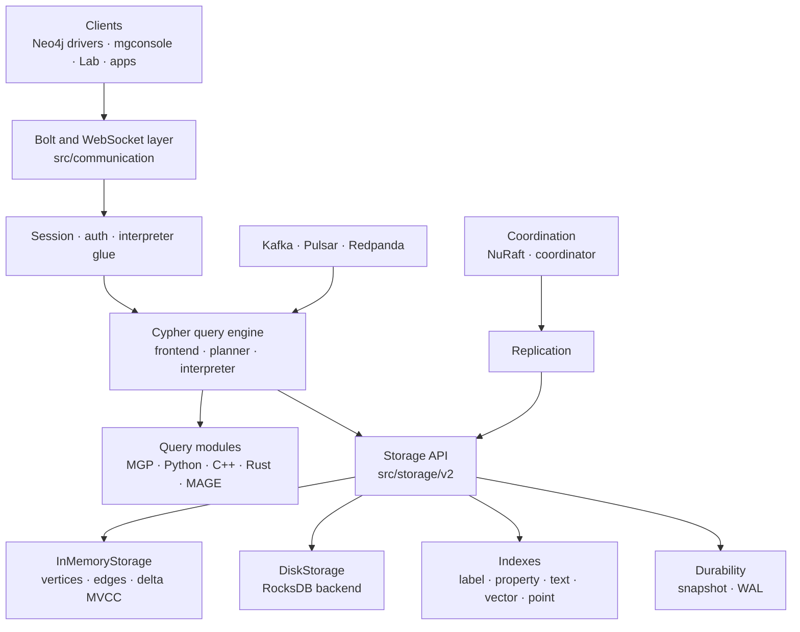
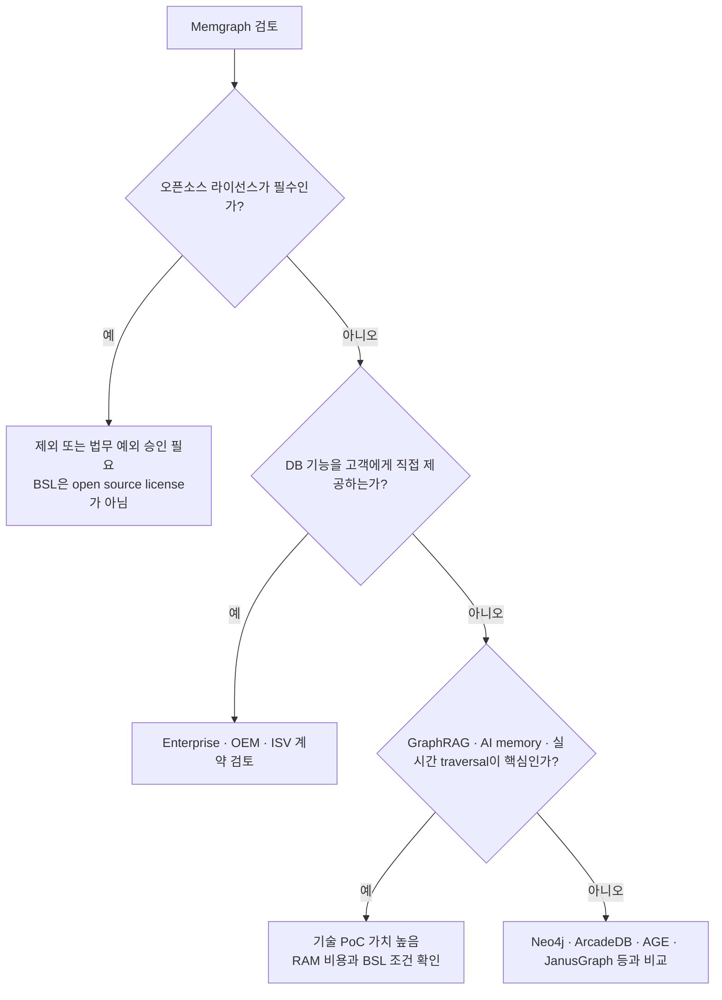

# Memgraph 2026 최신 분석 — 라이선스와 AI GraphRAG 포지셔닝

작성일: 2026-06-09  
분석 기준: `memgraph/memgraph` 로컬 clone `.repos/memgraph`, commit `e558f3d` (`2026-06-08 feat: show garbage collector in SHOW TRANSACTIONS`)

## 결론 요약

Memgraph는 기술적으로는 **C++ 기반 인메모리 우선 property graph DB**이며, Neo4j 호환 Cypher/Bolt, ACID, 스트리밍, 벡터 인덱스, MAGE 알고리즘 라이브러리까지 갖춘 실시간 그래프 엔진이다. 2026년 현재 README와 제품 페이지는 Memgraph를 일반 그래프 DB보다 **AI context, GraphRAG, agent memory, real-time graph analytics** 쪽으로 강하게 포지셔닝한다.

다만 라이선스 관점에서는 **엄격한 의미의 오픈소스 DB로 분류하면 안 된다.** 저장소 루트 `LICENSE`는 소스가 파일별로 **Business Source License 1.1 (BSL)** 또는 **Memgraph Enterprise License (MEL)** 아래 제공된다고 명시한다. Community Edition은 BSL이고, Enterprise Edition은 MEL이다. 일부 Apache License 텍스트가 포함되어 있지만 현재 Community 본체가 Apache-2.0이라는 뜻은 아니다.

서비스 채택 관점의 짧은 판단은 다음과 같다.

| 상황 | 판단 |
|---|---|
| 내부 서비스에서 그래프 DB로 직접 운영 | BSL의 Authorized Purpose에 맞는지 확인 후 가능성 있음 |
| 고객에게 DBaaS, graph API, standalone graph service로 제공 | BSL 제한에 걸릴 가능성이 높아 상용/OEM 계약 검토 필요 |
| "오픈소스 DB만 사용"이 명시 요구사항 | 제외하는 것이 안전 |
| GraphRAG, AI memory, 실시간 관계 탐색이 핵심 | 기술 적합도는 높음 |
| permissive OSS가 필요 | JanusGraph, HugeGraph, NebulaGraph, ArcadeDB, Apache AGE, Dgraph 등을 우선 검토 |

## 프로젝트 개요

Memgraph는 property graph를 **RAM 중심 자료구조**로 저장하고 Cypher로 질의하는 그래프 DB다. 기존 Neo4j 생태계와 호환되도록 Bolt 프로토콜과 openCypher 계열 쿼리 인터페이스를 제공한다. 2026년 README는 다음 세 가지 사용처를 전면에 둔다.

- **GraphRAG**: 벡터 검색, 그래프 확장, ranking, prompt assembly를 단일 Cypher 쿼리로 묶는 Atomic GraphRAG 지향.
- **AI memory / agentic workflows**: semantic, episodic, procedural memory를 연결된 그래프로 저장하고 실시간 context로 제공.
- **Real-time graph analytics**: fraud detection, network analysis, infrastructure monitoring, supply chain dependency 분석.

기존 그래프 DB와 비교하면 "디스크 기반 범용 DB"보다는 **낮은 지연시간의 in-memory graph serving engine**에 가깝다. 이 점이 GraphRAG와 agent memory에 잘 맞지만, 데이터셋이 메모리 예산을 크게 넘는 경우에는 신중한 용량 설계가 필요하다.

## 라이선스 확인

### 저장소 기준

로컬 clone에서 확인한 파일:

| 파일 | 확인 내용 |
|---|---|
| `.repos/memgraph/LICENSE` | 저장소 소스는 BSL 또는 MEL로 다양하게 라이선스된다고 명시 |
| `.repos/memgraph/licenses/BSL.txt` | Memgraph Community Edition (MCE) version 2.0의 BSL 1.1 조건 |
| `.repos/memgraph/licenses/APL.txt` | Change License로 쓰이는 Apache License 2.0 텍스트 |
| `.repos/memgraph/licenses/MEL.pdf` | Memgraph Enterprise License |
| `.repos/memgraph/README.md` | Community는 BSL, Enterprise는 MEL이라고 명시 |

`BSL.txt`의 핵심 조건은 다음과 같다.

| 항목 | 내용 |
|---|---|
| License | Business Source License 1.1, Memgraph amendment |
| Licensed Work | Memgraph Community Edition (MCE) version 2.0 |
| Additional Use Grant | Authorized Purpose에 한해 production 사용 허용 |
| Authorized Purpose 제한 | 내부 비즈니스 목적은 허용하되, DBaaS/standalone service/경쟁 솔루션 생성/3자 제공은 제한 |
| Change License | Apache License 2.0 |
| Change Date | 파일에는 `2030-15-05`로 표기되어 있음. 날짜 형식이 비정상적이므로 법무 확인 필요 |
| 명시 문구 | BSL은 "open source license"가 아니라고 명시 |

### 실무 해석

Memgraph Community Edition은 "소스 공개 + 제한적 production 사용 가능"에 가깝다. 그래서 GitHub README나 가격 페이지에서 "open source"라는 표현이 보이더라도, 엔지니어링 의사결정 문서에서는 **source-available / BSL**로 분류하는 편이 안전하다.

특히 다음 사용 방식은 별도 검토가 필요하다.

- 고객에게 Memgraph 자체를 데이터베이스 서비스로 노출하는 SaaS.
- 제품 안에 Memgraph를 번들해 고객 환경에 배포하는 OEM/ISV 형태.
- GraphRAG API나 graph query endpoint가 사실상 managed graph database처럼 동작하는 서비스.
- Memgraph와 직접 경쟁하는 데이터베이스, graph platform, DBaaS를 만드는 경우.

공식 Legal 페이지도 Community Edition은 BSL, Enterprise Edition은 MEL, 임베드/재배포는 OEM License 영역으로 분리한다.

## 핵심 특징 및 차별점

### 1. In-memory first graph storage

`src/storage/v2/vertex.hpp`의 `Vertex`는 `in_edges`, `out_edges`를 보유하며, edge triple 안에는 인접 `Vertex *` 포인터가 들어간다. 이는 multi-hop traversal에서 인접 노드를 직접 따라가는 구조다.

```cpp
using EdgeTriple = std::tuple<EdgeTypeId, Vertex *, EdgeRef>;

struct Vertex {
  const Gid gid;
  small_vector<LabelId> labels;
  Edges in_edges;
  Edges out_edges;
  PropertyStore properties;
  RWSpinLock lock;
  Delta *delta() const;
};
```

이 설계는 디스크 I/O를 줄이고 pointer traversal을 빠르게 만들지만, working set이 메모리에 올라와야 성능 이점이 극대화된다.

### 2. Delta 기반 MVCC

`src/storage/v2/delta_action.hpp`에는 `SET_PROPERTY`, `ADD_LABEL`, `ADD_IN_EDGE`, `REMOVE_OUT_EDGE` 같은 변경 타입이 정의되어 있다. `src/storage/v2/inmemory/storage.hpp`는 TUM의 MVCC paper를 언급하며, Memgraph 구현은 snapshot isolation을 제공한다고 설명한다.

핵심은 객체를 직접 덮어쓰기보다 delta chain으로 과거 상태를 재구성하는 구조다. 이 방식은 graph traversal과 concurrent update가 동시에 일어나는 실시간 워크로드에 적합하다.

### 3. Cypher/Bolt 호환

Memgraph는 Neo4j 생태계의 개발 경험을 흡수한다.

- Bolt 기본 포트 `7687`.
- Cypher 계열 패턴 매칭.
- `neo4j-driver`, `pymgclient`, `mgconsole`, Memgraph Lab 사용 가능.
- Neo4j에서 이전하는 팀이 쿼리와 드라이버를 재사용하기 쉽다.

단, 완전한 Neo4j 호환성이나 GQL 표준 구현을 전제로 두면 안 되고 실제 쿼리 호환성은 PoC에서 확인해야 한다.

### 4. Vector/text index와 GraphRAG

2026년 Memgraph의 가장 중요한 변화는 AI 워크로드 중심 포지셔닝이다. 공식 vector search 문서는 native vector search를 다음처럼 설명한다.

- 별도 vector DB 없이 graph traversal과 vector similarity를 한 엔진에서 수행.
- node와 edge vector index 지원.
- `f32`, `f16` 같은 scalar kind로 메모리/정밀도 trade-off 조정.
- graph traversal과 similarity search를 하나의 Cypher query로 결합.

Memgraph 3.8 발표에서는 **Single Store Vector Index**를 통해 vector를 property store와 index에 중복 저장하지 않고, index에 저장한 뒤 native storage에는 lightweight reference를 두는 방향을 강조한다. 저장소 코드에서도 `src/storage/v2/indices/vector_index.*`, `vector_edge_index.*`, `property_value.cppm`의 `VectorIndexId` 타입이 이 방향을 뒷받침한다.

### 5. MAGE와 Query Module

MAGE는 Memgraph Advanced Graph Extensions다. 2026년 기준 별도 repo가 아니라 `memgraph/memgraph` 저장소의 `mage/` 디렉토리에 통합되어 있다. 주요 구조는 다음과 같다.

| 경로 | 역할 |
|---|---|
| `mage/cpp` | C++ 기반 고성능 알고리즘 모듈 |
| `mage/python` | Python query module |
| `mage/rust` | Rust MGP binding |
| `query_modules/` | PageRank, Katz, Node2Vec, community detection 등 built-in module |
| `include/mg_procedure.h` | Memgraph Query Procedure C API |
| `src/query/procedure/` | procedure loading/runtime 구현 |

GraphRAG나 추천 시스템처럼 "검색 결과를 그래프 알고리즘으로 재정렬"하는 패턴에서 MAGE는 애플리케이션 레이어 코드를 줄이는 장점이 있다.

### 6. Streaming ingestion

`src/integrations/kafka`, `src/integrations/pulsar`, `src/query/stream`을 통해 Kafka, Pulsar, Redpanda 기반 스트림 ingest를 지원한다. 이 기능은 fraud detection, network telemetry, infrastructure graph처럼 이벤트가 계속 들어오는 그래프에 맞다.

## 아키텍처 분석



전체적으로 Memgraph는 모듈식 컴포넌트를 가진 **단일 서버 바이너리형 DBMS**다. 클라이언트가 Bolt/WebSocket으로 들어오면 쿼리 인터프리터가 Cypher를 파싱·계획·실행하고, `Storage` 추상화를 통해 in-memory 또는 disk backend에 접근한다. replication과 coordinator 계층은 HA 기능을 담당한다.

## 기술 스택

| 영역 | 기술 |
|---|---|
| Core language | C, C++ |
| Build | CMake, Conan |
| C++ standard | C++23 (`CMAKE_CXX_STANDARD 23`) |
| Query | Cypher/openCypher 계열 |
| Protocol | Bolt, WebSocket, HTTP metrics |
| Storage | In-memory native graph, optional RocksDB disk backend |
| Transaction | Delta-based MVCC, snapshot isolation |
| Durability | Snapshot, WAL |
| Index | label/property, text, vector, edge vector, point/geospatial |
| Streaming | Kafka, Pulsar, Redpanda |
| HA | Replication, NuRaft 기반 coordination |
| Extension | MGP C API, Python/C++/Rust query modules, MAGE |

## API 및 인터페이스

| 인터페이스 | 용도 |
|---|---|
| Cypher | graph query, mutation, traversal |
| Bolt | Neo4j 호환 드라이버 접속 |
| Memgraph Lab | 시각화 및 쿼리 UI |
| mgconsole | CLI |
| MGP API | custom procedure / query module |
| Stream query | Kafka/Pulsar/Redpanda ingest |
| Vector procedures | `vector_search.search`류 similarity search |
| Schema introspection | `SHOW SCHEMA INFO`로 graph ontology/schema 추출 |

AI 에이전트 관점에서는 `SHOW SCHEMA INFO`와 vector+graph query 결합이 중요하다. 에이전트가 Text2Cypher를 하거나 GraphRAG context를 만들 때, graph schema와 queryable procedure set을 함께 노출할 수 있기 때문이다.

## 성능 특성

강점은 명확하다.

- 메모리 상주 graph traversal로 multi-hop latency가 낮다.
- 벡터와 그래프가 같은 엔진에 있어 별도 vector DB 동기화 비용이 줄어든다.
- Single Store Vector Index는 embedding 중복 저장을 줄이는 방향이다.
- Parallel Runtime은 대형 scan/aggregation 쿼리의 CPU 활용도를 높이는 방향이다.
- Supernode 주변 concurrent edge write 개선은 ingestion 병목을 줄인다.

약점과 제약도 분명하다.

- RAM 중심 구조이므로 대형 그래프의 비용 모델이 메모리에 민감하다.
- vector index도 같은 메모리 예산을 쓴다.
- 복잡한 analytical workload는 쿼리 형태에 따라 parallel runtime 적용 여부를 확인해야 한다.
- distributed graph sharding DB라기보다 single logical DB + replication/HA에 가깝게 보는 편이 안전하다.

## 배포 및 운영

공식 README 기준 설치 경로는 다음과 같다.

| 방식 | 비고 |
|---|---|
| Docker | 개발/PoC에 가장 간단 |
| Debian/Ubuntu/RPM | VM 또는 bare metal 설치 |
| Kubernetes Helm chart | standalone 및 HA chart 제공 |
| Memgraph Cloud | AWS 기반 managed |
| Enterprise | SSO, fine-grained access control, multi-tenancy, audit, automatic failover 등 |

Community Edition도 공식 가격 페이지에서는 production-ready라고 설명하지만, 보안/컴플라이언스/멀티테넌시/자동 failover/audit 같은 기능은 Enterprise 영역으로 분리된다.

## 경쟁·비교 분석

| 항목 | Memgraph | Neo4j | FalkorDB | JanusGraph | Dgraph | Kuzu |
|---|---|---|---|---|---|---|
| 주 포지션 | 인메모리 Cypher graph DB + AI context | 표준급 property graph DB | Redis module + GraphBLAS | 분산 graph layer | GraphQL-first distributed graph | embedded analytical graph DB |
| 라이선스 | BSL/MEL | GPLv3 CE + 상용 | SSPL | Apache-2.0 | Apache-2.0 | MIT였으나 repo archive |
| OSS 엄격성 | 낮음 | GPL 허용 시 가능 | 낮음 | 높음 | 높음 | 라이선스는 좋지만 유지 리스크 |
| GraphRAG 적합성 | 높음 | 높음 | 높음 | 중간 | 중간 | 중간 |
| Vector 통합 | native vector/text index | Neo4j vector index | 외부/모듈 조합 확인 필요 | 외부 index 중심 | HNSW 지원 | vector extension |
| 대규모 분산 | HA/replication 중심 | Enterprise scale-out | Redis cluster 성격 확인 필요 | 강함 | 강함 | 단일 프로세스 embedded 중심 |
| Neo4j 호환성 | 높음 | 기준점 | Cypher 계열 | 낮음 | 낮음 | Cypher 계열 |

## 서비스 채택 판단



Memgraph는 다음 상황에 잘 맞는다.

- GraphRAG에서 vector search 후 graph traversal을 한 쿼리로 묶고 싶은 경우.
- Neo4j 드라이버와 Cypher 경험을 유지하면서 더 낮은 traversal latency를 원하는 경우.
- 실시간 이벤트를 그래프로 ingest하고 즉시 탐색해야 하는 경우.
- 알고리즘을 MAGE/query module로 DB 안에서 실행하고 싶은 경우.

다음 상황에는 덜 맞는다.

- 라이선스 정책상 OSI-approved 또는 permissive OSS만 허용하는 조직.
- 고객에게 graph DB 자체를 managed service로 제공하려는 제품.
- 단일 노드 메모리 예산을 크게 넘는 초대형 graph를 shard-first로 운영해야 하는 경우.
- RDF/SPARQL/OWL 표준 온톨로지 호환성이 핵심인 경우.

## 종합 평가

Memgraph의 엔지니어링 매력은 **C++ in-memory graph engine + Cypher 호환 + vector/text index + MAGE** 조합이다. 특히 2026년 방향성은 일반 graph DB보다 AI infrastructure에 가깝다. "vector DB + graph DB + Python orchestration"으로 흩어진 GraphRAG pipeline을 하나의 Cypher query와 하나의 storage boundary 안에 넣으려는 전략은 명확하다.

하지만 라이선스는 강한 주의점이다. Community Edition이 무료이고 소스가 공개되어 있어도 BSL은 오픈소스 라이선스가 아니다. 내부 서비스에서 쓰는 것은 가능성이 있지만, 외부 고객에게 graph capability를 제공하거나 DB를 제품에 포함해 배포하는 순간 상용/OEM 검토가 필요하다.

따라서 Memgraph는 **기술적으로는 GraphRAG/agent memory 후보군 상위**, **라이선스적으로는 source-available 후보**로 분리해서 평가해야 한다.

## 참고 소스

- Memgraph GitHub: https://github.com/memgraph/memgraph
- Memgraph Legal: https://memgraph.com/legal
- Memgraph Pricing: https://memgraph.com/pricing
- Memgraph Vector Search: https://memgraph.com/vector-search
- Memgraph 3.8 release: https://memgraph.com/blog/memgraph-3-8-release-atomic-graphrag-vector-single-store-parallel-runtime
- Memgraph Enterprise: https://memgraph.com/enterprise
- Local source: `.repos/memgraph`, commit `e558f3d`
