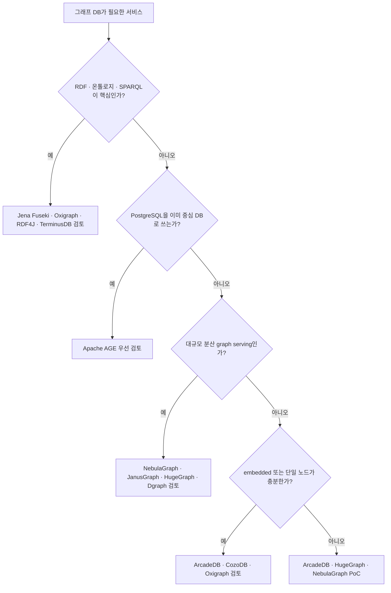

# 오픈소스 그래프 데이터베이스 후보 조사

작성일: 2026-06-07

## 결론 요약

2026년 기준으로 "오픈소스 그래프 데이터베이스"를 찾을 때 가장 먼저 분리해야 할 축은 **property graph DB**, **RDF/SPARQL triplestore**, **graph-capable multi-model DB**, **source-available DB**이다. 특히 DB 업계에서는 무료 Community Edition, source-available, Apache-2.0 오픈소스가 자주 섞여 표현되므로 라이선스 확인이 핵심이다.

상용 서비스에서 라이선스 리스크를 낮추고 싶다면 1차 후보는 **JanusGraph, Apache HugeGraph, NebulaGraph, ArcadeDB, Apache AGE, Apache Jena Fuseki, Oxigraph**이다. 이들은 DB 서버 또는 graph engine이 Apache-2.0, MIT/Apache, EDL/BSD 계열처럼 비교적 명확한 오픈소스 라이선스를 가진다.

**CozoDB, TypeDB, Neo4j Community, Virtuoso Open Source**는 오픈소스이지만 MPL/GPL 계열 제약을 이해해야 한다. **Kuzu**는 MIT 라이선스였지만 2025-10-10에 repository가 archive되어 신규 프로덕션 채택은 신중해야 한다. **FalkorDB, Memgraph, ArangoDB 최신 Community Edition, TigerGraph DB 서버**는 엄격한 의미의 오픈소스 DB로 분류하지 않는 것이 안전하다.

## 분류 기준

| 분류 | 의미 | 서비스 채택 관점 |
|---|---|---|
| Permissive OSS | Apache-2.0, MIT, BSD 계열 | 상용 서비스에 가장 무난 |
| Weak copyleft OSS | MPL-2.0, EDL/BSD-style | 수정 파일 공개 등 조건 확인 필요 |
| Strong copyleft OSS | GPL 계열 | 배포/결합 방식에 따라 제약 큼 |
| Source-available | SSPL, BSL, vendor community license | 오픈소스로 부르지 않는 것이 안전 |
| Proprietary free edition | 무료 사용 가능하지만 DB 서버 비공개 | OSS 요구사항 불만족 |

## 추천 후보 요약

| DB | 유형 | 라이선스 | 쿼리 언어 | 구현 | 현재 판단 |
|---|---|---|---|---|---|
| JanusGraph | 분산 property graph layer | Apache-2.0 | Gremlin | Java | 대규모 분산 그래프, Cassandra/HBase 자산이 있으면 우선 검토 |
| Apache HugeGraph | full-stack property graph | Apache-2.0 | Gremlin, 일부 Cypher | Java | Apache 계열 graph DB가 필요하면 강한 후보 |
| NebulaGraph | native distributed graph DB | Apache-2.0 | nGQL | C++ | 대규모 분산 graph serving 후보 |
| ArcadeDB | multi-model graph DB | Apache-2.0 | SQL, Cypher, Gremlin, GraphQL | Java | 임베디드/서버형 모두 가능한 실용 후보 |
| Apache AGE | PostgreSQL graph extension | Apache-2.0 | openCypher + SQL | C | Postgres 기반 서비스에 가장 자연스러운 선택 |
| Dgraph | distributed GraphQL graph DB | Apache-2.0 | GraphQL, DQL | Go | GraphQL-first 데이터 API에 적합 |
| Apache Jena Fuseki | RDF/SPARQL server | Apache-2.0 | SPARQL | Java | 온톨로지/RDF 지식 그래프 표준 후보 |
| Oxigraph | RDF/SPARQL graph DB | MIT/Apache-2.0 | SPARQL | Rust | 경량 RDF/SPARQL, embedded/CLI/server 후보 |
| Eclipse RDF4J | RDF framework/server | EDL, BSD-style | SPARQL | Java | Java RDF stack, framework 성격이 강함 |
| TerminusDB | document + knowledge graph | Apache-2.0 | WOQL, GraphQL, REST | Prolog/Rust | versioned data, git-for-data 지식 그래프에 적합 |

## 조건부 후보

| DB | 라이선스 | 조건부 이유 | 적합한 경우 |
|---|---|---|---|
| CozoDB | MPL-2.0 | 파일 단위 weak copyleft | embedded relational-graph-vector, Datalog 기반 GraphRAG |
| TypeDB CE | MPL-2.0 | 전통적 graph DB라기보다 typed knowledge database | 강한 스키마, 추론, TypeQL 모델링 |
| Neo4j Community | GPLv3 | copyleft와 Enterprise 기능 경계 | Cypher 생태계가 최우선이고 GPL 허용 가능 |
| Virtuoso Open Source | GPL + OpenSSL exception | GPL 제약, 오래된 코드베이스 | RDF/SPARQL, Linked Data, multi-model |
| Kuzu | MIT | 2025-10-10 archive됨 | 기존 사용 유지, 연구/프로토타입 |

## 오픈소스로 보기 어려운 후보

| DB | 현재 상태 | 제외 이유 |
|---|---|---|
| FalkorDB | DB 서버 소스 공개, SSPLv1 | SSPL은 source-available로 분류하는 것이 안전. DB 기능을 서비스로 제공하면 의무가 커짐 |
| Memgraph | BSL 1.1 + Memgraph Enterprise License | repo LICENSE가 BSL/MEL을 명시 |
| ArangoDB 최신 Community Edition | Community License + source BSL 계열 | Community License가 내부 사용, 100GB aggregate 제한, 재배포 제한 등을 둠 |
| TigerGraph DB | 무료 Community Edition 있음 | GitHub의 Apache repo는 GraphRAG/도구 계층이고 DB 서버는 proprietary |

## 생태계 지도

```mermaid
flowchart TD
    G["오픈소스 그래프 DB 후보"] --> PG["Property graph"]
    G --> RDF["RDF · SPARQL"]
    G --> MM["Multi-model · graph-capable"]
    G --> EMB["Embedded · library"]
    G --> SA["Source-available · 주의"]

    PG --> JG["JanusGraph"]
    PG --> HG["Apache HugeGraph"]
    PG --> NG["NebulaGraph"]
    PG --> DG["Dgraph"]
    PG --> N4J["Neo4j Community"]

    RDF --> Jena["Apache Jena Fuseki"]
    RDF --> Oxi["Oxigraph"]
    RDF --> RDF4J["Eclipse RDF4J"]
    RDF --> Virt["Virtuoso Open Source"]

    MM --> Arcade["ArcadeDB"]
    MM --> Term["TerminusDB"]
    MM --> AGE["Apache AGE"]
    MM --> TypeDB["TypeDB"]

    EMB --> Cozo["CozoDB"]
    EMB --> Kuzu["Kuzu archived"]
    EMB --> Arcade
    EMB --> Oxi

    SA --> Falkor["FalkorDB SSPL"]
    SA --> Mem["Memgraph BSL"]
    SA --> Arango["ArangoDB current CE"]
    SA --> Tiger["TigerGraph DB"]
```

## 워크로드별 추천

### 1. 상용 서비스에서 permissive OSS가 필수

우선순위:

1. **Apache AGE**: 이미 PostgreSQL을 쓰고 있고 graph traversal이 서비스 일부라면 가장 운영 부담이 작다.
2. **ArcadeDB**: 단일 DB 안에서 graph/document/vector/search를 함께 다루고 싶을 때 적합하다.
3. **NebulaGraph**: 대규모 분산 graph serving이 목표일 때 적합하다.
4. **Apache HugeGraph**: Gremlin/TinkerPop 표준과 Apache 생태계를 선호할 때 적합하다.
5. **JanusGraph**: Cassandra, HBase, Bigtable 같은 분산 스토리지 운영 경험이 이미 있을 때 적합하다.

### 2. GraphRAG 또는 지식 그래프

Property graph 기반 GraphRAG라면 **ArcadeDB, Apache AGE, Neo4j Community, CozoDB, Kuzu**가 개발 경험상 접근성이 좋다. 다만 Neo4j는 GPL, CozoDB는 MPL, Kuzu는 archive 상태를 고려해야 한다.

온톨로지, RDF, SPARQL, linked data가 중심이면 **Apache Jena Fuseki, Oxigraph, Eclipse RDF4J, TerminusDB, Virtuoso Open Source**를 먼저 봐야 한다. 이 계열은 property graph보다 표준 semantic web toolchain과의 호환성이 좋다.

### 3. 대규모 분산 그래프

**NebulaGraph, JanusGraph, Apache HugeGraph, Dgraph**가 핵심 후보이다. JanusGraph는 graph engine과 storage backend가 분리되어 운영 복잡도가 있지만 기존 Cassandra/HBase 자산을 활용할 수 있다. NebulaGraph는 자체 분산 graph DB에 가깝고, HugeGraph는 TinkerPop 호환과 full-stack toolchain을 제공한다. Dgraph는 GraphQL-first API가 강점이다.

### 4. embedded 또는 애플리케이션 내장

**CozoDB, ArcadeDB embedded, Oxigraph, Kuzu**를 볼 수 있다. CozoDB는 Datalog 기반 relational-graph-vector 엔진이라 GraphRAG 실험에 맞고, ArcadeDB는 Java embedded/server 양쪽이 가능하다. Kuzu는 임베디드 Cypher DB로 훌륭했지만 archive 상태이므로 신규 서비스 핵심 DB로는 신중해야 한다.

## 핵심 후보별 메모

### JanusGraph

- Problem: 거대한 property graph를 단일 DB에 묶지 않고 분산 스토리지 위에서 처리.
- Key Features: Apache TinkerPop/Gremlin, Cassandra/HBase/Bigtable/ScyllaDB backend, Elasticsearch/Solr/Lucene index backend.
- Pros: Apache-2.0, 표준 Gremlin 생태계, 스토리지 선택권.
- Cons: 독립 DB라기보다 graph layer라 운영 복잡도가 높다.
- Local source: `.repos/janusgraph`, commit `3ed2758`, `janusgraph-core`, `janusgraph-cql`, `janusgraph-hbase`, `janusgraph-solr`.

### Apache HugeGraph

- Problem: Gremlin 호환 graph DB를 더 빠르게 시작하고, backend/store/toolchain을 한 프로젝트 안에서 제공.
- Key Features: HugeGraph Server, REST API, Gremlin, 일부 Cypher, RocksDB/HBase/Cassandra/ScyllaDB/HStore backend.
- Pros: Apache-2.0, full-stack 구성, Gremlin 표준.
- Cons: Apache Incubating 성격과 JVM 기반 운영 부담.
- Local source: `.repos/hugegraph`, commit `1f61c48`, `hugegraph-server`, `hugegraph-store`, `hugegraph-api`.

### NebulaGraph

- Problem: 대규모 graph를 native distributed DB로 serving.
- Key Features: C++ graphd/storaged/metad 구조, Raft 기반 분산, nGQL.
- Pros: Apache-2.0, 수평 확장 지향, 성능 중심 C++ 구현.
- Cons: nGQL과 자체 운영 모델 학습 필요.
- Local source: `.repos/nebula`, commit `cdef57e`.

### ArcadeDB

- Problem: graph, document, key-value, vector/search를 단일 엔진에서 처리.
- Key Features: SQL, Cypher, Gremlin, GraphQL, MongoDB-like API, embedded/server, Raft HA.
- Pros: Apache-2.0, 기능 범위가 넓고 임베디드와 서버형 모두 가능.
- Cons: 전문 graph DB 대비 순수 graph 성능은 별도 검증 필요.
- Local source: `.repos/arcadedb`, commit `4409a00`, `engine`, `server`, `gremlin`, `bolt`, `ha-raft`.

### Apache AGE

- Problem: PostgreSQL에 graph query 기능을 extension으로 추가.
- Key Features: openCypher parser, PostgreSQL planner/executor와 통합, SQL과 graph query 병행.
- Pros: Apache-2.0, 기존 Postgres 운영 모델 재사용.
- Cons: 순수 graph DB보다 graph-native storage/optimizer 한계가 있다.
- Local source: `.repos/apache-age`, commit `73d0705`, `src/backend`, `src/include`, `drivers`.

### Dgraph

- Problem: GraphQL-first 분산 graph DB.
- Key Features: GraphQL, DQL, gRPC/HTTP, Zero/Alpha cluster, Badger KV.
- Pros: Apache-2.0, API 서버와 graph DB 경계가 단순하다.
- Cons: Cypher/Gremlin 생태계와는 다르며 DQL/GraphQL 모델에 적응해야 한다.
- Local source: `.repos/dgraph`, commit `55c5b7f`, `dgraph`, `dql`, `query`, `worker`.

### CozoDB

- Problem: embedded relational-graph-vector database를 Datalog로 제공.
- Key Features: Datalog query, graph algorithms, vector search, RocksDB/SQLite/TiKV 등 storage option.
- Pros: 작고 내장하기 좋으며 GraphRAG 실험에 적합.
- Cons: MPL-2.0, 전통적 graph server보다 라이브러리/embedded 성격이 강하다.
- Local source: `.repos/cozo`, commit `481af05`, `cozo-core`, `cozo-bin`, language bindings.

### TypeDB

- Problem: entity-relation-attribute와 type system으로 복잡한 domain model을 안전하게 표현.
- Key Features: TypeQL, 강한 스키마, polymorphic query, logical modeling.
- Pros: MPL-2.0, 지식 표현과 추론적 모델링에 강하다.
- Cons: Cypher/Gremlin 기반 graph DB와 모델이 다르다.
- Local source: `.repos/typedb`, commit `c8e2e2e`, Rust 기반 `database`, `encoding`, `ir`.

### Apache Jena Fuseki

- Problem: RDF dataset을 SPARQL endpoint로 제공.
- Key Features: SPARQL 1.1 query/update, Graph Store Protocol, TDB storage, SHACL/text modules.
- Pros: Apache-2.0, RDF 표준 생태계의 안정적 선택.
- Cons: property graph traversal UX와는 다르다.
- Local source: `.repos/jena`, commit `b9e9874f`, `jena-fuseki2`, `jena-tdb2`, `jena-arq`.

### Oxigraph

- Problem: Rust 기반 경량 SPARQL graph database.
- Key Features: standalone CLI/server, RDF/SPARQL, Python/JS bindings, RocksDB backend.
- Pros: MIT/Apache-2.0 dual license, embedded와 server 모두 가능.
- Cons: Jena/RDF4J보다 생태계 규모는 작다.
- Local source: `.repos/oxigraph`, commit `fd46987`, `lib/oxigraph`, `cli`, `python`, `js`.

## 서비스 채택 의사결정

## 로컬 repo 분석 근거

| Repo | Commit | License 확인 | 주요 구조 |
|---|---:|---|---|
| `.repos/janusgraph` | `3ed2758` | Apache-2.0 | Gremlin/TinkerPop graph layer, backend modules |
| `.repos/hugegraph` | `1f61c48` | Apache-2.0 | server, API, backend store, HStore |
| `.repos/nebula` | `cdef57e` | Apache-2.0 | distributed graph DB core |
| `.repos/arcadedb` | `4409a00` | Apache-2.0 | engine, server, Gremlin, Bolt, RAFT |
| `.repos/apache-age` | `73d0705` | Apache-2.0 | PostgreSQL extension, parser, drivers |
| `.repos/dgraph` | `55c5b7f` | Apache-2.0 | GraphQL/DQL distributed graph DB |
| `.repos/cozo` | `481af05` | MPL-2.0 | Rust core, server binary, bindings |
| `.repos/typedb` | `c8e2e2e` | MPL-2.0 | Rust database, encoding, IR |
| `.repos/neo4j` | `8f4aa6ad` | GPLv3 | community graph DB code |
| `.repos/kuzu` | `89f0263` | MIT | archived embedded graph DB |
| `.repos/jena` | `b9e9874f` | Apache-2.0 | Fuseki, ARQ, TDB |
| `.repos/rdf4j` | `71c59a1` | EDL/BSD-style | RDF framework, server, workbench |
| `.repos/oxigraph` | `fd46987` | MIT/Apache-2.0 | Rust SPARQL DB, CLI, bindings |
| `.repos/terminusdb` | `f1b101b` | Apache-2.0 | git-for-data knowledge graph |
| `.repos/virtuoso-opensource` | `692194f` | GPL + OpenSSL exception | RDF/multi-model server |
| `.repos/FalkorDB` | `5ffe89a` | SSPLv1 | Redis module graph DB |
| `.repos/memgraph` | `5f40bf3` | BSL/MEL | C++ property graph DB |

## 최종 shortlist

상용 서비스에서 "오픈소스 그래프 DB"를 요구한다면 다음 순서로 보는 것이 현실적이다.

1. **Postgres 기반 서비스**: Apache AGE
2. **단일 DB로 graph + document + vector/search**: ArcadeDB
3. **분산 property graph**: NebulaGraph, Apache HugeGraph, JanusGraph
4. **GraphQL-first graph backend**: Dgraph
5. **RDF/SPARQL knowledge graph**: Apache Jena Fuseki, Oxigraph, RDF4J
6. **embedded GraphRAG/로컬 엔진**: CozoDB, ArcadeDB embedded, Oxigraph

엄격한 OSS 정책이라면 FalkorDB, Memgraph, 최신 ArangoDB Community Edition, TigerGraph DB는 제외하거나 별도 법무/상용 계약 검토 대상으로 분리한다.

## 참고 자료

- [JanusGraph GitHub](https://github.com/JanusGraph/janusgraph)
- [Apache HugeGraph Introduction](https://hugegraph.apache.org/docs/introduction/)
- [NebulaGraph GitHub](https://github.com/vesoft-inc/nebula)
- [ArcadeDB Pricing and License](https://arcadedb.com/pricing.html)
- [Apache AGE Overview](https://age.apache.org/overview/)
- [Dgraph GitHub](https://github.com/dgraph-io/dgraph)
- [CozoDB GitHub](https://github.com/cozodb/cozo)
- [Kuzu GitHub](https://github.com/kuzudb/kuzu)
- [TypeDB GitHub](https://github.com/typedb/typedb)
- [Neo4j Open Core Licensing FAQ](https://neo4j.com/open-core-and-neo4j/)
- [Apache Jena Fuseki](https://jena.apache.org/documentation/fuseki2/)
- [Eclipse RDF4J Project](https://projects.eclipse.org/projects/technology.rdf4j)
- [Oxigraph GitHub](https://github.com/oxigraph/oxigraph)
- [TerminusDB](https://terminusdb.org/)
- [ArangoDB Community Edition License Agreement](https://arangodb.com/wp-content/uploads/2024/05/ADB-Community-License_31OCT2023.pdf)
- [FalkorDB GitHub](https://github.com/FalkorDB/FalkorDB)
- [Memgraph GitHub](https://github.com/memgraph/memgraph)
- [TigerGraph GraphRAG GitHub](https://github.com/tigergraph/graphrag)
