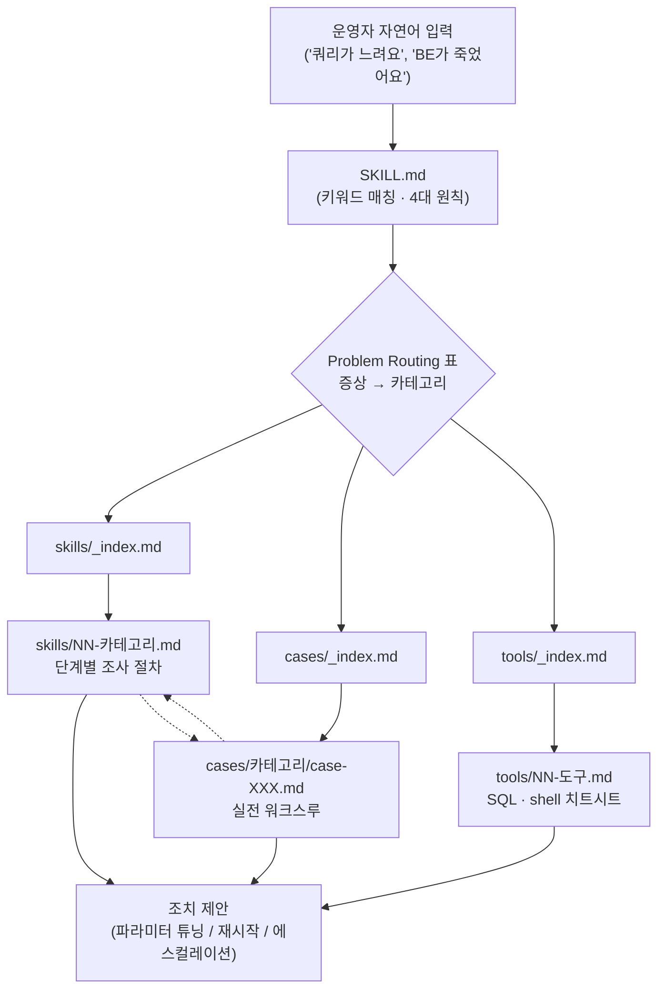
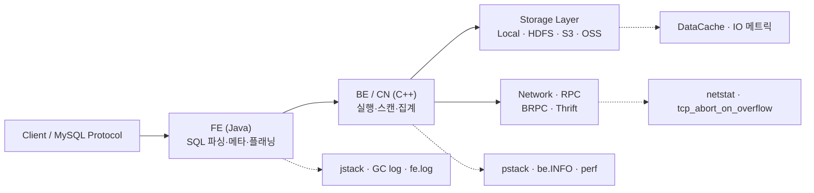
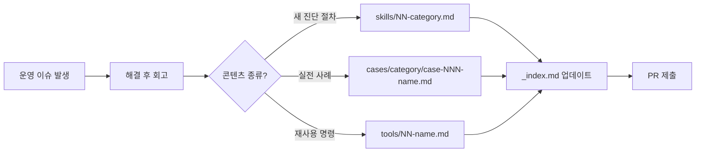

# StarRocks Debug Skills 심층 분석

## 1. 프로젝트 개요

| 항목 | 내용 |
|------|------|
| **리포지토리** | https://github.com/StarRocks/starrocks-debug-skills |
| **소유 조직** | StarRocks (CelerData 후원) |
| **라이선스** | Apache 2.0 |
| **주요 자산** | Markdown 가이드, Python 로그 분석 스크립트 1종 |
| **최근 업데이트** | 2026-04-30 (활발히 유지보수 중) |
| **자료 규모** | Skill 12종, Case 28건(case-001 ~ case-031, 일부 결번), Tool 4종 |

### 한 줄 정의

**LLM 에이전트(특히 Claude Code의 Skill 시스템)가 StarRocks 운영 장애를 트리아지·진단할 수 있도록, 운영 경험을 "증상 → 조사 절차 → 근본 원인 → 조치"의 표준 워크플로로 정리한 공식 Skill 자료집**이다.

### 해결하려는 문제

StarRocks는 분산 MPP OLAP 엔진이라 장애 패턴이 **FE(Frontend, Java), BE/CN(Backend, C++), Storage, Network** 전 계층에 흩어져 있고, 동일한 증상("쿼리가 느려요")이 데드락, 풀 GC, 스캔 스큐, 컴팩션 정체 등 수십 가지 원인에서 비롯될 수 있다. 이 저장소는:

1. **공식 지식 자산의 표준화** — 사내 위키·티켓에 산재된 트러블슈팅 노하우를 외부 공개 가능한 형태로 응축
2. **LLM 친화적 포맷** — YAML frontmatter + 키워드 기반 라우팅으로 에이전트가 자동으로 관련 자료를 끌어쓰게 설계
3. **"10분 안에 복구, 시간 단위로 RCA"** 라는 운영 우선 원칙을 코드화

### 탄생 배경

`SKILL.md`의 description은 "the cluster is slow", "some tasks are failing" 같은 **모호한 자연어 표현에도 자동 트리거되도록** 의도적으로 작성되어 있다. 즉 이 저장소의 1차 사용자는 사람이 아니라 **AI 에이전트**이며, "운영자 ↔ 에이전트 ↔ 클러스터" 워크플로를 전제로 설계된 보기 드문 사례다.

---

## 2. 핵심 특징 및 차별점

### 2.1 AI Skill 포맷으로 작성된 운영 문서

전통적 런북(Runbook)과 달리, 모든 파일에 YAML frontmatter가 붙는다.

```yaml
---
type: skill | case | tool
category: query | import | node | ...
keywords: [query hang, slow query, profile, ...]
---
```

`SKILL.md`의 frontmatter는 의도적으로 broad-match 키워드를 나열해 LLM이 모호한 질문에도 이 Skill을 자동 선택하게 만든다. 이는 Claude Code의 [Skills](https://docs.claude.com/en/docs/claude-code/skills) 시스템과 정확히 호환되는 패턴이다.

### 2.2 "Restore in 10 minutes, root-cause within hours" 방법론

저장소 전반을 관통하는 4대 원칙:

1. **출혈 먼저 멈춘다 (Mitigate first)** — 파라미터 튜닝/세션 변수로 서비스 복구가 우선, 원인 추적은 그다음
2. **Top-down 조사** — Client → FE → BE/CN → Storage/Network 순서로 좁혀나감
3. **데이터 기반 (Data-driven)** — 모든 결론은 로그/메트릭/profile/stack trace로 뒷받침
4. **이진 배제법 (Binary exclusion)** — 세션 변수로 기능을 하나씩 꺼서 원인 좁히기

### 2.3 일관된 케이스 템플릿

모든 케이스가 동일한 6단 구조를 따른다.

```
Environment → Symptom → Investigation(Step-by-step) →
Root Cause → Resolution(단기/장기) → Lessons Learned
```

이 일관성 덕분에 LLM이 새 사례를 **few-shot 예시로 그대로 사용**할 수 있다.

### 2.4 버전 회귀 인덱스 역할

각 케이스 본문에 정확한 버전 정보가 박혀 있어, 업그레이드 전 회귀 위험 평가에 인덱스로 쓰인다.

| 케이스 | 영향 버전 | 권장 조치 |
|---|---|---|
| case-025 | 3.1 ~ 3.3 | InsertLoadJob 누수 — 패치 버전으로 업그레이드 |
| case-029 | 3.3.13 ~ 3.3.17 | Replica 메모리 누수 — 3.3.18+ 권장 |
| case-020 | 3.4 이하 | Hive Catalog가 FE 기동 차단 — 3.5.0의 lazy connector 사용 |
| case-026 | 전 버전 | async-profiler JVM crash — `proc_profile_cpu_enable` 비활성화 |

---

## 3. 아키텍처 분석

### 3.1 디렉토리 구조

```
starrocks_debug_skills/
├── README.md              # 개요
├── LICENSE                # Apache 2.0
├── SKILL.md               # 메인 진입점 (LLM 트리거)
├── CONTRIBUTING.md        # 기여 가이드 (템플릿/네이밍/품질 기준)
├── skills/                # 카테고리별 트러블슈팅 가이드 (12종)
│   └── _index.md          # 카테고리 라우팅 표
├── cases/                 # 실제 사례 워크스루
│   ├── _index.md          # 빠른 참조 표
│   └── <category>/        # 카테고리별 하위 폴더
└── tools/                 # 진단 도구 (SQL·shell 치트시트, 파이썬 스크립트)
    └── _index.md
```

### 3.2 LLM 에이전트 라우팅 흐름

운영자가 자연어로 증상을 표현하면, 에이전트는 다음 경로로 자료를 탐색한다.



`SkillFile <-.-> CaseFile`은 양방향 cross-link다. 모든 케이스 말미에 "Related Skills"가, 모든 Skill 말미에 "Related Cases"가 들어가 LLM이 컨텍스트를 다층적으로 가져갈 수 있다.

### 3.3 Top-down 조사 모델

`SKILL.md`가 명시한 조사 계층:



각 layer마다 사용하는 진단 명령이 다르며, `tools/01-diagnostic-commands.md`에 layer별로 정리되어 있다.

---

## 4. 커버 영역 상세

### 4.1 12개 Skill 카테고리

| # | Category | 대표 키워드 | 주요 증상 |
|---|---|---|---|
| 01 | query | hang, slow, profile, scan, join, skew | 쿼리 행, 느린 쿼리, 데이터 스큐 |
| 02 | import | broker load, RPC failed, publish timeout | 임포트 백로그, 게시 타임아웃 |
| 03 | node | BE crash, OOM, FE deadlock, FE GC | 노드 장애, 메모리/락 이슈 |
| 04 | materialized-view | MV refresh, rewrite, inactive | MV 리프레시 실패, 쿼리 재작성 실패 |
| 05 | data-lake | HMS, Kerberos, HDFS, S3 | 외부 카탈로그 연결 장애 |
| 06 | shared-data | DataCache, S3, leader switch | shared-data 모드 캐시·S3 이슈 |
| 07 | tablet | health, balance, skew, bucket | 태블릿 분포·건강성 |
| 08 | deployment | startup, port, BDB, JDK | 기동 실패, 포트 충돌 |
| 09 | high-concurrency | QPS, connection pool, query cache | 고QPS 최적화 |
| 10 | resource-isolation | resource group, queue, blacklist | 리소스 격리·차단 |
| 11 | balance | tablet scheduler, clone, decommission | 클러스터 밸런스, 노드 제거 |
| 12 | compaction | too many versions, compaction score | shared-nothing 컴팩션 |

### 4.2 사례 분포 (총 28건)

| 카테고리 | 케이스 수 | 비고 |
|---|---|---|
| node | 12 | **FE OOM 시리즈(case-021~031)가 가장 두꺼움** — 메타데이터·복잡 SQL·MV·Iceberg·heap config·glibc arena 등 |
| import | 4 | broker load, RPC, replica sync, ORC 압축 오버플로 |
| shared-data | 4 | stream load stuck, DataCache 손상, leader switch, autoscaling |
| data-lake | 2 | 네트워크 포화, Kerberos |
| tablet | 2 | 디스크 밸런싱 루프, inverted index pending |
| deployment | 2 | SSL 인증서, Hive Catalog 기동 차단 |
| query | 1 | scan skew (가장 빈 영역) |
| materialized-view | 1 | refresh failures |
| concurrency | 1 | memory volatility |

**관찰**: FE 메모리 트러블슈팅에 압도적으로 무게가 실려 있다. 이는 StarRocks 운영의 가장 큰 페인 포인트가 FE JVM 메모리 관리임을 시사한다.

### 4.3 진단 도구

| Tool | 내용 |
|---|---|
| `01-diagnostic-commands.md` | `SHOW BACKENDS`, `SHOW PROC '/current_queries'`, `jstack`, `pstack` 등 즉시 복붙용 |
| `02-information-schema.md` | 시스템 테이블 기반 분석 SQL |
| `03-mv-diagnostic-sql.md` | MV 리프레시/rewrite 진단 SQL |
| `analyze_logs.py` | FE/BE 로그에서 시간 범위 필터링 + `CpuCostNs`/`ScanBytes`/`MemCostBytes`로 정렬해 무거운 쿼리 추출 |

`analyze_logs.py`는 정규식으로 ISO 타임스탬프와 메트릭(`\|CpuCostNs=`, `\|ScanBytes=`, `\|MemCostBytes=`, `\|QueryFEAllocatedMemory=`)을 파싱해 정렬하는 ~150 라인 스크립트로, **자체적으로 가치 있는 도구라기보다 LLM이 호출할 수 있는 보조 유틸**의 성격이 강하다.

---

## 5. 실전 케이스 분석 예시

### Case-003: FE Deadlock → "Version Not Found"

**증상의 비직관성**이 잘 드러나는 사례.

| 단계 | 내용 |
|---|---|
| 증상 | 쿼리가 `version does not exist` 반환. BE는 이미 해당 버전을 재활용. |
| 1차 가설 | **FE Report timestamp 정체** — FE 데드락의 정전 신호 |
| 조사 | `jstack <fe_pid>` 캡처 후 `ReportHandler` 스레드 검사 |
| 근본 원인 | `LockManager.lock`에서 DB 락을 못 잡아 `tabletReport` 차단 → BE가 오래된 버전을 회수했지만 FE는 인지 못 함 |
| 단기 조치 | FE 재시작 |
| 장기 조치 | jstack 보존 + 엔지니어링 에스컬레이션 (코드 레벨 수정 필요) |

**Lessons Learned**가 "version does not exist 보면 Report timestamp부터 본다"는 **휴리스틱으로 압축**되어 있다는 점이 LLM 학습에 적합하다.

### Case-001: Broker Load Backlog (요약)

큐 포화로 인한 임포트 적체 사례. `disable_load_job=true`로 출혈 멈춘 뒤, 큐 동작·통계 수집과의 충돌을 RCA 하는 흐름이 표준 템플릿.

### Case-014: Scan Skew (Query 카테고리 유일 사례)

특정 BE 하나에 스캔이 몰리는 데이터 스큐를 **버킷 키 재설계**로 해결한 사례. 쿼리 카테고리 사례가 1건뿐이라는 점은 **이 영역이 가장 미흡한 보완 포인트**다.

---

## 6. 기여 및 확장 모델

`CONTRIBUTING.md`가 신규 콘텐츠 추가 절차를 명확히 규정한다.



### 품질 가이드라인

- **고객명 금지** — 공개 저장소 특성
- **영어 전용** — 국제 협업 고려
- **명령은 검증 후 등록** — 실행 가능성 보장
- **Related Links 필수** — 양방향 cross-link 유지

---

## 7. 확장성 및 통합

### 7.1 Claude Code Skill로 즉시 활용

```bash
# Claude Code의 skill 디렉토리에 클론
git clone https://github.com/StarRocks/starrocks-debug-skills \
    ~/.claude/skills/starrocks-debug
```

이후 Claude Code 세션에서 "StarRocks 쿼리가 행 걸렸어요" 같은 입력이 들어오면 `SKILL.md`의 frontmatter 매칭으로 자동 로드된다.

### 7.2 RAG 베이스로 임베딩

frontmatter의 `keywords` 필드가 sparse retrieval 인덱싱에 그대로 활용 가능. 본문 chunk와 함께 벡터DB에 넣으면 사내 ChatOps 봇에 통합 가능.

### 7.3 자사 운영 자산 누적 템플릿

`CONTRIBUTING.md`의 템플릿을 그대로 채택해 **사내 포크**를 만들면, 자사 StarRocks 운영 사례를 동일한 포맷으로 축적할 수 있다. 공개 저장소에는 못 올릴 고객별·내부 사례를 동일 구조로 관리할 수 있다는 점이 큰 장점이다.

### 7.4 기존 운영 도구와의 통합 포인트

- **Grafana** — `SKILL.md`가 "Monitoring correlation" 패턴을 명시. 케이스마다 Grafana 메트릭 타임라인 첨부 권장
- **Loki / Elastic** — `analyze_logs.py`를 대체할 로그 검색 백엔드
- **PagerDuty / OpsGenie** — 알람 본문에 "see skill 03-node" 같은 링크 삽입 가능

---

## 8. 경쟁·비교 분석

이 저장소는 **DB 트러블슈팅 런북 + AI Skill 자료집**이라는 독특한 위치를 점한다.

| 비교 대상 | 형식 | LLM 친화도 | StarRocks 특화 | 차이점 |
|---|---|---|---|---|
| **StarRocks debug-skills** | Markdown + YAML frontmatter | **매우 높음** | ✅ | LLM 자동 트리거 설계, 케이스 템플릿 표준화 |
| StarRocks 공식 문서 | Markdown (docusaurus) | 보통 | ✅ | 기능 설명 중심, 트러블슈팅은 산재 |
| Apache Doris 운영 가이드 | Wiki + 블로그 산재 | 낮음 | ❌(친척) | 포크/원조 관계라 일부 패턴 공유 가능 |
| Snowflake/BigQuery 콘솔 | 클라우드 콘솔 + AI Assist | 높음(SaaS 내부) | ❌ | 폐쇄형, 오픈소스 운영자는 활용 불가 |
| PagerDuty Runbooks | YAML/Markdown 런북 | 중간 | ❌ | 일반 런북 포맷, 도메인 특화 X |
| Anthropic Claude Skills 일반 | Markdown 컨벤션 | 매우 높음 | ❌ | 포맷 표준은 공유하나 도메인 콘텐츠 없음 |

**유니크 포지션**: 오픈소스 DB 벤더가 직접 운영 노하우를 LLM-ready 포맷으로 공개한 사례는 매우 드물다. 비교 가능한 직접 대응 자산은 사실상 존재하지 않는다.

---

## 9. 운영 기술 스택 (간략)

운영자가 이 Skill을 활용하려면 알아야 할 기반 기술:

| 영역 | 기술 | 비고 |
|---|---|---|
| FE 분석 | Java, JVM 튜닝, `jstack`, `jmap`, `jcmd`, GC log | FE는 Java 프로세스 |
| BE/CN 분석 | C++, `pstack`, `perf`, glibc malloc | BE는 C++ 프로세스 |
| 네트워크 | TCP backlog, `netstat`, `tcp_abort_on_overflow` | accept queue 포화 진단 |
| 스토리지 | HDFS/S3/OSS, Hive Metastore, Kerberos | data lake 시나리오 |
| 모니터링 | Grafana, Prometheus | 메트릭 상관관계 분석 |
| StarRocks 내부 | FE config, BE config, session variables, `ADMIN SET FRONTEND CONFIG`, `SHOW PROC` | 출혈 멈추기용 |

---

## 10. 한계 및 리스크

### 10.1 콘텐츠 분포 불균형

- **node 카테고리(특히 FE OOM)가 압도적** — 12/28 = 43%
- **query 카테고리 케이스 1건뿐** — 정작 운영자가 가장 자주 마주치는 영역
- **materialized-view, concurrency도 각 1건** — 보완 필요

### 10.2 깊이의 한계

상당수 사례의 "Long-term resolution"이 **"엔지니어링에 에스컬레이션"** 수준에서 그친다. 이 저장소는 **1차 트리아지 자료**이지 코드 레벨 RCA 가이드는 아니다.

### 10.3 영어 전용

frontmatter의 keywords도 모두 영어. 한국어/중국어로 운영팀이 자연어 질의하면 매칭률이 떨어질 수 있다 (단, LLM이 의미 매칭을 보강해주므로 치명적이지는 않음).

### 10.4 버전 고착화 위험

케이스가 "version 3.3.11" 같이 특정 버전에 강하게 묶여 있어, 시간이 지나면 가이드 자체가 회귀할 수 있다. 정기적 검수가 필요.

### 10.5 비공개 정보 부재

운영 자산의 가장 가치 있는 부분(고객별 워크로드, 비공개 버그 ID)은 공개 저장소 특성상 제외됨. 사내 포크가 필수.

---

## 11. 종합 평가 및 엔지니어 관점 인사이트

### 강점

1. **AI 시대 운영 문서의 레퍼런스 디자인** — frontmatter + 일관 템플릿 + cross-link 구조가 LLM 친화도 측면에서 모범적
2. **운영 우선 철학의 명시** — "10분 복구 → 시간 단위 RCA" 같은 원칙을 문서화한 것 자체가 가치
3. **표준 템플릿 제공** — 사내 포크해서 자산 축적할 출발점으로 손색 없음
4. **버전 회귀 인덱스** — 업그레이드 의사결정에 보조 데이터로 활용 가능
5. **활발한 유지보수** — 2026년 4월에도 대규모 케이스 추가 (case-021~031)

### 약점

1. 카테고리 간 분포가 불균형 (query/MV/concurrency 영역 빈약)
2. 영어 전용
3. 1차 트리아지에 머무는 깊이
4. 도구 자산이 빈약 (`analyze_logs.py` 1개)

### 적합한 사례

- **StarRocks를 자체 운영하는 데이터 플랫폼 팀** — Claude Code Skill로 즉시 채택
- **DBaaS/MSP 사업자** — 대량 클러스터를 다루는 사업자가 사내 포크해 자산화
- **신규 온콜 엔지니어 온보딩** — 28건의 실전 사례가 그대로 학습 자료
- **AI 에이전트 빌더** — frontmatter 기반 Skill 포맷의 실전 레퍼런스로 학습

### 부적합한 사례

- **StarRocks 미사용 조직** — 다른 DB는 직접 대응 안 됨
- **사용자용 SQL 튜닝 가이드 찾는 사람** — 이건 운영자용임
- **테스트/QA 자료 필요** — 이 저장소의 범위 외

### 핵심 인사이트

> "이 저장소의 진짜 가치는 28건의 케이스 그 자체가 아니라, **LLM-ready 운영 문서를 어떻게 설계할 것인가**에 대한 작동하는 레퍼런스라는 점이다."

오픈소스 데이터베이스 벤더가 운영 노하우를 단순 위키가 아닌 **AI 에이전트 컨텍스트로 직접 주입 가능한 형태**로 공개했다는 점은, 향후 DB·인프라 벤더의 문서화 패러다임 전환을 시사한다. 같은 패턴(frontmatter + skill/case/tool 분리 + cross-link)을 자사 운영 자산에 적용하는 것만으로도, AI 에이전트와의 협업 효율을 크게 높일 수 있다.

---

## 부록: 빠른 적용 체크리스트

자사에 이 패턴을 도입하려면:

- [ ] `SKILL.md` 진입점에 broad-match keywords로 frontmatter 작성
- [ ] `skills/`, `cases/`, `tools/` 3분 구조 채택
- [ ] 케이스 템플릿 표준화: Environment → Symptom → Investigation → Root Cause → Resolution → Lessons Learned
- [ ] 모든 파일에 cross-link (`Related Skills` / `Related Cases`)
- [ ] 버전 정보 명시로 회귀 추적 가능하게
- [ ] 사내 포크는 비공개 사례 포함, 공개 포크는 일반화된 사례만
- [ ] Claude Code Skill 또는 RAG 인덱스로 즉시 통합
