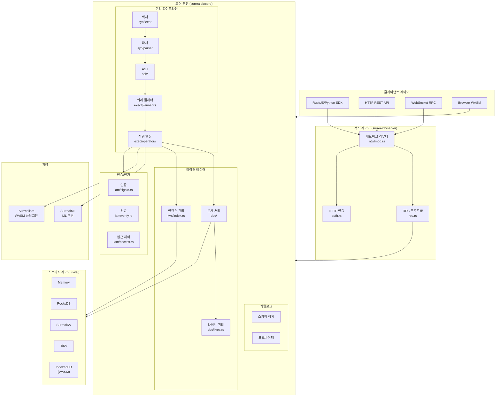
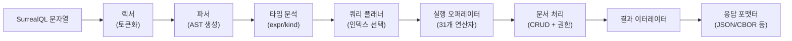
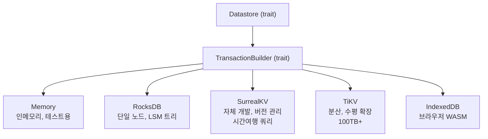
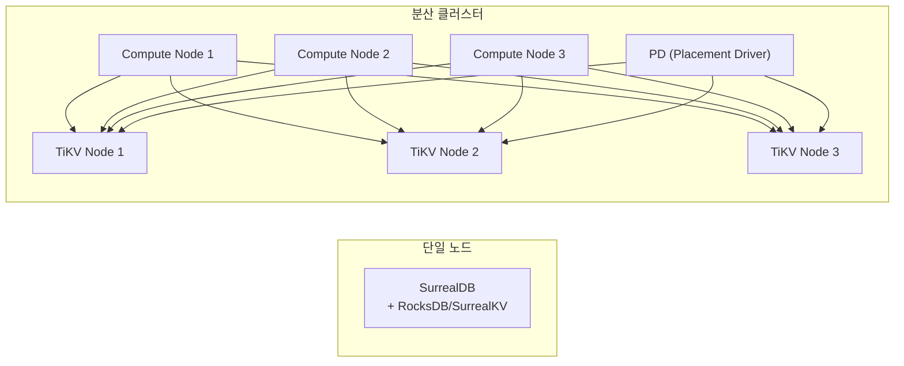

# SurrealDB 분석 보고서

> "A scalable, distributed, collaborative, document-graph database, for the realtime web"

## 1. 프로젝트 개요

### 핵심 정의

SurrealDB는 **Rust로 작성된 멀티모델 데이터베이스**로, 하나의 엔진에서 문서(Document), 그래프(Graph), 관계형(Relational), 시계열(Time-series), 벡터(Vector), 키-값(Key-Value) 모델을 모두 지원한다. 자체 쿼리 언어인 **SurrealQL**을 사용하며, 임베디드부터 분산 클러스터까지 다양한 배포 형태를 지원한다.

- **버전**: 3.1.0-alpha (2026년 4월 기준)
- **라이선스**: BSL 1.1 (Business Source License)
- **주요 고객**: Verizon, Walmart, ING, Nvidia, Samsung, Tencent

### 해결하려는 문제

전통적인 백엔드 스택에서는 용도별로 여러 데이터베이스를 조합해야 한다:

| 용도 | 전통적 선택 |
|------|------------|
| 관계형 데이터 | PostgreSQL, MySQL |
| 문서 저장 | MongoDB |
| 그래프 쿼리 | Neo4j |
| 캐시/키-값 | Redis |
| 벡터 검색 | Pinecone, Milvus |
| 시계열 데이터 | InfluxDB, TimescaleDB |

SurrealDB는 **이 모든 것을 하나의 데이터베이스로 통합**하여, 인프라 복잡성과 데이터 동기화 문제를 제거하는 것을 목표로 한다.

### 탄생 배경

- 2022년 Tobie Morgan Hitchcock이 창업, 영국 런던 기반
- 2026년 2월 SurrealDB 3.0 GA 출시와 함께 $23M 시리즈 A 투자 유치
- 3.0부터 "AI 에이전트를 위한 컨텍스트 레이어"로 포지셔닝 전환

---

## 2. 핵심 특징 및 차별점

### 멀티모델 네이티브 지원

하나의 ACID 트랜잭션 안에서 문서, 그래프, 벡터, 시계열 데이터를 동시에 다룰 수 있다. 다른 DB가 플러그인이나 확장으로 멀티모델을 흉내 내는 것과 달리, SurrealDB는 설계 단계부터 멀티모델을 지향했다.

### SurrealQL - SQL과 그래프의 융합

```sql
-- 관계형 스타일
SELECT * FROM user WHERE age > 25;

-- 그래프 트래버설 (->로 관계 탐색)
SELECT ->purchased->product FROM user:tobie;

-- 레코드 링크 (JOIN 없이 관계 표현)
CREATE article SET author = user:tobie, title = "Hello";

-- 라이브 쿼리 (실시간 변경 감지)
LIVE SELECT * FROM user WHERE age > 25;
```

### 임베디드 + 서버 + 분산 - 동일 엔진

| 모드 | 설명 | 스토리지 |
|------|------|---------|
| **임베디드** | 앱 내부에 라이브러리로 포함 | Memory, RocksDB, SurrealKV |
| **단일 서버** | HTTP/WebSocket API 제공 | RocksDB, SurrealKV |
| **분산 클러스터** | 수평 확장 | TiKV, SurrealKV |
| **브라우저(WASM)** | 브라우저에서 직접 실행 | IndexedDB |

### 기타 주요 특징

- **실시간 쿼리**: `LIVE SELECT`로 데이터 변경 시 WebSocket 푸시
- **레코드 레벨 권한**: 필드 단위까지 세분화된 접근 제어
- **내장 인증**: JWT, OAuth, JWKS 기반 인증 내장
- **ML 통합**: SurrealML로 쿼리 내에서 ML 모델 추론 실행
- **WASM 플러그인**: Surrealism을 통한 사용자 정의 확장

---

## 3. 아키텍처 분석

### 전체 시스템 구조



### 쿼리 실행 파이프라인



### 스토리지 추상화

모든 스토리지 백엔드는 동일한 Key-Value 인터페이스를 구현한다:



**SurrealKV**는 SurrealDB 팀이 자체 개발한 스토리지 엔진으로, Prefix-Tree(Trie) 기반 LSM 트리 구조를 사용한다. 같은 테이블의 키들이 물리적으로 가까이 저장되어 범위 스캔 성능이 우수하며, **시간여행 쿼리(Time-travel Query)** 를 네이티브로 지원한다.

---

## 4. 기술 스택

| 구분 | 기술 |
|------|------|
| **언어** | Rust (Edition 2024) |
| **빌드** | Cargo workspace (다중 크레이트) |
| **스토리지** | RocksDB, SurrealKV, TiKV, IndexedDB |
| **네트워크** | axum/hyper 기반 HTTP, WebSocket |
| **스크립팅** | rquickjs (QuickJS, JavaScript 임베딩) |
| **ML 런타임** | SurrealML (자체) |
| **WASM** | wasm-bindgen, Surrealism 플러그인 |
| **직렬화** | revision (자체 바이너리 포맷), JSON, CBOR |
| **인증** | JWT, JWKS, OAuth |
| **TLS** | native-tls 또는 rustls |
| **타임스탬프** | Hybrid Logical Clock (HLC) |

### 코드 규모

| 모듈 | 라인 수 | 파일 수 |
|------|---------|---------|
| surrealdb/core | ~239,000 | 1,013 |
| surrealdb/server | ~50,000+ | - |
| surrealdb (SDK) | ~320,000 | - |
| surrealism (WASM) | ~3,900 | - |
| surrealml | ~3,100 | - |

---

## 5. 핵심 코드 분석

### 주요 모듈 구조

```
surrealdb/
├── core/src/
│   ├── syn/           # SurrealQL 파서 (렉서 + 파서)
│   │   ├── lexer/     # 토큰화
│   │   └── parser/    # AST 생성 (18+ 파일, 22,728줄)
│   ├── sql/           # AST 정의 (53 파일)
│   │   └── statements/  # 26개 구문 (SELECT, RELATE, LIVE 등)
│   ├── expr/          # 표현식 평가 (54 파일)
│   │   └── visit.rs   # 방문자 패턴 평가기
│   ├── exec/          # 쿼리 실행 엔진
│   │   ├── planner.rs # 쿼리 계획 수립
│   │   └── operators/ # 31개 물리 연산자
│   ├── dbs/           # 데이터베이스 런타임
│   │   ├── executor.rs  # 구문 오케스트레이션
│   │   ├── processor.rs # 처리 로직
│   │   └── iterator.rs  # 결과 스트리밍
│   ├── doc/           # 문서 생명주기 관리
│   │   ├── document.rs  # 코어 문서 추상화
│   │   ├── lives.rs     # 라이브 쿼리
│   │   └── edges.rs     # 그래프 엣지 관리
│   ├── kvs/           # 스토리지 추상화
│   │   ├── api.rs       # 퍼블릭 인터페이스
│   │   ├── rocksdb/     # RocksDB 백엔드
│   │   ├── surrealkv/   # SurrealKV 백엔드
│   │   ├── tikv/        # TiKV 백엔드
│   │   └── cache/       # 결과 캐싱
│   ├── iam/           # 인증/인가 (가장 큰 모듈 중 하나)
│   │   ├── signin.rs    # 인증 (125K줄)
│   │   └── verify.rs    # 토큰 검증 (68K줄)
│   ├── catalog/       # 스키마 메타데이터
│   └── rpc/           # RPC 프로토콜
├── server/src/
│   └── ntw/           # HTTP/WebSocket 엔드포인트
└── src/
    ├── lib.rs         # Surreal<C> SDK 진입점
    └── engine/        # 연결 엔진 (Local/WS/HTTP/Any)
```

### 핵심 설계 결정

1. **Trait 기반 스토리지 추상화**: `Datastore` → `TransactionBuilder` 트레이트 패턴으로 백엔드 교체가 자유롭다. 새 스토리지 추가 시 트레이트만 구현하면 된다.

2. **Surreal\<C\> 제네릭 SDK**: 연결 타입(`C`)을 제네릭으로 받아 임베디드, WebSocket, HTTP를 동일한 API로 사용한다. `Surreal<Any>`로 런타임에 엔진을 동적 선택할 수도 있다.

3. **방문자 패턴 쿼리 평가**: `expr/visit.rs`에서 AST를 순회하며 평가한다. 의존성 분석(`computed_deps.rs`)으로 필드 간 계산 순서를 자동 결정한다.

4. **MVCC 트랜잭션**: 모든 백엔드에서 Multi-Version Concurrency Control을 사용하며, HLC(Hybrid Logical Clock)로 분산 환경 시간 동기화를 처리한다.

---

## 6. API 및 인터페이스

### 접근 방식

| 프로토콜 | 엔드포인트 | 용도 |
|---------|-----------|------|
| **HTTP REST** | `/sql`, `/key/:table/:id` | CRUD, 쿼리 실행 |
| **WebSocket RPC** | `/rpc` | 실시간, 라이브 쿼리 |
| **GraphQL** | `/graphql` (feature flag) | GraphQL 쿼리 |
| **ML** | `/ml` | 모델 업로드/추론 |

### SDK 지원

- **Rust**: `surrealdb` 크레이트 (임베디드 + 원격)
- **JavaScript/TypeScript**: `surrealdb.js`
- **Python**: `surrealdb` PyPI 패키지
- **기타**: Go, Java, C, .NET 등 커뮤니티 드라이버

### 인증 모델

```
Root (최상위)
 └── Namespace (네임스페이스)
      └── Database (데이터베이스)
           └── Table (테이블)
                └── Record (레코드) + Field (필드 레벨 권한)
```

5단계 계층적 권한 모델로, `DEFINE ACCESS` 구문으로 JWT, JWKS, OAuth 인증을 설정한다.

---

## 7. 확장성 및 플러그인

### Surrealism (WASM 플러그인 시스템)

사용자가 Rust로 WASM 플러그인을 작성하여 데이터베이스 기능을 확장할 수 있다:
- `surrealism/macros/` - 프로시저럴 매크로로 플러그인 정의
- `surrealism/runtime/` - WASM 런타임 통합
- `surrealism/types/` - 플러그인 타입 정의

### SurrealML

쿼리 내에서 ML 모델을 직접 실행:
```sql
-- 모델 업로드 후 쿼리에서 추론
SELECT ml::predict("sentiment", content) FROM article;
```

### JavaScript 스크립팅

rquickjs(QuickJS)를 임베딩하여 서버 사이드 JavaScript 함수를 정의하고 실행할 수 있다.

---

## 8. 성능 특성

### 벤치마크 (참고용)

| 작업 | SurrealDB | PostgreSQL | MongoDB |
|------|-----------|-----------|---------|
| 쓰기 (inserts/sec) | ~155K | ~205K | ~92K |

- PostgreSQL이 순수 쓰기 성능에서는 앞서지만, SurrealDB는 멀티모델 오버헤드를 감안하면 준수한 성능
- 깊은 그래프 탐색에서는 Neo4j가 더 빠를 수 있음

### 스케일링 전략

- **수평 확장**: TiKV/SurrealKV 위에서 컴퓨트 노드와 스토리지 노드를 독립 확장
- **읽기/쓰기 분리**: 컴퓨트 노드 추가로 읽기/쓰기 동시성 향상
- **TiKV 기반 클러스터**: 100TB+ 데이터셋 지원

### 알려진 제약사항

- 단일 모델 전문 DB 대비 각 모델별 극한 성능에서 불리
- BSL 라이선스로 인해 완전한 오픈소스가 아님 (4년 후 Apache 2.0 전환)
- 3.0 GA 출시 직후라 프로덕션 안정성 검증이 진행 중

---

## 9. 배포 및 운영

### 설치 방식

```bash
# macOS
brew install surrealdb/tap/surreal

# Docker
docker run --rm -p 8000:8000 surrealdb/surrealdb:latest start

# 바이너리
curl -sSf https://install.surrealdb.com | sh
```

### 배포 토폴로지



---

## 10. 경쟁/비교 분석

### 한눈에 보는 비교표

SurrealDB의 역할과 겹치는 데이터베이스 및 서비스를 정리하면 다음과 같다:

| 기준 | SurrealDB | PostgreSQL | MongoDB | Neo4j | Firebase/Firestore | Supabase | CockroachDB | FaunaDB |
|------|-----------|-----------|---------|-------|-------------------|----------|------------|---------|
| **핵심 모델** | 멀티모델 (문서+그래프+관계형+벡터+시계열) | 관계형 (+JSON 확장) | 문서 | 그래프 | 문서 (NoSQL) | 관계형 (PostgreSQL) | 분산 SQL | 서버리스 문서 |
| **쿼리 언어** | SurrealQL | SQL | MQL (MongoDB QL) | Cypher | SDK API | SQL | SQL (PG 호환) | FQL |
| **그래프 지원** | 네이티브 (`->` 문법) | 없음 (AGE 확장 필요) | `$lookup` 정도 | 네이티브 (최강) | 없음 | 없음 | 없음 | 없음 |
| **벡터 검색** | 네이티브 | pgvector 확장 | Atlas Vector Search | 없음 | 없음 | pgvector | 없음 | 없음 |
| **실시간** | LIVE SELECT | LISTEN/NOTIFY | Change Streams | 없음 | 네이티브 | Realtime | CDC | Streaming |
| **임베디드 모드** | O (Rust/WASM) | X | X | X | X | X | X | X |
| **분산/확장** | TiKV 기반 수평 확장 | 레플리카 (Citus 확장) | 샤딩 | 클러스터링 | Google 인프라 | Supabase Cloud | 네이티브 분산 | 서버리스 | 
| **언어** | Rust | C | C++ | Java | - (SaaS) | TypeScript/Elixir | Go | - (SaaS) |
| **라이선스** | BSL 1.1 | PostgreSQL (MIT류) | SSPL | GPL/Commercial | Proprietary | Apache 2.0 | BSL 1.1 | Proprietary |
| **성숙도** | 초기 (3.0 GA, 2026) | 매우 높음 (35년+) | 높음 (15년+) | 높음 (10년+) | 높음 | 중간 | 높음 | 중간 |

### 카테고리별 상세 비교

#### vs PostgreSQL - "만능 관계형"
- **PostgreSQL이 나은 점**: 35년간 검증된 안정성, 거대한 생태계, 순수 쓰기 성능, 표준 SQL
- **SurrealDB가 나은 점**: 네이티브 그래프/벡터/시계열, 임베디드 모드, 실시간 쿼리, 멀티모델 ACID
- **결론**: 기존 관계형 워크로드는 PostgreSQL이 안전한 선택. 그래프+문서+벡터가 동시에 필요하면 SurrealDB 고려

#### vs MongoDB - "문서 DB의 왕"
- **MongoDB가 나은 점**: 압도적 생태계, Atlas 클라우드 서비스, 풍부한 드라이버, 프로덕션 검증
- **SurrealDB가 나은 점**: 네이티브 그래프 쿼리, 관계형 스키마 지원, ACID 기본, 임베디드 모드
- **결론**: 문서 저장만 필요하면 MongoDB. 문서+그래프+관계형이 섞이면 SurrealDB가 복잡성을 줄여줌

#### vs Neo4j - "그래프 전문가"
- **Neo4j가 나은 점**: 깊은 그래프 탐색 성능 최강, Cypher 언어 성숙도, 그래프 알고리즘 라이브러리
- **SurrealDB가 나은 점**: 그래프 외 모델 지원, SQL 친화적 문법, 별도 그래프 DB 불필요
- **결론**: 복잡한 그래프 분석이 핵심이면 Neo4j. 그래프가 부분적 요구사항이면 SurrealDB

#### vs Firebase/Supabase - "BaaS(Backend-as-a-Service)"
- **Firebase가 나은 점**: 모바일 생태계 통합 (인증, 푸시, 호스팅), Google 인프라
- **Supabase가 나은 점**: PostgreSQL 기반으로 SQL 사용, 오픈소스, 데이터 포터빌리티
- **SurrealDB가 나은 점**: 멀티모델, 셀프호스팅 유연성, 임베디드 모드, 그래프 지원
- **결론**: 빠른 MVP 개발엔 Firebase/Supabase. 데이터 모델이 복잡하고 벤더 종속을 피하려면 SurrealDB

#### vs CockroachDB - "분산 SQL"
- **CockroachDB가 나은 점**: PostgreSQL 호환 SQL, 글로벌 분산 OLTP에 특화, 성숙한 분산 합의
- **SurrealDB가 나은 점**: 멀티모델, 임베디드 모드, 그래프/벡터 지원
- **결론**: 분산 SQL이 핵심이면 CockroachDB. 멀티모델이 핵심이면 SurrealDB

#### vs FaunaDB - "서버리스 DB"
- **FaunaDB가 나은 점**: 완전 서버리스, 인프라 관리 제로
- **SurrealDB가 나은 점**: 오픈소스, 셀프호스팅 가능, 임베디드 모드, 더 넓은 모델 지원
- **결론**: 운영 부담 제로가 최우선이면 FaunaDB. 유연성과 제어가 필요하면 SurrealDB

---

## 11. 종합 평가

### 강점

1. **진정한 멀티모델**: 하나의 트랜잭션에서 문서/그래프/벡터/시계열을 다루는 유일한 DB
2. **배포 유연성**: 임베디드(WASM 포함) ~ 분산 클러스터까지 동일 코드베이스
3. **개발자 경험**: SurrealQL의 SQL 친화적 문법 + 그래프 트래버설이 직관적
4. **Rust 기반 성능**: 메모리 안전성과 성능을 동시에 확보
5. **AI 시대 대응**: 벡터 검색 + ML 추론 통합, 에이전트 메모리 레이어 지향

### 약점/리스크

1. **성숙도 부족**: 3.0 GA가 2026년 2월 출시로, 대규모 프로덕션 레퍼런스가 아직 제한적
2. **잭 오브 올 트레이드**: 각 모델별 전문 DB 대비 극한 성능에서 불리할 수 있음
3. **BSL 라이선스**: 경쟁 SaaS 서비스 제공 시 제약 (4년 후 Apache 2.0 전환)
4. **SurrealQL 학습 곡선**: SQL과 비슷하지만 다른 독자 언어, 기존 도구/ORM 호환성 제한
5. **생태계 규모**: PostgreSQL/MongoDB 대비 드라이버, 도구, 커뮤니티 규모가 작음

### 적합한 사례

- 문서 + 그래프 + 관계형이 동시에 필요한 앱 (소셜 네트워크, 추천 시스템, 지식 그래프)
- 실시간 협업 앱 (LIVE SELECT 활용)
- 임베디드 DB가 필요한 엣지/IoT/모바일 앱
- AI 에이전트의 컨텍스트 저장소 (벡터 + 그래프 + 문서)
- 인프라 단순화가 필요한 스타트업 (DB 하나로 통합)

### 부적합한 사례

- 순수 OLAP/분석 워크로드 (ClickHouse, BigQuery가 적합)
- 대규모 프로덕션에서 검증된 안정성이 필수인 경우 (PostgreSQL이 안전)
- 극한의 그래프 탐색 성능이 필요한 경우 (Neo4j가 적합)
- 표준 SQL 호환성이 필수인 경우 (CockroachDB, PostgreSQL)

### 엔지니어 관점 인사이트

SurrealDB의 진짜 가치는 **"하나의 데이터 레이어로 백엔드 복잡성을 줄이는 것"** 이다. PostgreSQL + MongoDB + Neo4j + Redis를 각각 운영하고 데이터를 동기화하는 복잡성 vs SurrealDB 하나로 통합하는 트레이드오프를 따져봐야 한다.

코드베이스 품질은 높다. Rust의 타입 시스템을 적극 활용한 trait 기반 추상화, 239K줄의 코어 엔진은 잘 모듈화되어 있다. 특히 스토리지 레이어의 추상화(`Datastore` → `TransactionBuilder`)는 새 백엔드 추가를 수월하게 한다.

다만, 아직 초기 프로젝트라는 점을 감안해야 한다. "만능 DB"라는 포지셔닝은 매력적이지만, 각 모델별 전문 DB를 능가하기는 어렵다. **80%의 기능을 하나로 커버하고, 나머지 20%의 극한 요구사항은 전문 DB에 맡기는** 실용적 관점으로 접근하는 것이 합리적이다.

---

## 참고 자료

- [SurrealDB 공식 사이트](https://surrealdb.com)
- [SurrealDB GitHub](https://github.com/surrealdb/surrealdb)
- [SurrealDB 아키텍처 문서](https://surrealdb.com/docs/surrealdb/introduction/architecture)
- [SurrealDB 3.0 출시 블로그](https://surrealdb.com/blog/introducing-surrealdb-3-0-the-future-of-ai-agent-memory)
- [SurrealKV 딥다이브](https://ori-cohen.medium.com/surrealkv-diving-deep-with-the-new-storage-engine-in-surrealdb-2-0-5c8d276aaaf6)
- [SurrealDB $23M 투자](https://siliconangle.com/2026/02/17/surrealdb-raises-23m-expand-ai-native-multi-model-database/)
- [SurrealDB vs PostgreSQL](https://surrealdb.com/comparison/postgres)
- [SurrealDB vs Neo4j](https://surrealdb.com/comparison/neo4j)
- [SurrealDB vs Traditional Databases](https://surrealdb.com/why/vs-traditional-databases)
- [SurrealDB 비교 분석 (2025)](https://caperaven.co.za/2025/04/01/surrealdb-in-2025-a-comparative-analysis-across-database-categories-briefing-document/)
- [데이터베이스 벤치마크](https://www.eulerai.au/blog/database_benchmark)
- [FaunaDB 대안 목록](https://blog.logrocket.com/fauna-db-alternatives-2025/)
