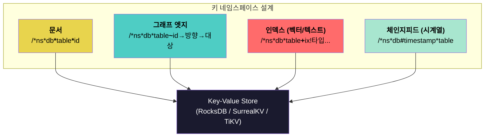
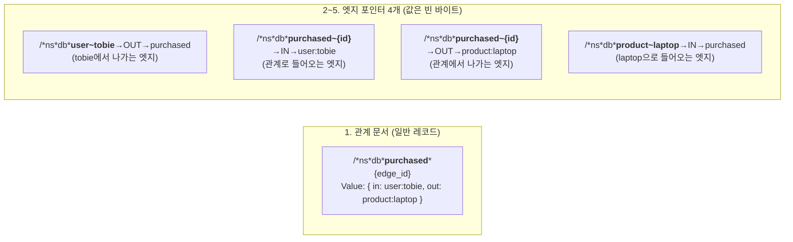
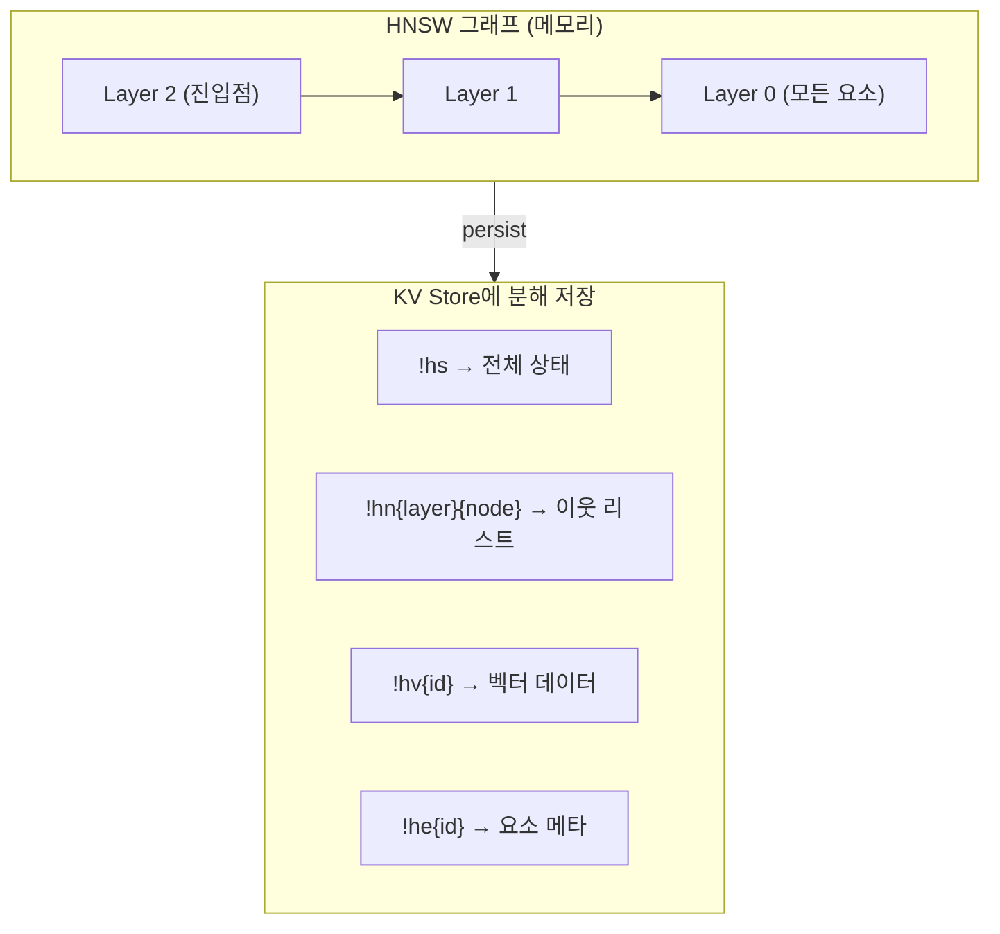
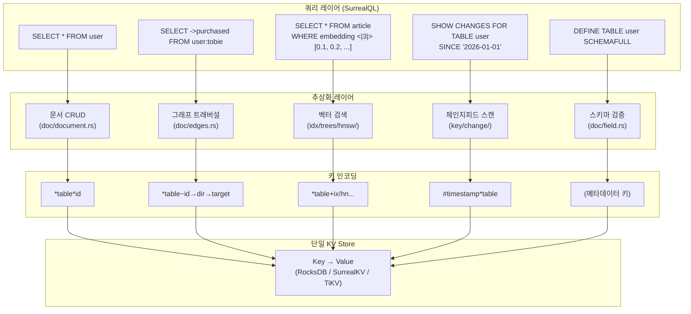

# SurrealDB 멀티모델의 실체 - 코드로 파헤치기

> 핵심 결론: **SurrealDB는 스토리지 레벨에서는 하나의 모델(Key-Value)이다.**
> 문서, 그래프, 벡터, 시계열, 관계형은 모두 **KV 위의 키 인코딩 + 쿼리 레이어 추상화**로 구현된다.

---

## 비밀은 "키 인코딩 설계"에 있다

SurrealDB의 모든 데이터는 결국 `Key → Value` 쌍으로 저장된다. 멀티모델의 마법은 **키를 어떻게 구조화하느냐**에 달려 있다.

```
모든 키의 공통 접두사: /*{namespace}*{database}
```

그 뒤에 붙는 **구분자 한 글자**가 데이터 모델을 결정한다:

| 구분자 | 의미 | 데이터 모델 |
|--------|------|------------|
| `*` | 레코드 | 문서(Document) |
| `~` | 엣지 | 그래프(Graph) |
| `+` | 인덱스 | 벡터/전문검색/일반 인덱스 |
| `#` | 체인지피드 | 시계열(Time-series) |

이걸 그림으로 보면:



---

## 모델별 실제 구현

### 1. 문서(Document) - 가장 기본

**키**: `/*{ns}*{db}*{table}*{record_id}`
**값**: 레코드의 JSON-like 바이너리 (id 필드 제외, 키에 이미 있으므로)

```
// 예시: user:tobie 레코드
Key:   /*\x01*\x02*user\0*tobie\0
Value: { name: "Tobie", age: 35, email: "tobie@..." }
```

소스코드(`key/record.rs:56-68`):
```rust
pub fn new(ns: NamespaceId, db: DatabaseId, tb: &'a TableName, id: RecordIdKey) -> Self {
    Self {
        __: b'/',       // 루트
        _a: b'*',       // 구분자
        ns,
        _b: b'*',
        db,
        _c: b'*',
        tb: Cow::Borrowed(tb),
        _d: b'*',       // ← 문서 구분자
        id,
    }
}
```

**핵심**: 같은 테이블의 레코드들은 키 접두사가 동일하므로 **범위 스캔**으로 테이블 전체를 효율적으로 읽을 수 있다. 이것이 "테이블"이라는 관계형 개념이 KV 위에서 작동하는 원리다.

---

### 2. 그래프(Graph) - 엣지 포인터 4개

그래프가 가장 흥미로운 부분이다. `RELATE` 구문 하나가 실행되면 **KV 엔트리 5개**가 생성된다.

```sql
RELATE user:tobie -> purchased -> product:laptop;
```

이 한 줄이 만드는 KV 엔트리:



소스코드(`doc/edges.rs:58-72`):
```rust
// 왼쪽(source) → 관계 방향의 엣지 포인터
let key = crate::key::graph::new(ns, db, &l.table, &l.key, o, &rid);
txn.set(&key, &(), opt.version).await?;   // 값은 빈 튜플 ()

// 왼쪽 → 관계 안으로 들어오는 포인터
let key = crate::key::graph::new(ns, db, &rid.table, &rid.key, i, l);
txn.set(&key, &(), opt.version).await?;

// 관계 → 오른쪽으로 나가는 포인터
let key = crate::key::graph::new(ns, db, &rid.table, &rid.key, o, r);
txn.set(&key, &(), opt.version).await?;

// 오른쪽(dest) ← 관계에서 들어오는 포인터
let key = crate::key::graph::new(ns, db, &r.table, &r.key, i, &rid);
txn.set(&key, &(), opt.version).await?;
```

**왜 4개나?** 양방향 탐색을 O(1) 범위 스캔으로 만들기 위해서다:

```sql
-- "tobie가 구매한 것은?" → user~tobie→OUT 접두사로 범위 스캔
SELECT ->purchased->product FROM user:tobie;

-- "laptop을 구매한 사람은?" → product~laptop→IN 접두사로 범위 스캔
SELECT <-purchased<-user FROM product:laptop;
```

엣지 포인터의 **값은 빈 바이트**(`()`)다. 포인터 역할만 하고, 실제 관계 데이터는 `purchased` 테이블의 일반 문서에 저장된다. 즉 **그래프는 문서 + 방향성 인덱스 포인터**의 조합이다.

---

### 3. 벡터(Vector) - HNSW를 KV로 분해

벡터 인덱스는 HNSW(Hierarchical Navigable Small World) 알고리즘을 사용하는데, 이 그래프 자체를 KV 조각들로 분해해서 저장한다.

```sql
DEFINE INDEX vec_idx ON article FIELDS embedding HNSW DIMENSION 1536;
```

이 인덱스가 만드는 KV 키 패밀리(`key/index/` 디렉토리):

| 키 접미사 | 용도 | 설명 |
|-----------|------|------|
| `!hs` | HNSW State | 진입점, 다음 ID, 레이어 상태 |
| `!hv{vector}` | Vector Data | 직렬화된 벡터 값 |
| `!hn{layer}{node}` | Node Edges | 각 노드의 이웃 리스트 |
| `!he{element_id}` | Element Info | 요소 메타데이터 |
| `!hi{record_id}` | Record Mapping | 레코드 → HNSW 요소 매핑 |
| `!hd{doc_id}` | Doc Mapping | 문서 → 벡터 매핑 |



소스코드(`idx/trees/hnsw/mod.rs:56-86`):
```rust
pub(crate) struct HnswState {
    enter_point: Option<ElementId>,     // 탐색 시작점
    next_element_id: ElementId,         // 다음 할당 ID
    layer0: LayerState,                 // 기본 레이어
    layers: Vec<LayerState>,            // 상위 레이어들
}
```

벡터 타입도 다양하게 지원(`idx/trees/vector.rs:23-93`):
```rust
pub enum SerializedVector {
    F64(Vec<f64>),
    F32(Vec<f32>),
    I64(Vec<i64>),
    I32(Vec<i32>),
    I16(Vec<i16>),
}
```

**핵심**: HNSW 알고리즘 자체는 메모리에서 실행되지만, 그 **상태(노드, 엣지, 벡터)가 KV 키-값으로 쪼개져서 영구 저장**된다. Pinecone 같은 전용 벡터 DB가 메모리에 최적화된 인덱스를 유지하는 것과 달리, KV I/O를 거쳐야 하므로 극한 성능에서는 불리하다.

---

### 4. 시계열(Time-series) - 타임스탬프 키 정렬

독립적인 시계열 스토리지 엔진은 없다. 대신 두 가지 메커니즘의 조합이다:

#### (a) 체인지피드 (Change Feed)

모든 데이터 변경을 타임스탬프 기반 키로 기록:

```
키: /*{ns}*{db}#{timestamp}*{table}
값: 변경 내용 (CREATE/UPDATE/DELETE + 데이터)
```

타임스탬프가 big-endian으로 인코딩되어 있어서, **키의 사전순 정렬 = 시간순 정렬**이 된다. 따라서 "최근 1시간 변경사항"은 단순 범위 스캔으로 조회 가능하다.

소스코드(`key/change/mod.rs:14-49`):
```rust
pub(crate) struct Cf<'a> {
    __: u8,             // b'/'
    _a: u8,             // b'*'
    pub ns: NamespaceId,
    _b: u8,             // b'*'
    pub db: DatabaseId,
    _d: u8,             // b'#'  ← 체인지피드 구분자
    pub ts: Cow<'a, [u8]>,  // 타임스탬프 (big-endian)
    _c: u8,             // b'*'
    pub tb: Cow<'a, TableName>,
}
```

#### (b) 버전 쿼리 (SurrealKV 전용)

SurrealKV 백엔드에서는 레코드 버전을 유지하여 **"과거 시점의 데이터"** 를 조회할 수 있다. HLC(Hybrid Logical Clock)로 분산 환경에서도 시간 정합성을 보장한다.

```
// kvs/timestamp.rs
pub trait TimeStamp: Any + Send + Sync {
    fn as_versionstamp(&self) -> u128;
    fn as_datetime(&self) -> Option<DateTime<Utc>>;
}
```

**핵심**: InfluxDB 같은 전용 시계열 DB가 시간 축에 특화된 압축/집계를 하는 것과 달리, SurrealDB의 시계열은 **"KV 키 정렬 + 체인지피드 + 버전 관리"** 의 조합이다. 대량 시계열 집계 쿼리에서는 전용 DB 대비 불리하다.

---

### 5. 관계형(Relational) - 스키마 메타데이터 + 런타임 검증

관계형 기능은 스토리지가 아닌 **실행 레이어에서 강제**된다:

```sql
-- 스키마 강제 테이블
DEFINE TABLE user SCHEMAFULL;
DEFINE FIELD name ON user TYPE string;
DEFINE FIELD age ON user TYPE int;

-- 관계 강제 (외래키 역할)
DEFINE TABLE purchased TYPE RELATION FROM user TO product ENFORCED;
```

`SCHEMAFULL`이면 `doc/field.rs`에서 정의되지 않은 필드를 제거하고, 타입 불일치를 거부한다:

```rust
// doc/field.rs - 스키마 풀 테이블의 필드 정리
if tb.schemafull {
    // 정의되지 않은 필드를 문서에서 제거
    // 정의된 필드의 타입 검증
}
```

`ENFORCED`면 `doc/edges.rs`에서 참조 무결성을 검사한다:

```rust
// doc/edges.rs:43-56
if matches!(tb.table_type, TableType::Relation(Relation { enforced: true, .. })) {
    // IN 레코드 존재 확인
    ensure!(txn.record_exists(ns, db, &l.table, &l.key).await?, ...);
    // OUT 레코드 존재 확인
    ensure!(txn.record_exists(ns, db, &r.table, &r.key).await?, ...);
}
```

**핵심**: PostgreSQL이 스토리지 엔진 레벨에서 스키마를 강제하는 것과 달리, SurrealDB의 관계형 제약은 **쿼리 실행 시점에 소프트웨어적으로 검증**하는 방식이다.

---

## 전체 그림: 하나의 KV, 다섯 가지 관점



---

## 그래서 이게 좋은 건가, 나쁜 건가?

### 이 설계의 장점

1. **트랜잭션 통합이 자연스럽다**: 모든 모델이 같은 KV 스토어를 쓰므로, 하나의 ACID 트랜잭션에서 문서 생성 + 그래프 연결 + 벡터 인덱싱이 가능하다. 별도 DB 간 2PC(2-Phase Commit)가 필요 없다.

2. **스토리지 엔진 교체가 자유롭다**: 모든 모델이 KV 인터페이스만 의존하므로, RocksDB → SurrealKV → TiKV를 바꿔도 모든 모델이 그대로 작동한다.

3. **배포가 단순하다**: 프로세스 하나가 문서 + 그래프 + 벡터를 모두 처리하므로, 운영 복잡성이 극적으로 줄어든다.

4. **키 정렬을 이용한 범위 쿼리**: 같은 테이블, 같은 노드의 엣지, 같은 시간대의 변경사항이 물리적으로 가까이 저장되어 범위 스캔이 효율적이다.

### 이 설계의 한계

1. **전문 DB의 최적화를 이길 수 없다**: Neo4j는 그래프 탐색에 특화된 네이티브 스토리지 엔진을 쓴다. Pinecone은 벡터 검색에 최적화된 메모리 레이아웃을 쓴다. SurrealDB는 범용 KV 위에 이것들을 흉내 내므로, 각 영역의 극한 성능에서는 밀린다.

2. **HNSW 인덱스의 I/O 오버헤드**: 전용 벡터 DB는 HNSW 그래프를 메모리에 매핑하여 포인터 체이싱이 빠르다. SurrealDB는 노드마다 KV lookup을 해야 하므로 대규모 벡터 검색에서 레이턴시가 높아질 수 있다.

3. **시계열 압축 부재**: InfluxDB/TimescaleDB는 시간 축 데이터를 열 기반(columnar)으로 압축한다. SurrealDB의 체인지피드는 행 단위 KV 저장이라 대량 시계열 집계에서 비효율적이다.

4. **그래프 깊이 탐색 성능**: 각 홉(hop)마다 KV range scan이 필요하다. Neo4j는 인접 노드를 물리적 포인터로 참조하는 "index-free adjacency"를 쓰므로, 깊은 탐색(5+ 홉)에서 성능 차이가 벌어진다.

### 결론

SurrealDB의 멀티모델은 **"5개의 전문 DB를 하나로 대체"하겠다는 것이 아니라, "5개의 DB를 운영하는 복잡성 vs 각 모델별 80% 수준의 성능"이라는 트레이드오프를 제안하는 것**이다.

"각 영역에서 90점 이상이 필요하면 전문 DB를 써라. 하지만 여러 모델을 70~80점 수준으로 하나의 트랜잭션과 하나의 운영 스택에서 쓰고 싶다면, SurrealDB가 유일한 선택지다."

이것이 코드가 말해주는 SurrealDB의 진짜 포지셔닝이다.
