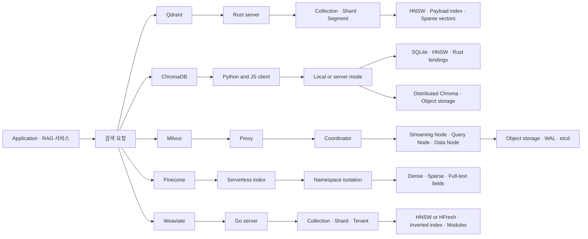

# Qdrant, ChromaDB, Milvus, Pinecone, Weaviate 비교 분석

작성일: 2026-06-10

## 1. 프로젝트 개요

이 문서는 벡터 검색과 RAG 시스템에서 자주 후보가 되는 Qdrant, ChromaDB, Milvus, Pinecone, Weaviate를 엔지니어 관점에서 비교한다. 핵심 질문은 단순히 "어느 DB가 빠른가"가 아니라, 다음 조건에서 어떤 선택이 합리적인가이다.

- 필터 조건이 많은 RAG 검색을 안정적으로 처리해야 하는가
- 수천만-수십억 벡터까지 수평 확장이 필요한가
- 자체 운영을 감수할 것인가, 완전 관리형 서비스를 쓸 것인가
- Python 개발자 경험과 빠른 프로토타이핑이 중요한가
- 하이브리드 검색, 멀티테넌시, 백업, 복제, 권한 관리가 제품 요구사항인가

요약하면 ChromaDB는 개발 생산성과 프로토타이핑, Qdrant는 필터 결합 검색과 단순 운영, Milvus는 대규모 분산 벡터 검색, Pinecone은 운영 부담 최소화, Weaviate는 하이브리드 검색과 모듈형 AI-native DB에 강점이 있다.

## 2. 한눈에 보는 결론

| 선택지 | 가장 잘 맞는 경우 | 피해야 할 경우 |
|---|---|---|
| Qdrant | 필터 조건이 많은 RAG, 자체 운영 가능한 중대형 서비스, Rust 기반 단일 바이너리 선호 | 복잡한 클라우드 네이티브 분산 파이프라인을 세밀하게 분리 운영하려는 경우 |
| ChromaDB | 로컬 개발, PoC, Python/JS 앱 내 빠른 임베딩 저장소, 단순 RAG | OSS 단일 노드로 대규모 멀티테넌트 프로덕션을 직접 운영하려는 경우 |
| Milvus | 대규모 분산 검색, K8s 기반 운영, 다양한 인덱스와 GPU/디스크 기반 검색 옵션 | 소규모 팀이 단순한 RAG 저장소만 필요로 하는 경우 |
| Pinecone | 운영 인력을 최소화한 SaaS, 빠른 프로덕션 진입, namespace 기반 멀티테넌시 | 오픈소스/온프렘/세밀한 내부 튜닝/비용 구조 통제가 중요한 경우 |
| Weaviate | BM25+벡터 하이브리드 검색, 스키마/객체 모델, 내장 벡터라이저와 모듈 생태계 | 단순 벡터 KNN만 필요하거나 GraphQL/모듈 구조가 과한 경우 |

## 3. 핵심 특징 비교

| 항목 | Qdrant | ChromaDB | Milvus | Pinecone | Weaviate |
|---|---|---|---|---|---|
| 라이선스/형태 | Apache-2.0 OSS + Cloud | Apache-2.0 OSS + Cloud | Apache-2.0 OSS + Zilliz Cloud | 폐쇄형 관리형 SaaS | BSD-3-Clause OSS + Cloud |
| 주요 구현 | Rust | Python API + Rust 엔진/바인딩 | Go + C++ 검색 엔진 의존 | 비공개 | Go |
| 기본 데이터 모델 | Collection, point, vector, payload | Tenant, database, collection, record | Collection, partition, segment | Index, namespace, record/document | Collection, object, property, tenant |
| API | REST, gRPC, SDK | Python/JS/Rust, HTTP server | SDK, gRPC/REST 계열 | SDK/API | REST, gRPC, GraphQL |
| 검색 | dense, sparse, multivector, hybrid | vector, metadata, full-text, cloud hybrid | dense/sparse, scalar filter, range, hybrid 구성 | dense, sparse, full-text, hybrid | vector, BM25, hybrid, filters |
| 인덱스 | HNSW, sparse, payload index, quantization | HNSW, full-text/metadata index | HNSW, IVF, FLAT, SCANN, DiskANN, GPU CAGRA 등 | 비공개 관리형 인덱스 | HNSW, flat, HFresh, inverted index |
| 분산 확장 | sharding, replication, Raft consensus | OSS는 local/single-node 중심, distributed/cloud 별도 | compute/storage 분리, coordinator/worker, object storage, WAL | serverless 자동 확장 | sharding, replication, Raft, multi-tenancy |
| 운영 난이도 | 중간 | 낮음 | 높음 | 낮음 | 중간 |
| 벤더 종속성 | 낮음 | 낮음-중간 | 낮음 | 높음 | 낮음-중간 |

## 4. 아키텍처 비교

### Qdrant

Qdrant는 client-server 구조로 HTTP/gRPC API를 제공한다. 데이터는 collection 안의 point로 저장되고, point는 vector와 JSON payload를 가진다. 공식 문서는 dense vector가 놓치는 키워드/식별자 문제를 sparse vector로 보완하고, hybrid retrieval을 지원한다고 설명한다. 또한 payload index가 HNSW 그래프와 결합되어 필터 조건을 검색 단계에 적용할 수 있다는 점이 강한 차별점이다.

로컬 코드 기준으로 Qdrant는 Rust 2024 edition, `actix-web`, `tonic`, `raft`, 자체 `segment`, `shard`, `collection`, `storage`, `wal`, `bm25` crate로 구성된다. 즉 "벡터 DB 서버"에 필요한 구성요소를 하나의 Rust 코드베이스에 단단히 묶은 형태다.

### ChromaDB

ChromaDB는 개발자가 가장 빨리 붙여 쓸 수 있는 AI 검색 인프라에 가깝다. collection은 저장과 쿼리의 기본 단위이며, id, embedding vector, optional metadata, document를 담는다. Local, single-node, distributed 모드를 구분하고, managed Chroma Cloud는 object storage 기반 distributed Chroma를 제공한다.

로컬 코드 기준으로 `chromadb` Python 패키지와 Rust binding이 함께 존재한다. single-node Chroma는 SQLite와 HNSW 중심 구조가 드러난다. 공식 성능 문서도 HNSW 인덱스가 RAM에 올라가야 하므로 collection 크기의 상한이 사용 가능한 메모리에 의해 사실상 제한된다고 설명한다. 따라서 OSS Chroma는 PoC와 중소 규모에는 매력적이지만, 대규모 프로덕션은 Chroma Cloud 또는 distributed 구성을 별도로 봐야 한다.

### Milvus

Milvus는 다섯 후보 중 가장 명확하게 클라우드 네이티브 대규모 분산 시스템 지향이다. 공식 아키텍처는 access layer, coordinator, worker nodes, storage layer로 나뉘고, control plane과 data plane을 분리한다. proxy는 stateless이고, coordinator는 토폴로지/스케줄링/일관성을 담당하며, worker는 streaming node, query node, data node로 나뉜다.

로컬 코드 기준으로 Go 모듈 안에 `internal/proxy`, `internal/datacoord`, `internal/querycoordv2`, `internal/streamingnode`, `pkg/mq`, `pkg/proto` 같은 컴포넌트가 분리되어 있다. 의존성도 etcd, MinIO/S3, Pulsar/Kafka 계열 MQ, gRPC, OpenTelemetry 등 대규모 운영형 시스템의 성격이 강하다. 장점은 확장성과 다양한 인덱스 옵션이고, 단점은 운영 복잡도다.

### Pinecone

Pinecone은 오픈소스 DB가 아니라 완전 관리형 vector database 서비스다. 최신 문서 기준 serverless index는 JSON document/record를 저장하며, dense vector, sparse vector, full-text string field를 한 index 안에서 섞을 수 있다. metadata는 필터링을 위해 자동 인덱싱된다. 멀티테넌시는 namespace를 tenant 단위로 나누는 패턴을 권장하며, serverless 아키텍처에서는 namespace가 분리 저장되어 tenant 격리와 비용 효율을 제공한다고 설명한다.

코드 레벨 분석은 불가능하므로 내부 인덱스 구현을 전제로 한 튜닝은 할 수 없다. 대신 운영 부담, 자동 확장, 관리형 백업/복원, SLA성 기능을 사는 선택지다. 비용 예측, 데이터 이식성, 특정 기능 제한, 벤더 종속성은 반드시 평가해야 한다.

### Weaviate

Weaviate는 객체/스키마 모델, GraphQL/REST/gRPC API, 내장 벡터라이저, BM25+벡터 hybrid search가 특징이다. 공식 문서는 vector index로 HNSW와 flat을 지원한다고 설명하며, 최신 코드에는 HFresh 설정도 존재한다. Weaviate는 inverted index를 별도로 유지해 property filter와 키워드 검색을 빠르게 처리하고, vector index와 결합한다.

로컬 코드 기준으로 `entities/vectorindex/hnsw`, `entities/vectorindex/flat`, `entities/vectorindex/hfresh`, `entities/lsmkv`, `usecases/multitenancy`, `usecases/config`, `adapters/handlers/rest` 등이 보인다. 모듈/벡터라이저 의존성도 많아 "검색 엔진 + AI 모듈 플랫폼"에 가깝다.

## 5. 장단점 분석

### Qdrant

장점:

- 필터가 많은 벡터 검색에 강하다. payload index와 HNSW 결합 설계가 핵심이다.
- Rust 기반이라 단일 노드 성능, 메모리 안정성, 배포 단순성이 좋다.
- dense, sparse, multivector, quantization, on-disk storage, shard/replica 기능을 균형 있게 제공한다.
- 자체 운영과 클라우드 사용 사이를 오가기 쉽다.

단점:

- Milvus만큼 컴포넌트별 독립 확장과 대규모 운영 패턴이 세분화되어 있지는 않다.
- Cloud의 HA/zero-downtime/관리 기능과 OSS 자체 운영 기능의 격차를 이해해야 한다.
- 복잡한 분석형 쿼리나 SQL성 workload에는 별도 DB가 필요하다.

### ChromaDB

장점:

- Python/JS 개발자 경험이 가장 단순하다.
- collection API가 직관적이고 LangChain/LlamaIndex 같은 RAG 스택과 붙이기 쉽다.
- 로컬 embedded 형태부터 server mode까지 시작 비용이 낮다.
- Chroma Cloud/Distributed Chroma는 object storage, SSD cache, shared system DB 구조로 대규모 서비스를 겨냥한다.

단점:

- OSS single-node는 HNSW RAM 요구량이 크고 대규모 collection에서 메모리 한계가 빨리 온다.
- Milvus/Qdrant/Weaviate 대비 자체 운영형 분산 DB로서의 성숙한 운영 표면은 약하다.
- 복잡한 멀티테넌트 프로덕션 요구는 Cloud 기능과 OSS 기능 차이를 확인해야 한다.

### Milvus

장점:

- compute/storage 분리와 stateless worker 구조로 대규모 수평 확장에 가장 강하다.
- HNSW, IVF, FLAT, SCANN, DiskANN, quantization, mmap, GPU CAGRA 등 인덱스 선택지가 넓다.
- 대용량 ingestion, compaction, index build, query serving을 별도 컴포넌트로 분리한다.
- K8s, object storage, MQ, observability와 맞물리는 엔터프라이즈 운영 모델이 명확하다.

단점:

- 운영 난이도가 높다. etcd, object storage, WAL/MQ, 여러 node type을 이해해야 한다.
- 소규모 RAG에는 과한 선택일 가능성이 크다.
- 장애 분석과 성능 튜닝에 분산 시스템 역량이 필요하다.

### Pinecone

장점:

- 운영 부담이 가장 낮다. serverless index, 자동 확장, namespace 기반 tenant isolation이 핵심이다.
- dense, sparse, full-text field를 한 index에 담는 최신 API가 RAG 검색 설계를 단순화한다.
- metadata 자동 인덱싱과 관리형 백업/복원 등 프로덕션 편의성이 높다.
- 팀이 DB 운영보다 제품 개발에 집중해야 할 때 빠르다.

단점:

- 폐쇄형 SaaS라 내부 구현, 인덱스 구조, 비용 최적화의 통제권이 제한된다.
- 온프렘/air-gapped/데이터 주권 요구가 있으면 부적합하다.
- 대규모 트래픽에서는 read/write unit, namespace 크기, 지역, 기능 제한에 따른 비용 검증이 필수다.

### Weaviate

장점:

- BM25, vector, hybrid search를 한 시스템에서 자연스럽게 제공한다.
- 내장 벡터라이저와 모듈 생태계 덕분에 "임베딩 생성+저장+검색"을 한 플랫폼으로 구성하기 쉽다.
- multi-tenancy, replication, RBAC, object TTL 등 애플리케이션 DB에 가까운 기능을 갖춘다.
- GraphQL/REST/gRPC를 모두 제공해 API 선택지가 넓다.

단점:

- 단순 벡터 저장소만 필요한 경우 구조와 설정이 과하다.
- 모듈, 스키마, vectorizer 설정이 많아 학습 곡선이 있다.
- filter와 vector search 결합은 inverted index 결과를 vector search allow-list로 넘기는 형태라, 필터 선택도와 데이터 분포에 따라 비용이 달라진다.

## 6. API 및 인터페이스 관점

| 제품 | 인터페이스 특징 | 엔지니어링 인상 |
|---|---|---|
| Qdrant | REST/gRPC, 언어별 SDK, point/payload API | 검색 엔진 API가 명료하고 payload filter 표현력이 좋다 |
| ChromaDB | Python-first, JS/Rust client, collection API | 앱 코드 안에 빨리 넣기 좋고 PoC 속도가 빠르다 |
| Milvus | PyMilvus 등 SDK, 분산 시스템 API | 대규모 운영 기능은 많지만 개념 모델이 무겁다 |
| Pinecone | SDK/API, serverless index, namespace | SaaS 리소스 모델을 이해하면 사용은 단순하다 |
| Weaviate | REST, gRPC, GraphQL | 검색 API와 객체 스키마가 풍부하지만 설계 선택지가 많다 |

## 7. 성능 및 확장성 특성

| 축 | 유리한 후보 | 이유 |
|---|---|---|
| 빠른 로컬 개발 | ChromaDB | embedded/local client 경험이 단순하다 |
| 필터 결합 검색 | Qdrant, Weaviate, Pinecone | Qdrant는 payload index+HNSW, Weaviate는 inverted index+vector, Pinecone은 metadata 자동 인덱싱 |
| 초대규모 자체 운영 | Milvus | coordinator/worker/storage 분리와 다양한 인덱스 옵션 |
| 운영 부담 최소화 | Pinecone | managed serverless 모델 |
| 하이브리드 검색 제품화 | Weaviate, Pinecone, Qdrant | BM25/sparse/dense 결합 기능이 제품 API에 노출됨 |
| 비용 통제/온프렘 | Qdrant, Milvus, Weaviate | OSS 자체 운영 가능 |

성능 비교에서 주의할 점은 벤치마크 숫자보다 workload 적합성이 더 중요하다는 점이다. 벡터 차원, top-k, 필터 선택도, payload 크기, batch ingestion, update/delete 비율, hot/cold cache, replica 수에 따라 순위가 바뀐다.

## 8. 배포 및 운영 관점

| 제품 | 운영 모델 | 주요 운영 리스크 |
|---|---|---|
| Qdrant | Docker/K8s/Cloud, 단일 서버에서 클러스터까지 | shard/replica 설계, payload index 누락, 메모리와 디스크 배치 |
| ChromaDB | embedded/local/server/cloud | OSS single-node 메모리 한계, Cloud와 OSS 기능 차이 |
| Milvus | K8s 중심, object storage/MQ/etcd 필요 | 컴포넌트 수가 많아 장애 지점과 튜닝 포인트가 많음 |
| Pinecone | 완전 관리형 SaaS | 비용, 리전, quota/limit, 벤더 종속성 |
| Weaviate | Docker/K8s/Cloud | schema/vectorizer/module 설정 복잡도, shard/tenant 설계 |

## 9. 경쟁 및 비교 대상

이 다섯 제품 외에도 다음 후보가 자주 비교된다.

- pgvector: PostgreSQL 안에서 벡터 검색을 단순하게 붙이고 싶을 때. 운영 단순성은 좋지만 전문 벡터 DB보다 대규모 ANN/분산 기능은 제한적이다.
- Elasticsearch/OpenSearch kNN: 기존 검색 인프라와 BM25가 중요할 때. 벡터 검색 전용 DB보다 RAG 특화 API는 약할 수 있다.
- LanceDB: 로컬/임베디드 분석, multimodal data, columnar storage 지향.
- Vespa: 검색/추천/랭킹 파이프라인을 매우 깊게 제어해야 할 때 강력하지만 학습 곡선이 크다.
- Redis Vector Search: Redis 기반 실시간 캐시/검색 조합이 필요할 때.

## 10. 선택 가이드

### RAG 서비스 초기 버전

ChromaDB 또는 Qdrant가 현실적이다. 팀이 Python 중심이고 빠른 실험이 중요하면 ChromaDB, 필터/metadata 검색이 제품 핵심이면 Qdrant가 낫다.

### 엔터프라이즈 멀티테넌트 SaaS

운영 인력이 부족하면 Pinecone, 자체 운영과 데이터 통제가 필요하면 Qdrant 또는 Weaviate를 먼저 검토한다. tenant 수가 많고 물리적 격리/비용 모델이 중요하면 Pinecone namespace나 Weaviate multi-tenancy를 세밀히 검증한다.

### 수억-수십억 벡터 규모

자체 운영이면 Milvus가 가장 자연스럽다. 다만 운영 복잡도를 감당할 수 있어야 한다. 관리형으로 가면 Pinecone 또는 Zilliz Cloud, Qdrant Cloud, Weaviate Cloud까지 비용/성능 PoC를 해야 한다.

### 하이브리드 검색이 핵심인 검색 제품

Weaviate, Pinecone, Qdrant를 우선 검토한다. BM25 중심의 keyword relevance와 vector relevance를 API 레벨에서 다루기 쉬운 것은 Weaviate와 Pinecone이고, sparse vector와 payload filter 조합을 엔진 레벨에서 깔끔하게 다루는 것은 Qdrant다.

## 11. 종합 평가

| 순위가 아니라 성향 | 평가 |
|---|---|
| 가장 균형 잡힌 자체 운영 후보 | Qdrant |
| 가장 쉬운 개발자 경험 | ChromaDB |
| 가장 강한 대규모 분산 OSS | Milvus |
| 가장 낮은 운영 부담 | Pinecone |
| 가장 풍부한 검색/AI 앱 플랫폼 | Weaviate |

엔지니어 관점의 최종 판단은 다음과 같다.

- "일단 RAG를 빠르게 붙인다"면 ChromaDB.
- "필터가 많은 실서비스 RAG를 자체 운영한다"면 Qdrant.
- "대규모 벡터 검색 플랫폼을 K8s 위에 운영한다"면 Milvus.
- "DB 운영을 사고 싶지 않고 SaaS 비용을 받아들인다"면 Pinecone.
- "검색 제품 자체를 만들고 BM25, vector, schema, vectorizer가 모두 중요하다"면 Weaviate.

## 참고 자료

공식 문서:

- [Qdrant Overview](https://qdrant.tech/documentation/overview/)
- [Qdrant Indexing](https://qdrant.tech/documentation/manage-data/indexing/)
- [Chroma Architecture Overview](https://docs.trychroma.com/reference/architecture/overview)
- [Chroma Distributed Architecture](https://docs.trychroma.com/reference/architecture/distributed)
- [Chroma Single-Node Performance](https://docs.trychroma.com/guides/performance/single-node)
- [Milvus Architecture Overview](https://milvus.io/docs/architecture_overview.md)
- [Pinecone Indexing Overview](https://docs.pinecone.io/guides/index-data/indexing-overview)
- [Pinecone Multitenancy](https://docs.pinecone.io/guides/index-data/implement-multitenancy)
- [Weaviate Vector Indexing](https://docs.weaviate.io/weaviate/concepts/vector-index)
- [Weaviate Index Types and Performance](https://docs.weaviate.io/weaviate/more-resources/performance)

로컬 소스코드 확인:

- `.repos/qdrant` at `44ad62f`
- `.repos/chroma` at `1b8ad5b`
- `.repos/milvus` at `f756c52`
- `.repos/weaviate` at `6f5e0bb`

Pinecone은 폐쇄형 SaaS라 소스코드 분석 대상에서 제외하고 공식 문서 기준으로 분석했다.
