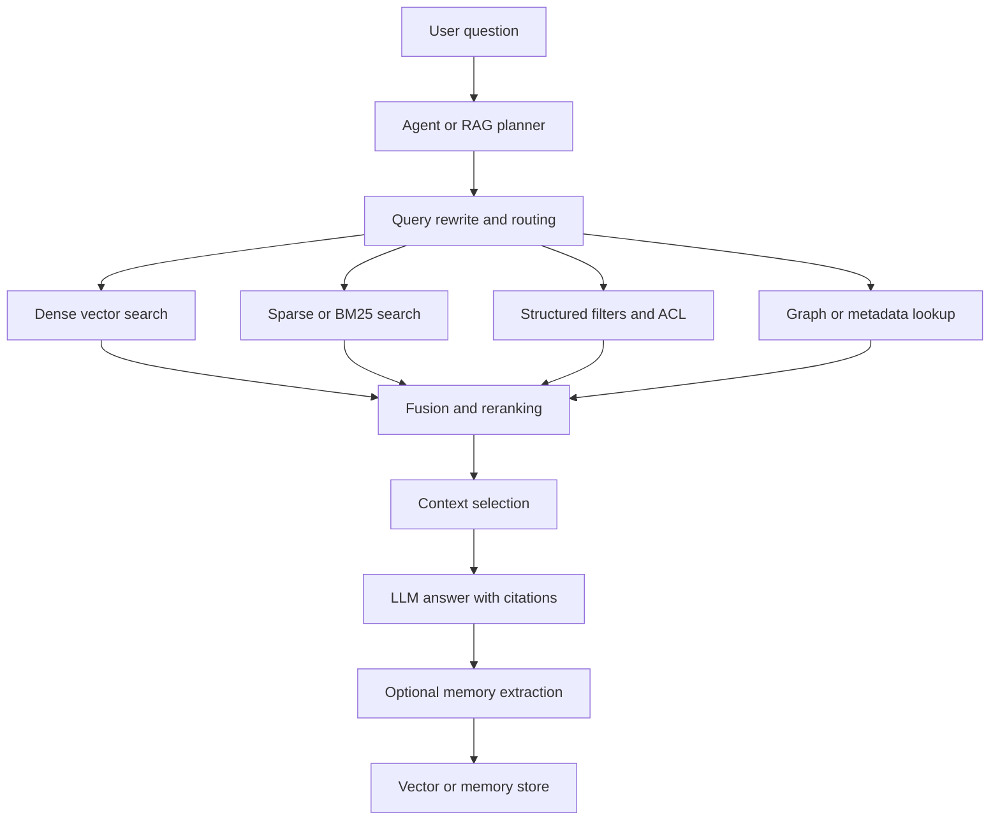

# Vector DB 및 Agentic RAG 비교: OpenSearch, pgvector, Weaviate 중심

작성일: 2026-06-09  
분석 기준: 공식 문서, 최근 검색 자료, 로컬 클론 소스 코드

## 1. 요약

벡터 DB 선택은 "가장 빠른 ANN 엔진"을 고르는 문제가 아니라, RAG 애플리케이션의 데이터 소유권, 필터/권한 모델, 하이브리드 검색 품질, 운영 복잡도, 에이전트가 반복 조회할 때의 인터페이스를 함께 고르는 문제다.

결론부터 정리하면 다음과 같다.

| 선택지 | 가장 적합한 경우 | 피해야 할 경우 | agentic RAG 적합도 |
|---|---|---|---|
| OpenSearch | 기존 검색/로그/문서 검색 인프라가 OpenSearch이고, BM25/필터/facet/vector를 한 클러스터에서 운영하려는 경우 | 벡터 검색만 단순하게 쓰는데 JVM 클러스터와 플러그인 운영을 감당하기 싫은 경우 | 높음. Neural Search에 hybrid, rerank, agentic query 기능이 붙고 있음 |
| pgvector | Postgres가 이미 source of truth이고, SQL join/transaction/ACL과 벡터 검색을 같이 써야 하는 경우 | 초대형 ANN 전용 클러스터, 독립 scaling, 복잡한 multi-stage retrieval이 필요한 경우 | 중간. 앱 계층에서 planner/reranker를 직접 조합해야 함 |
| Weaviate | RAG-first 개발 경험, built-in vectorizer/reranker/generative module, hybrid search, named vector가 중요한 경우 | SQL 트랜잭션/복잡한 relational join 중심 시스템인 경우 | 높음. Query Agent, Engram 같은 agent/memory 제품 방향이 강함 |
| Qdrant | 필터가 강한 vector-native store, dense/sparse/multi-stage query API, Rust 기반 경량 운영이 필요한 경우 | SQL/문서 검색 엔진 생태계와 깊은 결합이 필요한 경우 | 매우 높음. prefetch, fusion, BM25 sparse embedding, MMR 흐름이 agentic retrieval에 맞음 |
| Milvus | 대규모 분산 벡터 검색, 다양한 ANN index, multi-vector hybrid search가 필요한 경우 | 작은 팀이 단순 RAG를 빠르게 운영해야 하는 경우 | 높음. 대규모 RAG backend에 적합하지만 운영면이 무거움 |
| LanceDB | 로컬/임베디드/멀티모달 lakehouse, object storage, versioning/time-travel, agent run 재현성이 중요한 경우 | 전통적 DB 클러스터 운영, 강한 OLTP semantics가 필요한 경우 | 높음. hybrid FTS+vector+RRF, versioned data가 agent evaluation에 좋음 |

추천은 다음과 같다.

- 이미 OpenSearch를 운영하고 검색 품질/필터/권한/관측을 하나로 묶고 싶다면 OpenSearch가 가장 현실적이다.
- 이미 Postgres 중심 서비스이고 RAG 규모가 서비스 DB 안에서 감당 가능하면 pgvector가 가장 단순하다.
- 새 RAG 제품을 빠르게 만들고 agentic query/memory까지 제품화하려면 Weaviate가 가장 일관된 경험을 준다.
- agentic RAG의 검색 루프를 직접 설계하고 싶다면 추가 후보로 Qdrant를 반드시 비교해야 한다.
- 대규모 독립 벡터 플랫폼은 Milvus, 멀티모달/로컬/재현성 중심은 LanceDB를 추가 검토할 가치가 있다.

## 2. 최근 Agentic RAG 트렌드

2026년 현재 RAG는 "chunk -> embed -> top-k -> prompt" 구조만으로는 부족하다는 인식이 강해졌다. 최근 논문과 제품 흐름에서 반복되는 방향은 다음과 같다.

1. 단일 vector top-k에서 multi-query, hybrid, reranking, context selection으로 이동
2. dense vector와 sparse/BM25를 결합하고 RRF, relative score fusion, cross-encoder reranking을 후단에 둠
3. 에이전트가 검색 계획을 세우고, 결과를 읽은 뒤 다음 검색을 조정하는 iterative retrieval로 이동
4. 문서 단위뿐 아니라 문서 내부 navigation, section lookup, exact filter, metadata query를 tool로 노출
5. graph/text/vector를 같이 쓰되, 모든 문제를 graph로 풀기보다 query type별 routing을 선호
6. long-term memory는 append-only vector store가 아니라 extraction, deduplication, scoping, versioning이 필요한 별도 계층으로 발전

근거가 되는 최신 자료:

- arXiv의 AgenticRAG 논문은 enterprise search 위에 search/find/open/summarize 도구를 얹어 LLM이 반복 검색하게 하는 방식을 제안하고, single-shot retrieval에서 agentic tool use로 바뀐 것이 가장 큰 개선 요인이라고 보고한다. [AgenticRAG: Agentic Retrieval for Enterprise Knowledge Bases](https://arxiv.org/abs/2605.05538)
- "Rethinking Agentic RAG"는 agentic RAG가 dense/hybrid/graph backend 자체를 복잡하게 만드는 방향뿐 아니라, LLM이 logical retrieval intent를 만들고 가벼운 inverted index가 이를 실행하는 방향도 가능하다고 주장한다. [Rethinking Agentic RAG](https://arxiv.org/abs/2605.27123)
- CTI 도메인 평가 논문은 multi-hop 관계 질의에서 graph-text hybrid가 vector-only보다 유리하다고 보고한다. [Beyond RAG for Cyber Threat Intelligence](https://arxiv.org/abs/2604.11419)
- Weaviate는 Query Agent와 Engram을 통해 자연어 질의 번역과 agent memory를 제품 축으로 확장하고 있다. [Weaviate Query Agent docs](https://docs.weaviate.io/query-agent), [Weaviate Engram docs](https://docs.weaviate.io/engram)
- OpenSearch는 semantic field, neural sparse ANN, Neural Search plugin의 hybrid/agentic query를 통해 검색 엔진 위에 AI search 계층을 얹는 방향이다. [OpenSearch semantic field](https://docs.opensearch.org/latest/mappings/supported-field-types/semantic/), [OpenSearch neural sparse ANN](https://docs.opensearch.org/3.3/vector-search/ai-search/neural-sparse-ann/)

## 3. 전체 아키텍처 관점

이 구조에서 벡터 DB가 담당하는 범위는 제품마다 다르다.

- pgvector는 `D`와 일부 `F`를 Postgres 안에서 처리한다. `Q1`, `R`, `C`, `M`은 대부분 애플리케이션 코드나 LlamaIndex/LangChain 같은 프레임워크 몫이다.
- OpenSearch는 `D`, `S`, `F`, `R` 일부를 검색 엔진 안에서 처리하고, Neural Search를 통해 `Q1`까지 확장한다.
- Weaviate는 `D`, `S`, `F`, `R` 외에 Query Agent와 Engram으로 `Q1`, `M`까지 제품화하려 한다.
- Qdrant는 `D`, sparse vector, prefetch, fusion, MMR를 API에 강하게 노출해 `Q1`과 `R`을 앱/agent가 세밀하게 조합하기 좋다.
- Milvus는 대규모 `D`와 multi-vector hybrid search에 강하고, `R`은 reranker/function score로 붙는다.
- LanceDB는 `D`, FTS, RRF, versioning/time-travel을 통해 agent run 재현성과 multimodal retrieval에 강점이 있다.

## 4. OpenSearch 분석

### 프로젝트 개요

OpenSearch는 원래 search engine, observability, security analytics 성격이 강한 분산 검색 플랫폼이다. 벡터 DB로 볼 때는 `knn_vector` field, k-NN plugin, Neural Search plugin, ML Commons와 결합해 dense vector, sparse vector, BM25, semantic search, reranking을 하나의 검색 클러스터에서 제공하는 형태다.

공식 문서 기준으로 `knn_vector`는 1.0부터 제공되며, dimension은 1부터 16,000까지이고 `float`, `byte`, `binary` data type, in-memory/on-disk mode, compression level을 설정할 수 있다. [OpenSearch k-NN vector docs](https://docs.opensearch.org/latest/mappings/supported-field-types/knn-vector/)

### 핵심 특징 및 차별점

- 검색 엔진 기반이라 BM25, analyzer, filter, aggregation, facet, security plugin, index lifecycle와 자연스럽게 결합된다.
- k-NN engine은 Faiss, Lucene, deprecated NMSLIB를 지원한다.
- OpenSearch k-NN plugin 코드에서 기본 engine은 Faiss이고, Lucene/Faiss는 filter와 radial search를 지원하는 것으로 정의되어 있다. 로컬 클론 기준 `KNNEngine.java`에서 확인했다.
- Neural Search plugin에는 hybrid query, neural sparse query, model inference query, agentic query builder가 포함된다.
- `semantic` field type은 3.1에서 도입되어 ML model 기반 semantic indexing/querying 설정을 단순화한다.
- neural sparse ANN은 3.3에서 도입되어 `sparse_vector` field에서 SEISMIC 기반 approximate sparse retrieval을 제공한다.

### 코드 레벨 구조

로컬 클론 기준:

- `.repos/opensearch` commit `52f1807e`: OpenSearch core
- `.repos/opensearch-knn` commit `ffae669`: k-NN plugin
- `.repos/opensearch-neural-search` commit `e47fb4b`: Neural Search plugin

핵심 코드:

- `.repos/opensearch-knn/src/main/java/org/opensearch/knn/index/engine/KNNEngine.java`
  - `NMSLIB`, `FAISS`, `LUCENE` engine enum
  - `DEFAULT = FAISS`
  - max dimension 16,000
  - filter/radial/nested field 지원 engine set 정의
- `.repos/opensearch-knn/jni/src/faiss_wrapper.cpp`, `nmslib_wrapper.cpp`
  - native ANN engine 연동
- `.repos/opensearch-neural-search/src/main/java/org/opensearch/neuralsearch/query/HybridQueryBuilder.java`
  - 최대 5개 sub-query를 받는 hybrid query
  - filter pushdown, pagination depth, hybrid score collection
- `.repos/opensearch-neural-search/src/main/java/org/opensearch/neuralsearch/query/AgenticSearchQueryBuilder.java`
  - `query_text`, `query_fields`, `memory_id`를 받는 agentic query type
  - prompt injection 방지용 query sanitization
  - top-level query로만 쓰도록 제한하고 `agentic_query_translator` search processor와 결합

### 장점

- 기존 OpenSearch/Elasticsearch 계열 운영 경험이 있으면 도입 비용이 낮다.
- keyword, vector, sparse, semantic, rerank를 한 검색 시스템에서 다룰 수 있다.
- 문서 필터링, ACL, multi-tenant index, observability, dashboard까지 함께 가져갈 수 있다.
- agentic search 기능이 검색 엔진 내부 DSL로 들어오고 있어, 검색 엔진 자체가 RAG tool 역할을 하기 좋아진다.

### 단점 및 리스크

- 단순 벡터 저장소로 쓰기에는 JVM 기반 분산 검색 엔진 운영비가 무겁다.
- k-NN, Neural Search, ML Commons, 모델 배포, ingest pipeline까지 결합하면 설정 복잡도가 높다.
- 벡터 DB 전용 제품보다 API가 검색 엔진 DSL 중심이라, 앱 개발자가 RAG-first 경험을 기대하면 다소 무겁게 느낄 수 있다.

### 적합한 사용처

- 사내 문서 검색, 로그/티켓/문서 검색에 이미 OpenSearch가 있는 조직
- keyword와 vector를 모두 중요하게 보는 technical docs, support search, ecommerce search
- 보안 필터, index alias, dashboard, audit를 검색 계층에서 같이 운영해야 하는 RAG

## 5. pgvector 분석

### 프로젝트 개요

pgvector는 Postgres 확장이다. vector type과 HNSW, IVFFlat access method를 추가해 Postgres 안에서 vector similarity search를 수행한다. 로컬 클론의 `vector.control` 기준 default version은 `0.8.2`다.

공식 README는 single-precision, half-precision, binary, sparse vector를 지원하고, HNSW와 IVFFlat index를 제공하며, Postgres full-text search와 RRF/cross-encoder를 조합해 hybrid search를 만들 수 있다고 설명한다. [pgvector GitHub](https://github.com/pgvector/pgvector)

### 핵심 특징 및 차별점

- Postgres 안에서 벡터, row metadata, tenant/user ACL, transaction을 같이 다룬다.
- SQL로 similarity search와 relational filtering/join을 함께 표현할 수 있다.
- HNSW, IVFFlat, exact search를 지원한다.
- `vector`, `halfvec`, `bit`, `sparsevec` 타입을 제공한다.
- 앱이 이미 Postgres 중심이면 별도 vector DB 운영 없이 시작할 수 있다.

### 코드 레벨 구조

로컬 클론 기준:

- `.repos/pgvector` commit `12368bd`
- 핵심 파일:
  - `src/vector.c`, `src/halfvec.c`, `src/bitvec.c`, `src/sparsevec.c`: 타입과 거리 함수
  - `src/hnsw.c`, `src/hnswbuild.c`, `src/hnswscan.c`: HNSW access method
  - `src/ivfflat.c`, `src/ivfbuild.c`, `src/ivfscan.c`, `src/ivfkmeans.c`: IVFFlat와 k-means 기반 list 생성
  - `sql/vector.sql`: SQL extension surface

코드에서 HNSW는 `m`, `ef_construction`, `hnsw.ef_search`, iterative scan, max scan tuples, scan memory multiplier를 Postgres reloption/GUC로 노출한다. IVFFlat은 `lists`, `ivfflat.probes`, iterative scan, max probes를 노출한다.

### 장점

- 운영 단순성: Postgres만 운영하면 된다.
- 트랜잭션과 데이터 일관성: source row와 embedding이 같은 DB에 있다.
- SQL join, filter, RLS, ACL, tenant isolation을 자연스럽게 쓸 수 있다.
- 작은 팀과 초기 제품에서 비용 대비 효과가 좋다.

### 단점 및 리스크

- 벡터 검색 전용 분산 엔진보다 scale-out, ANN tuning, multi-stage retrieval API가 제한적이다.
- hybrid search는 Postgres full-text search와 앱 계층 fusion/reranker를 직접 조합해야 한다.
- agentic RAG에서 에이전트가 여러 retrieval strategy를 반복 실행하려면 SQL/tool 설계를 직접 해야 한다.
- 대규모 write-heavy embedding update, 고차원 대량 ANN, 독립 벡터 serving tier가 필요하면 부담이 커진다.

### 적합한 사용처

- SaaS 앱에서 tenant, document, permission, embedding이 모두 Postgres에 있는 경우
- 수백만에서 수천만 규모의 문서/노트/이벤트 검색을 서비스 DB와 묶어 관리하려는 경우
- 별도 vector DB를 운영하기 전 제품 검증 단계

## 6. Weaviate 분석

### 프로젝트 개요

Weaviate는 AI-native vector database를 표방하는 Go 기반 오픈소스 벡터 DB다. 객체 저장, schema, vector index, inverted index, module system, vectorizer, reranker, generative module, hybrid search를 한 제품 안에 묶는다.

공식 문서 기준 hybrid search는 vector search와 BM25F keyword search 결과를 fusion하고, fusion method와 relative weight를 설정할 수 있다. [Weaviate hybrid search docs](https://docs.weaviate.io/weaviate/search/hybrid)

### 핵심 특징 및 차별점

- HNSW 기반 vector index와 inverted index를 함께 제공한다.
- named vectors, multi-vector, hybrid search, reranker module이 RAG 앱에 유용하다.
- Query Agent는 자연어 질문을 Weaviate query로 바꾸고, collection 선택, filter, group by, sort, search type을 자동 결정한다.
- Engram은 agent memory server로, raw conversation/fact를 받아 extraction, transform, dedup/merge, commit, vector/BM25/hybrid retrieval을 제공한다.

### 코드 레벨 구조

로컬 클론 기준:

- `.repos/weaviate` commit `6f5e0bb`
- 핵심 파일:
  - `adapters/repos/db/vector/hnsw/index.go`: HNSW index core
  - `usecases/traverser/hybrid/searcher.go`: sparse/dense result fusion
  - `entities/searchparams/retrieval.go`: `HybridSearch` parameter model
  - `adapters/handlers/rest/configure_api.go`: vectorizer/reranker/generative module registration

HNSW 구현에는 `maximumConnections`, `efConstruction`, runtime `ef`, flat search cutoff, tombstone cleanup, vector cache, LSM store, compression config(PQ/BQ/SQ/RQ), ACORN search 관련 설정이 포함되어 있다. Hybrid searcher는 sparse search와 dense search 결과를 `alpha` weight로 합치고, fusion algorithm에 따라 결과를 결합한다.

### 장점

- RAG 개발자가 원하는 기능이 제품 표면에 많이 올라와 있다.
- vectorizer/reranker/generative provider module이 많아 앱 코드가 줄어든다.
- hybrid search와 named vector가 잘 노출되어 multimodal/다중 representation에 유리하다.
- Query Agent와 Engram 방향은 agentic RAG와 장기 메모리 요구에 잘 맞는다.

### 단점 및 리스크

- Weaviate 방식의 schema/object model에 앱 데이터를 맞춰야 한다.
- 복잡한 relational join, transactional workflow는 Postgres보다 자연스럽지 않다.
- Query Agent, Engram 같은 agentic 기능은 cloud/product 기능과 결합되는 부분이 있어 self-host only 전략에서는 범위를 확인해야 한다.

### 적합한 사용처

- RAG-first 제품, semantic/hybrid search 제품, AI assistant backend
- 앱 개발자가 vectorizer/reranker/module 통합을 빠르게 가져가야 하는 경우
- agent memory, personalization, natural-language query interface까지 같은 벤더/프로젝트 축에서 보고 싶은 경우

## 7. 추가로 주목할 Vector DB

### Qdrant

Qdrant는 Rust 기반 vector search engine이다. 공식 문서의 hybrid query API는 dense/sparse named vector prefetch를 실행한 뒤 RRF 또는 DBSF로 fusion하는 구조를 제공한다. [Qdrant hybrid queries](https://qdrant.tech/documentation/search/hybrid-queries/)

로컬 클론 기준:

- `.repos/qdrant` commit `44ad62f`
- `Cargo.toml` version `1.18.2`
- `lib/segment/src/index/hnsw_index/hnsw.rs`: HNSW index
- `lib/shard/src/query/planned_query.rs`: nested prefetch, fusion, MMR, rescore stage query planning
- `src/common/inference/bm25_inference.rs`: BM25 sparse embedding adapter

Qdrant가 agentic RAG에서 특히 강한 이유는 query API가 "한 번 검색"보다 "prefetch -> fusion/rescore -> MMR"에 맞춰져 있기 때문이다. 에이전트가 search tool을 호출할 때 dense, sparse, filtered, recommend, discover, MMR를 단계적으로 조합하기 좋다.

### Milvus

Milvus는 대규모 분산 벡터 DB다. 공식 문서 기준 multi-vector hybrid search는 여러 vector field에서 ANN search를 동시에 수행하고 dense/sparse 또는 multimodal representation을 결합한다. [Milvus multi-vector hybrid search](https://milvus.io/docs/multi-vector-search.md)

로컬 클론 기준:

- `.repos/milvus` commit `bc95b2d`
- `client/index/common.go`: `FLAT`, `IVF_FLAT`, `IVF_PQ`, `HNSW`, `DISKANN`, `SCANN`, sparse inverted/WAND, GPU index 등 다양한 index type
- `client/milvusclient/read_options.go`: `HybridSearchRequest`, reranker, function reranker
- `docs/developer_guides/chap03_index_service.md`: IndexCoord/IndexNode 기반 async index build 구조

Milvus는 작은 RAG보다 대규모 벡터 플랫폼에 가깝다. segment, index build service, proxy/query/data coord 구조를 운영할 수 있는 팀이라면 대량 collection, 다양한 index, scale-out 요구에 강하다.

### LanceDB

LanceDB는 Lance columnar format 위에 올라가는 multimodal AI database다. 공식 사이트는 hybrid search, reranking, late-interaction, object storage 기반 compute-storage separation, versioning/time-travel을 강조한다. [LanceDB](https://www.lancedb.com/)

로컬 클론 기준:

- `.repos/lancedb` commit `d901806`
- `rust/lancedb/src/index/vector.rs`: IVF Flat, IVF PQ, HNSW 계열 vector index builder
- `rust/lancedb/src/rerankers/rrf.rs`: vector result와 FTS result를 RRF로 rerank
- `python/src/query.rs`, `rust/lancedb/src/remote/table.rs`: FTS, multivector, remote table query path

LanceDB는 특히 agent run 재현성과 데이터 버전 관리가 중요한 경우 주목할 만하다. 코드/문서/멀티모달 데이터가 계속 바뀌는 agent workflow에서 "어떤 시점의 index로 어떤 결과가 나왔는지"를 재현하는 능력은 일반적인 vector DB benchmark보다 중요할 수 있다.

## 8. RAG 계층에서 같이 볼 만한 프로젝트

벡터 DB는 retrieval substrate이고, 복잡한 RAG 품질은 ingestion, parsing, chunking, query planning, reranking, citation, evaluation 계층에서 갈린다. 따라서 다음 프로젝트는 벡터 DB 대체재라기보다 상위 RAG 계층으로 봐야 한다.

| 프로젝트 | 포지션 | 주목 이유 |
|---|---|---|
| RAGFlow | deep document understanding 기반 RAG engine | PDF, table, chart, layout-heavy 문서에서 parsing/chunking 품질이 핵심일 때 |
| Microsoft GraphRAG | graph-based RAG system | entity/relationship/community summary 기반 multi-hop, corpus-level 질문에 적합 |
| LightRAG | lightweight graph-enhanced RAG | vector-only보다 구조적 문맥을 더 쓰고 싶지만 GraphRAG full pipeline은 무거울 때 |
| LlamaIndex | RAG orchestration framework | 여러 retriever, tool, agent, vector DB connector를 실험할 때 |

주의할 점은 "GraphRAG가 항상 vector RAG보다 낫다"가 아니라는 것이다. 최근 평가들은 query class에 따라 vector, hybrid, graph, logical retrieval의 강점이 갈린다는 쪽에 가깝다. 운영적으로는 먼저 hybrid dense+sparse+rerank를 baseline으로 만들고, multi-hop 관계 질의가 중요한 도메인에 graph를 추가하는 순서가 안전하다.

## 9. 비교 표

| 기준 | OpenSearch | pgvector | Weaviate | Qdrant | Milvus | LanceDB |
|---|---|---|---|---|---|---|
| 기본 성격 | 분산 검색 엔진 + vector plugin | Postgres extension | AI-native vector DB | vector-native search engine | 분산 vector DB | multimodal AI lakehouse DB |
| 주요 언어 | Java/C++ JNI | C/Postgres | Go | Rust | Go/C++ | Rust/Python/Node |
| ANN | Faiss, Lucene, NMSLIB deprecated | HNSW, IVFFlat | HNSW | HNSW | HNSW, IVF, DISKANN, SCANN 등 | IVF, PQ, HNSW 계열 |
| Sparse/BM25 | 매우 강함 | Postgres FTS와 조합 | 내장 BM25F | sparse vector, BM25 inference | sparse inverted/WAND, BM25 function | FTS + RRF |
| Hybrid search | Neural Search hybrid query | 직접 조합 | 내장 hybrid search | Query API prefetch + RRF/DBSF | multi-vector hybrid + reranker | vector + FTS + RRF |
| Filter/metadata | 강함 | SQL 최강 | 강함 | 강함 | 강함 | DataFrame/SQL 스타일 |
| Transaction | 검색 엔진 semantics | Postgres transaction | 제한적 | 제한적 | 제한적 | dataset/table semantics |
| Agentic 기능 | agentic query translator 방향 | 앱에서 직접 구현 | Query Agent, Engram | agent가 조합하기 좋은 query API | 대규모 backend로 적합 | versioned agent data에 강함 |
| 운영 난이도 | 중상 | 낮음 | 중 | 중하 | 높음 | 낮음-중 |
| 가장 큰 장점 | 검색 플랫폼 통합 | 데이터 일관성과 단순성 | RAG-first 제품성 | 세밀한 retrieval API | 대규모 분산 벡터 | 멀티모달/버전/로컬 |
| 가장 큰 약점 | 무거운 운영 | scale-out/vector 특화 한계 | object model 종속 | SQL/search ecosystem 약함 | 운영 복잡도 | 전통 DB 기능 한계 |

## 10. 선택 가이드

### OpenSearch를 선택

다음 조건이면 OpenSearch가 적합하다.

- 이미 OpenSearch가 production search backbone이다.
- keyword relevance, analyzer, highlighting, aggregation, filters가 vector보다 더 중요하거나 동등하게 중요하다.
- 문서/로그/티켓/상품 검색 위에 RAG를 얹는다.
- 검색 결과의 explainability, dashboard, security plugin, index lifecycle이 중요하다.

반대로 vector-only app, local-first app, 작은 팀의 빠른 RAG prototype이면 과하다.

### pgvector를 선택

다음 조건이면 pgvector가 적합하다.

- Postgres row가 source of truth다.
- embedding과 row metadata가 같은 transaction에 있어야 한다.
- tenant/user ACL, row-level security, SQL join이 중요하다.
- 초기 제품 또는 중간 규모 RAG에서 운영 단순성이 최우선이다.

반대로 수억-수십억 벡터, 독립 vector serving tier, 복잡한 multi-stage retrieval DSL이 필요하면 다른 후보가 낫다.

### Weaviate를 선택

다음 조건이면 Weaviate가 적합하다.

- RAG-first database를 원하고 vectorizer/reranker/generative module을 빠르게 붙이고 싶다.
- hybrid search와 named vector를 기본 기능으로 쓰고 싶다.
- Query Agent, Engram처럼 자연어 query와 agent memory까지 같은 제품 철학에서 보고 싶다.
- Postgres보다 object/vector schema가 문제에 잘 맞는다.

반대로 core business transaction과 relational model이 검색보다 중요하면 pgvector나 OpenSearch+DB 조합이 더 현실적이다.

### Qdrant를 추가 검토

다음 조건이면 Qdrant를 비교군에 반드시 넣는 편이 좋다.

- 에이전트가 dense/sparse/filter/MMR/fusion을 반복적으로 조합한다.
- payload filter와 vector search 성능이 중요하다.
- Rust 기반 단일 바이너리/클러스터 운영을 선호한다.
- 자체 RAG planner를 만들고 DB는 강한 retrieval primitive를 제공하면 된다.

### Milvus를 추가 검토

다음 조건이면 Milvus가 맞다.

- 전용 벡터 플랫폼을 대규모로 운영한다.
- 다양한 index type과 GPU/분산 index build가 필요하다.
- 여러 modality/vector field를 대량으로 다룬다.

단순 RAG 제품에는 운영 표면이 넓다.

### LanceDB를 추가 검토

다음 조건이면 LanceDB가 강하다.

- local/embedded RAG 또는 object storage 기반 AI data lake가 필요하다.
- 이미지, 오디오, 비디오, embedding, metadata를 함께 관리한다.
- agent run 재현성, time-travel, historical evaluation이 중요하다.
- vector search와 FTS/RRF를 가볍게 조합하고 싶다.

## 11. Agentic RAG 기준 최종 추천

실제 엔지니어링 의사결정은 다음 순서로 하면 된다.

1. 데이터 source of truth가 Postgres인가?
   - 그렇다면 pgvector로 시작하고, hybrid/rerank는 앱 계층에서 명시적으로 만든다.
2. 기존 검색 엔진이 OpenSearch인가?
   - 그렇다면 OpenSearch vector + Neural Search를 우선 검토한다.
3. 새 RAG 제품이고 vector DB가 제품의 중심인가?
   - Weaviate와 Qdrant를 우선 비교한다.
4. 대규모 독립 벡터 플랫폼인가?
   - Milvus를 비교한다.
5. local-first, multimodal, time-travel, agent evaluation이 중요한가?
   - LanceDB를 비교한다.

내 추천 조합은 다음과 같다.

- 운영형 enterprise search RAG: OpenSearch + Neural Search + cross-encoder reranker
- SaaS product RAG: Postgres + pgvector + app-level hybrid/RRF + reranker
- RAG-native assistant: Weaviate + Query Agent/Engram 또는 Qdrant + custom planner
- 대규모 AI platform: Milvus 또는 Qdrant cluster + 별도 metadata/ACL store
- multimodal/agent evaluation platform: LanceDB + object storage + explicit dataset versioning

## 12. 참고 자료

- [OpenSearch k-NN vector field](https://docs.opensearch.org/latest/mappings/supported-field-types/knn-vector/)
- [OpenSearch k-NN methods and engines](https://docs.opensearch.org/latest/mappings/supported-field-types/knn-methods-engines/)
- [OpenSearch semantic field](https://docs.opensearch.org/latest/mappings/supported-field-types/semantic/)
- [OpenSearch neural sparse ANN](https://docs.opensearch.org/3.3/vector-search/ai-search/neural-sparse-ann/)
- [pgvector GitHub README](https://github.com/pgvector/pgvector)
- [Weaviate hybrid search](https://docs.weaviate.io/weaviate/search/hybrid)
- [Weaviate Query Agent](https://docs.weaviate.io/query-agent)
- [Weaviate Engram](https://docs.weaviate.io/engram)
- [Qdrant hybrid queries](https://qdrant.tech/documentation/search/hybrid-queries/)
- [Milvus multi-vector hybrid search](https://milvus.io/docs/multi-vector-search.md)
- [LanceDB official site](https://www.lancedb.com/)
- [AgenticRAG: Agentic Retrieval for Enterprise Knowledge Bases](https://arxiv.org/abs/2605.05538)
- [Rethinking Agentic RAG](https://arxiv.org/abs/2605.27123)
- [Beyond RAG for Cyber Threat Intelligence](https://arxiv.org/abs/2604.11419)
- [Microsoft GraphRAG GitHub](https://github.com/microsoft/graphrag)
