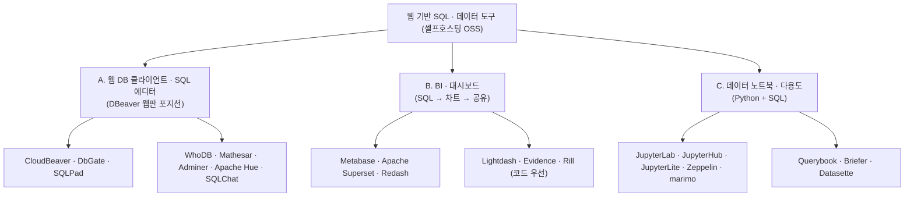
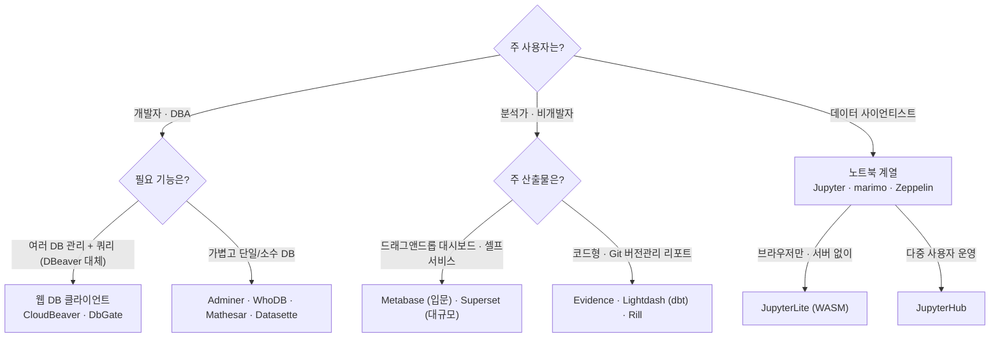
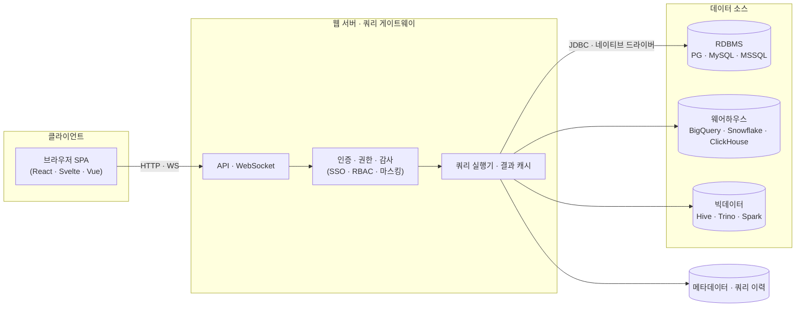

# 웹 기반 오픈소스 SQL 실행·시각화 도구 조사 (2026)

> DBeaver·DataGrip 처럼 PC에 개별 설치하는 데스크톱 클라이언트가 아니라, **서버에 한 번 띄워두고 브라우저로 접속**해 SQL을 실행하고 결과를 시각화하는 오픈소스 도구를 정리한다. [CloudBeaver](https://github.com/dbeaver/cloudbeaver) 같은 DB 전용 클라이언트부터 Python·SQL을 함께 다루는 노트북형 다용도 도구까지 포함한다.

---

## 1. 조사 범위와 문제 정의 (Problem Statement)

데스크톱 SQL 클라이언트(DBeaver, DataGrip, Navicat …)는 강력하지만 다음 한계가 있다.

- **설치·배포 비용**: 사용자마다 PC에 설치·업데이트해야 함
- **접속 정보 분산**: DB 자격증명이 각자 PC에 흩어져 거버넌스·감사 곤란
- **협업 단절**: 쿼리·결과·대시보드를 팀이 함께 보기 어려움
- **OS 종속**: 사내 표준 OS·VDI 환경에서 설치 제약

웹 기반 도구는 **서버 1곳에 설치 → 브라우저 접속**으로 이 문제를 해결한다. 자격증명·권한·감사가 서버에 집중되고, URL로 쿼리·차트·대시보드를 공유할 수 있다. 본 조사는 셀프호스팅 가능한 오픈소스 도구를 **3개 계열**로 나눠 비교한다.

### 분류 체계

| 계열 | 1차 목적 | 사용자 | 대표 도구 |
|---|---|---|---|
| **A. 웹 DB 클라이언트** | DB 관리 + 임의 SQL 실행 | 개발자·DBA | CloudBeaver, DbGate, WhoDB |
| **B. BI · 대시보드** | SQL → 차트/대시보드 → 공유 | 분석가·비개발자 | Metabase, Superset, Redash |
| **C. 데이터 노트북** | Python·SQL 혼합 분석·재현성 | 데이터 사이언티스트 | Jupyter, marimo, Zeppelin |

---

## 2. 도구 선택 의사결정 가이드

핵심 분기 3가지:

1. **임의 SQL을 자유롭게 치고 DB를 관리**하려면 → **A 계열** (CloudBeaver가 DBeaver 웹판으로 가장 직결)
2. **차트·대시보드를 만들어 팀에 공유**가 주 목적이면 → **B 계열** (Metabase=입문 최적, Superset=대규모, 코드형이면 Evidence/Lightdash)
3. **Python 데이터프레임·머신러닝을 SQL과 섞어** 탐색·재현하려면 → **C 계열** (marimo=현대적, Jupyter=표준)

---

## 3. 계열 A — 웹 DB 클라이언트 · SQL 에디터

> 데스크톱 SQL 클라이언트의 "웹판". DB에 직접 연결해 스키마 탐색·임의 SQL 실행·데이터 편집을 한다. CloudBeaver가 정확히 이 포지션이다.

| 도구 | 라이선스 | 백엔드 스택 | 지원 DB | 결과 시각화 | 특징 |
|---|---|---|---|---|---|
| **CloudBeaver** | Apache-2.0 (CE) | Java(JVM) + TS/React | JDBC 기반 다수(RDBMS·NoSQL·웨어하우스) | 그리드 + 간단 차트 패널 | DBeaver 코어 재사용, 가장 정통 "DBeaver 웹판" |
| **DbGate** | GPL-3.0 | Node/Express + Svelte (Electron 겸용) | MySQL·PG·MSSQL·Oracle·Mongo·Redis·SQLite·ClickHouse·DuckDB 등 | 차트(HTML export) | 데스크톱+웹 동시 제공, 무료판도 웹 UI 포함 |
| **SQLPad** | MIT | Node.js + React | PG·MySQL·MSSQL·ClickHouse·Trino/Presto·BigQuery·SQLite 등(ODBC) | 결과 차트 내장 | 가볍고 Docker로 즉시 기동. **2025-08 아카이브됨**(유지보수 종료) |
| **WhoDB** | Apache-2.0 | Go + React | PG·MySQL·MariaDB·SQLite·Mongo·Redis·Elastic(+Enterprise: Oracle·MSSQL·Snowflake 등) | 스키마 시각화 · 스프레드시트형 그리드 | <50MB 경량, Jupyter류 스크래치패드 + **NL→SQL 챗(LLM)** 내장 |
| **Mathesar** | GPL-3.0 | Python(Django) + Svelte | **PostgreSQL 전용** | 스프레드시트형 UI(차트 약함) | 비개발자도 쓰는 "PG용 스프레드시트", 네이티브 PG 권한 활용 |
| **Adminer** | Apache-2.0 / GPL-2 | PHP **단일 파일** | MySQL·PG·SQLite·MSSQL·Oracle·MongoDB 등 | 약함(그리드 위주) | phpMyAdmin 대체. 1개 PHP 파일로 초경량 배포 |
| **Apache Hue** | Apache-2.0 | Python(Django) + Vue/TS | Hive·Impala·Presto/Trino·SparkSQL·PG·MySQL 등 50+ | 6종 내장 차트 | 하둡/데이터웨어하우스 SQL 어시스턴트의 원조 격 |
| **SQLChat** | MIT | Next.js/TS | PG·MySQL·MSSQL·TiDB 등 | (대화 기반) | **챗 우선** SQL 클라이언트. 자연어로 쿼리 생성·실행 |

### 핵심 도구 상세

**CloudBeaver** — 사용자가 예시로 든 도구. DBeaver 팀이 만든 브라우저 기반 DB 매니저로, **DBeaver의 JDBC 드라이버·SQL 엔진을 그대로 재사용**한다. 서버는 Java(JVM) 애플리케이션, 프런트는 TypeScript+React. CE는 Apache-2.0. 강점은 DBeaver와 동일한 광범위한 DB 지원과 안정적인 SQL 에디터(자동완성·실행계획). 시각화는 데이터 그리드와 간단한 차트 패널 수준으로 BI 도구만큼 풍부하진 않다. 세분화된 권한·SSO·데이터 마스킹 등은 Enterprise(상용)로 분리.

**DbGate** — CloudBeaver의 가장 실용적인 대안. **하나의 코드베이스로 데스크톱 앱과 웹 UI를 모두** 제공하며, 무료 커뮤니티(GPL-3.0)에서도 Docker로 웹 모드를 띄울 수 있다. SQL·NoSQL을 폭넓게 지원하고 쿼리 결과를 차트로 만들어 HTML로 내보내기 가능. 쿼리·ER 다이어그램 실시간 공동 편집을 강조.

**WhoDB** — Go+React로 작성한 **초경량(<50MB)** 차세대 탐색기. 스프레드시트형 데이터 그리드, 관계 시각화, Jupyter류 멀티셀 스크래치패드를 제공하고, **Ollama·OpenAI·Anthropic 등을 붙여 자연어→SQL 챗**을 쓸 수 있다. "전통 도구 대비 리소스 90% 절감"을 표방.

**Mathesar** — PostgreSQL 전용 **스프레드시트형 UI**. 비개발자가 표를 다루듯 PG 데이터를 보고/편집/쿼리하며, 별도 추상화 없이 네이티브 PG 권한을 그대로 쓴다. SQL 에디터보다 "노코드 PG 프런트엔드"에 가깝다.

**Adminer** — **PHP 단일 파일**로 배포되는 초경량 클라이언트. phpMyAdmin의 더 가벼운 대안으로, 서버에 파일 하나 올리면 끝난다. 시각화는 약하지만 "빠르게 한 DB를 웹으로 들여다보기"에 최적.

**Apache Hue** — 하둡 생태계의 SQL 어시스턴트 원조. Django 백엔드 + Vue 프런트로, Hive/Impala/Presto/SparkSQL 등 빅데이터 엔진을 인터프리터로 붙인다. 데이터웨어하우스·레이크하우스 SQL 탐색에 강점.

---

## 4. 계열 B — BI · 대시보드

> SQL(또는 노코드 쿼리 빌더)로 데이터를 뽑아 **차트·대시보드로 만들고 공유**하는 데 초점. 시각화 풍부함은 A 계열보다 훨씬 강하다.

| 도구 | 라이선스 | 백엔드 스택 | SQL 에디터 | 시각화/대시보드 | 노코드 빌더 | 비고 |
|---|---|---|---|---|---|---|
| **Metabase** | AGPL-3.0 (CE) | Clojure + React | 있음(네이티브 쿼리) | 풍부 | **강함**(드래그앤드롭) | 비개발자 셀프서비스 최강, 10분이면 첫 대시보드 |
| **Apache Superset** | Apache-2.0 | Python(Flask) + React | **SQL Lab**(강력) | 40+ 차트, 매우 풍부 | 보통 | 대규모·엔터프라이즈(LDAP/OAuth/SAML), 비동기 쿼리 |
| **Redash** | BSD-2-Clause | Python(Flask) + React | 강함 | 다수 차트 | 약함 | SQL 중심 쿼리·대시보드. Databricks 인수 후 정체설(저장소 커밋은 지속) |
| **Lightdash** | MIT (코어) | TypeScript | dbt 기반 | 풍부 | dbt 메트릭 기반 | **dbt 프로젝트 직결**, 코드/YAML 우선, CI/CD·버전관리 |
| **Evidence** | MIT | SvelteKit/JS | **Markdown+SQL** | 정적 사이트 리포트 | 없음 | 코드 우선 BI, SQL+MD로 리포트를 정적 사이트로 배포 |
| **Rill** | Apache-2.0 | Go + DuckDB/ClickHouse | 모델/메트릭 코드 | 빠른 대시보드 | 없음 | OLAP(DuckDB·ClickHouse) 기반 초고속, MCP 서버 내장 |

### 핵심 도구 상세

**Metabase** — **비개발자 셀프서비스 BI의 표준**. 드래그앤드롭 질문 빌더(Question Builder)가 뛰어나 마케팅·운영팀도 SQL 없이 차트를 만든다. 동시에 네이티브 SQL도 지원. 컨테이너 기동 후 ~10분이면 첫 대시보드가 나올 만큼 도입 장벽이 낮다. CE는 AGPL-3.0(엔터프라이즈 디렉터리는 상용 라이선스 분리 → GitHub 라이선스 표기는 혼합). 단일 인스턴스로 50~100 대시보드까지 무난.

**Apache Superset** — **파워·확장성·시각화 다양성**에서 우위. **SQL Lab**이라는 강력한 웹 SQL IDE를 내장하고, 40종 이상 차트와 40+ DB/웨어하우스(Snowflake·BigQuery·ClickHouse·Trino 등)를 지원한다. 셋 중 유일하게 LDAP/OAuth/OIDC/SAML 등 엔터프라이즈 인증을 기본 제공. Celery 워커·Redis 캐시로 대규모(200 사용자·50 대시보드)를 네이티브로 감당. "데이터팀이 큐레이션 레이어를 구축"하는 조직에 적합. → 사내 비교 문서: [databases/graphdb](../graphdb/) 와 별개로, AI 인프라 텍스트→SQL 도구는 [ai-infrastructure](../../ai-infrastructure/) 참조.

**Redash** — SQL 쿼리를 1급 시민으로 두는 쿼리·대시보드 도구. 쿼리 결과를 차트·알림으로 만든다. BSD-2로 가장 느슨한 라이선스. Databricks 인수 후 "유지보수 모드" 평이 있었으나 저장소 커밋 활동은 이어지고 있다.

**Lightdash / Evidence / Rill (코드 우선 BI)** — 대시보드를 GUI가 아닌 **코드로 정의**하고 Git으로 버전관리하는 신세대.
- **Lightdash**: **dbt 프로젝트에 직결**. dbt의 YAML 메트릭 정의를 그대로 BI 차원·지표로 끌어온다. 메트릭 거버넌스가 dbt 워크플로에 녹아 있고, 차트/대시보드가 버전관리·CI/CD 대상. 코어 MIT.
- **Evidence**: **SQL + Markdown으로 리포트를 작성** → 정적 웹사이트로 배포(Vercel/Netlify 등). 가볍고 빠른 "코드 우선 BI"의 원조. MIT.
- **Rill**: **DuckDB·ClickHouse 같은 OLAP 엔진** 기반의 초고속 BI. 모델·메트릭·대시보드를 모두 코드로 정의하고, 대화형 BI와 **MCP 서버**(AI 에이전트 연동)를 내장. Apache-2.0.

---

## 5. 계열 C — 데이터 노트북 · 다용도 (Python + SQL)

> Python·SQL·Markdown을 한 문서에서 섞어 탐색·시각화·공유하는 노트북형. "주피터를 실행하는 다용도 도구" 요구에 정확히 대응한다.

| 도구 | 라이선스 | 스택 | SQL 지원 | 시각화 | 특징 |
|---|---|---|---|---|---|
| **JupyterLab / Notebook** | BSD-3-Clause | Python 커널 + TS | 셀 매직/확장 | 라이브러리(matplotlib·plotly 등) | 사실상 표준 노트북 UI |
| **JupyterHub** | BSD-3-Clause | Python | (커널 의존) | (커널 의존) | **다중 사용자** 서버 — 팀에 노트북 환경 제공 |
| **JupyterLite** | BSD-3-Clause | WASM/Pyodide | 플러그인 | altair·plotly·matplotlib | **서버 없이 브라우저(WASM)만**으로 구동, 정적 호스팅 |
| **Apache Zeppelin** | Apache-2.0 | JVM + 인터프리터 | **다언어**(Spark·Hive·SQL·Scala·R) | 6종 내장 차트 | 빅데이터·Spark 통합, 동적 폼·실시간 협업 |
| **marimo** | Apache-2.0 | Python | **1급 SQL**(DuckDB 엔진) | reactive UI | **반응형 노트북**, 순수 .py로 저장, 앱 배포·Git 친화 |
| **Querybook** | Apache-2.0 | Python + TS/React | **DataDoc**(쿼리+차트 셀) | 차트 셀 | Pinterest 제작 빅데이터 쿼리 UI, 테이블 메타데이터·쿼리 분석 자동화 |
| **Briefer** | AGPL-3.0 | TypeScript | SQL+Python 혼합 | 네이티브 차트·대시보드 | 노트북↔대시보드 양면, 실시간 협업. **Resend에 인수**(개발 둔화) |
| **Datasette** | Apache-2.0 | Python | **SQLite 탐색·읽기** | 플러그인 차트(지도 등) | 데이터를 탐색형 웹사이트+JSON API로 즉시 게시. 플러그인 생태계 풍부 |

### 핵심 도구 상세

**Jupyter 3종** — 같은 생태계의 배포 형태 차이:
- **JupyterLab/Notebook**: 사실상 표준 노트북 UI. Python 커널 위에서 SQL은 `%sql` 매직(JupySQL 등)·확장으로 실행하고, 시각화는 matplotlib·plotly·altair로 한다.
- **JupyterHub**: **다중 사용자 서버**. 사내 계정으로 로그인해 각자 노트북 환경을 받는, 팀 단위 운영의 정답.
- **JupyterLite**: **Pyodide(WASM)로 브라우저에서만 완전 구동**. 백엔드 서버 없이 정적 페이지로 배포 가능 → 설치 없이 클릭 한 번으로 노트북.

**marimo** — 현세대 **반응형(reactive) Python 노트북**. 한 셀을 바꾸면 의존하는 셀이 자동 재실행돼 코드·출력 일관성이 보장된다. **SQL이 1급 시민**으로, Python 값에 의존하는 쿼리를 작성해 DuckDB 엔진으로 DataFrame·DB·CSV·시트에 실행하고 결과를 다시 DataFrame으로 받는다. **순수 .py 파일로 저장**돼 Git 친화적이고, 스크립트 실행·앱 배포까지 한다. Jupyter의 "숨은 상태(hidden state)" 문제를 구조적으로 제거한 점이 차별점.

**Apache Zeppelin** — **다언어·빅데이터 통합** 노트북. 하나의 노트에서 Spark·Hive·SQL·Scala·R·Markdown을 인터프리터로 섞고, 6종 내장 차트·동적 폼·실시간 협업을 제공. Spark/Flink 워크로드 분석에 강하다.

**Querybook** — Pinterest가 오픈소스화한 **빅데이터 쿼리 UI**. **DataDoc**(텍스트·쿼리·차트 셀의 조합)으로 분석을 구성하고, 테이블 메타데이터를 쿼리 에디터에 붙여 자동완성·정보 표시를 한다. 실행되는 모든 쿼리를 분석해 참조 테이블·러너 메타데이터를 자동 추출·갱신하는 쿼리 분석 시스템이 특징.

**Datasette** — Simon Willison의 데이터 게시 도구. **읽기 전용 SQLite를 탐색형 웹사이트 + JSON API**로 즉시 노출한다. 임의 SQL 쿼리·패싯 필터·플러그인(지도·차트·AI 어시스턴트)이 풍부. "데이터를 공개·탐색"하는 시나리오에 특화(트랜잭션 편집 도구는 아님).

---

## 6. 종합 비교 매트릭스

| 도구 | 계열 | 라이선스 | 주 스택 | 다중 DB | 결과 시각화 | NL→SQL/AI | 협업/공유 | 활성도(2026) |
|---|---|---|---|---|---|---|---|---|
| CloudBeaver | A | Apache-2.0 | Java + React | ◎ (JDBC 다수) | △ 그리드+간단차트 | – | ○ 웹 공유 | 활발 |
| DbGate | A | GPL-3.0 | Node + Svelte | ◎ | ○ 차트 | – | ○ 실시간 공동편집 | 활발 |
| SQLPad | A | MIT | Node + React | ○ | ○ 차트 | – | ○ URL 공유 | **아카이브('25.8)** |
| WhoDB | A | Apache-2.0 | Go + React | ○ | △ 스키마/그리드 | ◎ 챗 내장 | ○ | 활발 |
| Mathesar | A | GPL-3.0 | Django + Svelte | △ PG 전용 | △ 스프레드시트 | – | ○ | 활발 |
| Adminer | A | Apache-2.0/GPL-2 | PHP 단일파일 | ○ | ✕ | – | △ | 유지 |
| Apache Hue | A | Apache-2.0 | Django + Vue | ◎ (빅데이터) | ○ 6종 | – | ○ | 활발 |
| Metabase | B | AGPL-3.0 | Clojure + React | ○ | ◎ | ○(상용 일부) | ◎ 대시보드 | 매우 활발 |
| Apache Superset | B | Apache-2.0 | Flask + React | ◎ (40+) | ◎ 40+차트 | – | ◎ | 매우 활발 |
| Redash | B | BSD-2 | Flask + React | ◎ | ○ | – | ◎ | 정체설/커밋지속 |
| Lightdash | B | MIT(코어) | TypeScript | dbt 의존 | ◎ | ○ 에이전트 | ◎ | 매우 활발 |
| Evidence | B | MIT | SvelteKit | ○ | ◎ 정적리포트 | ○ Studio | ○ Git/정적 | 활발 |
| Rill | B | Apache-2.0 | Go + DuckDB | ○(OLAP) | ◎ | ○ MCP | ○ | 활발 |
| JupyterLab | C | BSD-3 | Python + TS | 매직/확장 | ◎ 라이브러리 | 확장 | △ | 표준 |
| JupyterHub | C | BSD-3 | Python | (커널) | (커널) | – | ◎ 다중사용자 | 표준 |
| JupyterLite | C | BSD-3 | WASM/Pyodide | 플러그인 | ◎ | – | ○ 정적배포 | 활발 |
| Apache Zeppelin | C | Apache-2.0 | JVM | ◎ 다언어 | ◎ 6종 | – | ◎ | 유지 |
| marimo | C | Apache-2.0 | Python | ◎ DuckDB | ◎ reactive | ◎ AI 네이티브 | ○ 앱배포 | 매우 활발 |
| Querybook | C | Apache-2.0 | Python + React | ◎ 빅데이터 | ○ 차트셀 | ○ | ◎ DataDoc | 활발 |
| Briefer | C | AGPL-3.0 | TypeScript | ○ | ◎ | ○ | ◎ 실시간 | **둔화(피인수)** |
| Datasette | C | Apache-2.0 | Python | △ SQLite | ○ 플러그인 | 플러그인 | ◎ 게시/API | 활발 |

◎ 강함 · ○ 보통/지원 · △ 제한적 · ✕ 없음 · – 해당없음

> **참고(오픈소스 아님)**: **Quadratic**(무한 캔버스 스프레드시트 + Python·SQL·AI)은 강력하지만 **"Quadratic Source Available License"** 로 OSI 오픈소스가 아니다(개인용·열람은 가능, 사내 배포·상용은 라이선스 필요). 오픈소스 요건이 중요하면 제외 대상.

---

## 7. 공통 아키텍처 패턴

대부분의 웹 SQL 도구는 **브라우저 SPA ↔ 쿼리 게이트웨이 서버 ↔ DB 드라이버** 3층 구조를 공유한다. 자격증명·권한·감사가 서버에 집중되는 것이 데스크톱 클라이언트와의 본질적 차이다.

계열별 변형:
- **A(DB 클라이언트)**: 게이트웨이가 **JDBC/네이티브 드라이버**로 임의 DB에 붙음. 시각화는 얇음.
- **B(BI)**: 게이트웨이 위에 **시맨틱 레이어·대시보드·캐시(Redis)·비동기 워커(Celery)**가 두껍게 얹힘.
- **C(노트북)**: 서버가 **언어 커널**(Python·Scala…)을 실행. JupyterLite는 이 커널마저 **브라우저 WASM**으로 내려 서버를 없앰.

---

## 8. 유즈케이스별 추천

| 상황 | 1순위 | 대안 | 이유 |
|---|---|---|---|
| **DBeaver를 웹으로 그대로 옮기고 싶다** | **CloudBeaver** | DbGate | DBeaver 코어·DB 호환성 그대로, 정통 웹판 |
| 데스크톱+웹 둘 다, 무료로 폭넓은 DB | **DbGate** | CloudBeaver | 단일 코드베이스로 양쪽 제공, NoSQL까지 |
| 가장 가볍게 한 DB를 웹으로 | **Adminer** | WhoDB | PHP 단일 파일 / Go 경량 바이너리 |
| 자연어로 SQL 치는 모던 탐색기 | **WhoDB** | SQLChat | LLM 챗 + 스크래치패드 내장 |
| PostgreSQL을 비개발자가 표처럼 | **Mathesar** | – | PG 전용 스프레드시트 UI |
| **비개발자 셀프서비스 대시보드** | **Metabase** | Redash | 드래그앤드롭, 10분 도입 |
| 대규모·엔터프라이즈 BI + 강한 SQL IDE | **Apache Superset** | Metabase | SQL Lab·40+차트·SSO·비동기 |
| dbt 쓰는 팀의 코드형 BI | **Lightdash** | Evidence | dbt 메트릭 직결, 버전관리 |
| Git으로 관리하는 정적 리포트 | **Evidence** | Rill | SQL+MD → 정적 사이트 |
| OLAP 초고속 대시보드 + AI 연동 | **Rill** | Superset | DuckDB/ClickHouse·MCP |
| **Python+SQL 혼합 분석 (현대적)** | **marimo** | Jupyter | 반응형·순수.py·앱배포 |
| 팀 다중 사용자 노트북 운영 | **JupyterHub** | Querybook | 계정별 격리 환경 |
| 설치 없이 브라우저만으로 노트북 | **JupyterLite** | – | WASM, 정적 호스팅 |
| 빅데이터·Spark 다언어 노트북 | **Apache Zeppelin** | Querybook | 인터프리터·Spark 통합 |
| 데이터 공개·탐색 사이트 + API | **Datasette** | – | SQLite → 탐색형 웹+JSON |

---

## 9. 종합 평가 (엔지니어 관점)

**계열 선택이 8할.** "DBeaver 웹판"을 원하면 A(CloudBeaver/DbGate), "차트·대시보드 공유"면 B(Metabase/Superset), "Python+SQL 분석"이면 C(marimo/Jupyter)로 사실상 갈린다. 한 도구가 셋을 다 잘하지는 않는다 — 가령 CloudBeaver는 SQL 실행은 강하지만 BI급 시각화는 없고, Metabase는 대시보드는 좋지만 임의 DDL·데이터 편집 도구로는 부적합하다.

**라이선스 주의.** 사내 배포·상용화를 본다면:
- **느슨함**: Apache-2.0(CloudBeaver·Superset·WhoDB·Rill·marimo·Querybook·Datasette), MIT(SQLPad·Evidence·SQLChat·Lightdash 코어), BSD(Jupyter·Redash) → 가장 안전
- **카피레프트**: GPL-3.0(DbGate·Mathesar), AGPL-3.0(Metabase CE·Briefer) → **AGPL은 네트워크 서비스 제공 시 소스 공개 의무**가 트리거되므로 SaaS형 재배포 시 특히 검토
- **오픈소스 아님**: **Quadratic**(source-available) — 사내 상용 사용엔 라이선스 필요

**활성도·리스크.**
- **죽은/둔화**: **SQLPad는 2025-08 공식 아카이브**(신규 도입 비권장), **Briefer**는 Resend 피인수로 개발 둔화, **Redash**는 정체설(다만 커밋은 지속)
- **상승세**: marimo(반응형·AI 네이티브), Lightdash(dbt·에이전트 BI), Rill(OLAP·MCP)이 가장 모멘텀이 강하다
- **안정 표준**: CloudBeaver·Superset·Metabase·Jupyter는 대규모 채택으로 리스크가 낮다

**AI/에이전트 통합 추세.** WhoDB·SQLChat은 NL→SQL 챗을, Lightdash·Rill은 에이전트/**MCP** 연동을, marimo는 AI 네이티브 에디터를 내세운다. 향후 웹 SQL 도구의 차별화 축은 "MCP 등으로 LLM 에이전트가 직접 쿼리·시각화하는 인터페이스"로 이동하는 흐름이다. (사내 텍스트→SQL 분석은 [ai-infrastructure](../../ai-infrastructure/) 의 DB-GPT·Wren AI 문서 참조)

**추천 시작점 3선.**
1. **DBeaver 대체가 목적** → CloudBeaver(정통) 또는 DbGate(데스크톱+웹+NoSQL)
2. **팀 대시보드가 목적** → Metabase(쉬움) 또는 Superset(대규모·강한 SQL IDE)
3. **Python+SQL 분석이 목적** → marimo(현대적) 또는 JupyterHub(팀 표준)

---

## 출처

- [Top 5 Open Source Online SQL Editors (Bytebase)](https://www.bytebase.com/blog/top-open-source-online-sql-editors/) · [Top 7 Free Open Source SQL Clients (Bytebase)](https://www.bytebase.com/blog/top-open-source-sql-clients/)
- [CloudBeaver (GitHub)](https://github.com/dbeaver/cloudbeaver/) · [DbGate vs CloudBeaver](https://www.dbgate.io/alternatives/cloudbeaver/)
- [14 Open-source Web-based SQL Database Managers (medevel)](https://medevel.com/14-os-web-sql-manager/)
- [SQLPad (GitHub)](https://github.com/sqlpad/sqlpad) · [WhoDB (GitHub)](https://github.com/clidey/whodb) · [Mathesar](https://mathesar.org/) · [SQLChat (GitHub)](https://github.com/sqlchat/sqlchat) · [Apache Hue](https://gethue.com/)
- [Superset vs Metabase vs Redash (elest.io)](https://blog.elest.io/apache-superset-vs-metabase-vs-redash-which-open-source-bi-tool-to-self-host-in-2026/) · [Hevo 비교](https://hevodata.com/blog/superset-vs-metabase-vs-redash/)
- [Lightdash (GitHub)](https://github.com/lightdash/lightdash) · [Evidence](https://evidence.dev/) · [Rill (GitHub)](https://github.com/rilldata/rill)
- [marimo (GitHub)](https://github.com/marimo-team/marimo) · [Apache Zeppelin (GitHub)](https://github.com/apache/zeppelin) · [Querybook](https://www.querybook.org/) · [Briefer (GitHub)](https://github.com/briefercloud/briefer) · [Datasette](https://datasette.io/)
- [JupyterLite (GitHub)](https://github.com/jupyterlite/jupyterlite) · [JupyterHub (GitHub)](https://github.com/jupyterhub/jupyterhub)
- [Quadratic is source available (Docs)](https://docs.quadratichq.com/company/quadratic-is-source-available)
