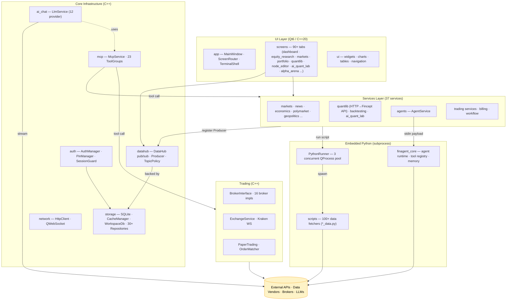
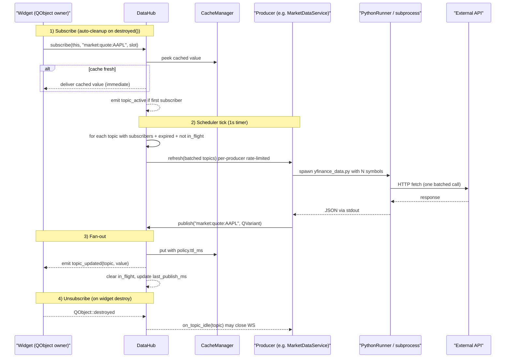
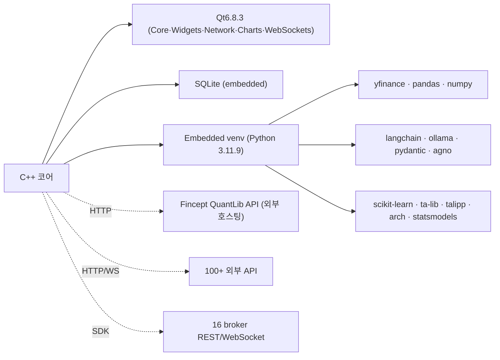
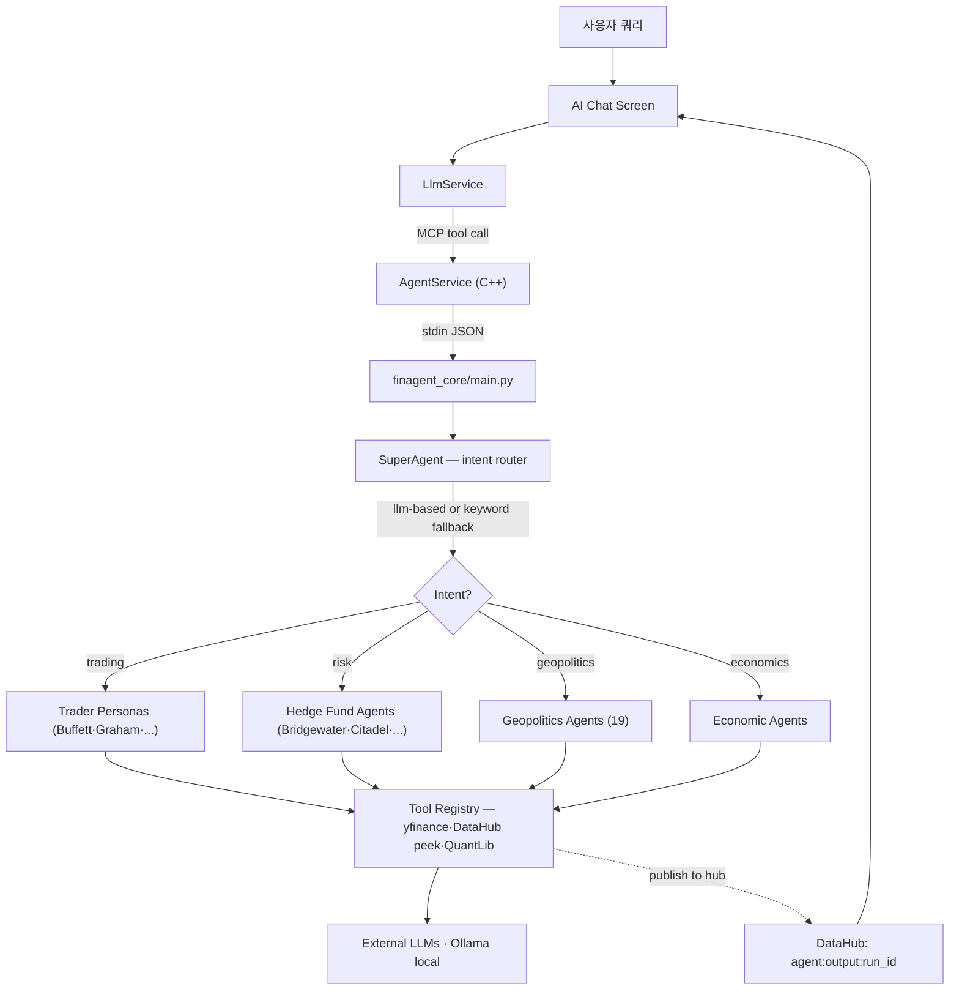
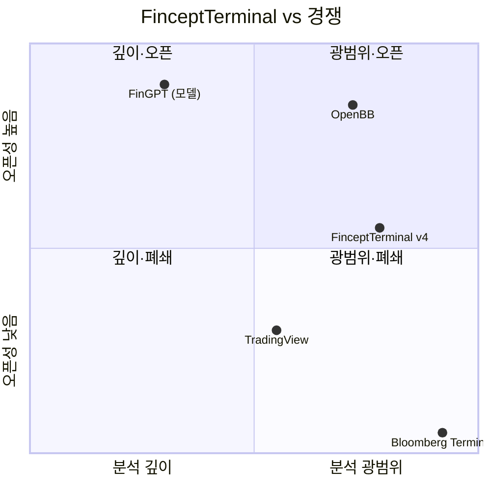

# FinceptTerminal 심층 분석 — 오픈소스 Bloomberg 대안

> Repo: [Fincept-Corporation/FinceptTerminal](https://github.com/Fincept-Corporation/FinceptTerminal)
> 분석 시점: 2026-05-06 · 분석 버전: `v4.0.2` (main 브랜치, 코드 클론 기준)
> Lines of Code: C++ ~305k LOC · Python ~425k LOC · 90+ Qt 화면 · 100+ 데이터 커넥터

---

## 1. 프로젝트 개요

**FinceptTerminal**은 Fincept Corporation(인도, 본사 델리)이 개발 중인 **Bloomberg Terminal 오픈소스 대안**이다. C++20 네이티브 데스크톱 앱(Qt6 UI) 안에 **Python을 내장**해서 분석/데이터 파이프라인을 돌리는 **하이브리드 단일 바이너리** 형태다.

| 항목 | 내용 |
|---|---|
| **해결 문제** | Bloomberg Terminal 월 $2k+ 구독 비용 · 폐쇄 데이터 · 분석 모듈 커스터마이징 불가 |
| **타깃 사용자** | 개인 트레이더/리테일 분석가, 퀀트 학습자, 대학(교육 라이선스), 인도/아시아 브로커 사용자 |
| **차별 전략** | "데이터 깊이"(100+ 커넥터)와 "분석 깊이"(QuantLib 18모듈, 37 AI 에이전트)로 경쟁 — 인사이더 데이터 경쟁은 회피 |
| **라이선스** | **AGPL-3.0 + Fincept Commercial License** dual license — 상업용은 별도 라이선스 필요. 포크에서 Fincept API를 자체 API로 갈아끼워도 라이선스 의무 유지 (강한 copyleft + 상표 보호) |
| **현재 상태** | v4.0.2(2026 Q1 릴리스) · DataHub Phase 0–10 완료(2026-04-18) · GitHub Trendshift 17028 등재 |
| **로드맵** | Q2 2026: 옵션 전략 빌더, 50+ AI 에이전트 / Q3 2026: 프로그래매틱 API, ML 학습 UI |

### 1.1 탄생 배경 (코드/문서에서 추정)

- 초기 v1–v2는 **Python + DearPyGUI** 기반 (`scripts/` 의 방대한 Python 자산이 그 흔적). v4부터 **Qt6 + C++20 네이티브로 풀 리라이트**하면서 Python을 "분석/데이터 어댑터" 역할로 격하시킴.
- 인도 시장 비중이 두드러짐 — 16개 브로커 연동 중 Zerodha, Angel One, Upstox, Fyers, Dhan, Groww, Kotak, IIFL, 5paisa, AliceBlue, Shoonya, Motilal까지 12개가 인도 브로커. 글로벌은 IBKR / Alpaca / Tradier / Saxo 4개.
- Solana pump.fun 토큰 발행 등 **커뮤니티 자금 조달 실험**이 README에 명시되어 있어, 전형적인 OSS 거버넌스와는 결이 다름.

---

## 2. 핵심 특징 및 차별점

### 2.1 한눈에 보는 기능 매트릭스

| 영역 | 기능 | 주요 모듈 |
|---|---|---|
| **분석** | DCF, 포트폴리오 최적화, VaR/Sharpe, 파생 가격결정 | `services/quantlib`, `screens/quantlib` |
| **AI 에이전트** | 37개 (전설 투자자·헤지펀드·지정학·경제) | `scripts/agents/`, `services/agents/AgentService` |
| **데이터 커넥터** | 100+ (Yahoo·Polygon·FRED·DBnomics·IMF·WB·AkShare·정부 API) | `scripts/*_data.py`, `screens/data_sources/connectors` |
| **실시간 트레이딩** | 16개 브로커 + Kraken/HyperLiquid WS 크립토 | `trading/brokers/`, `trading/exchanges/kraken` |
| **QuantLib Suite** | 18개 모듈 (옵션 가격, 변동성, 픽스드인컴) | `screens/quantlib/QuantLibScreen` |
| **Visual Workflows** | 노드 에디터 + MCP 도구 통합 | `screens/node_editor/` |
| **AI Quant Lab** | ML 모델, 팩터 디스커버리, RL 트레이딩 | `screens/ai_quant_lab/` |
| **글로벌 인텔리전스** | 해운 추적, 위성 데이터, 지정학 분석 | `screens/maritime/`, `services/geopolitics/` |

### 2.2 엔지니어 관점의 진짜 차별점

1. **DataHub** — 인-프로세스 pub/sub 데이터 레이어. v4의 가장 정교한 엔지니어링 성과로 보이며, 별도 문서(`DATAHUB_ARCHITECTURE.md` 515 LOC, `DATAHUB_PHASES.md` 378 LOC)까지 갖췄다. **벤치마킹 1순위 후보**.
2. **임베디드 파이썬 격리 구조** — UI/네트워크는 C++ Qt6, 분석/데이터 어댑터는 별도 `QProcess` 자식 프로세스로 Python 실행. 라이브러리 풍요(yfinance, pandas, scikit-learn)와 네이티브 성능을 동시에 취함.
3. **MCP 통합 1급 시민** — `src/mcp/` 안에 23개 ToolGroup이 도구로 노출되어 있어 LLM 채팅이 "터미널 자체"를 호출할 수 있다(예: `add_to_watchlist`, `place_paper_order`).
4. **라이선스 디자인** — AGPL+Commercial 듀얼 라이선스에 상표·포크 우회 방지 조항·연 $50k+ 위약금 명시. **상업적 진지함**의 신호 (= 카피캣 방어 의도).

---

## 3. 아키텍처 분석

### 3.1 전체 시스템 구조



핵심 통찰:
- **C++ 코어가 IO 오너** (HTTP·WebSocket·subprocess 호출)
- **Python은 "데이터 가져와서 JSON으로 stdout" 어댑터** — 격리된 자식 프로세스라 크래시가 메인 GUI에 전파되지 않음
- **DataHub가 모든 "데이터 상태"의 단일 진입점** — 위젯이 직접 서비스를 호출하지 않음 (D1 규칙)

### 3.2 DataHub: 가장 핵심 엔지니어링 성과

DataHub는 v4의 데이터 레이어 통합 솔루션이다. 문제 정의가 명확해서 그대로 인용한다(`DATAHUB_ARCHITECTURE.md §1`):

> 기존 `~20개 대시보드 위젯`, `MarketPanel`, `WatchlistScreen`, `PortfolioBlotter` 등이 각자 `QTimer`를 갖고 `MarketDataService::fetch_quotes(...)`를 자기 페이스로 호출 → **AAPL 같은 같은 심볼에 대해 Python 프로세스를 N번 spawn**, HTTP도 중복, "AAPL이 마지막으로 언제 갱신됐냐"에 단일 진실 원천이 없음.
>
> Goal: **(symbol, source) 한 쌍에 대해 한 번만 fetch**, 모든 구독자(markets·dashboard·watchlist·portfolio·AI chat·MCP·agents)에 단일 push 프리미티브로 fan-out.

#### 핵심 개념 4가지

| 개념 | 정의 |
|---|---|
| **Topic** | `domain:subdomain:id[:modifier]` 문자열 키. 예: `market:quote:AAPL`, `econ:fred:GDP`, `ws:kraken:BTC-USD`, `agent:hedgefund:run:42` |
| **Producer** | 토픽 패턴 셋을 소유하는 서비스. `topic_patterns()`, `refresh(topics)`, `max_requests_per_sec()`, `on_topic_idle()` 인터페이스 |
| **Subscriber** | `QObject` 라이프타임에 묶인 구독. owner 파괴 시 `destroyed()` 시그널로 자동 정리 |
| **TopicPolicy** | per-topic `ttl_ms` · `min_interval_ms` · `push_only` · `priority` · `coalesce_within_ms` |

#### 데이터 흐름



#### 코드 단위 설계 결정 (벤치마킹 포인트)

`fincept-qt/src/datahub/DataHub.h:43-326` 에서 추출:

1. **싱글톤 + 메인 스레드 거주** — `publish()`만 어떤 스레드에서도 호출 가능 (내부에서 `Qt::QueuedConnection`로 마샬링)
2. **타입 안전 구독 템플릿** — `subscribe<T>(owner, topic, void(const T&))` 가 `Q_DECLARE_METATYPE` 컴파일 타임 검증으로 `QVariant::value<T>()` 언래핑
3. **패턴 매칭** — 트레일링 `*` 와일드카드만 허용 (`market:quote:*`). prefix 인덱스를 길이 내림차순 정렬해 longest-match O(N_matching) 스캔
4. **`push_only` 정책** — WebSocket 토픽은 TTL/스케줄 무시, 프로듀서가 publish할 때만 fan-out
5. **`coalesce_within_ms`** — 점진 publish (예: 뉴스 RSS 여러 피드 도착) 합치기. Phase 5에 추가
6. **에러 fan-out 분리** — `subscribe_errors` / `subscribe_pattern_errors` 분리해서 토픽별 에러 핸들링 가능. `topic_error` 발생 시 캐시 값은 보존 (last-known-good)
7. **Force refresh** — `request(topic, force=true)` 는 `min_interval_ms`를 우회하지만 프로듀서 `max_requests_per_sec`은 여전히 적용 → 사용자 "새로고침 버튼 광클" 보호
8. **observability** — `stats()` 가 `TopicStats` 벡터(구독자 수·publish 횟수·in_flight·에러)를 반환. 개발자 모드 화면이 라이브 토픽 테이블 시각화. MCP 도구로도 노출 (DataHubTools)

---

## 4. 기술 스택

### 4.1 언어와 프레임워크 (pinned)

| 영역 | 선택 | 비고 |
|---|---|---|
| **메인 언어** | C++20 | Win10 SDK 10.0.22621, Apple Clang 15, GCC 12.3 |
| **UI** | Qt 6.8.3 | Online Installer 경유, **마이너 버전까지 핀** (`-DFINCEPT_ALLOW_QT_DRIFT=ON` 로컬 우회만 허용) |
| **분석 런타임** | Python 3.11.9 | venv + `PythonRunner`로 격리 실행 |
| **빌드** | CMake 3.27.7 + Ninja 1.11.1 | CMakePresets로 win/linux/macos × release/debug/lto 매트릭스 |
| **IDE/툴** | clangd · clang-format · clang-tidy · cppcheck | `.clang-format`, `.clang-tidy`, `.cppcheck-suppressions` 모두 체크인 |
| **DB** | SQLite | `storage/sqlite/`, 30+ 리포지토리 패턴 |
| **HTTP/WS** | `QNetworkAccessManager` · `QWebSocket` | 별도 라이브러리 의존 회피 |
| **AI 추론** | OpenAI · Anthropic · Gemini · Groq · DeepSeek · MiniMax · Kimi · OpenRouter · xAI · Ollama · Fincept own | `LlmService` 통합 |
| **MCP** | 자체 클라이언트/서버 구현 | `src/mcp/` |
| **양적 분석 백엔드** | **Fincept QuantLib API** (HTTP 서비스) | 자체 호스팅 18 모듈, `QuantLibClient` |

### 4.2 대표 의존성 그래프 (소스코드 기준)



**관찰**: Qt 의존성을 제외하면 C++ 측 외부 의존성을 거의 안 쓴다. WebSocket·HTTP·차트·DB 모두 Qt 자체로 해결 → **단일 바이너리 배포 단순성** 확보. 분석은 통째로 Python에 위임해서 라이브러리 풍요는 그쪽에서 활용.

---

## 5. 핵심 코드 분석

### 5.1 PythonRunner — C++/Python 경계 관리 (`src/python/PythonRunner.h`)

```cpp
class PythonRunner : public QObject {
    using Callback = std::function<void(PythonResult)>;
    using StreamCallback = std::function<void(QString line, bool is_stderr)>;

    void run(const QString& script, const QStringList& args,
             Callback cb, StreamCallback on_line = {});
    void run_code(const QString& code, Callback cb);

    static constexpr int DEFAULT_MAX_CONCURRENT = 3;  // QProcess pool
};
```

설계 결정:
- **동시 프로세스 3개 제한** — 메모리 폭주 방지. 큐에 적재 후 순차 spawn (`start_next()`)
- **줄 단위 스트리밍** — `\n` 도착 즉시 `on_line` 콜백, GUI 진행률 표시 가능
- **표준 환경변수 설정** — `PYTHONIOENCODING=utf-8`, `PYTHONUNBUFFERED=1`, `FINAGENT_DATA_DIR`, 자동 `PYTHONPATH` 주입
- **`extract_json(output)` 헬퍼** — 파이썬 stdout 마지막 JSON 라인/블록만 추출. 로그가 섞여도 데이터 분리 가능

벤치마킹 가치: **분석 라이브러리 다양성을 Python에 위임하면서 GUI 프로세스를 보호**하는 패턴은 한국 핀테크/투자 플랫폼이 따라하기 좋다 (예: pyfolio·zipline·QuantStats 활용).

### 5.2 LlmService — 멀티 프로바이더 LLM 추상화 (`src/ai_chat/LlmService.h`, 2426 LOC)

지원 12 프로바이더: `openai · anthropic · gemini · google · groq · deepseek · openrouter · minimax · kimi · ollama · xai · fincept`

핵심 구조:

| 영역 | 포인트 |
|---|---|
| **요청 빌더 분기** | `build_openai_request` (OpenAI 호환), `build_anthropic_request`, `build_gemini_request`, `build_fincept_request` 4종 |
| **스트리밍** | `QNetworkReply::readyRead` + 자체 SSE 파서 (`parse_sse_chunk`) |
| **Tool calling** | OpenAI 호환 + 텍스트/XML 임베디드 tool call 모두 지원 (`try_extract_and_execute_text_tool_calls`) |
| **ToolPolicy enum** | `All` / `NoNavigation` / `None` — 플로팅 채팅 버블이 화면 이동 없이 도구만 쓰도록 옵션화 |
| **Profile resolution** | `resolve_profile(context_type, context_id)` — `ai_chat`, `agent`, `team`, `team_coordinator` 별로 다른 LLM 매핑. 에이전트별로 다른 모델 강제 가능 |
| **Tool RAG** | Tier-0 advertisement 모델 — 툴 카탈로그 너무 많을 때 LLM이 `tool.list` 먼저 호출 |
| **Fincept 비동기** | Cloudflare 보호 엔드포인트 대응, `POST /research/llm/async` → `GET /research/llm/status/{id}` 폴링 |

### 5.3 AgentService + finagent_core — 멀티 에이전트 런타임

C++ 측은 얇은 facade. 실제 로직은 Python (`scripts/agents/finagent_core/`)에 있다.

**SuperAgent 라우팅** (`super_agent.py`) — LLM이 직접 인텐트 분류:

```python
LLM_ROUTER_SYSTEM_PROMPT = """You are a financial query router.
Classify into ONE intent: trading | portfolio | analysis | risk |
news | geopolitics | economics | research | general
Return JSON: {"intent": "...", "confidence": 0-1, "reasoning": "..."}"""
```

키워드 매칭 fallback도 있어 오프라인/API 키 없을 때 동작.

**Modules** (`finagent_core/modules/`):
- `compression_module.py` — 대화 압축
- `evaluation_module.py` — 응답 품질 평가
- `guardrails_module.py` — 안전 필터
- `knowledge_module.py` — RAG 지식 검색
- `memory_module.py` — 영속 메모리 (SQLite)
- `reasoning_module.py` — Chain-of-Thought
- `team_module.py` — 멀티 에이전트 협업
- `tracing_module.py` — observability
- `workflow_module.py` — DAG 워크플로

**페르소나 카탈로그** (`scripts/agents/`):
- `TraderInvestorsAgent/` — Buffett, Graham, Lynch, Munger, Klarman, Marks, ... (`agent_definitions.json` 단일 카탈로그)
- `hedgeFundAgents/` — Bridgewater, Citadel, Renaissance, Two Sigma, D.E.Shaw, Elliott, Pershing Square, AQR
- `GeopoliticsAgents/` — Grand Chessboard(Brzezinski), Prisoners of Geography(Marshall), World Order(Kissinger) 19개
- `EconomicAgents/` — 매크로 분석



설계 결정:
- **Topic으로 결과 fan-out** — `agent:output:<run_id>` 토픽에 publish 후 run 종료 시 `retire_topic()` 으로 메모리 회수 (디스포저블 토픽)
- **`max_requests_per_sec()` 0** — 에이전트 결과는 push-only (스케줄러가 깨우지 않음)
- **stdin 전달** — 큰 페이로드(`run_agent_streaming`)는 PythonRunner 대신 자체 `QProcess + stdin` 으로 처리

### 5.4 BrokerInterface — 16개 브로커 통합

추상 인터페이스 (`src/trading/BrokerInterface.h`):

```cpp
class IBroker {
    virtual BrokerProfile profile() const = 0;  // UI용 메타데이터
    virtual TokenExchangeResponse exchange_token(...) = 0;
    virtual OrderPlaceResponse place_order(creds, UnifiedOrder) = 0;
    virtual ApiResponse<QVector<BrokerPosition>> get_positions(creds) = 0;
    virtual ApiResponse<QVector<BrokerHolding>> get_holdings(creds) = 0;
    virtual ApiResponse<BrokerFunds> get_funds(creds) = 0;
    // ...
};

struct BrokerProfile {
    QString id;            // "alpaca"
    QString display_name;  // "Alpaca"
    QString region;        // "IN" | "US" | "EU"
    QString currency;
    QVector<CredentialFieldDef> credential_fields;  // ApiKey/Secret/TOTP 등
    QVector<ProductTypeDef> product_types;          // MIS/CNC/...
    bool supports_intraday;
    bool has_native_paper;
    QString default_symbol;
    QString default_exchange;
    QString brokerage_info;  // "₹20/order or 0.03%"
};
```

**핵심 패턴**:
1. **`BrokerProfile`로 UI 자동 생성** — 새 브로커 추가 시 자격 증명 필드, 거래소, 상품 타입을 메타데이터로 선언하면 UI가 자동 렌더링
2. **`UnifiedOrder` 정규화** — 16개 브로커의 주문 모델을 하나로 추상화
3. **WebSocket 별도** — `trading/websocket/AngelOneWebSocket`, `ZerodhaWebSocket` 처럼 브로커별 틱 스트림 구현, ExchangeService가 DataHub로 push-only producer로 등록

### 5.5 DataNormalizationService — 사용자 정의 데이터 매핑

매우 흥미로운 모듈 (`src/services/data_normalization/`):

- 사용자가 GUI(`screens/data_mapping/`)에서 **임의의 REST API → 표준 스키마(OHLCV 등)** 매핑 정의
- **JSONPath 추출** (`$.key`, `$[0].key`, `$[*][N]`)
- **Transform 체인**: `to_number`, `unix_ms_to_iso`, `upper`, `abs_value` 등
- 결과를 `normalized_data` 테이블에 영속화

→ "100+ 커넥터"의 비밀: 코어 커넥터(파이썬 스크립트)는 90개+, 나머지는 **사용자가 GUI로 추가**할 수 있도록 한 것. 한국 시장(KIS Open API, 키움 OpenAPI+ 등)도 사용자가 자체 추가 가능한 구조다.

### 5.6 MCP 통합 — 터미널 자체가 도구로 노출

`src/mcp/tools/` 23개 ToolGroup:

| ToolGroup | 노출하는 기능 |
|---|---|
| `MarketsTools` | 심볼 검색, 시세 조회 |
| `WatchlistTools` | 워치리스트 추가/삭제 |
| `PaperTradingTools` | 모의 주문 실행 |
| `PortfolioTools` | 포트폴리오 분석 |
| `DataHubTools` | 라이브 토픽 통계 (LLM이 시스템 상태 점검 가능) |
| `DataSourcesTools` | 데이터 소스 설정 조회/변경 |
| `EdgarTools` | SEC EDGAR 직접 쿼리 |
| `NavigationTools` | 화면 전환 (LLM이 사용자 대신 탭 변경) |
| `PythonTools` | 임의 Python 코드 실행 (sandbox 없음 — 신뢰 모델 주의) |
| `MAAnalyticsTools` | M&A 분석 |
| `NotesTools`, `ForumTools`, `ReportBuilderTools` | 노트/포럼/리포트 빌더 |
| `MetaTools` | "MCP 자체 디스커버리" — Tier-0 어드버타이즈먼트용 |
| ... | |

→ **Cursor·Claude Desktop 같은 외부 LLM이 FinceptTerminal을 도구로 호출** 가능.

---

## 6. API 및 인터페이스

### 6.1 토픽 키 컨벤션 (DataHub의 공개 계약)

```
domain : subdomain : id [: modifier]

market:quote:AAPL
market:history:AAPL:1y:1d
market:sparkline:TSLA
news:general
news:symbol:NVDA
econ:fred:GDP
econ:dbnomics:IMF/IFS/USA.PCPI_IX.Q
ws:kraken:BTC-USD
ws:hyperliquid:ETH
broker:zerodha:positions
broker:angelone:orders
geopolitics:hdx:conflicts
agent:hedgefund:run:42
```

규칙: 소문자 · 콜론 구분 · 공백 금지 · 트레일링 `*` 와일드카드만 구독에서 허용.

### 6.2 Producer 인터페이스 (확장 포인트)

```cpp
class Producer {
    virtual QStringList topic_patterns() const = 0;
    virtual void refresh(const QStringList& topics) = 0;
    virtual int max_requests_per_sec() const { return 0; }
    virtual void on_topic_idle(const QString&) {}
};
```

신규 데이터 소스 추가 절차:
1. 서비스 클래스가 `Producer` 상속
2. `topic_patterns()` 에 자기 패턴 선언 (예: `kis:quote:*`)
3. `refresh(topics)` 에서 batch fetch + `hub.publish()`
4. Rate limit이 있으면 `max_requests_per_sec()` override
5. `set_policy_pattern()` 으로 TTL/min_interval 설정
6. 시작 시 `register_producer(this)`

### 6.3 외부 호스팅 API: Fincept QuantLib API

`QuantLibClient::API_BASE` 가 가리키는 외부 HTTP 서비스 — Quantitative analytics 18 모듈을 SaaS로 호스팅. 클라이언트가 `call(endpoint, body, callback)` 으로 호출.

→ 오픈소스인데 **분석 핵심부는 외부 API 의존**이라는 점이 중요. 라이선스가 "포크해서 자체 API로 갈아끼워도 라이선스 의무 지속"이라고 명시한 이유와 직결.

### 6.4 CLI 진입점 (Python측)

`finagent_core/main.py` — JSON stdin 페이로드 디스패치 모드:

```python
# C++가 보내는 액션 예
{"action": "discover_agents"}
{"action": "run_agent", "query": "...", "config": {...}}
{"action": "store_memory", "content": "...", "memory_type": "general"}
{"action": "search_knowledge", "query": "...", "limit": 10}
```

표준 출력은 JSON, 로그는 stderr (스트림 분리).

---

## 7. 확장성 및 플러그인

| 확장 유형 | 추가 위치 | 추가 방식 |
|---|---|---|
| **신규 화면** | `src/screens/<name>/` | `IStatefulScreen` 상속 + `ScreenRouter` 등록 |
| **신규 데이터 커넥터 (코드)** | `scripts/<name>_data.py` + Producer 클래스 | `Producer` 인터페이스 + DataMappingRepository 등록 |
| **신규 데이터 커넥터 (GUI)** | `screens/data_mapping/DataMappingScreen` | JSONPath + Transform 매핑 정의, DB에 저장 |
| **신규 브로커** | `src/trading/brokers/<name>/` | `IBroker` 상속 + `BrokerProfile` 메타데이터 + `BrokerRegistry` 등록 |
| **신규 AI 에이전트** | `scripts/agents/finagent_core/configs/<agent>.json` | JSON 페르소나 정의 (system prompt, tools, model 매핑) |
| **신규 MCP 도구** | `src/mcp/tools/<Name>Tools.cpp` | `McpProvider` 등록 |
| **신규 LLM 프로바이더** | `src/ai_chat/LlmService.cpp` | `build_*_request` 추가 + `provider_supports_streaming` 분기 |
| **신규 노드 (워크플로)** | `src/screens/node_editor/palette/` | 노드 정의 + 입출력 포트 |

설계 신호: 거의 모든 확장이 **선언적(메타데이터/JSON) 또는 인터페이스 상속**으로 처리되어 **fork-and-add 친화적**. 단, 빌드는 단일 바이너리이므로 동적 플러그인 시스템(.so/.dll 로딩)은 없다 (라이선스 의도와도 일치 — 동적 로딩이 있으면 우회 쉬워짐).

---

## 8. 성능 특성

### 8.1 DataHub 도입 전후 효과 (문서 기반)

| 메트릭 | 전 (per-widget timer) | 후 (DataHub) |
|---|---|---|
| 같은 심볼 동시 fetch | N (위젯 수만큼 중복) | 1 |
| Python 프로세스 spawn | N | 1 (배치) |
| 위젯 `QTimer` 갯수 | 20+ | **0** (모두 제거) |
| 탭 전환 응답성 | blocking fetch | 캐시 즉시 표시 |
| WebSocket 연결 | 화면별로 따로 | 화면당 1개, fan-out |

**성공 기준** (`§16`):
- 30초 동안 같은 심볼에 대한 Python 중복 spawn 0건
- Phase 2 이후 위젯에 데이터-리프레시 `QTimer` 0개
- WebSocket 1 connection → N subscribers
- `hub.stats()` 가 화면에 보이는 구독자 수와 일치

### 8.2 알려진 제약

- **Python 동시 프로세스 3개 제한** — 무거운 ML 워크로드는 큐 대기. AI Quant Lab의 백테스트는 별도 프로세스 풀 운영
- **Qt GUI 단일 스레드** — 모든 슬롯이 메인 스레드 → 무거운 계산은 `QtConcurrent::run` 또는 별도 worker
- **LlmService 스트리밍** — 백그라운드 스레드에서 실행, on_chunk 콜백이 그 스레드에서 호출. UI 업데이트는 시그널 마샬링 필요
- **외부 QuantLib API 의존** — 오프라인 모드에서는 양적 분석 일부 동작 안 함

---

## 9. 배포 및 운영

### 9.1 빌드 매트릭스

```
├── win-release       (MSVC 19.38, Ninja, /O2 /Ob1, incremental link)
├── win-fast          (RelWithDebInfo, no LTO — daily dev)
├── win-release-lto   (/GL + /LTCG, ship 전용 30–90s 링크)
├── win-debug
├── linux-release     (GCC 12.3)
├── linux-debug
├── macos-release     (Apple Clang 15, deploy 13.0+)
└── macos-debug
```

CMake 3.27.7 + Ninja 1.11.1 핀, **버전 드리프트 차단** (`-DFINCEPT_ALLOW_QT_DRIFT=ON` 로컬 우회만).

### 9.2 배포 형태

| 플랫폼 | 산출물 | 설치 방식 |
|---|---|---|
| Windows x64 | `FinceptTerminal-4.0.2-windows-x64-setup.exe` | 인스톨러 |
| Linux x64 | `FinceptTerminal-4.0.2-linux-x64-setup.run` | shell 인스톨러 |
| macOS arm64 | `FinceptTerminal-4.0.2-macos-arm64-setup.dmg` | DMG → Applications drag |

**Docker** — CI/CD 전용. Linux + X11 forward만 지원 (`docker run -e DISPLAY=$DISPLAY`).

### 9.3 인프라 요구

- 클라이언트: 단일 데스크톱 바이너리 (Electron 없음 → 메모리 풋프린트 작음)
- 서버: 본인 운영 시 **Fincept QuantLib API**(외부) 의존 또는 자체 호스팅 필요. LLM은 사용자 자기 키
- 인증: PIN 기반 + Inactivity guard, SecurityAuditLog
- 데이터 영속: SQLite (사용자 머신 내) + WorkspaceDb 스냅샷 링 (크래시 복구)

---

## 10. 경쟁·비교 분석

### 10.1 같은 카테고리 핵심 비교표

| 항목 | **FinceptTerminal v4** | **OpenBB** | **Bloomberg Terminal** | **TradingView** |
|---|---|---|---|---|
| 라이선스 | AGPL-3.0 + Commercial | AGPL-3.0 | 폐쇄, 월 ~$2k | SaaS, 부분 무료 |
| 아키텍처 | C++20 + Qt6 + 임베디드 Python (단일 바이너리) | Python core + Workspace 웹/Excel/MCP/REST | 폐쇄 클라이언트 | 웹 SaaS |
| 데이터 커넥터 | 100+ (사용자 추가 가능 GUI) | 100+ ("connect once, use everywhere") | 자체 글로벌 데이터 | 자체 + 브로커 통합 |
| AI 에이전트 | 37개 (페르소나 카탈로그) + MCP | OpenBB Copilot (LLM 채팅) | 폐쇄 AI | Pine Script + AI 보조 |
| 트레이딩 | 16 broker + 크립토 WS | 본인 직접 X (분석 위주) | 자체 OMS | 다수 broker 연동 |
| 양적 분석 | 18 QuantLib 모듈 (외부 API) | 본격 분석은 Python 노트북 | 강력한 자체 모델 | 차트 중심 |
| 배포 형태 | 데스크톱 단일 바이너리 | 데스크톱·웹·Excel·API · MCP | 데스크톱 + 웹 | 웹 + 모바일 |
| 무료 사용 범위 | 개인·학습·학술만 (강한 제한) | 모든 비상업 + 상당수 상업 | 없음 | 무료 plan 존재 |
| 한국 시장 | 한국 브로커/지수 미지원 (사용자가 DataMapping으로 추가 가능) | 미지원 | 지원 | 한국 거래소 일부 지원 |

### 10.2 FinAgent / FinGPT 류와 비교 (AI 코어만)

| 측면 | FinceptTerminal | FinGPT/FinAgent (학술/연구) |
|---|---|---|
| **목표** | 종합 터미널의 "한 기능"으로서 AI | AI 자체가 메인 (모델·파인튜닝·평가) |
| **에이전트 개수** | 37개 페르소나 (정성적) | 적지만 모델 fine-tuning 깊이 |
| **분석 도구** | DataHub·QuantLib·100+ 커넥터를 도구로 노출 | 주로 자체 데이터셋 + Hugging Face |
| **상업화** | 단일 제품으로 판매 | 라이브러리/모델로 배포 |

→ FinceptTerminal의 강점은 "**툴 풍부함**" (MCP로 23개 도구 노출), 약점은 "**모델/평가의 깊이**" 부족.

### 10.3 강점·약점 한눈에



---

## 11. 종합 평가 — 한국 핀테크 플랫폼 관점에서 배울 점

### 11.1 **벤치마킹 1순위: DataHub 패턴**

> 한국에서 KIS·키움·NH투자·미래에셋 등 여러 브로커, 그리고 야후·네이버·KRX 여러 데이터 소스를 통합하면서 "**같은 종목 시세를 5개 위젯이 각자 폴링**"하는 문제는 사실상 모든 투자 플랫폼이 마주친다.
>
> 차용 가능한 설계 결정:
> 1. **`domain:subdomain:id` 토픽 키 표준화** — 변경에 강한 공개 계약
> 2. **QObject(혹은 React 컴포넌트) 라이프타임 = 구독 라이프타임** — destroy 시 자동 정리
> 3. **`TopicPolicy` 분리** (TTL · min_interval · push_only · coalesce) — 정책을 데이터/코드 분리
> 4. **Producer 인터페이스 표준화** — `topic_patterns()`, `refresh()`, `max_requests_per_sec()` 만 정의
> 5. **`force=true` 옵션** — 사용자 수동 새로고침은 min_interval 우회, rate limit은 보존
> 6. **`coalesce_within_ms`** — 점진 publish 합치기 (예: 뉴스 RSS, 부분 결과)
> 7. **`hub.stats()` 라이브 인스펙터** — 대시보드 통째로 조명
>
> Web 환경이라면 RxJS BehaviorSubject 또는 Zustand 슬라이스, 서버라면 Redis Pub/Sub + per-topic policy 어댑터로 그대로 옮겨갈 수 있다.

### 11.2 **벤치마킹 2순위: 임베디드 Python 패턴**

- C++/Rust/Go 코어 + **자식 프로세스로 Python 분석 스크립트** 실행
- stdout = JSON 데이터, stderr = 로그 분리
- 동시 프로세스 풀로 메모리 폭주 방지
- 환경변수 표준화로 실행 컨텍스트 통일

→ 한국에서도 pyfolio·QuantStats·talipp 같은 풍부한 Python 라이브러리를 메인 GUI(예: Electron, Tauri)에 안전하게 결합 가능.

### 11.3 **벤치마킹 3순위: 사용자 정의 데이터 매핑 GUI**

- "코드 없이 새 API 연결" — JSONPath + Transform 체인 + 스키마 검증
- 100+ 커넥터의 절반 이상을 **사용자가 GUI로 추가**할 수 있게 한 것이 차별
- 한국 핀테크에서 KIS Open API, KB증권, 토스 페이먼츠 등 다양한 외부 API를 "**바이너리 빌드 없이**" 통합하는 패턴으로 직접 적용 가능

### 11.4 **벤치마킹 4순위: BrokerProfile 메타데이터로 UI 자동 생성**

- 새 브로커 추가 시 자격증명 필드·상품 타입·기본 거래소를 **선언만** 하면 UI 자동 렌더링
- 한국에서 5+ 증권사 통합 시 **반복적인 주문 폼/계정 폼 분산**을 막는 가장 단순한 패턴

### 11.5 **약점/리스크 (피해야 할 점)**

| 항목 | 우려 |
|---|---|
| **AGPL+Commercial 라이선스의 전염성** | "파일 단 한 줄이라도 derivative work"로 해석되어 한국 핀테크 회사가 사용 시 법무 리스크. 코드 차용은 **벤치마킹·아이디어 수준**에서 멈출 것 |
| **외부 호스팅 QuantLib API 의존** | 오프라인 동작 불가. 자체 플랫폼 만들 때는 핵심 분석을 자체 호스팅하거나 클라이언트 측 라이브러리(QuantLib C++ FOSS, py-quantlib)로 대체 권장 |
| **Python 자식 프로세스 spawn 비용** | 시작당 수백 ms. 빈번한 호출은 데몬화/persistent worker로 변경 필요 |
| **MCP `PythonTools` 임의 코드 실행** | 샌드박스 없음 — LLM이 위험한 코드 실행 가능. 프로덕션에서는 격리 컨테이너 필수 |
| **테스트/관측 코드 비중** | 코어 비즈니스 LOC 대비 통합 테스트 도큐먼트는 적음. 한국 핀테크에서는 자본시장법·금융감독원 가이드라인상 더 강한 audit log 필요 |
| **인도 시장 편향** | 16개 브로커 중 12개가 인도. 글로벌 적용 시 KR/JP/EU 브로커 추가 부담 |
| **단일 바이너리 → 동적 플러그인 없음** | 서드파티가 코어 빌드 없이 기능 추가 불가. 한국 핀테크가 화이트라벨 운영 시 빌드 파이프라인 부담 |

### 11.6 **적합/부적합 사례**

| 적합 | 부적합 |
|---|---|
| 개인 트레이더용 SaaS의 **분석 모듈 설계 참고** | **그대로 임베드해서 상업 제품화** (라이선스 위반) |
| 멀티-브로커 통합 플랫폼의 **추상화 패턴 차용** | 인도 외 시장에 그대로 운영 (브로커 커버리지 한계) |
| Pub/Sub 데이터 레이어 **설계 레퍼런스** | 동시 사용자 수천 단위 멀티테넌시 (인-프로세스 hub은 단일 사용자 가정) |
| 멀티 LLM/멀티 에이전트 **오케스트레이션 패턴** | 학술적 모델 평가 (FinGPT/FinRL이 더 적합) |

### 11.7 결론

FinceptTerminal v4는 "**Bloomberg을 1/100 비용으로**"라는 마케팅 카피와 별개로, 엔지니어링 관점에서 다음 4가지가 **명확한 학습 가치**가 있다:

1. **DataHub 인-프로세스 pub/sub** — pub/sub의 미들웨어를 도입하지 않고도 토픽/구독자/프로듀서/정책 모델을 코드 단위로 깔끔하게 푸는 레퍼런스
2. **C++ + 임베디드 Python 듀얼 런타임 격리** — GUI 안정성과 분석 라이브러리 풍요를 동시에 잡는 전형적 패턴
3. **메타데이터-드리븐 확장점** (BrokerProfile, DataMapping, Agent JSON) — fork-and-add 친화적 설계
4. **MCP 1급 시민 통합** — 터미널 자체가 LLM 도구로 노출되는 구조 (Cursor·Claude Desktop·외부 에이전트가 그대로 활용)

라이선스(AGPL+Commercial)와 인도 시장 편향, 외부 API 의존성 때문에 **"그대로 가져다 쓰는" 대상은 아니다**. 대신 위 4가지 패턴을 자체 코드베이스로 옮기고, **한국 시장 데이터 어댑터·브로커**를 자체 구현하는 방향이 가장 합리적이다.

---

## 부록 A — 분석 대상 디렉토리 맵

```
fincept-qt/
├── CMakeLists.txt (124KB)        # 거대한 단일 빌드 파일
├── CMakePresets.json             # 8개 빌드 프리셋
├── DATAHUB_ARCHITECTURE.md       # ★ DataHub 설계 문서
├── DATAHUB_PHASES.md             # DataHub 마이그레이션 phase 0–10
├── src/
│   ├── app/                      # MainWindow · ScreenRouter · TerminalShell
│   ├── core/                     # 21개 코어 인프라 (config, events, logging, session...)
│   ├── ui/                       # 재사용 위젯
│   ├── datahub/                  # ★ pub/sub
│   ├── network/                  # http/, websocket/
│   ├── auth/                     # AuthManager · PinManager · SessionGuard
│   ├── storage/                  # SQLite · 30+ Repositories · CacheManager · Workspace
│   ├── python/                   # PythonRunner · PythonWorker · SetupManager
│   ├── ai_chat/                  # LlmService (12 provider) · ModelCatalog
│   ├── mcp/                      # MCP client/server · 23 ToolGroups
│   ├── trading/                  # IBroker · 16 broker impls · Kraken WS · PaperTrading
│   ├── services/                 # 37 services (markets, news, agents, quantlib, ...)
│   └── screens/                  # 90+ 화면 (dashboard, equity_research, quantlib, ...)
├── scripts/                      # 100+ Python 데이터/에이전트 스크립트
│   ├── *_data.py                 # 230개 데이터 커넥터
│   ├── agents/                   # finagent_core + 37 에이전트 페르소나
│   ├── strategies/               # 백테스트 알고리즘 (QuantConnect 호환 패턴)
│   ├── algo_trading/, alpha_arena/, ai_quant_lab/, ...
└── tests/                        # datahub/ + mcp/
```

## 부록 B — 라이선스 주의사항 (한국 회사 관점)

> ⚠️ FinceptTerminal의 코드를 **벤치마킹 이상**으로 활용할 경우:
> - **AGPL-3.0** 적용 → 제품 전체가 AGPL 전염 (네트워크 서비스도 소스 공개 의무)
> - **Fincept Commercial License** 별도 구매 필요 (회사·스타트업·헤지펀드·SaaS 포함)
> - 포크 후 Fincept API를 자체 API로 갈아끼워도 **라이선스 의무 유지**
> - 위약금 USD $50k+/년/조직, 인도 델리 전속 관할
> - **결론**: 코드 차용 금지, 아키텍처/패턴 학습만 권장

## 부록 C — 참고 자료

- 공식 GitHub: [Fincept-Corporation/FinceptTerminal](https://github.com/Fincept-Corporation/FinceptTerminal)
- 공식 사이트: [fincept.in](https://fincept.in/)
- DataHub 아키텍처 문서: `fincept-qt/DATAHUB_ARCHITECTURE.md` (515 LOC)
- DataHub Phase 로드맵: `fincept-qt/DATAHUB_PHASES.md` (378 LOC)
- 데이터 소스 카탈로그: `scripts/MARKET_DATA_SOURCES.md`, `ECONOMIC_DATA_SOURCES.md`, `GOVERNMENT_DATA_SOURCES.md`, `CHINA_DATA_SOURCES.md`, `REGIONAL_DATA_SOURCES.md`, `SATELLITE_GEO_DATA_SOURCES.md`, `SPECIALTY_DATA_SOURCES.md`, `US_FINANCIAL_DATA_SOURCES.md`
- AI Agents 문서: `scripts/agents/README.md`
- 비교 대상: [OpenBB](https://github.com/OpenBB-finance/OpenBB) · OpenBB Workspace · Terminal Pro
- v4.0.2 릴리스: [GitHub Releases](https://github.com/Fincept-Corporation/FinceptTerminal/releases)
