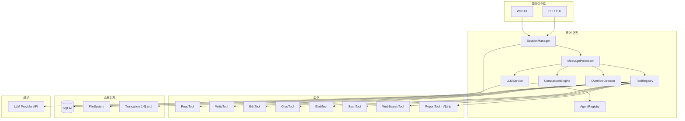
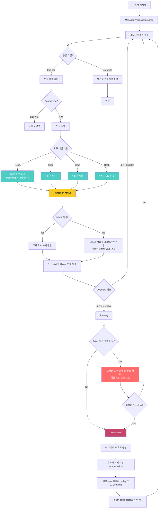

# OpenCode Python 구현 명세서 — 마크다운 보고서 AI 에디터

> 이 문서는 OpenCode(TypeScript)의 핵심 에이전트 메커니즘을 Python으로 재구현하기 위한 기술 명세다.
> 마크다운 보고서 편집에 특화된 에이전트를 목표로 하되, OpenCode의 컨텍스트 관리, 도구 시스템, 세션 관리 아키텍처를 그대로 가져간다.

---

## 1. 전체 아키텍처

### 1.1 시스템 개요



### 1.2 핵심 설계 원칙

1. **계층형 컨텍스트 방어**: 도구 레벨 → Truncation → Pruning → Overflow 감지 → Compaction 순서로, 비용이 낮은 처리를 먼저 적용
2. **부분 읽기(Partial Read)**: 파일을 전체 로드하지 않고 스트림/오프셋 기반으로 필요한 부분만 읽기
3. **도구 출력 제한**: 모든 도구 출력에 일관된 크기 제한 적용
4. **소프트 삭제**: Pruning 시 데이터를 DB에서 삭제하지 않고 플래그만 설정

### 1.3 Python 기술 스택 (권장)

| 영역 | 권장 라이브러리 | OpenCode 대응 |
|------|----------------|--------------|
| LLM 통합 | `litellm` 또는 `openai` SDK | Vercel AI SDK |
| DB/ORM | `sqlalchemy` + `aiosqlite` | Drizzle ORM + SQLite |
| 스키마 검증 | `pydantic` v2 | Zod |
| CLI/TUI | `textual` 또는 `rich` + `click` | OpenTUI + Solid.js |
| 파일 감시 | `watchdog` | Chokidar |
| 코드 검색 | `subprocess`로 `ripgrep` 호출 | ripgrep 통합 |
| 설정 | `pydantic-settings` + TOML/JSON | JSONC config |
| 비동기 | `asyncio` | Effect.js |
| 웹서버 | `FastAPI` | Hono |
| 이벤트 버스 | `blinker` 또는 커스텀 pub/sub | Effect PubSub |

---

## 2. 데이터 모델

### 2.1 DB 스키마 (SQLAlchemy 기준)

```python
"""
models.py — 전체 DB 스키마
OpenCode의 Drizzle ORM 스키마를 Python SQLAlchemy로 1:1 변환
"""
from sqlalchemy import (
    Column, String, Integer, Float, Text, ForeignKey,
    Index, UniqueConstraint, create_engine, JSON
)
from sqlalchemy.orm import declarative_base, relationship
import time
import ulid  # ID 생성용

Base = declarative_base()


def generate_id(prefix: str = "") -> str:
    """ULID 기반 정렬 가능한 ID 생성 (OpenCode의 ascending ID 패턴)"""
    return f"{prefix}_{ulid.new().str}" if prefix else ulid.new().str


class Project(Base):
    """프로젝트 (보고서 작업 공간) 메타데이터"""
    __tablename__ = "project"

    id = Column(String, primary_key=True, default=lambda: generate_id("proj"))
    worktree = Column(String, nullable=False)    # 프로젝트 루트 경로
    name = Column(String)
    vcs = Column(String)                          # "git" 또는 None

    time_created = Column(Integer, nullable=False, default=lambda: int(time.time() * 1000))
    time_updated = Column(Integer, nullable=False, default=lambda: int(time.time() * 1000),
                          onupdate=lambda: int(time.time() * 1000))

    sessions = relationship("Session", back_populates="project", cascade="all, delete-orphan")


class Session(Base):
    """대화 세션 — 하나의 보고서 작성/편집 작업 단위"""
    __tablename__ = "session"

    id = Column(String, primary_key=True, default=lambda: generate_id("sess"))
    project_id = Column(String, ForeignKey("project.id", ondelete="CASCADE"), nullable=False)
    parent_id = Column(String, ForeignKey("session.id"), nullable=True)  # 포크용 자기참조

    slug = Column(String, nullable=False)
    directory = Column(String, nullable=False)
    title = Column(String, nullable=False)
    version = Column(String, nullable=False, default="1")

    # 보고서 변경 요약
    summary_additions = Column(Integer)
    summary_deletions = Column(Integer)
    summary_files = Column(Integer)
    summary_diffs = Column(JSON)     # List[FileDiff]

    # 권한 규칙 (JSON으로 저장)
    permission = Column(JSON)        # PermissionRuleset

    time_created = Column(Integer, nullable=False, default=lambda: int(time.time() * 1000))
    time_updated = Column(Integer, nullable=False, default=lambda: int(time.time() * 1000))
    time_compacting = Column(Integer)  # 컴팩션 진행 중 타임스탬프
    time_archived = Column(Integer)

    project = relationship("Project", back_populates="sessions")
    messages = relationship("Message", back_populates="session", cascade="all, delete-orphan")

    __table_args__ = (
        Index("session_project_idx", "project_id"),
        Index("session_parent_idx", "parent_id"),
    )


class Message(Base):
    """메시지 — user 또는 assistant 단위"""
    __tablename__ = "message"

    id = Column(String, primary_key=True, default=lambda: generate_id("msg"))
    session_id = Column(String, ForeignKey("session.id", ondelete="CASCADE"), nullable=False)

    # 메시지 메타데이터 전체를 JSON으로 저장 (OpenCode 패턴)
    data = Column(JSON, nullable=False)
    # data 구조:
    # {
    #     "role": "user" | "assistant",
    #     "agent": "build" | "plan" | ...,
    #     "model": {"provider_id": "...", "model_id": "..."},
    #     "cost": 0.0,
    #     "tokens": {"input": 0, "output": 0, "reasoning": 0,
    #                "cache": {"read": 0, "write": 0}},
    #     "summary": false,      # compaction 요약 메시지인지
    #     "finish": "completed" | "error" | None,
    #     "error": {...} | None,
    # }

    time_created = Column(Integer, nullable=False, default=lambda: int(time.time() * 1000))
    time_updated = Column(Integer, nullable=False, default=lambda: int(time.time() * 1000))

    session = relationship("Session", back_populates="messages")
    parts = relationship("Part", back_populates="message", cascade="all, delete-orphan")

    __table_args__ = (
        Index("message_session_time_id_idx", "session_id", "time_created", "id"),
    )


class Part(Base):
    """메시지 파트 — 텍스트, 도구 호출, 도구 결과, 추론 등"""
    __tablename__ = "part"

    id = Column(String, primary_key=True, default=lambda: generate_id("part"))
    message_id = Column(String, ForeignKey("message.id", ondelete="CASCADE"), nullable=False)
    session_id = Column(String, nullable=False)  # 비정규화 — JOIN 없이 세션별 조회

    # 파트 데이터 전체를 JSON으로 저장
    data = Column(JSON, nullable=False)
    # data 구조 (type에 따라 다름):
    #
    # type="text":
    #   {"type": "text", "text": "...", "synthetic": false}
    #
    # type="tool":
    #   {"type": "tool", "tool": "read", "args": {...},
    #    "state": {
    #        "status": "pending" | "running" | "completed" | "error",
    #        "output": "...",
    #        "title": "...",
    #        "metadata": {...},
    #        "time": {"start": ..., "end": ..., "compacted": ... | None}
    #    }}
    #
    # type="step-finish":
    #   {"type": "step-finish",
    #    "tokens": {"input": .., "output": .., "reasoning": ..,
    #               "cache": {"read": .., "write": ..}},
    #    "cost": 0.0,
    #    "finish": "completed"}
    #
    # type="compaction":
    #   {"type": "compaction", "auto": true, "overflow": false}

    time_created = Column(Integer, nullable=False, default=lambda: int(time.time() * 1000))
    time_updated = Column(Integer, nullable=False, default=lambda: int(time.time() * 1000))

    message = relationship("Message", back_populates="parts")

    __table_args__ = (
        Index("part_message_id_idx", "message_id", "id"),
        Index("part_session_idx", "session_id"),
    )
```

### 2.2 Pydantic 모델 (런타임 데이터)

```python
"""
schemas.py — 런타임 데이터 모델
"""
from pydantic import BaseModel, Field
from typing import Optional, Literal, Any
from enum import Enum


# ── 토큰/비용 ──

class CacheTokens(BaseModel):
    read: int = 0
    write: int = 0

class TokenUsage(BaseModel):
    input: int = 0
    output: int = 0
    reasoning: int = 0
    cache: CacheTokens = Field(default_factory=CacheTokens)
    total: Optional[int] = None

    @property
    def computed_total(self) -> int:
        if self.total is not None:
            return self.total
        return self.input + self.output + self.cache.read + self.cache.write


# ── 메시지 ──

class MessageRole(str, Enum):
    USER = "user"
    ASSISTANT = "assistant"

class ModelRef(BaseModel):
    provider_id: str
    model_id: str

class MessageInfo(BaseModel):
    role: MessageRole
    agent: str = "build"
    model: ModelRef
    cost: float = 0.0
    tokens: TokenUsage = Field(default_factory=TokenUsage)
    summary: bool = False               # compaction 요약 여부
    finish: Optional[str] = None        # "completed" | "error"
    error: Optional[dict] = None
    variant: Optional[str] = None


# ── 파트 ──

class ToolState(BaseModel):
    status: Literal["pending", "running", "completed", "error"] = "pending"
    output: str = ""
    title: str = ""
    metadata: dict = Field(default_factory=dict)
    time: dict = Field(default_factory=lambda: {"start": None, "end": None, "compacted": None})

class TextPart(BaseModel):
    type: Literal["text"] = "text"
    text: str
    synthetic: bool = False

class ToolPart(BaseModel):
    type: Literal["tool"] = "tool"
    tool: str                            # 도구 이름
    call_id: str                         # 도구 호출 ID
    args: dict = Field(default_factory=dict)
    state: ToolState = Field(default_factory=ToolState)

class StepFinishPart(BaseModel):
    type: Literal["step-finish"] = "step-finish"
    tokens: TokenUsage
    cost: float = 0.0
    finish: str = "completed"

class CompactionPart(BaseModel):
    type: Literal["compaction"] = "compaction"
    auto: bool = True
    overflow: bool = False

# Union 타입
PartData = TextPart | ToolPart | StepFinishPart | CompactionPart


# ── 에이전트 ──

class PermissionStrategy(str, Enum):
    ALLOW = "allow"
    DENY = "deny"
    ASK = "ask"

class PermissionRule(BaseModel):
    pattern: str                         # glob 패턴
    strategy: PermissionStrategy

class PermissionRuleset(BaseModel):
    file_read: list[PermissionRule] = Field(default_factory=list)
    file_write: list[PermissionRule] = Field(default_factory=list)
    bash: list[PermissionRule] = Field(default_factory=list)
    external_directory: list[PermissionRule] = Field(default_factory=list)

class AgentConfig(BaseModel):
    name: str
    model: Optional[ModelRef] = None
    temperature: Optional[float] = None
    top_p: Optional[float] = None
    permission: PermissionRuleset = Field(default_factory=PermissionRuleset)
    mode: Literal["primary", "subagent"] = "primary"
    system_prompt: str = ""


# ── 설정 ──

class CompactionConfig(BaseModel):
    auto: bool = True
    prune: bool = True
    reserved: Optional[int] = None       # 기본 20_000 토큰

class Config(BaseModel):
    providers: dict[str, dict] = Field(default_factory=dict)
    agents: dict[str, AgentConfig] = Field(default_factory=dict)
    compaction: CompactionConfig = Field(default_factory=CompactionConfig)
    experimental: dict = Field(default_factory=dict)


# ── 도구 결과 ──

class ToolResult(BaseModel):
    title: str = ""
    output: str = ""
    metadata: dict = Field(default_factory=dict)
    error: Optional[str] = None
```

---

## 3. 도구 시스템

### 3.1 도구 인터페이스

```python
"""
tool/base.py — 도구 기본 인터페이스
"""
from abc import ABC, abstractmethod
from pydantic import BaseModel
from typing import Optional, Any
from schemas import ToolResult


class ToolContext:
    """도구 실행 컨텍스트 — 모든 도구에 전달"""
    def __init__(
        self,
        session_id: str,
        message_id: str,
        call_id: str,
        messages: list[dict],           # 대화 이력 (LLM 메시지 포맷)
        abort_signal: Optional[Any] = None,
    ):
        self.session_id = session_id
        self.message_id = message_id
        self.call_id = call_id
        self.messages = messages
        self.abort_signal = abort_signal
        self._metadata: dict = {}

    def add_metadata(self, key: str, value: Any):
        self._metadata[key] = value

    async def ask_permission(self, question: str) -> bool:
        """사용자에게 권한 확인 요청 (TUI/Web에서 구현)"""
        raise NotImplementedError


class BaseTool(ABC):
    """모든 도구의 기본 클래스"""
    name: str
    description: str
    parameters_schema: dict              # JSON Schema (LLM에 전달)

    @abstractmethod
    async def execute(self, args: dict, ctx: ToolContext) -> ToolResult:
        """도구 실행 — 반드시 ToolResult 반환"""
        ...
```

### 3.2 Read 도구 — 부분 읽기 구현

```python
"""
tool/read.py — 파일 부분 읽기 도구

핵심 설계:
- 파일을 전체 로드하지 않고 스트림으로 줄 단위 읽기
- 이중 제한: 2000줄 OR 50KB 중 먼저 도달하는 쪽에서 중단
- offset/limit으로 페이지네이션
- 줄당 2000자 초과 시 잘림
"""
import os
import aiofiles
from tool.base import BaseTool, ToolContext
from schemas import ToolResult

# ── 상수 (OpenCode read.ts 기준) ──
DEFAULT_READ_LIMIT = 2000        # 한 번에 최대 줄 수
MAX_LINE_LENGTH = 2000           # 줄당 최대 문자 수
MAX_BYTES = 50 * 1024            # 한 번에 최대 바이트 (50KB)


class ReadTool(BaseTool):
    name = "read"
    description = """파일 또는 디렉토리를 읽습니다.
- 파일: offset(1-indexed)과 limit로 특정 구간만 읽을 수 있습니다.
- 디렉토리: 항목 목록을 반환합니다.
- 기본 2000줄 또는 50KB까지만 읽습니다. 더 필요하면 offset을 지정하세요."""

    parameters_schema = {
        "type": "object",
        "properties": {
            "file_path": {
                "type": "string",
                "description": "읽을 파일 또는 디렉토리의 절대 경로"
            },
            "offset": {
                "type": "integer",
                "description": "읽기 시작 줄 번호 (1-indexed, 기본값 1)"
            },
            "limit": {
                "type": "integer",
                "description": "읽을 최대 줄 수 (기본값 2000)"
            }
        },
        "required": ["file_path"]
    }

    async def execute(self, args: dict, ctx: ToolContext) -> ToolResult:
        file_path: str = args["file_path"]
        offset: int = args.get("offset", 1)
        limit: int = args.get("limit", DEFAULT_READ_LIMIT)

        if offset < 1:
            return ToolResult(error="offset must be >= 1")

        if not os.path.exists(file_path):
            return ToolResult(error=f"File not found: {file_path}")

        # ── 디렉토리인 경우 ──
        if os.path.isdir(file_path):
            return await self._read_directory(file_path, offset, limit)

        # ── 파일 읽기 (스트리밍, 전체 로드 아님) ──
        return await self._read_file(file_path, offset, limit)

    async def _read_file(self, path: str, offset: int, limit: int) -> ToolResult:
        """
        파일을 줄 단위 스트리밍으로 읽기.

        동작 원리:
        1. aiofiles로 파일을 열고 한 줄씩 읽음 (전체 로드 X)
        2. offset 이전 줄은 건너뜀 (메모리에 쌓지 않음)
        3. 두 가지 제한 중 하나라도 도달하면 중단:
           - limit(2000)줄 수집 완료 → continue로 줄 수만 카운팅
           - MAX_BYTES(50KB) 도달 → break로 즉시 파일 읽기 중단
        4. 줄당 MAX_LINE_LENGTH(2000자) 초과 시 잘림
        """
        start = offset - 1    # 0-indexed
        raw_lines: list[str] = []
        total_bytes = 0
        line_count = 0
        truncated_by_bytes = False
        has_more_lines = False

        async with aiofiles.open(path, mode='r', encoding='utf-8', errors='replace') as f:
            async for text in f:
                text = text.rstrip('\n').rstrip('\r')
                line_count += 1

                # offset 이전 줄은 건너뜀 (메모리에 안 쌓음)
                if line_count <= start:
                    continue

                # 줄 수 제한 도달 — 줄 수 카운팅은 계속하되 수집은 중단
                if len(raw_lines) >= limit:
                    has_more_lines = True
                    continue

                # 줄 길이 제한
                if len(text) > MAX_LINE_LENGTH:
                    text = text[:MAX_LINE_LENGTH] + f"... (line truncated to {MAX_LINE_LENGTH} chars)"

                # 바이트 제한 — 도달 시 즉시 break (파일 I/O 중단)
                line_bytes = len(text.encode('utf-8')) + (1 if raw_lines else 0)
                if total_bytes + line_bytes > MAX_BYTES:
                    truncated_by_bytes = True
                    has_more_lines = True
                    break

                raw_lines.append(text)
                total_bytes += line_bytes

        # ── 출력 포맷 ──
        numbered = [f"{i + offset}: {line}" for i, line in enumerate(raw_lines)]
        last_read_line = offset + len(raw_lines) - 1
        next_offset = last_read_line + 1
        truncated = has_more_lines or truncated_by_bytes

        output = f"<path>{path}</path>\n<type>file</type>\n<content>\n"
        output += "\n".join(numbered)

        if truncated_by_bytes:
            output += (f"\n\n(Output capped at {MAX_BYTES // 1024} KB. "
                       f"Showing lines {offset}-{last_read_line}. "
                       f"Use offset={next_offset} to continue.)")
        elif has_more_lines:
            output += (f"\n\n(Showing lines {offset}-{last_read_line} of {line_count}. "
                       f"Use offset={next_offset} to continue.)")
        else:
            output += f"\n\n(End of file - total {line_count} lines)"

        output += "\n</content>"

        return ToolResult(
            title=os.path.basename(path),
            output=output,
            metadata={
                "truncated": truncated,
                "next_offset": next_offset if truncated else None,
                "total_lines": line_count,
            }
        )

    async def _read_directory(self, path: str, offset: int, limit: int) -> ToolResult:
        """디렉토리 항목 목록 (정렬, 페이지네이션)"""
        entries = sorted(os.listdir(path))
        # 디렉토리에 / 접미사 추가
        entries = [
            e + "/" if os.path.isdir(os.path.join(path, e)) else e
            for e in entries
        ]

        start = offset - 1
        sliced = entries[start:start + limit]
        truncated = (start + len(sliced)) < len(entries)

        output = f"<path>{path}</path>\n<type>directory</type>\n<entries>\n"
        output += "\n".join(sliced)
        if truncated:
            output += (f"\n\n(Showing {len(sliced)} of {len(entries)} entries. "
                       f"Use offset={offset + len(sliced)} to continue.)")
        else:
            output += f"\n\n({len(entries)} entries)"
        output += "\n</entries>"

        return ToolResult(title=os.path.basename(path), output=output,
                          metadata={"truncated": truncated})
```

### 3.3 Truncation 서비스

```python
"""
tool/truncation.py — 도구 출력 Truncation 서비스

모든 도구 출력은 이 서비스를 거침.
한도 초과 시 전체 출력을 디스크에 저장하고, 미리보기 + 안내만 LLM에 반환.
"""
import os
import time
from pathlib import Path
from typing import Optional
from dataclasses import dataclass

# ── 상수 (OpenCode truncate.ts 기준) ──
MAX_LINES = 2000
MAX_BYTES = 50 * 1024            # 50KB
RETENTION_DAYS = 7
TRUNCATION_DIR = Path.home() / ".report-editor" / "truncation"


@dataclass
class TruncationResult:
    content: str
    truncated: bool
    output_path: Optional[str] = None


class TruncationService:
    """도구 출력 크기 관리"""

    def __init__(self, truncation_dir: Path = TRUNCATION_DIR):
        self.dir = truncation_dir
        self.dir.mkdir(parents=True, exist_ok=True)

    def truncate(
        self,
        text: str,
        max_lines: int = MAX_LINES,
        max_bytes: int = MAX_BYTES,
        direction: str = "head",       # "head" 또는 "tail"
        has_task_tool: bool = False,
    ) -> TruncationResult:
        """
        출력이 한도 이내면 그대로 반환.
        초과하면 디스크에 저장하고 미리보기만 반환.

        direction:
        - "head": 앞부분 유지 (기본)
        - "tail": 뒷부분 유지 (bash stderr 등에 유용)
        """
        lines = text.split("\n")
        total_bytes = len(text.encode("utf-8"))

        # 한도 이내 → 그대로 반환
        if len(lines) <= max_lines and total_bytes <= max_bytes:
            return TruncationResult(content=text, truncated=False)

        # 한도 초과 → 자르기
        kept: list[str] = []
        byte_count = 0
        hit_bytes = False

        if direction == "head":
            for i, line in enumerate(lines):
                if i >= max_lines:
                    break
                line_size = len(line.encode("utf-8")) + (1 if i > 0 else 0)
                if byte_count + line_size > max_bytes:
                    hit_bytes = True
                    break
                kept.append(line)
                byte_count += line_size
        else:  # tail
            for i in range(len(lines) - 1, -1, -1):
                if len(kept) >= max_lines:
                    break
                line_size = len(lines[i].encode("utf-8")) + (1 if kept else 0)
                if byte_count + line_size > max_bytes:
                    hit_bytes = True
                    break
                kept.insert(0, lines[i])
                byte_count += line_size

        removed = total_bytes - byte_count if hit_bytes else len(lines) - len(kept)
        unit = "bytes" if hit_bytes else "lines"
        preview = "\n".join(kept)

        # 전체 출력을 디스크에 저장
        filename = f"tool_{int(time.time() * 1000)}"
        filepath = self.dir / filename
        filepath.write_text(text, encoding="utf-8")

        # 안내 메시지 생성
        if has_task_tool:
            hint = (f"출력이 잘렸습니다. 전체 출력 저장 위치: {filepath}\n"
                    f"Task 도구로 서브에이전트에게 Grep/Read(offset/limit)로 탐색을 위임하세요.\n"
                    f"직접 전체 파일을 읽지 마세요 — 컨텍스트를 절약하세요.")
        else:
            hint = (f"출력이 잘렸습니다. 전체 출력 저장 위치: {filepath}\n"
                    f"Grep으로 검색하거나 Read에 offset/limit을 지정하여 특정 구간을 확인하세요.")

        if direction == "head":
            content = f"{preview}\n\n...{removed} {unit} truncated...\n\n{hint}"
        else:
            content = f"...{removed} {unit} truncated...\n\n{hint}\n\n{preview}"

        return TruncationResult(content=content, truncated=True, output_path=str(filepath))

    def cleanup(self):
        """RETENTION_DAYS보다 오래된 truncation 파일 삭제"""
        cutoff = time.time() - (RETENTION_DAYS * 86400)
        for f in self.dir.iterdir():
            if f.is_file() and f.name.startswith("tool_"):
                if f.stat().st_mtime < cutoff:
                    f.unlink(missing_ok=True)
```

### 3.4 도구 레지스트리

```python
"""
tool/registry.py — 도구 등록 및 실행 관리
"""
from typing import Optional
from tool.base import BaseTool, ToolContext
from tool.truncation import TruncationService
from schemas import ToolResult, PermissionRuleset, PermissionStrategy
import fnmatch


class ToolRegistry:
    """도구 등록, 권한 확인, 실행, 출력 truncation 통합 관리"""

    def __init__(self, truncation: TruncationService):
        self._tools: dict[str, BaseTool] = {}
        self._truncation = truncation

    def register(self, tool: BaseTool):
        self._tools[tool.name] = tool

    def get(self, name: str) -> Optional[BaseTool]:
        return self._tools.get(name)

    def list_tools(self) -> list[BaseTool]:
        return list(self._tools.values())

    def get_tools_for_agent(
        self,
        agent_permission: PermissionRuleset,
    ) -> dict[str, BaseTool]:
        """에이전트 권한에 따라 사용 가능한 도구만 필터링"""
        available = {}
        for name, tool in self._tools.items():
            if not self._is_denied(name, agent_permission):
                available[name] = tool
        return available

    def _is_denied(self, tool_name: str, ruleset: PermissionRuleset) -> bool:
        """도구가 deny 규칙에 해당하는지 확인"""
        # tool_name과 매칭되는 permission 카테고리 확인
        # 예: "write" → file_write, "bash" → bash
        category_map = {
            "write": ruleset.file_write,
            "edit": ruleset.file_write,
            "bash": ruleset.bash,
            "read": ruleset.file_read,
        }
        rules = category_map.get(tool_name, [])
        for rule in rules:
            if fnmatch.fnmatch(tool_name, rule.pattern):
                if rule.strategy == PermissionStrategy.DENY:
                    return True
        return False

    async def execute(
        self,
        tool_name: str,
        args: dict,
        ctx: ToolContext,
        has_task_tool: bool = False,
    ) -> ToolResult:
        """
        도구 실행 + 자동 truncation.
        모든 도구 출력은 TruncationService를 거침.
        """
        tool = self._tools.get(tool_name)
        if not tool:
            return ToolResult(error=f"Unknown tool: {tool_name}")

        try:
            result = await tool.execute(args, ctx)
        except Exception as e:
            return ToolResult(error=str(e))

        # ── 출력 truncation ──
        if result.output:
            trunc = self._truncation.truncate(
                result.output,
                has_task_tool=has_task_tool,
            )
            result.output = trunc.content
            if trunc.truncated:
                result.metadata["truncated"] = True
                result.metadata["output_path"] = trunc.output_path

        return result

    def to_llm_tools(self, agent_permission: PermissionRuleset) -> list[dict]:
        """LLM API에 전달할 도구 정의 목록 생성 (OpenAI function calling 포맷)"""
        tools = self.get_tools_for_agent(agent_permission)
        return [
            {
                "type": "function",
                "function": {
                    "name": t.name,
                    "description": t.description,
                    "parameters": t.parameters_schema,
                }
            }
            for t in tools.values()
        ]
```

### 3.5 보고서 에디터 전용 도구 (커스텀)

```python
"""
tool/report.py — 보고서 에디터 전용 도구들
"""
from tool.base import BaseTool, ToolContext
from schemas import ToolResult


class EditTool(BaseTool):
    """파일 내 문자열 치환 (OpenCode의 edit.ts 대응)"""
    name = "edit"
    description = """기존 파일에서 old_string을 new_string으로 치환합니다.
old_string은 파일 내에서 유일해야 합니다. 유일하지 않으면 더 많은 컨텍스트를 포함하세요."""

    parameters_schema = {
        "type": "object",
        "properties": {
            "file_path": {"type": "string", "description": "편집할 파일 경로"},
            "old_string": {"type": "string", "description": "교체 대상 문자열"},
            "new_string": {"type": "string", "description": "교체할 문자열"},
        },
        "required": ["file_path", "old_string", "new_string"]
    }

    async def execute(self, args: dict, ctx: ToolContext) -> ToolResult:
        path = args["file_path"]
        old = args["old_string"]
        new = args["new_string"]

        try:
            with open(path, "r", encoding="utf-8") as f:
                content = f.read()
        except FileNotFoundError:
            return ToolResult(error=f"File not found: {path}")

        count = content.count(old)
        if count == 0:
            return ToolResult(error=f"old_string not found in {path}")
        if count > 1:
            return ToolResult(error=f"old_string found {count} times. Must be unique.")

        new_content = content.replace(old, new, 1)
        with open(path, "w", encoding="utf-8") as f:
            f.write(new_content)

        return ToolResult(title=f"Edited {path}", output=f"Replaced 1 occurrence in {path}")


class WriteTool(BaseTool):
    """새 파일 생성 (OpenCode의 write.ts 대응)"""
    name = "write"
    description = "새 파일을 생성하거나 기존 파일을 완전히 덮어씁니다."

    parameters_schema = {
        "type": "object",
        "properties": {
            "file_path": {"type": "string", "description": "생성할 파일 경로"},
            "content": {"type": "string", "description": "파일 내용"},
        },
        "required": ["file_path", "content"]
    }

    async def execute(self, args: dict, ctx: ToolContext) -> ToolResult:
        import os
        path = args["file_path"]
        content = args["content"]
        os.makedirs(os.path.dirname(path), exist_ok=True)

        with open(path, "w", encoding="utf-8") as f:
            f.write(content)

        line_count = content.count("\n") + 1
        return ToolResult(
            title=f"Created {path}",
            output=f"Wrote {line_count} lines to {path}",
        )


class GrepTool(BaseTool):
    """코드/텍스트 검색 (ripgrep 래핑)"""
    name = "grep"
    description = "정규식 패턴으로 파일 내용을 검색합니다. 결과는 최대 100건으로 제한됩니다."

    parameters_schema = {
        "type": "object",
        "properties": {
            "pattern": {"type": "string", "description": "검색할 정규식 패턴"},
            "path": {"type": "string", "description": "검색할 파일 또는 디렉토리 경로"},
            "include": {"type": "string", "description": "파일 패턴 필터 (예: '*.md')"},
        },
        "required": ["pattern"]
    }

    MAX_MATCHES = 100     # OpenCode grep.ts 기준

    async def execute(self, args: dict, ctx: ToolContext) -> ToolResult:
        import subprocess
        cmd = ["rg", "--json", "-m", str(self.MAX_MATCHES)]
        if args.get("include"):
            cmd.extend(["--glob", args["include"]])
        cmd.append(args["pattern"])
        cmd.append(args.get("path", "."))

        try:
            proc = subprocess.run(cmd, capture_output=True, text=True, timeout=30)
        except FileNotFoundError:
            return ToolResult(error="ripgrep(rg) not found. Install it first.")
        except subprocess.TimeoutExpired:
            return ToolResult(error="Search timed out (30s)")

        lines = [l for l in proc.stdout.strip().split("\n") if l]
        matches = []
        for line in lines:
            import json
            try:
                data = json.loads(line)
                if data.get("type") == "match":
                    path = data["data"]["path"]["text"]
                    line_num = data["data"]["line_number"]
                    text = data["data"]["lines"]["text"].rstrip()
                    if len(text) > 2000:
                        text = text[:2000] + "..."
                    matches.append(f"{path}:{line_num}: {text}")
            except (json.JSONDecodeError, KeyError):
                continue

        total = len(matches)
        truncated = total >= self.MAX_MATCHES
        output = "\n".join(matches[:self.MAX_MATCHES])

        if truncated:
            output += f"\n\n(Results truncated: showing {self.MAX_MATCHES} of {total}+ matches)"

        return ToolResult(
            title=f"grep: {args['pattern']}",
            output=output or "No matches found.",
            metadata={"match_count": total, "truncated": truncated},
        )


class GlobTool(BaseTool):
    """파일 패턴 매칭 검색"""
    name = "glob"
    description = "glob 패턴으로 파일을 찾습니다. 결과는 최대 100건으로 제한됩니다."

    parameters_schema = {
        "type": "object",
        "properties": {
            "pattern": {"type": "string", "description": "glob 패턴 (예: '**/*.md')"},
            "path": {"type": "string", "description": "검색 시작 디렉토리"},
        },
        "required": ["pattern"]
    }

    MAX_RESULTS = 100

    async def execute(self, args: dict, ctx: ToolContext) -> ToolResult:
        import glob as glob_mod
        base = args.get("path", ".")
        pattern = args["pattern"]
        full_pattern = f"{base}/{pattern}" if not pattern.startswith("/") else pattern

        results = sorted(glob_mod.glob(full_pattern, recursive=True))
        total = len(results)
        truncated = total > self.MAX_RESULTS
        shown = results[:self.MAX_RESULTS]

        output = "\n".join(shown)
        if truncated:
            output += f"\n\n(Showing first {self.MAX_RESULTS} of {total} results)"

        return ToolResult(
            title=f"glob: {pattern}",
            output=output or "No files found.",
            metadata={"total": total, "truncated": truncated},
        )


class BashTool(BaseTool):
    """셸 명령 실행"""
    name = "bash"
    description = "셸 명령을 실행합니다. 타임아웃 2분."

    parameters_schema = {
        "type": "object",
        "properties": {
            "command": {"type": "string", "description": "실행할 셸 명령"},
            "timeout": {"type": "integer", "description": "타임아웃 (초, 기본 120)"},
        },
        "required": ["command"]
    }

    DEFAULT_TIMEOUT = 120    # OpenCode bash.ts 기준: 2 * 60 * 1000 ms

    async def execute(self, args: dict, ctx: ToolContext) -> ToolResult:
        import asyncio
        cmd = args["command"]
        timeout = args.get("timeout", self.DEFAULT_TIMEOUT)

        try:
            proc = await asyncio.create_subprocess_shell(
                cmd,
                stdout=asyncio.subprocess.PIPE,
                stderr=asyncio.subprocess.PIPE,
            )
            stdout, stderr = await asyncio.wait_for(proc.communicate(), timeout=timeout)
        except asyncio.TimeoutError:
            return ToolResult(error=f"Command timed out ({timeout}s): {cmd}")

        output = stdout.decode("utf-8", errors="replace")
        if stderr:
            output += f"\n\nSTDERR:\n{stderr.decode('utf-8', errors='replace')}"

        return ToolResult(
            title=cmd[:50],
            output=output,
            metadata={"exit_code": proc.returncode},
        )
```

---

## 4. 컨텍스트 관리 엔진

### 4.1 토큰 추정

```python
"""
util/token.py — 토큰 수 추정
OpenCode는 4자 = 1토큰 근사를 사용
"""

CHARS_PER_TOKEN = 4    # OpenCode token.ts 기준


def estimate_tokens(text: str) -> int:
    """빠른 토큰 수 추정 (정확한 토크나이저 대신 근사치 사용)"""
    return max(0, round(len(text) / CHARS_PER_TOKEN))


def estimate_tokens_precise(text: str, model: str = "gpt-4") -> int:
    """정확한 토큰 수 계산 (tiktoken 사용, 선택적)"""
    try:
        import tiktoken
        enc = tiktoken.encoding_for_model(model)
        return len(enc.encode(text))
    except ImportError:
        return estimate_tokens(text)
```

### 4.2 Overflow 감지

```python
"""
session/overflow.py — 컨텍스트 윈도우 오버플로우 감지

매 LLM 응답 스텝 후 호출하여, 누적 토큰이 모델의 컨텍스트 한계에
근접했는지 판단.
"""
from schemas import TokenUsage, CompactionConfig
from dataclasses import dataclass

# ── 상수 (OpenCode overflow.ts 기준) ──
COMPACTION_BUFFER = 20_000    # 안전 마진 토큰 수


@dataclass
class ModelLimits:
    """모델의 토큰 한계"""
    context: int             # 전체 컨텍스트 윈도우 (예: 200_000)
    max_output: int          # 최대 출력 토큰 (예: 8_192)
    input_limit: int = 0     # 명시적 입력 한도 (0이면 context - max_output 사용)


def is_overflow(
    tokens: TokenUsage,
    model: ModelLimits,
    config: CompactionConfig,
) -> bool:
    """
    컨텍스트 오버플로우 여부 판단.

    계산 로직 (OpenCode overflow.ts 직역):
    1. 현재 누적 토큰 = input + output + cache.read + cache.write
    2. 예약 토큰 = min(20_000, max_output_tokens)
    3. 사용 가능 = input_limit - reserved (또는 context - max_output)
    4. 누적 >= 사용 가능 → overflow
    """
    if not config.auto:
        return False

    if model.context == 0:
        return False

    count = tokens.computed_total
    reserved = config.reserved or min(COMPACTION_BUFFER, model.max_output)

    if model.input_limit > 0:
        usable = model.input_limit - reserved
    else:
        usable = model.context - model.max_output

    return count >= usable
```

### 4.3 Pruning 엔진

```python
"""
session/pruning.py — 오래된 도구 출력 정리

대화가 길어지면 과거 도구 결과가 컨텍스트를 잡아먹음.
최근 이력을 보호하면서 오래된 도구 출력을 "[cleared]"로 교체.
"""
from typing import Optional
from util.token import estimate_tokens
import time

# ── 상수 (OpenCode compaction.ts 기준) ──
PRUNE_MINIMUM = 20_000       # 이만큼 이상 절약 가능할 때만 pruning 실행
PRUNE_PROTECT = 40_000       # 최근 이 토큰 범위 내 도구 출력은 보호
PRUNE_PROTECTED_TOOLS = ["skill"]   # 절대 prune하지 않는 도구

CLEARED_MESSAGE = "[Old tool result content cleared]"


class PruningEngine:
    """
    Pruning 알고리즘 (OpenCode compaction.ts prune() 직역):

    1. 메시지를 역순으로 순회
    2. 최근 2턴(user 메시지 기준)은 건너뜀
    3. PRUNE_PROTECT(40K) 토큰 범위 내 도구 출력은 보호
    4. 범위 밖 도구 출력을 수집
    5. 수집된 양이 PRUNE_MINIMUM(20K) 이상이면 실제로 prune
    6. prune된 파트는 state.time.compacted에 타임스탬프 기록 (소프트 삭제)
    """

    def prune(
        self,
        messages: list[dict],       # DB에서 가져온 메시지 + 파트 목록
        prune_enabled: bool = True,
    ) -> list[dict]:
        """
        messages: [{"info": MessageInfo, "parts": [PartData, ...]}]
        반환: 수정된 messages (prune된 파트의 state.time.compacted 설정됨)
        """
        if not prune_enabled:
            return messages

        total_tokens = 0
        pruned_tokens = 0
        to_prune: list[dict] = []     # prune 대상 파트 참조
        user_turns = 0

        # 역순 순회
        for msg_idx in range(len(messages) - 1, -1, -1):
            msg = messages[msg_idx]

            if msg["info"].get("role") == "user":
                user_turns += 1

            # 최근 2턴은 건너뜀
            if user_turns < 2:
                continue

            # 요약 메시지를 만나면 중단 (이전 compaction 경계)
            if msg["info"].get("role") == "assistant" and msg["info"].get("summary"):
                break

            for part_idx in range(len(msg["parts"]) - 1, -1, -1):
                part = msg["parts"][part_idx]

                if part.get("type") != "tool":
                    continue
                if part.get("state", {}).get("status") != "completed":
                    continue
                # 보호 도구는 건너뜀
                if part.get("tool") in PRUNE_PROTECTED_TOOLS:
                    continue
                # 이미 prune된 파트를 만나면 중단 (이전 pruning 경계)
                if part.get("state", {}).get("time", {}).get("compacted"):
                    break

                output = part.get("state", {}).get("output", "")
                estimate = estimate_tokens(output)
                total_tokens += estimate

                if total_tokens > PRUNE_PROTECT:
                    pruned_tokens += estimate
                    to_prune.append(part)

        # 절약량이 최소 기준 이상일 때만 실행
        if pruned_tokens > PRUNE_MINIMUM:
            for part in to_prune:
                part["state"]["time"]["compacted"] = int(time.time() * 1000)
                # 실제 output은 DB에서 유지하되, LLM에 보낼 때 "[cleared]"로 교체
            return messages  # 수정된 참조 반환

        return messages  # 변경 없음

    @staticmethod
    def apply_to_model_messages(messages: list[dict]) -> list[dict]:
        """
        LLM에 보낼 메시지를 구성할 때, compacted된 도구 출력을 교체.
        DB 원본은 유지하고 LLM 전달용 복사본만 수정.
        """
        import copy
        result = copy.deepcopy(messages)

        for msg in result:
            for part in msg.get("parts", []):
                if (part.get("type") == "tool"
                    and part.get("state", {}).get("time", {}).get("compacted")):
                    part["state"]["output"] = CLEARED_MESSAGE

        return result
```

### 4.4 Compaction 엔진

```python
"""
session/compaction.py — 세션 컴팩션 (대화 요약)

Overflow 감지 → Pruning으로 부족 → LLM이 대화를 요약하여 컨텍스트 리셋.
"""
from typing import Optional
from session.overflow import is_overflow, ModelLimits
from session.pruning import PruningEngine
from schemas import TokenUsage, CompactionConfig, MessageInfo

# ── Compaction 프롬프트 템플릿 (OpenCode compaction.ts 기준) ──
COMPACTION_PROMPT = """Provide a detailed prompt for continuing our conversation above.
Focus on information that would be helpful for continuing the conversation, including what we did, what we're doing, which files we're working on, and what we're going to do next.
The summary that you construct will be used so that another agent can read it and continue the work.
Do not call any tools. Respond only with the summary text.

When constructing the summary, try to stick to this template:
---
## Goal

[What goal(s) is the user trying to accomplish?]

## Instructions

- [What important instructions did the user give you that are relevant]
- [If there is a plan or spec, include information about it so next agent can continue using it]

## Discoveries

[What notable things were learned during this conversation that would be useful for the next agent to know when continuing the work]

## Accomplished

[What work has been completed, what work is still in progress, and what work is left?]

## Relevant files / directories

[Construct a structured list of relevant files that have been read, edited, or created that pertain to the task at hand. If all the files in a directory are relevant, include the path to the directory.]
---"""

CONTINUE_MESSAGE = ("Continue if you have next steps, or stop and ask for "
                    "clarification if you are unsure how to proceed.")


class CompactionEngine:
    """
    전체 컨텍스트 관리 오케스트레이터.
    Overflow 감지 → Pruning → Compaction (LLM 요약) 순서로 실행.
    """

    def __init__(
        self,
        config: CompactionConfig,
        pruning: PruningEngine,
        llm_service,              # LLMService 참조 (요약 생성용)
    ):
        self.config = config
        self.pruning = pruning
        self.llm = llm_service

    def check_overflow(self, tokens: TokenUsage, model: ModelLimits) -> bool:
        """매 LLM 응답 스텝 후 호출"""
        return is_overflow(tokens, model, self.config)

    async def compact(
        self,
        session_id: str,
        messages: list[dict],
        model: ModelLimits,
        model_ref: dict,              # {"provider_id": ..., "model_id": ...}
    ) -> str:
        """
        컴팩션 전체 프로세스.

        흐름:
        1. Pruning 시도
        2. 여전히 overflow면 LLM으로 요약 생성
        3. 요약 메시지를 DB에 저장 (summary=True)
        4. 요약 이전 메시지는 filter_compacted()로 제외
        5. 이전 user 메시지를 replay하거나 "Continue" 메시지 생성

        반환: "continue" | "stop"
        """
        # 1단계: Pruning
        if self.config.prune:
            messages = self.pruning.prune(messages, prune_enabled=True)

        # 2단계: LLM 요약 생성
        model_messages = PruningEngine.apply_to_model_messages(messages)

        # 미디어(이미지/파일) 제거 — 요약에는 텍스트만 필요
        stripped = self._strip_media(model_messages)

        summary_messages = stripped + [
            {"role": "user", "content": COMPACTION_PROMPT}
        ]

        try:
            summary_text = await self.llm.generate(
                messages=summary_messages,
                model=model_ref,
                tools=[],               # 요약 시 도구 사용 안 함
                temperature=0.3,
            )
        except Exception as e:
            return "stop"  # 요약 실패 시 중단

        # 3단계: 요약 메시지 생성 (DB에 저장)
        summary_message = {
            "role": "assistant",
            "summary": True,            # 이 플래그로 compaction 경계 식별
            "content": summary_text,
            "agent": "compaction",
        }

        # 4단계: Replay 또는 Continue 메시지
        replay_msg = self._find_replay_message(messages)

        return "continue"

    def filter_compacted(self, messages: list[dict]) -> list[dict]:
        """
        Compaction 경계 이후 메시지만 반환.
        역순으로 탐색하여 summary=True인 assistant 메시지 또는
        compaction 타입 파트가 있는 user 메시지를 경계로 사용.

        OpenCode의 MessageV2.filterCompacted() 직역.
        """
        result = []
        for i in range(len(messages) - 1, -1, -1):
            msg = messages[i]
            result.insert(0, msg)

            # 경계 조건 1: 에러 없는 완료된 요약 메시지
            if (msg["info"].get("role") == "assistant"
                and msg["info"].get("summary")
                and msg["info"].get("finish") == "completed"
                and not msg["info"].get("error")):
                break

            # 경계 조건 2: compaction 파트가 있는 user 메시지
            if msg["info"].get("role") == "user":
                has_compaction = any(
                    p.get("type") == "compaction" for p in msg.get("parts", [])
                )
                if has_compaction:
                    break

        return result

    def _find_replay_message(self, messages: list[dict]) -> Optional[dict]:
        """컴팩션 후 replay할 이전 user 메시지 찾기"""
        for msg in reversed(messages):
            if msg["info"].get("role") != "user":
                continue
            has_compaction = any(
                p.get("type") == "compaction" for p in msg.get("parts", [])
            )
            if not has_compaction:
                return msg
        return None

    @staticmethod
    def _strip_media(messages: list[dict]) -> list[dict]:
        """이미지/파일 첨부를 텍스트 설명으로 교체"""
        import copy
        result = copy.deepcopy(messages)
        for msg in result:
            for part in msg.get("parts", []):
                if part.get("type") == "file":
                    mime = part.get("mime", "unknown")
                    name = part.get("filename", "file")
                    part.update({"type": "text", "text": f"[Attached {mime}: {name}]"})
        return result
```

---

## 5. 메시지 프로세서

### 5.1 핵심 처리 루프

```python
"""
session/processor.py — 메시지 처리 루프

LLM 스트리밍 → 도구 호출 → 도구 실행 → 결과 피드백 → 반복
매 스텝마다 overflow 체크.
"""
import asyncio
from typing import AsyncIterator, Optional
from schemas import TokenUsage, ToolPart, StepFinishPart
from session.compaction import CompactionEngine
from session.overflow import ModelLimits
from tool.registry import ToolRegistry

# ── 상수 ──
DOOM_LOOP_THRESHOLD = 3          # 동일 도구 호출 반복 감지 (OpenCode processor.ts 기준)
MAX_OUTPUT_TOKENS = 32_000       # 최대 출력 토큰 (OpenCode transform.ts 기준)


class MessageProcessor:
    """
    에이전트 실행 루프.

    동작 흐름:
    1. 사용자 메시지 + 이력을 LLM에 전달
    2. LLM이 텍스트 생성 또는 도구 호출
    3. 도구 호출이면 → 도구 실행 → 결과를 이력에 추가 → 1로 돌아감
    4. 텍스트 생성이면 → 완료
    5. 매 스텝 후 overflow 체크 → overflow면 compaction
    """

    def __init__(
        self,
        llm_service,                  # LLMService
        tool_registry: ToolRegistry,
        compaction: CompactionEngine,
        model_limits: ModelLimits,
    ):
        self.llm = llm_service
        self.tools = tool_registry
        self.compaction = compaction
        self.model_limits = model_limits
        self._recent_tool_calls: list[dict] = []

    async def process(
        self,
        session_id: str,
        messages: list[dict],         # LLM 포맷 메시지
        agent_config: dict,
        model_ref: dict,
        tools: list[dict],            # LLM 도구 정의
    ) -> AsyncIterator[dict]:
        """
        메시지 처리 루프.
        yield로 이벤트를 스트리밍 (text-delta, tool-call, step-finish 등).
        """
        accumulated_tokens = TokenUsage()
        needs_compaction = False

        while True:
            # ── LLM 호출 ──
            stream = self.llm.stream(
                messages=messages,
                model=model_ref,
                tools=tools,
                temperature=agent_config.get("temperature"),
                max_output_tokens=min(
                    MAX_OUTPUT_TOKENS,
                    self.model_limits.max_output,
                ),
            )

            tool_calls = []
            text_content = ""

            async for event in stream:
                event_type = event.get("type")

                if event_type == "text-delta":
                    text_content += event["text"]
                    yield event

                elif event_type == "tool-call":
                    tool_calls.append(event)
                    yield event

                elif event_type == "finish-step":
                    # 토큰 사용량 누적
                    step_tokens = event.get("usage", {})
                    accumulated_tokens.input += step_tokens.get("input", 0)
                    accumulated_tokens.output += step_tokens.get("output", 0)

                    yield {
                        "type": "step-finish",
                        "tokens": accumulated_tokens.model_dump(),
                    }

                    # ── Overflow 체크 ──
                    if self.compaction.check_overflow(accumulated_tokens, self.model_limits):
                        needs_compaction = True
                        break

            # ── Compaction 필요 ──
            if needs_compaction:
                yield {"type": "compaction-start"}
                result = await self.compaction.compact(
                    session_id=session_id,
                    messages=messages,
                    model=self.model_limits,
                    model_ref=model_ref,
                )
                yield {"type": "compaction-end", "result": result}
                if result == "stop":
                    return
                # compact 후 메시지를 필터링하여 계속
                messages = self.compaction.filter_compacted(messages)
                needs_compaction = False
                continue

            # ── 도구 호출이 없으면 완료 ──
            if not tool_calls:
                yield {"type": "complete", "text": text_content}
                return

            # ── Doom Loop 감지 ──
            if self._detect_doom_loop(tool_calls):
                yield {
                    "type": "doom-loop",
                    "message": "동일한 도구 호출이 3회 반복되었습니다.",
                }
                return

            # ── 도구 실행 ──
            for tc in tool_calls:
                yield {"type": "tool-executing", "tool": tc["name"]}

                from tool.base import ToolContext
                ctx = ToolContext(
                    session_id=session_id,
                    message_id="",
                    call_id=tc.get("call_id", ""),
                    messages=messages,
                )

                result = await self.tools.execute(
                    tool_name=tc["name"],
                    args=tc.get("args", {}),
                    ctx=ctx,
                )

                yield {"type": "tool-result", "tool": tc["name"], "result": result.model_dump()}

                # 도구 결과를 메시지 이력에 추가
                messages.append({
                    "role": "assistant",
                    "content": None,
                    "tool_calls": [{"id": tc["call_id"], "function": {
                        "name": tc["name"],
                        "arguments": tc["args"],
                    }}],
                })
                messages.append({
                    "role": "tool",
                    "tool_call_id": tc["call_id"],
                    "content": result.output,
                })

            # 도구 결과 추가 후 다시 LLM 호출 (루프 반복)

    def _detect_doom_loop(self, tool_calls: list[dict]) -> bool:
        """
        동일한 도구 호출이 DOOM_LOOP_THRESHOLD(3)회 반복되는지 감지.
        OpenCode processor.ts의 doom loop detection 직역.
        """
        self._recent_tool_calls.append(tool_calls)
        if len(self._recent_tool_calls) > DOOM_LOOP_THRESHOLD:
            self._recent_tool_calls.pop(0)

        if len(self._recent_tool_calls) < DOOM_LOOP_THRESHOLD:
            return False

        # 최근 3회 호출이 모두 동일한지 확인
        first = self._recent_tool_calls[0]
        return all(
            self._calls_equal(first, calls)
            for calls in self._recent_tool_calls[1:]
        )

    @staticmethod
    def _calls_equal(a: list[dict], b: list[dict]) -> bool:
        if len(a) != len(b):
            return False
        for x, y in zip(a, b):
            if x.get("name") != y.get("name"):
                return False
            if x.get("args") != y.get("args"):
                return False
        return True
```

---

## 6. LLM 서비스

### 6.1 멀티 프로바이더 통합

```python
"""
llm/service.py — LLM 프로바이더 통합 서비스

litellm을 사용하면 OpenCode의 Vercel AI SDK와 유사한 멀티 프로바이더 지원.
"""
import litellm
from typing import AsyncIterator, Optional


class LLMService:
    """LLM 호출 추상화 레이어"""

    def __init__(self, api_keys: dict[str, str] = None):
        """
        api_keys: {"anthropic": "sk-...", "openai": "sk-...", ...}
        """
        if api_keys:
            for provider, key in api_keys.items():
                litellm.api_key = key  # 또는 환경변수로 설정

    async def stream(
        self,
        messages: list[dict],
        model: dict,                  # {"provider_id": "anthropic", "model_id": "claude-sonnet-4-20250514"}
        tools: list[dict] = None,
        temperature: Optional[float] = None,
        max_output_tokens: int = 32_000,
    ) -> AsyncIterator[dict]:
        """
        LLM 스트리밍 호출.
        litellm의 model 포맷: "anthropic/claude-sonnet-4-20250514", "openai/gpt-4o" 등
        """
        model_str = f"{model['provider_id']}/{model['model_id']}"

        kwargs = {
            "model": model_str,
            "messages": messages,
            "stream": True,
            "max_tokens": max_output_tokens,
        }
        if temperature is not None:
            kwargs["temperature"] = temperature
        if tools:
            kwargs["tools"] = tools

        response = await litellm.acompletion(**kwargs)

        async for chunk in response:
            delta = chunk.choices[0].delta if chunk.choices else None
            if not delta:
                continue

            # 텍스트 스트리밍
            if delta.content:
                yield {"type": "text-delta", "text": delta.content}

            # 도구 호출
            if delta.tool_calls:
                for tc in delta.tool_calls:
                    if tc.function:
                        yield {
                            "type": "tool-call",
                            "call_id": tc.id,
                            "name": tc.function.name,
                            "args": tc.function.arguments,
                        }

            # Usage (finish reason이 "stop"이면)
            if chunk.choices[0].finish_reason:
                usage = getattr(chunk, "usage", None)
                if usage:
                    yield {
                        "type": "finish-step",
                        "usage": {
                            "input": usage.prompt_tokens or 0,
                            "output": usage.completion_tokens or 0,
                        },
                        "finish_reason": chunk.choices[0].finish_reason,
                    }

    async def generate(
        self,
        messages: list[dict],
        model: dict,
        tools: list[dict] = None,
        temperature: float = 0.3,
    ) -> str:
        """비스트리밍 호출 (compaction 요약 등에 사용)"""
        model_str = f"{model['provider_id']}/{model['model_id']}"

        kwargs = {
            "model": model_str,
            "messages": messages,
            "temperature": temperature,
        }
        if tools:
            kwargs["tools"] = tools

        response = await litellm.acompletion(**kwargs)
        return response.choices[0].message.content
```

---

## 7. 에이전트 시스템

### 7.1 에이전트 정의

```python
"""
agent/registry.py — 에이전트 레지스트리

보고서 에디터용 에이전트 사전 정의.
에이전트 = LLM 페르소나 + 권한 규칙 + 시스템 프롬프트
"""
from schemas import (
    AgentConfig, PermissionRuleset, PermissionRule, PermissionStrategy
)

# ── 보고서 에디터 기본 에이전트들 ──

BUILD_AGENT = AgentConfig(
    name="build",
    mode="primary",
    temperature=0.3,
    permission=PermissionRuleset(
        file_read=[PermissionRule(pattern="*", strategy=PermissionStrategy.ALLOW)],
        file_write=[PermissionRule(pattern="*", strategy=PermissionStrategy.ALLOW)],
        bash=[PermissionRule(pattern="*", strategy=PermissionStrategy.ASK)],
    ),
    system_prompt="""You are a report writing assistant. You help users create and edit markdown reports.
You have full access to read and write files. Use the tools provided to:
- Read reference materials and data files
- Write and edit markdown report files
- Search for relevant information
- Execute commands when needed for data processing

Always write reports in well-structured markdown with proper headings, lists, and code blocks.
When editing existing reports, use the edit tool for precise modifications.""",
)

PLAN_AGENT = AgentConfig(
    name="plan",
    mode="primary",
    temperature=0.2,
    permission=PermissionRuleset(
        file_read=[PermissionRule(pattern="*", strategy=PermissionStrategy.ALLOW)],
        file_write=[PermissionRule(pattern="**", strategy=PermissionStrategy.DENY)],
        bash=[PermissionRule(pattern="**", strategy=PermissionStrategy.DENY)],
    ),
    system_prompt="""You are a report planning assistant. You analyze materials and plan report structure.
You have READ-ONLY access. You cannot write files or execute commands.
Help users by:
- Reading and analyzing reference materials
- Suggesting report outlines and structures
- Reviewing existing reports for improvements
- Searching for relevant information""",
)

RESEARCH_AGENT = AgentConfig(
    name="research",
    mode="subagent",
    temperature=0.1,
    permission=PermissionRuleset(
        file_read=[PermissionRule(pattern="*", strategy=PermissionStrategy.ALLOW)],
        file_write=[PermissionRule(pattern="**", strategy=PermissionStrategy.DENY)],
        bash=[PermissionRule(pattern="**", strategy=PermissionStrategy.DENY)],
    ),
    system_prompt="""You are a research sub-agent. You search files and extract information.
Focus on finding specific information requested by the main agent.
Use grep and read tools efficiently with offset/limit to conserve context.""",
)


class AgentRegistry:
    """에이전트 관리"""

    def __init__(self):
        self._agents: dict[str, AgentConfig] = {
            "build": BUILD_AGENT,
            "plan": PLAN_AGENT,
            "research": RESEARCH_AGENT,
        }

    def get(self, name: str) -> AgentConfig:
        agent = self._agents.get(name)
        if not agent:
            raise ValueError(f"Unknown agent: {name}")
        return agent

    def register(self, config: AgentConfig):
        self._agents[config.name] = config

    def list_agents(self) -> list[AgentConfig]:
        return list(self._agents.values())

    def default_agent(self) -> AgentConfig:
        return self._agents["build"]
```

---

## 8. 세션 관리

```python
"""
session/manager.py — 세션 CRUD 및 메시지 관리
"""
from sqlalchemy.orm import Session as DBSession
from models import Session, Message, Part, generate_id
from schemas import MessageInfo, PartData
from typing import Optional
import json


class SessionManager:
    """세션과 메시지의 DB CRUD"""

    def __init__(self, db_session: DBSession):
        self.db = db_session

    def create_session(self, project_id: str, title: str, directory: str) -> Session:
        session = Session(
            project_id=project_id,
            slug=title.lower().replace(" ", "-")[:50],
            title=title,
            directory=directory,
            version="1",
        )
        self.db.add(session)
        self.db.commit()
        return session

    def get_messages(self, session_id: str) -> list[dict]:
        """세션의 모든 메시지 + 파트를 조회하여 구조화된 dict 리스트 반환"""
        messages = (
            self.db.query(Message)
            .filter(Message.session_id == session_id)
            .order_by(Message.time_created)
            .all()
        )

        result = []
        for msg in messages:
            parts = (
                self.db.query(Part)
                .filter(Part.message_id == msg.id)
                .order_by(Part.time_created)
                .all()
            )
            result.append({
                "info": msg.data,
                "parts": [p.data for p in parts],
            })
        return result

    def save_message(self, session_id: str, info: dict) -> Message:
        msg = Message(session_id=session_id, data=info)
        self.db.add(msg)
        self.db.commit()
        return msg

    def save_part(self, message_id: str, session_id: str, data: dict) -> Part:
        part = Part(message_id=message_id, session_id=session_id, data=data)
        self.db.add(part)
        self.db.commit()
        return part

    def update_part(self, part_id: str, data: dict):
        """파트 데이터 업데이트 (pruning의 compacted 타임스탬프 등)"""
        part = self.db.query(Part).filter(Part.id == part_id).first()
        if part:
            part.data = data
            self.db.commit()

    def to_llm_messages(self, session_id: str) -> list[dict]:
        """
        DB 메시지를 LLM API 포맷으로 변환.
        compacted된 도구 출력은 "[cleared]"로 교체.
        """
        messages = self.get_messages(session_id)

        # 1. Compaction 경계 이후만 사용
        # (CompactionEngine.filter_compacted 로직 적용)

        # 2. LLM 메시지 포맷 변환
        llm_messages = []
        for msg in messages:
            role = msg["info"]["role"]

            if role == "user":
                text_parts = [
                    p["text"] for p in msg["parts"]
                    if p.get("type") == "text"
                ]
                if text_parts:
                    llm_messages.append({
                        "role": "user",
                        "content": "\n".join(text_parts),
                    })

            elif role == "assistant":
                # 텍스트 + 도구 호출을 분리
                text = ""
                tool_calls = []
                tool_results = []

                for part in msg["parts"]:
                    if part.get("type") == "text":
                        text += part.get("text", "")

                    elif part.get("type") == "tool":
                        state = part.get("state", {})
                        # compacted된 출력은 교체
                        output = state.get("output", "")
                        if state.get("time", {}).get("compacted"):
                            output = "[Old tool result content cleared]"

                        tool_calls.append({
                            "id": part.get("call_id"),
                            "type": "function",
                            "function": {
                                "name": part["tool"],
                                "arguments": json.dumps(part.get("args", {})),
                            },
                        })
                        tool_results.append({
                            "role": "tool",
                            "tool_call_id": part.get("call_id"),
                            "content": output,
                        })

                if text or tool_calls:
                    assistant_msg = {"role": "assistant"}
                    if text:
                        assistant_msg["content"] = text
                    if tool_calls:
                        assistant_msg["tool_calls"] = tool_calls
                    llm_messages.append(assistant_msg)

                llm_messages.extend(tool_results)

        return llm_messages
```

---

## 9. 핵심 상수 총정리

```python
"""
constants.py — OpenCode에서 가져온 모든 핵심 상수

이 파일의 값들은 OpenCode TypeScript 소스에서 직접 추출한 것임.
변경 시 동작이 크게 달라질 수 있으므로 신중하게.
"""

# ── 파일 읽기 (tool/read.ts) ──
READ_DEFAULT_LIMIT = 2000         # 한 번에 읽을 최대 줄 수
READ_MAX_LINE_LENGTH = 2000       # 줄당 최대 문자 수
READ_MAX_BYTES = 50 * 1024        # 한 번에 읽을 최대 바이트 (50KB)

# ── 검색 결과 (tool/grep.ts, tool/glob.ts) ──
GREP_MAX_MATCHES = 100            # grep 결과 최대 건수
GLOB_MAX_RESULTS = 100            # glob 결과 최대 건수

# ── Truncation (tool/truncate.ts) ──
TRUNCATE_MAX_LINES = 2000         # 도구 출력 최대 줄 수
TRUNCATE_MAX_BYTES = 50 * 1024    # 도구 출력 최대 바이트 (50KB)
TRUNCATE_RETENTION_DAYS = 7       # 저장된 truncation 파일 보관 기간

# ── Bash (tool/bash.ts) ──
BASH_DEFAULT_TIMEOUT = 120        # 셸 명령 타임아웃 (초)
BASH_MAX_METADATA_LENGTH = 30_000 # 실시간 미리보기 최대 문자

# ── 토큰 추정 (util/token.ts) ──
CHARS_PER_TOKEN = 4               # 문자 → 토큰 변환 비율

# ── Pruning (session/compaction.ts) ──
PRUNE_MINIMUM = 20_000            # 최소 절약 토큰 (이 이상일 때만 prune)
PRUNE_PROTECT = 40_000            # 보호할 최근 토큰 범위
PRUNE_PROTECTED_TOOLS = ["skill"] # prune 제외 도구

# ── Overflow (session/overflow.ts) ──
COMPACTION_BUFFER = 20_000        # 오버플로우 안전 마진

# ── LLM 출력 (provider/transform.ts) ──
OUTPUT_TOKEN_MAX = 32_000         # LLM 최대 출력 토큰

# ── Doom Loop (session/processor.ts) ──
DOOM_LOOP_THRESHOLD = 3           # 동일 도구 호출 반복 감지 횟수

# ── DB ──
SQLITE_PRAGMAS = {
    "journal_mode": "WAL",
    "synchronous": "NORMAL",
    "busy_timeout": 5000,
    "cache_size": -64000,         # 64MB
    "foreign_keys": "ON",
}
```

---

## 10. 초기화 및 실행

```python
"""
main.py — 앱 초기화 및 실행 진입점
"""
import asyncio
from sqlalchemy import create_engine
from sqlalchemy.orm import sessionmaker
from pathlib import Path

from models import Base
from constants import SQLITE_PRAGMAS
from tool.truncation import TruncationService
from tool.registry import ToolRegistry
from tool.read import ReadTool
from tool.report import EditTool, WriteTool, GrepTool, GlobTool, BashTool
from session.pruning import PruningEngine
from session.compaction import CompactionEngine
from session.overflow import ModelLimits
from llm.service import LLMService
from agent.registry import AgentRegistry
from schemas import CompactionConfig


def create_app():
    """앱 초기화"""

    # ── 1. DB 초기화 ──
    data_dir = Path.home() / ".report-editor"
    data_dir.mkdir(exist_ok=True)
    db_path = data_dir / "editor.db"

    engine = create_engine(f"sqlite:///{db_path}")
    # SQLite PRAGMA 적용
    from sqlalchemy import event
    @event.listens_for(engine, "connect")
    def set_sqlite_pragma(dbapi_conn, connection_record):
        cursor = dbapi_conn.cursor()
        for key, value in SQLITE_PRAGMAS.items():
            cursor.execute(f"PRAGMA {key} = {value}")
        cursor.close()

    Base.metadata.create_all(engine)
    DBSession = sessionmaker(bind=engine)

    # ── 2. 서비스 초기화 ──
    truncation = TruncationService(data_dir / "truncation")
    tool_registry = ToolRegistry(truncation)

    # 도구 등록
    tool_registry.register(ReadTool())
    tool_registry.register(EditTool())
    tool_registry.register(WriteTool())
    tool_registry.register(GrepTool())
    tool_registry.register(GlobTool())
    tool_registry.register(BashTool())
    # 추가 커스텀 도구 등록 가능

    llm_service = LLMService()
    pruning = PruningEngine()
    compaction_config = CompactionConfig()
    compaction = CompactionEngine(compaction_config, pruning, llm_service)
    agent_registry = AgentRegistry()

    return {
        "db_session_factory": DBSession,
        "tool_registry": tool_registry,
        "llm_service": llm_service,
        "compaction": compaction,
        "agent_registry": agent_registry,
    }


async def run_session(app, user_input: str, model_ref: dict):
    """단일 세션 실행 예시"""
    from session.processor import MessageProcessor

    db = app["db_session_factory"]()
    agent = app["agent_registry"].default_agent()

    # 모델 한계 (Claude Sonnet 예시)
    model_limits = ModelLimits(
        context=200_000,
        max_output=8_192,
    )

    processor = MessageProcessor(
        llm_service=app["llm_service"],
        tool_registry=app["tool_registry"],
        compaction=app["compaction"],
        model_limits=model_limits,
    )

    messages = [
        {"role": "system", "content": agent.system_prompt},
        {"role": "user", "content": user_input},
    ]

    tools = app["tool_registry"].to_llm_tools(agent.permission)

    async for event in processor.process(
        session_id="test-session",
        messages=messages,
        agent_config=agent.model_dump(),
        model_ref=model_ref,
        tools=tools,
    ):
        event_type = event["type"]

        if event_type == "text-delta":
            print(event["text"], end="", flush=True)
        elif event_type == "tool-executing":
            print(f"\n🔧 Executing: {event['tool']}")
        elif event_type == "tool-result":
            print(f"   ✅ Done: {event['result'].get('title', '')}")
        elif event_type == "compaction-start":
            print("\n📦 Compacting session...")
        elif event_type == "doom-loop":
            print(f"\n⚠️ {event['message']}")
        elif event_type == "complete":
            print("\n")


if __name__ == "__main__":
    app = create_app()
    asyncio.run(run_session(
        app,
        user_input="현재 디렉토리의 파일을 분석하고 기술 보고서를 작성해줘.",
        model_ref={"provider_id": "anthropic", "model_id": "claude-sonnet-4-20250514"},
    ))
```

---

## 11. OpenCode 원본 소스코드 참조

Python 구현 시 참조해야 할 OpenCode TypeScript 핵심 코드를 원본 그대로 첨부한다. 각 코드에 대한 해설을 함께 제공한다.

### 11.1 파일 부분 읽기 — `tool/read.ts`

OpenCode Read 도구의 핵심 부분. **`createReadStream` + readline 조합**으로 파일을 전체 로드하지 않고 스트리밍 읽기를 수행한다.

```typescript
// ── 상수 정의 ──
const DEFAULT_READ_LIMIT = 2000        // 한 번에 최대 줄 수
const MAX_LINE_LENGTH = 2000           // 줄당 최대 문자 수
const MAX_LINE_SUFFIX = `... (line truncated to ${MAX_LINE_LENGTH} chars)`
const MAX_BYTES = 50 * 1024            // 한 번에 최대 바이트 (50KB)

// ── 핵심 읽기 로직 ──
// createReadStream으로 파일을 OS 레벨 청크 단위로 읽고,
// readline으로 줄 단위 이터레이터를 생성.

const stream = createReadStream(filepath, { encoding: "utf8" })
const rl = createInterface({
  input: stream,
  crlfDelay: Infinity,
})

const limit = params.limit ?? DEFAULT_READ_LIMIT
const offset = params.offset ?? 1
const start = offset - 1
const raw: string[] = []
let bytes = 0
let lines = 0
let truncatedByBytes = false
let hasMoreLines = false

try {
  for await (const text of rl) {
    lines += 1

    // offset 이전 줄은 스킵 (메모리에 쌓지 않음)
    if (lines <= start) continue

    // 줄 수 제한 도달 — raw에 push하지 않으나 줄 수 카운팅은 계속
    if (raw.length >= limit) {
      hasMoreLines = true
      continue    // ← break가 아닌 continue: 총 줄 수를 알기 위해
    }

    // 줄 길이 제한 (2000자 초과 시 잘림)
    const line = text.length > MAX_LINE_LENGTH
      ? text.substring(0, MAX_LINE_LENGTH) + MAX_LINE_SUFFIX
      : text

    // 바이트 제한 — 도달 시 즉시 break (파일 I/O 중단)
    const size = Buffer.byteLength(line, "utf-8") + (raw.length > 0 ? 1 : 0)
    if (bytes + size > MAX_BYTES) {
      truncatedByBytes = true
      hasMoreLines = true
      break       // ← 50KB 도달 시 파일 읽기 자체를 즉시 중단
    }

    raw.push(line)
    bytes += size
  }
} finally {
  rl.close()
  stream.destroy()    // 남은 파일 데이터는 읽지 않음
}

// ── 출력 포맷: 줄 번호 + offset 안내 ──
const lastReadLine = offset + raw.length - 1
const nextOffset = lastReadLine + 1

if (truncatedByBytes) {
  output += `\n\n(Output capped at ${MAX_BYTES_LABEL}. Showing lines ${offset}-${lastReadLine}. Use offset=${nextOffset} to continue.)`
} else if (hasMoreLines) {
  output += `\n\n(Showing lines ${offset}-${lastReadLine} of ${totalLines}. Use offset=${nextOffset} to continue.)`
} else {
  output += `\n\n(End of file - total ${totalLines} lines)`
}
```

**Python 구현 포인트:**
- `aiofiles.open()` + `async for line in f`로 동일한 스트리밍 읽기 구현
- 50KB `break`는 Python에서도 동일하게 `break`로 파일 I/O 즉시 중단
- 2000줄 `continue`는 Python에서도 `continue`로 줄 수 카운팅만 유지

---

### 11.2 출력 Truncation — `tool/truncate.ts`

모든 도구 출력이 통과하는 게이트. 한도 초과 시 디스크에 저장하고 미리보기만 반환.

```typescript
export namespace Truncate {
  export const MAX_LINES = 2000
  export const MAX_BYTES = 50 * 1024

  export function* output(text: string, options: Options = {}, agent?: Agent.Info) {
    const maxLines = options.maxLines ?? MAX_LINES
    const maxBytes = options.maxBytes ?? MAX_BYTES
    const direction = options.direction ?? "head"
    const lines = text.split("\n")
    const totalBytes = Buffer.byteLength(text, "utf-8")

    // 한도 이내 → 그대로 반환
    if (lines.length <= maxLines && totalBytes <= maxBytes) {
      return { content: text, truncated: false } as const
    }

    // 한도 초과 → 자르기 (head 또는 tail 방향)
    const out: string[] = []
    let bytes = 0
    let hitBytes = false

    if (direction === "head") {
      for (let i = 0; i < lines.length && i < maxLines; i++) {
        const size = Buffer.byteLength(lines[i], "utf-8") + (i > 0 ? 1 : 0)
        if (bytes + size > maxBytes) { hitBytes = true; break }
        out.push(lines[i])
        bytes += size
      }
    }

    // 전체 출력을 디스크에 저장
    const file = path.join(TRUNCATION_DIR, ToolID.ascending())
    yield* fs.writeFileString(file, text)

    // 서브에이전트 위임 안내 (Task 도구 권한 여부에 따라 분기)
    const hint = hasTaskTool(agent)
      ? `Full output saved to: ${file}\nUse the Task tool to have explore agent process this file...`
      : `Full output saved to: ${file}\nUse Grep to search the full content or Read with offset/limit...`

    return {
      content: direction === "head"
        ? `${preview}\n\n...${removed} ${unit} truncated...\n\n${hint}`
        : `...${removed} ${unit} truncated...\n\n${hint}\n\n${preview}`,
      truncated: true,
      outputPath: file,
    }
  }
}
```

**핵심 설계 의도:**
- `hasTaskTool(agent)`: 에이전트가 Task 도구(서브에이전트 위임)를 쓸 수 있으면 "직접 읽지 말고 서브에이전트에 시켜라"고 안내
- Truncation 파일은 7일 후 자동 삭제 (1시간 간격 cleanup)

---

### 11.3 도구 레지스트리 — `tool/registry.ts`

도구 등록, 모델별 필터링, 플러그인 도구 통합을 담당.

```typescript
export namespace ToolRegistry {
  // ── 플러그인/커스텀 도구를 Truncation과 통합 ──
  function fromPlugin(id: string, def: ToolDefinition): Tool.Info {
    return {
      id,
      init: async (initCtx) => ({
        parameters: z.object(def.args),
        description: def.description,
        execute: async (args, toolCtx) => {
          const result = await def.execute(args, pluginCtx)
          // ★ 모든 플러그인 도구 출력도 Truncate를 거침
          const out = await Truncate.output(result, {}, initCtx?.agent)
          return {
            title: "",
            output: out.truncated ? out.content : result,
            metadata: { truncated: out.truncated, outputPath: out.truncated ? out.outputPath : undefined },
          }
        },
      }),
    }
  }

  // ── 모델별 도구 필터링 ──
  // GPT 모델 → apply_patch 사용, Claude → edit/write 사용
  const filtered = allTools.filter((tool) => {
    const usePatch = model.modelID.includes("gpt-")
      && !model.modelID.includes("oss")
      && !model.modelID.includes("gpt-4")
    if (tool.id === "apply_patch") return usePatch
    if (tool.id === "edit" || tool.id === "write") return !usePatch
    return true
  })

  // ── 도구 정의를 플러그인 훅으로 수정 가능 ──
  const output = { description: next.description, parameters: next.parameters }
  yield* plugin.trigger("tool.definition", { toolID: tool.id }, output)
}
```

**Python 구현 포인트:**
- 모든 커스텀/플러그인 도구 출력도 반드시 `TruncationService.truncate()`를 통과
- 모델 ID에 따라 도구 세트가 달라짐 (GPT는 patch, Claude는 edit/write)

---

### 11.4 메시지 프로세서 — `session/processor.ts`

에이전트 실행의 핵심 루프. LLM 스트리밍 → 도구 호출 → 결과 피드백 → Overflow 체크.

```typescript
export namespace SessionProcessor {
  const DOOM_LOOP_THRESHOLD = 3

  // ── 프로세서 상태 ──
  interface ProcessorContext {
    toolcalls: Record<string, MessageV2.ToolPart>   // 진행 중인 도구 호출
    shouldBreak: boolean
    blocked: boolean
    needsCompaction: boolean          // overflow 감지 시 true
    currentText: MessageV2.TextPart | undefined
    reasoningMap: Record<string, MessageV2.ReasoningPart>
  }

  // ── 이벤트 핸들러 (스트림에서 오는 각 이벤트 처리) ──
  const handleEvent = function* (value: StreamEvent) {
    switch (value.type) {
      // 도구 호출 시작 — DB에 pending 상태로 저장
      case "tool-input-start":
        ctx.toolcalls[value.id] = yield* session.updatePart({
          type: "tool",
          tool: value.toolName,
          callID: value.id,
          state: { status: "pending", input: {}, raw: "" },
        })
        return

      // 도구 실행 시작 — running 상태로 업데이트 + Doom Loop 감지
      case "tool-call": {
        ctx.toolcalls[value.toolCallId] = yield* session.updatePart({
          ...match,
          state: { status: "running", input: value.input, time: { start: Date.now() } },
        })

        // ★ Doom Loop 감지: 최근 3개 도구 호출이 동일한지 확인
        const parts = yield* MessageV2.parts(ctx.assistantMessage.id)
        const recentParts = parts.slice(-DOOM_LOOP_THRESHOLD)
        if (
          recentParts.length === DOOM_LOOP_THRESHOLD &&
          recentParts.every(
            (part) =>
              part.type === "tool" &&
              part.tool === value.toolName &&
              JSON.stringify(part.state.input) === JSON.stringify(value.input),
          )
        ) {
          // 사용자에게 권한 확인 요청 (doom_loop)
          yield* permission.ask({ permission: "doom_loop", ... })
        }
        return
      }

      // 도구 실행 완료 — completed 상태로 업데이트
      case "tool-result": {
        yield* session.updatePart({
          ...match,
          state: {
            status: "completed",
            output: value.output.output,      // ★ 이미 truncation 된 결과
            metadata: value.output.metadata,
            time: { start: match.state.time.start, end: Date.now() },
          },
        })
        return
      }

      // LLM 스텝 완료 — 토큰/비용 계산 + Overflow 체크
      case "finish-step": {
        const usage = Session.getUsage({
          model: ctx.model,
          usage: value.usage,
          metadata: value.providerMetadata,
        })
        ctx.assistantMessage.cost += usage.cost
        ctx.assistantMessage.tokens = usage.tokens

        // ★ Overflow 체크 — 매 스텝마다
        if (isOverflow({ cfg, tokens: usage.tokens, model: ctx.model })) {
          ctx.needsCompaction = true
        }
        return
      }
    }
  }

  // ── 메인 프로세스 루프 ──
  const process = function* (streamInput: LLM.StreamInput) {
    ctx.needsCompaction = false

    // 스트림 소비 — needsCompaction이 true가 되면 즉시 중단
    yield* stream.pipe(
      Stream.tap((event) => handleEvent(event)),
      Stream.takeUntil(() => ctx.needsCompaction),   // ★ overflow 시 스트림 중단
      Stream.runDrain,
    )

    if (ctx.needsCompaction) return "compact"
    if (ctx.blocked || ctx.assistantMessage.error) return "stop"
    return "continue"
  }
}
```

**Python 구현 포인트:**
- `Stream.takeUntil(() => ctx.needsCompaction)` → Python에서는 `async for` 루프 안에서 `if needs_compaction: break`
- Doom Loop은 최근 3개 도구 호출의 name + input JSON을 비교
- `finish-step`마다 `isOverflow()` 호출이 핵심 체크포인트

---

### 11.5 Overflow 감지 — `session/overflow.ts`

전체 파일 (23줄). 모델의 컨텍스트 윈도우 한계 대비 현재 토큰 사용량을 판단.

```typescript
const COMPACTION_BUFFER = 20_000

export function isOverflow(input: {
  cfg: Config.Info;
  tokens: MessageV2.Assistant["tokens"];
  model: Provider.Model
}) {
  if (input.cfg.compaction?.auto === false) return false
  const context = input.model.limit.context
  if (context === 0) return false

  // 총 사용 토큰 = input + output + cache.read + cache.write
  const count =
    input.tokens.total ||
    input.tokens.input + input.tokens.output +
    input.tokens.cache.read + input.tokens.cache.write

  // 예약 토큰 = min(20K, 모델 최대 출력)
  const reserved =
    input.cfg.compaction?.reserved ??
    Math.min(COMPACTION_BUFFER, ProviderTransform.maxOutputTokens(input.model))

  // 사용 가능 범위 = 입력 한도 - 예약분
  const usable = input.model.limit.input
    ? input.model.limit.input - reserved
    : context - ProviderTransform.maxOutputTokens(input.model)

  return count >= usable
}
```

---

### 11.6 Pruning — `session/compaction.ts` (prune 부분)

오래된 도구 출력을 소프트 삭제하여 컨텍스트를 확보.

```typescript
export const PRUNE_MINIMUM = 20_000
export const PRUNE_PROTECT = 40_000
const PRUNE_PROTECTED_TOOLS = ["skill"]

const prune = function* (input: { sessionID: SessionID }) {
  const msgs = yield* session.messages({ sessionID: input.sessionID })

  let total = 0
  let pruned = 0
  const toPrune: MessageV2.ToolPart[] = []
  let turns = 0

  // 역순 순회
  loop: for (let msgIndex = msgs.length - 1; msgIndex >= 0; msgIndex--) {
    const msg = msgs[msgIndex]
    if (msg.info.role === "user") turns++
    if (turns < 2) continue                            // 최근 2턴 보호
    if (msg.info.role === "assistant" && msg.info.summary) break loop  // 이전 compaction 경계

    for (let partIndex = msg.parts.length - 1; partIndex >= 0; partIndex--) {
      const part = msg.parts[partIndex]
      if (part.type === "tool" && part.state.status === "completed") {
        if (PRUNE_PROTECTED_TOOLS.includes(part.tool)) continue     // skill은 보호
        if (part.state.time.compacted) break loop                    // 이전 pruning 경계

        const estimate = Token.estimate(part.state.output)
        total += estimate

        if (total > PRUNE_PROTECT) {    // 40K 넘어선 오래된 출력 → prune 대상
          pruned += estimate
          toPrune.push(part)
        }
      }
    }
  }

  // 절약량이 20K 이상일 때만 실행
  if (pruned > PRUNE_MINIMUM) {
    for (const part of toPrune) {
      part.state.time.compacted = Date.now()    // 소프트 삭제 (output은 DB에 유지)
      yield* session.updatePart(part)
    }
  }
}
```

**핵심 메커니즘:**
- `part.state.time.compacted`에 타임스탬프를 기록하는 것이 "소프트 삭제"
- DB에는 원본 출력이 그대로 남아있음
- LLM에 보낼 때 `MessageV2.toModelMessages()`에서 compacted된 파트의 output을 `"[Old tool result content cleared]"`로 교체

---

### 11.7 비용 계산 — `session/index.ts` (getUsage)

프로바이더별 캐시 토큰 정규화와 200K+ 입력 별도 요금 처리.

```typescript
export const getUsage = (input: {
  model: Provider.Model
  usage: LanguageModelV2Usage
  metadata?: ProviderMetadata
}) => {
  const inputTokens = safe(input.usage.inputTokens ?? 0)
  const outputTokens = safe(input.usage.outputTokens ?? 0)
  const reasoningTokens = safe(input.usage.reasoningTokens ?? 0)

  const cacheReadInputTokens = safe(input.usage.cachedInputTokens ?? 0)
  // Anthropic, Bedrock, Venice 각각 캐시 쓰기 토큰 위치가 다름
  const cacheWriteInputTokens = safe(
    input.metadata?.["anthropic"]?.["cacheCreationInputTokens"] ??
    input.metadata?.["bedrock"]?.["usage"]?.["cacheWriteInputTokens"] ??
    input.metadata?.["venice"]?.["usage"]?.["cacheCreationInputTokens"] ??
    0
  )

  // AI SDK v6: inputTokens가 이미 캐시 토큰을 포함하므로 빼줌
  const adjustedInputTokens = safe(inputTokens - cacheReadInputTokens - cacheWriteInputTokens)

  // 200K 이상 입력 시 별도 요금 적용 (Anthropic 등)
  const costInfo =
    input.model.cost?.experimentalOver200K && tokens.input + tokens.cache.read > 200_000
      ? input.model.cost.experimentalOver200K
      : input.model.cost

  return {
    cost: new Decimal(0)
      .add(new Decimal(tokens.input).mul(costInfo?.input ?? 0).div(1_000_000))
      .add(new Decimal(tokens.output).mul(costInfo?.output ?? 0).div(1_000_000))
      .add(new Decimal(tokens.cache.read).mul(costInfo?.cache?.read ?? 0).div(1_000_000))
      .add(new Decimal(tokens.cache.write).mul(costInfo?.cache?.write ?? 0).div(1_000_000))
      .add(new Decimal(tokens.reasoning).mul(costInfo?.output ?? 0).div(1_000_000))
      .toNumber(),
    tokens,
  }
}
```

**Python 구현 포인트:**
- `decimal.Decimal`로 정밀 계산
- 프로바이더별 캐시 토큰 위치가 다르므로 metadata에서 분기 처리 필요
- reasoning 토큰은 output 단가로 과금

---

## 12. 컨텍스트 관리 흐름도 (최종 정리)


